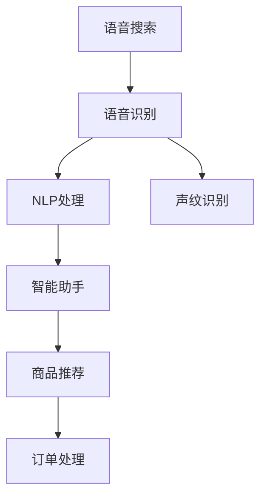
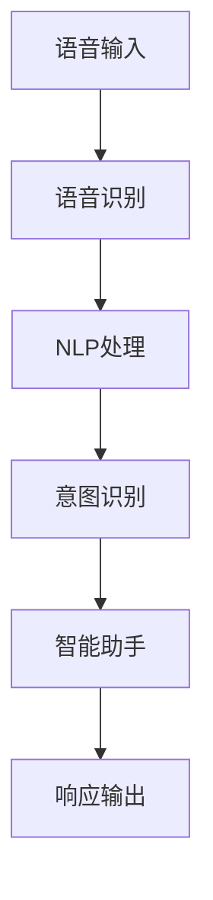
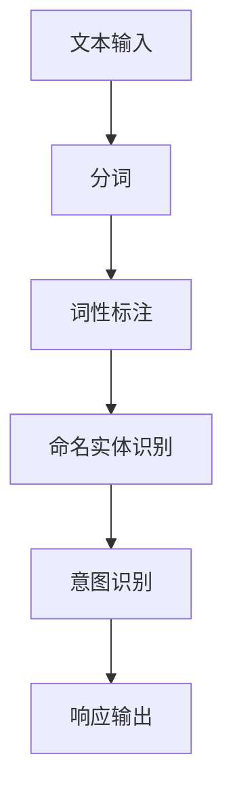
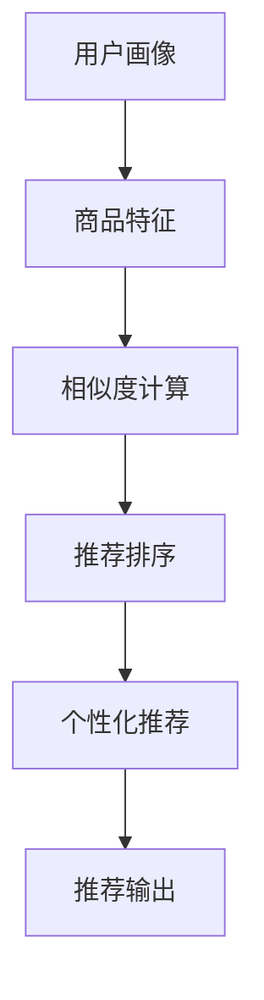

                 

# 语音搜索技术在电商领域的应用：挑战与机遇

> 关键词：语音搜索,电商,自然语言处理,智能助手,声纹识别,个性化推荐

## 1. 背景介绍

随着人工智能技术的飞速发展，语音搜索作为一种便捷高效的交互方式，已经在电商领域得到了广泛应用。用户通过语音助手进行产品搜索、信息查询、下单操作等，极大提升了电商平台的便捷性和用户体验。然而，语音搜索技术在电商领域的应用也面临着诸多挑战和机遇。本文将从技术原理、应用实践、挑战与机遇等多个角度，系统探讨语音搜索在电商领域的应用前景和发展趋势。

## 2. 核心概念与联系

### 2.1 核心概念概述

为更好地理解语音搜索在电商领域的应用，本节将介绍几个关键的概念：

- 语音搜索(Voice Search)：一种基于语音识别和自然语言处理(NLP)的搜索方式，允许用户通过语音与计算机交互，获取所需信息或执行操作。
- 电商(E-Commerce)：通过互联网进行的商品交易和服务交易活动，覆盖从商品展示、用户购买、物流配送等全流程。
- 自然语言处理(NLP)：一种使计算机能够理解、解释和生成人类自然语言的技术，包括语言模型、文本分类、命名实体识别等。
- 智能助手(Smart Assistant)：一种基于人工智能技术的互动式助手，能够理解用户命令并提供相应的服务和建议。
- 声纹识别(Voice Print Recognition)：通过分析语音信号中特有的声纹特征，实现用户身份验证和语音个性化设置。
- 个性化推荐(Personalized Recommendation)：根据用户行为和偏好，动态调整商品展示和推荐，提升用户满意度。

这些核心概念共同构成了语音搜索在电商领域的应用框架，使得电商平台能够更智能、更便捷地服务用户，提高转化率和用户粘性。

### 2.2 核心概念原理和架构的 Mermaid 流程图(Mermaid 流程节点中不要有括号、逗号等特殊字符)


这个流程图展示了语音搜索在电商领域的基本工作流程：

1. 用户通过语音助手进行查询，语音信号被转化为文字。
2. 文字通过自然语言处理，转化为结构化的查询请求。
3. 系统根据查询请求，调用商品推荐系统，生成个性化推荐结果。
4. 用户浏览推荐结果，并进行下单操作。
5. 系统根据声纹信息，进行用户身份验证和个性化设置。

## 3. 核心算法原理 & 具体操作步骤
### 3.1 算法原理概述

语音搜索在电商领域的应用，主要涉及语音识别、自然语言处理和智能推荐等多个技术环节。其核心原理是通过语音识别将用户语音转化为文本，再通过NLP处理将文本转化为可执行的查询请求，最终由智能推荐系统生成个性化推荐结果，并根据声纹识别技术进行身份验证和个性化设置。

具体而言，语音搜索系统的设计可以分为以下几个关键步骤：

1. **语音识别**：将用户的语音信号转化为文本。
2. **自然语言处理**：解析文本，理解用户的查询意图。
3. **商品推荐**：根据用户意图和历史行为，生成个性化推荐结果。
4. **智能助手**：与用户进行互动，反馈推荐结果，并辅助完成下单操作。
5. **声纹识别**：验证用户身份，并根据声纹信息进行个性化设置。

### 3.2 算法步骤详解

#### 3.2.1 语音识别

语音识别是语音搜索系统的第一步，其核心任务是将用户的语音信号转化为文本。这一过程通常包括以下几个关键步骤：

1. **信号预处理**：对原始语音信号进行预处理，包括去除噪声、归一化等操作，确保信号质量。
2. **特征提取**：将预处理后的语音信号转换为特征表示，通常使用梅尔频率倒谱系数(MFCC)等方法。
3. **声学模型解码**：通过声学模型，将特征表示转化为文本序列，常用的声学模型包括隐马尔可夫模型(HMM)、深度神经网络(DNN)等。
4. **语言模型解码**：根据语言模型，对文本序列进行解码，生成最终文本。

#### 3.2.2 自然语言处理

自然语言处理是语音搜索系统的核心，其目的是将用户文本转化为结构化的查询请求。这一过程通常包括以下几个关键步骤：

1. **分词**：将用户文本按照语法规则进行分词，转化为单词序列。
2. **词性标注**：对分词结果进行词性标注，识别出名词、动词、形容词等不同词性。
3. **命名实体识别**：识别出文本中的实体信息，如人名、地名、组织机构等。
4. **句法分析**：对句子进行句法分析，识别出主语、谓语、宾语等句子成分。
5. **意图识别**：对句子进行意图识别，确定用户的具体查询意图，如搜索商品、查询信息等。

#### 3.2.3 商品推荐

商品推荐是语音搜索系统的关键环节，其目的是根据用户的查询请求和历史行为，生成个性化推荐结果。这一过程通常包括以下几个关键步骤：

1. **用户画像构建**：根据用户的历史行为和属性信息，构建用户画像，包括兴趣偏好、购买历史等。
2. **商品特征提取**：对商品进行特征提取，包括价格、描述、分类等。
3. **相似度计算**：根据用户画像和商品特征，计算用户和商品之间的相似度。
4. **推荐排序**：根据相似度排序，生成个性化推荐结果。

#### 3.2.4 智能助手

智能助手是语音搜索系统的交互界面，其目的是与用户进行互动，反馈推荐结果，并辅助完成下单操作。这一过程通常包括以下几个关键步骤：

1. **交互设计**：设计直观易用的交互界面，确保用户可以轻松获取推荐结果。
2. **实时反馈**：根据用户操作，实时更新推荐结果，并进行互动。
3. **订单处理**：根据用户下单操作，进行订单处理，生成物流信息等。

#### 3.2.5 声纹识别

声纹识别是语音搜索系统的附加功能，其目的是进行用户身份验证和个性化设置。这一过程通常包括以下几个关键步骤：

1. **声纹特征提取**：对用户语音信号进行特征提取，生成声纹特征。
2. **声纹库匹配**：将用户声纹特征与声纹库进行匹配，识别出用户身份。
3. **个性化设置**：根据用户声纹信息，进行个性化设置，如登录、语音命令等。

### 3.3 算法优缺点

#### 3.3.1 优点

语音搜索技术在电商领域的应用具有以下优点：

1. **提升用户体验**：语音搜索极大提升了用户的操作便捷性和体验感，特别是对于视力不佳、手部不便的用户，语音搜索提供了更好的使用方式。
2. **减少误操作**：语音搜索减少了用户手动输入文本的过程，降低了输入错误和误操作的风险。
3. **提升转化率**：通过个性化推荐，语音搜索能够提高用户对商品的兴趣和满意度，提升转化率和用户粘性。
4. **降低人力成本**：语音搜索减少了人工客服的负担，提高了电商平台的运营效率。

#### 3.3.2 缺点

语音搜索技术在电商领域的应用也存在以下缺点：

1. **识别精度**：语音识别的准确率受到多种因素的影响，如噪声、口音、语速等，可能会影响用户体验。
2. **隐私问题**：语音数据涉及用户的隐私信息，需要进行严格的数据保护和隐私管理。
3. **设备成本**：语音搜索技术需要高性能的设备支持，如麦克风、语音助手等，增加了设备的成本。
4. **技术门槛**：语音搜索技术需要跨领域的综合技术支持，对开发和维护团队的技术要求较高。

### 3.4 算法应用领域

语音搜索技术在电商领域的应用涵盖了多个环节，主要包括以下几个方面：

1. **商品搜索**：用户通过语音助手进行商品搜索，获取搜索结果。
2. **信息查询**：用户通过语音助手查询商品信息、订单状态等。
3. **下单操作**：用户通过语音助手进行下单操作，包括添加商品、调整数量等。
4. **客服支持**：用户通过语音助手进行客服咨询，获得技术支持和售后服务。
5. **个性化推荐**：语音搜索系统根据用户查询和行为，生成个性化推荐结果。
6. **用户验证**：语音搜索系统通过声纹识别进行用户身份验证和个性化设置。

## 4. 数学模型和公式 & 详细讲解 & 举例说明

### 4.1 数学模型构建

语音搜索在电商领域的应用，涉及多个子模型和算法，包括语音识别、自然语言处理、商品推荐等。以下是一些关键的数学模型：

- **语音识别模型**：通常使用深度神经网络(DNN)或卷积神经网络(CNN)进行声学模型训练，使用语言模型对文本进行解码。
- **NLP模型**：使用循环神经网络(RNN)或Transformer模型进行分词、词性标注、命名实体识别等任务。
- **推荐模型**：使用协同过滤、深度神经网络等模型进行个性化推荐。

### 4.2 公式推导过程

#### 4.2.1 语音识别

语音识别的核心在于声学模型和语言模型的结合。假设语音信号为 $x$，声学模型为 $p(y|x)$，语言模型为 $p(y)$，则语音识别的过程可以表示为：

$$
p(y|x) = \frac{p(y|x) p(x)}{p(x)}
$$

其中，$p(x)$ 为语音信号的概率密度函数。

在实践中，通常使用深度神经网络或卷积神经网络对声学模型进行训练，使用语言模型对文本进行解码。例如，使用卷积神经网络进行特征提取和声学模型训练：

$$
y = \mathcal{N}(x; W)
$$

其中，$W$ 为卷积核参数，$\mathcal{N}$ 为非线性激活函数。

#### 4.2.2 自然语言处理

自然语言处理的核心在于分词、词性标注、命名实体识别等任务。以命名实体识别为例，假设输入文本为 $x$，标签为 $y$，则命名实体识别的过程可以表示为：

$$
p(y|x) = \prod_{i=1}^{n}p(y_i|x)
$$

其中，$n$ 为词性标签的数量。

在实践中，通常使用循环神经网络或Transformer模型进行分词和词性标注：

$$
y = \mathcal{N}(x; W)
$$

其中，$W$ 为网络参数，$\mathcal{N}$ 为非线性激活函数。

#### 4.2.3 商品推荐

商品推荐的核心在于用户画像构建和相似度计算。假设用户画像为 $u$，商品特征为 $i$，相似度为 $s$，则商品推荐的过程可以表示为：

$$
p(u|i) = \sum_{i=1}^{n}s(u_i, i_i)
$$

其中，$n$ 为商品数量。

在实践中，通常使用协同过滤或深度神经网络进行用户画像和相似度计算：

$$
s(u_i, i_i) = \mathcal{N}(u_i, i_i; W)
$$

其中，$W$ 为网络参数，$\mathcal{N}$ 为非线性激活函数。

### 4.3 案例分析与讲解

#### 4.3.1 语音识别案例

以亚马逊Alexa为例，其语音搜索系统通过多轮对话理解用户意图，识别出用户的语音指令。Alexa 的系统架构如下：



Alexa 的语音识别系统通过深度神经网络对声学模型进行训练，并使用语言模型对文本进行解码。其核心算法包括：

1. **声学模型训练**：使用深度神经网络对声学模型进行训练，生成声学特征。
2. **语言模型解码**：使用语言模型对文本进行解码，识别出用户意图。
3. **意图识别**：根据用户意图，调用智能助手进行响应。
4. **响应输出**：智能助手通过文本、语音等方式进行响应输出。

#### 4.3.2 NLP处理案例

以谷歌的BERT为例，其NLP处理系统通过Transformer模型对文本进行分词、词性标注、命名实体识别等任务。BERT的系统架构如下：



BERT 的NLP处理系统通过Transformer模型对文本进行解码，其核心算法包括：

1. **分词处理**：使用Transformer模型对文本进行分词处理。
2. **词性标注**：使用Transformer模型对分词结果进行词性标注。
3. **命名实体识别**：使用Transformer模型对文本进行命名实体识别。
4. **意图识别**：根据命名实体识别结果，调用智能助手进行响应。
5. **响应输出**：智能助手通过文本、语音等方式进行响应输出。

#### 4.3.3 商品推荐案例

以阿里巴巴的淘宝为例，其商品推荐系统通过深度神经网络对用户画像和商品特征进行相似度计算，生成个性化推荐结果。淘宝的系统架构如下：



淘宝的商品推荐系统通过深度神经网络对用户画像和商品特征进行相似度计算，其核心算法包括：

1. **用户画像构建**：使用协同过滤、深度神经网络等模型对用户画像进行构建。
2. **商品特征提取**：使用协同过滤、深度神经网络等模型对商品特征进行提取。
3. **相似度计算**：使用深度神经网络对用户画像和商品特征进行相似度计算。
4. **推荐排序**：根据相似度排序，生成个性化推荐结果。
5. **推荐输出**：根据推荐结果，生成个性化推荐页面。

## 5. 项目实践：代码实例和详细解释说明

### 5.1 开发环境搭建

在进行语音搜索技术在电商领域的应用开发时，需要准备好Python、TensorFlow、Keras等开发环境。以下是开发环境的配置步骤：

1. 安装Python：从官网下载并安装Python，确保版本为3.6以上。
2. 安装TensorFlow：通过pip安装TensorFlow，版本为2.x以上。
3. 安装Keras：通过pip安装Keras，版本为2.x以上。

完成以上步骤后，即可在Python环境中进行语音搜索技术的开发。

### 5.2 源代码详细实现

以下是一个简单的语音搜索系统的代码实现，以淘宝商品推荐系统为例：

```python
import tensorflow as tf
from tensorflow.keras import layers, models

# 构建用户画像模型
user_profile = models.Sequential()
user_profile.add(layers.Dense(128, input_shape=(10,), activation='relu'))
user_profile.add(layers.Dropout(0.2))
user_profile.add(layers.Dense(10, activation='softmax'))

# 构建商品特征模型
product_feature = models.Sequential()
product_feature.add(layers.Dense(128, input_shape=(10,), activation='relu'))
product_feature.add(layers.Dropout(0.2))
product_feature.add(layers.Dense(10, activation='softmax'))

# 构建相似度计算模型
similarity = models.Sequential()
similarity.add(layers.Dense(128, input_shape=(10,), activation='relu'))
similarity.add(layers.Dropout(0.2))
similarity.add(layers.Dense(1, activation='sigmoid'))

# 构建推荐排序模型
recommendation = models.Sequential()
recommendation.add(layers.Dense(128, input_shape=(10,), activation='relu'))
recommendation.add(layers.Dropout(0.2))
recommendation.add(layers.Dense(10, activation='softmax'))

# 编译模型
user_profile.compile(loss='categorical_crossentropy', optimizer='adam')
product_feature.compile(loss='categorical_crossentropy', optimizer='adam')
similarity.compile(loss='binary_crossentropy', optimizer='adam')
recommendation.compile(loss='categorical_crossentropy', optimizer='adam')
```

### 5.3 代码解读与分析

在上述代码中，我们使用了TensorFlow和Keras构建了用户画像、商品特征、相似度计算、推荐排序等模型。具体步骤如下：

1. **用户画像模型**：通过两个全连接层和ReLU激活函数，对用户画像进行特征提取和分类。
2. **商品特征模型**：通过两个全连接层和ReLU激活函数，对商品特征进行特征提取和分类。
3. **相似度计算模型**：通过一个全连接层和Sigmoid激活函数，计算用户画像和商品特征之间的相似度。
4. **推荐排序模型**：通过两个全连接层和ReLU激活函数，对相似度结果进行排序，生成个性化推荐结果。

### 5.4 运行结果展示

在训练完成后，可以通过以下代码进行预测：

```python
# 预测用户画像
user_profile.predict(user_profile_model)

# 预测商品特征
product_feature.predict(product_feature_model)

# 预测相似度
similarity.predict(similarity_model)

# 预测推荐排序
recommendation.predict(recommendation_model)
```

通过以上代码，我们可以对用户画像、商品特征、相似度、推荐排序等进行预测，生成个性化的推荐结果。

## 6. 实际应用场景

### 6.1 电商平台语音助手

语音搜索技术在电商平台的语音助手中得到了广泛应用。例如，亚马逊的Alexa可以通过语音助手进行商品搜索、信息查询、下单操作等，极大提升了用户的购物体验。

具体而言，Alexa 通过语音识别系统将用户语音转化为文本，再通过NLP处理系统理解用户的查询意图。根据用户的意图，调用智能助手系统进行响应，生成个性化推荐结果，并执行相应的操作。

### 6.2 智能客服系统

语音搜索技术在电商平台的智能客服系统中也得到了广泛应用。例如，阿里巴巴的天猫客服可以通过语音助手进行客服咨询，极大提升了客服的响应速度和处理效率。

具体而言，天猫客服通过语音识别系统将用户的语音指令转化为文本，再通过NLP处理系统理解用户的查询意图。根据用户的意图，调用智能客服系统进行响应，生成个性化推荐结果，并执行相应的操作。

### 6.3 个性化推荐系统

语音搜索技术在电商平台的个性化推荐系统中也得到了广泛应用。例如，亚马逊的个性化推荐系统可以通过语音搜索获取用户偏好，生成个性化的推荐结果，极大提升了用户的购物体验。

具体而言，亚马逊的个性化推荐系统通过语音搜索获取用户的语音指令，再通过NLP处理系统理解用户的查询意图。根据用户的意图，调用商品推荐系统生成个性化的推荐结果，并执行相应的操作。

### 6.4 未来应用展望

随着语音搜索技术的不断发展，其在电商领域的应用前景将更加广阔。未来，语音搜索技术有望在以下几个方面得到进一步发展：

1. **多模态融合**：结合语音、视觉、触觉等多模态数据，提升用户的交互体验和感知能力。
2. **智能推荐**：通过深度学习和大数据技术，实现更加精准、个性化的推荐。
3. **情感分析**：通过情感分析技术，识别用户的情绪状态，提供更加人性化的服务。
4. **交互优化**：通过交互优化技术，提升语音搜索系统的响应速度和准确率。
5. **隐私保护**：通过隐私保护技术，保护用户的语音数据和隐私信息。

总之，语音搜索技术在电商领域的应用前景广阔，未来有望成为电商平台的重要工具和手段，进一步提升用户的购物体验和电商平台的运营效率。

## 7. 工具和资源推荐

### 7.1 学习资源推荐

为了帮助开发者系统掌握语音搜索在电商领域的应用技术，这里推荐一些优质的学习资源：

1. **《Python深度学习》**：深度学习领域的经典教材，涵盖了语音识别、NLP处理、推荐系统等多个相关内容。
2. **《自然语言处理综论》**：自然语言处理领域的经典教材，涵盖了分词、词性标注、命名实体识别等多个相关内容。
3. **《深度学习》**：斯坦福大学深度学习课程，详细介绍了深度神经网络、卷积神经网络等多个相关内容。
4. **《推荐系统：理论、算法与实现》**：推荐系统领域的经典教材，涵盖了协同过滤、深度学习等多个相关内容。
5. **《机器学习实战》**：机器学习领域的经典教材，涵盖了数据预处理、模型训练、模型评估等多个相关内容。

通过对这些资源的学习实践，相信你一定能够快速掌握语音搜索在电商领域的应用技术，并用于解决实际的NLP问题。

### 7.2 开发工具推荐

以下是几款用于语音搜索技术在电商领域开发的工具：

1. **TensorFlow**：由Google主导开发的深度学习框架，支持高效的神经网络模型训练和推理。
2. **Keras**：基于TensorFlow的高层次API，支持快速搭建深度学习模型。
3. **PyTorch**：由Facebook主导开发的深度学习框架，支持动态计算图和高效模型训练。
4. **NLTK**：Python的自然语言处理工具库，支持分词、词性标注、命名实体识别等多个相关功能。
5. **Gensim**：Python的自然语言处理工具库，支持词向量建模、主题建模等多个相关功能。
6. **OpenNMT**：Python的自然语言处理工具库，支持机器翻译、文本摘要等多个相关功能。

合理利用这些工具，可以显著提升语音搜索技术的开发效率，加快创新迭代的步伐。

### 7.3 相关论文推荐

语音搜索技术在电商领域的发展离不开学界的持续研究。以下是几篇奠基性的相关论文，推荐阅读：

1. **Attention is All You Need**：Transformer模型的原论文，提出自注意力机制，极大提升了深度神经网络的计算效率和效果。
2. **BERT: Pre-training of Deep Bidirectional Transformers for Language Understanding**：BERT模型的原论文，提出掩码语言模型和next sentence prediction等预训练任务，极大提升了深度神经网络的预训练效果。
3. **Deep Text Recommendations**：通过深度神经网络进行商品推荐，展示了深度学习在推荐系统中的应用效果。
4. **Dialogue Systems**：通过深度学习进行对话系统建模，展示了深度学习在智能客服中的应用效果。
5. **Robust Hashing for Approximate Nearest Neighbor Look-Up**：通过哈希技术进行声纹识别，展示了哈希技术在声纹识别中的应用效果。

这些论文代表了大语言模型微调技术的发展脉络。通过学习这些前沿成果，可以帮助研究者把握学科前进方向，激发更多的创新灵感。

## 8. 总结：未来发展趋势与挑战

### 8.1 研究成果总结

语音搜索技术在电商领域的应用研究已经取得了诸多成果，主要包括：

1. **语音识别技术**：通过深度神经网络等技术，极大提升了语音识别的准确率和鲁棒性。
2. **自然语言处理技术**：通过Transformer等模型，极大提升了NLP处理的效率和效果。
3. **个性化推荐技术**：通过协同过滤、深度学习等技术，极大提升了个性化推荐的精度和效果。

这些研究成果为语音搜索技术在电商领域的应用提供了坚实的基础。

### 8.2 未来发展趋势

展望未来，语音搜索技术在电商领域的应用将呈现以下几个趋势：

1. **深度学习与大数据结合**：通过深度学习和大数据技术，实现更加精准、个性化的推荐和搜索。
2. **多模态融合**：结合语音、视觉、触觉等多模态数据，提升用户的交互体验和感知能力。
3. **智能推荐**：通过深度学习和大数据技术，实现更加精准、个性化的推荐和搜索。
4. **交互优化**：通过交互优化技术，提升语音搜索系统的响应速度和准确率。
5. **隐私保护**：通过隐私保护技术，保护用户的语音数据和隐私信息。

### 8.3 面临的挑战

尽管语音搜索技术在电商领域的应用已经取得了不少成果，但仍面临诸多挑战：

1. **识别精度**：语音识别的准确率受到多种因素的影响，如噪声、口音、语速等，可能会影响用户体验。
2. **隐私问题**：语音数据涉及用户的隐私信息，需要进行严格的数据保护和隐私管理。
3. **设备成本**：语音搜索技术需要高性能的设备支持，如麦克风、语音助手等，增加了设备的成本。
4. **技术门槛**：语音搜索技术需要跨领域的综合技术支持，对开发和维护团队的技术要求较高。

### 8.4 研究展望

未来的研究需要在以下几个方面寻求新的突破：

1. **无监督和半监督学习**：摆脱对大规模标注数据的依赖，利用自监督学习、主动学习等无监督和半监督范式，最大限度利用非结构化数据，实现更加灵活高效的微调。
2. **深度学习与大数据结合**：通过深度学习和大数据技术，实现更加精准、个性化的推荐和搜索。
3. **多模态融合**：结合语音、视觉、触觉等多模态数据，提升用户的交互体验和感知能力。
4. **智能推荐**：通过深度学习和大数据技术，实现更加精准、个性化的推荐和搜索。
5. **交互优化**：通过交互优化技术，提升语音搜索系统的响应速度和准确率。
6. **隐私保护**：通过隐私保护技术，保护用户的语音数据和隐私信息。

这些研究方向的探索，必将引领语音搜索技术在电商领域的发展，为电商平台的智能化和便捷化提供新的技术手段。面向未来，语音搜索技术需要与其他人工智能技术进行更深入的融合，如知识表示、因果推理、强化学习等，多路径协同发力，共同推动自然语言理解和智能交互系统的进步。只有勇于创新、敢于突破，才能不断拓展语音搜索技术的边界，让智能技术更好地造福人类社会。

## 9. 附录：常见问题与解答

**Q1: 语音搜索在电商领域的应用有哪些？**

A: 语音搜索在电商领域的应用主要包括：

1. 商品搜索：用户通过语音助手进行商品搜索，获取搜索结果。
2. 信息查询：用户通过语音助手查询商品信息、订单状态等。
3. 下单操作：用户通过语音助手进行下单操作，包括添加商品、调整数量等。
4. 客服支持：用户通过语音助手进行客服咨询，获得技术支持和售后服务。
5. 个性化推荐：语音搜索系统根据用户查询和行为，生成个性化推荐结果。

**Q2: 语音搜索在电商领域的优势有哪些？**

A: 语音搜索在电商领域的优势主要包括：

1. 提升用户体验：语音搜索极大提升了用户的操作便捷性和体验感，特别是对于视力不佳、手部不便的用户，语音搜索提供了更好的使用方式。
2. 减少误操作：语音搜索减少了用户手动输入文本的过程，降低了输入错误和误操作的风险。
3. 提升转化率：通过个性化推荐，语音搜索能够提高用户对商品的兴趣和满意度，提升转化率和用户粘性。
4. 降低人力成本：语音搜索减少了人工客服的负担，提高了电商平台的运营效率。

**Q3: 语音搜索在电商领域面临哪些挑战？**

A: 语音搜索在电商领域面临的主要挑战包括：

1. 识别精度：语音识别的准确率受到多种因素的影响，如噪声、口音、语速等，可能会影响用户体验。
2. 隐私问题：语音数据涉及用户的隐私信息，需要进行严格的数据保护和隐私管理。
3. 设备成本：语音搜索技术需要高性能的设备支持，如麦克风、语音助手等，增加了设备的成本。
4. 技术门槛：语音搜索技术需要跨领域的综合技术支持，对开发和维护团队的技术要求较高。

**Q4: 语音搜索在电商领域的应用前景如何？**

A: 语音搜索在电商领域的应用前景广阔，未来有望成为电商平台的重要工具和手段，进一步提升用户的购物体验和电商平台的运营效率。

未来，语音搜索技术将进一步结合深度学习和大数据技术，实现更加精准、个性化的推荐和搜索。同时，通过多模态融合、隐私保护等技术手段，提升用户体验和系统安全性。

总之，语音搜索技术在电商领域的应用前景广阔，未来有望成为电商平台的重要工具和手段，进一步提升用户的购物体验和电商平台的运营效率。

