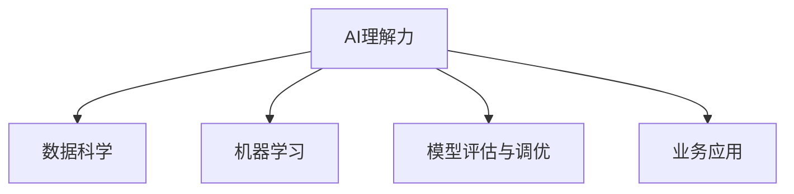

                 

# 贾扬清的建议：培养团队的AI理解力，并将AI应用于业务

> 关键词：AI理解力, 业务应用, 数据科学, 技术创新, 企业智能化

## 1. 背景介绍

### 1.1 问题由来
在当下数字经济时代，人工智能（AI）正迅速渗透各行各业，成为驱动企业创新和增长的关键引擎。然而，许多企业在尝试将AI应用于业务时，往往面临重重挑战。一方面，AI技术复杂，非专业人士难以理解；另一方面，企业在实际应用AI时，常常缺乏系统的AI理解和数据科学能力，导致AI项目的成功率不高，甚至陷入失败。

### 1.2 问题核心关键点
为了让企业在AI领域取得成功，培养团队的AI理解力和提升数据科学能力成为关键。AI理解力不仅包括对AI技术的理解，还包括对数据科学、机器学习算法、模型评估与调优等方面的深刻理解。只有具备了这些能力，才能更好地将AI应用于业务，推动企业智能化转型。

### 1.3 问题研究意义
提升团队的AI理解力和将AI应用于业务，对于加速企业智能化进程、提升业务效率、增强企业竞争力具有重要意义。具体来说：

- **提升决策质量**：通过数据驱动的AI决策，企业可以更准确地把握市场动态，做出更为科学的业务决策。
- **降低运营成本**：AI技术可以自动化处理大量重复性工作，减少人力投入，提升运营效率。
- **拓展创新能力**：AI技术的引入可以激发企业内部的创新能力，推动产品和服务创新。
- **增强客户体验**：通过AI技术优化客户服务流程，提升客户满意度和忠诚度。

## 2. 核心概念与联系

### 2.1 核心概念概述

为更好地理解AI在业务中的应用，本节将介绍几个密切相关的核心概念：

- **AI理解力**：指团队成员对AI技术、数据科学、机器学习算法的深刻理解和应用能力。
- **数据科学**：涉及数据收集、处理、分析、可视化等环节，是AI应用的基础。
- **机器学习**：通过算法和模型对数据进行学习和预测，是AI的核心技术。
- **模型评估与调优**：包括模型训练、验证、测试等环节，是提升AI模型性能的关键步骤。
- **业务应用**：指将AI技术应用于企业具体业务场景，实现业务目标。

这些概念之间的逻辑关系可以通过以下Mermaid流程图来展示：



这个流程图展示了几大核心概念之间的逻辑关系：

1. 团队具备AI理解力，是理解和应用数据科学、机器学习等AI技术的基础。
2. 数据科学是AI应用的基石，为模型训练提供数据支持。
3. 机器学习通过算法和模型对数据进行学习和预测，是AI的核心。
4. 模型评估与调优确保AI模型性能，提升应用效果。
5. 业务应用将AI技术落地到企业具体场景，实现商业价值。

## 3. 核心算法原理 & 具体操作步骤

### 3.1 算法原理概述

将AI应用于业务，其核心在于构建数据驱动的智能系统。这通常涉及以下步骤：

1. **数据收集与预处理**：收集业务相关的数据，进行清洗、标准化等预处理操作。
2. **特征工程**：提取、选择和构造有意义的特征，为模型训练提供输入。
3. **模型选择与训练**：根据业务需求选择合适的模型，并在数据集上进行训练。
4. **模型评估与调优**：使用验证集或测试集对模型进行评估，调整模型参数以提升性能。
5. **模型部署与应用**：将训练好的模型部署到生产环境，实现业务应用。

### 3.2 算法步骤详解

**Step 1: 数据收集与预处理**

- **数据来源**：企业内外部数据（如销售数据、客户反馈、市场数据等）。
- **数据清洗**：处理缺失值、异常值，保证数据质量。
- **特征工程**：提取和构造有意义的特征，如用户行为特征、产品属性特征等。

**Step 2: 特征工程**

- **特征提取**：选择与目标变量相关的特征，如用户购买历史、年龄、性别等。
- **特征选择**：通过统计、信息增益等方法选择对目标变量预测性较高的特征。
- **特征构造**：生成新的特征，如时间窗口内的行为特征、交叉特征等。

**Step 3: 模型选择与训练**

- **模型选择**：根据业务需求和数据特性，选择合适的机器学习模型（如线性回归、决策树、随机森林等）。
- **训练集划分**：将数据集分为训练集和验证集，使用训练集训练模型。
- **模型训练**：使用训练集数据进行模型参数优化，最小化预测误差。

**Step 4: 模型评估与调优**

- **模型评估**：使用验证集对模型进行评估，计算预测误差和准确率等指标。
- **模型调优**：根据评估结果调整模型参数，如学习率、正则化系数等，提升模型性能。
- **过拟合与欠拟合**：使用正则化、交叉验证等技术，避免过拟合和欠拟合问题。

**Step 5: 模型部署与应用**

- **模型部署**：将训练好的模型部署到生产环境，实现实时预测和决策。
- **业务应用**：将AI模型集成到业务系统中，实现自动化决策和优化。
- **监控与优化**：持续监控模型性能，根据业务需求和数据变化进行模型优化。

### 3.3 算法优缺点

**优点：**
- **提升业务决策质量**：通过数据驱动的AI决策，企业可以更准确地把握市场动态，做出更为科学的业务决策。
- **降低运营成本**：AI技术可以自动化处理大量重复性工作，减少人力投入，提升运营效率。
- **拓展创新能力**：AI技术的引入可以激发企业内部的创新能力，推动产品和服务创新。
- **增强客户体验**：通过AI技术优化客户服务流程，提升客户满意度和忠诚度。

**缺点：**
- **数据质量要求高**：AI模型对数据质量有较高要求，数据不完整、不准确会导致模型效果不佳。
- **模型调优复杂**：模型调优过程繁琐，需要反复迭代，耗费时间和资源。
- **技术门槛高**：AI应用涉及复杂的技术环节，对团队技术水平要求较高。
- **应用场景限制**：AI技术在特定业务场景下应用效果较好，但并非所有业务都可以直接应用。

### 3.4 算法应用领域

AI在业务中的应用领域非常广泛，包括但不限于以下几个方面：

- **销售与市场营销**：使用AI进行客户细分、销售预测、广告推荐等。
- **供应链管理**：使用AI进行库存管理、需求预测、供应商优化等。
- **客户服务**：使用AI进行智能客服、客户行为分析、情感分析等。
- **产品研发**：使用AI进行产品推荐、用户需求分析、创新点挖掘等。
- **风险管理**：使用AI进行信用评估、欺诈检测、市场风险预测等。

## 4. 数学模型和公式 & 详细讲解

### 4.1 数学模型构建

假设企业需要预测产品的销售量，其数学模型可以表示为：

$$
\hat{y} = f(x;\theta)
$$

其中 $y$ 表示销售量，$x$ 表示输入的特征向量，$\hat{y}$ 表示预测值，$f(\cdot)$ 表示模型函数，$\theta$ 表示模型参数。

### 4.2 公式推导过程

以线性回归模型为例，其目标是最小化预测值与真实值之间的平方误差：

$$
\min_{\theta} \frac{1}{2N} \sum_{i=1}^N (y_i - \hat{y}_i)^2
$$

其中 $N$ 表示样本数量，$y_i$ 表示真实值，$\hat{y}_i$ 表示预测值。使用梯度下降法求解上述优化问题，得到模型参数 $\theta$ 的更新公式：

$$
\theta_j \leftarrow \theta_j - \frac{\eta}{N} \sum_{i=1}^N (x_{ij} - \bar{x}_{ij})[y_i - \hat{y}_i]
$$

其中 $\eta$ 为学习率，$\bar{x}_{ij}$ 为特征向量的均值，$x_{ij}$ 为第 $i$ 个样本的第 $j$ 个特征值。

### 4.3 案例分析与讲解

假设某电商平台需要预测某产品的月销售量。该平台收集了历史销售数据、广告投放数据、季节性因素等特征，使用线性回归模型进行预测。

**Step 1: 数据收集与预处理**

- **数据来源**：平台历史销售数据、广告投放数据、季节性因素等。
- **数据清洗**：处理缺失值、异常值，保证数据质量。
- **特征工程**：提取和构造有意义的特征，如销售额、广告预算、季节性因素等。

**Step 2: 特征工程**

- **特征提取**：选择与目标变量相关的特征，如销售额、广告预算、季节性因素等。
- **特征选择**：通过统计、信息增益等方法选择对目标变量预测性较高的特征。
- **特征构造**：生成新的特征，如季节性因素的线性组合、广告预算的平方项等。

**Step 3: 模型选择与训练**

- **模型选择**：选择合适的线性回归模型。
- **训练集划分**：将数据集分为训练集和验证集，使用训练集训练模型。
- **模型训练**：使用训练集数据进行模型参数优化，最小化预测误差。

**Step 4: 模型评估与调优**

- **模型评估**：使用验证集对模型进行评估，计算预测误差和准确率等指标。
- **模型调优**：根据评估结果调整模型参数，如学习率、正则化系数等，提升模型性能。
- **过拟合与欠拟合**：使用正则化、交叉验证等技术，避免过拟合和欠拟合问题。

**Step 5: 模型部署与应用**

- **模型部署**：将训练好的线性回归模型部署到生产环境，实现实时预测和决策。
- **业务应用**：将AI模型集成到电商平台，实现广告投放优化、库存管理等。
- **监控与优化**：持续监控模型性能，根据业务需求和数据变化进行模型优化。

## 5. 项目实践：代码实例和详细解释说明

### 5.1 开发环境搭建

在进行AI项目实践前，我们需要准备好开发环境。以下是使用Python进行Scikit-learn开发的开发环境配置流程：

1. 安装Anaconda：从官网下载并安装Anaconda，用于创建独立的Python环境。

2. 创建并激活虚拟环境：
```bash
conda create -n pythenv python=3.8 
conda activate pythenv
```

3. 安装Scikit-learn：
```bash
conda install scikit-learn
```

4. 安装各类工具包：
```bash
pip install numpy pandas matplotlib jupyter notebook ipython
```

完成上述步骤后，即可在`pythenv`环境中开始AI项目实践。

### 5.2 源代码详细实现

下面我们以线性回归为例，给出使用Scikit-learn进行数据科学项目的PyTorch代码实现。

首先，定义数据处理函数：

```python
from sklearn.model_selection import train_test_split
from sklearn.linear_model import LinearRegression

def load_data():
    # 读取数据
    data = pd.read_csv('sales_data.csv')
    
    # 数据清洗
    data.fillna(method='ffill', inplace=True)
    data.dropna(inplace=True)
    
    # 特征工程
    features = data[['销售额', '广告预算', '季节性因素']]
    target = data['销售量']
    
    # 数据划分
    features_train, features_test, target_train, target_test = train_test_split(features, target, test_size=0.2, random_state=42)
    
    return features_train, features_test, target_train, target_test

# 加载数据
features_train, features_test, target_train, target_test = load_data()

# 建立模型
model = LinearRegression()

# 训练模型
model.fit(features_train, target_train)

# 评估模型
score = model.score(features_test, target_test)
print('模型评估得分：', score)
```

然后，定义训练和评估函数：

```python
from sklearn.metrics import mean_squared_error

def train_and_evaluate(model, features_train, features_test, target_train, target_test):
    # 训练模型
    model.fit(features_train, target_train)
    
    # 评估模型
    y_pred = model.predict(features_test)
    mse = mean_squared_error(target_test, y_pred)
    
    # 返回模型和评估结果
    return model, mse
```

最后，启动训练流程并在测试集上评估：

```python
# 训练模型
model, mse = train_and_evaluate(model, features_train, features_test, target_train, target_test)

# 输出评估结果
print('模型评估得分：', mse)
```

以上就是使用Scikit-learn进行线性回归项目开发的完整代码实现。可以看到，得益于Scikit-learn的强大封装，我们可以用相对简洁的代码完成线性回归模型的训练和评估。

### 5.3 代码解读与分析

让我们再详细解读一下关键代码的实现细节：

**load_data函数**：
- `pd.read_csv`：读取CSV格式的数据文件。
- `fillna`：填充缺失值，使用前向填充法。
- `dropna`：删除含有缺失值的行。
- `train_test_split`：将数据划分为训练集和测试集，设定测试集占20%。

**train_and_evaluate函数**：
- `fit`：使用训练集数据进行模型训练。
- `mean_squared_error`：计算预测值与真实值之间的均方误差。
- `return`：返回训练好的模型和评估结果。

**训练流程**：
- 调用`train_and_evaluate`函数，将训练好的模型和评估结果输出。

可以看到，Scikit-learn的封装使得数据科学项目的开发更加便捷高效。开发者可以将更多精力放在数据处理、模型改进等高层逻辑上，而不必过多关注底层的实现细节。

当然，工业级的系统实现还需考虑更多因素，如模型的保存和部署、超参数的自动搜索、更灵活的任务适配层等。但核心的数据科学过程基本与此类似。

## 6. 实际应用场景

### 6.1 智能客服系统

智能客服系统是AI在企业中的应用典型场景之一。通过AI技术，企业可以实现全天候、高效率的客户服务。具体而言，智能客服系统可以自动理解客户意图，匹配最合适的答案模板进行回复，提升客户咨询体验和问题解决效率。

在技术实现上，可以收集企业内部的历史客服对话记录，将问题和最佳答复构建成监督数据，在此基础上对预训练语言模型进行微调。微调后的对话模型能够自动理解用户意图，匹配最合适的答案模板进行回复。对于客户提出的新问题，还可以接入检索系统实时搜索相关内容，动态组织生成回答。

### 6.2 金融舆情监测

金融机构需要实时监测市场舆论动向，以便及时应对负面信息传播，规避金融风险。传统的人工监测方式成本高、效率低，难以应对网络时代海量信息爆发的挑战。基于AI的文本分类和情感分析技术，为金融舆情监测提供了新的解决方案。

具体而言，可以收集金融领域相关的新闻、报道、评论等文本数据，并对其进行主题标注和情感标注。在此基础上对预训练语言模型进行微调，使其能够自动判断文本属于何种主题，情感倾向是正面、中性还是负面。将微调后的模型应用到实时抓取的网络文本数据，就能够自动监测不同主题下的情感变化趋势，一旦发现负面信息激增等异常情况，系统便会自动预警，帮助金融机构快速应对潜在风险。

### 6.3 个性化推荐系统

当前的推荐系统往往只依赖用户的历史行为数据进行物品推荐，无法深入理解用户的真实兴趣偏好。基于AI的个性化推荐系统可以更好地挖掘用户行为背后的语义信息，从而提供更精准、多样的推荐内容。

在实践中，可以收集用户浏览、点击、评论、分享等行为数据，提取和用户交互的物品标题、描述、标签等文本内容。将文本内容作为模型输入，用户的后续行为（如是否点击、购买等）作为监督信号，在此基础上微调预训练语言模型。微调后的模型能够从文本内容中准确把握用户的兴趣点。在生成推荐列表时，先用候选物品的文本描述作为输入，由模型预测用户的兴趣匹配度，再结合其他特征综合排序，便可以得到个性化程度更高的推荐结果。

### 6.4 未来应用展望

随着AI技术的不断发展，其在业务中的应用场景将不断拓展。未来，AI将有望在以下几个领域取得新的突破：

- **医疗健康**：使用AI进行疾病诊断、治疗方案推荐、患者管理等，提升医疗服务质量。
- **智能制造**：使用AI进行生产流程优化、设备维护、质量控制等，推动制造业智能化转型。
- **智慧城市**：使用AI进行交通管理、环境监测、公共安全等，提升城市治理能力。
- **智能家居**：使用AI进行语音识别、行为分析、智能控制等，提升家居智能化水平。
- **金融服务**：使用AI进行风险评估、反欺诈检测、客户服务优化等，提升金融服务质量。

这些领域的应用将进一步推动AI技术的普及和深化，为各行各业带来新的机遇和挑战。

## 7. 工具和资源推荐

### 7.1 学习资源推荐

为了帮助开发者系统掌握AI在业务中的应用，这里推荐一些优质的学习资源：

1. **《机器学习实战》**：这是一本通俗易懂的机器学习入门书籍，适合非专业的技术从业者学习。
2. **Coursera《机器学习》课程**：由斯坦福大学教授Andrew Ng主讲，系统介绍机器学习理论和技术。
3. **Kaggle竞赛平台**：提供大量数据集和机器学习竞赛，帮助开发者实践和提升技能。
4. **TensorFlow官方文档**：提供详细的TensorFlow框架文档，帮助开发者深入理解AI技术。
5. **PyTorch官方文档**：提供详细的PyTorch框架文档，帮助开发者高效实现AI项目。

通过这些资源的学习实践，相信你一定能够快速掌握AI在业务中的应用方法，并用于解决实际的AI问题。

### 7.2 开发工具推荐

高效的开发离不开优秀的工具支持。以下是几款用于AI项目开发的常用工具：

1. **PyTorch**：基于Python的开源深度学习框架，灵活动态的计算图，适合快速迭代研究。
2. **TensorFlow**：由Google主导开发的开源深度学习框架，生产部署方便，适合大规模工程应用。
3. **Scikit-learn**：基于Python的机器学习库，提供丰富的机器学习算法和模型。
4. **Jupyter Notebook**：交互式编程环境，方便开发者快速迭代和共享代码。
5. **PyCharm**：Python开发工具，提供代码补全、调试等功能，提升开发效率。

合理利用这些工具，可以显著提升AI项目的开发效率，加快创新迭代的步伐。

### 7.3 相关论文推荐

AI在业务中的应用源于学界的持续研究。以下是几篇奠基性的相关论文，推荐阅读：

1. **《机器学习》**：Tom Mitchell著，介绍了机器学习的基本概念和算法。
2. **《深度学习》**：Ian Goodfellow等著，介绍了深度学习的基本概念和算法。
3. **《AI驱动的业务创新》**：IBM Watson 团队发表，探讨了AI在各行业中的应用和创新。
4. **《人工智能的未来》**：Futures Workshop组织，探讨了AI技术的未来趋势和应用前景。
5. **《AI驱动的商业模式创新》**：World Economic Forum发表，探讨了AI在商业模式创新中的应用。

这些论文代表了大数据、AI在业务中的应用的发展脉络。通过学习这些前沿成果，可以帮助研究者把握学科前进方向，激发更多的创新灵感。

## 8. 总结：未来发展趋势与挑战

### 8.1 总结

本文对AI在业务中的应用进行了全面系统的介绍。首先阐述了AI理解力和数据科学在AI项目中的重要地位，明确了AI项目开发的系统性要求。其次，从原理到实践，详细讲解了AI项目的各个环节，给出了完整的项目开发代码实例。同时，本文还广泛探讨了AI在多个行业领域的应用前景，展示了AI技术的巨大潜力。此外，本文精选了AI项目开发的各类学习资源，力求为开发者提供全方位的技术指引。

通过本文的系统梳理，可以看到，AI技术在业务中的应用前景广阔，需要企业系统性提升AI理解力和数据科学能力，才能更好地将AI技术落地到实际业务场景中。未来，随着AI技术的不断演进，其在业务中的应用将更加深入和广泛，助力企业智能化转型。

### 8.2 未来发展趋势

展望未来，AI在业务中的应用将呈现以下几个发展趋势：

1. **数据驱动决策**：企业将更加依赖数据驱动的决策，提升决策的科学性和准确性。
2. **自动化流程**：AI技术将自动化处理更多业务流程，提升企业效率。
3. **个性化服务**：AI技术将提供更加个性化、定制化的服务，提升客户体验。
4. **实时分析**：AI技术将实现实时数据分析，提升业务响应速度。
5. **智能管理**：AI技术将应用于企业运营管理，提升管理效率和水平。

这些趋势展示了AI技术在业务中的应用前景，预示着AI将成为企业数字化转型的重要驱动力。

### 8.3 面临的挑战

尽管AI在业务中的应用前景广阔，但在实际落地过程中，仍面临诸多挑战：

1. **数据质量问题**：企业数据往往存在不完整、不准确等问题，影响AI模型的效果。
2. **技术门槛高**：AI项目涉及复杂的技术环节，对团队技术水平要求较高。
3. **数据隐私和安全**：数据隐私和安全问题亟需解决，保障数据安全和用户隐私。
4. **模型解释性不足**：AI模型的决策过程缺乏可解释性，难以理解和调试。
5. **应用场景限制**：并非所有业务都可以直接应用AI技术，需要结合具体业务需求进行适应性调整。

### 8.4 研究展望

面对AI在业务应用中的挑战，未来的研究需要在以下几个方面寻求新的突破：

1. **数据治理**：提升数据质量，建立数据治理体系，保障数据安全和隐私。
2. **模型优化**：开发更高效的模型算法，提升模型性能和解释性。
3. **技术普及**：提升技术普及度，帮助企业系统性提升AI能力。
4. **应用创新**：结合具体业务需求，创新应用场景，提升AI应用效果。

这些研究方向将推动AI在业务中的深入应用，为各行各业带来新的机遇和挑战。

## 9. 附录：常见问题与解答

**Q1：AI理解力对企业有哪些具体作用？**

A: AI理解力对企业有以下具体作用：

1. **提升决策质量**：通过数据驱动的AI决策，企业可以更准确地把握市场动态，做出更为科学的业务决策。
2. **降低运营成本**：AI技术可以自动化处理大量重复性工作，减少人力投入，提升运营效率。
3. **拓展创新能力**：AI技术的引入可以激发企业内部的创新能力，推动产品和服务创新。
4. **增强客户体验**：通过AI技术优化客户服务流程，提升客户满意度和忠诚度。

**Q2：如何提升团队的AI理解力？**

A: 提升团队的AI理解力，可以从以下几个方面入手：

1. **系统性培训**：通过系统性的培训，帮助团队成员了解AI技术和数据科学的基本原理和应用方法。
2. **实战演练**：通过实际的AI项目开发和应用，积累经验和技能，提升团队成员的AI理解力。
3. **跨部门协作**：跨部门协作，推动业务部门与技术部门的紧密配合，提升团队对AI的理解和应用能力。
4. **持续学习**：持续关注AI技术的发展动态，保持对新技术、新方法的敏感度和应用能力。

**Q3：AI项目开发需要哪些关键技能？**

A: AI项目开发需要以下关键技能：

1. **数据科学**：掌握数据收集、处理、分析、可视化等基本技能。
2. **机器学习**：熟悉常见的机器学习算法和模型，能够进行模型选择和调优。
3. **模型评估与调优**：能够对模型进行评估和调优，提升模型性能。
4. **数据治理**：了解数据治理的基本概念和实践，保障数据质量和安全。
5. **项目管理**：具备项目管理能力，能够高效组织和执行AI项目开发。

**Q4：AI项目开发过程中需要注意哪些问题？**

A: AI项目开发过程中需要注意以下问题：

1. **数据质量问题**：保证数据完整、准确、一致，避免因数据问题导致模型效果不佳。
2. **技术实现细节**：注重技术实现细节，避免因技术问题导致项目失败。
3. **模型性能评估**：合理选择评估指标，定期评估模型性能，及时发现和解决模型问题。
4. **应用场景适配**：根据具体业务需求，对AI模型进行适应性调整，确保模型在实际应用中效果良好。
5. **团队协作**：注重团队协作，建立良好的沟通机制，提升项目开发效率。

通过合理规避这些问题，可以提升AI项目的成功率，推动AI技术在业务中的应用。

**Q5：如何实现AI在业务中的大规模应用？**

A: 实现AI在业务中的大规模应用，可以从以下几个方面入手：

1. **建立数据治理体系**：建立完善的数据治理体系，保障数据质量和隐私安全。
2. **开发灵活的AI平台**：开发灵活的AI平台，支持多种AI技术的应用和集成。
3. **持续优化和迭代**：持续优化和迭代AI模型和算法，提升模型性能和应用效果。
4. **应用创新和推广**：结合具体业务需求，创新应用场景，推广AI技术在业务中的应用。
5. **注重用户体验**：注重用户体验，确保AI应用能够提升客户满意度和忠诚度。

通过这些措施，可以推动AI技术在业务中的大规模应用，提升企业的智能化水平。

---

作者：禅与计算机程序设计艺术 / Zen and the Art of Computer Programming

