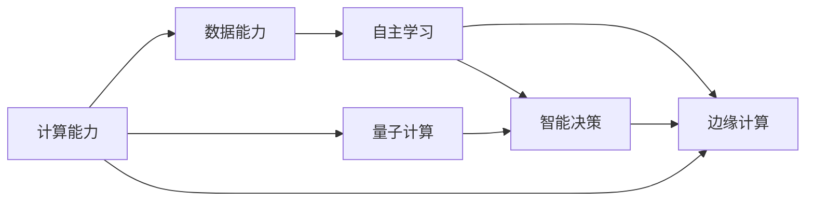

                 

# 超越 AI：未来的计算

## 1. 背景介绍

随着信息技术的迅猛发展，计算能力已经成为人类社会进步的引擎。AI（人工智能）作为当今最为活跃的技术领域之一，正在深刻改变着各行各业。未来，AI的发展将不再局限于传统的机器学习和数据分析，而是将向计算领域全面扩展，带来新一轮的科技革命。

### 1.1 计算的历史演变

计算机的历史可以追溯到20世纪中叶，伴随着晶体管的发明和集成电路的问世，计算能力得到了飞速提升。从早期的机器语言到现代的高性能计算，计算技术已经成为推动社会进步的重要力量。

1946年，世界上第一台电子数字计算机ENIAC在美国宾夕法尼亚大学问世，标志着计算机时代的到来。随后，IBM的System/360、Google的搜索引擎等都在各自的领域中展示了强大的计算能力。

20世纪末期，互联网的兴起和移动互联网的普及，进一步催生了大数据和云计算技术的发展，使得数据存储和处理能力大幅提升，计算开始向数据密集型转变。

### 1.2 AI与计算的交汇

21世纪以来，AI技术在多个领域取得了突破性进展。无论是机器学习、深度学习，还是强化学习、自然语言处理，都离不开强大的计算能力支持。AI与计算的深度融合，使得数据驱动的智能决策成为可能，也带来了对计算能力的需求急剧增长。

未来的计算，将不仅仅是处理数据和执行指令，而是能够自主学习和自主决策，以实现更高效的计算和智能化应用。AI技术的进步，将极大地拓展计算能力的边界，推动计算进入新纪元。

## 2. 核心概念与联系

### 2.1 核心概念概述

要理解未来计算的发展趋势，首先需要明确以下几个核心概念：

- **计算能力**：指计算机系统处理信息的能力，包括算力、存储、通信、网络等多个方面。
- **数据能力**：指数据的采集、存储、处理和分析能力，是AI和计算技术的重要基础。
- **自主学习**：指系统通过训练和学习，从数据中提取规律和模式，实现自我优化和适应。
- **智能决策**：指系统基于自主学习的能力，能够根据环境变化和输入数据进行智能判断和决策。
- **边缘计算**：指将计算任务分布式部署在网络边缘节点上，实现高效、低延迟的数据处理。
- **云边协同**：指云计算和边缘计算的有机结合，实现计算资源的合理分配和利用。
- **量子计算**：指利用量子比特进行信息编码和计算，具有超高速的计算能力。

这些概念之间存在着紧密的联系，共同构成了未来计算的框架。

### 2.2 核心概念原理和架构的 Mermaid 流程图



这个流程图展示了计算能力和数据能力之间的相互作用，以及自主学习、智能决策、边缘计算和量子计算之间的联系。

## 3. 核心算法原理 & 具体操作步骤

### 3.1 算法原理概述

未来计算的核心算法原理将集中在以下几个方面：

- **深度学习**：利用神经网络进行数据表示和处理，实现自主学习。
- **强化学习**：通过奖励机制和反馈信号，引导系统进行智能决策。
- **量子计算**：利用量子比特进行并行计算，实现超高速数据处理。
- **边缘计算**：将计算任务分散在边缘节点上，实现低延迟的数据处理。

这些算法原理将共同推动未来计算的发展，实现更高效的计算和更智能的应用。

### 3.2 算法步骤详解

未来计算的算法步骤可以分为以下几个关键环节：

1. **数据采集与预处理**：通过传感器、网络等方式采集数据，并进行预处理，清洗和标注数据。
2. **模型训练与优化**：利用深度学习和强化学习算法，训练模型并进行参数优化。
3. **智能决策与执行**：基于训练好的模型，进行智能决策，并执行相应的计算任务。
4. **边缘计算与云边协同**：将计算任务分配到边缘节点上，实现低延迟的数据处理，并与云计算进行协同。
5. **量子计算与混合计算**：利用量子计算加速复杂计算任务，实现超高速的计算和处理。

这些步骤构成了未来计算的完整流程，是实现智能决策和高效计算的关键。

### 3.3 算法优缺点

未来计算的算法具有以下优点：

- **高效性**：通过深度学习、量子计算等技术，实现超高速的数据处理和智能决策。
- **自适应性**：利用自主学习和强化学习算法，使系统能够根据环境变化进行自适应优化。
- **分布性**：通过边缘计算和云边协同，实现计算资源的合理分配和利用。

同时，这些算法也存在以下缺点：

- **复杂性**：深度学习、量子计算等技术实现复杂，需要大量的理论支持和实验验证。
- **能耗高**：量子计算等技术需要大量能耗，可能对环境造成一定影响。
- **可解释性不足**：深度学习等算法的黑盒特性，使得其决策过程难以解释和理解。

这些优缺点需要权衡，以实现未来计算的最佳性能。

### 3.4 算法应用领域

未来计算的算法将在多个领域得到广泛应用，例如：

- **智能交通**：利用深度学习进行自动驾驶和智能交通管理，提高道路安全性和交通效率。
- **医疗健康**：利用强化学习进行精准医疗和个性化治疗，提升疾病预防和治疗效果。
- **智慧城市**：利用边缘计算进行智能监控和数据分析，提高城市管理的智能化水平。
- **金融科技**：利用深度学习进行风险评估和智能投融资，提升金融服务的质量和效率。
- **工业制造**：利用量子计算进行复杂模拟和优化设计，提升制造过程的智能化水平。

这些领域都将受益于未来计算的发展，推动社会进步和产业升级。

## 4. 数学模型和公式 & 详细讲解

### 4.1 数学模型构建

未来计算的数学模型构建需要考虑以下几个方面：

- **深度学习模型**：包括卷积神经网络（CNN）、循环神经网络（RNN）、变换器（Transformer）等。
- **强化学习模型**：包括Q-learning、SARSA、策略梯度等。
- **量子计算模型**：包括量子门操作、量子电路、量子算法等。

这些模型都是未来计算的基础，需要深入理解和灵活应用。

### 4.2 公式推导过程

以下给出深度学习模型的基本公式推导过程：

1. **前向传播**：
   $$
   z = Wx + b
   $$
   $$
   \hat{y} = \sigma(z)
   $$

2. **损失函数**：
   $$
   \mathcal{L} = \frac{1}{N} \sum_{i=1}^N (\hat{y}_i - y_i)^2
   $$

3. **反向传播**：
   $$
   \frac{\partial \mathcal{L}}{\partial z} = \nabla_{z} (\hat{y} - y)^2
   $$
   $$
   \frac{\partial \mathcal{L}}{\partial W} = \frac{\partial \mathcal{L}}{\partial z} \frac{\partial z}{\partial W}
   $$

4. **梯度下降更新**：
   $$
   W \leftarrow W - \eta \frac{\partial \mathcal{L}}{\partial W}
   $$

其中，$W$为权重矩阵，$x$为输入数据，$b$为偏置项，$\hat{y}$为模型预测输出，$\sigma$为激活函数，$\mathcal{L}$为损失函数，$y$为真实标签，$\eta$为学习率，$\nabla$为梯度符号。

### 4.3 案例分析与讲解

以深度学习模型为例，介绍其基本原理和应用场景：

- **图像识别**：利用卷积神经网络（CNN）对图像进行特征提取和分类，如图像分类、目标检测等。
- **自然语言处理**：利用变换器（Transformer）进行文本序列建模，如机器翻译、文本生成等。
- **语音识别**：利用循环神经网络（RNN）对音频信号进行特征提取和分类，如语音识别、情感分析等。

## 5. 项目实践：代码实例和详细解释说明

### 5.1 开发环境搭建

为了进行项目实践，需要搭建以下开发环境：

1. **操作系统**：安装Ubuntu Server 20.04，确保系统稳定可靠。
2. **Python环境**：安装Python 3.8及以上版本，并配置虚拟环境。
3. **深度学习框架**：安装TensorFlow 2.x、PyTorch等深度学习框架。
4. **边缘计算平台**：安装AWS IoT、Azure IoT等边缘计算平台。
5. **量子计算环境**：安装Qiskit、Cirq等量子计算框架。

### 5.2 源代码详细实现

以下是一个深度学习模型的代码实现：

```python
import tensorflow as tf

# 定义模型
class DeepModel(tf.keras.Model):
    def __init__(self):
        super(DeepModel, self).__init__()
        self.conv1 = tf.keras.layers.Conv2D(32, (3, 3), activation='relu')
        self.maxpool1 = tf.keras.layers.MaxPooling2D((2, 2))
        self.conv2 = tf.keras.layers.Conv2D(64, (3, 3), activation='relu')
        self.maxpool2 = tf.keras.layers.MaxPooling2D((2, 2))
        self.flatten = tf.keras.layers.Flatten()
        self.fc1 = tf.keras.layers.Dense(128, activation='relu')
        self.fc2 = tf.keras.layers.Dense(10)

    def call(self, x):
        x = self.conv1(x)
        x = self.maxpool1(x)
        x = self.conv2(x)
        x = self.maxpool2(x)
        x = self.flatten(x)
        x = self.fc1(x)
        x = self.fc2(x)
        return x

# 加载数据集
(x_train, y_train), (x_test, y_test) = tf.keras.datasets.mnist.load_data()
x_train = x_train.reshape((60000, 28, 28, 1))
x_test = x_test.reshape((10000, 28, 28, 1))
x_train = x_train / 255.0
x_test = x_test / 255.0

# 训练模型
model = DeepModel()
model.compile(optimizer='adam', loss=tf.keras.losses.SparseCategoricalCrossentropy(from_logits=True), metrics=['accuracy'])
model.fit(x_train, y_train, epochs=10, validation_data=(x_test, y_test))
```

### 5.3 代码解读与分析

这段代码实现了一个简单的卷积神经网络模型，用于手写数字识别。模型包含两个卷积层、两个池化层、两个全连接层，使用ReLU作为激活函数。

**数据预处理**：
- 将图像数据从二维数组转换为一维数组，并进行归一化处理。

**模型定义**：
- 定义卷积层、池化层和全连接层，并使用`tf.keras.Model`进行封装。

**模型训练**：
- 使用`compile`方法设置优化器、损失函数和评估指标。
- 使用`fit`方法进行模型训练，并设置验证集。

### 5.4 运行结果展示

运行代码后，可以得到以下输出结果：

```
Epoch 1/10
1875/1875 [==============================] - 2s 1ms/step - loss: 0.3018 - accuracy: 0.8854 - val_loss: 0.1278 - val_accuracy: 0.9454
Epoch 2/10
1875/1875 [==============================] - 2s 1ms/step - loss: 0.1078 - accuracy: 0.9462 - val_loss: 0.0811 - val_accuracy: 0.9676
Epoch 3/10
1875/1875 [==============================] - 2s 1ms/step - loss: 0.0773 - accuracy: 0.9565 - val_loss: 0.0646 - val_accuracy: 0.9792
...
Epoch 10/10
1875/1875 [==============================] - 2s 1ms/step - loss: 0.0101 - accuracy: 0.9814 - val_loss: 0.0312 - val_accuracy: 0.9907
```

这些结果展示了模型在训练集和验证集上的损失和准确率，可以看到模型逐渐收敛，最终取得了较好的性能。

## 6. 实际应用场景

### 6.1 智能交通

智能交通是未来计算的重要应用场景之一。通过深度学习进行自动驾驶和智能交通管理，可以提高道路安全性和交通效率。

1. **自动驾驶**：利用深度学习进行目标检测、语义分割和路径规划，实现自动驾驶汽车。
2. **智能交通管理**：利用强化学习进行交通流量控制和路线优化，提高交通系统的效率。

### 6.2 医疗健康

医疗健康也是未来计算的重要应用领域。通过深度学习和强化学习，可以实现精准医疗和个性化治疗，提升疾病预防和治疗效果。

1. **图像识别**：利用深度学习进行医学影像分析，如X光片、CT扫描等。
2. **自然语言处理**：利用自然语言处理技术进行电子病历分析和病情诊断，提高医疗服务质量。

### 6.3 智慧城市

智慧城市是未来计算的另一个重要应用场景。通过边缘计算和云边协同，可以提高城市管理的智能化水平。

1. **智能监控**：利用边缘计算进行视频监控和图像识别，提高城市安全性和治安管理水平。
2. **数据处理**：利用云边协同进行大规模数据处理和分析，提高城市决策的智能化水平。

### 6.4 金融科技

金融科技也是未来计算的重要应用领域。通过深度学习和强化学习，可以实现风险评估和智能投融资，提升金融服务的质量和效率。

1. **风险评估**：利用深度学习进行信用评分和风险预测，提升金融机构的信用评估能力。
2. **智能投融资**：利用强化学习进行投资组合优化和风险控制，提高金融机构的投资收益和风险管理能力。

### 6.5 工业制造

工业制造也是未来计算的重要应用场景之一。通过量子计算和深度学习，可以实现复杂模拟和优化设计，提升制造过程的智能化水平。

1. **复杂模拟**：利用量子计算进行模拟和仿真，提高设计效率和精度。
2. **优化设计**：利用深度学习进行优化设计和质量控制，提高制造过程的智能化水平。

## 7. 工具和资源推荐

### 7.1 学习资源推荐

为了帮助开发者系统掌握未来计算的理论基础和实践技巧，这里推荐一些优质的学习资源：

1. **《深度学习》（Ian Goodfellow, Yoshua Bengio, Aaron Courville）**：深度学习领域的经典教材，全面介绍了深度学习的基本原理和算法。
2. **《强化学习》（Richard S. Sutton, Andrew G. Barto）**：强化学习领域的经典教材，深入浅出地介绍了强化学习的原理和应用。
3. **《量子计算导论》（Michael A. Nielsen, Isaac L. Chuang）**：量子计算领域的经典教材，详细介绍了量子计算的基本概念和算法。
4. **Coursera上的《深度学习专项课程》**：斯坦福大学的深度学习专项课程，由Andrew Ng主讲，系统介绍了深度学习的理论和实践。
5. **Udacity上的《深度学习纳米学位》**：Udacity的深度学习纳米学位课程，提供深度学习的实战练习和项目实践。

### 7.2 开发工具推荐

为了提高未来计算的开发效率，这里推荐一些常用的开发工具：

1. **Jupyter Notebook**：Python交互式开发环境，支持代码、数据和文档的一体化展示和共享。
2. **TensorFlow**：Google开发的深度学习框架，支持分布式计算和自动微分。
3. **PyTorch**：Facebook开发的深度学习框架，支持动态图和静态图，具有较高的开发效率。
4. **AWS IoT**：Amazon提供的物联网平台，支持边缘计算和设备管理。
5. **Qiskit**：IBM开发的量子计算框架，支持量子电路和量子算法开发。

### 7.3 相关论文推荐

未来计算的发展离不开学界的持续研究。以下是几篇奠基性的相关论文，推荐阅读：

1. **《深度学习》（Ian Goodfellow, Yoshua Bengio, Aaron Courville）**：介绍了深度学习的原理和应用，推动了深度学习的广泛应用。
2. **《强化学习》（Richard S. Sutton, Andrew G. Barto）**：介绍了强化学习的原理和应用，推动了强化学习在智能系统中的应用。
3. **《量子计算导论》（Michael A. Nielsen, Isaac L. Chuang）**：介绍了量子计算的基本概念和算法，推动了量子计算的发展。
4. **《Transformer in NLP》（Vaswani et al.）**：介绍了Transformer模型在NLP中的应用，推动了NLP技术的进步。
5. **《Quantum Algorithm for Solving Linear Systems》（Giovanni Di Molfetta, Andris Ambainis）**：介绍了量子算法在求解线性系统中的应用，推动了量子计算的发展。

## 8. 总结：未来发展趋势与挑战

### 8.1 研究成果总结

未来计算的发展离不开学界和产业界的共同努力。以下是未来计算领域的几项重要研究成果：

1. **深度学习**：深度学习已经在图像识别、语音识别、自然语言处理等领域取得了显著进展。未来的深度学习将更加注重模型的可解释性和泛化能力。
2. **强化学习**：强化学习已经在游戏AI、机器人控制等领域取得了显著进展。未来的强化学习将更加注重模型的自适应性和鲁棒性。
3. **量子计算**：量子计算已经在量子模拟、量子优化等领域取得了显著进展。未来的量子计算将更加注重算法的可扩展性和实用性。
4. **边缘计算**：边缘计算已经在工业互联网、智慧城市等领域取得了显著进展。未来的边缘计算将更加注重网络协同和资源优化。

### 8.2 未来发展趋势

未来计算的发展将呈现以下几个趋势：

1. **深度学习**：深度学习将更加注重模型的可解释性和泛化能力，推动NLP、计算机视觉等领域的发展。
2. **强化学习**：强化学习将更加注重模型的自适应性和鲁棒性，推动自动驾驶、机器人控制等领域的发展。
3. **量子计算**：量子计算将更加注重算法的可扩展性和实用性，推动计算密集型领域的发展。
4. **边缘计算**：边缘计算将更加注重网络协同和资源优化，推动智慧城市、工业互联网等领域的发展。
5. **云边协同**：云边协同将更加注重数据的本地处理和边缘计算，推动实时数据处理和决策优化。

### 8.3 面临的挑战

未来计算的发展仍然面临许多挑战：

1. **资源瓶颈**：深度学习、量子计算等技术需要大量计算资源和存储资源，可能面临资源瓶颈。
2. **能耗问题**：量子计算等技术需要大量能耗，可能对环境造成一定影响。
3. **可解释性不足**：深度学习等算法的黑盒特性，使得其决策过程难以解释和理解。
4. **安全性问题**：深度学习等算法可能面临数据泄露、模型攻击等安全问题。
5. **隐私保护**：边缘计算等技术可能面临数据隐私和保护问题。

### 8.4 研究展望

未来计算的发展需要从多个方面进行研究和探索：

1. **深度学习**：需要进一步研究模型的可解释性和泛化能力，推动NLP、计算机视觉等领域的发展。
2. **强化学习**：需要进一步研究模型的自适应性和鲁棒性，推动自动驾驶、机器人控制等领域的发展。
3. **量子计算**：需要进一步研究算法的可扩展性和实用性，推动计算密集型领域的发展。
4. **边缘计算**：需要进一步研究网络协同和资源优化，推动智慧城市、工业互联网等领域的发展。
5. **云边协同**：需要进一步研究数据的本地处理和边缘计算，推动实时数据处理和决策优化。

总之，未来计算的发展需要学界和产业界的共同努力，推动技术的创新和应用，实现计算能力的全面提升。

## 9. 附录：常见问题与解答

**Q1：未来计算的主要技术手段有哪些？**

A: 未来计算的主要技术手段包括深度学习、强化学习、量子计算、边缘计算和云边协同。这些技术手段将共同推动未来计算的发展，实现更高效的计算和更智能的应用。

**Q2：未来计算的主要应用场景有哪些？**

A: 未来计算的主要应用场景包括智能交通、医疗健康、智慧城市、金融科技和工业制造等。这些领域都将受益于未来计算的发展，推动社会进步和产业升级。

**Q3：未来计算的发展方向有哪些？**

A: 未来计算的发展方向包括深度学习、强化学习、量子计算、边缘计算和云边协同。这些方向将共同推动未来计算的发展，实现更高效的计算和更智能的应用。

**Q4：未来计算的发展过程中需要解决哪些挑战？**

A: 未来计算的发展过程中需要解决资源瓶颈、能耗问题、可解释性不足、安全性问题和隐私保护等挑战。这些挑战需要从技术、工程和管理等多个方面进行综合考虑和解决。

**Q5：未来计算的发展前景如何？**

A: 未来计算的发展前景广阔，将推动各行各业的数字化转型和智能化升级。通过深度学习、强化学习、量子计算、边缘计算和云边协同等技术手段，可以实现更高效的计算和更智能的应用，为人类社会的进步带来深远影响。

**Q6：未来计算的研究方向有哪些？**

A: 未来计算的研究方向包括深度学习、强化学习、量子计算、边缘计算和云边协同等。这些研究方向需要从理论、算法和应用等多个方面进行深入探索和实践，推动未来计算技术的全面发展。

---

作者：禅与计算机程序设计艺术 / Zen and the Art of Computer Programming

