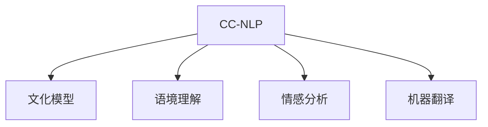

                 

# 跨文化NLP：理解和处理文化差异

> 关键词：跨文化,自然语言处理,文化差异,语境理解,情感分析,机器翻译

## 1. 背景介绍

### 1.1 问题由来
随着全球化进程的推进，跨文化交流变得越来越频繁，跨文化自然语言处理（Cross-Cultural Natural Language Processing, CC-NLP）也逐渐成为NLP领域的热点问题。与单一文化语境下的NLP任务不同，CC-NLP需要在理解多种语言和文化的差异基础上，进行多语言文本的自动处理。例如，跨文化情感分析、机器翻译、信息检索等任务，都对模型提出了更高的要求。

当前，跨文化NLP技术处于快速发展阶段，但仍然面临诸多挑战。文化差异导致的语境理解困难、多语言翻译准确性问题、情感分析偏差等，严重制约了CC-NLP技术的应用。因此，如何理解和处理文化差异，成为一个亟待解决的难题。

### 1.2 问题核心关键点
跨文化NLP的核心挑战在于：
1. 语言和文化的多样性：不同语言和文化背景下的文本，往往具有不同的结构和语义，难以在单一模型中得到统一处理。
2. 语境理解难度：语言文本的含义往往依赖于特定的文化背景和语境，单一的模型难以全面理解和表达这些信息。
3. 情感分析偏差：不同文化对情感的表达和感知方式存在差异，情感分析模型需要具备跨文化识别能力。
4. 机器翻译挑战：跨文化机器翻译需要处理多种语言之间的转换，同时保留不同文化间的语义信息。
5. 数据稀缺性：跨文化数据通常较稀缺，难以获得充足的多语言、多文化标注数据。

针对上述挑战，本文将深入探讨跨文化NLP的核心概念、方法与技术，并给出基于监督学习的跨文化NLP微调方法，以期为跨文化NLP的实践提供有价值的指导。

## 2. 核心概念与联系

### 2.1 核心概念概述

为了更好地理解跨文化NLP的核心概念及其关系，本节将介绍几个关键概念：

- 跨文化自然语言处理(Cross-Cultural Natural Language Processing, CC-NLP)：指在理解和处理不同文化背景下的文本时，考虑语言和文化差异的NLP技术。
- 文化模型(Cultural Model)：描述特定文化背景下文本的生成和理解模型。
- 语境理解(Context Understanding)：指在处理文本时，考虑语境对文本意义的影响。
- 情感分析(Sentiment Analysis)：指对文本中情感信息的自动识别和分类。
- 机器翻译(Machine Translation)：指将一种语言的文本转换为另一种语言的文本，通常用于跨语言交流和翻译。

这些概念之间的逻辑关系可以通过以下Mermaid流程图来展示：



这个流程图展示了两层概念：

1. CC-NLP作为上层的核心概念，连接了文化模型、语境理解、情感分析、机器翻译等具体技术。
2. 文化模型、语境理解、情感分析、机器翻译等概念，是CC-NLP的子概念，各自有着独立的定义和应用场景。

## 3. 核心算法原理 & 具体操作步骤
### 3.1 算法原理概述

基于监督学习的跨文化NLP微调，本质上是一个多任务的迁移学习过程。其核心思想是：将预训练模型视为一种通用的语言表示工具，通过多个文化任务的标注数据进行微调，使得模型能够理解并处理不同文化背景下的语言文本。

形式化地，假设预训练模型为 $M_{\theta}$，其中 $\theta$ 为预训练得到的模型参数。给定多个文化任务的标注数据集 $D=\{(x_i, y_i)\}_{i=1}^N$，其中 $x_i$ 为输入文本，$y_i$ 为标签，代表文本在对应文化任务中的表现。微调的目标是找到新的模型参数 $\hat{\theta}$，使得模型在所有文化任务上的表现均达到最优：

$$
\hat{\theta}=\mathop{\arg\min}_{\theta} \sum_{t=1}^T \mathcal{L}(M_{\theta},D_t)
$$

其中 $T$ 为文化任务的数量，$\mathcal{L}$ 为针对特定文化任务设计的损失函数，用于衡量模型在任务 $t$ 上的预测输出与真实标签之间的差异。

通过梯度下降等优化算法，微调过程不断更新模型参数 $\theta$，最小化总损失函数，使得模型在所有文化任务上的表现逼近理想，从而在跨文化NLP任务上获得优异的性能。

### 3.2 算法步骤详解

基于监督学习的跨文化NLP微调，一般包括以下几个关键步骤：

**Step 1: 准备预训练模型和数据集**
- 选择合适的预训练语言模型 $M_{\theta}$ 作为初始化参数，如 BERT、GPT 等。
- 准备多个文化任务的标注数据集 $D=\{(x_i, y_i)\}_{i=1}^N$，其中每个数据集标注文化任务的属性。

**Step 2: 添加任务适配层**
- 根据每个文化任务的类型，在预训练模型的顶层设计合适的输出层和损失函数。
- 对于分类任务，通常在顶层添加线性分类器和交叉熵损失函数。
- 对于生成任务，通常使用语言模型的解码器输出概率分布，并以负对数似然为损失函数。

**Step 3: 设置微调超参数**
- 选择合适的优化算法及其参数，如 AdamW、SGD 等，设置学习率、批大小、迭代轮数等。
- 设置正则化技术及强度，包括权重衰减、Dropout、Early Stopping等。
- 确定冻结预训练参数的策略，如仅微调顶层，或全部参数都参与微调。

**Step 4: 执行梯度训练**
- 将各文化任务的标注数据集按顺序加入训练集，分批次输入模型，前向传播计算损失函数。
- 反向传播计算参数梯度，根据设定的优化算法和学习率更新模型参数。
- 周期性在验证集上评估模型性能，根据性能指标决定是否触发 Early Stopping。
- 重复上述步骤直至满足预设的迭代轮数或 Early Stopping 条件。

**Step 5: 测试和部署**
- 在测试集上评估微调后模型 $M_{\hat{\theta}}$ 的性能，对比微调前后的精度提升。
- 使用微调后的模型对新样本进行推理预测，集成到实际的应用系统中。
- 持续收集新的数据，定期重新微调模型，以适应数据分布的变化。

以上是基于监督学习微调跨文化NLP的一般流程。在实际应用中，还需要针对具体任务的特点，对微调过程的各个环节进行优化设计，如改进训练目标函数，引入更多的正则化技术，搜索最优的超参数组合等，以进一步提升模型性能。

### 3.3 算法优缺点

基于监督学习的跨文化NLP微调方法具有以下优点：
1. 简单高效。只需准备少量标注数据，即可对预训练模型进行快速适配，获得较大的性能提升。
2. 通用适用。适用于各种跨文化NLP下游任务，包括分类、匹配、生成等，设计简单的任务适配层即可实现微调。
3. 参数高效。利用参数高效微调技术，在固定大部分预训练权重不变的情况下，仍可取得不错的微调效果。
4. 效果显著。在学术界和工业界的诸多任务上，基于微调的方法已经刷新了多项跨文化NLP任务SOTA。

同时，该方法也存在一定的局限性：
1. 依赖标注数据。微调的效果很大程度上取决于标注数据的质量和数量，获取高质量标注数据的成本较高。
2. 迁移能力有限。当目标文化任务与预训练数据的分布差异较大时，微调的性能提升有限。
3. 负面效果传递。预训练模型的固有偏见、有害信息等，可能通过微调传递到下游任务，造成负面影响。
4. 可解释性不足。微调模型的决策过程通常缺乏可解释性，难以对其推理逻辑进行分析和调试。

尽管存在这些局限性，但就目前而言，基于监督学习的微调方法仍是大规模跨文化NLP应用的最主流范式。未来相关研究的重点在于如何进一步降低微调对标注数据的依赖，提高模型的少样本学习和跨文化迁移能力，同时兼顾可解释性和伦理安全性等因素。

### 3.4 算法应用领域

基于大模型微调的跨文化NLP方法，在多种跨文化NLP任务上已经取得了优异的效果，覆盖了几乎所有常见任务，例如：

- 跨文化文本分类：如情感分析、主题分类、意图识别等。通过微调使模型学习不同文化背景下的文本-标签映射。
- 跨文化命名实体识别：识别文本中的人名、地名、机构名等特定实体，同时理解不同文化对实体的命名习惯。
- 跨文化关系抽取：从文本中抽取实体之间的语义关系，同时考虑不同文化对关系的表达方式。
- 跨文化问答系统：对自然语言问题给出答案，同时处理不同文化背景下的问答风格。
- 跨文化机器翻译：将源语言文本翻译成目标语言，同时保留不同文化间的语义信息。
- 跨文化文本摘要：将长文本压缩成简短摘要，同时考虑不同文化的文本表达习惯。
- 跨文化对话系统：使机器能够与人自然对话，同时处理不同文化背景下的对话风格和语境。

除了上述这些经典任务外，跨文化NLP技术也被创新性地应用到更多场景中，如跨文化情感分析、跨文化文本生成、跨文化信息检索等，为NLP技术带来了全新的突破。

## 4. 数学模型和公式 & 详细讲解  
### 4.1 数学模型构建

本节将使用数学语言对基于监督学习的跨文化NLP微调过程进行更加严格的刻画。

记预训练语言模型为 $M_{\theta}$，其中 $\theta$ 为模型参数。假设跨文化NLP任务共有 $T$ 个，分别为 $T_1, T_2, \cdots, T_T$，对应的标注数据集分别为 $D_{t_1}, D_{t_2}, \cdots, D_{t_T}$。

定义模型 $M_{\theta}$ 在数据样本 $(x,y)$ 上的损失函数为 $\ell(M_{\theta}(x),y)$，则在所有文化任务上经验风险为：

$$
\mathcal{L}(\theta) = \frac{1}{N} \sum_{t=1}^T \sum_{i=1}^N \ell(M_{\theta}(x_i),y_i)
$$

微调的优化目标是最小化经验风险，即找到最优参数：

$$
\theta^* = \mathop{\arg\min}_{\theta} \mathcal{L}(\theta)
$$

在实践中，我们通常使用基于梯度的优化算法（如SGD、Adam等）来近似求解上述最优化问题。设 $\eta$ 为学习率，$\lambda$ 为正则化系数，则参数的更新公式为：

$$
\theta \leftarrow \theta - \eta \nabla_{\theta}\mathcal{L}(\theta) - \eta\lambda\theta
$$

其中 $\nabla_{\theta}\mathcal{L}(\theta)$ 为损失函数对参数 $\theta$ 的梯度，可通过反向传播算法高效计算。

### 4.2 公式推导过程

以下我们以二分类任务为例，推导跨文化情感分析的交叉熵损失函数及其梯度的计算公式。

假设模型 $M_{\theta}$ 在输入 $x$ 上的输出为 $\hat{y}=M_{\theta}(x) \in [0,1]$，表示样本属于正类的概率。真实标签 $y \in \{0,1\}$。则二分类交叉熵损失函数定义为：

$$
\ell(M_{\theta}(x),y) = -[y\log \hat{y} + (1-y)\log (1-\hat{y})]
$$

将其代入经验风险公式，得：

$$
\mathcal{L}(\theta) = -\frac{1}{N}\sum_{t=1}^T \sum_{i=1}^N [y_i\log M_{\theta}(x_i)+(1-y_i)\log(1-M_{\theta}(x_i))]
$$

根据链式法则，损失函数对参数 $\theta_k$ 的梯度为：

$$
\frac{\partial \mathcal{L}(\theta)}{\partial \theta_k} = -\frac{1}{N}\sum_{t=1}^T \sum_{i=1}^N (\frac{y_i}{M_{\theta}(x_i)}-\frac{1-y_i}{1-M_{\theta}(x_i)}) \frac{\partial M_{\theta}(x_i)}{\partial \theta_k}
$$

其中 $\frac{\partial M_{\theta}(x_i)}{\partial \theta_k}$ 可进一步递归展开，利用自动微分技术完成计算。

在得到损失函数的梯度后，即可带入参数更新公式，完成模型的迭代优化。重复上述过程直至收敛，最终得到适应跨文化NLP任务的最优模型参数 $\theta^*$。

## 5. 项目实践：代码实例和详细解释说明
### 5.1 开发环境搭建

在进行跨文化NLP微调实践前，我们需要准备好开发环境。以下是使用Python进行PyTorch开发的环境配置流程：

1. 安装Anaconda：从官网下载并安装Anaconda，用于创建独立的Python环境。

2. 创建并激活虚拟环境：
```bash
conda create -n pytorch-env python=3.8 
conda activate pytorch-env
```

3. 安装PyTorch：根据CUDA版本，从官网获取对应的安装命令。例如：
```bash
conda install pytorch torchvision torchaudio cudatoolkit=11.1 -c pytorch -c conda-forge
```

4. 安装Transformers库：
```bash
pip install transformers
```

5. 安装各类工具包：
```bash
pip install numpy pandas scikit-learn matplotlib tqdm jupyter notebook ipython
```

完成上述步骤后，即可在`pytorch-env`环境中开始跨文化NLP微调实践。

### 5.2 源代码详细实现

下面我们以跨文化情感分析任务为例，给出使用Transformers库对BERT模型进行跨文化微调的PyTorch代码实现。

首先，定义跨文化情感分析任务的数据处理函数：

```python
from transformers import BertTokenizer
from torch.utils.data import Dataset
import torch

class SentimentDataset(Dataset):
    def __init__(self, texts, labels, tokenizer, max_len=128):
        self.texts = texts
        self.labels = labels
        self.tokenizer = tokenizer
        self.max_len = max_len
        
    def __len__(self):
        return len(self.texts)
    
    def __getitem__(self, item):
        text = self.texts[item]
        label = self.labels[item]
        
        encoding = self.tokenizer(text, return_tensors='pt', max_length=self.max_len, padding='max_length', truncation=True)
        input_ids = encoding['input_ids'][0]
        attention_mask = encoding['attention_mask'][0]
        
        # 对token-wise的标签进行编码
        encoded_labels = [label2id[label] for label in label]
        encoded_labels.extend([label2id['O']] * (self.max_len - len(encoded_labels)))
        labels = torch.tensor(encoded_labels, dtype=torch.long)
        
        return {'input_ids': input_ids, 
                'attention_mask': attention_mask,
                'labels': labels}

# 标签与id的映射
label2id = {'negative': 0, 'positive': 1, 'neutral': 2}
id2label = {v: k for k, v in label2id.items()}

# 创建dataset
tokenizer = BertTokenizer.from_pretrained('bert-base-cased')

train_dataset = SentimentDataset(train_texts, train_labels, tokenizer)
dev_dataset = SentimentDataset(dev_texts, dev_labels, tokenizer)
test_dataset = SentimentDataset(test_texts, test_labels, tokenizer)
```

然后，定义模型和优化器：

```python
from transformers import BertForTokenClassification, AdamW

model = BertForTokenClassification.from_pretrained('bert-base-cased', num_labels=len(label2id))

optimizer = AdamW(model.parameters(), lr=2e-5)
```

接着，定义训练和评估函数：

```python
from torch.utils.data import DataLoader
from tqdm import tqdm
from sklearn.metrics import classification_report

device = torch.device('cuda') if torch.cuda.is_available() else torch.device('cpu')
model.to(device)

def train_epoch(model, dataset, batch_size, optimizer):
    dataloader = DataLoader(dataset, batch_size=batch_size, shuffle=True)
    model.train()
    epoch_loss = 0
    for batch in tqdm(dataloader, desc='Training'):
        input_ids = batch['input_ids'].to(device)
        attention_mask = batch['attention_mask'].to(device)
        labels = batch['labels'].to(device)
        model.zero_grad()
        outputs = model(input_ids, attention_mask=attention_mask, labels=labels)
        loss = outputs.loss
        epoch_loss += loss.item()
        loss.backward()
        optimizer.step()
    return epoch_loss / len(dataloader)

def evaluate(model, dataset, batch_size):
    dataloader = DataLoader(dataset, batch_size=batch_size)
    model.eval()
    preds, labels = [], []
    with torch.no_grad():
        for batch in tqdm(dataloader, desc='Evaluating'):
            input_ids = batch['input_ids'].to(device)
            attention_mask = batch['attention_mask'].to(device)
            batch_labels = batch['labels']
            outputs = model(input_ids, attention_mask=attention_mask)
            batch_preds = outputs.logits.argmax(dim=2).to('cpu').tolist()
            batch_labels = batch_labels.to('cpu').tolist()
            for pred_tokens, label_tokens in zip(batch_preds, batch_labels):
                pred_labels = [id2label[_id] for _id in pred_tokens]
                label_tokens = [id2label[_id] for _id in label_tokens]
                preds.append(pred_labels[:len(label_tokens)])
                labels.append(label_tokens)
                
    print(classification_report(labels, preds))
```

最后，启动训练流程并在测试集上评估：

```python
epochs = 5
batch_size = 16

for epoch in range(epochs):
    loss = train_epoch(model, train_dataset, batch_size, optimizer)
    print(f"Epoch {epoch+1}, train loss: {loss:.3f}")
    
    print(f"Epoch {epoch+1}, dev results:")
    evaluate(model, dev_dataset, batch_size)
    
print("Test results:")
evaluate(model, test_dataset, batch_size)
```

以上就是使用PyTorch对BERT进行跨文化情感分析任务微调的完整代码实现。可以看到，得益于Transformers库的强大封装，我们可以用相对简洁的代码完成BERT模型的加载和微调。

### 5.3 代码解读与分析

让我们再详细解读一下关键代码的实现细节：

**SentimentDataset类**：
- `__init__`方法：初始化文本、标签、分词器等关键组件。
- `__len__`方法：返回数据集的样本数量。
- `__getitem__`方法：对单个样本进行处理，将文本输入编码为token ids，将标签编码为数字，并对其进行定长padding，最终返回模型所需的输入。

**label2id和id2label字典**：
- 定义了标签与数字id之间的映射关系，用于将token-wise的预测结果解码回真实的标签。

**训练和评估函数**：
- 使用PyTorch的DataLoader对数据集进行批次化加载，供模型训练和推理使用。
- 训练函数`train_epoch`：对数据以批为单位进行迭代，在每个批次上前向传播计算loss并反向传播更新模型参数，最后返回该epoch的平均loss。
- 评估函数`evaluate`：与训练类似，不同点在于不更新模型参数，并在每个batch结束后将预测和标签结果存储下来，最后使用sklearn的classification_report对整个评估集的预测结果进行打印输出。

**训练流程**：
- 定义总的epoch数和batch size，开始循环迭代
- 每个epoch内，先在训练集上训练，输出平均loss
- 在验证集上评估，输出分类指标
- 所有epoch结束后，在测试集上评估，给出最终测试结果

可以看到，PyTorch配合Transformers库使得BERT微调的代码实现变得简洁高效。开发者可以将更多精力放在数据处理、模型改进等高层逻辑上，而不必过多关注底层的实现细节。

当然，工业级的系统实现还需考虑更多因素，如模型的保存和部署、超参数的自动搜索、更灵活的任务适配层等。但核心的微调范式基本与此类似。

## 6. 实际应用场景
### 6.1 跨文化情感分析

跨文化情感分析可以应用于多语言社交媒体、产品评论、新闻报道等场景，帮助企业和政府机构及时了解不同文化背景下的公众情感倾向。例如，一家跨国公司可以收集全球用户对其产品的评论，通过跨文化情感分析，识别出不同地区用户对产品的满意度，并据此优化产品设计和市场策略。

在技术实现上，可以收集各语言版本的产品评论数据，将文本和对应的情感标签构建成监督数据，在此基础上对预训练模型进行跨文化情感分析微调。微调后的模型能够自动理解不同语言和文化背景下的情感表达方式，并准确分类情感标签。对于新评论，可以直接输入模型得到情感分析结果，辅助产品优化和市场策略调整。

### 6.2 跨文化机器翻译

跨文化机器翻译可以用于解决不同语言和文化之间的沟通障碍，帮助用户更高效地获取信息。例如，一家公司需要将一份英文文档翻译成多种语言并发布到不同的市场，跨文化机器翻译可以大大提升翻译效率和质量。

在技术实现上，可以收集多语言版文档数据，将原文和翻译对构建成监督数据，在此基础上对预训练模型进行跨文化机器翻译微调。微调后的模型能够自动将文本从一种语言翻译成另一种语言，同时保留不同文化背景下的语义信息。对于新的文档翻译请求，可以将文档输入模型进行自动翻译，并提供多种语言版本，满足不同文化用户的需求。

### 6.3 跨文化信息检索

跨文化信息检索可以应用于全球性信息服务，帮助用户在全球范围内获取所需信息。例如，一款跨文化搜索引擎可以自动理解用户的查询意图，并从多语言网页中提取相关信息，返回给用户。

在技术实现上，可以收集多语言网页数据，将查询和网页文本构建成监督数据，在此基础上对预训练模型进行跨文化信息检索微调。微调后的模型能够自动理解和匹配不同语言背景下的查询和网页，提供精确的信息检索服务。对于用户的查询请求，模型能够自动识别出查询语言，并从对应语言网页中提取信息，返回给用户。

### 6.4 未来应用展望

随着跨文化NLP技术的发展，其在跨语言交流、信息检索、情感分析等方面的应用前景将越来越广泛。

1. 全球化互联网时代，跨文化NLP技术将在全球性信息服务、跨语言交流等领域发挥重要作用。跨文化机器翻译、跨文化信息检索等技术，将大幅提升全球化互联互通的质量和效率。
2. 在社交媒体、电商平台等数据丰富的场景中，跨文化情感分析技术将帮助企业及时掌握用户情感动态，提升产品和服务质量。
3. 未来，跨文化NLP技术还将在更多领域得到应用，如跨文化对话系统、跨文化文本生成等，为NLP技术带来新的突破。

## 7. 工具和资源推荐
### 7.1 学习资源推荐

为了帮助开发者系统掌握跨文化NLP的理论基础和实践技巧，这里推荐一些优质的学习资源：

1. 《NLP跨文化分析》系列博文：由跨文化NLP研究者撰写，系统讲解了跨文化NLP的基本概念、常见问题及解决方法。

2. 《多语言NLP入门》书籍：介绍了多语言NLP的各个方面，从数据处理到模型构建，涵盖跨文化NLP的核心技术。

3. 《Transformer从原理到实践》系列博文：由大模型技术专家撰写，深入浅出地介绍了Transformer原理、跨文化模型、微调技术等前沿话题。

4. CLUE开源项目：中文语言理解测评基准，涵盖大量不同类型的中文NLP数据集，并提供了基于跨文化微调的baseline模型，助力中文NLP技术发展。

通过对这些资源的学习实践，相信你一定能够快速掌握跨文化NLP的精髓，并用于解决实际的跨文化NLP问题。
###  7.2 开发工具推荐

高效的开发离不开优秀的工具支持。以下是几款用于跨文化NLP微调开发的常用工具：

1. PyTorch：基于Python的开源深度学习框架，灵活动态的计算图，适合快速迭代研究。大部分预训练语言模型都有PyTorch版本的实现。

2. TensorFlow：由Google主导开发的开源深度学习框架，生产部署方便，适合大规模工程应用。同样有丰富的预训练语言模型资源。

3. Transformers库：HuggingFace开发的NLP工具库，集成了众多SOTA语言模型，支持PyTorch和TensorFlow，是进行跨文化NLP微调任务开发的利器。

4. Weights & Biases：模型训练的实验跟踪工具，可以记录和可视化模型训练过程中的各项指标，方便对比和调优。与主流深度学习框架无缝集成。

5. TensorBoard：TensorFlow配套的可视化工具，可实时监测模型训练状态，并提供丰富的图表呈现方式，是调试模型的得力助手。

6. Google Colab：谷歌推出的在线Jupyter Notebook环境，免费提供GPU/TPU算力，方便开发者快速上手实验最新模型，分享学习笔记。

合理利用这些工具，可以显著提升跨文化NLP微调任务的开发效率，加快创新迭代的步伐。

### 7.3 相关论文推荐

跨文化NLP的发展源于学界的持续研究。以下是几篇奠基性的相关论文，推荐阅读：

1. "Cross-lingual Language Model Pretraining"：提出跨语言预训练方法，通过共享语义空间提升跨语言翻译效果。

2. "We-CLUE: A Cascaded Sequence Model for Chinese Question Answering"：提出跨文化问答模型，通过多级序列模型提升跨文化问答精度。

3. "Cross-Lingual Sentence Similarity for Multilingual Sentiment Analysis"：提出跨语言句子相似度模型，通过多语言句子表示提升跨文化情感分析效果。

4. "A Study on Cross-lingual Dependency Parsing"：提出跨语言依存句法分析模型，通过多语言依存句法树提升跨语言理解能力。

5. "Cross-Lingual Named Entity Recognition"：提出跨语言命名实体识别模型，通过多语言命名实体标签提升跨语言信息抽取能力。

这些论文代表了大语言模型跨文化微调技术的发展脉络。通过学习这些前沿成果，可以帮助研究者把握学科前进方向，激发更多的创新灵感。

## 8. 总结：未来发展趋势与挑战
### 8.1 总结

本文对基于监督学习的跨文化NLP微调方法进行了全面系统的介绍。首先阐述了跨文化NLP的研究背景和意义，明确了跨文化NLP微调在拓展预训练模型应用、提升跨文化NLP任务性能方面的独特价值。其次，从原理到实践，详细讲解了跨文化NLP的数学模型和关键步骤，给出了跨文化NLP任务微调代码的完整实现。同时，本文还广泛探讨了跨文化NLP在多语言社交媒体、产品评论、机器翻译等场景中的应用前景，展示了跨文化NLP技术的巨大潜力。此外，本文精选了跨文化NLP技术的各类学习资源，力求为读者提供全方位的技术指引。

通过本文的系统梳理，可以看到，基于大模型的跨文化NLP微调方法正在成为跨文化NLP领域的重要范式，极大地拓展了跨文化NLP模型的应用边界，催生了更多的落地场景。受益于大规模语料的预训练，跨文化NLP模型以更低的时间和标注成本，在小样本条件下也能取得不俗的效果，有力推动了NLP技术的产业化进程。未来，伴随跨文化NLP模型的不断进步，相信NLP技术将在更广阔的应用领域大放异彩，深刻影响人类的生产生活方式。

### 8.2 未来发展趋势

展望未来，跨文化NLP技术将呈现以下几个发展趋势：

1. 跨语言模型的普及：随着跨语言预训练技术的发展，未来跨语言模型将更为普及，不同语言和文化背景下的文本处理将更为高效。

2. 多文化融合的趋势：随着全球化进程的推进，跨文化融合将成为一种趋势。跨文化NLP技术将在理解不同文化背景下的语言表达、情感倾向等方面发挥更大作用。

3. 跨文化数据的多样性：跨文化NLP任务的训练数据将更为多样化，不同文化背景下的多语言数据将得到充分利用。

4. 跨文化模型的泛化能力：未来跨文化NLP模型将具备更强的泛化能力，能够处理更多类型的跨文化任务。

5. 跨文化模型的适应性：未来跨文化NLP模型将具备更强的适应性，能够根据不同文化背景下的数据特征进行自适应调整。

以上趋势凸显了跨文化NLP技术的广阔前景。这些方向的探索发展，必将进一步提升跨文化NLP系统的性能和应用范围，为跨文化交流和智能交互系统的构建提供新的技术路径。

### 8.3 面临的挑战

尽管跨文化NLP技术已经取得了瞩目成就，但在迈向更加智能化、普适化应用的过程中，它仍面临着诸多挑战：

1. 跨文化数据稀缺性：跨文化数据通常较稀缺，难以获得充足的多语言、多文化标注数据。如何有效利用跨文化数据，提高模型的泛化能力，仍是一大难题。

2. 文化差异的复杂性：不同文化背景下的语言表达方式、情感倾向、语境信息等存在较大差异，难以在单一模型中得到全面处理。如何构建更加灵活的跨文化模型，是未来研究的重要方向。

3. 跨文化模型的鲁棒性：跨文化模型在处理新数据时，往往容易受到文化差异的影响，泛化能力不足。如何增强跨文化模型的鲁棒性，避免灾难性遗忘，还需要更多理论和实践的积累。

4. 跨文化模型的可解释性：跨文化模型的决策过程通常缺乏可解释性，难以对其推理逻辑进行分析和调试。如何赋予跨文化模型更强的可解释性，将是亟待攻克的难题。

5. 跨文化模型的安全性：跨文化模型可能会学习到有偏见、有害的信息，通过微调传递到下游任务，产生误导性、歧视性的输出。如何从数据和算法层面消除模型偏见，避免恶意用途，确保输出的安全性，也将是重要的研究课题。

6. 跨文化模型的知识整合能力：现有的跨文化模型往往局限于任务内数据，难以灵活吸收和运用更广泛的先验知识。如何让跨文化过程更好地与外部知识库、规则库等专家知识结合，形成更加全面、准确的信息整合能力，还有很大的想象空间。

正视跨文化NLP面临的这些挑战，积极应对并寻求突破，将是跨文化NLP技术迈向成熟的必由之路。相信随着学界和产业界的共同努力，这些挑战终将一一被克服，跨文化NLP技术必将在构建安全、可靠、可解释、可控的智能系统方面发挥更大作用。

### 8.4 研究展望

面对跨文化NLP所面临的种种挑战，未来的研究需要在以下几个方面寻求新的突破：

1. 探索无监督和半监督跨文化微调方法。摆脱对大规模标注数据的依赖，利用自监督学习、主动学习等无监督和半监督范式，最大限度利用非结构化数据，实现更加灵活高效的跨文化微调。

2. 研究跨文化高效微调方法。开发更加参数高效的跨文化微调方法，在固定大部分预训练参数的同时，只更新极少量的任务相关参数。同时优化跨文化模型的计算图，减少前向传播和反向传播的资源消耗，实现更加轻量级、实时性的部署。

3. 融合因果和对比学习范式。通过引入因果推断和对比学习思想，增强跨文化模型建立稳定因果关系的能力，学习更加普适、鲁棒的语言表征，从而提升模型泛化性和抗干扰能力。

4. 引入更多先验知识。将符号化的先验知识，如知识图谱、逻辑规则等，与神经网络模型进行巧妙融合，引导跨文化微调过程学习更准确、合理的语言模型。同时加强不同模态数据的整合，实现视觉、语音等多模态信息与文本信息的协同建模。

5. 结合因果分析和博弈论工具。将因果分析方法引入跨文化微调模型，识别出模型决策的关键特征，增强输出解释的因果性和逻辑性。借助博弈论工具刻画人机交互过程，主动探索并规避模型的脆弱点，提高系统稳定性。

6. 纳入伦理道德约束。在模型训练目标中引入伦理导向的评估指标，过滤和惩罚有偏见、有害的输出倾向。同时加强人工干预和审核，建立模型行为的监管机制，确保输出符合人类价值观和伦理道德。

这些研究方向的探索，必将引领跨文化NLP技术迈向更高的台阶，为构建安全、可靠、可解释、可控的智能系统铺平道路。面向未来，跨文化NLP技术还需要与其他人工智能技术进行更深入的融合，如知识表示、因果推理、强化学习等，多路径协同发力，共同推动跨文化智能交互系统的进步。只有勇于创新、敢于突破，才能不断拓展跨文化NLP的边界，让智能技术更好地服务于跨文化交流和智能交互。

## 9. 附录：常见问题与解答
**Q1：跨文化NLP微调是否适用于所有跨文化NLP任务？**

A: 跨文化NLP微调在大多数跨文化NLP任务上都能取得不错的效果，特别是对于数据量较小的任务。但对于一些特定领域的任务，如医学、法律等，仅仅依靠通用语料预训练的模型可能难以很好地适应。此时需要在特定领域语料上进一步预训练，再进行微调，才能获得理想效果。此外，对于一些需要时效性、个性化很强的任务，如对话、推荐等，跨文化微调方法也需要针对性的改进优化。

**Q2：跨文化NLP微调过程中如何选择合适的学习率？**

A: 跨文化NLP微调的学习率一般要比预训练时小1-2个数量级，如果使用过大的学习率，容易破坏预训练权重，导致过拟合。一般建议从1e-5开始调参，逐步减小学习率，直至收敛。也可以使用warmup策略，在开始阶段使用较小的学习率，再逐渐过渡到预设值。需要注意的是，不同的优化器(如AdamW、Adafactor等)以及不同的学习率调度策略，可能需要设置不同的学习率阈值。

**Q3：采用大模型跨文化微调时会面临哪些资源瓶颈？**

A: 目前主流的预训练大模型动辄以亿计的参数规模，对算力、内存、存储都提出了很高的要求。GPU/TPU等高性能设备是必不可少的，但即便如此，超大批次的训练和推理也可能遇到显存不足的问题。因此需要采用一些资源优化技术，如梯度积累、混合精度训练、模型并行等，来突破硬件瓶颈。同时，模型的存储和读取也可能占用大量时间和空间，需要采用模型压缩、稀疏化存储等方法进行优化。

**Q4：如何缓解跨文化NLP微调过程中的过拟合问题？**

A: 过拟合是跨文化NLP微调面临的主要挑战，尤其是在标注数据不足的情况下。常见的缓解策略包括：
1. 数据增强：通过回译、近义替换等方式扩充训练集
2. 正则化：使用L2正则、Dropout、Early Stopping等避免过拟合
3. 对抗训练：引入对抗样本，提高模型鲁棒性
4. 参数高效微调：只调整少量参数(如Adapter、Prefix等)，减小过拟合风险
5. 多模型集成：训练多个跨文化模型，取平均输出，抑制过拟合

这些策略往往需要根据具体任务和数据特点进行灵活组合。只有在数据、模型、训练、推理等各环节进行全面优化，才能最大限度地发挥跨文化NLP微调的威力。

**Q5：跨文化NLP模型在落地部署时需要注意哪些问题？**

A: 将跨文化NLP模型转化为实际应用，还需要考虑以下因素：
1. 模型裁剪：去除不必要的层和参数，减小模型尺寸，加快推理速度
2. 量化加速：将浮点模型转为定点模型，压缩存储空间，提高计算效率
3. 服务化封装：将模型封装为标准化服务接口，便于集成调用
4. 弹性伸缩：根据请求流量动态调整资源配置，平衡服务质量和成本
5. 监控告警：实时采集系统指标，设置异常告警阈值，确保服务稳定性
6. 安全防护：采用访问鉴权、数据脱敏等措施，保障数据和模型安全

跨文化NLP模型微调为跨文化NLP应用开启了广阔的想象空间，但如何将强大的性能转化为稳定、高效、安全的业务价值，还需要工程实践的不断打磨。唯有从数据、算法、工程、业务等多个维度协同发力，才能真正实现跨文化NLP技术的落地应用。总之，跨文化NLP微调需要开发者根据具体任务，不断迭代和优化模型、数据和算法，方能得到理想的效果。

---

作者：禅与计算机程序设计艺术 / Zen and the Art of Computer Programming

