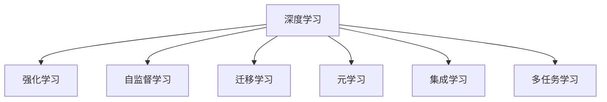

                 

# 软件 2.0 的发展趋势：深度学习、强化学习

## 1. 背景介绍

### 1.1 问题由来

随着人工智能技术的不断进步，软件从传统意义上的功能驱动，逐渐转变为智能驱动。这一转变被称为"软件 2.0"。软件 2.0 的核心在于利用深度学习、强化学习等智能技术，让软件系统具备自主学习、自主适应的能力。深度学习和强化学习作为当前最炙手可热的AI技术，已经在图像识别、自然语言处理、智能推荐、自动驾驶等多个领域展现了强大的应用潜力。

然而，随着深度学习和强化学习技术的日益复杂，其应用面临诸多挑战。如训练成本高、模型庞大、泛化能力差、应用场景受限等。这些问题亟需通过技术创新予以解决，从而实现深度学习和强化学习技术的更广泛应用和普及。

### 1.2 问题核心关键点

深度学习和强化学习技术的核心在于数据驱动的模型训练，以及模型对环境的动态响应。软件 2.0 的关键点在于：

- 数据的高效利用：如何从海量数据中提取有效信息，高效训练模型。
- 模型的泛化能力：如何提高模型的泛化能力，使其在未知环境也能表现出色。
- 智能决策：如何通过模型实现智能决策，解决复杂问题。
- 应用的灵活性：如何使模型在不同的应用场景中灵活应用。

## 2. 核心概念与联系

### 2.1 核心概念概述

为更好地理解深度学习和强化学习在软件 2.0 中的应用，本节将介绍几个密切相关的核心概念：

- 深度学习(Deep Learning)：一种利用多层神经网络进行特征提取和模式识别的机器学习技术。通过不断增加神经网络层数，可以学习到更为复杂、抽象的特征表示。

- 强化学习(Reinforcement Learning, RL)：一种利用智能体与环境交互，通过奖励机制引导智能体进行决策的学习范式。强化学习能够自主探索环境，学习最优策略，以最大化累计奖励。

- 自监督学习(Self-supervised Learning)：利用数据自身的特点，通过构造伪标签，无需人工标注进行模型训练的学习方法。

- 迁移学习(Transfer Learning)：利用在某一任务上训练得到的模型，迁移到另一相关任务上训练，从而提高模型在目标任务上的表现。

- 元学习(Meta Learning)：通过学习如何学习，使模型具备泛化能力，适应新任务的能力。

- 集成学习(Ensemble Learning)：通过集成多个模型的预测结果，提升模型的整体性能。

- 多任务学习(Multi-task Learning)：在多个相关任务上共同训练模型，提高模型的多任务学习能力。

这些核心概念之间的逻辑关系可以通过以下Mermaid流程图来展示：



这个流程图展示了几类核心概念之间的联系：

1. 深度学习是基础，通过多层神经网络学习到复杂特征。
2. 强化学习通过智能体与环境的互动，实现动态决策。
3. 自监督学习利用数据自身特点，减少标注需求。
4. 迁移学习和元学习帮助模型在泛化能力上更进一步。
5. 集成学习和多任务学习提升模型性能。

这些概念共同构成了深度学习和强化学习的学习框架，使其能够应用于各种实际问题。

## 3. 核心算法原理 & 具体操作步骤
### 3.1 算法原理概述

深度学习和强化学习的核心算法原理，本质上是优化目标函数，通过损失函数最小化实现模型训练和优化。

### 3.2 算法步骤详解

#### 3.2.1 深度学习算法步骤

1. 数据准备：收集标注数据，将其划分为训练集、验证集和测试集。

2. 模型构建：选择合适的深度神经网络结构，如卷积神经网络(CNN)、循环神经网络(RNN)、长短时记忆网络(LSTM)、Transformer等。

3. 模型训练：将训练集数据输入模型进行前向传播，计算损失函数，反向传播更新模型参数。

4. 模型评估：在验证集上评估模型性能，根据评估结果调整模型参数，避免过拟合。

5. 模型测试：在测试集上测试模型性能，评估最终效果。

#### 3.2.2 强化学习算法步骤

1. 环境定义：定义智能体和环境，确定智能体的状态、动作和奖励。

2. 策略定义：选择适当的策略，如Q-learning、SARSA等。

3. 模型训练：通过与环境的交互，不断收集样本数据，更新模型参数，优化策略。

4. 模型评估：在测试环境中评估策略性能，验证策略的有效性。

5. 模型应用：在实际环境中应用优化后的策略，进行智能决策。

### 3.3 算法优缺点

深度学习和强化学习的优缺点如下：

#### 深度学习

优点：

- 能够处理大规模数据，学习到复杂特征表示。
- 自动化程度高，适合大规模工业化应用。
- 在图像、语音、自然语言处理等领域具有出色的效果。

缺点：

- 训练过程耗时较长，对硬件资源要求高。
- 模型参数量巨大，内存和计算资源消耗大。
- 容易过拟合，泛化能力不足。
- 数据依赖性强，需要大量标注数据。

#### 强化学习

优点：

- 动态决策能力强，能够自主适应环境变化。
- 适用于无标签数据，数据需求相对较少。
- 能够学习最优策略，进行自主决策。

缺点：

- 训练过程复杂，收敛速度较慢。
- 需要大量环境交互数据，训练成本高。
- 模型评估困难，难以验证效果。
- 对环境复杂性要求高，模型训练难度大。

### 3.4 算法应用领域

深度学习和强化学习已经在众多领域取得了重要应用，具体如下：

1. 计算机视觉：如图像识别、物体检测、人脸识别、图像生成等。深度学习通过卷积神经网络等模型，实现了对图像信息的自动提取和分析。

2. 自然语言处理：如机器翻译、情感分析、问答系统、文本生成等。深度学习通过循环神经网络、Transformer等模型，对自然语言信息进行了有效的处理和生成。

3. 智能推荐：如电商推荐、内容推荐、广告推荐等。深度学习通过协同过滤、矩阵分解等方法，对用户和物品的特征进行了高效的建模，提高了推荐的准确性和个性化程度。

4. 自动驾驶：如自动驾驶汽车、智能交通管理等。强化学习通过智能体与环境的互动，实现了自动驾驶汽车在复杂环境下的路径规划和决策。

5. 机器人控制：如工业机器人、无人机控制等。强化学习通过与环境的交互，实现了机器人对复杂环境的自主导航和任务执行。

6. 医疗诊断：如医学影像诊断、病理分析等。深度学习通过卷积神经网络、Transformer等模型，对医学影像和文本信息进行了有效的处理和分析。

7. 金融交易：如股票预测、风险控制等。强化学习通过智能体与市场的互动，实现了对金融市场动态变化的自主分析和决策。

8. 游戏智能：如AlphaGo、Dota2等游戏智能。强化学习通过与游戏的互动，实现了在游戏中进行自主决策和策略优化。

以上应用展示了深度学习和强化学习的强大应用潜力，未来有望在更多领域实现更广泛的应用。

## 4. 数学模型和公式 & 详细讲解 & 举例说明
### 4.1 数学模型构建

#### 4.1.1 深度学习模型构建

深度学习模型通常由多层神经网络组成，每个神经网络层通过权重和偏置进行特征提取和变换。

以卷积神经网络(CNN)为例，其基本结构如下：

$$
\text{Convolutional Layer} = \text{Convolutional Filter} * \text{Input Image} + \text{Bias}
$$

其中，卷积滤波器对输入图像进行卷积操作，生成特征图；偏置项用于调整模型输出。

#### 4.1.2 强化学习模型构建

强化学习模型通常包括智能体、状态、动作和奖励等要素。

以Q-learning算法为例，其基本结构如下：

$$
Q(s, a) \leftarrow Q(s, a) + \alpha (r + \gamma \max_{a'} Q(s', a') - Q(s, a))
$$

其中，$Q(s, a)$表示智能体在状态$s$采取动作$a$的Q值；$r$表示即时奖励；$\gamma$表示折扣因子；$\alpha$表示学习率。

### 4.2 公式推导过程

#### 4.2.1 深度学习公式推导

以反向传播算法为例，其基本过程如下：

1. 前向传播：将输入数据输入模型，计算每个神经网络的输出。

2. 损失函数计算：将模型输出与真实标签进行比较，计算损失函数。

3. 梯度计算：通过链式法则，计算损失函数对每个神经元权重的梯度。

4. 反向传播：将梯度反向传播回每个神经网络层，更新权重和偏置。

5. 模型更新：根据更新后的权重和偏置，重新计算输出。

#### 4.2.2 强化学习公式推导

以Q-learning算法为例，其基本过程如下：

1. 初始化：将状态$s_0$、动作$a_0$、状态值$Q(s_0, a_0)$、折扣因子$\gamma$、学习率$\alpha$等参数进行初始化。

2. 状态更新：根据状态和动作，更新智能体的状态值。

3. 动作选择：根据状态值选择最佳动作$a_1$。

4. 奖励计算：计算即时奖励$r_1$。

5. 状态值更新：根据状态值和即时奖励，更新智能体的状态值。

6. 状态更新：根据状态和动作，更新智能体的状态值。

7. 动作选择：根据状态值选择最佳动作$a_2$。

8. 奖励计算：计算即时奖励$r_2$。

9. 状态值更新：根据状态值和即时奖励，更新智能体的状态值。

10. 重复步骤3-9，直到智能体进入终止状态。

### 4.3 案例分析与讲解

以深度学习在图像分类任务中的应用为例，分析其基本原理。

假设输入一张手写数字图像，将其输入卷积神经网络中，每个卷积层通过卷积操作提取图像特征，生成特征图。接着通过池化层对特征图进行下采样，减少计算量。最后通过全连接层将特征图转换为数字标签，进行分类。

具体步骤如下：

1. 输入图像经过卷积层，生成特征图。

2. 特征图通过池化层进行下采样，减少特征维度。

3. 池化层输出再次输入全连接层，生成分类结果。

4. 计算分类结果与真实标签之间的交叉熵损失函数。

5. 通过反向传播算法计算损失函数对每个神经元权重的梯度。

6. 根据梯度更新权重和偏置，重新计算输出。

7. 通过验证集评估模型性能，调整超参数。

8. 在测试集上测试模型性能，评估最终效果。

## 5. 项目实践：代码实例和详细解释说明
### 5.1 开发环境搭建

在进行深度学习和强化学习项目实践前，我们需要准备好开发环境。以下是使用Python进行TensorFlow和PyTorch开发的环境配置流程：

1. 安装Anaconda：从官网下载并安装Anaconda，用于创建独立的Python环境。

2. 创建并激活虚拟环境：
```bash
conda create -n tf-env python=3.8
conda activate tf-env
```

3. 安装TensorFlow：根据CUDA版本，从官网获取对应的安装命令。例如：
```bash
conda install tensorflow -c conda-forge
```

4. 安装PyTorch：
```bash
pip install torch torchvision torchaudio
```

5. 安装TensorBoard：
```bash
pip install tensorboard
```

6. 安装OpenAI Gym：用于强化学习任务测试和评估。
```bash
pip install gym
```

完成上述步骤后，即可在`tf-env`环境中开始深度学习和强化学习项目实践。

### 5.2 源代码详细实现

下面以深度学习在图像分类任务中的应用为例，给出使用TensorFlow进行图像分类的PyTorch代码实现。

首先，定义卷积神经网络模型：

```python
import tensorflow as tf

class ConvNet(tf.keras.Model):
    def __init__(self):
        super(ConvNet, self).__init__()
        self.conv1 = tf.keras.layers.Conv2D(32, (3, 3), activation='relu')
        self.pool1 = tf.keras.layers.MaxPooling2D((2, 2))
        self.conv2 = tf.keras.layers.Conv2D(64, (3, 3), activation='relu')
        self.pool2 = tf.keras.layers.MaxPooling2D((2, 2))
        self.flatten = tf.keras.layers.Flatten()
        self.d1 = tf.keras.layers.Dense(128, activation='relu')
        self.d2 = tf.keras.layers.Dense(10)

    def call(self, x):
        x = self.conv1(x)
        x = self.pool1(x)
        x = self.conv2(x)
        x = self.pool2(x)
        x = self.flatten(x)
        x = self.d1(x)
        x = self.d2(x)
        return x
```

然后，定义模型训练函数：

```python
@tf.function
def train_step(inputs, labels):
    with tf.GradientTape() as tape:
        logits = model(inputs)
        loss = tf.keras.losses.SparseCategoricalCrossentropy()(labels, logits)
    grads = tape.gradient(loss, model.trainable_variables)
    optimizer.apply_gradients(zip(grads, model.trainable_variables))
    return loss
```

接着，定义模型评估函数：

```python
def evaluate(model, test_dataset):
    test_loss = 0
    test_acc = 0
    for x, y in test_dataset:
        logits = model(x)
        test_loss += tf.keras.losses.SparseCategoricalCrossentropy()(y, logits).numpy()
        test_acc += tf.keras.metrics.sparse_categorical_accuracy(y, tf.argmax(logits, 1)).numpy()
    test_loss /= len(test_dataset)
    test_acc /= len(test_dataset)
    return test_loss, test_acc
```

最后，启动训练流程并在测试集上评估：

```python
import tensorflow_datasets as tfds

# 加载数据集
train_dataset, test_dataset = tfds.load('mnist', split=['train', 'test'], as_supervised=True)

# 数据预处理
def preprocess(image, label):
    image = tf.cast(image, tf.float32) / 255.0
    label = tf.one_hot(label, depth=10)
    return image, label

train_dataset = train_dataset.map(preprocess)
test_dataset = test_dataset.map(preprocess)

# 定义模型
model = ConvNet()

# 定义优化器
optimizer = tf.keras.optimizers.Adam()

# 定义超参数
learning_rate = 0.001
batch_size = 64
epochs = 10

# 启动训练
for epoch in range(epochs):
    for inputs, labels in train_dataset:
        loss = train_step(inputs, labels)
        if (epoch + 1) % 5 == 0:
            train_loss, train_acc = evaluate(model, train_dataset)
            test_loss, test_acc = evaluate(model, test_dataset)
            print(f"Epoch {epoch + 1}: train loss={train_loss:.4f}, train acc={train_acc:.4f}, test loss={test_loss:.4f}, test acc={test_acc:.4f}")
```

以上就是使用TensorFlow进行图像分类任务的完整代码实现。可以看到，TensorFlow的高级API使得深度学习模型的构建和训练变得十分简单。

### 5.3 代码解读与分析

让我们再详细解读一下关键代码的实现细节：

**ConvNet类**：
- `__init__`方法：定义卷积神经网络的结构，包括卷积层、池化层和全连接层等。

**train_step函数**：
- 定义一个TensorFlow函数，在每个训练批次中计算模型输出、损失函数、梯度，并更新模型参数。

**evaluate函数**：
- 定义一个TensorFlow函数，在测试集上评估模型性能，计算损失和准确率。

**train_for_epochs函数**：
- 定义一个TensorFlow函数，在训练集上训练模型，并周期性在测试集上评估性能。

**preprocess函数**：
- 定义数据预处理函数，将图像转换为TensorFlow张量，并进行归一化和one-hot编码。

**mnist加载和预处理**：
- 使用TensorFlow Datasets加载MNIST数据集，并对其进行预处理。

通过上述代码，可以看到TensorFlow在深度学习任务中的应用简洁高效。开发者只需关注模型的构建和训练逻辑，其他细节如数据加载、预处理等操作均有TensorFlow的高层API自动完成。

当然，工业级的系统实现还需考虑更多因素，如模型的保存和部署、超参数的自动搜索、更灵活的任务适配层等。但核心的深度学习框架API基本与此类似。

## 6. 实际应用场景
### 6.1 智能推荐系统

深度学习和强化学习在智能推荐系统中得到了广泛应用。推荐系统通过用户行为数据，构建用户和物品的特征表示，进行推荐匹配。

推荐系统可以基于深度学习的方法，如协同过滤、矩阵分解、深度神经网络等，对用户和物品的特征进行建模。同时，可以通过强化学习的方法，如深度Q网络(DQN)、策略梯度等，实现智能推荐模型的动态优化。

智能推荐系统已经在电商、视频、音乐等领域得到了广泛应用，极大地提升了用户体验和平台收益。未来，推荐系统有望进一步整合多模态数据，实现更精准、高效的推荐效果。

### 6.2 自动驾驶系统

自动驾驶系统是深度学习和强化学习的重要应用场景。自动驾驶系统通过摄像头、雷达、激光雷达等传感器，实时获取周围环境信息，进行路径规划和决策。

在自动驾驶系统中，深度学习可以用于环境感知、路径规划等任务，如图像识别、语义分割、目标检测等。强化学习可以用于路径规划和决策，如车辆控制、避障等。

目前，自动驾驶系统已经实现了在高速公路等简单场景的自动驾驶，未来有望在复杂城市道路等场景中实现广泛应用。深度学习和强化学习的结合，将使得自动驾驶系统更加智能和稳定。

### 6.3 金融交易系统

金融交易系统通过深度学习和强化学习，对金融市场进行动态分析，进行策略优化和交易决策。

深度学习可以用于金融时间序列分析、市场情绪分析等任务，如图像识别、语音识别、自然语言处理等。强化学习可以用于交易策略优化，如算法交易、高频交易等。

金融交易系统已经在股票、期货、外汇等领域得到了广泛应用，极大地提高了交易效率和收益。未来，金融交易系统有望进一步整合多模态数据，实现更精准、高效的交易决策。

### 6.4 未来应用展望

随着深度学习和强化学习技术的不断进步，未来将有更多领域实现智能化升级。

在智慧医疗领域，深度学习和强化学习技术可以用于医疗影像分析、智能诊断、机器人手术等，提高医疗服务的智能化水平，辅助医生诊疗，加速新药开发进程。

在智能教育领域，深度学习和强化学习技术可以用于智能教学、智能评估、智能辅导等，因材施教，促进教育公平，提高教学质量。

在智慧城市治理中，深度学习和强化学习技术可以用于城市事件监测、舆情分析、应急指挥等环节，提高城市管理的自动化和智能化水平，构建更安全、高效的未来城市。

此外，在企业生产、社会治理、文娱传媒等众多领域，基于深度学习和强化学习的智能系统也将不断涌现，为传统行业数字化转型升级提供新的技术路径。相信随着技术的日益成熟，深度学习和强化学习将进一步拓展应用边界，深刻影响人类的生产生活方式。

## 7. 工具和资源推荐
### 7.1 学习资源推荐

为了帮助开发者系统掌握深度学习和强化学习技术的理论基础和实践技巧，这里推荐一些优质的学习资源：

1. 《Deep Learning》书籍：深度学习领域的经典教材，全面介绍了深度学习的基本概念、算法原理和应用实例。

2. 《Reinforcement Learning: An Introduction》书籍：强化学习领域的经典教材，详细讲解了强化学习的理论基础和算法实现。

3. Coursera《Deep Learning Specialization》课程：由深度学习专家Andrew Ng讲授，包含深度学习基本概念、高级算法和实践应用。

4. Coursera《Reinforcement Learning》课程：由强化学习专家Richard Sutton讲授，介绍了强化学习的理论基础、算法实现和应用实例。

5. 《Python Deep Learning》书籍：基于Python实现的深度学习开发实践，适合初学者入门。

6. 《Hands-On Reinforcement Learning with Python》书籍：基于Python实现的强化学习开发实践，适合初学者入门。

通过对这些资源的学习实践，相信你一定能够快速掌握深度学习和强化学习的精髓，并用于解决实际的NLP问题。

### 7.2 开发工具推荐

高效的深度学习和强化学习开发离不开优秀的工具支持。以下是几款用于深度学习和强化学习开发的常用工具：

1. TensorFlow：由Google主导开发的开源深度学习框架，生产部署方便，适合大规模工程应用。

2. PyTorch：基于Python的开源深度学习框架，灵活动态的计算图，适合快速迭代研究。

3. Keras：基于Python的高级深度学习API，适合初学者快速上手。

4. OpenAI Gym：用于强化学习任务测试和评估，提供了大量环境模拟和算法实现。

5. Jupyter Notebook：免费的交互式编程环境，适合快速实验和开发。

6. Visual Studio Code：跨平台的开发工具，支持Python、TensorFlow等深度学习开发环境。

合理利用这些工具，可以显著提升深度学习和强化学习的开发效率，加快创新迭代的步伐。

### 7.3 相关论文推荐

深度学习和强化学习技术的进步离不开学界的持续研究。以下是几篇奠基性的相关论文，推荐阅读：

1. ImageNet Classification with Deep Convolutional Neural Networks（ImageNet分类与深度卷积神经网络）：提出了深度卷积神经网络，开创了图像识别领域的先河。

2. Deep Residual Learning for Image Recognition（深度残差学习与图像识别）：提出了残差网络，解决了深度网络训练中的梯度消失问题，提升了深度神经网络的训练效果。

3. Playing Atari with Deep Reinforcement Learning（用深度强化学习玩Atari游戏）：证明了强化学习可以用于游戏智能，开启了强化学习在游戏领域的应用。

4. AlphaGo Zero：用深度强化学习实现棋类游戏智能，突破了传统搜索算法的限制，实现了零样本学习。

5. Generative Adversarial Nets（生成对抗网络）：提出了生成对抗网络，实现了高质量的图像生成和图像修复。

6. AlphaGo（深度强化学习实现围棋智能）：用深度强化学习实现了围棋智能，突破了传统搜索算法的限制，实现了零样本学习。

这些论文代表了大模型微调技术的发展脉络。通过学习这些前沿成果，可以帮助研究者把握学科前进方向，激发更多的创新灵感。

## 8. 总结：未来发展趋势与挑战

### 8.1 总结

本文对深度学习和强化学习在软件 2.0 中的应用进行了全面系统的介绍。首先阐述了深度学习和强化学习的背景和意义，明确了其在智能驱动的软件系统中的应用价值。其次，从原理到实践，详细讲解了深度学习和强化学习的算法步骤和应用技巧，给出了深度学习和强化学习的代码实例。同时，本文还广泛探讨了深度学习和强化学习在智能推荐、自动驾驶、金融交易等多个行业领域的应用前景，展示了其在实际问题解决中的强大能力。最后，本文精选了深度学习和强化学习的各类学习资源，力求为读者提供全方位的技术指引。

通过本文的系统梳理，可以看到，深度学习和强化学习已经深刻改变了软件系统的开发范式，带来了智能化的新思路和新方法。面向未来，深度学习和强化学习将在更多领域得到应用和普及，为人类认知智能的进化带来新的突破。

### 8.2 未来发展趋势

展望未来，深度学习和强化学习的发展趋势如下：

1. 模型规模持续增大。随着算力成本的下降和数据规模的扩张，深度神经网络的结构将更加复杂，参数量将持续增长，学习能力和表达能力将进一步提升。

2. 模型泛化能力提升。深度学习和强化学习模型的泛化能力将进一步提升，能够在更多领域实现更好的应用效果。

3. 多模态数据整合。深度学习和强化学习模型将能够更好地整合多模态数据，提升对复杂场景的理解和处理能力。

4. 分布式训练优化。深度学习和强化学习模型将更广泛地应用于分布式计算环境中，实现更高效的训练和推理。

5. 自适应学习算法。深度学习和强化学习模型将具备更强的自适应学习能力，能够动态调整模型参数和结构，适应不同任务和数据分布。

6. 自动化超参数优化。深度学习和强化学习模型将更广泛地应用自动化超参数优化算法，提高模型的训练效率和效果。

7. 增强学习实验平台。深度学习和强化学习模型将更多地应用于增强学习实验平台中，实现更有效的模型训练和测试。

8. 伦理和安全问题。深度学习和强化学习模型将更广泛地关注伦理和安全问题，确保其应用在社会中的安全性、公正性和可靠性。

### 8.3 面临的挑战

尽管深度学习和强化学习已经取得了重要进展，但在迈向更加智能化、普适化应用的过程中，其仍然面临诸多挑战：

1. 训练成本高昂。深度学习和强化学习模型的训练过程耗时较长，对硬件资源要求高。

2. 模型复杂度高。深度学习和强化学习模型结构复杂，难以理解和调试。

3. 数据依赖性强。深度学习和强化学习模型需要大量数据进行训练，数据获取和标注成本较高。

4. 模型泛化能力差。深度学习和强化学习模型在未知环境中的泛化能力较差，容易过拟合。

5. 实时推理困难。深度学习和强化学习模型在实时推理时，计算资源消耗大，速度较慢。

6. 伦理和安全问题。深度学习和强化学习模型在应用过程中，可能存在伦理和安全问题，如偏见、隐私等。

7. 模型解释性不足。深度学习和强化学习模型通常被称为"黑盒"模型，难以解释其内部工作机制和决策逻辑。

### 8.4 研究展望

针对深度学习和强化学习所面临的挑战，未来的研究方向如下：

1. 提升模型泛化能力。通过改进模型结构、优化损失函数、引入先验知识等方法，提高模型的泛化能力。

2. 降低模型训练成本。通过优化算法、使用分布式训练、数据增强等方法，降低模型训练成本。

3. 增强模型解释性。通过引入可解释性技术，如注意力机制、层归约等方法，增强模型的可解释性。

4. 提高模型实时推理能力。通过模型压缩、量化加速、推理优化等方法，提高模型的实时推理能力。

5. 解决伦理和安全问题。通过引入伦理导向的评估指标，过滤和惩罚有害信息，确保模型的伦理和安全。

6. 整合多模态数据。通过整合视觉、语音、文本等多模态数据，提升模型的跨模态理解能力。

7. 自动化超参数优化。通过引入自动化超参数优化算法，提高模型的训练效率和效果。

8. 优化分布式训练。通过优化分布式训练算法，实现更高效的训练和推理。

9. 实现多任务学习。通过多任务学习算法，提高模型的多任务学习能力。

以上研究方向展示了深度学习和强化学习技术的未来发展方向。这些方向的探索发展，必将推动深度学习和强化学习技术的不断进步，为构建智能化的软件系统提供更强大的技术支撑。

## 9. 附录：常见问题与解答

**Q1：深度学习和强化学习的区别是什么？**

A: 深度学习是一种基于数据驱动的机器学习技术，通过多层神经网络进行特征提取和模式识别。而强化学习是一种基于智能体与环境交互的学习范式，通过奖励机制引导智能体进行决策。深度学习主要应用于数据驱动的任务，如图像识别、语音识别、自然语言处理等；而强化学习主要应用于动态决策的任务，如游戏智能、自动驾驶、机器人控制等。

**Q2：深度学习和强化学习如何避免过拟合？**

A: 深度学习和强化学习模型通常容易过拟合，尤其是在训练数据较少的情况下。常用的避免过拟合的方法包括：
1. 数据增强：通过数据变换、旋转、裁剪等方式扩充训练集。
2. 正则化：使用L2正则、Dropout、Early Stopping等方法。
3. 参数共享：在网络中引入参数共享机制，减少模型复杂度。
4. 模型压缩：通过模型裁剪、量化加速等方法，减少模型规模和计算资源消耗。
5. 集成学习：通过模型集成，提高模型的泛化能力。

**Q3：深度学习和强化学习有哪些应用场景？**

A: 深度学习和强化学习已经在众多领域得到了重要应用，具体如下：
1. 计算机视觉：如图像识别、物体检测、人脸识别、图像生成等。
2. 自然语言处理：如机器翻译、情感分析、问答系统、文本生成等。
3. 智能推荐：如电商推荐、内容推荐、广告推荐等。
4. 自动驾驶：如自动驾驶汽车、智能交通管理等。
5. 机器人控制：如工业机器人、无人机控制等。
6. 医疗诊断：如医学影像诊断、病理分析等。
7. 金融交易：如股票预测、风险控制等。
8. 游戏智能：如AlphaGo、Dota2等游戏智能。

通过这些应用，深度学习和强化学习已经展现了其强大的应用潜力。未来有望在更多领域实现更广泛的应用。

**Q4：深度学习和强化学习的应用前景是什么？**

A: 深度学习和强化学习的应用前景非常广泛，包括：
1. 智慧医疗：如医学影像分析、智能诊断、机器人手术等。
2. 智能教育：如智能教学、智能评估、智能辅导等。
3. 智慧城市治理：如城市事件监测、舆情分析、应急指挥等。
4. 企业生产：如生产调度、质量控制、设备维护等。
5. 社会治理：如公共安全、环境保护、政策制定等。
6. 文娱传媒：如内容推荐、广告投放、用户行为分析等。
7. 自动驾驶：如自动驾驶汽车、智能交通管理等。
8. 金融交易：如股票预测、风险控制等。

通过这些应用，深度学习和强化学习将深刻改变各行各业的生产生活方式，带来新的经济和社会效益。

**Q5：深度学习和强化学习的优缺点是什么？**

A: 深度学习和强化学习的优缺点如下：
优点：
1. 能够处理大规模数据，学习到复杂特征表示。
2. 自动化程度高，适合大规模工业化应用。
3. 在图像、语音、自然语言处理等领域具有出色的效果。
4. 动态决策能力强，能够自主适应环境变化。
5. 适用于无标签数据，数据需求相对较少。
6. 能够学习最优策略，进行自主决策。

缺点：
1. 训练过程耗时较长，对硬件资源要求高。
2. 模型参数量巨大，内存和计算资源消耗大。
3. 容易过拟合，泛化能力不足。
4. 数据依赖性强，需要大量标注数据。
5. 模型复杂度高，难以理解和调试。
6. 实时推理困难，计算资源消耗大。
7. 模型泛化能力差，容易过拟合。
8. 伦理和安全问题，可能存在偏见、隐私等。
9. 模型解释性不足，难以解释其内部工作机制和决策逻辑。

合理利用这些优缺点，可以更好地发挥深度学习和强化学习技术的优势，解决实际问题。

---

作者：禅与计算机程序设计艺术 / Zen and the Art of Computer Programming

