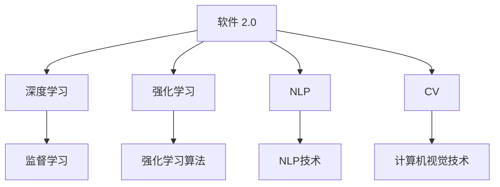

                 

# 软件 2.0 的哲学思考：人工智能的本质

## 1. 背景介绍

### 1.1 问题由来
进入21世纪以来，随着计算机科学和人工智能(AI)技术的飞速发展，人类的生产力和社会生活方式正在发生深刻变革。从语音识别、图像处理到自然语言处理，AI技术正在为各行各业带来前所未有的机遇和挑战。

人工智能的演进历程，大致可以分为两个阶段：

1. **软件 1.0**：这一阶段以规则驱动的专家系统为代表，依赖人工编写的程序来模拟专家的决策过程。由于需要大量人工编写规则，其覆盖范围和复杂度非常有限。

2. **软件 2.0**：随着机器学习、深度学习等技术的成熟，软件 2.0 应运而生。其核心是数据驱动，利用大规模数据训练模型，使其具备自主学习和自我优化的能力。

软件 2.0 之所以被称为人工智能的 2.0，是因为它以数据为中心，利用算法和模型从数据中挖掘出模式和规律，超越了传统规则驱动的局限性。

### 1.2 问题核心关键点
软件 2.0 的哲学思考主要围绕以下几个核心问题展开：

- **数据与知识的关系**：软件 2.0 的核心在于数据，数据驱动的模型是否能超越规则驱动的专家系统，其本质是什么？
- **模型的本质**：深度学习、神经网络等模型的内在逻辑是什么，如何确保其可解释性和可靠性？
- **模型的泛化能力**：模型如何在不同场景下保持稳定性能，避免过拟合和泛化不足的问题？
- **人类智能与机器智能的关系**：软件 2.0 的智能和人类智能相比，其边界在哪里？

## 2. 核心概念与联系

### 2.1 核心概念概述

为更好地理解软件 2.0 的哲学思考，本节将介绍几个关键概念：

- **软件 2.0**：以深度学习、神经网络等为代表的基于数据驱动的软件，能够通过数据和模型从数据中挖掘出模式和规律，进行自主学习和自我优化。

- **机器学习(Machine Learning, ML)**：通过训练数据，让计算机自主学习输入数据与输出结果之间的映射关系，从而实现数据驱动的决策和预测。

- **深度学习(Deep Learning, DL)**：一种特殊的机器学习方法，通过构建深度神经网络，模拟人类神经系统的层次化结构，学习更抽象、更复杂的特征。

- **强化学习(Reinforcement Learning, RL)**：通过与环境的交互，学习最大化长期奖励的策略，适用于机器人控制、游戏策略等任务。

- **自然语言处理(Natural Language Processing, NLP)**：利用计算机处理和理解自然语言的技术，包括语音识别、文本分类、机器翻译等。

- **计算机视觉(Computer Vision, CV)**：让计算机理解和解释图像和视频的技术，包括目标检测、图像分割、物体识别等。

这些概念之间的逻辑关系可以通过以下Mermaid流程图来展示：



这个流程图展示了大规模软件 2.0 应用的技术组成：

1. 软件 2.0 以深度学习为核心，结合强化学习、NLP、CV等多种技术。
2. 深度学习主要采用监督学习、无监督学习、强化学习等技术，从数据中挖掘出模式和规律。
3. NLP、CV等领域的技术应用，依赖于深度学习模型的输入输出映射。

这些概念共同构成了软件 2.0 的基础，其哲学思考也深刻体现在这些技术的演进和发展之中。

## 3. 核心算法原理 & 具体操作步骤
### 3.1 算法原理概述

软件 2.0 的算法原理，通常遵循以下步骤：

1. **数据获取**：从真实世界中收集大量数据，数据量越大、多样性越高，模型越容易泛化。

2. **模型训练**：利用机器学习算法，从数据中学习特征和规律。常用的算法包括监督学习、无监督学习和强化学习。

3. **模型评估**：在测试集上评估模型性能，选择最优模型。评估指标包括准确率、召回率、F1-score等。

4. **模型应用**：将模型应用到实际问题中，进行推理和预测。常见的应用场景包括语音识别、图像处理、自然语言理解等。

### 3.2 算法步骤详解

以深度学习模型为例，以下是其训练和评估的详细步骤：

1. **数据预处理**：
   - 数据清洗：去除噪声和无用数据。
   - 数据增强：扩充训练集，如旋转、裁剪、翻滚等。
   - 数据归一化：将数据缩放到[0, 1]或[-1, 1]范围内。

2. **模型构建**：
   - 选择合适的网络结构，如卷积神经网络(CNN)、循环神经网络(RNN)、Transformer等。
   - 设置超参数，如学习率、批大小、迭代轮数等。

3. **模型训练**：
   - 将数据分为训练集和验证集，使用训练集数据训练模型，在验证集数据上评估性能。
   - 利用梯度下降等优化算法，更新模型参数。

4. **模型评估**：
   - 在测试集上评估模型性能，选择最优模型。
   - 使用混淆矩阵、ROC曲线、PR曲线等评估模型效果。

5. **模型应用**：
   - 将模型应用到实际问题中，进行推理和预测。
   - 优化模型参数，提升模型性能。

### 3.3 算法优缺点

软件 2.0 的算法具有以下优点：

1. **高效性**：通过数据驱动，能够快速从大量数据中学习规律，实现快速部署和应用。
2. **可扩展性**：模型能够处理大规模数据，适用于各种复杂问题。
3. **自动化**：通过自动化训练和优化，降低了人工干预的复杂度。

但同时也存在一些局限：

1. **数据依赖**：模型性能高度依赖于数据质量，数据偏差会导致模型偏见。
2. **解释性不足**：黑箱模型难以解释其内部工作机制，难以进行调试和优化。
3. **泛化能力**：模型容易过拟合，在不同场景下泛化能力可能不足。
4. **资源消耗大**：模型训练和推理需要大量计算资源和时间。

### 3.4 算法应用领域

软件 2.0 的应用领域非常广泛，以下是几个典型应用场景：

1. **语音识别**：将语音转换为文本，广泛应用于智能助理、语音搜索、语音翻译等。
2. **图像处理**：从图像中识别物体、场景、文字等，广泛应用于安防监控、医疗诊断、自动驾驶等。
3. **自然语言处理**：处理和理解自然语言，应用于问答系统、机器翻译、情感分析等。
4. **推荐系统**：根据用户行为和偏好，推荐商品、文章、视频等，广泛应用于电商、新闻、视频平台等。
5. **金融分析**：利用数据挖掘和机器学习，进行市场分析、风险预测等，应用于量化投资、信用评分等。
6. **医疗诊断**：通过医学图像和病历数据，辅助医生进行疾病诊断和治疗，提升医疗水平。
7. **智能制造**：利用传感器数据和机器学习，优化生产流程、预测设备故障，提高生产效率和产品质量。

## 4. 数学模型和公式 & 详细讲解  
### 4.1 数学模型构建

本节将使用数学语言对深度学习模型的训练过程进行严格的数学刻画。

假设深度学习模型为 $M_{\theta}$，其中 $\theta$ 为模型参数。给定训练集 $D=\{(x_i, y_i)\}_{i=1}^N$，其中 $x_i \in \mathcal{X}$ 为输入，$y_i \in \mathcal{Y}$ 为输出。

定义模型 $M_{\theta}$ 在输入 $x$ 上的损失函数为 $\ell(M_{\theta}(x),y)$，则在数据集 $D$ 上的经验风险为：

$$
\mathcal{L}(\theta) = \frac{1}{N} \sum_{i=1}^N \ell(M_{\theta}(x_i),y_i)
$$

训练目标是最小化经验风险，即找到最优参数：

$$
\theta^* = \mathop{\arg\min}_{\theta} \mathcal{L}(\theta)
$$

在实践中，我们通常使用基于梯度的优化算法（如SGD、Adam等）来近似求解上述最优化问题。设 $\eta$ 为学习率，$\lambda$ 为正则化系数，则参数的更新公式为：

$$
\theta \leftarrow \theta - \eta \nabla_{\theta}\mathcal{L}(\theta) - \eta\lambda\theta
$$

其中 $\nabla_{\theta}\mathcal{L}(\theta)$ 为损失函数对参数 $\theta$ 的梯度，可通过反向传播算法高效计算。

### 4.2 公式推导过程

以二分类任务为例，推导交叉熵损失函数及其梯度的计算公式。

假设模型 $M_{\theta}$ 在输入 $x$ 上的输出为 $\hat{y}=M_{\theta}(x) \in [0,1]$，表示样本属于正类的概率。真实标签 $y \in \{0,1\}$。则二分类交叉熵损失函数定义为：

$$
\ell(M_{\theta}(x),y) = -[y\log \hat{y} + (1-y)\log (1-\hat{y})]
$$

将其代入经验风险公式，得：

$$
\mathcal{L}(\theta) = -\frac{1}{N}\sum_{i=1}^N [y_i\log M_{\theta}(x_i)+(1-y_i)\log(1-M_{\theta}(x_i))]
$$

根据链式法则，损失函数对参数 $\theta_k$ 的梯度为：

$$
\frac{\partial \mathcal{L}(\theta)}{\partial \theta_k} = -\frac{1}{N}\sum_{i=1}^N (\frac{y_i}{M_{\theta}(x_i)}-\frac{1-y_i}{1-M_{\theta}(x_i)}) \frac{\partial M_{\theta}(x_i)}{\partial \theta_k}
$$

其中 $\frac{\partial M_{\theta}(x_i)}{\partial \theta_k}$ 可进一步递归展开，利用自动微分技术完成计算。

### 4.3 案例分析与讲解

假设有一个二分类任务，训练集为 $D=\{(x_1, y_1), (x_2, y_2), (x_3, y_3), (x_4, y_4)\}$，其中 $x_i$ 为输入，$y_i \in \{0,1\}$。假设模型 $M_{\theta}$ 在输入 $x_3$ 上的输出为 $\hat{y}_3=0.8$，真实标签为 $y_3=1$。

则损失函数 $\mathcal{L}(\theta)$ 为：

$$
\mathcal{L}(\theta) = -\frac{1}{4}(0.8\log 0.2 + 1\log 0.2 + 0.2\log 0.8 + 0.8\log 0.8)
$$

计算损失函数的梯度：

$$
\nabla_{\theta}\mathcal{L}(\theta) = -\frac{1}{4}(-0.8/\log 0.2 - 1/\log 0.2 + 0.2/\log 0.8 + 0.8/\log 0.8)
$$

根据梯度下降算法，更新模型参数 $\theta$：

$$
\theta \leftarrow \theta - \eta \nabla_{\theta}\mathcal{L}(\theta) - \eta\lambda\theta
$$

其中 $\eta$ 为学习率，$\lambda$ 为正则化系数。

## 5. 项目实践：代码实例和详细解释说明
### 5.1 开发环境搭建

在进行深度学习项目实践前，我们需要准备好开发环境。以下是使用Python进行PyTorch开发的环境配置流程：

1. 安装Anaconda：从官网下载并安装Anaconda，用于创建独立的Python环境。

2. 创建并激活虚拟环境：
```bash
conda create -n pytorch-env python=3.8 
conda activate pytorch-env
```

3. 安装PyTorch：根据CUDA版本，从官网获取对应的安装命令。例如：
```bash
conda install pytorch torchvision torchaudio cudatoolkit=11.1 -c pytorch -c conda-forge
```

4. 安装TensorFlow：从官网下载安装包，并按照安装指南进行安装。

5. 安装NumPy、pandas、scikit-learn等第三方库：
```bash
pip install numpy pandas scikit-learn matplotlib tqdm jupyter notebook ipython
```

完成上述步骤后，即可在`pytorch-env`环境中开始深度学习项目实践。

### 5.2 源代码详细实现

这里我们以手写数字识别为例，使用PyTorch框架进行深度学习模型的训练和评估。

首先，定义数据集类：

```python
import torch
from torch.utils.data import Dataset
import numpy as np

class MNISTDataset(Dataset):
    def __init__(self, data_dir, transform=None):
        self.data_dir = data_dir
        self.transform = transform
        
        # 读取训练集和测试集
        train_images = np.load(self.data_dir + '/train-images-idx3-ubyte')
        train_labels = np.load(self.data_dir + '/train-labels-idx1-ubyte')
        test_images = np.load(self.data_dir + '/t10k-images-idx3-ubyte')
        test_labels = np.load(self.data_dir + '/t10k-labels-idx1-ubyte')
        
        # 处理图像数据
        self.train_images = train_images.reshape((-1, 28, 28))
        self.train_labels = train_labels - 10
        self.test_images = test_images.reshape((-1, 28, 28))
        self.test_labels = test_labels - 10
        
        # 标准化
        self.train_images = self.train_images / 255.0
        self.test_images = self.test_images / 255.0
        
    def __len__(self):
        return len(self.train_images)
    
    def __getitem__(self, idx):
        image = self.train_images[idx] if idx < len(self.train_images) else self.test_images[idx - len(self.train_images)]
        label = self.train_labels[idx] if idx < len(self.train_labels) else self.test_labels[idx - len(self.train_labels)]
        
        if self.transform is not None:
            image = self.transform(image)
        
        return image, label
```

然后，定义模型类：

```python
import torch.nn as nn
import torch.nn.functional as F

class Net(nn.Module):
    def __init__(self):
        super(Net, self).__init__()
        self.conv1 = nn.Conv2d(1, 32, kernel_size=3, stride=1, padding=1)
        self.conv2 = nn.Conv2d(32, 64, kernel_size=3, stride=1, padding=1)
        self.fc1 = nn.Linear(64 * 7 * 7, 128)
        self.fc2 = nn.Linear(128, 10)
    
    def forward(self, x):
        x = F.relu(self.conv1(x))
        x = F.max_pool2d(x, 2, 2)
        x = F.relu(self.conv2(x))
        x = F.max_pool2d(x, 2, 2)
        x = x.view(-1, 64 * 7 * 7)
        x = F.relu(self.fc1(x))
        x = self.fc2(x)
        return F.log_softmax(x, dim=1)
```

接着，定义训练和评估函数：

```python
import torch.optim as optim
from torchvision import transforms

def train_epoch(model, train_loader, optimizer, device):
    model.train()
    epoch_loss = 0
    for images, labels in train_loader:
        images, labels = images.to(device), labels.to(device)
        optimizer.zero_grad()
        outputs = model(images)
        loss = F.nll_loss(outputs, labels)
        loss.backward()
        optimizer.step()
        epoch_loss += loss.item()
    
    return epoch_loss / len(train_loader)

def evaluate(model, test_loader, device):
    model.eval()
    correct = 0
    total = 0
    with torch.no_grad():
        for images, labels in test_loader:
            images, labels = images.to(device), labels.to(device)
            outputs = model(images)
            _, predicted = torch.max(outputs, 1)
            total += labels.size(0)
            correct += (predicted == labels).sum().item()
    
    return correct / total
```

最后，启动训练流程并在测试集上评估：

```python
from torchvision import datasets
from torchvision import transforms

# 定义数据增强
transform_train = transforms.Compose([
    transforms.ToTensor(),
    transforms.Normalize((0.1307,), (0.3081,))
])

transform_test = transforms.Compose([
    transforms.ToTensor(),
    transforms.Normalize((0.1307,), (0.3081,))
])

# 加载训练集和测试集
train_dataset = datasets.MNIST(root='data', train=True, transform=transform_train, download=True)
test_dataset = datasets.MNIST(root='data', train=False, transform=transform_test, download=True)

# 定义数据加载器
train_loader = torch.utils.data.DataLoader(train_dataset, batch_size=64, shuffle=True)
test_loader = torch.utils.data.DataLoader(test_dataset, batch_size=64, shuffle=False)

# 定义模型和优化器
model = Net().to('cuda')
optimizer = optim.Adam(model.parameters(), lr=0.001)

# 定义设备
device = torch.device('cuda' if torch.cuda.is_available() else 'cpu')

# 训练过程
for epoch in range(10):
    loss = train_epoch(model, train_loader, optimizer, device)
    print(f'Epoch {epoch+1}, train loss: {loss:.3f}')
    
    accuracy = evaluate(model, test_loader, device)
    print(f'Epoch {epoch+1}, test accuracy: {accuracy:.3f}')
    
print('Test accuracy:', evaluate(model, test_loader, device))
```

以上就是使用PyTorch进行手写数字识别任务深度学习模型微调的完整代码实现。可以看到，得益于PyTorch的强大封装，我们可以用相对简洁的代码完成深度学习模型的训练和评估。

## 6. 实际应用场景

### 6.1 智能推荐系统

深度学习在推荐系统中的应用非常广泛，可以有效地从用户的历史行为中挖掘出规律，推荐用户可能感兴趣的商品、文章、视频等。

在实践中，可以通过用户的历史评分、浏览行为、点击记录等数据，构建推荐模型。常用的模型包括协同过滤、基于内容的推荐、深度学习推荐等。其中深度学习推荐模型通过神经网络模型学习用户和商品的特征表示，可以更加精准地推荐用户感兴趣的内容。

### 6.2 自动驾驶

自动驾驶是深度学习在感知、决策、控制等领域的重要应用。通过摄像头、雷达、激光雷达等传感器，自动驾驶系统可以实时获取道路环境信息，并通过深度学习模型进行感知和决策。

在感知阶段，模型通过卷积神经网络对图像进行特征提取，通过循环神经网络对时间序列数据进行处理。在决策阶段，模型通过深度强化学习，学习最优的驾驶策略。在控制阶段，模型通过动态规划等方法，生成最优的控制指令。

### 6.3 医学影像分析

深度学习在医学影像分析中的应用非常广泛，可以用于图像分割、病变检测、病理分析等任务。

在实践中，可以通过大规模的医学影像数据，训练深度学习模型，学习影像中的特征和规律。常用的模型包括卷积神经网络、全卷积网络等。通过训练好的模型，可以对新的医学影像进行分割、检测、分类等处理，辅助医生进行诊断和治疗。

## 7. 工具和资源推荐

### 7.1 学习资源推荐

为了帮助开发者系统掌握深度学习的基本概念和前沿技术，这里推荐一些优质的学习资源：

1. 《深度学习》书籍：Ian Goodfellow等著，全面介绍了深度学习的原理、算法和应用，是深度学习的经典教材。

2. 《动手学深度学习》课程：由李沐等开发，提供了详细的课程视频、代码和实验，适合入门学习。

3. 《深度学习入门》书籍：斋藤康毅著，通过浅显易懂的语言，介绍了深度学习的基本概念和应用。

4. 《动手学深度学习》书籍：叶茂升等著，通过大量的代码示例，介绍了深度学习的原理和应用。

5. 《Python深度学习》书籍：Francois Chollet等著，通过代码示例，介绍了TensorFlow和Keras的使用方法。

6. 《Deep Learning Specialization》课程：由Andrew Ng等教授，提供了一系列深度学习的课程，包括基础、进阶和应用。

通过这些资源的学习实践，相信你一定能够快速掌握深度学习的基本概念和前沿技术，并用于解决实际的深度学习问题。

### 7.2 开发工具推荐

高效的开发离不开优秀的工具支持。以下是几款用于深度学习开发和部署的常用工具：

1. PyTorch：由Facebook开发的开源深度学习框架，灵活高效，适合研究和原型开发。

2. TensorFlow：由Google开发的开源深度学习框架，支持分布式训练，适合大规模工程应用。

3. Keras：一个高层API，提供了简洁的API，方便构建和训练深度学习模型。

4. MXNet：由亚马逊开发的开源深度学习框架，支持多种编程语言，适合分布式训练和推理。

5. Theano：由蒙特利尔大学开发的开源深度学习框架，支持GPU加速，适合高性能计算。

6. Jupyter Notebook：一个交互式开发环境，支持Python、R、Scala等多种编程语言。

7. Git：版本控制工具，支持协作开发和代码管理。

8. GitHub：代码托管平台，支持代码协作和版本管理。

合理利用这些工具，可以显著提升深度学习项目的开发效率，加快创新迭代的步伐。

### 7.3 相关论文推荐

深度学习的研究非常活跃，以下是几篇奠基性的相关论文，推荐阅读：

1. AlexNet：ImageNet图像识别比赛的冠军模型，首次展示了深度学习在图像识别中的应用。

2. GoogleNet：引入了Inception模块，提升了深度学习模型的计算效率和准确率。

3. ResNet：通过残差连接解决了深度网络训练过程中的梯度消失问题，使得深度学习模型可以更深。

4. VGGNet：通过叠加多层卷积层，提升了深度学习模型的准确率。

5. LSTM：长短期记忆网络，解决了深度学习模型在处理时间序列数据时的梯度消失问题。

6. Transformer：通过自注意力机制，提升了深度学习模型在处理序列数据时的效果。

7. BERT：基于自监督学习的预训练模型，提升了深度学习模型在自然语言处理任务上的性能。

这些论文代表了大规模深度学习的发展脉络。通过学习这些前沿成果，可以帮助研究者把握学科前进方向，激发更多的创新灵感。

## 8. 总结：未来发展趋势与挑战

### 8.1 总结

本文对深度学习技术的原理和应用进行了全面系统的介绍。首先阐述了深度学习技术的基本概念和应用场景，明确了其与软件 2.0 的密切关系。其次，从原理到实践，详细讲解了深度学习模型的训练和评估方法，给出了深度学习模型的完整代码实现。同时，本文还探讨了深度学习技术在智能推荐、自动驾驶、医学影像分析等多个领域的实际应用，展示了深度学习技术的巨大潜力。最后，本文精选了深度学习技术的各类学习资源，力求为读者提供全方位的技术指引。

通过本文的系统梳理，可以看到，深度学习技术已经深入到了各行各业，为人工智能技术的发展提供了强大的驱动力。未来，伴随深度学习技术的不断进步，人工智能技术必将进一步提升人类的生产力和生活质量，开创一个全新的智能时代。

### 8.2 未来发展趋势

展望未来，深度学习技术将呈现以下几个发展趋势：

1. **模型规模持续增大**：随着算力成本的下降和数据规模的扩张，深度学习模型的参数量还将持续增长。超大规模模型蕴含的丰富特征，有望支撑更加复杂多变的任务。

2. **模型结构持续改进**：深度学习模型将更加注重结构优化，引入更多的层级结构和注意力机制，提升模型的表达能力和泛化能力。

3. **跨模态深度学习**：深度学习将进一步拓展到图像、视频、语音等多模态数据处理，实现视觉、语音、文本等多种数据的协同建模，提升系统的智能水平。

4. **联邦学习**：通过分布式协作训练，提升模型的性能和泛化能力，同时保护数据隐私。

5. **自适应深度学习**：通过引入自适应学习算法，提升模型在动态环境中的鲁棒性和可扩展性。

6. **迁移学习**：通过迁移学习，提升模型在不同任务之间的泛化能力，实现知识迁移。

7. **可解释深度学习**：提升深度学习模型的可解释性，增强模型的透明性和可信度。

### 8.3 面临的挑战

尽管深度学习技术已经取得了瞩目成就，但在迈向更加智能化、普适化应用的过程中，它仍面临诸多挑战：

1. **数据依赖**：模型性能高度依赖于数据质量，数据偏差会导致模型偏见。如何降低数据偏差，提升模型的公平性和可解释性，还需要更多理论和实践的积累。

2. **计算资源**：深度学习模型需要大量的计算资源和时间，如何优化模型结构和训练算法，提高模型的计算效率，是未来的重要研究方向。

3. **模型鲁棒性**：深度学习模型容易受到对抗样本的攻击，如何提高模型的鲁棒性，防止恶意攻击，是未来的重要研究方向。

4. **模型可解释性**：深度学习模型通常被视为"黑箱"系统，难以解释其内部工作机制，如何提升模型的可解释性，增强模型的透明性和可信度，是未来的重要研究方向。

5. **知识整合能力**：深度学习模型往往局限于数据驱动，难以灵活吸收和运用外部知识。如何将符号化的先验知识，如知识图谱、逻辑规则等，与神经网络模型进行巧妙融合，实现知识驱动的智能决策，是未来的重要研究方向。

6. **安全性**：深度学习模型可能学习到有害、偏见的信息，如何从数据和算法层面消除模型偏见，避免恶意用途，确保输出的安全性，是未来的重要研究方向。

7. **计算效率**：深度学习模型的计算效率有待提升，如何优化模型结构和训练算法，提高模型的计算效率，是未来的重要研究方向。

### 8.4 研究展望

面对深度学习技术面临的诸多挑战，未来的研究需要在以下几个方面寻求新的突破：

1. **无监督和半监督学习**：探索无监督和半监督学习方法，摆脱对大规模标注数据的依赖，利用自监督学习、主动学习等无监督和半监督范式，最大限度利用非结构化数据。

2. **参数高效深度学习**：开发更加参数高效的深度学习模型，如AdaLoRA、Prefix等，在固定大部分预训练参数的同时，只更新极少量的任务相关参数，减小计算成本。

3. **自适应深度学习**：引入自适应学习算法，提升模型在动态环境中的鲁棒性和可扩展性。

4. **跨模态深度学习**：进一步拓展到图像、视频、语音等多模态数据处理，实现视觉、语音、文本等多种数据的协同建模，提升系统的智能水平。

5. **联邦学习**：通过分布式协作训练，提升模型的性能和泛化能力，同时保护数据隐私。

6. **可解释深度学习**：提升深度学习模型的可解释性，增强模型的透明性和可信度。

7. **知识驱动的智能决策**：将符号化的先验知识，如知识图谱、逻辑规则等，与神经网络模型进行巧妙融合，实现知识驱动的智能决策。

8. **对抗样本攻击**：研究深度学习模型对对抗样本的鲁棒性，提升模型的安全性。

9. **模型压缩与加速**：优化深度学习模型的结构和训练算法，提高计算效率。

这些研究方向的探索，必将引领深度学习技术迈向更高的台阶，为构建安全、可靠、可解释、可控的智能系统铺平道路。面向未来，深度学习技术还需要与其他人工智能技术进行更深入的融合，如知识表示、因果推理、强化学习等，多路径协同发力，共同推动人工智能技术的发展。只有勇于创新、敢于突破，才能不断拓展人工智能技术的边界，让智能技术更好地造福人类社会。

## 9. 附录：常见问题与解答

**Q1：深度学习是否适用于所有NLP任务？**

A: 深度学习在大多数NLP任务上都能取得不错的效果，特别是对于数据量较大的任务。但对于一些特定领域的任务，如医学、法律等，仅仅依靠通用语料预训练的模型可能难以很好地适应。此时需要在特定领域语料上进一步预训练，再进行微调，才能获得理想效果。

**Q2：深度学习模型容易出现过拟合，如何解决？**

A: 深度学习模型容易出现过拟合，常见的方法包括：

1. 数据增强：通过回译、近义替换等方式扩充训练集。

2. 正则化：使用L2正则、Dropout、Early Stopping等避免过拟合。

3. 对抗训练：引入对抗样本，提高模型鲁棒性。

4. 参数高效微调：只调整少量参数，减小过拟合风险。

5. 多模型集成：训练多个模型，取平均输出，抑制过拟合。

6. 稀疏化训练：减少过拟合，提高模型泛化能力。

这些策略往往需要根据具体任务和数据特点进行灵活组合。只有在数据、模型、训练、推理等各环节进行全面优化，才能最大限度地发挥深度学习模型的威力。

**Q3：深度学习模型如何在不同场景下保持稳定性能？**

A: 深度学习模型在不同场景下保持稳定性能的关键在于泛化能力。常见的方法包括：

1. 数据集划分：将数据集划分为训练集、验证集和测试集，在验证集上评估模型性能。

2. 模型选择：选择泛化能力强的模型，避免模型过拟合。

3. 正则化：使用L2正则、Dropout、Early Stopping等避免过拟合。

4. 对抗训练：引入对抗样本，提高模型鲁棒性。

5. 参数高效微调：只调整少量参数，减小过拟合风险。

6. 多模型集成：训练多个模型，取平均输出，抑制过拟合。

7. 稀疏化训练：减少过拟合，提高模型泛化能力。

这些方法可以结合使用，通过不断优化训练过程，提升深度学习模型的泛化能力，使其在不同场景下保持稳定性能。

**Q4：如何降低深度学习模型对标注数据的依赖？**

A: 降低深度学习模型对标注数据的依赖，可以采用以下方法：

1. 无监督学习：利用无监督学习范式，从非结构化数据中学习特征。

2. 半监督学习：结合少量标注数据和大量无标注数据，进行模型训练。

3. 主动学习：利用模型的识别能力，主动选择标注样本，提升标注数据的利用效率。

4. 自监督学习：利用数据中的自相关性，进行模型训练。

5. 迁移学习：利用已有模型的知识，进行知识迁移，提升模型的泛化能力。

这些方法可以结合使用，通过不断优化训练过程，降低深度学习模型对标注数据的依赖，提高模型的泛化能力。

**Q5：深度学习模型如何实现知识驱动的智能决策？**

A: 实现知识驱动的智能决策，可以通过以下方法：

1. 引入先验知识：将符号化的先验知识，如知识图谱、逻辑规则等，与神经网络模型进行巧妙融合，引导模型学习更准确、合理的语言模型。

2. 多模态数据融合：将视觉、语音、文本等多种数据的特征进行协同建模，提升系统的智能水平。

3. 符号化推理：将符号化的先验知识与神经网络模型结合，进行符号化推理，提升模型的可解释性。

4. 知识库检索：将知识库与神经网络模型结合，实现知识库的检索和应用。

5. 知识增强学习：通过知识增强的方法，提升模型的学习和决策能力。

这些方法可以结合使用，通过不断优化训练过程，实现知识驱动的智能决策。

**Q6：深度学习模型如何提高鲁棒性和安全性？**

A: 提高深度学习模型的鲁棒性和安全性，可以采用以下方法：

1. 对抗训练：引入对抗样本，提高模型鲁棒性。

2. 自适应学习：通过自适应学习算法，提升模型在动态环境中的鲁棒性。

3. 模型压缩：通过模型压缩的方法，提升模型的计算效率，减少攻击面。

4. 知识库检索：将知识库与神经网络模型结合，实现知识库的检索和应用，提升模型的安全性。

5. 符号化推理：将符号化的先验知识与神经网络模型结合，进行符号化推理，提升模型的可解释性和安全性。

这些方法可以结合使用，通过不断优化训练过程，提高深度学习模型的鲁棒性和安全性。

**Q7：深度学习模型如何提高可解释性？**

A: 提高深度学习模型的可解释性，可以采用以下方法：

1. 符号化推理：将符号化的先验知识与神经网络模型结合，进行符号化推理，提升模型的可解释性。

2. 可视化工具：使用可视化工具，可视化模型的内部工作机制，增强模型的透明性。

3. 模型压缩：通过模型压缩的方法，提升模型的计算效率，减少攻击面。

4. 知识库检索：将知识库与神经网络模型结合，实现知识库的检索和应用，提升模型的可解释性。

5. 符号化推理：将符号化的先验知识与神经网络模型结合，进行符号化推理，提升模型的可解释性。

这些方法可以结合使用，通过不断优化训练过程，提高深度学习模型的可解释性。

**Q8：如何优化深度学习模型的计算效率？**

A: 优化深度学习模型的计算效率，可以采用以下方法：

1. 模型压缩：通过模型压缩的方法，减小模型的计算量和存储量，提升计算效率。

2. 量化加速：将浮点模型转为定点模型，压缩存储空间，提高计算效率。

3. 模型并行：通过模型并行的方法，提升计算效率，适应大规模计算需求。

4. 稀疏化存储：通过稀疏化存储的方法，减小模型的存储量，提升计算效率。

5. 分布式计算：通过分布式计算的方法，提升计算效率，适应大规模计算需求。

这些方法可以结合使用，通过不断优化训练过程，提高深度学习模型的计算效率。

通过本文的系统梳理，可以看到，深度学习技术已经深入到了各行各业，为人工智能技术的发展提供了强大的驱动力。未来，伴随深度学习技术的不断进步，人工智能技术必将进一步提升人类的生产力和生活质量，开创一个全新的智能时代。

