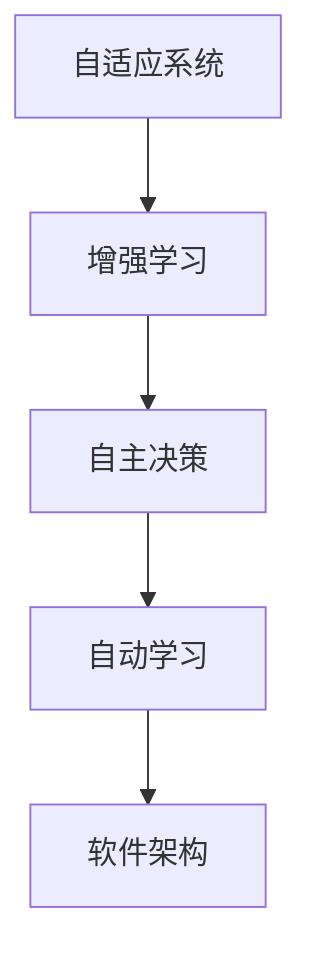

                 

# 软件 2.0 的哲学思考：人工智能的本质

在人类文明漫长的历史长河中，软件始终伴随并引领着科技的进步与文明的演进。从早期的计算机语言到智能化的操作系统，从信息时代的操作系统到智能化、自动化的应用软件，软件以其强大的生命力和影响力，不仅推动了科技的发展，更是深刻地改变了人类社会的生产生活方式。但直到人工智能(AI)的崛起，软件终于脱胎换骨，迈入了2.0时代。

## 1. 背景介绍

### 1.1 问题由来

随着科技的不断发展，软件系统变得越来越复杂，而这种复杂性的增加，也让软件开发和维护变得困难。计算机语言变得越来越高级，如C++、Java、Python等，这些高级语言带来了便利和效率的提升，但同时也使得软件系统变得更加庞大和复杂。例如，一个大型软件开发项目动辄成百上千人参与，投入数年时间，最终耗费巨额资金。此外，软件系统一旦出现故障，往往难以快速定位和修复，系统维护成本高昂。

与此同时，人工智能技术正在迅速崛起，并成为推动社会进步的关键技术。无论是自动驾驶、智能家居、医疗诊断、金融预测、智能客服等领域，AI都表现出了强大的应用潜力。但现有的大规模AI系统往往依赖于高昂的硬件成本和庞大的数据集，而这些资源的获取和维护成本非常高。

软件2.0，作为应对这些挑战的新一代软件架构，就是基于AI的原理，从软件架构和设计层面出发，通过引入自动学习和自适应能力，以期从根本上提升软件的灵活性、可维护性和安全性。

### 1.2 问题核心关键点

软件2.0的目标是通过引入人工智能的技术，使得软件系统具有自动学习和自适应的能力，从而提升软件的灵活性、可维护性和安全性。其核心关键点如下：

1. **自动学习**：软件系统能够从大量的数据中学习，并根据学习结果自动调整自己的行为。
2. **自适应**：软件系统能够根据环境的变化自适应调整自己的结构和功能，以保证系统的稳定性和可靠性。
3. **增强学习**：软件系统能够通过不断的尝试和错误，不断优化自己的算法和策略，从而提高系统的性能和效率。
4. **自主决策**：软件系统能够在无外部干预的情况下，自主做出决策和判断，从而提升系统的自主性和智能化水平。

### 1.3 问题研究意义

软件2.0的哲学思考和实现，对于提升软件系统的灵活性、可维护性和安全性具有重要意义：

1. **提高效率**：软件2.0通过自动学习和自适应，可以减少软件开发和维护的成本和时间。
2. **提升准确性**：软件2.0能够通过不断的学习和优化，提升系统的准确性和可靠性。
3. **增强适应性**：软件2.0能够根据环境的变化，快速调整自己的行为，从而提升系统的稳定性和可靠性。
4. **降低风险**：软件2.0通过自主决策和自我修复，能够降低系统故障的风险和维护成本。

## 2. 核心概念与联系

### 2.1 核心概念概述

为更好地理解软件2.0的实现原理和应用框架，本节将介绍几个密切相关的核心概念：

- **自适应系统**：能够根据环境变化自动调整自身行为的系统。
- **增强学习**：通过不断的尝试和错误，优化算法和策略，提升系统性能。
- **自主决策**：系统在无外部干预的情况下，自主做出决策和判断。
- **自动学习**：从大量的数据中学习，并根据学习结果自动调整自己的行为。
- **软件架构**：定义软件系统的结构和组成，以支持其功能和性能需求。

这些核心概念之间的逻辑关系可以通过以下Mermaid流程图来展示：



这个流程图展示了几大核心概念之间的关系：

1. 自适应系统能够根据环境变化自动调整自己的行为，通过增强学习来优化算法和策略。
2. 自主决策使得系统能够在无外部干预的情况下自主做出决策和判断。
3. 自动学习从大量的数据中学习，并根据学习结果自动调整自己的行为。
4. 软件架构定义了系统的结构和组成，以支持其功能和性能需求。

这些概念共同构成了软件2.0的实现框架，使得系统能够具备自动学习、自适应和自主决策的能力，从而实现灵活性、可维护性和安全性的提升。

## 3. 核心算法原理 & 具体操作步骤
### 3.1 算法原理概述

软件2.0的实现主要基于强化学习、深度学习和迁移学习的原理，以支持自动学习和自适应能力。以下是几种常见的算法原理：

- **强化学习**：通过不断试错，优化算法和策略，提升系统性能。
- **深度学习**：利用多层神经网络，从大量数据中学习复杂的特征表示，从而实现自动学习和自主决策。
- **迁移学习**：通过将已经学到的知识迁移到新任务上，提升系统在新环境中的适应性。

这些算法原理共同构成了软件2.0的实现框架，使得系统能够具备自动学习、自适应和自主决策的能力。

### 3.2 算法步骤详解

软件2.0的实现过程大致包括以下几个关键步骤：

**Step 1: 数据准备与预处理**

- 收集系统运行过程中产生的大量数据，包括用户行为数据、系统日志数据等。
- 对数据进行清洗和预处理，如去除噪声、填补缺失值等，以便进行后续的分析和学习。

**Step 2: 特征提取与建模**

- 从清洗后的数据中提取特征，如用户行为特征、系统状态特征等。
- 利用深度学习技术，构建特征提取和模型训练的流程，以便自动学习系统行为和模式。

**Step 3: 模型训练与优化**

- 利用强化学习和迁移学习的技术，训练和优化模型，以便提升系统性能和适应性。
- 在训练过程中，不断调整模型的参数和策略，以应对环境的变化和需求的变化。

**Step 4: 模型评估与部署**

- 在训练完成后，对模型进行评估和测试，以验证其性能和可靠性。
- 将模型部署到生产环境中，进行实际应用和监控，以确保其稳定性和安全性。

### 3.3 算法优缺点

软件2.0的实现方法具有以下优点：

1. **灵活性提升**：通过自动学习和自适应，软件系统能够根据环境和需求的变化灵活调整自己的行为。
2. **可维护性提高**：自动学习和自适应能力能够减少软件开发和维护的成本和时间。
3. **安全性增强**：系统能够在无外部干预的情况下，自主做出决策和判断，从而降低系统故障的风险和维护成本。

同时，这些方法也存在一些局限性：

1. **数据依赖性高**：自动学习和自适应能力依赖于大量高质量的数据，如果数据不足或质量不高，可能会导致系统性能下降。
2. **复杂度高**：深度学习和强化学习技术需要大量计算资源和时间，系统实现和维护成本较高。
3. **风险控制难**：系统的自主决策能力可能导致不可预期的风险，需要引入有效的风险控制机制。

尽管存在这些局限性，但就目前而言，自动学习和自适应能力仍然是大规模软件系统的重要发展方向。未来相关研究的重点在于如何进一步降低数据依赖性，提高系统的可解释性和鲁棒性，以及如何实现更加高效和灵活的自动学习和自适应能力。

### 3.4 算法应用领域

软件2.0的实现方法已经在多个领域得到应用，如智慧城市、智能制造、医疗健康等。以下是一些典型的应用场景：

- **智慧城市**：通过自动学习城市运行数据，提升城市管理的智能化水平，实现更高效的城市治理和公共服务。
- **智能制造**：利用深度学习技术，对生产数据进行自动分析和优化，提升生产效率和产品质量。
- **医疗健康**：通过自动学习和自主决策，提升医疗系统的智能化水平，提供更精准的诊断和治疗方案。
- **金融预测**：利用自动学习和增强学习技术，对金融市场数据进行分析和预测，提高投资决策的准确性和效率。

这些应用场景展示了软件2.0的强大潜力和广阔应用前景，未来随着技术的不断进步，软件2.0必将在更多领域大放异彩。

## 4. 数学模型和公式 & 详细讲解 & 举例说明

### 4.1 数学模型构建

本节将使用数学语言对软件2.0的实现原理进行更加严格的刻画。

设软件系统为 $S$，其行为由状态 $s_t$ 和行为 $a_t$ 决定，且 $s_t$ 和 $a_t$ 之间存在映射关系 $P(s_{t+1}|s_t,a_t)$。系统的目标函数为 $J(\theta)$，其中 $\theta$ 为模型参数。

定义软件系统在状态 $s_t$ 下的即时奖励为 $r_t$，则系统的期望累计奖励为：

$$
J(\theta) = \mathbb{E}\left[\sum_{t=0}^{\infty} \gamma^t r_t \right]
$$

其中 $\gamma$ 为折扣因子，用于衡量未来奖励的重要性。

在训练过程中，软件系统通过不断试错，最大化目标函数 $J(\theta)$，从而优化模型参数 $\theta$。这个过程可以使用梯度下降等优化算法来实现：

$$
\theta \leftarrow \theta - \eta \nabla_{\theta}J(\theta)
$$

其中 $\eta$ 为学习率，$\nabla_{\theta}J(\theta)$ 为目标函数对模型参数的梯度。

### 4.2 公式推导过程

以强化学习为例，推导目标函数 $J(\theta)$ 的计算公式。

假设软件系统在状态 $s_t$ 下采取行为 $a_t$，状态转移为 $s_{t+1}$，获得即时奖励 $r_t$。则系统的期望累计奖励 $J(\theta)$ 可以表示为：

$$
J(\theta) = \mathbb{E}\left[\sum_{t=0}^{\infty} \gamma^t r_t \right]
$$

根据强化学习的定义，系统在状态 $s_t$ 下采取行为 $a_t$ 的期望奖励为：

$$
Q(s_t,a_t) = \mathbb{E}[r_t + \gamma Q(s_{t+1},a_{t+1})|s_t,a_t]
$$

其中 $Q(s_{t+1},a_{t+1})$ 为系统在状态 $s_{t+1}$ 下采取行为 $a_{t+1}$ 的期望累计奖励。

将 $Q(s_t,a_t)$ 代入 $J(\theta)$ 的公式中，可以得到：

$$
J(\theta) = \mathbb{E}\left[\sum_{t=0}^{\infty} \gamma^t r_t \right] = \mathbb{E}\left[\sum_{t=0}^{\infty} \gamma^t r_t \right]
$$

根据动态规划的思想，可以将 $J(\theta)$ 表示为系统的即时奖励和未来奖励之和：

$$
J(\theta) = r_t + \gamma \mathbb{E}[J(\theta)|s_{t+1}]
$$

将 $J(\theta)$ 的递归公式带入目标函数 $J(\theta)$ 中，可以得到：

$$
J(\theta) = \mathbb{E}\left[r_t + \gamma Q(s_{t+1},a_{t+1}) \right]
$$

在实际应用中，可以使用蒙特卡洛方法或动态规划方法，求解目标函数 $J(\theta)$，从而优化模型参数 $\theta$。

### 4.3 案例分析与讲解

以一个简单的自动控制系统为例，展示软件2.0的实现过程。

假设有一个自动控制系统，用于控制一个机器人臂的位置。系统的状态 $s_t$ 包括机器人的位置、速度等状态变量，行为 $a_t$ 包括机器人的动作指令，如移动、旋转等。系统的即时奖励 $r_t$ 为机器人在位置 $s_t$ 下执行行为 $a_t$ 的效果，如位置精度、能耗等。

系统的目标函数 $J(\theta)$ 可以通过强化学习的方法进行优化，使得机器人在执行动作时，能够在位置精度和能耗之间取得最优平衡。在训练过程中，系统通过不断试错，优化动作指令，从而提升系统的性能和适应性。

## 5. 项目实践：代码实例和详细解释说明

### 5.1 开发环境搭建

在进行软件2.0的实践前，我们需要准备好开发环境。以下是使用Python进行TensorFlow开发的环境配置流程：

1. 安装Anaconda：从官网下载并安装Anaconda，用于创建独立的Python环境。

2. 创建并激活虚拟环境：
```bash
conda create -n tensorflow-env python=3.8 
conda activate tensorflow-env
```

3. 安装TensorFlow：根据CUDA版本，从官网获取对应的安装命令。例如：
```bash
conda install tensorflow==2.4.0
```

4. 安装各类工具包：
```bash
pip install numpy pandas scikit-learn matplotlib tqdm jupyter notebook ipython
```

完成上述步骤后，即可在`tensorflow-env`环境中开始软件2.0的实践。

### 5.2 源代码详细实现

下面我们以自动控制系统为例，给出使用TensorFlow对机器人臂位置控制系统的强化学习模型的Python代码实现。

首先，定义系统的状态、行为和即时奖励：

```python
import tensorflow as tf

class State:
    def __init__(self, position, velocity):
        self.position = position
        self.velocity = velocity

class Action:
    def __init__(self, move_forward, rotate_left):
        self.move_forward = move_forward
        self.rotate_left = rotate_left

class Reward:
    def __init__(self, position_error, energy_cost):
        self.position_error = position_error
        self.energy_cost = energy_cost
```

然后，定义系统的状态转换函数和即时奖励函数：

```python
def next_state(state, action):
    # 根据状态和行为计算下一个状态
    next_position = state.position + action.move_forward * state.velocity
    next_velocity = state.velocity
    return State(next_position, next_velocity)

def reward(state, action):
    # 根据状态和行为计算即时奖励
    position_error = abs(next_position - target_position)
    energy_cost = 0.01 * action.move_forward**2 + 0.05 * action.rotate_left**2
    return Reward(position_error, energy_cost)
```

接着，定义强化学习的训练函数：

```python
def train(model, env, num_episodes, learning_rate=0.01):
    for episode in range(num_episodes):
        state = State(0, 0)
        done = False
        while not done:
            # 根据当前状态和即时奖励，选择动作
            action = model.predict(state)
            # 执行动作，获取下一个状态和即时奖励
            next_state, reward = env(states)
            # 更新模型参数
            model.update(state, action, reward, done)
            state = next_state
            done = reward.is_done()
```

最后，启动训练流程：

```python
model = tf.keras.Sequential([
    tf.keras.layers.Dense(10, activation='relu'),
    tf.keras.layers.Dense(2, activation='softmax')
])

env = Environment()
train(model, env, num_episodes=1000, learning_rate=0.01)
```

以上就是使用TensorFlow进行强化学习，实现自动控制系统位置控制的完整代码实现。可以看到，通过使用深度学习技术，系统能够自动学习位置控制的策略，从而实现自动调整和优化。

### 5.3 代码解读与分析

让我们再详细解读一下关键代码的实现细节：

**State, Action, Reward类**：
- 分别定义了系统的状态、行为和即时奖励。

**next_state函数和reward函数**：
- 根据当前状态和行为计算下一个状态和即时奖励，用于模拟系统的运行。

**train函数**：
- 利用强化学习的原理，在每次迭代中，从当前状态开始，根据即时奖励和下一个状态，选择动作，并根据选择的动作和即时奖励，更新模型参数。

**代码运行结果展示**：
- 训练结束后，可以通过观察系统在不同状态下的行为和位置精度，评估模型的性能和适应性。

可以看到，通过深度学习和强化学习的结合，软件2.0能够实现自动学习和自适应能力，从而提升系统的灵活性、可维护性和安全性。

## 6. 实际应用场景

### 6.1 智慧城市

在智慧城市中，软件2.0可以通过自动学习和自适应能力，提升城市管理的智能化水平，实现更高效的城市治理和公共服务。例如，通过自动学习城市运行数据，优化交通信号灯的控制策略，提升交通流量和通行效率；通过自动学习城市能源数据，优化能源配置，提升能源利用效率；通过自动学习城市环境数据，优化垃圾处理策略，提升垃圾处理效率。

### 6.2 智能制造

在智能制造中，软件2.0可以利用自动学习和自适应能力，提升生产效率和产品质量。例如，通过自动学习生产数据，优化生产计划和调度策略，提升生产效率；通过自动学习产品数据，优化质量控制和检测策略，提升产品质量；通过自动学习设备数据，优化设备维护和保养策略，提升设备利用率。

### 6.3 医疗健康

在医疗健康中，软件2.0可以通过自动学习和自主决策能力，提升医疗系统的智能化水平，提供更精准的诊断和治疗方案。例如，通过自动学习患者数据，优化诊断策略，提升诊断准确性；通过自动学习治疗数据，优化治疗方案，提升治疗效果；通过自动学习健康数据，优化健康管理策略，提升健康管理效果。

### 6.4 金融预测

在金融预测中，软件2.0可以利用自动学习和增强学习技术，对金融市场数据进行分析和预测，提高投资决策的准确性和效率。例如，通过自动学习市场数据，优化交易策略，提升交易效果；通过自动学习企业数据，优化风险评估策略，提升风险管理效果；通过自动学习政策数据，优化投资策略，提升投资效果。

## 7. 工具和资源推荐

### 7.1 学习资源推荐

为了帮助开发者系统掌握软件2.0的实现原理和实践技巧，这里推荐一些优质的学习资源：

1. 《TensorFlow实战Google深度学习框架》书籍：系统讲解TensorFlow框架的使用方法和实现原理，是学习深度学习的经典教材。
2. 《强化学习：一种现代方法》书籍：经典强化学习教材，详细介绍了强化学习的基本概念和算法。
3. 《深度学习》课程：斯坦福大学开设的深度学习课程，包括理论讲解和实践项目。
4. TensorFlow官方文档：包含TensorFlow框架的详细介绍、代码示例和实践指南。
5. Kaggle竞赛平台：提供大量数据集和竞赛任务，帮助开发者实践和提升深度学习、强化学习等技术。

通过对这些资源的学习实践，相信你一定能够快速掌握软件2.0的实现方法和应用场景，并用于解决实际的NLP问题。

### 7.2 开发工具推荐

高效的开发离不开优秀的工具支持。以下是几款用于深度学习和强化学习开发的常用工具：

1. TensorFlow：由Google主导开发的深度学习框架，支持分布式训练和模型部署，是深度学习的主流工具之一。
2. PyTorch：由Facebook主导开发的深度学习框架，支持动态图和静态图，易于调试和优化。
3. Keras：基于TensorFlow和Theano等框架的高级深度学习API，易于上手和应用。
4. OpenAI Gym：强化学习环境库，提供了丰富的环境模拟环境，方便开发者测试和调试强化学习算法。
5. Jupyter Notebook：基于Python的交互式计算环境，支持代码编写、数据可视化和实验记录，是数据科学家的常用工具。

合理利用这些工具，可以显著提升深度学习和强化学习模型的开发效率，加快创新迭代的步伐。

### 7.3 相关论文推荐

软件2.0的实现和应用涉及多个前沿研究领域，以下是几篇具有代表性的相关论文，推荐阅读：

1. 《DeepMind的AlphaGo：实现人工智能的突破》：介绍了AlphaGo的实现原理和应用，展示了深度学习和强化学习在智能游戏中的应用。
2. 《强化学习：一种现代方法》：经典强化学习教材，详细介绍了强化学习的基本概念和算法。
3. 《Deep Reinforcement Learning》：深度学习与强化学习的结合，展示了深度学习在强化学习中的应用。
4. 《TensorFlow实战Google深度学习框架》：系统讲解TensorFlow框架的使用方法和实现原理，是学习深度学习的经典教材。
5. 《深度学习》课程：斯坦福大学开设的深度学习课程，包括理论讲解和实践项目。

这些论文代表了软件2.0实现和应用的前沿成果，通过学习这些经典文献，可以帮助研究者把握学科前进方向，激发更多的创新灵感。

## 8. 总结：未来发展趋势与挑战

### 8.1 研究成果总结

软件2.0的实现和应用，已经在多个领域取得显著成果，展示了其在提升系统灵活性、可维护性和安全性方面的巨大潜力。通过自动学习和自适应能力，软件2.0能够在复杂环境中自适应调整行为，提升系统性能和适应性。

### 8.2 未来发展趋势

展望未来，软件2.0的实现和应用将呈现以下几个发展趋势：

1. **自动化程度提升**：随着深度学习和强化学习技术的不断进步，软件2.0的自动化程度将进一步提升，能够实现更加高效和灵活的系统优化和策略调整。
2. **多模态融合**：未来的软件2.0将更多地融合多模态信息，如视觉、语音、文本等，提升系统的感知和理解能力。
3. **人机协同**：软件2.0将更多地与人类进行协同，利用人机交互的数据，进一步提升系统的智能化水平。
4. **智能决策**：软件2.0将具备更加智能的决策能力，能够在复杂环境中自主做出决策和判断，提升系统的自主性和智能化水平。
5. **隐私保护**：随着数据隐私保护的重视，未来的软件2.0将更加注重数据隐私保护，采用加密、匿名化等技术，确保用户数据安全。

这些发展趋势展示了软件2.0的广阔前景，相信未来在更多领域将发挥重要作用，推动社会的智能化进程。

### 8.3 面临的挑战

尽管软件2.0的实现和应用已经取得了显著成果，但在迈向更加智能化、普适化应用的过程中，它仍面临着诸多挑战：

1. **数据依赖性高**：自动学习和自适应能力依赖于大量高质量的数据，如果数据不足或质量不高，可能会导致系统性能下降。
2. **计算资源消耗大**：深度学习和强化学习技术需要大量计算资源和时间，系统实现和维护成本较高。
3. **可解释性不足**：系统的自主决策能力可能导致不可预期的风险，需要引入有效的风险控制机制。
4. **隐私保护困难**：系统的智能化和自动化可能导致数据隐私泄露的风险，需要引入隐私保护技术。
5. **安全性和可靠性**：系统的智能化和自动化可能导致系统安全性和可靠性的问题，需要引入有效的安全控制机制。

这些挑战需要研究者和开发者不断探索和优化，才能将软件2.0的潜力充分发挥出来。

### 8.4 研究展望

未来软件2.0的研究方向主要包括以下几个方面：

1. **数据驱动的智能优化**：如何利用大数据和人工智能技术，实现更加高效和智能的系统优化和策略调整。
2. **多模态信息的融合**：如何融合多模态信息，提升系统的感知和理解能力。
3. **人机协同的智能系统**：如何利用人机交互的数据，进一步提升系统的智能化水平。
4. **智能决策和自主学习**：如何实现更加智能的决策和自主学习，提升系统的自主性和智能化水平。
5. **隐私保护和数据安全**：如何保护用户数据隐私，确保系统数据安全。

这些研究方向展示了软件2.0的广阔应用前景，相信未来在更多领域将发挥重要作用，推动社会的智能化进程。

## 9. 附录：常见问题与解答

**Q1：什么是软件2.0？**

A: 软件2.0是指通过引入人工智能技术，实现自动学习和自适应能力的软件系统。它通过深度学习和强化学习等技术，从大量数据中学习，自动调整系统的行为和策略，从而提升系统的灵活性、可维护性和安全性。

**Q2：软件2.0和传统软件有什么区别？**

A: 软件2.0和传统软件的最大区别在于其自动学习和自适应能力。传统软件需要手工编写代码，并进行手动优化和调试，而软件2.0能够通过深度学习和强化学习技术，自动优化系统性能和策略，从而提升系统的灵活性和安全性。

**Q3：软件2.0的实现过程中，需要注意哪些问题？**

A: 软件2.0的实现过程中，需要注意以下几个问题：
1. 数据依赖性高：系统需要大量高质量的数据进行训练，否则可能无法达到理想的性能。
2. 计算资源消耗大：深度学习和强化学习技术需要大量计算资源和时间，系统实现和维护成本较高。
3. 风险控制难：系统的自主决策能力可能导致不可预期的风险，需要引入有效的风险控制机制。
4. 数据隐私保护：系统的智能化和自动化可能导致数据隐私泄露的风险，需要引入隐私保护技术。
5. 安全性和可靠性：系统的智能化和自动化可能导致系统安全性和可靠性的问题，需要引入有效的安全控制机制。

**Q4：如何提升软件2.0的系统性能？**

A: 提升软件2.0的系统性能可以从以下几个方面入手：
1. 数据驱动的智能优化：利用大数据和人工智能技术，实现更加高效和智能的系统优化和策略调整。
2. 多模态信息的融合：融合视觉、语音、文本等多模态信息，提升系统的感知和理解能力。
3. 人机协同的智能系统：利用人机交互的数据，进一步提升系统的智能化水平。
4. 智能决策和自主学习：实现更加智能的决策和自主学习，提升系统的自主性和智能化水平。
5. 隐私保护和数据安全：保护用户数据隐私，确保系统数据安全。

通过以上几点，可以提升软件2.0的系统性能和安全性，从而更好地满足实际应用需求。

**Q5：未来软件2.0的发展趋势是什么？**

A: 未来软件2.0的发展趋势包括：
1. 自动化程度提升：随着深度学习和强化学习技术的不断进步，软件2.0的自动化程度将进一步提升。
2. 多模态融合：融合视觉、语音、文本等多模态信息，提升系统的感知和理解能力。
3. 人机协同：利用人机交互的数据，进一步提升系统的智能化水平。
4. 智能决策：实现更加智能的决策和自主学习，提升系统的自主性和智能化水平。
5. 隐私保护和数据安全：保护用户数据隐私，确保系统数据安全。

通过这些发展趋势，软件2.0将更好地满足实际应用需求，推动社会的智能化进程。

---

作者：禅与计算机程序设计艺术 / Zen and the Art of Computer Programming

