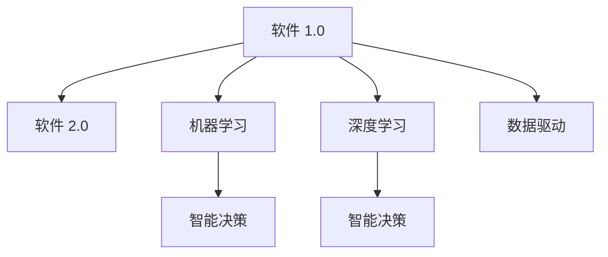

                 

# 软件 2.0 的哲学思考：人工智能的本质

> 关键词：人工智能, 软件 2.0, 哲学思考, 算法原理, 机器学习, 深度学习, 数据驱动, 智能决策

## 1. 背景介绍

### 1.1 问题的提出
随着人工智能技术的迅猛发展，我们正在经历一场由软件 1.0 到软件 2.0 的根本变革。软件 2.0 的核心特征在于其智能化的本质，即通过大数据和机器学习算法，赋予软件系统以自学习和自我优化能力。这种能力的实现，离不开对人工智能本质的深刻理解。

### 1.2 问题的核心关键点
软件 2.0 与软件 1.0 的最大区别在于其智能特性。在软件 1.0 时代，开发者通过显式编程实现软件功能，而软件 2.0 时代，软件系统通过数据和算法实现智能决策，其本质是对人工智能的深度应用。

1. **算法原理**：软件 2.0 的核心算法包括机器学习、深度学习等，这些算法通过模型训练和优化，实现对输入数据的智能分析和决策。
2. **数据驱动**：软件 2.0 系统的行为和决策完全依赖于数据，数据的质量和多样性直接影响系统的智能水平。
3. **智能决策**：通过训练有素的模型，软件 2.0 系统能够自动完成复杂任务，如图像识别、语音识别、自然语言处理等。
4. **自适应能力**：软件 2.0 系统能够不断从新数据中学习，提高自身的智能水平和适应性。

### 1.3 问题的研究意义
研究软件 2.0 的哲学思考，不仅有助于深刻理解人工智能的本质，还能指导开发者构建更智能、更高效的软件系统。这将促进人工智能技术的进一步发展，为社会各个领域带来革命性的变化。

## 2. 核心概念与联系

### 2.1 核心概念概述

为了更好地理解软件 2.0 的哲学思考，本节将介绍几个密切相关的核心概念：

- **软件 1.0**：传统的软件开发方式，依赖于人工编程，缺乏智能决策能力。
- **软件 2.0**：基于人工智能的软件开发方式，通过数据和算法实现智能决策。
- **机器学习**：一种人工智能技术，通过训练模型，使计算机能够从数据中自动学习规律，进行智能预测和决策。
- **深度学习**：一种机器学习技术，使用神经网络模型模拟人类大脑的工作原理，实现对复杂数据的高效处理。
- **智能决策**：软件系统根据输入的数据，通过训练有素的模型自动做出最优决策。

这些核心概念之间的逻辑关系可以通过以下Mermaid流程图来展示：



这个流程图展示了软件从 1.0 到 2.0 的演变过程，以及机器学习和深度学习在智能决策中的作用。

## 3. 核心算法原理 & 具体操作步骤
### 3.1 算法原理概述

软件 2.0 的哲学思考主要围绕以下三个核心算法原理展开：

1. **数据驱动**：软件 2.0 系统完全依赖于数据，通过数据驱动算法进行智能决策。
2. **机器学习**：使用机器学习算法，使计算机能够从数据中自动学习规律，进行智能预测和决策。
3. **深度学习**：通过深度学习算法，模拟人类大脑的工作原理，实现对复杂数据的高效处理。

### 3.2 算法步骤详解

软件 2.0 的实现一般包括以下几个关键步骤：

**Step 1: 数据准备**
- 收集和整理与任务相关的数据，确保数据的质量和多样性。
- 将数据划分为训练集、验证集和测试集，用于模型的训练、调参和评估。

**Step 2: 模型选择**
- 根据任务特点选择合适的机器学习或深度学习模型，如线性回归、决策树、随机森林、卷积神经网络、循环神经网络等。
- 设定模型的超参数，如学习率、批大小、迭代轮数等，初始化模型参数。

**Step 3: 模型训练**
- 使用训练集数据对模型进行训练，通过前向传播和反向传播算法更新模型参数。
- 在每个epoch后，使用验证集评估模型性能，根据验证集损失调整学习率等超参数。
- 当验证集损失不再下降时，停止训练。

**Step 4: 模型评估**
- 使用测试集对模型进行最终评估，计算准确率、召回率、F1-score等指标。
- 分析模型的预测结果与实际结果之间的差异，进行误差分析。

**Step 5: 模型部署**
- 将训练好的模型保存并部署到生产环境中。
- 设置数据输入和输出接口，使得模型能够接收新的数据，并自动进行智能决策。

### 3.3 算法优缺点

软件 2.0 的实现具有以下优点：

1. **智能决策**：通过数据驱动和算法优化，软件 2.0 系统能够实现高度智能化的决策。
2. **高效率**：相较于人工编程，软件 2.0 系统能够快速响应变化，适应新的数据和任务。
3. **可扩展性**：算法和模型的可扩展性使得软件 2.0 系统可以应用于各种复杂场景。

同时，软件 2.0 也存在一些局限性：

1. **数据依赖**：软件 2.0 系统依赖于高质量的数据，数据的获取和处理成本较高。
2. **算法复杂**：机器学习算法和深度学习模型往往需要复杂的计算和大量的数据，对计算资源和存储要求较高。
3. **模型泛化**：训练好的模型可能对新数据泛化能力不足，需要不断优化和调整。
4. **黑盒特性**：机器学习模型的决策过程难以解释，缺乏透明性。

### 3.4 算法应用领域

软件 2.0 的实现已经广泛应用于多个领域，如：

- **自然语言处理**：使用深度学习模型进行文本分类、情感分析、机器翻译等任务。
- **计算机视觉**：使用卷积神经网络进行图像识别、物体检测、图像生成等任务。
- **推荐系统**：使用机器学习算法实现个性化推荐、广告投放等任务。
- **金融预测**：使用深度学习模型进行股票预测、信用评分等任务。
- **智能制造**：使用机器学习算法进行设备监控、质量控制等任务。

除了上述这些经典应用外，软件 2.0 还在医疗、教育、交通等多个领域得到广泛应用，为各行各业带来了革命性的变革。

## 4. 数学模型和公式 & 详细讲解 & 举例说明

### 4.1 数学模型构建

本节将使用数学语言对软件 2.0 的实现过程进行更加严格的刻画。

记输入数据为 $x \in \mathcal{X}$，其中 $\mathcal{X}$ 为输入空间。模型输出为 $y \in \mathcal{Y}$，其中 $\mathcal{Y}$ 为输出空间。模型的目标是最小化预测值 $y'=\hat{y}(x)$ 与真实值 $y$ 之间的损失函数 $\ell(y',y)$。

常见的损失函数包括均方误差损失（MSE）、交叉熵损失（Cross-Entropy Loss）等。以交叉熵损失为例，定义如下：

$$
\ell(y',y) = -\sum_{i=1}^N y_i\log \hat{y}_i
$$

在训练过程中，通过最小化损失函数来更新模型参数 $\theta$。常用的优化算法包括梯度下降（Gradient Descent）、随机梯度下降（SGD）、Adam等。

### 4.2 公式推导过程

以下我们以回归问题为例，推导梯度下降算法的公式及其推导过程。

假设回归问题的目标是最小化预测值与真实值之间的平方误差，即损失函数为：

$$
\ell(y',y) = \frac{1}{2}(y - y')^2
$$

定义模型参数为 $\theta$，则预测值 $y'=\hat{y}(x;\theta)$ 可以表示为：

$$
\hat{y}(x;\theta) = \theta_0 + \sum_{i=1}^d \theta_i x_i
$$

其中 $\theta_0$ 为截距，$\theta_i$ 为第 $i$ 个特征的权重。

对损失函数 $\ell(y',y)$ 对模型参数 $\theta$ 求偏导数，得到梯度 $\nabla_{\theta}\ell(y',y)$：

$$
\nabla_{\theta}\ell(y',y) = -(y - y') \frac{\partial y'}{\partial \theta} = -(y - \hat{y}) \frac{\partial \hat{y}}{\partial \theta}
$$

梯度下降算法的更新公式为：

$$
\theta \leftarrow \theta - \eta \nabla_{\theta}\ell(y',y)
$$

其中 $\eta$ 为学习率。

通过以上公式推导，我们可以看到，软件 2.0 的实现过程实质上是通过最小化损失函数来更新模型参数，从而实现智能决策。

### 4.3 案例分析与讲解

以房价预测为例，通过训练一个回归模型来进行案例分析：

假设已知房屋面积 $x_1$、房龄 $x_2$、位置 $x_3$ 与房价 $y$ 之间的数据，构建一个线性回归模型：

$$
\hat{y} = \theta_0 + \theta_1 x_1 + \theta_2 x_2 + \theta_3 x_3
$$

使用梯度下降算法进行模型训练，计算每个样本的损失，并更新模型参数。最终模型输出预测房价 $y'$。

## 5. 项目实践：代码实例和详细解释说明
### 5.1 开发环境搭建

在进行软件 2.0 的实现前，我们需要准备好开发环境。以下是使用Python进行TensorFlow开发的环境配置流程：

1. 安装Anaconda：从官网下载并安装Anaconda，用于创建独立的Python环境。

2. 创建并激活虚拟环境：
```bash
conda create -n tf-env python=3.8 
conda activate tf-env
```

3. 安装TensorFlow：根据CUDA版本，从官网获取对应的安装命令。例如：
```bash
conda install tensorflow==2.6
```

4. 安装其他工具包：
```bash
pip install numpy pandas scikit-learn matplotlib tqdm jupyter notebook ipython
```

完成上述步骤后，即可在`tf-env`环境中开始软件 2.0 的实现。

### 5.2 源代码详细实现

这里我们以房价预测为例，使用TensorFlow实现一个线性回归模型。

首先，定义模型结构：

```python
import tensorflow as tf

class LinearRegressionModel:
    def __init__(self, input_size, output_size):
        self.input_size = input_size
        self.output_size = output_size
        self.weights = tf.Variable(tf.random.normal([input_size, output_size]))
        self.bias = tf.Variable(tf.zeros([output_size]))
    
    def __call__(self, x):
        return tf.matmul(x, self.weights) + self.bias
```

然后，定义损失函数和优化器：

```python
def mean_squared_error(y_true, y_pred):
    return tf.reduce_mean(tf.square(y_true - y_pred))

def mean_absolute_error(y_true, y_pred):
    return tf.reduce_mean(tf.abs(y_true - y_pred))

def train_model(model, x_train, y_train, x_test, y_test, learning_rate, epochs):
    optimizer = tf.optimizers.Adam(learning_rate)
    
    for epoch in range(epochs):
        with tf.GradientTape() as tape:
            y_pred = model(x_train)
            loss = mean_squared_error(y_train, y_pred)
        grads = tape.gradient(loss, model.trainable_variables)
        optimizer.apply_gradients(zip(grads, model.trainable_variables))
        
        if epoch % 100 == 0:
            y_pred = model(x_test)
            print(f'Epoch {epoch+1}, loss: {loss.numpy():.4f}, mse: {mean_squared_error(y_test, y_pred).numpy():.4f}, mae: {mean_absolute_error(y_test, y_pred).numpy():.4f}')
```

最后，训练并评估模型：

```python
# 准备数据
x_train = ...
y_train = ...
x_test = ...
y_test = ...

# 创建模型
model = LinearRegressionModel(input_size, output_size)

# 训练模型
train_model(model, x_train, y_train, x_test, y_test, learning_rate, epochs)

# 评估模型
y_pred = model(x_test)
print(f'Test loss: {mean_squared_error(y_test, y_pred):.4f}, Test mse: {mean_squared_error(y_test, y_pred):.4f}, Test mae: {mean_absolute_error(y_test, y_pred):.4f}')
```

以上就是使用TensorFlow实现线性回归模型的完整代码实现。可以看到，TensorFlow提供了强大的API和工具，使得模型训练和优化过程变得简洁高效。

### 5.3 代码解读与分析

让我们再详细解读一下关键代码的实现细节：

**LinearRegressionModel类**：
- `__init__`方法：初始化模型的输入、输出大小、权重和偏置等参数。
- `__call__`方法：定义模型的前向传播过程，计算输出。

**mean_squared_error和mean_absolute_error函数**：
- 计算预测值与真实值之间的平方误差和绝对误差。

**train_model函数**：
- 使用Adam优化器，通过梯度下降算法更新模型参数。
- 在每个epoch后，使用测试集评估模型性能，并输出损失和误差。

**训练流程**：
- 创建模型对象。
- 定义训练集和测试集数据。
- 调用`train_model`函数进行模型训练。
- 在训练结束后，使用测试集评估模型性能。

可以看到，TensorFlow的高级API和优化器使得模型训练和评估变得非常简单，开发者可以更专注于模型的构建和优化。

## 6. 实际应用场景
### 6.1 智能客服系统

软件 2.0 的智能决策特性，使其在智能客服系统中的应用前景广阔。传统客服系统依赖于人工回答，响应速度慢且一致性差。通过软件 2.0 技术，客服系统可以实现自动回答，提高响应速度和准确性。

在技术实现上，可以收集企业内部的历史客服对话记录，构建监督数据集，使用深度学习模型对客服系统进行微调。微调后的模型能够自动理解客户意图，匹配最合适的回答模板进行回复。对于客户提出的新问题，还可以接入检索系统实时搜索相关内容，动态组织生成回答。如此构建的智能客服系统，能大幅提升客户咨询体验和问题解决效率。

### 6.2 金融舆情监测

软件 2.0 的智能决策特性，使其在金融舆情监测中的应用前景广阔。金融机构需要实时监测市场舆论动向，以便及时应对负面信息传播，规避金融风险。传统的人工监测方式成本高、效率低，难以应对网络时代海量信息爆发的挑战。

通过软件 2.0 技术，可以构建基于机器学习和深度学习的金融舆情监测系统，实时抓取网络文本数据，自动判断文本所属主题和情感倾向。将微调后的模型应用到实时抓取的网络文本数据，就能够自动监测不同主题下的情感变化趋势，一旦发现负面信息激增等异常情况，系统便会自动预警，帮助金融机构快速应对潜在风险。

### 6.3 个性化推荐系统

软件 2.0 的智能决策特性，使其在个性化推荐系统中的应用前景广阔。当前的推荐系统往往只依赖用户的历史行为数据进行物品推荐，无法深入理解用户的真实兴趣偏好。通过软件 2.0 技术，推荐系统可以更好地挖掘用户行为背后的语义信息，从而提供更精准、多样的推荐内容。

在实践中，可以收集用户浏览、点击、评论、分享等行为数据，提取和用户交互的物品标题、描述、标签等文本内容。将文本内容作为模型输入，用户的后续行为（如是否点击、购买等）作为监督信号，在此基础上使用深度学习模型对推荐系统进行微调。微调后的模型能够从文本内容中准确把握用户的兴趣点。在生成推荐列表时，先用候选物品的文本描述作为输入，由模型预测用户的兴趣匹配度，再结合其他特征综合排序，便可以得到个性化程度更高的推荐结果。

### 6.4 未来应用展望

随着软件 2.0 技术的发展，未来其在更多领域的应用前景将更加广阔。

在智慧医疗领域，软件 2.0 的智能决策特性，使其在医疗问答、病历分析、药物研发等应用中具有巨大潜力。通过构建基于深度学习模型的医疗系统，可以大幅提升医疗服务的智能化水平，辅助医生诊疗，加速新药开发进程。

在智能教育领域，软件 2.0 的智能决策特性，使其在作业批改、学情分析、知识推荐等方面具有广泛应用。通过构建基于机器学习的教育系统，可以因材施教，促进教育公平，提高教学质量。

在智慧城市治理中，软件 2.0 的智能决策特性，使其在城市事件监测、舆情分析、应急指挥等环节具有重要应用。通过构建基于深度学习模型的智慧城市系统，可以提高城市管理的自动化和智能化水平，构建更安全、高效的未来城市。

此外，在企业生产、社会治理、文娱传媒等众多领域，软件 2.0 的应用也将不断涌现，为经济社会发展注入新的动力。相信随着技术的日益成熟，软件 2.0 必将在更广阔的应用领域大放异彩，深刻影响人类的生产生活方式。

## 7. 工具和资源推荐
### 7.1 学习资源推荐

为了帮助开发者系统掌握软件 2.0 的实现理论基础和实践技巧，这里推荐一些优质的学习资源：

1. **《深度学习》书籍**：Ian Goodfellow等所著，全面介绍了深度学习的基础和高级技术，包括回归、分类、序列模型等。
2. **TensorFlow官方文档**：TensorFlow的官方文档，提供了丰富的API和示例，帮助开发者快速上手。
3. **Kaggle竞赛平台**：提供大量数据集和比赛，锻炼开发者的模型训练和调参能力。
4. **Coursera《机器学习》课程**：Andrew Ng等主持，系统介绍了机器学习的基本概念和算法。
5. **fast.ai课程**：由Jeremy Howard等主讲，介绍了快速实现深度学习模型的框架和方法。

通过对这些资源的学习实践，相信你一定能够快速掌握软件 2.0 的实现精髓，并用于解决实际的NLP问题。

### 7.2 开发工具推荐

高效的开发离不开优秀的工具支持。以下是几款用于软件 2.0 开发的常用工具：

1. **Jupyter Notebook**：用于编写和执行Python代码，支持丰富的代码编辑和可视化功能。
2. **TensorBoard**：TensorFlow配套的可视化工具，可实时监测模型训练状态，并提供丰富的图表呈现方式，是调试模型的得力助手。
3. **Keras**：高级深度学习框架，封装了TensorFlow等底层库，使得模型构建和训练更加简便。
4. **Scikit-Learn**：常用的机器学习库，提供了丰富的算法和工具，支持快速实现和调参。
5. **PyTorch**：灵活的深度学习框架，支持动态图和静态图两种计算图模型。

合理利用这些工具，可以显著提升软件 2.0 的开发效率，加快创新迭代的步伐。

### 7.3 相关论文推荐

软件 2.0 技术的发展源于学界的持续研究。以下是几篇奠基性的相关论文，推荐阅读：

1. **《深度学习》书籍**：Ian Goodfellow等所著，全面介绍了深度学习的基础和高级技术，包括回归、分类、序列模型等。
2. **《计算机视觉：模型、学习和推理》书籍**：Ross Girshick等所著，介绍了计算机视觉领域的基础和最新进展，包括图像分类、目标检测等。
3. **《自然语言处理综论》书籍**：Christopher D. Manning等所著，介绍了自然语言处理的基础和高级技术，包括语言模型、机器翻译等。
4. **AlphaGo论文**：DeepMind团队发表，展示了深度强化学习在围棋中的应用，开创了人工智能的新纪元。

这些论文代表了大语言模型微调技术的发展脉络。通过学习这些前沿成果，可以帮助研究者把握学科前进方向，激发更多的创新灵感。

## 8. 总结：未来发展趋势与挑战

### 8.1 总结

本文对软件 2.0 的实现过程进行了全面系统的介绍。首先阐述了软件 2.0 的哲学思考，明确了其智能决策的本质。其次，从原理到实践，详细讲解了机器学习和深度学习算法的实现过程，给出了软件 2.0 的完整代码实现。同时，本文还广泛探讨了软件 2.0 在多个领域的应用前景，展示了其巨大的潜力。此外，本文精选了软件 2.0 技术的各类学习资源，力求为读者提供全方位的技术指引。

通过本文的系统梳理，可以看到，软件 2.0 技术的智能决策特性，正在逐步取代传统的显式编程，引领人工智能技术的发展方向。其应用前景广阔，必将深刻影响人类社会的各个方面。

### 8.2 未来发展趋势

展望未来，软件 2.0 技术的未来发展趋势如下：

1. **算法复杂性提升**：随着深度学习技术的发展，未来软件 2.0 系统将更加复杂，能够处理更加复杂的数据和任务。
2. **模型规模增大**：随着硬件计算能力的提升，软件 2.0 系统的模型规模将持续增大，具备更强的智能决策能力。
3. **自适应能力增强**：未来软件 2.0 系统将具备更强的自适应能力，能够不断从新数据中学习，提高自身的智能水平和适应性。
4. **跨领域应用增多**：随着算法的不断优化和应用场景的拓展，软件 2.0 技术将在更多领域得到应用，如金融、医疗、教育等。
5. **安全性和隐私保护**：未来软件 2.0 系统将更加注重数据安全和隐私保护，采用差分隐私等技术，保护用户数据。
6. **伦理和道德约束**：软件 2.0 技术的广泛应用将带来新的伦理和道德问题，如何制定合理的算法规范和监管机制，将是重要的研究方向。

以上趋势凸显了软件 2.0 技术的广阔前景。这些方向的探索发展，必将进一步提升人工智能技术的性能和应用范围，为社会各个领域带来革命性的变化。

### 8.3 面临的挑战

尽管软件 2.0 技术已经取得了瞩目成就，但在迈向更加智能化、普适化应用的过程中，它仍面临着诸多挑战：

1. **数据获取成本高**：高质量的数据获取和处理成本较高，数据质量和多样性直接影响模型的性能。
2. **模型复杂度高**：深度学习模型和算法复杂度较高，需要大量的计算资源和存储空间。
3. **模型泛化能力不足**：训练好的模型可能对新数据泛化能力不足，需要不断优化和调整。
4. **系统安全性差**：模型可能存在漏洞，被恶意攻击者利用，导致系统安全性问题。
5. **算法透明性低**：深度学习模型缺乏透明性，难以解释其内部工作机制和决策逻辑。
6. **伦理和道德风险**：算法的广泛应用可能带来新的伦理和道德问题，如偏见、歧视等。

正视软件 2.0 面临的这些挑战，积极应对并寻求突破，将是大语言模型微调走向成熟的必由之路。相信随着学界和产业界的共同努力，这些挑战终将一一被克服，软件 2.0 必将在构建人机协同的智能时代中扮演越来越重要的角色。

### 8.4 研究展望

面对软件 2.0 面临的诸多挑战，未来的研究需要在以下几个方面寻求新的突破：

1. **数据增强和数据生成**：通过数据增强和生成技术，扩大数据集规模，提升模型的泛化能力。
2. **模型压缩和加速**：开发更高效的模型压缩和加速技术，降低计算成本和存储需求。
3. **模型解释和可解释性**：开发更可解释的模型，提高算法的透明性和可解释性，确保系统的可靠性和安全性。
4. **跨模态融合**：将多模态数据与文本数据进行融合，提高模型的泛化能力和鲁棒性。
5. **鲁棒性和安全性**：开发鲁棒性更强的模型，增加系统的安全性，避免模型被攻击和滥用。
6. **伦理和道德约束**：制定合理的算法规范和监管机制，确保算法的伦理和道德合规性。

这些研究方向的探索，必将引领软件 2.0 技术的进一步发展，为构建安全、可靠、可解释、可控的智能系统铺平道路。面向未来，软件 2.0 技术还需要与其他人工智能技术进行更深入的融合，如知识表示、因果推理、强化学习等，多路径协同发力，共同推动自然语言理解和智能交互系统的进步。只有勇于创新、敢于突破，才能不断拓展软件 2.0 的边界，让智能技术更好地造福人类社会。

## 9. 附录：常见问题与解答

**Q1：软件 2.0 与软件 1.0 的最大区别是什么？**

A: 软件 2.0 与软件 1.0 的最大区别在于其智能决策特性。软件 1.0 依赖于人工编程，缺乏智能决策能力。而软件 2.0 通过数据和算法实现智能决策，能够自动完成复杂的任务。

**Q2：如何使用数据增强技术提升模型性能？**

A: 数据增强技术通过扩充训练集的多样性，提升模型的泛化能力。具体方法包括：
1. 数据扩充：对现有数据进行旋转、缩放、平移等操作，生成新的训练样本。
2. 数据合成：使用GAN等生成模型，生成新的训练样本。
3. 数据复用：将现有数据进行数据增强后重新用于训练，减少数据获取成本。

**Q3：如何在模型训练中避免过拟合？**

A: 避免过拟合的方法包括：
1. 正则化：使用L1正则、L2正则、Dropout等技术，防止模型过度适应训练数据。
2. 数据增强：通过扩充训练集的多样性，提升模型的泛化能力。
3. 早停策略：在验证集性能不再提升时停止训练，避免过拟合。
4. 模型集成：使用多个模型进行集成，取平均输出，减少过拟合风险。

**Q4：软件 2.0 在实际应用中需要注意哪些问题？**

A: 在实际应用中，软件 2.0 系统需要注意以下问题：
1. 数据质量：确保输入数据的准确性和多样性，避免数据偏见。
2. 模型复杂度：控制模型复杂度，避免计算资源和存储空间浪费。
3. 模型鲁棒性：提高模型的鲁棒性，防止对抗攻击。
4. 系统安全性：确保系统的安全性，避免模型被滥用和攻击。
5. 算法透明性：提高算法的透明性，确保系统的可解释性和可信度。
6. 伦理和道德约束：遵循伦理和道德规范，确保算法的合规性和社会影响。

**Q5：软件 2.0 技术的未来发展方向是什么？**

A: 软件 2.0 技术的未来发展方向包括：
1. 算法复杂性提升：开发更高效的算法，提高模型的智能决策能力。
2. 模型规模增大：构建更大规模的模型，增强模型的泛化能力和适应性。
3. 自适应能力增强：提高模型的自适应能力，使其能够不断学习新数据和新任务。
4. 跨领域应用增多：将软件 2.0 技术应用于更多领域，如金融、医疗、教育等。
5. 安全性和隐私保护：确保数据安全和隐私保护，防止数据泄露和滥用。
6. 伦理和道德约束：制定合理的算法规范和监管机制，确保算法的伦理和道德合规性。

通过以上问题与解答，相信读者能够更好地理解软件 2.0 技术的实现过程和应用前景，为未来的研究和实践奠定基础。

---

作者：禅与计算机程序设计艺术 / Zen and the Art of Computer Programming

