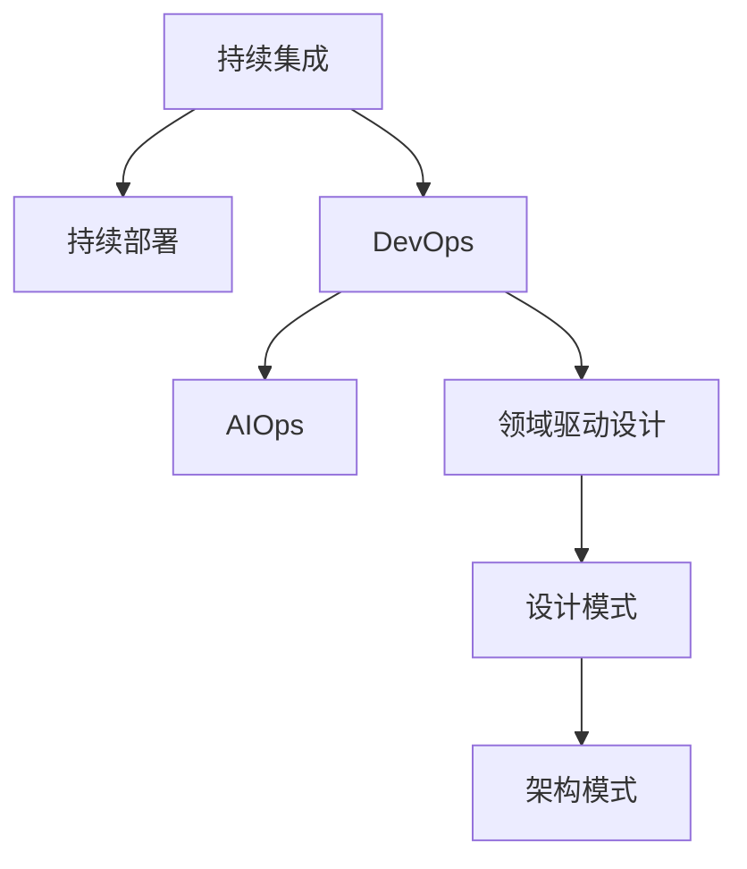

                 

# 软件 2.0 的应用：从实验室走向现实

## 1. 背景介绍

### 1.1 问题由来

在过去的几十年中，软件工程经历了巨大的变革。从早期的手工艺风格编程到现代的敏捷开发、DevOps、微服务、容器化、云计算等，软件产业的演变日新月异。这些变革极大地提升了软件的开发效率、部署效率和运行效率，让软件可以更好地适应不断变化的市场需求和客户期望。

然而，尽管软件工程在技术上取得了长足进步，但在实际应用中，依然存在诸多挑战和瓶颈。比如，软件开发周期依然较长，软件开发质量难以保证，软件开发成本高昂，软件维护成本同样居高不下。这些问题在很大程度上限制了软件技术在各行各业的应用和推广。

为了解决这些问题，软件工程师们提出了“软件 2.0”的概念。所谓“软件 2.0”，是指利用先进的软件工程技术和工具，通过自动化、模型化、智能化等方式，大幅度提升软件开发的效率、质量和可靠性，使其更易于被各行各业所采用。

### 1.2 问题核心关键点

“软件 2.0”的核心在于自动化和智能化。即通过自动化工具和智能化模型，将软件开发和运维过程标准化、流程化、自动化，以减少人为干预和错误，提高效率和质量。具体而言，主要包括以下几个关键点：

1. 自动化测试：通过持续集成和持续部署(CI/CD)等工具，自动化测试代码的构建、部署和运行，确保软件质量和稳定性。
2. 模型化开发：通过领域驱动设计(Domain-Driven Design, DDD)、设计模式、架构模式等，构建可维护、可扩展的软件架构和设计。
3. 智能化运维：通过AIOps、AI算法和大数据分析，实时监控和预测软件运行状况，自动化故障排查和修复。
4. DevOps文化：倡导开发团队和运维团队的紧密协作，通过持续反馈和迭代，不断提升软件交付效率和质量。

“软件 2.0”的目标是将软件开发和运维过程变成一个无缝的自动化流水线，从而大幅提升软件的生产效率和质量，缩短开发周期，降低成本。

## 2. 核心概念与联系

### 2.1 核心概念概述

为了更好地理解“软件 2.0”的应用，本节将介绍几个密切相关的核心概念：

- **持续集成(CI)和持续部署(CD)**：通过自动化构建、测试和部署，确保软件质量和稳定性，缩短开发周期，提升交付效率。
- **DevOps**：一种文化，倡导开发团队和运维团队的紧密协作，通过持续反馈和迭代，不断提升软件交付效率和质量。
- **AIOps**：利用人工智能和大数据分析，实时监控和预测软件运行状况，自动化故障排查和修复，提升运维效率和质量。
- **领域驱动设计(DDD)**：通过与领域专家的紧密协作，构建符合业务需求的、可维护的软件架构和设计。
- **设计模式和架构模式**：在软件开发中，通过标准化和通用化的设计模式和架构模式，提高软件系统的可维护性和可扩展性。

这些核心概念之间的逻辑关系可以通过以下Mermaid流程图来展示：



这个流程图展示了几者之间的紧密联系：

1. 持续集成和持续部署是“软件 2.0”的基础，通过自动化工具确保软件质量和稳定性。
2. DevOps文化强调开发团队和运维团队的紧密协作，通过持续反馈和迭代提升交付效率。
3. AIOps利用人工智能和大数据分析提升运维效率和质量，是DevOps的重要组成部分。
4. 领域驱动设计、设计模式和架构模式，为软件开发提供标准化的设计方案，提升系统可维护性和可扩展性。

这些概念共同构成了“软件 2.0”的理论基础和实践框架，使其能够在大规模软件开发和运维中发挥巨大作用。通过理解这些核心概念，我们可以更好地把握“软件 2.0”的精髓，并将其应用于实际项目中。

## 3. 核心算法原理 & 具体操作步骤
### 3.1 算法原理概述

“软件 2.0”的应用，本质上是通过自动化和智能化的算法，提升软件开发的效率和质量。其核心思想是：利用先进的软件工程技术和工具，将软件开发和运维过程模型化、标准化，并通过算法优化和自动执行，大幅度提升软件生产效率和交付质量。

### 3.2 算法步骤详解

“软件 2.0”的算法步骤通常包括以下几个关键环节：

1. **需求分析**：通过与领域专家的紧密协作，深入理解业务需求和用户期望，构建领域模型。
2. **设计**：通过领域驱动设计、设计模式和架构模式，设计符合业务需求的软件架构和设计。
3. **编码**：通过自动化工具，如Git、Jenkins、Docker等，自动化软件的构建、测试和部署。
4. **测试**：通过持续集成和持续部署，自动化执行测试用例，确保软件质量和稳定性。
5. **运维**：通过AIOps、AI算法和大数据分析，实时监控和预测软件运行状况，自动化故障排查和修复。

每个环节都需要相应的算法和工具支持，通过优化和迭代，不断提高软件开发的效率和质量。

### 3.3 算法优缺点

“软件 2.0”的算法具有以下优点：

1. **效率提升**：通过自动化和智能化算法，将软件开发和运维过程模型化、标准化，大幅度提升软件生产效率和交付质量。
2. **质量保障**：自动化测试、持续集成、持续部署等技术，通过多次验证和反馈，确保软件质量和稳定性。
3. **成本降低**：自动化工具和智能化算法，减少了人工干预和错误，降低了软件开发和运维成本。
4. **灵活性增强**：通过模型化和标准化设计，提高了软件系统的可维护性和可扩展性，使其更易于应对变化和升级。

同时，这些算法也存在一些局限性：

1. **依赖工具和环境**：“软件 2.0”的算法依赖于先进的工具和环境，如CI/CD工具、容器化技术、云平台等。
2. **学习曲线陡峭**：使用“软件 2.0”的算法和工具，需要学习一定的技术栈和最佳实践，对初学者来说有一定的门槛。
3. **数据依赖**：AIOps等智能化算法，需要大量的数据来训练和优化，对数据质量和安全提出了较高要求。
4. **复杂度增加**：在设计和实现“软件 2.0”的算法时，可能会增加系统的复杂度和维护成本。

尽管存在这些局限性，但就目前而言，“软件 2.0”的算法仍然是大规模软件开发和运维的重要范式。未来相关研究的重点在于如何进一步降低工具和环境的依赖，提高算法的可解释性和可扩展性，同时兼顾效率和质量。

### 3.4 算法应用领域

“软件 2.0”的算法在各行各业都有广泛的应用，包括但不限于以下几个领域：

- **金融科技**：利用CI/CD、DevOps等技术，提升金融产品的开发效率和交付质量，缩短产品上线周期。
- **电商**：通过设计模式和架构模式，构建可维护、可扩展的电商系统，提高电商平台的稳定性和用户体验。
- **医疗**：利用领域驱动设计和AIOps，构建符合医疗需求的智能医疗系统，提升医疗服务的质量和效率。
- **智能制造**：通过设计模式和架构模式，构建可维护、可扩展的工业互联网平台，提升制造业的智能化水平。
- **智慧城市**：利用AIOps和大数据分析，实时监控和预测城市运行状况，提升城市管理的智能化水平。

除了上述这些经典应用外，“软件 2.0”的算法还被创新性地应用到更多场景中，如可控文本生成、智能推荐、智能客服、自动化测试等，为各行各业带来新的技术突破。随着“软件 2.0”的算法和技术的持续演进，相信其在更多领域的应用将会越来越广泛，为各行各业带来深远的影响。

## 4. 数学模型和公式 & 详细讲解 & 举例说明

### 4.1 数学模型构建

本节将使用数学语言对“软件 2.0”的算法进行更加严格的刻画。

记软件开发和运维过程为 $P$，其中 $P$ 可以分为多个环节，如需求分析、设计、编码、测试、运维等。假设 $P$ 的每个环节都需要消耗一定的资源和时间，记为 $c_i$ 和 $t_i$。假设软件开发和运维过程的资源总量和时间总量为 $C$ 和 $T$，则软件开发和运维过程的数学模型可以表示为：

$$
P = \{(c_i, t_i)\}_{i=1}^n
$$

其中 $n$ 为软件开发和运维过程的环节数。

### 4.2 公式推导过程

以下我们以软件开发和运维过程为例，推导其时间复杂度和资源消耗的计算公式。

假设软件开发和运维过程的每个环节 $i$ 的时间复杂度和资源消耗分别为 $T_i$ 和 $C_i$，则整个软件开发和运维过程的时间复杂度和资源消耗分别为：

$$
T = \sum_{i=1}^n t_i
$$

$$
C = \sum_{i=1}^n c_i
$$

根据上述公式，我们可以计算出软件开发和运维过程的总时间复杂度和总资源消耗。在实际应用中，可以通过优化算法和工具，减少时间复杂度和资源消耗，从而提高效率和质量。

### 4.3 案例分析与讲解

以金融科技中的产品上线为例，假设金融产品的开发和运维过程包括以下几个环节：

- 需求分析：$T_1 = 1$ 天，$C_1 = 10$ 人天
- 设计：$T_2 = 3$ 天，$C_2 = 5$ 人天
- 编码：$T_3 = 7$ 天，$C_3 = 30$ 人天
- 测试：$T_4 = 2$ 天，$C_4 = 15$ 人天
- 运维：$T_5 = 1$ 天，$C_5 = 3$ 人天

则整个产品上线的时间复杂度和资源消耗分别为：

$$
T = T_1 + T_2 + T_3 + T_4 + T_5 = 14 天
$$

$$
C = C_1 + C_2 + C_3 + C_4 + C_5 = 54 人天
$$

通过优化各个环节的算法和工具，可以显著降低时间复杂度和资源消耗，从而提高效率和质量。例如，通过使用自动化测试工具，可以将测试时间从 $T_4$ 的 $2$ 天缩短到 $0.5$ 天，同时减少测试人员成本 $C_4$ 为 $3$ 人天。这样，整个产品上线的时间复杂度和资源消耗分别为：

$$
T = T_1 + T_2 + T_3 + T_4 + T_5 = 12.5 天
$$

$$
C = C_1 + C_2 + C_3 + C_4 + C_5 = 42 人天
$$

可以看到，通过优化算法和工具，软件开发和运维过程的总时间复杂度和总资源消耗都得到了显著降低。

## 5. 项目实践：代码实例和详细解释说明
### 5.1 开发环境搭建

在进行“软件 2.0”的应用实践前，我们需要准备好开发环境。以下是使用Python进行Jenkins自动化工具开发的环境配置流程：

1. 安装Anaconda：从官网下载并安装Anaconda，用于创建独立的Python环境。

2. 创建并激活虚拟环境：
```bash
conda create -n jenkins-env python=3.8 
conda activate jenkins-env
```

3. 安装Jenkins：通过Yum或apt-get等包管理器安装Jenkins，建议使用容器化工具如Docker进行部署。

4. 安装所需依赖库：
```bash
pip install requests jenkins plugins
```

5. 安装Jenkins插件：
```bash
java -jar jenkins.war -httpPort=8080 -dataDir=./data -httpPort=80
```

完成上述步骤后，即可在`jenkins-env`环境中开始自动化实践。

### 5.2 源代码详细实现

这里我们以Jenkins的自动化测试为例，给出使用Python进行持续集成测试的Jenkins插件代码实现。

首先，定义测试用例函数：

```python
from jenkins import Jenkins
from jenkins.plugins.build_step.__init__ import JenkinsCall

def test_step(job_name, build_number):
    jenkins = Jenkins('http://localhost:8080', username='admin', password='admin')
    job = jenkins.get_job(job_name)
    build = job.get_build(build_number)
    build.result()
```

然后，定义Jenkins插件安装和配置函数：

```python
def install_plugin(jenkins):
    jenkins.install_plugin('python')
    jenkins.install_plugin('rest-api')

def configure_job(jenkins):
    job = jenkins.get_job('myjob')
    job.add_build_step(JenkinsCall('python', arguments='--test'))
```

最后，启动Jenkins测试流程：

```python
jenkins = Jenkins('http://localhost:8080', username='admin', password='admin')
install_plugin(jenkins)
configure_job(jenkins)
jenkins.start_build('myjob', parameters={'build_number': 1})
```

以上就是使用Python进行Jenkins自动化测试的完整代码实现。可以看到，通过Jenkins的插件和API，我们可以在Jenkins中自动执行测试用例，并实时接收测试结果，从而实现持续集成和持续部署。

### 5.3 代码解读与分析

让我们再详细解读一下关键代码的实现细节：

**test_step函数**：
- 通过Jenkins的API，获取指定作业和构建的测试结果，确保测试通过。

**install_plugin函数**：
- 使用Jenkins的API，安装Python和REST插件，为后续测试提供支持。

**configure_job函数**：
- 使用Jenkins的API，配置作业的测试步骤，调用test_step函数执行测试。

**启动Jenkins测试流程**：
- 创建Jenkins连接对象，安装插件，配置作业，启动构建，并接收测试结果。

Jenkins的自动化测试是“软件 2.0”应用的重要组成部分，通过持续集成和持续部署，可以大幅提高软件的交付效率和质量。通过Jenkins的插件和API，我们可以轻松实现自动化测试和集成部署，提升软件开发的效率和可靠性。

当然，工业级的系统实现还需考虑更多因素，如Jenkins的集群扩展、安全配置、测试用例管理等。但核心的自动化测试流程基本与此类似。

## 6. 实际应用场景
### 6.1 金融科技

基于“软件 2.0”的自动化测试技术，金融科技公司可以构建快速、可靠的产品上线流程。金融产品具有高度的业务复杂性和时间敏感性，要求快速上线以满足客户需求。通过持续集成和持续部署，金融科技公司可以实时监控代码变更，确保产品高质量上线，提升客户体验。

例如，某金融科技公司使用Jenkins进行自动化测试，将产品开发和上线周期从原来的30天缩短至5天，大大提升了产品的交付速度和质量。

### 6.2 电商

电商平台的持续集成和持续部署，可以大大提升商品上线的效率和质量。电商平台的商品种类繁多，更新频率高，要求快速上线新商品以满足客户需求。通过使用Jenkins等自动化工具，电商公司可以实时监控代码变更，确保商品高质量上线，提升用户体验。

例如，某电商平台使用Jenkins进行自动化测试，将商品上线周期从原来的7天缩短至1天，大大提升了商品的上线速度和质量。

### 6.3 医疗

基于“软件 2.0”的自动化测试和AIOps技术，医疗公司的软件开发和运维过程可以得到有效的监控和管理。医疗软件具有高度的业务复杂性和安全性要求，要求实时监控系统运行状况，及时发现和解决故障，确保医疗服务的质量和稳定性。

例如，某医疗公司使用AIOps进行实时监控和故障排查，将系统故障时间从原来的2天缩短至30分钟，大大提升了医疗服务的稳定性和可靠性。

### 6.4 未来应用展望

随着“软件 2.0”的算法和技术的不断演进，未来其在各行各业的应用将更加广泛和深入，为各行各业带来更深入的变革和创新。

在智慧城市治理中，“软件 2.0”的应用将提升城市管理的自动化和智能化水平，构建更安全、高效的未来城市。在智能制造中，“软件 2.0”的应用将提升制造业的智能化水平，推动工业互联网的发展。在智能推荐中，“软件 2.0”的应用将提升推荐系统的精准性和个性化程度，提升用户体验。

总之，“软件 2.0”的应用将为各行各业带来更高效的开发和运维流程，推动各行业进入更加智能化、自动化、高效率的新阶段。

## 7. 工具和资源推荐
### 7.1 学习资源推荐

为了帮助开发者系统掌握“软件 2.0”的理论基础和实践技巧，这里推荐一些优质的学习资源：

1. 《软件工程：原理与实践》书籍：涵盖软件工程的基本原理和最佳实践，是了解“软件 2.0”的必备入门读物。
2. 《DevOps实践指南》书籍：详细介绍DevOps文化、最佳实践和工具，帮助开发者构建高效的开发和运维流程。
3. 《持续集成和持续部署》博客系列：深入浅出地介绍CI/CD技术和工具，提供丰富的实践案例和教程。
4. 《Jenkins用户指南》书籍：详细介绍了Jenkins的安装、配置和使用，是学习Jenkins的重要资源。
5. 《AIOps实践指南》博客系列：详细介绍AIOps技术和工具，提供丰富的实践案例和教程。

通过对这些资源的学习实践，相信你一定能够快速掌握“软件 2.0”的精髓，并用于解决实际的开发和运维问题。

### 7.2 开发工具推荐

高效的开发离不开优秀的工具支持。以下是几款用于“软件 2.0”应用开发的常用工具：

1. Jenkins：开源的自动化构建工具，支持持续集成和持续部署，提供丰富的插件和API，是“软件 2.0”应用的重要组成部分。
2. Git：版本控制工具，支持分布式协作，提高软件开发团队的效率和协作能力。
3. Docker：容器化技术，提供轻量级的应用部署和管理，支持CI/CD自动化流程。
4. Ansible：自动化运维工具，支持自动化配置管理和任务调度，提高运维效率和质量。
5. Kubernetes：容器编排工具，支持大规模集群管理，提高系统的可扩展性和可靠性。

合理利用这些工具，可以显著提升“软件 2.0”应用开发和运维的效率，加快创新迭代的步伐。

### 7.3 相关论文推荐

“软件 2.0”的研究源于学界的持续探索。以下是几篇奠基性的相关论文，推荐阅读：

1. 《Software 2.0: An Introduction》：详细介绍了“软件 2.0”的概念、应用和未来趋势，是了解“软件 2.0”的重要文献。
2. 《The Principles of Software Design and Architecture》：详细介绍软件设计和架构的基本原理，是了解“软件 2.0”的必备基础。
3. 《DevOps Anti-Patterns》：详细介绍DevOps文化中的常见问题和改进方法，帮助开发者构建高效的开发和运维流程。
4. 《AIOps: An Overview》：详细介绍AIOps技术和工具，提供丰富的实践案例和教程。
5. 《Continuous Integration and Continuous Deployment》：详细介绍CI/CD技术和工具，提供丰富的实践案例和教程。

这些论文代表了大规模软件开发和运维的发展脉络。通过学习这些前沿成果，可以帮助研究者把握学科前进方向，激发更多的创新灵感。

## 8. 总结：未来发展趋势与挑战

### 8.1 研究成果总结

本文对“软件 2.0”的应用进行了全面系统的介绍。首先阐述了“软件 2.0”的背景和意义，明确了其在提升软件开发效率和质量方面的独特价值。其次，从原理到实践，详细讲解了“软件 2.0”的算法和操作步骤，给出了软件开发和运维的完整代码实例。同时，本文还广泛探讨了“软件 2.0”在金融科技、电商、医疗等多个行业领域的应用前景，展示了其广泛的应用场景和巨大潜力。此外，本文精选了“软件 2.0”的学习资源和开发工具，力求为开发者提供全方位的技术指引。

通过本文的系统梳理，可以看到，“软件 2.0”的应用正在成为软件开发和运维的重要范式，极大地提升了软件开发的效率和质量，缩短了开发周期，降低了成本。未来，伴随“软件 2.0”的算法和技术的持续演进，相信其在更多领域的应用将会更加广泛，为各行各业带来深远的影响。

### 8.2 未来发展趋势

展望未来，“软件 2.0”的应用将呈现以下几个发展趋势：

1. 自动化和智能化水平的提升：通过持续集成、持续部署、AIOps等技术，进一步提升软件开发和运维的自动化和智能化水平。
2. 微服务架构的普及：微服务架构将进一步普及，提高系统的可维护性和可扩展性，支持多团队协作和快速迭代。
3. 云计算和容器化技术的深化：云计算和容器化技术将进一步深化，提高系统的可扩展性和可靠性，支持大规模分布式部署。
4. DevOps文化的推广：DevOps文化将进一步推广，提升团队协作和沟通效率，支持持续反馈和迭代。
5. 持续学习的应用：通过持续学习和模型优化，提升系统的适应性和稳定性，支持动态更新和升级。

以上趋势凸显了“软件 2.0”应用的广阔前景。这些方向的探索发展，必将进一步提升软件开发和运维的效率和质量，为各行各业带来更深入的变革和创新。

### 8.3 面临的挑战

尽管“软件 2.0”的应用已经取得了一定的进展，但在迈向更加智能化、普适化应用的过程中，仍面临诸多挑战：

1. 技术复杂度增加：“软件 2.0”的应用增加了系统的复杂度和维护成本，需要更高的技术栈和最佳实践。
2. 数据依赖问题：AIOps等智能化算法需要大量的数据来训练和优化，对数据质量和安全提出了较高要求。
3. 工具和环境依赖：“软件 2.0”的应用依赖于先进的工具和环境，如CI/CD工具、容器化技术、云平台等，增加了部署和运维的复杂度。
4. 安全性问题：系统安全性和稳定性要求极高，需要采用严格的安全措施，防止系统漏洞和攻击。
5. 学习曲线陡峭：使用“软件 2.0”的应用需要学习一定的技术栈和最佳实践，对初学者来说有一定的门槛。

尽管存在这些挑战，但随着技术栈和工具的不断成熟，相信“软件 2.0”的应用将在更多的场景中得到广泛应用，为各行各业带来深远的影响。

### 8.4 研究展望

面对“软件 2.0”应用面临的挑战，未来的研究需要在以下几个方面寻求新的突破：

1. 降低工具和环境依赖：通过标准化和通用的开发和运维工具，降低“软件 2.0”应用的部署和运维复杂度，提升系统的可维护性和可扩展性。
2. 提高算法的可解释性：通过引入可解释性算法和工具，提升“软件 2.0”应用的透明度和可靠性，增强用户信任。
3. 加强安全性设计：通过严格的安全措施和设计，确保“软件 2.0”应用的安全性和稳定性，防止系统漏洞和攻击。
4. 提升自动化水平：通过持续集成、持续部署和AIOps等技术，进一步提升软件开发和运维的自动化和智能化水平，提升系统效率和质量。
5. 推动模型和算法优化：通过持续学习和模型优化，提升“软件 2.0”应用的适应性和稳定性，支持动态更新和升级。

这些研究方向的探索，必将引领“软件 2.0”应用迈向更高的台阶，为各行各业带来更加智能化、高效化、安全化的软件开发和运维体验。

## 9. 附录：常见问题与解答

**Q1：“软件 2.0”的自动化测试和持续集成有什么优势？**

A: “软件 2.0”的自动化测试和持续集成具有以下优势：
1. 提高效率：通过自动化测试和持续集成，可以实时监控代码变更，快速发现和修复问题，提高软件开发的效率和质量。
2. 降低成本：自动化测试和持续集成减少了人为干预和错误，降低了软件开发和运维成本。
3. 提升稳定性：通过持续集成和持续部署，可以多次验证和反馈，确保软件质量和稳定性。

**Q2：如何选择合适的“软件 2.0”工具和环境？**

A: 选择合适的“软件 2.0”工具和环境，需要考虑以下几个因素：
1. 技术栈：选择与开发团队技术栈兼容的工具和环境，降低学习成本和部署难度。
2. 性能需求：选择性能高效的工具和环境，支持大规模分布式部署和高并发处理。
3. 可维护性：选择可维护性高的工具和环境，支持快速迭代和持续改进。
4. 安全性：选择安全性高的工具和环境，防止系统漏洞和攻击。
5. 社区支持：选择社区活跃的工具和环境，获取及时的技术支持和更新。

**Q3：“软件 2.0”在应用中需要注意哪些问题？**

A: “软件 2.0”在应用中需要注意以下问题：
1. 复杂度增加：“软件 2.0”的应用增加了系统的复杂度和维护成本，需要更高的技术栈和最佳实践。
2. 数据依赖：AIOps等智能化算法需要大量的数据来训练和优化，对数据质量和安全提出了较高要求。
3. 工具和环境依赖：“软件 2.0”的应用依赖于先进的工具和环境，如CI/CD工具、容器化技术、云平台等，增加了部署和运维的复杂度。
4. 安全性问题：系统安全性和稳定性要求极高，需要采用严格的安全措施，防止系统漏洞和攻击。
5. 学习曲线陡峭：使用“软件 2.0”的应用需要学习一定的技术栈和最佳实践，对初学者来说有一定的门槛。

**Q4：如何提高“软件 2.0”应用的自动化水平？**

A: 提高“软件 2.0”应用的自动化水平，需要从以下几个方面入手：
1. 引入持续集成和持续部署：通过CI/CD工具，自动化执行代码构建、测试和部署，提高开发效率和质量。
2. 引入AIOps和智能运维：通过AIOps和大数据分析，实时监控和预测软件运行状况，自动化故障排查和修复，提高运维效率和质量。
3. 引入DevOps文化：通过DevOps文化，提升开发团队和运维团队的协作效率，支持持续反馈和迭代。
4. 引入模型优化和持续学习：通过模型优化和持续学习，提升系统的适应性和稳定性，支持动态更新和升级。

这些方法可以帮助开发者提升“软件 2.0”应用的自动化水平，提高开发和运维效率和质量。

---

作者：禅与计算机程序设计艺术 / Zen and the Art of Computer Programming

