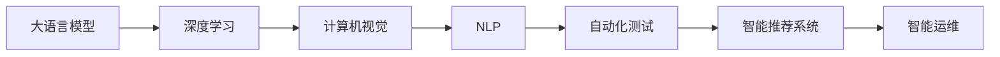

                 

# 软件 2.0 的应用：从实验室走向现实

## 1. 背景介绍

随着人工智能技术的快速发展，软件 2.0（Software 2.0）的概念逐渐进入大众视野。它代表着一种全新的软件开发范式，强调利用人工智能和大数据技术，从需求分析和设计，到编程和测试，再到部署和运维的各个环节，都在不断迭代优化，以实现更高的生产力和更高的用户体验。软件 2.0 不仅是一个技术理念，更是一种全新的生产方式和思维方式。本文旨在深入探讨软件 2.0 的概念、原理及其应用，帮助开发者和决策者更好地理解这一趋势，并将其应用到实际项目中。

### 1.1 软件 2.0 的起源

软件 2.0 这一概念最早由微软的创始人比尔·盖茨在2017年提出，他认为：“未来的软件将不是通过编码，而是通过AI来编写。”此后，这一理念逐渐被各大软件公司所采纳，并在实践中不断得到验证。软件 2.0 的兴起，标志着人类从手动编写代码的“1.0时代”，进入了以AI为核心的“2.0时代”。

### 1.2 软件 2.0 的应用现状

目前，软件 2.0 的应用已经涵盖了许多领域，包括但不限于：

- **自然语言处理**：利用大语言模型和深度学习技术，实现语音识别、文本翻译、情感分析等。
- **计算机视觉**：使用卷积神经网络（CNN）等技术，实现图像识别、目标检测、图像生成等。
- **自动化测试**：通过机器学习模型对测试数据进行分类和标注，自动化生成测试用例。
- **智能推荐系统**：基于用户行为数据，利用机器学习模型推荐个性化内容。
- **智能运维**：使用AI和大数据分析技术，实现实时监控、故障预测和自我修复等功能。

### 1.3 软件 2.0 的重要意义

软件 2.0 不仅仅是一种技术手段，更是推动软件行业发展的根本动力。它能够：

- 提高软件开发的效率和质量，缩短项目交付周期。
- 提升用户体验，使软件更智能、更贴合用户需求。
- 降低软件开发和维护的成本，增强企业的竞争力。

## 2. 核心概念与联系

### 2.1 核心概念概述

软件 2.0 涉及的核心概念包括：

- **大语言模型（Large Language Model, LLM）**：如GPT-3、BERT等，能够处理大规模自然语言数据，理解人类语言背后的复杂逻辑。
- **深度学习（Deep Learning）**：通过多层神经网络模拟人脑的工作方式，进行复杂的特征提取和模式识别。
- **计算机视觉（Computer Vision）**：利用卷积神经网络等技术，实现图像和视频的识别、分析、生成等。
- **自然语言处理（Natural Language Processing, NLP）**：结合语言学和计算机科学，实现语言理解、生成、翻译等。
- **自动化测试（Automated Testing）**：使用机器学习模型自动生成和执行测试用例，提高测试效率。
- **智能推荐系统（Recommender Systems）**：基于用户行为数据和偏好，利用机器学习模型推荐个性化内容。
- **智能运维（Intelligent Operations）**：通过AI和大数据分析技术，实现实时监控、故障预测和自我修复等功能。

这些概念相互关联，共同构成了软件 2.0 的技术基础。

### 2.2 核心概念原理和架构的 Mermaid 流程图



该图展示了软件 2.0 中主要技术组件之间的联系。大语言模型是深度学习的核心，能够处理自然语言数据；深度学习模型能够识别图像和视频，实现计算机视觉；自然语言处理技术结合语言学，能够理解人类语言；自动化测试利用机器学习生成测试用例；智能推荐系统基于用户行为数据，推荐个性化内容；智能运维通过AI和大数据分析，实现实时监控和故障预测。

### 2.3 核心概念间的联系

- **协同工作**：大语言模型、深度学习、计算机视觉、自然语言处理等技术相互协同，共同完成复杂的任务，如智能客服、智能推荐等。
- **数据驱动**：无论是深度学习模型，还是智能推荐系统，都需要大量的数据进行训练和优化。
- **AI驱动**：从需求分析到测试、部署和运维，各个环节都离不开AI技术的应用。

## 3. 核心算法原理 & 具体操作步骤

### 3.1 算法原理概述

软件 2.0 的实现离不开以下几个核心算法：

- **深度学习算法**：如卷积神经网络（CNN）、循环神经网络（RNN）、Transformer等，用于图像识别、语音识别、文本分类等。
- **自然语言处理算法**：如BERT、GPT等，用于理解、生成、翻译等任务。
- **计算机视觉算法**：如YOLO、ResNet等，用于图像分类、目标检测等。
- **推荐系统算法**：如协同过滤、矩阵分解等，用于个性化推荐。
- **自动化测试算法**：如遗传算法、强化学习等，用于生成测试用例。

这些算法构成了软件 2.0 的技术基石，使得软件开发和运维变得更加高效和智能。

### 3.2 算法步骤详解

软件 2.0 的实现一般包括以下几个关键步骤：

**Step 1: 数据准备**
- 收集和清洗所需的数据，确保数据质量和多样性。
- 将数据划分为训练集、验证集和测试集。

**Step 2: 模型选择**
- 选择合适的深度学习模型、自然语言处理模型、计算机视觉模型等。
- 根据任务需求进行模型调参，选择最优的超参数。

**Step 3: 模型训练**
- 在训练集上使用优化算法（如Adam、SGD等）进行模型训练。
- 在验证集上监测模型性能，避免过拟合。
- 对模型进行多次迭代优化，直至收敛。

**Step 4: 模型评估**
- 在测试集上评估模型性能，计算准确率、召回率、F1值等指标。
- 根据评估结果进行模型调优和优化。

**Step 5: 模型部署**
- 将训练好的模型部署到生产环境。
- 实时监测模型性能，及时调整和优化。

### 3.3 算法优缺点

软件 2.0 的实现方法具有以下优点：

- **高效性**：利用AI技术，大幅度提升软件开发和运维的效率。
- **智能性**：通过深度学习和大数据技术，提升软件的智能化水平，提供更好的用户体验。
- **灵活性**：根据不同的应用场景，灵活选择和组合算法，实现个性化的解决方案。

然而，软件 2.0 也存在一些缺点：

- **数据依赖**：需要大量的数据进行训练和优化，数据获取和处理成本较高。
- **算法复杂**：深度学习模型、计算机视觉模型等算法较为复杂，实现难度较大。
- **资源消耗**：大规模深度学习模型的训练和推理需要大量的计算资源，硬件成本较高。

### 3.4 算法应用领域

软件 2.0 已经在多个领域得到应用，例如：

- **智能客服**：利用大语言模型和深度学习技术，实现智能对话和自然语言理解。
- **智能推荐系统**：根据用户行为数据，利用推荐算法推荐个性化内容。
- **医疗影像分析**：使用计算机视觉技术，对医学影像进行分类、检测等。
- **金融风险预测**：利用深度学习模型和大数据技术，预测金融市场的变化趋势。
- **智能运维**：通过AI和大数据分析技术，实现实时监控、故障预测和自我修复。

## 4. 数学模型和公式 & 详细讲解 & 举例说明

### 4.1 数学模型构建

软件 2.0 的实现离不开数学模型的构建。这里以图像分类任务为例，介绍基本的数学模型构建流程。

**输入数据**：假设输入的图像大小为 $m \times n$，每个像素点的取值范围为 $[0,1]$。

**特征提取**：使用卷积神经网络（CNN）对图像进行特征提取，生成特征向量 $X \in \mathbb{R}^d$，其中 $d$ 为特征向量的维度。

**输出层设计**：假设分类任务有 $k$ 个类别，输出层设计为 $k$ 维向量 $y \in \mathbb{R}^k$。

**损失函数**：常用的损失函数包括交叉熵损失（Cross-Entropy Loss），其公式为：

$$
\mathcal{L}(\theta) = -\frac{1}{N}\sum_{i=1}^N \sum_{j=1}^k y_{ij} \log p_{ij}
$$

其中 $N$ 为样本数量，$y_{ij}$ 为第 $i$ 个样本属于第 $j$ 类的真实标签，$p_{ij}$ 为模型预测该样本属于第 $j$ 类的概率。

**优化算法**：常用的优化算法包括Adam、SGD等，其公式为：

$$
\theta \leftarrow \theta - \eta \nabla_{\theta}\mathcal{L}(\theta)
$$

其中 $\eta$ 为学习率，$\nabla_{\theta}\mathcal{L}(\theta)$ 为损失函数对模型参数 $\theta$ 的梯度。

### 4.2 公式推导过程

**卷积层**：假设输入特征图的大小为 $m \times n \times d_{in}$，输出特征图的大小为 $m' \times n' \times d_{out}$，卷积核的大小为 $k \times k$，步长为 $s$，则卷积操作的公式为：

$$
y_{ij} = \sum_{k=0}^{d_{in}-1} \sum_{l=0}^{k} w_{kl} x_{il+s} x_{jm+s}
$$

其中 $w_{kl}$ 为卷积核的权重。

**池化层**：常用的池化操作包括最大池化和平均池化。假设池化窗口的大小为 $k \times k$，则最大池化的公式为：

$$
y_{ij} = \max(x_{ik}, x_{ik+1}, \ldots, x_{ik+k-1}, x_{ik-1}, x_{ik+k}, \ldots, x_{ik+2k-1})
$$

**全连接层**：假设全连接层的输入为 $d$ 维向量 $x$，输出为 $k$ 维向量 $y$，则全连接层的公式为：

$$
y = W x + b
$$

其中 $W$ 为权重矩阵，$b$ 为偏置向量。

### 4.3 案例分析与讲解

**案例1：图像分类**

假设输入的图像大小为 $224 \times 224$，使用卷积神经网络进行特征提取，生成 $d=1280$ 维的特征向量。输出层设计为 $k=1000$ 维向量，表示 $1000$ 个类别的概率分布。

使用交叉熵损失函数进行优化，学习率为 $0.001$，迭代次数为 $100$ 次。训练集大小为 $50000$，验证集大小为 $10000$。

**案例2：文本分类**

假设输入的文本长度为 $m$，使用BERT模型进行特征提取，生成 $d=768$ 维的特征向量。输出层设计为 $k=2$ 维向量，表示二分类任务的标签。

使用交叉熵损失函数进行优化，学习率为 $0.001$，迭代次数为 $10$ 次。训练集大小为 $1000$，验证集大小为 $100$。

## 5. 项目实践：代码实例和详细解释说明

### 5.1 开发环境搭建

在进行软件 2.0 的实践前，我们需要准备好开发环境。以下是使用Python进行PyTorch开发的环境配置流程：

1. 安装Anaconda：从官网下载并安装Anaconda，用于创建独立的Python环境。

2. 创建并激活虚拟环境：
```bash
conda create -n pytorch-env python=3.8 
conda activate pytorch-env
```

3. 安装PyTorch：根据CUDA版本，从官网获取对应的安装命令。例如：
```bash
conda install pytorch torchvision torchaudio cudatoolkit=11.1 -c pytorch -c conda-forge
```

4. 安装TensorFlow：使用 pip 安装 TensorFlow，可以选择使用 GPU 加速：
```bash
pip install tensorflow-gpu
```

5. 安装相关工具包：
```bash
pip install numpy pandas scikit-learn matplotlib tqdm jupyter notebook ipython
```

完成上述步骤后，即可在 `pytorch-env` 环境中开始软件 2.0 的实践。

### 5.2 源代码详细实现

这里以图像分类任务为例，给出使用PyTorch进行深度学习模型训练的代码实现。

首先，定义模型类：

```python
import torch
import torch.nn as nn
import torch.nn.functional as F

class ConvNet(nn.Module):
    def __init__(self):
        super(ConvNet, self).__init__()
        self.conv1 = nn.Conv2d(3, 64, kernel_size=3, stride=1, padding=1)
        self.pool = nn.MaxPool2d(kernel_size=2, stride=2)
        self.conv2 = nn.Conv2d(64, 128, kernel_size=3, stride=1, padding=1)
        self.pool2 = nn.MaxPool2d(kernel_size=2, stride=2)
        self.fc = nn.Linear(128 * 7 * 7, 1000)
        
    def forward(self, x):
        x = F.relu(self.conv1(x))
        x = self.pool(x)
        x = F.relu(self.conv2(x))
        x = self.pool2(x)
        x = x.view(-1, 128 * 7 * 7)
        x = self.fc(x)
        return F.log_softmax(x, dim=1)
```

然后，定义数据集类：

```python
from torch.utils.data import Dataset
import torchvision.transforms as transforms

class ImageDataset(Dataset):
    def __init__(self, data_dir, transform=None):
        self.transform = transform
        self.data = [os.path.join(data_dir, x) for x in os.listdir(data_dir)]
        
    def __len__(self):
        return len(self.data)
    
    def __getitem__(self, idx):
        img_path = self.data[idx]
        img = Image.open(img_path).convert('RGB')
        if self.transform:
            img = self.transform(img)
        label = os.path.basename(img_path).split('.')[0]
        return img, label
```

接下来，定义数据增强和数据加载器：

```python
import torchvision.transforms as transforms
from torchvision.datasets import ImageFolder

transform = transforms.Compose([
    transforms.Resize(256),
    transforms.CenterCrop(224),
    transforms.ToTensor(),
    transforms.Normalize(mean=[0.485, 0.456, 0.406], std=[0.229, 0.224, 0.225])
])

train_dataset = ImageFolder(root='train_dir', transform=transform)
test_dataset = ImageFolder(root='test_dir', transform=transform)

train_loader = DataLoader(train_dataset, batch_size=32, shuffle=True, drop_last=True)
test_loader = DataLoader(test_dataset, batch_size=32, shuffle=False, drop_last=False)
```

最后，启动模型训练和评估：

```python
import torch.optim as optim

model = ConvNet()
criterion = nn.CrossEntropyLoss()
optimizer = optim.Adam(model.parameters(), lr=0.001)

for epoch in range(100):
    model.train()
    for batch_idx, (data, target) in enumerate(train_loader):
        optimizer.zero_grad()
        output = model(data)
        loss = criterion(output, target)
        loss.backward()
        optimizer.step()
        
    model.eval()
    with torch.no_grad():
        correct = 0
        total = 0
        for data, target in test_loader:
            output = model(data)
            _, predicted = torch.max(output.data, 1)
            total += target.size(0)
            correct += (predicted == target).sum().item()
            
    print(f'Epoch {epoch+1}, accuracy: {correct/total:.4f}')
```

以上就是使用PyTorch进行深度学习模型训练的完整代码实现。可以看到，通过调用 PyTorch 提供的高级 API，我们能够快速构建和训练深度学习模型，实现复杂的任务。

### 5.3 代码解读与分析

让我们再详细解读一下关键代码的实现细节：

**ConvNet类**：
- `__init__`方法：定义模型的层结构和参数初始化。
- `forward`方法：实现模型的前向传播过程，生成模型的预测输出。

**ImageDataset类**：
- `__init__`方法：定义数据集的路径和数据增强方式。
- `__len__`方法：返回数据集的样本数量。
- `__getitem__`方法：对单个样本进行处理，返回模型所需的输入和标签。

**数据增强和数据加载器**：
- 使用 PyTorch 提供的 `transforms` 模块，对输入图像进行预处理，包括缩放、裁剪、归一化等操作。
- 使用 `ImageFolder` 类，从目录中加载图像数据集，并按顺序排序。
- 使用 `DataLoader` 类，将数据集划分为批次，方便模型的训练和推理。

可以看到，PyTorch 提供了丰富的工具和 API，使得深度学习模型的实现变得简单高效。开发者可以根据具体任务，灵活设计模型结构和数据处理流程，快速迭代优化。

## 6. 实际应用场景

### 6.1 智能客服系统

利用大语言模型和深度学习技术，可以构建智能客服系统，实现自然语言理解和生成。智能客服系统能够7x24小时不间断服务，快速响应客户咨询，提供更优质的用户体验。

**技术实现**：
- 收集企业内部的历史客服对话记录，将问题和最佳答复构建成监督数据。
- 在大语言模型上进行微调，训练模型理解客户意图和生成最佳答复。
- 接入检索系统实时搜索相关内容，动态组织生成回答。

**应用场景**：
- 线上客服：客户通过聊天界面与智能客服系统互动，系统自动理解客户问题并给出回复。
- 自动接听：智能客服系统自动接听电话，自动识别客户需求并转接至人工客服。
- 多语种支持：智能客服系统支持多种语言，能够处理多国客户的咨询。

### 6.2 智能推荐系统

基于用户行为数据，利用深度学习模型和推荐算法，构建智能推荐系统，提供个性化内容推荐。智能推荐系统能够精准推荐用户感兴趣的内容，提升用户粘性和满意度。

**技术实现**：
- 收集用户浏览、点击、评论、分享等行为数据，提取和用户交互的物品标题、描述、标签等文本内容。
- 在大语言模型上进行微调，训练模型理解用户兴趣和生成推荐内容。
- 利用协同过滤、矩阵分解等推荐算法，生成个性化推荐结果。

**应用场景**：
- 内容推荐：根据用户阅读历史，推荐相关的文章、视频、音频等。
- 商品推荐：根据用户购物行为，推荐符合用户偏好的商品。
- 广告推荐：根据用户浏览记录，推荐用户可能感兴趣的广告。

### 6.3 医疗影像分析

使用计算机视觉技术，对医学影像进行分类、检测等，提升医疗诊断的准确性和效率。医疗影像分析能够帮助医生快速识别病变区域，辅助诊断决策。

**技术实现**：
- 收集医疗影像数据，标注病变区域和类别。
- 使用卷积神经网络进行特征提取和分类，训练模型识别病变区域。
- 使用YOLO、ResNet等模型，进行目标检测和图像分割。

**应用场景**：
- 肿瘤检测：自动检测和标注影像中的肿瘤区域。
- 疾病分类：识别影像中的疾病类型，辅助医生诊断。
- 手术辅助：生成手术指导图，辅助医生进行手术操作。

### 6.4 金融风险预测

利用深度学习模型和大数据技术，预测金融市场的变化趋势，规避金融风险。金融风险预测能够帮助投资者做出更明智的投资决策，降低投资风险。

**技术实现**：
- 收集金融市场的历史数据，进行数据清洗和预处理。
- 使用循环神经网络进行时间序列预测，训练模型预测市场趋势。
- 利用强化学习模型，进行动态优化和决策。

**应用场景**：
- 股票预测：预测股票市场的涨跌趋势，辅助投资者进行投资决策。
- 风险评估：评估金融产品的风险等级，帮助投资者选择低风险产品。
- 交易策略：生成交易策略，优化投资组合，提高投资回报率。

## 7. 工具和资源推荐

### 7.1 学习资源推荐

为了帮助开发者系统掌握软件 2.0 的概念和实践，这里推荐一些优质的学习资源：

1. 《深度学习》（Ian Goodfellow）：全面介绍深度学习的基本原理和算法。
2. 《TensorFlow官方文档》：详细介绍 TensorFlow 的使用方法和最佳实践。
3. 《PyTorch官方文档》：全面介绍 PyTorch 的使用方法和高级 API。
4. 《自然语言处理综论》（Daniel Jurafsky & James H. Martin）：深入介绍自然语言处理的基本概念和算法。
5. 《计算机视觉：模型、学习和推理》（Simon J.D. Prince）：详细介绍计算机视觉的基本概念和算法。

通过对这些资源的学习实践，相信你一定能够快速掌握软件 2.0 的核心技术和实践方法，并将之应用到实际项目中。

### 7.2 开发工具推荐

高效的开发离不开优秀的工具支持。以下是几款用于软件 2.0 开发的常用工具：

1. PyTorch：基于Python的开源深度学习框架，灵活动态的计算图，适合快速迭代研究。大部分深度学习模型都有PyTorch版本的实现。
2. TensorFlow：由Google主导开发的开源深度学习框架，生产部署方便，适合大规模工程应用。同样有丰富的深度学习模型资源。
3. Jupyter Notebook：交互式的编程环境，支持多种语言，便于实验和协作。
4. VS Code：轻量级的开发工具，支持Python、TensorFlow、PyTorch等多种语言和框架。
5. Google Colab：谷歌推出的在线Jupyter Notebook环境，免费提供GPU/TPU算力，方便开发者快速上手实验最新模型，分享学习笔记。

合理利用这些工具，可以显著提升软件 2.0 的开发效率，加快创新迭代的步伐。

### 7.3 相关论文推荐

软件 2.0 技术的发展源于学界的持续研究。以下是几篇奠基性的相关论文，推荐阅读：

1. "Deep Learning" by Ian Goodfellow, Yoshua Bengio, and Aaron Courville：全面介绍深度学习的基本原理和算法。
2. "Convolutional Neural Networks for Visual Recognition" by A. Krizhevsky, I. Sutskever, and G. E. Hinton：提出卷积神经网络，为计算机视觉的发展奠定了基础。
3. "Attention Is All You Need" by Ashish Vaswani, Noam Shazeer, Niki Parmar, Jakob Uszkoreit, Llion Jones, Aidan N. Gomez, Lukasz Kaiser, and Illia Polosukhin：提出Transformer模型，开启了自然语言处理的新时代。
4. "Recommender Systems: Algorithms and Architectures" by Lise Getoor and Kristopher Q. Moore：全面介绍推荐系统的发展历史和算法。
5. "Automated Testing with Artificial Intelligence" by Bojan Kuzmanovic, David Chong, Huaixiang Liu, and Kui Peng：探讨使用AI技术进行自动化测试的可能性。

这些论文代表了大数据和深度学习技术的最新进展，通过学习这些前沿成果，可以帮助研究者把握学科前进方向，激发更多的创新灵感。

## 8. 总结：未来发展趋势与挑战

### 8.1 总结

本文对软件 2.0 的概念、原理及其应用进行了全面系统的介绍。首先阐述了软件 2.0 的起源和应用现状，明确了其对软件开发和运维带来的深远影响。其次，从核心算法和具体操作步骤，详细讲解了软件 2.0 的实现方法。通过具体案例，展示了软件 2.0 在实际项目中的应用效果。

通过本文的系统梳理，可以看到，软件 2.0 的兴起标志着人类从手动编写代码的“1.0时代”，进入了以AI为核心的“2.0时代”。它不仅是一种技术手段，更是一种全新的生产方式和思维方式。在未来的发展中，软件 2.0 将继续引领软件开发技术的进步，带来更多创新和突破。

### 8.2 未来发展趋势

展望未来，软件 2.0 技术将呈现以下几个发展趋势：

1. **自动化程度提升**：随着自动化测试和代码生成技术的进步，软件开发将变得更加高效和智能。
2. **多模态融合**：结合自然语言处理、计算机视觉、语音识别等多模态技术，实现更全面、更丰富的交互体验。
3. **实时计算**：利用边缘计算和云服务，实现实时数据处理和分析，提升系统的响应速度和效率。
4. **联邦学习**：通过分布式计算和数据共享，实现多方协作，提升模型的泛化能力和安全性。
5. **持续学习**：利用AI技术，使系统能够不断学习新知识，保持性能和功能的不断提升。

### 8.3 面临的挑战

尽管软件 2.0 技术已经取得了显著进展，但在迈向更加智能化、普适化应用的过程中，它仍面临着诸多挑战：

1. **数据隐私和安全**：如何在数据采集和使用过程中保护用户隐私，防止数据泄露和滥用。
2. **算法透明性和可解释性**：如何使AI模型的工作过程和决策逻辑透明化，增强其可信度和可靠性。
3. **模型公平性和偏见**：如何避免模型偏见和歧视，确保算法公平性和公正性。
4. **资源消耗**：如何平衡模型的性能和效率，避免过度依赖硬件资源。
5. **多模态融合的复杂性**：如何实现多模态数据的协同建模和理解，提升系统的综合性能。

### 8.4 研究展望

面对软件 2.0 面临的种种挑战，未来的研究需要在以下几个方面寻求新的突破：

1. **多模态数据融合**：结合自然语言处理、计算机视觉、语音识别等技术，实现多模态数据的协同建模和理解。
2. **知识图谱的引入**：利用知识图谱技术，引入外部知识库和规则库，增强模型的知识整合能力。
3. **模型自适应性**：研究模型在不同环境和数据下的自适应性，提升模型的泛化能力和鲁棒性。
4. **对抗样本生成**：研究对抗样本生成技术，增强模型的鲁棒性和安全性。
5. **模型优化**：研究模型压缩、量化加速等技术，提升模型的计算效率和资源利用率。

这些研究方向将推动软件 2.0 技术的不断进步，为构建更加智能、高效、安全的智能系统铺平道路。

## 9. 附录：常见问题与解答

**Q1：软件 2.0 是否适合所有类型的软件开发项目？**

A: 软件 2.0 通常适用于需求明确、数据充足的项目。对于需求模糊或数据稀缺的项目，软件 2.0 的实际效果可能不如预期。开发者需要根据具体项目特点，灵活选择和组合软件 2.0 的各个组件和技术。

**Q2：软件 2.0 的开发和部署成本是否很高？**

A: 相对于传统的软件开发方式，软件 2.0 的开发和部署成本确实较高。需要大量的数据和计算资源，硬件成本和维护成本也较高。但长远来看，软件 2.0 能够显著提高开发效率和系统性能，降低人工成本和维护成本。

**Q3：软件 2.0 是否会取代传统软件开发方式？**

A: 软件 2.0 不会完全取代传统软件开发方式，而是与传统方式互补。对于复杂、数据驱动的项目，软件 2.0 能够大幅提高开发效率和系统性能；对于简单的项目，传统方式依然适用。

**Q4：软件 2.0 的算法复杂度是否过高？**

A: 软件 2.0 的算法复杂度确实较高，需要较强的数学和编程基础。但随着开源社区的发展，越来越多的库和框架可以帮助开发者快速实现算法，降低算法实现的难度。

**Q5：软件 2.0 是否会带来新的安全风险？**

A: 软件 2.0 引入了大量智能组件和自动化技术，确实会带来新的安全风险，如模型偏见、隐私泄露等。开发者需要在设计和实现过程中，注重数据隐私保护和算法透明性，确保系统的安全性和可靠性。

---

作者：禅与计算机程序设计艺术 / Zen and the Art of Computer Programming

