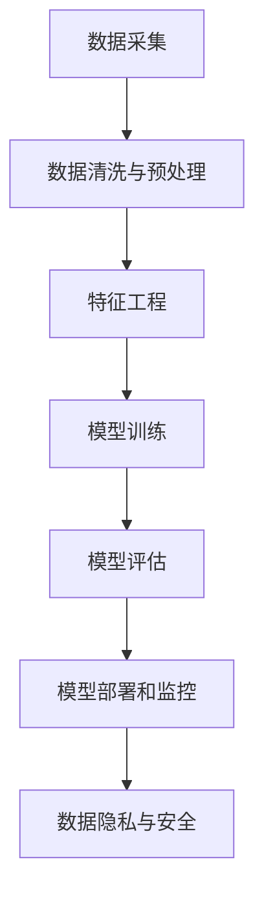

                 

## 1. 背景介绍

### 1.1 问题由来

随着信息时代的来临，人类社会正逐渐步入数据驱动的全新时代。从科学研究到日常生活，从政府决策到企业运营，数据日益成为推动社会发展的重要引擎。在这一背景下，软件开发的范式正在发生深刻变革，传统的以功能为中心的软件 1.0 时代，正在向以数据为中心的软件 2.0 时代迈进。

数据驱动的软件 2.0 时代，强调的是通过数据来理解和处理现实世界的问题。数据不再是简单的输入输出，而是成为决策的依据和模型的训练基础。这种转变不仅影响了软件开发的思路和技术，也要求开发者具备更为全面、深入的数据素养。

### 1.2 问题核心关键点

软件 2.0 时代的关键在于将数据转化为知识，并在此基础上进行预测和决策。数据驱动的软件 2.0 系统主要由以下几个核心组件构成：

- **数据采集**：从不同的数据源收集数据，包括传感器数据、日志数据、社交媒体数据等。
- **数据清洗和预处理**：清洗缺失、异常、重复等数据，进行标准化和归一化，构建高质量的数据集。
- **特征工程**：设计合适的特征表示，通过特征选择、降维、生成等方式，将原始数据转化为模型可用的输入。
- **模型训练**：使用数据集训练机器学习模型，并优化超参数，以获得最佳的预测性能。
- **模型评估**：评估模型的性能指标，如准确率、召回率、F1分数等，确保模型能够满足实际应用需求。
- **模型部署和监控**：将训练好的模型部署到实际应用环境中，并进行实时监控和反馈，持续优化模型表现。

这些组件的有机结合，使得软件 2.0 系统能够基于数据进行智能决策，从而实现自动化的业务流程和高效的信息处理。

### 1.3 问题研究意义

数据驱动的软件 2.0 时代，对于提升决策效率、优化资源配置、改善用户体验等方面具有重要意义：

- **提升决策效率**：通过大数据分析，快速获取决策所需的信息，减少人工干预，提高决策速度。
- **优化资源配置**：根据数据模型预测，优化资源配置，实现成本效益最大化。
- **改善用户体验**：通过个性化的数据分析和推荐，提升用户满意度和忠诚度。
- **推动业务创新**：基于数据的深度挖掘，发现新的业务模式和机会，推动企业创新发展。
- **促进社会进步**：在医疗、教育、交通等领域，数据驱动的软件系统能够显著提升公共服务的质量和效率。

因此，理解数据驱动的软件 2.0 时代，掌握相关的技术和方法，对于软件开发人员、数据科学家、业务分析师等专业人士来说，都是非常重要的。

## 2. 核心概念与联系

### 2.1 核心概念概述

为更好地理解软件 2.0 时代的数据驱动范式，本节将介绍几个关键概念及其之间的联系：

- **数据驱动**：基于数据进行决策，通过数据模型获取洞察，指导行动。
- **特征工程**：设计合适的特征表示，通过特征选择、降维、生成等方式，将原始数据转化为模型可用的输入。
- **机器学习模型**：基于历史数据，训练数据模型，并通过预测进行决策。
- **模型评估**：评估模型的性能指标，确保模型能够满足实际应用需求。
- **模型部署和监控**：将训练好的模型部署到实际应用环境中，并进行实时监控和反馈，持续优化模型表现。
- **数据隐私与安全**：保护数据隐私，确保数据使用过程中的安全性和合法性。

这些概念之间的逻辑关系可以通过以下Mermaid流程图来展示：



这个流程图展示了大数据驱动软件的核心流程，从数据收集到模型部署，每一个环节都至关重要。

## 3. 核心算法原理 & 具体操作步骤

### 3.1 算法原理概述

数据驱动的软件 2.0 系统，通常采用机器学习的方法进行建模和预测。以回归模型为例，假设我们有一组历史数据 $D=\{(x_i,y_i)\}_{i=1}^N$，其中 $x_i$ 为特征向量，$y_i$ 为对应标签。我们的目标是通过训练回归模型 $M$，使其能够对新的输入数据 $x$ 进行预测，输出预测值 $\hat{y}$。

回归模型的训练过程，可以通过最小化预测值与真实值之间的误差来进行。例如，常见的回归模型有线性回归、决策树回归、随机森林回归等。假设我们使用线性回归模型，其预测函数为：

$$
\hat{y} = \theta_0 + \theta_1 x_1 + \theta_2 x_2 + ... + \theta_n x_n
$$

其中 $\theta_0, \theta_1, ..., \theta_n$ 为模型参数，通过最小化损失函数进行优化。常用的损失函数包括均方误差（MSE）、平均绝对误差（MAE）等。

以均方误差为例，其定义为：

$$
\text{MSE} = \frac{1}{N} \sum_{i=1}^N (y_i - \hat{y}_i)^2
$$

优化目标为最小化 MSE，即求解：

$$
\mathop{\arg\min}_{\theta} \text{MSE}(D)
$$

通过梯度下降等优化算法，逐步调整参数 $\theta$，使得模型预测值 $\hat{y}_i$ 尽量接近真实值 $y_i$。

### 3.2 算法步骤详解

数据驱动的软件 2.0 系统通常包含以下几个关键步骤：

**Step 1: 数据采集与预处理**

- 收集各种类型的数据源，如传感器数据、日志数据、社交媒体数据等。
- 对数据进行清洗和预处理，去除缺失、异常、重复等数据，进行标准化和归一化。
- 构建高质量的数据集，准备用于模型训练。

**Step 2: 特征工程**

- 设计合适的特征表示，通过特征选择、降维、生成等方式，将原始数据转化为模型可用的输入。
- 使用统计学方法和机器学习算法，选择对预测性能有显著影响的特征。
- 进行特征编码，将特征转换为数值表示，用于模型训练。

**Step 3: 模型训练**

- 选择适合的问题类型和模型结构，如线性回归、决策树、随机森林、神经网络等。
- 设置模型的超参数，如学习率、正则化系数、树深等，初始化模型参数。
- 使用训练数据集，通过优化算法（如梯度下降、随机梯度下降等）更新模型参数，最小化损失函数。

**Step 4: 模型评估**

- 使用验证数据集评估模型的性能指标，如准确率、召回率、F1分数等。
- 根据评估结果调整模型参数，进行交叉验证等，进一步优化模型。
- 确定最终模型的性能和泛化能力，确保模型能够满足实际应用需求。

**Step 5: 模型部署和监控**

- 将训练好的模型部署到实际应用环境中，进行实时预测和推理。
- 使用监控工具，实时采集模型预测结果，进行异常检测和反馈。
- 根据监控结果进行模型更新和优化，持续提升模型性能。

### 3.3 算法优缺点

数据驱动的软件 2.0 系统具有以下优点：

- **数据驱动**：基于数据进行决策，能够快速获取决策所需的信息，减少人工干预。
- **自动化**：通过自动化模型训练和优化，提高决策效率和准确性。
- **可扩展性**：随着数据量的增加，模型能够持续学习和优化，提升性能。
- **灵活性**：适用于各种类型的应用场景，具有广泛的应用前景。

同时，该方法也存在一些局限性：

- **数据依赖**：系统性能高度依赖于数据质量和数据量，数据不完整或不准确可能导致错误决策。
- **模型复杂性**：高级模型（如神经网络）的训练和优化较为复杂，需要专业的技术支持。
- **解释性不足**：部分模型（如深度学习模型）的黑盒性质，使得决策过程难以解释和调试。
- **安全风险**：数据隐私和安全问题，可能导致数据泄露和滥用。

尽管存在这些局限性，但数据驱动的软件 2.0 系统在诸多领域已经展现出强大的应用潜力，成为了现代软件开发的重要范式。

### 3.4 算法应用领域

数据驱动的软件 2.0 系统在多个领域中得到了广泛应用，包括但不限于：

- **医疗健康**：通过分析患者数据，进行疾病预测、风险评估、个性化治疗等。
- **金融服务**：基于交易数据，进行市场预测、信用评估、欺诈检测等。
- **零售电商**：根据用户行为数据，进行个性化推荐、库存管理、营销策略优化等。
- **智能制造**：通过设备数据，进行设备维护预测、生产调度优化、供应链管理等。
- **智慧城市**：利用城市数据，进行交通管理、环境监测、公共安全等。
- **社交媒体**：基于用户行为数据，进行内容推荐、舆情分析、用户行为预测等。

## 4. 数学模型和公式 & 详细讲解  
### 4.1 数学模型构建

假设我们有一组历史数据 $D=\{(x_i,y_i)\}_{i=1}^N$，其中 $x_i \in \mathbb{R}^n$ 为特征向量，$y_i \in \mathbb{R}$ 为对应标签。我们的目标是通过训练回归模型 $M$，使其能够对新的输入数据 $x$ 进行预测，输出预测值 $\hat{y}$。

常用的回归模型包括线性回归、决策树回归、随机森林回归等。这里以线性回归为例，其预测函数为：

$$
\hat{y} = \theta_0 + \theta_1 x_1 + \theta_2 x_2 + ... + \theta_n x_n
$$

其中 $\theta_0, \theta_1, ..., \theta_n$ 为模型参数。为了最小化预测值与真实值之间的误差，我们通常使用均方误差（MSE）作为损失函数，其定义为：

$$
\text{MSE} = \frac{1}{N} \sum_{i=1}^N (y_i - \hat{y}_i)^2
$$

优化目标为最小化 MSE，即求解：

$$
\mathop{\arg\min}_{\theta} \text{MSE}(D)
$$

通过梯度下降等优化算法，逐步调整参数 $\theta$，使得模型预测值 $\hat{y}_i$ 尽量接近真实值 $y_i$。

### 4.2 公式推导过程

以下是线性回归模型的详细推导过程：

假设有一组历史数据 $D=\{(x_i,y_i)\}_{i=1}^N$，其中 $x_i \in \mathbb{R}^n$ 为特征向量，$y_i \in \mathbb{R}$ 为对应标签。我们的目标是通过训练线性回归模型 $M$，使其能够对新的输入数据 $x$ 进行预测，输出预测值 $\hat{y}$。

线性回归模型的目标是最小化预测值与真实值之间的误差。常用的损失函数包括均方误差（MSE）、平均绝对误差（MAE）等。这里以均方误差为例：

$$
\text{MSE} = \frac{1}{N} \sum_{i=1}^N (y_i - \hat{y}_i)^2
$$

优化目标为最小化 MSE，即求解：

$$
\mathop{\arg\min}_{\theta} \text{MSE}(D)
$$

其中 $\theta$ 为模型参数，$x_i$ 为特征向量，$y_i$ 为对应标签。

对于线性回归模型，其预测函数为：

$$
\hat{y} = \theta_0 + \theta_1 x_1 + \theta_2 x_2 + ... + \theta_n x_n
$$

其梯度为：

$$
\nabla_{\theta} \text{MSE}(D) = -\frac{2}{N} \sum_{i=1}^N (y_i - \hat{y}_i) x_i
$$

因此，梯度下降算法的更新公式为：

$$
\theta_k \leftarrow \theta_k - \eta \nabla_{\theta} \text{MSE}(D)
$$

其中 $\eta$ 为学习率，用于控制参数更新的步长。

通过不断迭代更新参数 $\theta$，逐步优化模型，最终得到最小化损失函数的参数值，从而得到最优的线性回归模型。

## 5. 项目实践：代码实例和详细解释说明
### 5.1 开发环境搭建

在进行数据驱动的软件 2.0 项目实践前，我们需要准备好开发环境。以下是使用Python进行PyTorch开发的环境配置流程：

1. 安装Anaconda：从官网下载并安装Anaconda，用于创建独立的Python环境。

2. 创建并激活虚拟环境：
```bash
conda create -n pytorch-env python=3.8 
conda activate pytorch-env
```

3. 安装PyTorch：根据CUDA版本，从官网获取对应的安装命令。例如：
```bash
conda install pytorch torchvision torchaudio cudatoolkit=11.1 -c pytorch -c conda-forge
```

4. 安装TensorFlow：从官网下载安装程序，并按照安装指南进行安装。

5. 安装Pandas、NumPy、Scikit-learn等常用数据科学库：
```bash
pip install pandas numpy scikit-learn matplotlib seaborn statsmodels
```

完成上述步骤后，即可在`pytorch-env`环境中开始数据驱动的软件 2.0 项目实践。

### 5.2 源代码详细实现

这里我们以房价预测任务为例，给出使用PyTorch和TensorFlow进行线性回归模型的代码实现。

首先，导入必要的库：

```python
import torch
import numpy as np
import pandas as pd
from sklearn.model_selection import train_test_split
from sklearn.preprocessing import StandardScaler
from sklearn.linear_model import LinearRegression
import tensorflow as tf
```

然后，定义数据集：

```python
# 读取数据集
data = pd.read_csv('house_prices.csv')

# 特征选择
features = ['lotsize', 'bedrooms', 'bathrooms', 'year_built']
X = data[features]
y = data['price']

# 数据标准化
scaler = StandardScaler()
X = scaler.fit_transform(X)

# 数据划分
X_train, X_test, y_train, y_test = train_test_split(X, y, test_size=0.2, random_state=42)
```

接着，定义模型：

```python
# 使用PyTorch定义线性回归模型
class LinearRegressionModel(torch.nn.Module):
    def __init__(self, input_dim):
        super(LinearRegressionModel, self).__init__()
        self.linear = torch.nn.Linear(input_dim, 1)
    
    def forward(self, x):
        return self.linear(x)

# 使用TensorFlow定义线性回归模型
def build_linear_regression_model(input_dim):
    model = tf.keras.models.Sequential([
        tf.keras.layers.Dense(1, input_dim=input_dim)
    ])
    return model
```

然后，进行模型训练：

```python
# PyTorch模型训练
model = LinearRegressionModel(input_dim=X_train.shape[1])
optimizer = torch.optim.Adam(model.parameters(), lr=0.01)
criterion = torch.nn.MSELoss()
epochs = 100

for epoch in range(epochs):
    # 前向传播
    outputs = model(X_train)
    # 计算损失
    loss = criterion(outputs, y_train)
    # 反向传播
    optimizer.zero_grad()
    loss.backward()
    optimizer.step()
    
    if (epoch+1) % 10 == 0:
        print(f"Epoch {epoch+1}, loss: {loss.item()}")

# TensorFlow模型训练
input_dim = X_train.shape[1]
model = build_linear_regression_model(input_dim)
model.compile(optimizer=tf.keras.optimizers.Adam(learning_rate=0.01), loss='mse')

model.fit(X_train, y_train, epochs=epochs, validation_data=(X_test, y_test))

# 模型评估
train_mse = model.evaluate(X_train, y_train)
test_mse = model.evaluate(X_test, y_test)
print(f"Train MSE: {train_mse}, Test MSE: {test_mse}")
```

以上代码实现了线性回归模型的训练和评估。可以看到，通过使用PyTorch和TensorFlow，我们可以快速搭建并训练线性回归模型，并进行性能评估。

### 5.3 代码解读与分析

让我们再详细解读一下关键代码的实现细节：

**数据预处理**：
- 使用Pandas读取数据集，并进行特征选择。
- 使用StandardScaler对特征进行标准化处理，确保数据在模型中的表现一致。
- 使用train_test_split将数据划分为训练集和测试集。

**模型定义**：
- 使用PyTorch的nn.Module定义线性回归模型，包含一个线性层。
- 使用TensorFlow的Sequential模型定义线性回归模型，包含一个Dense层。

**模型训练**：
- 使用PyTorch的Adam优化器和均方误差损失函数进行模型训练。
- 使用TensorFlow的Adam优化器和均方误差损失函数进行模型训练。
- 在每个epoch中，通过前向传播计算损失，反向传播更新模型参数，并输出每个epoch的平均损失。

**模型评估**：
- 使用训练集和测试集对模型进行性能评估，计算均方误差。
- 输出训练集和测试集上的均方误差，进行模型性能比较。

可以看到，通过使用PyTorch和TensorFlow，我们可以方便地搭建和训练线性回归模型，并进行性能评估。这些库提供了强大的机器学习工具和高效的计算能力，极大地方便了模型的开发和优化。

## 6. 实际应用场景

### 6.1 智能制造

数据驱动的软件 2.0 系统在智能制造领域中得到了广泛应用。通过收集设备数据，可以进行设备维护预测、生产调度优化、供应链管理等。例如，某智能工厂通过收集机器设备的数据，建立设备故障预测模型，对可能发生的故障进行预警，减少生产停机时间，提高生产效率。

在技术实现上，可以使用传感器数据和历史故障记录，训练预测模型，实时监测设备运行状态，预测未来可能的故障，并在异常时发出警报。

### 6.2 医疗健康

在医疗健康领域，数据驱动的软件 2.0 系统可以通过分析患者数据，进行疾病预测、风险评估、个性化治疗等。例如，某医院通过收集患者的健康数据，建立疾病预测模型，对可能患病的患者进行预警，并提供个性化的治疗建议。

在技术实现上，可以使用患者的历史病历数据和健康指标，训练预测模型，实时监测患者的健康状态，并根据预测结果提供个性化治疗建议。

### 6.3 金融服务

金融服务领域的数据驱动系统，可以通过分析交易数据，进行市场预测、信用评估、欺诈检测等。例如，某银行通过收集客户的交易数据，建立信用评估模型，对客户的信用风险进行评估，从而决定是否批准贷款。

在技术实现上，可以使用历史交易数据和客户的个人信息，训练信用评估模型，实时评估客户的信用风险，并在审批贷款时提供决策支持。

## 7. 工具和资源推荐

### 7.1 学习资源推荐

为了帮助开发者系统掌握数据驱动的软件 2.0 技术，这里推荐一些优质的学习资源：

1. 《Python数据科学手册》：涵盖了Python在数据科学领域的应用，适合初学者入门。

2. 《机器学习实战》：通过实战项目，介绍了常见的机器学习算法和工具，适合动手实践。

3. 《深度学习入门》：由谷歌开发者撰写的入门书籍，详细介绍了深度学习的基础知识和实现方法。

4. 《TensorFlow官方文档》：提供了TensorFlow的全面介绍和使用方法，适合深入学习。

5. 《PyTorch官方文档》：提供了PyTorch的全面介绍和使用方法，适合深入学习。

通过这些学习资源，相信你一定能够快速掌握数据驱动的软件 2.0 技术的核心思想和实践方法。

### 7.2 开发工具推荐

高效的数据驱动的软件 2.0 开发，离不开优秀的工具支持。以下是几款常用的开发工具：

1. Jupyter Notebook：提供了交互式环境，方便进行数据处理和模型训练。

2. Google Colab：提供了免费的GPU/TPU算力，方便进行大规模机器学习实验。

3. Kaggle：提供了丰富的数据集和竞赛平台，适合进行数据处理和模型优化。

4. DataRobot：提供了自动化的数据准备和模型优化工具，适合企业级数据驱动应用。

5. ELK Stack：提供了实时数据采集、分析和可视化工具，适合进行数据监控和预警。

这些工具提供了强大的计算和可视化能力，极大地方便了数据驱动的软件 2.0 的开发和优化。

### 7.3 相关论文推荐

数据驱动的软件 2.0 技术的研究始于学界，并在不断演进中。以下是几篇奠基性的相关论文，推荐阅读：

1. 《深度学习》：Yoshua Bengio等人的著作，介绍了深度学习的基本原理和实现方法。

2. 《数据驱动的决策支持系统》：David Y. Lin等人的论文，介绍了数据驱动系统的设计和实现。

3. 《机器学习在金融中的应用》：Jonathan H. Yoon等人的论文，介绍了机器学习在金融领域的广泛应用。

4. 《智能制造中的数据驱动》：Xuefeng Wang等人的论文，介绍了数据驱动技术在智能制造中的应用。

这些论文代表了大数据驱动软件的理论进展和应用实践，对于深入理解数据驱动的软件 2.0 技术具有重要意义。

## 8. 总结：未来发展趋势与挑战

### 8.1 总结

本文对数据驱动的软件 2.0 时代进行了全面系统的介绍。首先阐述了数据驱动的转变对软件开发范式的影响，明确了数据驱动的软件 2.0 系统的核心组件和流程。其次，从原理到实践，详细讲解了回归模型的构建和优化过程，给出了数据驱动的软件 2.0 系统的代码实例。最后，本文还探讨了数据驱动的软件 2.0 系统在多个领域的应用场景，展示了其广阔的前景。

通过本文的系统梳理，可以看到，数据驱动的软件 2.0 系统正逐步成为软件开发的重要范式，极大地提升了决策效率和业务智能化水平。未来，伴随数据量的持续增长和算法模型的不断演进，数据驱动的软件 2.0 系统必将在更多领域发挥其价值，成为推动社会进步的重要力量。

### 8.2 未来发展趋势

展望未来，数据驱动的软件 2.0 系统将呈现以下几个发展趋势：

1. **数据量规模扩大**：随着物联网、传感器等技术的发展，数据量将呈指数级增长。数据驱动的软件 2.0 系统将能够处理更复杂、更大规模的数据集。

2. **模型自动化优化**：随着自动机器学习（AutoML）技术的发展，模型训练和优化的自动化水平将不断提高，使得非专家也能轻松构建高性能模型。

3. **跨领域融合**：数据驱动的软件 2.0 系统将逐步与其他人工智能技术进行融合，如自然语言处理、图像识别等，形成更加全面的智能决策系统。

4. **实时计算能力提升**：随着分布式计算和云计算技术的发展，数据驱动的软件 2.0 系统将能够进行实时数据处理和分析，支持快速决策。

5. **联邦学习**：在数据隐私和安全问题日益突出的背景下，联邦学习（Federated Learning）将成为未来数据驱动系统的重要方向，使得模型可以在不泄露数据的情况下进行训练和优化。

6. **多模态数据融合**：数据驱动的软件 2.0 系统将越来越多地融合多种模态的数据（如文本、图像、音频等），从而实现更加全面的数据分析和决策。

这些趋势将进一步推动数据驱动的软件 2.0 系统的发展，提升其在各个领域的应用效果，实现更智能、更高效的决策支持。

### 8.3 面临的挑战

尽管数据驱动的软件 2.0 系统展现出巨大的潜力，但在其发展过程中也面临诸多挑战：

1. **数据质量问题**：数据驱动的软件 2.0 系统高度依赖数据质量，数据不完整、不准确或缺失将严重影响系统的性能。

2. **模型解释性不足**：高级模型（如深度学习模型）的黑盒性质，使得决策过程难以解释和调试。

3. **数据隐私和安全**：在数据驱动的软件 2.0 系统中，数据隐私和安全问题尤为突出，如何保护用户数据隐私，确保数据使用过程中的安全性，是亟待解决的问题。

4. **模型泛化能力不足**：模型在训练数据上的表现可能与实际应用中的数据分布不一致，导致模型泛化能力不足。

5. **计算资源消耗大**：大规模数据处理和模型训练需要强大的计算资源，如何在资源有限的情况下进行高效的数据驱动建模，是一个重要挑战。

6. **跨领域知识整合**：不同领域的数据和知识具有不同的特性，如何将跨领域的知识整合到数据驱动系统中，是一个复杂而重要的问题。

这些挑战需要学界和工业界的共同努力，通过不断的技术创新和实践优化，才能克服数据驱动的软件 2.0 系统在应用过程中遇到的问题，实现其全面落地。

### 8.4 研究展望

面对数据驱动的软件 2.0 系统所面临的挑战，未来的研究需要在以下几个方面寻求新的突破：

1. **数据质量提升**：研究数据清洗、预处理和特征工程的方法，确保数据质量和一致性。

2. **模型解释性增强**：研究模型可解释性方法，如因果分析、规则提取等，使得模型决策过程透明化。

3. **数据隐私保护**：研究联邦学习、差分隐私等技术，保护用户数据隐私，确保数据使用过程中的安全性。

4. **跨领域知识整合**：研究多模态数据融合和跨领域知识表示的方法，实现跨领域的数据驱动应用。

5. **高效计算**：研究分布式计算、模型压缩等技术，提高数据驱动系统的计算效率和资源利用率。

6. **实时计算**：研究实时数据处理和分析技术，提升数据驱动系统的响应速度和决策效率。

这些研究方向的探索，必将引领数据驱动的软件 2.0 系统迈向更高的台阶，为构建安全、可靠、可解释、可控的智能系统铺平道路。面向未来，数据驱动的软件 2.0 系统还需要与其他人工智能技术进行更深入的融合，如自然语言处理、图像识别等，多路径协同发力，共同推动人工智能技术的进步。

## 9. 附录：常见问题与解答

**Q1：数据驱动的软件 2.0 系统是否适用于所有业务场景？**

A: 数据驱动的软件 2.0 系统在多数业务场景中能够取得显著效果，特别是在数据量较大、业务复杂的情况下。但对于一些需要实时决策、依赖专业知识的应用，数据驱动的系统可能难以满足需求。因此，需要根据具体业务特点进行选择。

**Q2：数据驱动的软件 2.0 系统如何处理缺失数据？**

A: 数据驱动的软件 2.0 系统在处理缺失数据时，通常采用插值、均值填补等方法进行数据补全。此外，也可以使用一些高级方法，如KNN插值、回归模型填补等，根据已有数据推测缺失值。

**Q3：数据驱动的软件 2.0 系统如何应对数据分布变化？**

A: 数据驱动的软件 2.0 系统可以通过在线学习、增量学习等方法，实时更新模型参数，应对数据分布变化。同时，也可以使用迁移学习、多任务学习等方法，提高模型的泛化能力，确保在新数据上的性能表现。

**Q4：数据驱动的软件 2.0 系统在实际应用中面临哪些挑战？**

A: 数据驱动的软件 2.0 系统在实际应用中面临以下挑战：

1. 数据质量问题：数据不完整、不准确或缺失将严重影响系统的性能。
2. 模型解释性不足：高级模型（如深度学习模型）的黑盒性质，使得决策过程难以解释和调试。
3. 数据隐私和安全：在数据驱动的软件 2.0 系统中，数据隐私和安全问题尤为突出，如何保护用户数据隐私，确保数据使用过程中的安全性，是亟待解决的问题。
4. 模型泛化能力不足：模型在训练数据上的表现可能与实际应用中的数据分布不一致，导致模型泛化能力不足。
5. 计算资源消耗大：大规模数据处理和模型训练需要强大的计算资源，如何在资源有限的情况下进行高效的数据驱动建模，是一个重要挑战。
6. 跨领域知识整合：不同领域的数据和知识具有不同的特性，如何将跨领域的知识整合到数据驱动系统中，是一个复杂而重要的问题。

这些挑战需要学界和工业界的共同努力，通过不断的技术创新和实践优化，才能克服数据驱动的软件 2.0 系统在应用过程中遇到的问题，实现其全面落地。

**Q5：如何选择合适的模型？**

A: 选择合适的模型需要考虑以下几个因素：

1. 数据量：数据量较大时，可以使用复杂模型，如深度神经网络；数据量较小时，可以使用简单的模型，如线性回归。
2. 数据类型：连续型数据可以使用回归模型，分类数据可以使用分类模型，多标签数据可以使用多标签分类模型。
3. 问题类型：分类问题可以使用分类模型，回归问题可以使用回归模型，序列预测问题可以使用序列模型。
4. 模型性能：选择性能最优的模型，如基于交叉验证等方法，进行模型选择和优化。

总之，选择合适的模型需要综合考虑数据特性和问题类型，进行科学评估和选择。

---

作者：禅与计算机程序设计艺术 / Zen and the Art of Computer Programming

