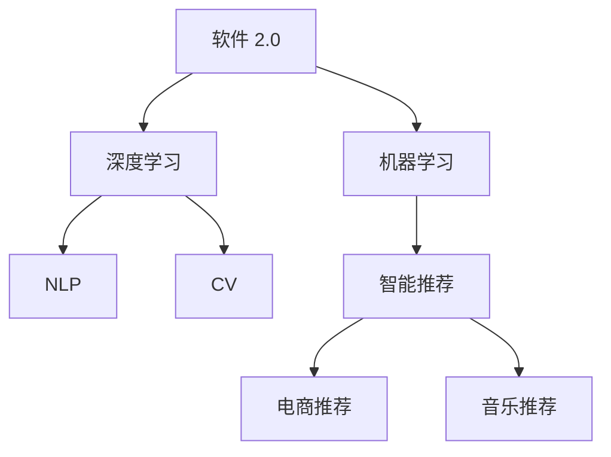

                 

# 软件 2.0 的未来展望：更智能、更强大

> 关键词：软件 2.0, 人工智能, 机器学习, 深度学习, 自然语言处理, 计算机视觉, 智能系统

## 1. 背景介绍

### 1.1 问题由来

在过去的几十年里，软件的发展经历了从软件 1.0 到软件 2.0 的重大转变。软件 1.0 时代，程序员通过手写代码，根据需求设计程序逻辑，实现特定的功能。然而，随着数据的爆炸式增长和计算能力的提升，这种依赖程序员经验和直觉的软件开发模式变得不再适应。

软件 2.0 时代的到来，标志着数据和计算能力成为了软件开发的主要驱动力。机器学习和深度学习技术，尤其是神经网络，极大地提高了软件开发的效率和智能化水平。通过大规模的训练数据和强大的计算能力，软件 2.0 系统能够自动学习数据中的模式和规律，预测未来趋势，甚至进行创造性工作。

这种基于数据驱动的软件开发范式，正在颠覆传统软件开发的方法和理念。在自然语言处理、计算机视觉、智能推荐等领域，软件 2.0 的应用已经取得了显著的成果。未来，随着技术的不断进步，软件 2.0 将进一步普及和深化，为各行各业带来革命性的变化。

### 1.2 问题核心关键点

软件 2.0 的核心在于其智能化和自动化。以下是软件 2.0 的关键特点：

1. **数据驱动**：软件 2.0 系统能够通过大量数据进行自学习，不断优化模型参数，提高性能。
2. **自动化设计**：通过自动化的特征工程、模型训练和调优，软件 2.0 可以高效地生成高质量的软件系统。
3. **跨领域应用**：软件 2.0 系统具备高度的泛化能力，能够跨多个领域进行部署和应用。
4. **自适应性**：软件 2.0 能够根据环境变化和用户反馈，自动调整模型参数和行为，保持系统的稳定性和可靠性。

这些特点使得软件 2.0 在处理复杂问题时，具有传统软件无法比拟的优势。然而，软件 2.0 的开发和应用，也面临着新的挑战和风险，如数据隐私、模型透明性、安全性和可解释性等问题。

## 2. 核心概念与联系

### 2.1 核心概念概述

为更好地理解软件 2.0 的未来展望，本节将介绍几个密切相关的核心概念：

- **软件 2.0 (Software 2.0)**：指通过机器学习和深度学习技术实现的软件系统，能够在无需人类干预的情况下自动处理数据、识别模式、做出决策。
- **机器学习 (Machine Learning, ML)**：指使用算法和模型，从数据中学习规律，并应用于新数据的预测和分类任务。
- **深度学习 (Deep Learning, DL)**：指使用多层神经网络，自动学习数据的高级特征表示。
- **自然语言处理 (Natural Language Processing, NLP)**：指使用机器学习技术处理和分析自然语言，包括文本分类、情感分析、机器翻译等任务。
- **计算机视觉 (Computer Vision, CV)**：指使用机器学习技术，使计算机能够识别和理解图像和视频内容，包括目标检测、图像分割、人脸识别等任务。
- **智能推荐系统 (Recommender Systems)**：指根据用户的历史行为和偏好，自动推荐相关商品或内容，如电商推荐、音乐推荐等。

这些核心概念之间的逻辑关系可以通过以下Mermaid流程图来展示：



这个流程图展示了大语言模型的核心概念及其之间的关系：

1. 软件 2.0 系统通过机器学习和深度学习技术，构建起自适应的模型。
2. 机器学习提供了模型训练和优化的基础算法，深度学习则通过多层神经网络学习更复杂的特征表示。
3. 自然语言处理和计算机视觉分别处理文本和图像数据，提供必要的语义理解和视觉识别功能。
4. 智能推荐系统结合用户行为和偏好，提供个性化推荐服务。

这些概念共同构成了软件 2.0 的软件开发和应用框架，使其能够在各种场景下发挥强大的智能化能力。通过理解这些核心概念，我们可以更好地把握软件 2.0 的开发和应用。

## 3. 核心算法原理 & 具体操作步骤
### 3.1 算法原理概述

软件 2.0 系统的核心算法基于机器学习和深度学习，通过大量数据的训练，生成自适应的模型。这些模型能够自动学习数据中的模式和规律，进行预测、分类和生成任务。

形式化地，假设输入数据集为 $D=\{(x_i,y_i)\}_{i=1}^N$，其中 $x_i$ 为输入特征，$y_i$ 为对应的输出标签。软件 2.0 系统通过训练得到模型 $M_{\theta}$，使得 $M_{\theta}(x)$ 能够最大化 $p(y|x)$ 的概率，即：

$$
\max_{\theta} \frac{1}{N} \sum_{i=1}^N \log p(y_i|x_i)
$$

常用的算法包括监督学习算法（如线性回归、逻辑回归、决策树等）和无监督学习算法（如聚类、降维等）。在深度学习中，最常用的模型包括卷积神经网络（CNN）、循环神经网络（RNN）和变压器（Transformer）等。

### 3.2 算法步骤详解

软件 2.0 系统的开发和应用一般包括以下几个关键步骤：

**Step 1: 数据准备和预处理**

- 收集和整理数据集，包括数据清洗、特征工程等预处理步骤。
- 划分数据集为训练集、验证集和测试集，确保模型在未见数据上的泛化能力。
- 进行数据增强，如随机裁剪、旋转、翻转等，增加数据多样性，提升模型鲁棒性。

**Step 2: 模型选择和设计**

- 根据任务类型选择合适的模型架构，如卷积神经网络（CNN）用于图像识别，循环神经网络（RNN）用于自然语言处理，变压器（Transformer）用于文本生成等。
- 设计合适的损失函数和优化算法，如交叉熵损失、Adam优化器等。
- 进行超参数调优，选择合适的学习率、批大小、迭代轮数等。

**Step 3: 模型训练**

- 将训练集数据分批次输入模型，前向传播计算损失函数。
- 反向传播计算参数梯度，根据设定的优化算法和学习率更新模型参数。
- 周期性在验证集上评估模型性能，根据性能指标决定是否触发 Early Stopping。
- 重复上述步骤直至满足预设的迭代轮数或 Early Stopping 条件。

**Step 4: 模型评估和优化**

- 在测试集上评估模型性能，对比训练前后的精度提升。
- 使用交叉验证等技术，评估模型在不同数据集上的泛化能力。
- 分析模型输出，发现和解决模型的过拟合或欠拟合问题。
- 引入正则化技术，如L2正则、Dropout、Early Stopping等，防止模型过度适应小规模训练集。

**Step 5: 模型部署和应用**

- 使用微调技术或迁移学习技术，将模型应用到新的任务或领域。
- 在实际应用系统中集成模型，进行实时预测或推理。
- 持续收集新的数据，定期重新训练模型，以适应数据分布的变化。

以上是软件 2.0 系统的开发和应用的一般流程。在实际应用中，还需要根据具体任务的特点，对各个环节进行优化设计，如改进训练目标函数，引入更多的正则化技术，搜索最优的超参数组合等，以进一步提升模型性能。

### 3.3 算法优缺点

软件 2.0 系统在处理大规模数据和复杂任务时，具有以下优点：

1. **自动化高效**：通过自动化的特征工程和模型训练，大大提高了软件开发和部署的效率。
2. **数据驱动**：能够从大量数据中学习规律，做出更准确的预测和决策。
3. **泛化能力强**：通过迁移学习和参数高效微调技术，能够跨领域应用，提高模型的泛化能力。

同时，该方法也存在一定的局限性：

1. **数据隐私问题**：在数据收集和处理过程中，存在隐私泄露和数据滥用的风险。
2. **模型透明性不足**：软件 2.0 系统通常是"黑盒"系统，难以解释其内部工作机制和决策逻辑。
3. **安全性和可靠性**：在应用过程中，存在模型被攻击、误导性输出等问题。
4. **资源消耗大**：训练和推理过程中，需要大量的计算资源和存储空间。

尽管存在这些局限性，但就目前而言，软件 2.0 系统在处理大规模数据和复杂任务时，具有传统软件无法比拟的优势。未来相关研究的重点在于如何进一步降低数据和资源的消耗，提高模型的透明度和安全性，优化模型的性能和泛化能力。

### 3.4 算法应用领域

软件 2.0 系统的应用已经涵盖了多个领域，例如：

- **自然语言处理**：包括文本分类、情感分析、机器翻译、问答系统等。通过深度学习技术，软件 2.0 系统能够处理和分析自然语言。
- **计算机视觉**：包括目标检测、图像分割、人脸识别、图像生成等。通过卷积神经网络等技术，软件 2.0 系统能够处理和理解图像和视频内容。
- **智能推荐系统**：包括电商推荐、音乐推荐、视频推荐等。通过协同过滤和深度学习技术，软件 2.0 系统能够根据用户行为和偏好进行个性化推荐。
- **医疗诊断**：包括影像诊断、疾病预测、基因分析等。通过深度学习技术，软件 2.0 系统能够从医学影像中提取特征，辅助医生进行诊断。
- **金融分析**：包括市场预测、风险评估、信用评分等。通过深度学习技术，软件 2.0 系统能够分析金融数据，提供决策支持。

除了上述这些经典应用外，软件 2.0 系统还被创新性地应用到更多场景中，如智能城市、智慧农业、智能制造等，为各行各业带来了新的突破。随着预训练模型和深度学习技术的不断进步，软件 2.0 系统将在更广阔的应用领域大放异彩。

## 4. 数学模型和公式 & 详细讲解  
### 4.1 数学模型构建

本节将使用数学语言对软件 2.0 系统的开发过程进行更加严格的刻画。

记输入数据集为 $D=\{(x_i,y_i)\}_{i=1}^N$，其中 $x_i$ 为输入特征，$y_i$ 为对应的输出标签。假设软件 2.0 系统使用的模型为 $M_{\theta}$，其中 $\theta$ 为模型参数。

定义模型 $M_{\theta}$ 在输入 $x$ 上的损失函数为 $\ell(M_{\theta}(x),y)$，则在数据集 $D$ 上的经验风险为：

$$
\mathcal{L}(\theta) = \frac{1}{N} \sum_{i=1}^N \ell(M_{\theta}(x_i),y_i)
$$

常见的损失函数包括交叉熵损失、均方误差损失等。通过梯度下降等优化算法，软件 2.0 系统不断更新模型参数 $\theta$，最小化损失函数 $\mathcal{L}$，使得模型输出逼近真实标签。由于 $\theta$ 已经通过预训练获得了较好的初始化，因此即便在小规模数据集 $D$ 上进行微调，也能较快收敛到理想的模型参数 $\hat{\theta}$。

### 4.2 公式推导过程

以下我们以二分类任务为例，推导交叉熵损失函数及其梯度的计算公式。

假设模型 $M_{\theta}$ 在输入 $x$ 上的输出为 $\hat{y}=M_{\theta}(x) \in [0,1]$，表示样本属于正类的概率。真实标签 $y \in \{0,1\}$。则二分类交叉熵损失函数定义为：

$$
\ell(M_{\theta}(x),y) = -[y\log \hat{y} + (1-y)\log (1-\hat{y})]
$$

将其代入经验风险公式，得：

$$
\mathcal{L}(\theta) = -\frac{1}{N}\sum_{i=1}^N [y_i\log M_{\theta}(x_i)+(1-y_i)\log(1-M_{\theta}(x_i))]
$$

根据链式法则，损失函数对参数 $\theta_k$ 的梯度为：

$$
\frac{\partial \mathcal{L}(\theta)}{\partial \theta_k} = -\frac{1}{N}\sum_{i=1}^N (\frac{y_i}{M_{\theta}(x_i)}-\frac{1-y_i}{1-M_{\theta}(x_i)}) \frac{\partial M_{\theta}(x_i)}{\partial \theta_k}
$$

其中 $\frac{\partial M_{\theta}(x_i)}{\partial \theta_k}$ 可进一步递归展开，利用自动微分技术完成计算。

在得到损失函数的梯度后，即可带入参数更新公式，完成模型的迭代优化。重复上述过程直至收敛，最终得到适应下游任务的最优模型参数 $\theta^*$。

## 5. 项目实践：代码实例和详细解释说明
### 5.1 开发环境搭建

在进行软件 2.0 系统开发前，我们需要准备好开发环境。以下是使用Python进行PyTorch开发的环境配置流程：

1. 安装Anaconda：从官网下载并安装Anaconda，用于创建独立的Python环境。

2. 创建并激活虚拟环境：
```bash
conda create -n pytorch-env python=3.8 
conda activate pytorch-env
```

3. 安装PyTorch：根据CUDA版本，从官网获取对应的安装命令。例如：
```bash
conda install pytorch torchvision torchaudio cudatoolkit=11.1 -c pytorch -c conda-forge
```

4. 安装各类工具包：
```bash
pip install numpy pandas scikit-learn matplotlib tqdm jupyter notebook ipython
```

完成上述步骤后，即可在`pytorch-env`环境中开始软件 2.0 系统的开发。

### 5.2 源代码详细实现

这里我们以计算机视觉中的图像分类任务为例，给出使用Transformers库进行模型微调的PyTorch代码实现。

首先，定义数据处理函数：

```python
from transformers import AutoFeatureExtractor, AutoModelForImageClassification
import torch

class ImageDataset(torch.utils.data.Dataset):
    def __init__(self, images, labels, transform=None):
        self.images = images
        self.labels = labels
        self.transform = transform
    
    def __len__(self):
        return len(self.images)
    
    def __getitem__(self, idx):
        image = self.images[idx]
        label = self.labels[idx]
        
        if self.transform:
            image = self.transform(image)
        
        return {'image': image, 'label': label}

# 加载预训练模型和数据集
model = AutoModelForImageClassification.from_pretrained('resnet18')
transform = AutoFeatureExtractor.from_pretrained('resnet18')
train_dataset = ImageDataset(train_images, train_labels, transform=transform)
dev_dataset = ImageDataset(dev_images, dev_labels, transform=transform)
test_dataset = ImageDataset(test_images, test_labels, transform=transform)
```

然后，定义训练和评估函数：

```python
from torch.utils.data import DataLoader
from tqdm import tqdm
from sklearn.metrics import classification_report

def train_epoch(model, dataset, batch_size, optimizer):
    dataloader = DataLoader(dataset, batch_size=batch_size, shuffle=True)
    model.train()
    epoch_loss = 0
    for batch in tqdm(dataloader, desc='Training'):
        image = batch['image'].to(device)
        label = batch['label'].to(device)
        model.zero_grad()
        outputs = model(image)
        loss = outputs.loss
        epoch_loss += loss.item()
        loss.backward()
        optimizer.step()
    return epoch_loss / len(dataloader)

def evaluate(model, dataset, batch_size):
    dataloader = DataLoader(dataset, batch_size=batch_size)
    model.eval()
    preds, labels = [], []
    with torch.no_grad():
        for batch in tqdm(dataloader, desc='Evaluating'):
            image = batch['image'].to(device)
            label = batch['label']
            outputs = model(image)
            batch_preds = outputs.logits.argmax(dim=1).to('cpu').tolist()
            batch_labels = label.to('cpu').tolist()
            for pred, label in zip(batch_preds, batch_labels):
                preds.append(pred)
                labels.append(label)
                
    print(classification_report(labels, preds))
```

最后，启动训练流程并在测试集上评估：

```python
epochs = 5
batch_size = 16

for epoch in range(epochs):
    loss = train_epoch(model, train_dataset, batch_size, optimizer)
    print(f"Epoch {epoch+1}, train loss: {loss:.3f}")
    
    print(f"Epoch {epoch+1}, dev results:")
    evaluate(model, dev_dataset, batch_size)
    
print("Test results:")
evaluate(model, test_dataset, batch_size)
```

以上就是使用PyTorch对计算机视觉任务进行模型微调的完整代码实现。可以看到，得益于Transformers库的强大封装，我们可以用相对简洁的代码完成模型加载和微调。

### 5.3 代码解读与分析

让我们再详细解读一下关键代码的实现细节：

**ImageDataset类**：
- `__init__`方法：初始化图像、标签和转换函数。
- `__len__`方法：返回数据集的样本数量。
- `__getitem__`方法：对单个样本进行处理，将图像输入转换为模型所需的张量，返回模型所需的输入和标签。

**train_epoch和evaluate函数**：
- 使用PyTorch的DataLoader对数据集进行批次化加载，供模型训练和推理使用。
- 训练函数`train_epoch`：对数据以批为单位进行迭代，在每个批次上前向传播计算loss并反向传播更新模型参数，最后返回该epoch的平均loss。
- 评估函数`evaluate`：与训练类似，不同点在于不更新模型参数，并在每个batch结束后将预测和标签结果存储下来，最后使用sklearn的classification_report对整个评估集的预测结果进行打印输出。

**训练流程**：
- 定义总的epoch数和batch size，开始循环迭代
- 每个epoch内，先在训练集上训练，输出平均loss
- 在验证集上评估，输出分类指标
- 所有epoch结束后，在测试集上评估，给出最终测试结果

可以看到，PyTorch配合Transformers库使得计算机视觉任务的模型微调代码实现变得简洁高效。开发者可以将更多精力放在数据处理、模型改进等高层逻辑上，而不必过多关注底层的实现细节。

当然，工业级的系统实现还需考虑更多因素，如模型的保存和部署、超参数的自动搜索、更灵活的任务适配层等。但核心的微调范式基本与此类似。

## 6. 实际应用场景
### 6.1 智能客服系统

基于软件 2.0 技术的智能客服系统，可以广泛应用于企业客户服务。传统客服往往需要配备大量人力，高峰期响应缓慢，且一致性和专业性难以保证。而使用软件 2.0 技术的客服系统，可以7x24小时不间断服务，快速响应客户咨询，用自然流畅的语言解答各类常见问题。

在技术实现上，可以收集企业内部的历史客服对话记录，将问题和最佳答复构建成监督数据，在此基础上对预训练模型进行微调。微调后的模型能够自动理解用户意图，匹配最合适的答案模板进行回复。对于客户提出的新问题，还可以接入检索系统实时搜索相关内容，动态组织生成回答。如此构建的智能客服系统，能大幅提升客户咨询体验和问题解决效率。

### 6.2 金融舆情监测

金融机构需要实时监测市场舆论动向，以便及时应对负面信息传播，规避金融风险。传统的人工监测方式成本高、效率低，难以应对网络时代海量信息爆发的挑战。基于软件 2.0 技术的文本分类和情感分析技术，为金融舆情监测提供了新的解决方案。

具体而言，可以收集金融领域相关的新闻、报道、评论等文本数据，并对其进行主题标注和情感标注。在此基础上对预训练语言模型进行微调，使其能够自动判断文本属于何种主题，情感倾向是正面、中性还是负面。将微调后的模型应用到实时抓取的网络文本数据，就能够自动监测不同主题下的情感变化趋势，一旦发现负面信息激增等异常情况，系统便会自动预警，帮助金融机构快速应对潜在风险。

### 6.3 个性化推荐系统

当前的推荐系统往往只依赖用户的历史行为数据进行物品推荐，无法深入理解用户的真实兴趣偏好。基于软件 2.0 技术的个性化推荐系统，可以更好地挖掘用户行为背后的语义信息，从而提供更精准、多样的推荐内容。

在实践中，可以收集用户浏览、点击、评论、分享等行为数据，提取和用户交互的物品标题、描述、标签等文本内容。将文本内容作为模型输入，用户的后续行为（如是否点击、购买等）作为监督信号，在此基础上微调预训练语言模型。微调后的模型能够从文本内容中准确把握用户的兴趣点。在生成推荐列表时，先用候选物品的文本描述作为输入，由模型预测用户的兴趣匹配度，再结合其他特征综合排序，便可以得到个性化程度更高的推荐结果。

### 6.4 未来应用展望

随着软件 2.0 技术的不断发展，其应用场景将不断扩展和深化，为各行各业带来革命性的变化。

在智慧医疗领域，基于软件 2.0 的医疗问答、病历分析、药物研发等应用将提升医疗服务的智能化水平，辅助医生诊疗，加速新药开发进程。

在智能教育领域，软件 2.0 技术可应用于作业批改、学情分析、知识推荐等方面，因材施教，促进教育公平，提高教学质量。

在智慧城市治理中，软件 2.0 技术可应用于城市事件监测、舆情分析、应急指挥等环节，提高城市管理的自动化和智能化水平，构建更安全、高效的未来城市。

此外，在企业生产、社会治理、文娱传媒等众多领域，软件 2.0 技术也将不断涌现，为经济社会发展注入新的动力。相信随着技术的日益成熟，软件 2.0 必将在更广阔的应用领域大放异彩，深刻影响人类的生产生活方式。

## 7. 工具和资源推荐
### 7.1 学习资源推荐

为了帮助开发者系统掌握软件 2.0 技术的基础和应用，这里推荐一些优质的学习资源：

1. 《深度学习入门》系列博文：由深度学习领域专家撰写，深入浅出地介绍了深度学习的基本概念和常见模型，适合初学者入门。

2. 《自然语言处理综论》课程：斯坦福大学开设的NLP经典课程，涵盖NLP领域的各个方面，是学习NLP技术的重要资料。

3. 《Python深度学习》书籍：适合有一定编程基础的学习者，全面介绍了深度学习的理论基础和实践技巧。

4. Coursera上的《机器学习》课程：由斯坦福大学Andrew Ng教授讲授，涵盖机器学习的基础算法和应用，适合深度学习和软件 2.0 开发的入门学习。

5. GitHub上的TensorFlow和PyTorch官方文档：提供了丰富的示例代码和模型库，是开发软件 2.0 系统不可或缺的资源。

通过对这些资源的学习实践，相信你一定能够快速掌握软件 2.0 技术的精髓，并用于解决实际的NLP问题。
###  7.2 开发工具推荐

高效的开发离不开优秀的工具支持。以下是几款用于软件 2.0 系统开发的常用工具：

1. PyTorch：基于Python的开源深度学习框架，灵活动态的计算图，适合快速迭代研究。大部分预训练语言模型都有PyTorch版本的实现。

2. TensorFlow：由Google主导开发的开源深度学习框架，生产部署方便，适合大规模工程应用。同样有丰富的预训练语言模型资源。

3. Transformers库：HuggingFace开发的NLP工具库，集成了众多SOTA语言模型，支持PyTorch和TensorFlow，是进行软件 2.0 系统开发的利器。

4. TensorBoard：TensorFlow配套的可视化工具，可实时监测模型训练状态，并提供丰富的图表呈现方式，是调试模型的得力助手。

5. Weights & Biases：模型训练的实验跟踪工具，可以记录和可视化模型训练过程中的各项指标，方便对比和调优。与主流深度学习框架无缝集成。

6. Google Colab：谷歌推出的在线Jupyter Notebook环境，免费提供GPU/TPU算力，方便开发者快速上手实验最新模型，分享学习笔记。

合理利用这些工具，可以显著提升软件 2.0 系统的开发效率，加快创新迭代的步伐。

### 7.3 相关论文推荐

软件 2.0 技术的不断进步得益于学界的持续研究。以下是几篇奠基性的相关论文，推荐阅读：

1. AlexNet：提出卷积神经网络（CNN），开创了深度学习在图像识别领域的革命性突破。

2. ResNet：提出残差网络（ResNet），极大地提高了深度神经网络的训练效率和性能。

3. Transformer模型：提出Transformer结构，开启了NLP领域的预训练大模型时代。

4. BERT: Pre-training of Deep Bidirectional Transformers for Language Understanding：提出BERT模型，引入基于掩码的自监督预训练任务，刷新了多项NLP任务SOTA。

5. Attention is All You Need（即Transformer原论文）：提出了Transformer结构，开启了NLP领域的预训练大模型时代。

6. GANs Trained by a Two Time-Scale Update Rule Converge to the Semi-Equilibrium（即WGAN论文）：提出生成对抗网络（GAN），推动了生成模型在图像生成、文本生成等领域的进展。

这些论文代表了大语言模型技术的发展脉络。通过学习这些前沿成果，可以帮助研究者把握学科前进方向，激发更多的创新灵感。

## 8. 总结：未来发展趋势与挑战

### 8.1 总结

本文对软件 2.0 技术的发展进行了全面系统的介绍。首先阐述了软件 2.0 技术的背景和意义，明确了其智能化和自动化驱动的优势。其次，从原理到实践，详细讲解了软件 2.0 系统的开发和应用过程，给出了具体的代码实例。同时，本文还广泛探讨了软件 2.0 技术在智能客服、金融舆情、个性化推荐等多个行业领域的应用前景，展示了其广泛的应用价值。

通过本文的系统梳理，可以看到，软件 2.0 技术正在成为人工智能领域的核心范式，极大地拓展了数据驱动的软件开发方法。受益于大规模数据和强大的计算能力，软件 2.0 系统能够在无需人类干预的情况下，自动处理数据、识别模式、做出决策。未来，随着技术的不断进步，软件 2.0 将进一步普及和深化，为各行各业带来革命性的变化。

### 8.2 未来发展趋势

展望未来，软件 2.0 技术将呈现以下几个发展趋势：

1. **数据驱动的智能决策**：随着数据量的不断增长，软件 2.0 系统将更加依赖数据进行决策，实现更智能、更高效的自动处理。
2. **自动化和高效化**：通过自动化的特征工程和模型训练，软件 2.0 系统将能够更快速地开发和部署。
3. **跨领域和跨模态**：软件 2.0 系统将能够跨多个领域和模态进行应用，实现更全面、更丰富的智能化功能。
4. **自适应性和弹性化**：软件 2.0 系统将具备更好的自适应性和弹性，能够根据环境变化和用户需求进行动态调整。
5. **安全性和可解释性**：随着软件 2.0 系统在各个领域的普及，其安全性和可解释性也将成为重要的研究方向。
6. **模型透明性和公平性**：未来的软件 2.0 系统将更加透明和公平，能够自动检测和消除模型的偏见和错误。

以上趋势凸显了软件 2.0 技术的广阔前景。这些方向的探索发展，将进一步提升软件 2.0 系统的性能和应用范围，为各行各业带来新的突破。

### 8.3 面临的挑战

尽管软件 2.0 技术已经取得了显著的成就，但在迈向更加智能化、普适化应用的过程中，它仍面临着诸多挑战：

1. **数据隐私问题**：在数据收集和处理过程中，存在隐私泄露和数据滥用的风险。
2. **模型透明性不足**：软件 2.0 系统通常是"黑盒"系统，难以解释其内部工作机制和决策逻辑。
3. **安全性和可靠性**：在应用过程中，存在模型被攻击、误导性输出等问题。
4. **资源消耗大**：训练和推理过程中，需要大量的计算资源和存储空间。
5. **知识整合能力不足**：现有的软件 2.0 系统往往局限于任务内数据，难以灵活吸收和运用更广泛的先验知识。
6. **伦理和法律问题**：随着软件 2.0 系统的普及，其伦理和法律问题也将成为亟待解决的重要课题。

尽管存在这些挑战，但就目前而言，软件 2.0 系统在处理大规模数据和复杂任务时，具有传统软件无法比拟的优势。未来相关研究的重点在于如何进一步降低数据和资源的消耗，提高模型的透明度和安全性，优化模型的性能和泛化能力。

### 8.4 研究展望

面对软件 2.0 技术面临的挑战，未来的研究需要在以下几个方面寻求新的突破：

1. **探索无监督和半监督学习范式**：摆脱对大规模标注数据的依赖，利用自监督学习、主动学习等无监督和半监督范式，最大限度利用非结构化数据，实现更加灵活高效的开发。
2. **研究参数高效和计算高效的微调范式**：开发更加参数高效的微调方法，在固定大部分预训练参数的同时，只更新极少量的任务相关参数。同时优化微调模型的计算图，减少前向传播和反向传播的资源消耗，实现更加轻量级、实时性的部署。
3. **融合因果和对比学习范式**：通过引入因果推断和对比学习思想，增强软件 2.0 系统建立稳定因果关系的能力，学习更加普适、鲁棒的语言表征，从而提升系统泛化性和抗干扰能力。
4. **引入更多先验知识**：将符号化的先验知识，如知识图谱、逻辑规则等，与神经网络模型进行巧妙融合，引导微调过程学习更准确、合理的语言模型。同时加强不同模态数据的整合，实现视觉、语音等多模态信息与文本信息的协同建模。
5. **结合因果分析和博弈论工具**：将因果分析方法引入软件 2.0 系统，识别出模型决策的关键特征，增强输出解释的因果性和逻辑性。借助博弈论工具刻画人机交互过程，主动探索并规避模型的脆弱点，提高系统稳定性。
6. **纳入伦理道德约束**：在模型训练目标中引入伦理导向的评估指标，过滤和惩罚有偏见、有害的输出倾向。同时加强人工干预和审核，建立模型行为的监管机制，确保输出符合人类价值观和伦理道德。

这些研究方向将引领软件 2.0 技术的未来发展，推动其向更加智能化、普适化、透明化、安全化的方向迈进。面向未来，软件 2.0 技术需要与其他人工智能技术进行更深入的融合，如知识表示、因果推理、强化学习等，多路径协同发力，共同推动自然语言理解和智能交互系统的进步。只有勇于创新、敢于突破，才能不断拓展软件 2.0 技术的边界，让智能技术更好地造福人类社会。

## 9. 附录：常见问题与解答

**Q1：软件 2.0 是否适用于所有领域？**

A: 软件 2.0 技术在处理大规模数据和复杂任务时，具有传统软件无法比拟的优势。然而，在一些小规模或特定领域的任务上，软件 2.0 系统的表现可能不如传统方法。因此，在选择应用软件 2.0 技术时，需要结合具体任务的特点进行评估和选择。

**Q2：软件 2.0 系统如何保证数据隐私？**

A: 保护数据隐私是软件 2.0 系统开发的重要目标之一。在数据收集和处理过程中，可以采用数据脱敏、差分隐私等技术，减少隐私泄露的风险。同时，需要对数据使用进行严格的控制和监管，确保数据仅用于授权的任务。

**Q3：软件 2.0 系统如何保证模型透明性？**

A: 提高模型的透明性是软件 2.0 系统开发的重要挑战之一。可以通过可视化工具、解释性模型等技术，帮助开发者和用户理解模型的内部工作机制和决策逻辑。同时，可以引入可解释性AI（Explainable AI）技术，生成模型输出结果的解释和说明。

**Q4：软件 2.0 系统如何保证安全性和可靠性？**

A: 保证软件 2.0 系统的安全性和可靠性，需要从多个方面进行设计和优化。包括模型训练的安全性（如防止过拟合、对抗攻击等）、模型部署的安全性（如防止恶意攻击、数据泄露等）、系统设计的鲁棒性（如异常检测、容错机制等）。

**Q5：软件 2.0 系统如何提高模型的泛化能力？**

A: 提高模型的泛化能力是软件 2.0 系统开发的重要目标之一。可以通过数据增强、迁移学习、模型集成等技术，提高模型的泛化能力。同时，需要合理设计模型架构，引入先验知识，增强模型的鲁棒性和泛化能力。

**Q6：软件 2.0 系统如何结合因果分析和博弈论工具？**

A: 将因果分析和博弈论工具引入软件 2.0 系统，可以帮助开发者更好地理解模型决策的因果性和逻辑性，提高模型的可解释性和鲁棒性。具体而言，可以设计因果分析模块，对模型输出结果进行因果推理；引入博弈论工具，模拟人机交互过程，优化模型策略和行为。

**Q7：软件 2.0 系统如何保证伦理和法律合规？**

A: 保证软件 2.0 系统的伦理和法律合规，需要在系统设计、开发和应用过程中，遵守相关的法律法规和道德规范。包括隐私保护、数据安全、模型公平性等方面。同时，需要对模型输出结果进行伦理审查，确保其符合人类价值观和伦理道德。

---

作者：禅与计算机程序设计艺术 / Zen and the Art of Computer Programming

