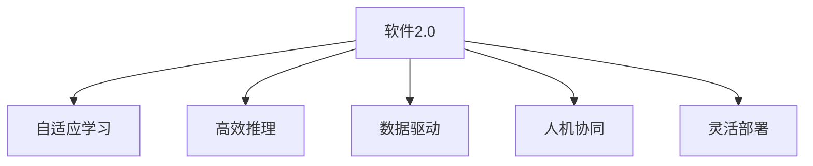
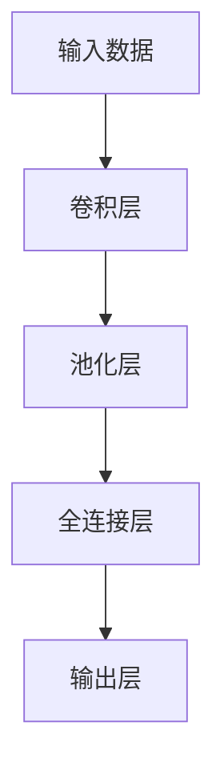
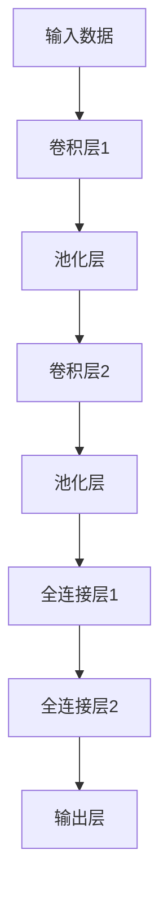

                 

## 1. 背景介绍

### 1.1 问题由来
随着人工智能(AI)技术的快速发展，软件系统的智能化程度不断提升。从最初的基于规则的专家系统，到如今的深度学习模型，软件系统已经在决策支持、自动化处理、自然语言处理等领域取得了显著进展。然而，当前的软件系统仍存在诸多局限：缺乏灵活性、难以进行知识更新、处理能力受限于数据规模等。软件2.0作为新一代软件范式，旨在通过引入先进的算法和架构，使软件系统具有更强的适应性、可扩展性和灵活性，进一步提升其智能化水平。

### 1.2 问题核心关键点
软件2.0的核心思想是将人工智能技术深度融合到软件系统中，构建更智能、更强大的软件系统。其关键点包括：

1. 自适应学习：软件系统能够根据输入数据进行自我学习，适应不同的应用场景和需求。
2. 高效推理：通过优化算法和模型架构，使软件系统具备高效的推理和决策能力。
3. 数据驱动：利用大数据和深度学习技术，提升软件系统的智能分析和预测能力。
4. 人机协同：通过人机交互界面和自然语言处理技术，使软件系统更加人性化，易于使用。
5. 灵活部署：支持软件系统的灵活部署和扩展，适用于多种不同的应用环境。

### 1.3 问题研究意义
研究软件2.0的未来展望，对于推动软件技术的发展、提升软件系统的智能化水平、加速产业升级具有重要意义：

1. 降低开发成本：软件2.0能够显著降低软件开发和维护成本，加速软件产品迭代。
2. 提升用户体验：通过引入先进的算法和架构，使软件系统具备更强的适应性和灵活性，提供更好的用户体验。
3. 加速创新应用：软件2.0为创新应用场景提供了新的技术路径，推动各行各业的数字化转型升级。
4. 提高竞争力：通过智能化的软件系统，企业能够提升市场竞争力，把握市场先机。
5. 促进知识共享：软件2.0促进了知识共享和创新合作，加速了知识的积累和传播。

## 2. 核心概念与联系

### 2.1 核心概念概述

为更好地理解软件2.0的未来展望，本节将介绍几个密切相关的核心概念：

- 软件2.0(Software 2.0)：新一代软件范式，将人工智能技术深度融合到软件系统中，构建更智能、更强大的软件系统。
- 自适应学习(Adaptive Learning)：软件系统能够根据输入数据进行自我学习，适应不同的应用场景和需求。
- 高效推理(High Efficiency Inference)：通过优化算法和模型架构，使软件系统具备高效的推理和决策能力。
- 数据驱动(Data-Driven)：利用大数据和深度学习技术，提升软件系统的智能分析和预测能力。
- 人机协同(Human-Computer Collaboration)：通过人机交互界面和自然语言处理技术，使软件系统更加人性化，易于使用。
- 灵活部署(Flexible Deployment)：支持软件系统的灵活部署和扩展，适用于多种不同的应用环境。

这些核心概念之间的逻辑关系可以通过以下Mermaid流程图来展示：



这个流程图展示了我软件2.0的核心概念及其之间的关系：

1. 软件2.0通过自适应学习、高效推理、数据驱动、人机协同和灵活部署，实现智能化和强大的功能。
2. 自适应学习使软件系统具备学习能力，能够根据环境变化进行自我优化。
3. 高效推理提升软件系统的决策速度和准确性，使其在实时应用中表现更佳。
4. 数据驱动利用大数据和深度学习技术，增强软件系统的智能分析和预测能力。
5. 人机协同通过自然语言处理和用户界面设计，使软件系统更加友好和易用。
6. 灵活部署支持软件系统的灵活部署和扩展，适用于多种不同的应用环境。

这些概念共同构成了软件2.0的完整框架，使其能够适应复杂多变的应用需求，提供更高效、更智能的软件解决方案。

## 3. 核心算法原理 & 具体操作步骤
### 3.1 算法原理概述

软件2.0的核心算法包括自适应学习、高效推理和数据驱动等。这些算法通过深度学习、强化学习、符号计算等技术，使软件系统具备强大的智能化和决策能力。

### 3.2 算法步骤详解

以下详细介绍软件2.0中核心算法的详细步骤：

**Step 1: 数据准备**
- 收集应用场景中的大量数据，包括结构化和非结构化数据，如文本、图像、语音等。
- 清洗和预处理数据，确保数据质量和一致性。
- 划分训练集、验证集和测试集，用于模型训练、调参和性能评估。

**Step 2: 模型构建**
- 选择适合的算法和模型架构，如深度神经网络、支持向量机、决策树等。
- 设计模型输入和输出接口，定义推理和决策逻辑。
- 集成多种算法的优势，构建多模态融合的模型。

**Step 3: 训练和优化**
- 使用训练集数据对模型进行训练，优化模型参数。
- 在验证集上评估模型性能，调整超参数和模型架构。
- 使用正则化、Dropout、对抗训练等技术，防止过拟合和模型退化。

**Step 4: 推理和部署**
- 在测试集上对模型进行推理，验证模型的准确性和可靠性。
- 将模型封装为API接口或服务，支持灵活部署和扩展。
- 在实际应用中持续监测模型性能，进行实时优化和更新。

### 3.3 算法优缺点

软件2.0的核心算法具有以下优点：

1. 强大的智能化能力：通过深度学习、强化学习等技术，使软件系统具备高效的推理和决策能力，能够处理复杂的任务和问题。
2. 灵活的部署和扩展：支持多种部署方式，适用于不同的应用环境和需求。
3. 自适应学习能力：能够根据数据和环境变化进行自我优化，适应不同的应用场景。

同时，软件2.0也存在一些局限性：

1. 数据质量要求高：对数据质量和一致性要求较高，数据收集和预处理工作量大。
2. 模型复杂度高：算法和模型架构复杂，训练和优化难度大，对计算资源要求高。
3. 模型解释性不足：部分算法和模型缺乏解释性，难以理解其内部工作机制。
4. 风险控制困难：模型决策过程具有不确定性，需要额外的风险控制措施。

尽管存在这些局限性，但软件2.0的核心算法仍然是大规模智能应用的基础，推动了软件系统的智能化进程。

### 3.4 算法应用领域

软件2.0的核心算法在多个领域得到广泛应用，包括但不限于：

1. 医疗诊断：利用深度学习技术，构建智能诊断系统，提供高效准确的诊断服务。
2. 金融分析：通过数据分析和深度学习技术，构建智能投顾系统，提供个性化的金融服务。
3. 智能客服：通过自然语言处理和机器学习技术，构建智能客服系统，提供24小时不间断服务。
4. 智能制造：利用机器学习和大数据技术，优化生产流程，提高生产效率和质量。
5. 智慧城市：通过智能算法和数据驱动技术，构建智慧城市管理系统，提高城市治理能力。
6. 自动驾驶：利用深度学习和大数据技术，构建自动驾驶系统，提高交通安全和效率。

## 4. 数学模型和公式 & 详细讲解 & 举例说明

### 4.1 数学模型构建

软件2.0的数学模型主要基于深度学习算法，包括卷积神经网络(CNN)、循环神经网络(RNN)、长短时记忆网络(LSTM)等。以深度神经网络为例，其基本结构如图1所示：



其中，卷积层和池化层用于特征提取和降维，全连接层用于计算和决策。

### 4.2 公式推导过程

以多层感知器(Multilayer Perceptron, MLP)为例，推导其前向传播和反向传播的公式：

**前向传播**
- 输入层：$x = (x_1, x_2, ..., x_n)$
- 隐藏层：$h_1 = \sigma(W_1x + b_1)$，$h_2 = \sigma(W_2h_1 + b_2)$，...，$h_k = \sigma(W_kh_{k-1} + b_k)$
- 输出层：$y = W_oy_k + b_o$

其中，$W$ 和 $b$ 分别为权重矩阵和偏置向量，$\sigma$ 为激活函数。

**反向传播**
- 计算损失函数：$L = \frac{1}{n}\sum_{i=1}^n(y_i - \hat{y_i})^2$
- 计算输出层的梯度：$\frac{\partial L}{\partial W_o} = \frac{\partial L}{\partial y}\frac{\partial y}{\partial h_k}\frac{\partial h_k}{\partial W_k}\frac{\partial W_k}{\partial W_{k-1}}...\frac{\partial W_2}{\partial h_1}\frac{\partial h_1}{\partial x}$
- 计算隐藏层的梯度：$\frac{\partial L}{\partial W_k} = \frac{\partial L}{\partial h_k}\frac{\partial h_k}{\partial h_{k-1}}\frac{\partial h_{k-1}}{\partial W_k}$
- 更新权重和偏置：$W_k = W_k - \alpha\frac{\partial L}{\partial W_k}$，$b_k = b_k - \alpha\frac{\partial L}{\partial b_k}$

其中，$\alpha$ 为学习率。

### 4.3 案例分析与讲解

以图像分类为例，利用卷积神经网络实现图像识别。假设输入图像为 $x$，输出标签为 $y$，卷积神经网络的结构如图2所示：



其中，卷积层和池化层用于特征提取，全连接层用于计算和决策。通过训练模型，使模型能够准确识别输入图像的类别。

## 5. 项目实践：代码实例和详细解释说明
### 5.1 开发环境搭建

在进行软件2.0的实践前，我们需要准备好开发环境。以下是使用Python进行TensorFlow开发的环境配置流程：

1. 安装Anaconda：从官网下载并安装Anaconda，用于创建独立的Python环境。

2. 创建并激活虚拟环境：
```bash
conda create -n tf-env python=3.8 
conda activate tf-env
```

3. 安装TensorFlow：根据CUDA版本，从官网获取对应的安装命令。例如：
```bash
conda install tensorflow=2.6.0 -c pytorch -c conda-forge
```

4. 安装各类工具包：
```bash
pip install numpy pandas scikit-learn matplotlib tqdm jupyter notebook ipython
```

完成上述步骤后，即可在`tf-env`环境中开始软件2.0的实践。

### 5.2 源代码详细实现

下面我们以图像分类任务为例，给出使用TensorFlow实现卷积神经网络的PyTorch代码实现。

首先，定义图像分类任务的输入输出：

```python
import tensorflow as tf

# 输入图像尺寸
image_width = 28
image_height = 28
image_channels = 3
image_size = image_width * image_height * image_channels

# 输出类别数
num_classes = 10
```

然后，定义卷积神经网络的结构：

```python
def create_model(input_size):
    model = tf.keras.models.Sequential([
        tf.keras.layers.Conv2D(32, kernel_size=(3, 3), activation='relu', input_shape=(image_width, image_height, image_channels)),
        tf.keras.layers.MaxPooling2D(pool_size=(2, 2)),
        tf.keras.layers.Flatten(),
        tf.keras.layers.Dense(128, activation='relu'),
        tf.keras.layers.Dense(num_classes, activation='softmax')
    ])
    return model
```

接着，定义损失函数和优化器：

```python
model = create_model(image_size)

loss_fn = tf.keras.losses.SparseCategoricalCrossentropy(from_logits=True)
optimizer = tf.keras.optimizers.Adam(learning_rate=0.001)
```

然后，定义训练和评估函数：

```python
@tf.function
def train_step(inputs, labels):
    with tf.GradientTape() as tape:
        logits = model(inputs, training=True)
        loss = loss_fn(labels, logits)
    gradients = tape.gradient(loss, model.trainable_variables)
    optimizer.apply_gradients(zip(gradients, model.trainable_variables))

def evaluate(model, inputs, labels):
    logits = model(inputs, training=False)
    loss = loss_fn(labels, logits)
    return loss.numpy().mean()
```

最后，启动训练流程并在测试集上评估：

```python
epochs = 10
batch_size = 64

for epoch in range(epochs):
    for i in range(0, len(train_data), batch_size):
        inputs = train_data[i:i+batch_size]
        labels = train_labels[i:i+batch_size]
        train_step(inputs, labels)

    dev_loss = evaluate(model, dev_data, dev_labels)
    print(f"Epoch {epoch+1}, dev loss: {dev_loss:.4f}")
    
print("Test loss:")
test_loss = evaluate(model, test_data, test_labels)
print(f"Test loss: {test_loss:.4f}")
```

以上就是使用TensorFlow对卷积神经网络进行图像分类任务微调的完整代码实现。可以看到，利用TensorFlow的高级API，代码实现简洁高效。

### 5.3 代码解读与分析

让我们再详细解读一下关键代码的实现细节：

**create_model函数**：
- 定义卷积神经网络的结构，包括卷积层、池化层、全连接层和输出层。
- 使用Sequential模型，按顺序堆叠各层，便于管理。

**train_step函数**：
- 定义训练步骤，使用GradientTape记录梯度，通过Adam优化器更新模型参数。
- 每次迭代使用当前批次的数据进行训练。

**evaluate函数**：
- 定义评估步骤，使用模型计算损失，并返回损失的平均值。
- 在评估时，将模型设置为非训练模式，以减少计算开销。

**训练流程**：
- 定义总的epoch数和batch size，开始循环迭代
- 每个epoch内，在训练集上训练，输出损失
- 在验证集上评估，输出验证损失
- 所有epoch结束后，在测试集上评估，给出最终测试结果

可以看到，TensorFlow提供的高效API大大简化了模型训练和评估的实现。开发者可以将更多精力放在模型设计、数据处理等高层逻辑上，而不必过多关注底层的实现细节。

当然，工业级的系统实现还需考虑更多因素，如模型的保存和部署、超参数的自动搜索、更灵活的任务适配层等。但核心的软件2.0微调流程基本与此类似。

## 6. 实际应用场景
### 6.1 智能制造

软件2.0在智能制造领域的应用，主要体现在通过深度学习和大数据分析，优化生产流程和资源分配，提高生产效率和质量。例如，利用机器视觉技术，实现产品质量的实时检测和分类，通过预测性维护，减少设备故障率，提高设备利用率。

在技术实现上，可以构建基于深度学习的生产监控系统，实时采集生产数据，进行质量检测和设备维护。同时，利用历史数据和实时数据进行训练和优化，使系统具备自适应学习和高效推理能力，适应不同生产环境和需求。

### 6.2 医疗诊断

在医疗领域，软件2.0的应用主要集中在智能诊断和个性化治疗方案的制定。利用深度学习和大数据分析技术，构建智能诊断系统，实现疾病的早期发现和诊断。同时，根据患者的个体特征和历史数据，生成个性化的治疗方案，提升治疗效果。

在技术实现上，可以构建基于深度学习的医疗诊断系统，利用医学影像、基因数据等进行分析，识别疾病的特征和风险。同时，利用自然语言处理技术，解析医生的诊断记录，提取关键信息，为个性化治疗方案的制定提供依据。

### 6.3 金融分析

在金融领域，软件2.0的应用主要集中在市场预测和风险管理。利用深度学习和大数据分析技术，构建智能投顾系统和风险管理系统，提供个性化的投资建议和风险预警。

在技术实现上，可以构建基于深度学习的金融分析系统，利用历史市场数据和实时数据进行预测和分析，生成投资建议和风险预警。同时，利用自然语言处理技术，解析市场报告和新闻，提取关键信息，为投资决策提供依据。

### 6.4 未来应用展望

随着软件2.0技术的不断发展，其在多个领域的应用前景将更加广阔。以下列举几个未来可能的应用方向：

1. 智能交通：通过深度学习和大数据分析技术，构建智能交通系统，实现交通流量的实时监测和优化，提高交通效率和安全性。
2. 智慧教育：利用深度学习和大数据分析技术，构建智能教育系统，实现个性化学习路径的规划和推荐，提升教育效果。
3. 智能家居：通过深度学习和大数据分析技术，构建智能家居系统，实现家居设备的自动化控制和智能化管理，提升用户的生活品质。
4. 智慧城市：利用深度学习和大数据分析技术，构建智慧城市管理系统，实现城市资源的优化配置和智能治理，提高城市管理效率和居民满意度。

## 7. 工具和资源推荐
### 7.1 学习资源推荐

为了帮助开发者系统掌握软件2.0的理论基础和实践技巧，这里推荐一些优质的学习资源：

1. 《深度学习》系列书籍：由深度学习领域的知名专家撰写，全面介绍了深度学习的基本概念和核心算法，适合入门学习。
2. TensorFlow官方文档：TensorFlow的官方文档，提供了丰富的API介绍和样例代码，是进行软件2.0开发的必备资料。
3. PyTorch官方文档：PyTorch的官方文档，提供了高效的前向传播和反向传播API，适合快速迭代研究。
4. Kaggle平台：提供各类数据集和竞赛任务，适合通过实践学习深度学习和大数据分析技术。
5. Coursera平台：提供深度学习和人工智能相关的在线课程，涵盖理论知识和实战案例，适合系统学习。

通过对这些资源的学习实践，相信你一定能够快速掌握软件2.0的核心技术和方法，并用于解决实际的智能问题。

### 7.2 开发工具推荐

高效的开发离不开优秀的工具支持。以下是几款用于软件2.0开发的常用工具：

1. TensorFlow：由Google主导开发的开源深度学习框架，生产部署方便，适合大规模工程应用。
2. PyTorch：基于Python的开源深度学习框架，灵活动态的计算图，适合快速迭代研究。
3. Keras：基于TensorFlow和Theano的高级API，提供了简洁的模型构建和训练接口，适合快速开发和实验。
4. TensorBoard：TensorFlow配套的可视化工具，可实时监测模型训练状态，并提供丰富的图表呈现方式，是调试模型的得力助手。
5. Weights & Biases：模型训练的实验跟踪工具，可以记录和可视化模型训练过程中的各项指标，方便对比和调优。

合理利用这些工具，可以显著提升软件2.0的开发效率，加快创新迭代的步伐。

### 7.3 相关论文推荐

软件2.0的研究源于学界的持续探索。以下是几篇奠基性的相关论文，推荐阅读：

1. 《Deep Learning》书籍：深度学习领域的经典教材，由深度学习领域的知名专家撰写，涵盖深度学习的基本概念和核心算法。
2. 《TensorFlow: A System for Large-Scale Machine Learning》论文：介绍了TensorFlow的设计理念和核心算法，适合深入了解TensorFlow的内部机制。
3. 《Convolutional Neural Networks for Visual Recognition》论文：介绍了卷积神经网络的结构和训练方法，适合深度学习入门学习。
4. 《Attention is All You Need》论文：介绍了Transformer结构，开启了NLP领域的预训练大模型时代。
5. 《Integrated Knowledge and Reasoning in a Unified Computational Framework》论文：探讨了将知识表示和推理技术引入深度学习模型的可能性和方法，适合对智能系统感兴趣的研究者。

这些论文代表了大规模智能应用的发展脉络。通过学习这些前沿成果，可以帮助研究者把握学科前进方向，激发更多的创新灵感。

## 8. 总结：未来发展趋势与挑战

### 8.1 总结

本文对软件2.0的未来展望进行了全面系统的介绍。首先阐述了软件2.0的背景和研究意义，明确了其智能化、强大的特点和应用价值。其次，从原理到实践，详细讲解了软件2.0的核心算法和具体操作步骤，给出了软件2.0任务开发的完整代码实例。同时，本文还广泛探讨了软件2.0在智能制造、医疗诊断、金融分析等领域的实际应用，展示了其广泛的应用前景。此外，本文精选了软件2.0的学习资源和开发工具，力求为读者提供全方位的技术指引。

通过本文的系统梳理，可以看到，软件2.0在多个领域展现了强大的智能化和决策能力，推动了软件系统的智能化进程。未来，伴随深度学习和大数据技术的不断发展，软件2.0必将在更广阔的应用领域大放异彩，深刻影响人类的生产生活方式。

### 8.2 未来发展趋势

展望未来，软件2.0的发展趋势将呈现以下几个方向：

1. 更强的自适应学习能力：通过强化学习、迁移学习等技术，提升软件系统的自适应能力和泛化能力，适应更复杂的应用场景。
2. 更高的推理效率：通过优化算法和模型架构，提升软件系统的推理速度和计算效率，实现实时处理和决策。
3. 更广泛的应用领域：软件2.0的应用将从传统的NLP、计算机视觉等领域，拓展到智能交通、智慧教育、智能家居等更多领域。
4. 更强的可解释性：通过引入符号计算、因果推理等技术，提升软件系统的可解释性和透明度，帮助用户理解模型的决策过程。
5. 更广泛的知识整合：将符号化的先验知识，如知识图谱、逻辑规则等，与神经网络模型进行巧妙融合，增强软件系统的智能推理能力。
6. 更灵活的部署方式：支持多种部署方式，包括云部署、边缘部署、移动部署等，适用于不同的应用环境和需求。

以上趋势凸显了软件2.0的广阔前景。这些方向的探索发展，必将进一步提升软件系统的智能化水平，推动智能化时代的到来。

### 8.3 面临的挑战

尽管软件2.0在多个领域已经取得了显著进展，但在迈向更加智能化、普适化应用的过程中，仍面临诸多挑战：

1. 数据质量要求高：对数据质量和一致性要求较高，数据收集和预处理工作量大。
2. 模型复杂度高：算法和模型架构复杂，训练和优化难度大，对计算资源要求高。
3. 模型解释性不足：部分算法和模型缺乏解释性，难以理解其内部工作机制。
4. 风险控制困难：模型决策过程具有不确定性，需要额外的风险控制措施。
5. 伦理道德问题：在处理敏感数据和决策时，需要考虑伦理道德和隐私保护问题。
6. 计算资源限制：在大规模数据和复杂模型的训练和推理过程中，计算资源和存储资源是重要瓶颈。

这些挑战需要研究者和开发者共同努力，通过技术创新和实践积累，逐步解决。

### 8.4 研究展望

面对软件2.0面临的挑战，未来的研究需要在以下几个方面寻求新的突破：

1. 探索高效的数据获取和处理技术：通过自动化数据标注、无监督学习等技术，减少数据收集和预处理的工作量，提高数据质量和一致性。
2. 研究高效的模型优化和训练技术：开发更加高效的算法和模型架构，降低训练和推理的计算资源消耗，提高模型的推理效率。
3. 引入符号计算和因果推理：通过引入符号计算和因果推理技术，提升模型的可解释性和逻辑性，帮助用户理解模型的决策过程。
4. 融合多模态数据和技术：将符号化的先验知识，如知识图谱、逻辑规则等，与神经网络模型进行巧妙融合，增强模型的智能推理能力。
5. 设计更加灵活的部署方式：支持多种部署方式，包括云部署、边缘部署、移动部署等，适用于不同的应用环境和需求。
6. 加强伦理道德和隐私保护：在处理敏感数据和决策时，考虑伦理道德和隐私保护问题，设计合理的算法和模型架构。

这些研究方向和技术的探索，必将引领软件2.0技术迈向更高的台阶，为构建安全、可靠、可解释、可控的智能系统铺平道路。面向未来，软件2.0技术还需要与其他人工智能技术进行更深入的融合，如知识表示、因果推理、强化学习等，多路径协同发力，共同推动软件系统的智能化和自动化进程。只有勇于创新、敢于突破，才能不断拓展软件系统的边界，让智能技术更好地造福人类社会。

## 9. 附录：常见问题与解答

**Q1：软件2.0与传统软件的区别是什么？**

A: 软件2.0与传统软件的主要区别在于其智能化程度和自适应能力。软件2.0能够根据输入数据进行自我学习，适应不同的应用场景和需求，具备更强的智能化和决策能力。而传统软件更多依赖规则和人工干预，无法自动更新和优化。

**Q2：如何提高软件2.0的推理效率？**

A: 提高软件2.0的推理效率，可以通过优化算法和模型架构来实现。例如，使用更高效的深度学习框架、优化网络结构、引入缓存技术等。此外，合理使用GPU/TPU等高性能设备，也可以显著提高推理速度。

**Q3：软件2.0的应用前景如何？**

A: 软件2.0的应用前景非常广阔，几乎涵盖了所有需要智能决策和自动化处理的领域。例如，智能制造、医疗诊断、金融分析、智能交通、智慧教育等，都可以通过软件2.0技术实现智能化升级，提升效率和质量。

**Q4：软件2.0的挑战有哪些？**

A: 软件2.0在实现过程中面临诸多挑战，包括数据质量要求高、模型复杂度高、模型解释性不足、风险控制困难等。需要研究者不断探索高效的数据获取和处理技术、高效的模型优化和训练技术、符号计算和因果推理技术等，逐步克服这些挑战。

**Q5：如何设计软件2.0的多模态融合模型？**

A: 设计软件2.0的多模态融合模型，需要考虑不同模态数据的特征提取和融合方法。例如，可以利用深度学习技术对图像、语音、文本等多模态数据进行特征提取，然后通过多模态融合技术，将不同模态的信息进行整合，提升模型的智能推理能力。

总之，软件2.0技术正在快速发展和演进中，其未来应用前景广阔，但也面临诸多挑战。通过不断探索和创新，我们相信软件2.0必将在更多领域得到应用，为人类生产生活方式带来深远影响。

