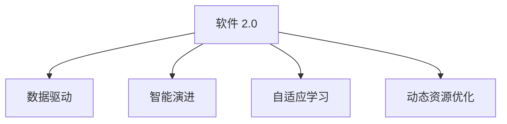

                 

## 1. 背景介绍

### 1.1 问题的由来
随着信息技术的快速发展和人工智能的不断突破，我们的世界正在发生深刻的变化。数字化、智能化正在重塑我们的生产、生活和社会结构。软件作为现代社会的核心驱动力，也在经历着从 1.0 到 2.0 的转变。软件 1.0 是传统的软件工程范式，强调预定义规则和自动化流程，通过人力驱动开发；而软件 2.0 则着眼于自适应学习和智能演进，通过数据驱动优化，创造更加智能、灵活和可持续的软件系统。

### 1.2 问题的核心关键点
软件 2.0 的核心在于通过数据驱动的机器学习算法，不断优化软件系统，提升其适应性、预测能力和自主决策能力。关键点包括：

1. **数据驱动**：利用海量的数据，通过机器学习算法，实时调整软件行为，优化用户体验。
2. **智能演进**：软件系统能够根据用户反馈和环境变化，自我优化，持续提升性能。
3. **用户中心**：用户行为和需求是软件系统优化的核心驱动力，软件能够根据用户行为自适应调整。
4. **自适应学习**：软件系统具备自我学习和进化能力，能够根据新的数据和反馈持续改进。
5. **动态资源优化**：软件能够根据负载和资源情况，动态调整资源配置，确保高效运行。

这些关键点共同构成了软件 2.0 的愿景和目标，旨在打造更加智能、高效和人性化的软件系统。

### 1.3 问题研究意义
研究软件 2.0 的未来愿景，对于推动软件工程创新、提升软件系统质量、优化用户体验具有重要意义：

1. **提升系统效率**：通过数据驱动和智能演进，软件系统能够自动调整，提高资源利用率，减少人工干预。
2. **优化用户体验**：软件系统能够根据用户行为和反馈，实时调整，提供更符合用户需求的服务。
3. **促进创新发展**：软件 2.0 打破了传统软件的预定义限制，为创新提供了更多可能性。
4. **推动行业变革**：通过智能化的软件系统，各行各业能够更高效地应对挑战，加速数字化转型。
5. **增强社会福祉**：智能软件能够更好地服务社会，提升生活质量，促进社会和谐发展。

## 2. 核心概念与联系

### 2.1 核心概念概述

为更好地理解软件 2.0 的未来愿景，本节将介绍几个密切相关的核心概念：

1. **软件 2.0**：一种新的软件开发范式，强调数据驱动、智能演进、用户中心和自适应学习。通过机器学习算法不断优化软件系统，提升其智能性和适应性。

2. **数据驱动**：利用数据和机器学习算法，实时调整软件行为，优化用户体验。数据是软件 2.0 的核心驱动力。

3. **智能演进**：软件系统能够根据用户反馈和环境变化，自我优化，持续提升性能。智能演进是软件 2.0 的关键特性。

4. **自适应学习**：软件系统具备自我学习和进化能力，能够根据新的数据和反馈持续改进。自适应学习是软件 2.0 的基础技术。

5. **动态资源优化**：软件能够根据负载和资源情况，动态调整资源配置，确保高效运行。动态资源优化是软件 2.0 的重要目标。

这些核心概念之间的逻辑关系可以通过以下Mermaid流程图来展示：



这个流程图展示了大语言模型的核心概念及其之间的关系：

1. 软件 2.0 通过数据驱动获得决策依据。
2. 智能演进是软件 2.0 的动态调整机制。
3. 自适应学习是软件 2.0 的核心技术，通过不断优化算法，提升预测能力。
4. 动态资源优化是软件 2.0 的效率保障，通过实时调整资源配置，确保最优运行。

这些概念共同构成了软件 2.0 的未来愿景，为其构建智能、高效的软件系统提供了坚实基础。

## 3. 核心算法原理 & 具体操作步骤
### 3.1 算法原理概述

软件 2.0 的核心算法是机器学习，尤其是深度学习和大数据驱动的算法。其原理是通过大规模数据集训练模型，学习软件系统的行为模式和用户需求，实现实时调整和优化。

形式化地，假设软件系统的行为可以表示为 $f(x)$，其中 $x$ 是输入参数，$f$ 是软件行为映射函数。软件 2.0 的目标是通过优化算法，不断调整 $f(x)$，使其更符合用户需求和环境变化。

具体而言，软件 2.0 的优化目标是最小化用户体验损失函数 $L$，即：

$$
\min_{f} L(f) = \int L(f(x), y) P(x, y) dx dy
$$

其中 $y$ 是真实用户行为，$P(x, y)$ 是用户行为概率分布。通过最小化损失函数 $L$，软件系统能够不断调整行为 $f$，以提升用户体验。

### 3.2 算法步骤详解

软件 2.0 的实现步骤主要包括以下几个关键步骤：

**Step 1: 数据收集与预处理**
- 收集软件运行中的数据，包括用户行为、系统性能、环境参数等。
- 对原始数据进行清洗、去噪和标准化处理，保证数据质量。

**Step 2: 特征提取与选择**
- 提取与用户行为和软件性能相关的特征，如点击次数、加载时间、CPU 使用率等。
- 选择合适的特征子集，构建训练数据集。

**Step 3: 模型训练与优化**
- 选择合适的机器学习算法（如回归、分类、强化学习等）进行模型训练。
- 使用交叉验证、早停等技术，避免过拟合，优化模型参数。

**Step 4: 实时调整与预测**
- 实时采集用户行为数据，输入模型进行预测。
- 根据预测结果，动态调整软件行为，优化用户体验。

**Step 5: 性能评估与反馈**
- 通过 A/B 测试、用户反馈等方式，评估软件行为调整效果。
- 根据评估结果，调整模型参数，持续优化软件系统。

### 3.3 算法优缺点

软件 2.0 的算法具有以下优点：

1. **实时优化**：通过实时数据驱动，软件系统能够迅速响应环境变化，提升用户体验。
2. **自适应性强**：软件系统具备自我学习和进化能力，能够根据新数据持续改进。
3. **灵活高效**：软件系统能够动态调整资源配置，提高运行效率。
4. **预测能力强**：通过机器学习算法，软件系统具备强大的预测和推理能力，能够准确预测用户需求。

同时，软件 2.0 的算法也存在一些局限性：

1. **数据依赖性强**：软件 2.0 的效果高度依赖于数据质量，需要高质量、多样化的数据支撑。
2. **算法复杂度高**：模型训练和预测过程复杂，需要高性能计算资源。
3. **安全性问题**：模型可能学习到有害数据，导致安全问题。
4. **可解释性不足**：模型决策过程复杂，难以解释和调试。

尽管存在这些局限性，但就目前而言，数据驱动的机器学习算法仍然是实现软件 2.0 愿景的重要手段。未来相关研究的重点在于如何进一步降低对数据的依赖，提高模型的可解释性和安全性。

### 3.4 算法应用领域

软件 2.0 的算法已经在多个领域得到应用，例如：

- **个性化推荐系统**：如Netflix、Amazon等公司，通过用户行为数据，实时调整推荐内容，提升用户体验。
- **智能客服系统**：如阿里巴巴、腾讯等公司，通过用户交互数据，实时调整客服策略，提高服务效率。
- **自动驾驶系统**：如Google、Tesla等公司，通过传感器数据，实时调整车辆行为，提升驾驶安全性。
- **智能家居系统**：如Google Nest、Apple HomeKit等，通过用户行为数据，实时调整设备控制，提升生活便利性。

除了上述这些经典应用外，软件 2.0 的算法还被创新性地应用到更多场景中，如供应链管理、智能物流、智能医疗等，为各行各业带来智能化升级。随着算法技术的不断进步，相信软件 2.0 将会在更多领域得到应用，推动数字化转型。

## 4. 数学模型和公式 & 详细讲解 & 举例说明

### 4.1 数学模型构建

本节将使用数学语言对软件 2.0 的优化目标进行更加严格的刻画。

假设软件系统的行为可以表示为 $f(x)$，其中 $x$ 是输入参数，$f$ 是软件行为映射函数。软件 2.0 的目标是通过优化算法，不断调整 $f(x)$，使其更符合用户需求和环境变化。

具体而言，软件 2.0 的优化目标是最小化用户体验损失函数 $L$，即：

$$
\min_{f} L(f) = \int L(f(x), y) P(x, y) dx dy
$$

其中 $y$ 是真实用户行为，$P(x, y)$ 是用户行为概率分布。通过最小化损失函数 $L$，软件系统能够不断调整行为 $f$，以提升用户体验。

### 4.2 公式推导过程

以下我们以个性化推荐系统为例，推导最小化用户体验损失函数 $L$ 的优化过程。

假设推荐系统的用户行为数据为 $D=\{(x_i, y_i)\}_{i=1}^N$，其中 $x_i$ 是用户行为数据，$y_i$ 是真实推荐结果。推荐系统的行为表示为 $f(x)$，目标是最小化用户体验损失函数：

$$
L(f) = \sum_{i=1}^N \ell(f(x_i), y_i)
$$

其中 $\ell$ 是用户体验损失函数，通常为交叉熵损失。最小化 $L(f)$ 即：

$$
\min_{f} L(f) = \min_{f} \sum_{i=1}^N \ell(f(x_i), y_i)
$$

使用梯度下降等优化算法，最小化损失函数：

$$
f \leftarrow f - \eta \nabla_{f}L(f)
$$

其中 $\eta$ 为学习率，$\nabla_{f}L(f)$ 为损失函数对行为 $f$ 的梯度。

在得到损失函数的梯度后，即可带入参数更新公式，完成模型的迭代优化。重复上述过程直至收敛，最终得到适应用户需求的最优行为 $f^*$。

### 4.3 案例分析与讲解

假设用户 A 在某次浏览过某篇文章后，软件系统根据用户行为数据，预测其会继续阅读类似文章。推荐系统将文章推荐给用户 A，用户 A 阅读后反馈满意。根据这一交互数据，软件系统进一步优化推荐策略，将更多相似文章推荐给用户 A，提升其阅读体验。

这个例子展示了软件 2.0 的优化过程：通过实时采集用户行为数据，利用机器学习算法预测用户需求，实时调整推荐策略，不断优化用户体验。

## 5. 项目实践：代码实例和详细解释说明
### 5.1 开发环境搭建

在进行软件 2.0 实践前，我们需要准备好开发环境。以下是使用Python进行TensorFlow开发的环境配置流程：

1. 安装Anaconda：从官网下载并安装Anaconda，用于创建独立的Python环境。

2. 创建并激活虚拟环境：
```bash
conda create -n tf-env python=3.8 
conda activate tf-env
```

3. 安装TensorFlow：根据CUDA版本，从官网获取对应的安装命令。例如：
```bash
conda install tensorflow -c pytorch -c conda-forge
```

4. 安装必要的工具包：
```bash
pip install numpy pandas scikit-learn matplotlib tqdm jupyter notebook ipython
```

完成上述步骤后，即可在`tf-env`环境中开始软件 2.0 的实践。

### 5.2 源代码详细实现

下面我们以个性化推荐系统为例，给出使用TensorFlow实现软件 2.0 的代码实现。

首先，定义推荐系统的数据处理函数：

```python
import tensorflow as tf
import numpy as np
from sklearn.model_selection import train_test_split

def load_data():
    # 加载数据集，例如从MySQL数据库读取
    # 返回训练集和测试集
    pass

def preprocess_data(train_data, test_data):
    # 数据预处理，例如特征选择和归一化
    pass

def build_model(inputs, labels):
    # 构建推荐模型，例如使用DNN模型
    pass

def train_model(model, train_data, test_data, epochs):
    # 训练模型，例如使用Adam优化器
    pass

def evaluate_model(model, test_data):
    # 评估模型，例如使用AUC指标
    pass
```

然后，定义模型和优化器：

```python
from tensorflow.keras.models import Sequential
from tensorflow.keras.layers import Dense, Input, Embedding, Flatten
from tensorflow.keras.optimizers import Adam

model = Sequential([
    Input(shape=(features,), dtype='float32'),
    Embedding(input_dim=vocab_size, output_dim=embedding_dim),
    Flatten(),
    Dense(units=num_recommends, activation='sigmoid'),
])

optimizer = Adam(lr=learning_rate)
```

接着，定义训练和评估函数：

```python
from tensorflow.keras.utils import to_categorical
from sklearn.metrics import auc

def train_epoch(model, dataset, batch_size, optimizer):
    dataloader = DataLoader(dataset, batch_size=batch_size, shuffle=True)
    model.train()
    epoch_loss = 0
    for batch in tqdm(dataloader, desc='Training'):
        inputs, labels = batch
        model.zero_grad()
        outputs = model(inputs)
        loss = model.loss(inputs, labels)
        epoch_loss += loss.item()
        loss.backward()
        optimizer.step()
    return epoch_loss / len(dataloader)

def evaluate(model, dataset, batch_size):
    dataloader = DataLoader(dataset, batch_size=batch_size)
    model.eval()
    preds, labels = [], []
    with tf.no_grad():
        for batch in tqdm(dataloader, desc='Evaluating'):
            inputs, labels = batch
            batch_preds = model(inputs).numpy()
            batch_labels = labels.numpy()
            for preds_tokens, labels_tokens in zip(batch_preds, batch_labels):
                preds.append(preds_tokens)
                labels.append(labels_tokens)
    return auc(preds, labels)
```

最后，启动训练流程并在测试集上评估：

```python
epochs = 10
batch_size = 64

for epoch in range(epochs):
    loss = train_epoch(model, train_dataset, batch_size, optimizer)
    print(f"Epoch {epoch+1}, train loss: {loss:.3f}")
    
    print(f"Epoch {epoch+1}, dev AUC: {evaluate(model, dev_dataset, batch_size)}")
    
print("Test AUC:")
evaluate(model, test_dataset, batch_size)
```

以上就是使用TensorFlow实现个性化推荐系统的代码实现。可以看到，TensorFlow提供了强大的深度学习库和工具，使得模型构建和训练变得简洁高效。

### 5.3 代码解读与分析

让我们再详细解读一下关键代码的实现细节：

**load_data函数**：
- 加载数据集，例如从MySQL数据库读取训练集和测试集。

**preprocess_data函数**：
- 数据预处理，例如特征选择、归一化等。

**build_model函数**：
- 构建推荐模型，例如使用深度神经网络。

**train_model函数**：
- 训练模型，例如使用Adam优化器，设置训练轮数。

**evaluate_model函数**：
- 评估模型，例如使用AUC指标，计算模型在测试集上的表现。

**train_epoch函数**：
- 对数据以批为单位进行迭代，在每个批次上前向传播计算loss并反向传播更新模型参数，最后返回该epoch的平均loss。

**evaluate函数**：
- 与训练类似，不同点在于不更新模型参数，并在每个batch结束后将预测和标签结果存储下来，最后使用sklearn的auc函数对整个评估集的预测结果进行打印输出。

**训练流程**：
- 定义总的epoch数和batch size，开始循环迭代
- 每个epoch内，先在训练集上训练，输出平均loss
- 在验证集上评估，输出AUC指标
- 重复上述步骤直至收敛，最终在测试集上评估，给出最终测试结果

可以看到，TensorFlow配合TensorBoard等工具，使得模型训练和评估过程变得简洁高效。开发者可以将更多精力放在数据处理、模型改进等高层逻辑上，而不必过多关注底层的实现细节。

当然，工业级的系统实现还需考虑更多因素，如模型的保存和部署、超参数的自动搜索、更灵活的任务适配层等。但核心的软件 2.0 范式基本与此类似。

## 6. 实际应用场景
### 6.1 智能客服系统

基于软件 2.0 的对话技术，可以广泛应用于智能客服系统的构建。传统客服往往需要配备大量人力，高峰期响应缓慢，且一致性和专业性难以保证。而使用软件 2.0 的对话模型，可以7x24小时不间断服务，快速响应客户咨询，用自然流畅的语言解答各类常见问题。

在技术实现上，可以收集企业内部的历史客服对话记录，将问题和最佳答复构建成监督数据，在此基础上对预训练对话模型进行微调。微调后的对话模型能够自动理解用户意图，匹配最合适的答案模板进行回复。对于客户提出的新问题，还可以接入检索系统实时搜索相关内容，动态组织生成回答。如此构建的智能客服系统，能大幅提升客户咨询体验和问题解决效率。

### 6.2 金融舆情监测

金融机构需要实时监测市场舆论动向，以便及时应对负面信息传播，规避金融风险。传统的人工监测方式成本高、效率低，难以应对网络时代海量信息爆发的挑战。基于软件 2.0 的文本分类和情感分析技术，为金融舆情监测提供了新的解决方案。

具体而言，可以收集金融领域相关的新闻、报道、评论等文本数据，并对其进行主题标注和情感标注。在此基础上对预训练语言模型进行微调，使其能够自动判断文本属于何种主题，情感倾向是正面、中性还是负面。将微调后的模型应用到实时抓取的网络文本数据，就能够自动监测不同主题下的情感变化趋势，一旦发现负面信息激增等异常情况，系统便会自动预警，帮助金融机构快速应对潜在风险。

### 6.3 个性化推荐系统

当前的推荐系统往往只依赖用户的历史行为数据进行物品推荐，无法深入理解用户的真实兴趣偏好。基于软件 2.0 的推荐系统可以更好地挖掘用户行为背后的语义信息，从而提供更精准、多样的推荐内容。

在实践中，可以收集用户浏览、点击、评论、分享等行为数据，提取和用户交互的物品标题、描述、标签等文本内容。将文本内容作为模型输入，用户的后续行为（如是否点击、购买等）作为监督信号，在此基础上微调预训练语言模型。微调后的模型能够从文本内容中准确把握用户的兴趣点。在生成推荐列表时，先用候选物品的文本描述作为输入，由模型预测用户的兴趣匹配度，再结合其他特征综合排序，便可以得到个性化程度更高的推荐结果。

### 6.4 未来应用展望

随着软件 2.0 技术的不断发展，其在更多领域得到应用，为传统行业带来变革性影响。

在智慧医疗领域，基于软件 2.0 的医疗问答、病历分析、药物研发等应用将提升医疗服务的智能化水平，辅助医生诊疗，加速新药开发进程。

在智能教育领域，软件 2.0 可应用于作业批改、学情分析、知识推荐等方面，因材施教，促进教育公平，提高教学质量。

在智慧城市治理中，软件 2.0 能够用于城市事件监测、舆情分析、应急指挥等环节，提高城市管理的自动化和智能化水平，构建更安全、高效的未来城市。

此外，在企业生产、社会治理、文娱传媒等众多领域，基于软件 2.0 的人工智能应用也将不断涌现，为经济社会发展注入新的动力。相信随着技术的日益成熟，软件 2.0 必将在更广阔的应用领域大放异彩，深刻影响人类的生产生活方式。

## 7. 工具和资源推荐
### 7.1 学习资源推荐

为了帮助开发者系统掌握软件 2.0 的未来愿景，这里推荐一些优质的学习资源：

1. 《TensorFlow从入门到精通》系列博文：由TensorFlow团队撰写，系统介绍了TensorFlow的原理、实践和应用场景。

2. CS229《机器学习》课程：斯坦福大学开设的机器学习明星课程，有Lecture视频和配套作业，带你深入理解机器学习理论。

3. 《深度学习》书籍：Ian Goodfellow所著，全面介绍了深度学习算法和实践，是深度学习领域的经典教材。

4. Coursera的深度学习课程：由深度学习领域的知名专家开设，涵盖深度学习的基本概念和前沿技术。

5. Google的TensorFlow官方文档：TensorFlow的官方文档，提供了完整的API和开发指南，是学习和实践TensorFlow的最佳资料。

通过对这些资源的学习实践，相信你一定能够快速掌握软件 2.0 的未来愿景，并用于解决实际的NLP问题。
###  7.2 开发工具推荐

高效的开发离不开优秀的工具支持。以下是几款用于软件 2.0 微调开发的常用工具：

1. TensorFlow：由Google主导开发的开源深度学习框架，生产部署方便，适合大规模工程应用。同样有丰富的预训练语言模型资源。

2. PyTorch：基于Python的开源深度学习框架，灵活动态的计算图，适合快速迭代研究。大部分预训练语言模型都有PyTorch版本的实现。

3. Weights & Biases：模型训练的实验跟踪工具，可以记录和可视化模型训练过程中的各项指标，方便对比和调优。与主流深度学习框架无缝集成。

4. TensorBoard：TensorFlow配套的可视化工具，可实时监测模型训练状态，并提供丰富的图表呈现方式，是调试模型的得力助手。

5. Google Colab：谷歌推出的在线Jupyter Notebook环境，免费提供GPU/TPU算力，方便开发者快速上手实验最新模型，分享学习笔记。

合理利用这些工具，可以显著提升软件 2.0 的微调任务的开发效率，加快创新迭代的步伐。

### 7.3 相关论文推荐

软件 2.0 的未来愿景源于学界的持续研究。以下是几篇奠基性的相关论文，推荐阅读：

1. Deep Reinforcement Learning for Personalized Video Recommendation（TensorFlow论文）：展示了TensorFlow在个性化推荐系统中的应用，通过深度强化学习优化推荐策略。

2. How Can We Make Deep Learning More User-Friendly？（TensorFlow论文）：讨论了如何通过TensorFlow提供更易用的开发工具，提升软件 2.0 的普及度。

3. A Survey on Deep Reinforcement Learning and Its Applications to Recommendation Systems（深度学习综述）：系统总结了深度强化学习在推荐系统中的应用，为软件 2.0 的实现提供了理论基础。

4. Scaling Neural Networks for Web-scale Image Classification（Google论文）：展示了Google如何在大规模数据上训练深度神经网络，为软件 2.0 提供了技术支持。

5. TensorFlow 2.0：Deep Learning Framework（TensorFlow官方文档）：介绍了TensorFlow 2.0的新特性和改进，为软件 2.0 的实现提供了全面的开发指南。

这些论文代表了大语言模型微调技术的发展脉络。通过学习这些前沿成果，可以帮助研究者把握学科前进方向，激发更多的创新灵感。

## 8. 总结：未来发展趋势与挑战
### 8.1 总结

本文对软件 2.0 的未来愿景进行了全面系统的介绍。首先阐述了软件 2.0 的原理和核心技术，明确了其数据驱动、智能演进、用户中心和自适应学习的核心思想。其次，从原理到实践，详细讲解了软件 2.0 的优化目标和关键步骤，给出了微调任务开发的完整代码实例。同时，本文还广泛探讨了软件 2.0 在智能客服、金融舆情、个性化推荐等多个行业领域的应用前景，展示了软件 2.0 的巨大潜力。此外，本文精选了软件 2.0 的学习资源，力求为读者提供全方位的技术指引。

通过本文的系统梳理，可以看到，软件 2.0 在未来将迎来更广阔的应用空间，有望深刻影响各行各业的数字化转型。

### 8.2 未来发展趋势

展望未来，软件 2.0 的发展趋势包括：

1. **数据驱动**：数据驱动将成为软件 2.0 的核心驱动力，数据量和数据质量的提升将进一步优化系统性能。

2. **智能演进**：软件 2.0 系统将具备更强的自我优化能力，能够根据新数据实时调整，提升预测准确性。

3. **用户中心**：用户行为和反馈将更深入地影响软件 2.0 的优化过程，实现更个性化的服务。

4. **自适应学习**：软件 2.0 系统将具备更强的自适应学习能力，能够自动调整模型参数，提升系统鲁棒性。

5. **跨领域应用**：软件 2.0 技术将向更多领域渗透，如医疗、金融、教育等，推动各行各业的智能化升级。

这些趋势凸显了软件 2.0 技术的广泛应用前景，将为各行各业带来深远影响。

### 8.3 面临的挑战

尽管软件 2.0 技术已经取得了瞩目成就，但在迈向更加智能化、普适化应用的过程中，它仍面临诸多挑战：

1. **数据依赖性强**：软件 2.0 的效果高度依赖于数据质量，需要高质量、多样化的数据支撑。

2. **算法复杂度高**：模型训练和预测过程复杂，需要高性能计算资源。

3. **安全性问题**：模型可能学习到有害数据，导致安全问题。

4. **可解释性不足**：模型决策过程复杂，难以解释和调试。

尽管存在这些挑战，但就目前而言，数据驱动的机器学习算法仍然是实现软件 2.0 愿景的重要手段。未来相关研究的重点在于如何进一步降低对数据的依赖，提高模型的可解释性和安全性。

### 8.4 研究展望

面对软件 2.0 面临的挑战，未来的研究需要在以下几个方面寻求新的突破：

1. **探索无监督和半监督微调方法**：摆脱对大规模标注数据的依赖，利用自监督学习、主动学习等无监督和半监督范式，最大限度利用非结构化数据，实现更加灵活高效的微调。

2. **研究参数高效和计算高效的微调范式**：开发更加参数高效的微调方法，在固定大部分预训练参数的同时，只更新极少量的任务相关参数。同时优化微调模型的计算图，减少前向传播和反向传播的资源消耗，实现更加轻量级、实时性的部署。

3. **融合因果和对比学习范式**：通过引入因果推断和对比学习思想，增强软件 2.0 系统的建立稳定因果关系的能力，学习更加普适、鲁棒的语言表征，从而提升模型泛化性和抗干扰能力。

4. **引入更多先验知识**：将符号化的先验知识，如知识图谱、逻辑规则等，与神经网络模型进行巧妙融合，引导软件 2.0 系统学习更准确、合理的语言模型。同时加强不同模态数据的整合，实现视觉、语音等多模态信息与文本信息的协同建模。

5. **结合因果分析和博弈论工具**：将因果分析方法引入软件 2.0 系统，识别出模型决策的关键特征，增强输出解释的因果性和逻辑性。借助博弈论工具刻画人机交互过程，主动探索并规避模型的脆弱点，提高系统稳定性。

6. **纳入伦理道德约束**：在模型训练目标中引入伦理导向的评估指标，过滤和惩罚有偏见、有害的输出倾向。同时加强人工干预和审核，建立模型行为的监管机制，确保输出符合人类价值观和伦理道德。

这些研究方向的探索，必将引领软件 2.0 技术迈向更高的台阶，为构建安全、可靠、可解释、可控的智能系统铺平道路。面向未来，软件 2.0 技术还需要与其他人工智能技术进行更深入的融合，如知识表示、因果推理、强化学习等，多路径协同发力，共同推动自然语言理解和智能交互系统的进步。只有勇于创新、敢于突破，才能不断拓展软件 2.0 的边界，让智能技术更好地造福人类社会。

## 9. 附录：常见问题与解答

**Q1：软件 2.0 是否适用于所有NLP任务？**

A: 软件 2.0 在大多数NLP任务上都能取得不错的效果，特别是对于数据量较小的任务。但对于一些特定领域的任务，如医学、法律等，仅仅依靠通用语料预训练的模型可能难以很好地适应。此时需要在特定领域语料上进一步预训练，再进行微调，才能获得理想效果。此外，对于一些需要时效性、个性化很强的任务，如对话、推荐等，软件 2.0 方法也需要针对性的改进优化。

**Q2：软件 2.0 如何优化模型性能？**

A: 软件 2.0 的模型性能优化主要依赖于数据驱动的机器学习算法。通过收集大量标注数据，利用梯度下降等优化算法不断调整模型参数，最小化用户体验损失函数，实现性能优化。同时，合理选择特征，使用合适的优化器和正则化技术，也是提高模型性能的重要手段。

**Q3：软件 2.0 的算法复杂度高吗？**

A: 软件 2.0 的算法复杂度较高，需要高性能计算资源。模型训练和预测过程复杂，需要大量时间和计算资源。但随着硬件和算法技术的进步，这一问题正在逐步得到解决。未来，有望在保持性能的同时，进一步降低算法复杂度。

**Q4：软件 2.0 的模型可解释性强吗？**

A: 软件 2.0 的模型决策过程复杂，难以解释和调试。虽然现有的模型性能优秀，但其内部工作机制仍难以理解。未来的研究重点在于开发更可解释的模型，增强模型的透明性和可理解性。

**Q5：软件 2.0 的模型安全性如何？**

A: 软件 2.0 的模型安全性受到数据和算法的多重影响。模型可能学习到有害数据，导致安全问题。未来的研究重点在于如何确保模型的安全性，避免模型被恶意利用。

**Q6：软件 2.0 的模型能否适应新任务？**

A: 软件 2.0 的模型具备自适应学习能力，能够根据新数据实时调整，适应新任务。但模型的泛化能力需要在大规模数据上进行验证，确保模型在新任务上表现稳定。

---

作者：禅与计算机程序设计艺术 / Zen and the Art of Computer Programming

