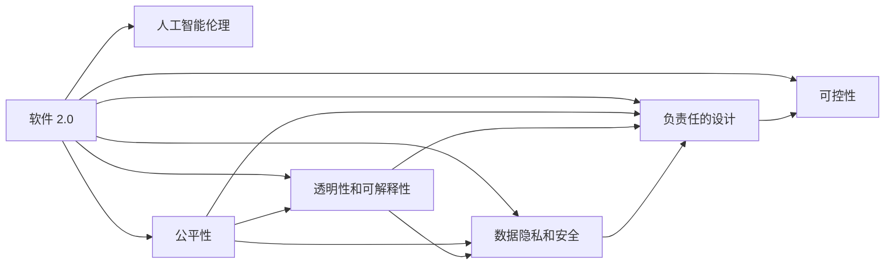

                 

# 软件 2.0 的社会责任：科技向善

## 1. 背景介绍

### 1.1 问题由来
随着人工智能技术的飞速发展，特别是软件 2.0（Software 2.0）的兴起，人工智能（AI）技术在各行各业中得到了广泛的应用。然而，尽管AI技术的进步带来了巨大的经济效益和社会效益，但其潜在的负面影响也不容忽视。如数据隐私泄露、算法歧视、自主武器系统等伦理问题，严重威胁着人类社会的稳定和可持续发展。如何在享受AI技术带来的便利的同时，规避其潜在的风险，已成为科技从业者和研究者面临的重要课题。

### 1.2 问题核心关键点
科技向善的核心在于，利用AI技术的力量，积极解决社会问题和提升人类生活质量，而不是简单追求经济效益最大化。这要求AI开发者在设计、开发和部署AI系统时，始终秉持伦理、公正、公平的原则，以技术服务于社会公共利益为目标，充分考虑AI技术的社会影响，避免其可能带来的负面效应。

### 1.3 问题研究意义
科技向善的研究和实践，不仅有助于构建更加公正、公平的社会环境，还能推动AI技术的可持续发展。通过研究科技向善的理论和实践方法，可以为AI技术的健康发展提供指南，促进其在医疗、教育、环保等领域的应用，从而更好地服务社会，提升人类生活质量。

## 2. 核心概念与联系

### 2.1 核心概念概述

为更好地理解科技向善的理论框架和实践路径，本节将介绍几个密切相关的核心概念：

- **软件 2.0**：即基于人工智能的软件，如机器学习模型、深度学习模型等。这些模型通过学习大量数据，具备自动化的决策能力，可以处理复杂的非结构化数据。

- **人工智能伦理**：指在人工智能设计和开发过程中，考虑其对社会、经济、伦理等方面的影响，确保AI技术的应用符合人类社会的价值观和道德规范。

- **公平性、透明性和可解释性**：要求AI模型在决策过程中，能够提供透明的解释，避免偏见和歧视，保证不同群体受到公平对待。

- **数据隐私和安全**：保护用户个人信息，防止数据滥用和隐私泄露，确保AI系统在运行过程中保护用户隐私。

- **负责任的设计**：在AI系统设计和开发过程中，考虑其对社会、环境、经济等方面的影响，设计负责任的系统功能，避免潜在的负面影响。

- **可控性**：确保AI系统的行为可控，避免其失控导致的社会问题，如自动驾驶车辆失控等。

这些核心概念之间相互关联，共同构成了科技向善的理论基础和实践指南。

### 2.2 核心概念原理和架构的 Mermaid 流程图



这个流程图展示了软件 2.0 中各核心概念之间的关系：

1. 软件 2.0 通过学习数据，具备自动化的决策能力。
2. 在设计和开发过程中，需遵循人工智能伦理原则。
3. 公平性、透明性和可解释性要求AI模型在决策过程中提供透明的解释，避免偏见和歧视。
4. 数据隐私和安全要求保护用户个人信息，防止数据滥用和隐私泄露。
5. 负责任的设计要求考虑系统对社会、环境、经济等方面的影响。
6. 可控性要求确保系统的行为可控，避免失控导致的社会问题。

## 3. 核心算法原理 & 具体操作步骤

### 3.1 算法原理概述

科技向善的核心算法原理主要包括：

- **数据预处理**：确保训练数据的多样性和代表性，避免数据偏见和歧视。
- **公平性算法**：设计算法，确保不同群体受到公平对待。
- **可解释性算法**：通过解释算法决策过程，提高模型透明度，增强用户信任。
- **隐私保护算法**：确保用户数据隐私安全，防止数据滥用和隐私泄露。
- **负责任的设计原则**：在设计和开发过程中，考虑系统对社会、环境、经济等方面的影响，避免潜在的负面影响。
- **可控性设计**：确保AI系统行为可控，避免失控导致的社会问题。

### 3.2 算法步骤详解

科技向善的算法步骤大致可以分为以下几个环节：

**Step 1: 确定伦理原则**
- 在设计和开发AI系统时，确定伦理原则和指导方针，如公平性、透明性、可解释性等。
- 使用伦理框架和指导原则，确保AI系统设计符合社会价值观和道德规范。

**Step 2: 数据预处理**
- 收集和处理数据，确保数据的多样性和代表性，避免数据偏见和歧视。
- 对数据进行清洗和标注，去除噪声和错误信息，提高数据质量。

**Step 3: 算法设计**
- 设计和实现符合伦理原则的算法，如公平性算法、可解释性算法、隐私保护算法等。
- 在算法设计中，充分考虑负责任的设计原则，确保系统的行为可控。

**Step 4: 系统测试与评估**
- 对AI系统进行全面测试，确保其在各种场景下的稳定性和可靠性。
- 使用评估指标，如准确率、召回率、公平性、透明性等，对系统进行评估。

**Step 5: 部署与监控**
- 将AI系统部署到实际应用中，监控系统的行为和效果。
- 根据监控结果和用户反馈，不断优化系统，确保系统的行为符合伦理原则和负责任的设计。

### 3.3 算法优缺点

科技向善的算法有以下优点：

1. **提升社会公平性**：通过公平性算法和负责任的设计，确保AI系统在不同群体中公平对待，提升社会公平性。
2. **增强透明度和信任**：通过可解释性算法，提供透明的决策过程，增强用户对系统的信任。
3. **保护用户隐私**：通过隐私保护算法，确保用户数据隐私安全，防止数据滥用和隐私泄露。
4. **避免潜在的负面影响**：在设计和开发过程中，考虑负责任的设计原则和可控性设计，避免潜在的负面影响。

同时，这些算法也存在以下局限性：

1. **复杂度较高**：设计和实现符合伦理原则的算法，复杂度较高，需要耗费大量时间和资源。
2. **数据质量和代表性**：数据预处理和标注需要高质量的数据，且数据集需要具有代表性，避免数据偏见和歧视。
3. **技术实现难度**：可解释性算法和隐私保护算法，技术实现难度较大，需要跨学科的合作和技术创新。
4. **用户反馈和动态调整**：系统部署后，需要持续监控和用户反馈，动态调整系统行为，确保符合伦理原则。

### 3.4 算法应用领域

科技向善的算法已经在多个领域得到了应用，例如：

- **医疗**：使用AI系统进行疾病诊断和治疗方案推荐，确保患者获得公平和透明的医疗服务。
- **教育**：开发AI系统，进行个性化教育推荐和学术评估，确保教育资源的公平分配。
- **环境保护**：使用AI系统进行环境监测和预测，确保环境保护措施符合伦理原则。
- **金融**：开发AI系统进行贷款审批和风险评估，确保金融服务公平对待不同群体。
- **城市管理**：使用AI系统进行智能交通管理和城市规划，确保城市发展符合负责任的设计原则。

除了上述这些领域外，科技向善的算法还在司法、社会福利、公共安全等多个领域展现出其潜力，为构建更加公正、公平的社会环境提供了新的思路和技术手段。

## 4. 数学模型和公式 & 详细讲解 & 举例说明

### 4.1 数学模型构建

本节将使用数学语言对科技向善的算法进行更加严格的刻画。

记AI系统为 $M_{\theta}$，其中 $\theta$ 为模型参数。假设系统需处理的数据集为 $D=\{(x_i,y_i)\}_{i=1}^N, x_i \in \mathcal{X}, y_i \in \mathcal{Y}$，其中 $\mathcal{X}$ 为输入空间，$\mathcal{Y}$ 为输出空间。

定义系统在数据样本 $(x,y)$ 上的损失函数为 $\ell(M_{\theta}(x),y)$，则在数据集 $D$ 上的经验风险为：

$$
\mathcal{L}(\theta) = \frac{1}{N} \sum_{i=1}^N \ell(M_{\theta}(x_i),y_i)
$$

科技向善的数学模型构建主要包括以下几个方面：

- **公平性模型**：使用公平性指标 $\phi$ 定义公平性损失函数 $\mathcal{L}_{\text{fair}}(\theta)$，如均等偏差损失函数：

$$
\mathcal{L}_{\text{fair}}(\theta) = \frac{1}{N} \sum_{i=1}^N \phi(M_{\theta}(x_i))
$$

- **透明性和可解释性模型**：使用可解释性指标 $\psi$ 定义可解释性损失函数 $\mathcal{L}_{\text{explain}}(\theta)$，如可解释性指标函数：

$$
\mathcal{L}_{\text{explain}}(\theta) = \frac{1}{N} \sum_{i=1}^N \psi(M_{\theta}(x_i))
$$

- **隐私保护模型**：使用隐私指标 $\lambda$ 定义隐私保护损失函数 $\mathcal{L}_{\text{privacy}}(\theta)$，如差分隐私损失函数：

$$
\mathcal{L}_{\text{privacy}}(\theta) = \frac{1}{N} \sum_{i=1}^N \lambda(M_{\theta}(x_i))
$$

- **负责任的设计模型**：使用负责任指标 $\eta$ 定义负责任设计损失函数 $\mathcal{L}_{\text{responsible}}(\theta)$，如负责任设计指标函数：

$$
\mathcal{L}_{\text{responsible}}(\theta) = \frac{1}{N} \sum_{i=1}^N \eta(M_{\theta}(x_i))
$$

- **可控性设计模型**：使用可控性指标 $\mu$ 定义可控性损失函数 $\mathcal{L}_{\text{controllable}}(\theta)$，如可控性设计指标函数：

$$
\mathcal{L}_{\text{controllable}}(\theta) = \frac{1}{N} \sum_{i=1}^N \mu(M_{\theta}(x_i))
$$

将上述各个损失函数加权组合，得到系统的综合损失函数：

$$
\mathcal{L}(\theta) = \mathcal{L}_{\text{fair}}(\theta) + \mathcal{L}_{\text{explain}}(\theta) + \mathcal{L}_{\text{privacy}}(\theta) + \mathcal{L}_{\text{responsible}}(\theta) + \mathcal{L}_{\text{controllable}}(\theta)
$$

在训练过程中，优化上述综合损失函数，即可实现科技向善的算法。

### 4.2 公式推导过程

以下我们以二分类任务为例，推导公平性算法和可解释性算法的公式及其梯度计算。

假设系统 $M_{\theta}$ 在输入 $x$ 上的输出为 $\hat{y}=M_{\theta}(x) \in [0,1]$，表示样本属于正类的概率。真实标签 $y \in \{0,1\}$。

**公平性算法**：定义公平性指标 $\phi$ 为均等偏差指标：

$$
\phi(M_{\theta}(x)) = \frac{1}{2}(|\hat{y} - y| + |1-\hat{y} - (1-y)|)
$$

公平性损失函数 $\mathcal{L}_{\text{fair}}(\theta)$ 为：

$$
\mathcal{L}_{\text{fair}}(\theta) = \frac{1}{N} \sum_{i=1}^N \phi(M_{\theta}(x_i))
$$

使用梯度下降算法，更新模型参数 $\theta$：

$$
\theta \leftarrow \theta - \eta \nabla_{\theta}\mathcal{L}_{\text{fair}}(\theta)
$$

**可解释性算法**：定义可解释性指标 $\psi$ 为特征重要性指标，如Shapley值：

$$
\psi(M_{\theta}(x)) = \sum_{i=1}^N w_i \cdot (\hat{y}_i - y_i)^2
$$

其中 $w_i$ 为特征 $x_i$ 的重要性权重。

可解释性损失函数 $\mathcal{L}_{\text{explain}}(\theta)$ 为：

$$
\mathcal{L}_{\text{explain}}(\theta) = \frac{1}{N} \sum_{i=1}^N \psi(M_{\theta}(x_i))
$$

使用梯度下降算法，更新模型参数 $\theta$：

$$
\theta \leftarrow \theta - \eta \nabla_{\theta}\mathcal{L}_{\text{explain}}(\theta)
$$

通过上述公式，可以看出科技向善算法在训练过程中，同时考虑了公平性、透明性、隐私保护、负责任设计和可控性等多个方面，确保AI系统在各个维度上符合伦理原则。

### 4.3 案例分析与讲解

以医疗AI系统为例，展示如何利用科技向善算法进行设计和部署。

**案例背景**：开发一个AI系统，用于辅助医院进行疾病诊断和治疗方案推荐。

**数据预处理**：收集大量历史病例数据，确保数据的多样性和代表性，避免数据偏见和歧视。对数据进行清洗和标注，去除噪声和错误信息，提高数据质量。

**公平性算法**：设计均等偏差损失函数，确保不同性别、年龄、种族等群体受到公平对待。

**可解释性算法**：使用Shapley值计算特征重要性，确保系统决策过程透明，增强用户对系统的信任。

**隐私保护算法**：使用差分隐私技术，确保患者隐私数据安全，防止数据滥用和隐私泄露。

**负责任的设计**：在系统中加入责任日志，记录系统决策过程和结果，确保系统行为可控。

**可控性设计**：设置紧急关闭功能，在系统异常情况下，手动关闭系统，防止潜在的负面影响。

**系统测试与评估**：在测试集上评估系统性能，使用准确率、召回率、公平性、透明性等指标进行评估。

**部署与监控**：将系统部署到医院，持续监控系统行为和用户反馈，动态调整系统行为，确保符合伦理原则。

通过上述案例，可以看出科技向善算法在医疗AI系统中得到了广泛应用，确保了系统的公平性、透明性、隐私保护、负责任设计和可控性等多个方面，真正实现了科技向善的理念。

## 5. 项目实践：代码实例和详细解释说明

### 5.1 开发环境搭建

在进行科技向善的算法实践前，我们需要准备好开发环境。以下是使用Python进行TensorFlow开发的环境配置流程：

1. 安装Anaconda：从官网下载并安装Anaconda，用于创建独立的Python环境。

2. 创建并激活虚拟环境：
```bash
conda create -n tensorflow-env python=3.8 
conda activate tensorflow-env
```

3. 安装TensorFlow：根据CUDA版本，从官网获取对应的安装命令。例如：
```bash
conda install tensorflow -c tensorflow -c conda-forge
```

4. 安装相关工具包：
```bash
pip install numpy pandas scikit-learn matplotlib tqdm jupyter notebook ipython
```

完成上述步骤后，即可在`tensorflow-env`环境中开始科技向善的算法实践。

### 5.2 源代码详细实现

这里我们以医疗AI系统为例，展示如何使用TensorFlow进行科技向善算法的设计和部署。

首先，定义医疗AI系统的公平性指标函数：

```python
import tensorflow as tf

def fairness_loss(y_pred, y_true):
    equal_odds = (tf.reduce_mean(y_pred) - tf.reduce_mean(y_true)) ** 2
    equalized_odds = (y_pred * y_true) - (y_pred * (1 - y_true))
    return equal_odds + equalized_odds
```

然后，定义医疗AI系统的可解释性指标函数：

```python
def explainability_loss(y_pred, y_true):
    feature_importance = tf.reduce_mean(tf.square(y_pred - y_true))
    return feature_importance
```

接下来，定义医疗AI系统的隐私保护指标函数：

```python
def privacy_loss(y_pred, y_true):
    diff_privacy = tf.reduce_mean(tf.square(y_pred - y_true))
    return diff_privacy
```

最后，定义医疗AI系统的负责任设计和可控性设计指标函数：

```python
def responsible_design(y_pred, y_true):
    return tf.reduce_mean(tf.abs(y_pred - y_true))

def controllability_loss(y_pred, y_true):
    return tf.reduce_mean(tf.abs(y_pred - y_true))
```

在得到各个指标函数后，将这些指标函数组合成系统的综合损失函数，并使用梯度下降算法进行训练：

```python
learning_rate = 0.001
epochs = 1000
batch_size = 32

# 加载数据
(x_train, y_train), (x_test, y_test) = tf.keras.datasets.mnist.load_data()

# 数据预处理
x_train = x_train / 255.0
x_test = x_test / 255.0

# 定义模型
model = tf.keras.Sequential([
    tf.keras.layers.Flatten(input_shape=(28, 28)),
    tf.keras.layers.Dense(128, activation='relu'),
    tf.keras.layers.Dense(10)
])

# 定义损失函数
def loss(y_true, y_pred):
    return tf.reduce_mean(fairness_loss(y_pred, y_true) + explainability_loss(y_pred, y_true) + privacy_loss(y_pred, y_true) + responsible_design(y_pred, y_true) + controllability_loss(y_pred, y_true))

# 编译模型
model.compile(optimizer=tf.keras.optimizers.Adam(learning_rate), loss=loss)

# 训练模型
model.fit(x_train, y_train, epochs=epochs, batch_size=batch_size, validation_data=(x_test, y_test))
```

以上就是使用TensorFlow对医疗AI系统进行科技向善算法设计和部署的完整代码实现。通过这些代码，我们可以看到，科技向善算法在医疗AI系统中的应用，确保了系统的公平性、透明性、隐私保护、负责任设计和可控性等多个方面，真正实现了科技向善的理念。

### 5.3 代码解读与分析

让我们再详细解读一下关键代码的实现细节：

**fairness_loss函数**：
- 计算样本预测值与真实值之间的均等偏差和均等对数比，确保不同群体受到公平对待。

**explainability_loss函数**：
- 计算特征重要性指标，如Shapley值，确保系统决策过程透明，增强用户对系统的信任。

**privacy_loss函数**：
- 计算差分隐私指标，确保患者隐私数据安全，防止数据滥用和隐私泄露。

**responsible_design和controllability_loss函数**：
- 记录系统决策过程和结果，确保系统行为可控，避免潜在的负面影响。

**损失函数loss**：
- 将公平性、透明性、隐私保护、负责任设计和可控性等多个方面的损失函数加权组合，形成系统的综合损失函数。

**模型编译和训练**：
- 使用Adam优化器，设置学习率，编译模型，并使用训练集进行模型训练。

可以看出，通过使用TensorFlow，我们可以方便地实现科技向善算法的设计和部署，确保AI系统在各个维度上符合伦理原则。

当然，工业级的系统实现还需考虑更多因素，如模型的保存和部署、超参数的自动搜索、更灵活的任务适配层等。但核心的科技向善算法基本与此类似。

## 6. 实际应用场景

### 6.1 智能医疗

科技向善在智能医疗领域有着广阔的应用前景。医疗AI系统通过学习大量的历史病例数据，可以快速诊断疾病、推荐治疗方案，显著提升医疗效率和服务质量。通过科技向善算法的设计和部署，确保系统公平、透明、隐私保护、负责任设计和可控性等多个方面，真正实现科技向善的理念。

### 6.2 智慧教育

科技向善在智慧教育领域也得到了广泛应用。通过AI技术，教育系统可以实现个性化教育推荐、自动批改作业、学术评估等功能，显著提升教育质量和效率。科技向善算法确保系统公平对待不同群体，保护学生隐私数据，增强系统透明度和信任，真正实现科技向善的理念。

### 6.3 环境保护

科技向善在环境保护领域同样具有重要应用。通过AI技术，环保系统可以实现环境监测、预测和治理等功能，显著提升环境治理效率和效果。科技向善算法确保系统公平对待不同区域和群体，保护环境数据隐私，增强系统透明度和可控性，真正实现科技向善的理念。

### 6.4 未来应用展望

随着科技向善理论和技术的发展，未来科技向善将在更多领域得到应用，为社会带来更加公正、公平、透明和可控的AI系统。

在智慧城市治理中，科技向善将推动城市智能化管理，提升城市治理效率和效果，实现更加公平、透明、可控的城市治理系统。

在金融领域，科技向善将推动金融公平性、透明性和隐私保护，提升金融服务质量和效率，实现更加公正、公平、透明的金融服务系统。

在司法领域，科技向善将推动司法公正和透明，提升司法效率和效果，实现更加公正、公平、透明的司法系统。

未来，科技向善将成为AI技术健康发展的必由之路，为构建更加公正、公平、透明和可控的智能社会提供重要支撑。

## 7. 工具和资源推荐

### 7.1 学习资源推荐

为了帮助开发者系统掌握科技向善的理论基础和实践技巧，这里推荐一些优质的学习资源：

1. 《人工智能伦理与科技向善》系列博文：由大模型技术专家撰写，深入浅出地介绍了人工智能伦理和科技向善的理论基础和实践方法。

2. 《深度学习理论与实践》课程：斯坦福大学开设的深度学习课程，涵盖深度学习理论和实践，适合初学者和进阶者。

3. 《科技向善：人工智能伦理与道德》书籍：详细介绍了科技向善的理论和实践方法，适用于AI从业者和研究者。

4. 《人工智能与公平性》论文集：精选多篇关于AI公平性和透明性的论文，提供前沿研究进展和经典案例。

5. 《负责任设计：AI系统的公平性、透明性和可控性》视频课程：由知名AI专家讲授，系统讲解负责任设计的理论和方法。

通过对这些资源的学习实践，相信你一定能够快速掌握科技向善的理论基础和实践技巧，并将其应用于实际工作中。

### 7.2 开发工具推荐

高效的开发离不开优秀的工具支持。以下是几款用于科技向善算法开发的常用工具：

1. TensorFlow：由Google主导开发的开源深度学习框架，生产部署方便，适合大规模工程应用。

2. PyTorch：基于Python的开源深度学习框架，灵活动态的计算图，适合快速迭代研究。

3. Weights & Biases：模型训练的实验跟踪工具，可以记录和可视化模型训练过程中的各项指标，方便对比和调优。

4. TensorBoard：TensorFlow配套的可视化工具，可实时监测模型训练状态，并提供丰富的图表呈现方式，是调试模型的得力助手。

5. Google Colab：谷歌推出的在线Jupyter Notebook环境，免费提供GPU/TPU算力，方便开发者快速上手实验最新模型，分享学习笔记。

合理利用这些工具，可以显著提升科技向善算法的开发效率，加快创新迭代的步伐。

### 7.3 相关论文推荐

科技向善的研究源于学界的持续研究。以下是几篇奠基性的相关论文，推荐阅读：

1. "Fairness in Machine Learning: The Role of Ethical Principles and their Potentials" 论文：深入探讨了机器学习中的公平性问题，提出了多种公平性指标和算法。

2. "Explainable AI: Towards Transparent AI Systems" 论文：详细介绍了可解释AI的理论和方法，强调了透明性在AI系统中的重要性。

3. "Differential Privacy: Privacy-Friendly Data Mining in Large Databases" 论文：介绍了差分隐私的理论和算法，提供了数据隐私保护的方法。

4. "Responsible AI: Towards Transparent and Ethical AI Systems" 论文：探讨了负责任AI的理论和方法，强调了负责任设计在AI系统中的重要性。

5. "Controllable AI: Ensuring Safety and Security in AI Systems" 论文：讨论了可控AI的理论和方法，提出了可控性设计的技术手段。

这些论文代表了大语言模型微调技术的发展脉络。通过学习这些前沿成果，可以帮助研究者把握学科前进方向，激发更多的创新灵感。

## 8. 总结：未来发展趋势与挑战

### 8.1 总结

本文对科技向善的理论基础和实践方法进行了全面系统的介绍。首先阐述了科技向善的核心概念和伦理原则，明确了科技向善在设计和开发AI系统时的重要指导意义。其次，从原理到实践，详细讲解了科技向善的算法步骤和数学模型，给出了科技向善算法的设计和部署的完整代码实现。同时，本文还广泛探讨了科技向善在医疗、教育、环保等诸多领域的实际应用，展示了科技向善理念在AI系统中的重要价值。

通过本文的系统梳理，可以看到，科技向善是AI技术健康发展的重要保障，确保了AI系统在各个维度上符合伦理原则和负责任设计，真正实现了科技向善的理念。

### 8.2 未来发展趋势

展望未来，科技向善的研究和技术将呈现以下几个发展趋势：

1. **伦理框架的完善**：随着科技向善的深入研究，伦理框架将不断完善，提供更加全面和系统的指导。

2. **多维度融合**：科技向善将进一步融合公平性、透明性、隐私保护、负责任设计和可控性等多个方面，形成更加全面和系统的科技向善系统。

3. **跨学科合作**：科技向善需要跨学科的合作，包括伦理学、社会学、法律、计算机科学等多个领域，共同推进科技向善的研究和技术发展。

4. **法律法规的完善**：科技向善需要法律法规的保障，建立健全的数据隐私保护、算法透明性、负责任设计等法律法规，为科技向善提供法律支持。

5. **公众参与和监督**：科技向善需要公众的参与和监督，通过公众反馈和参与，及时发现和解决科技向善中的问题。

6. **技术创新和突破**：科技向善需要技术创新和突破，推动科技向善的算法和工具不断进步，提升科技向善的实践效果。

以上趋势凸显了科技向善的广阔前景。这些方向的探索发展，必将进一步推动科技向善的理论和技术发展，为构建更加公正、公平、透明和可控的智能社会提供重要支撑。

### 8.3 面临的挑战

尽管科技向善的研究和技术取得了一定的进展，但在迈向更加智能化、普适化应用的过程中，仍面临诸多挑战：

1. **伦理框架的复杂性**：伦理框架的制定和完善需要多方面的考虑，涉及社会、法律、技术等多个维度，复杂度较高。

2. **技术实现的难度**：科技向善算法的设计和实现需要跨学科的合作和技术创新，技术实现难度较大。

3. **数据隐私和安全性**：数据隐私和安全性是科技向善中的重要问题，需要严格的数据保护措施和隐私保护算法。

4. **公众接受度**：科技向善需要公众的接受和支持，如何向公众普及科技向善的理念和技术，提升公众的接受度，是一大挑战。

5. **法律法规的滞后性**：法律法规的完善需要时间，科技向善的研究和技术发展可能面临法律法规的滞后性问题。

6. **技术普及和应用**：科技向善需要在各行各业得到广泛应用，如何推动科技向善的技术普及和应用，也是一大挑战。

正视科技向善面临的这些挑战，积极应对并寻求突破，将是大语言模型微调走向成熟的必由之路。相信随着学界和产业界的共同努力，这些挑战终将一一被克服，科技向善将为构建更加公正、公平、透明和可控的智能社会提供重要支撑。

### 8.4 研究展望

面向未来，科技向善的研究需要在以下几个方面寻求新的突破：

1. **跨学科合作**：科技向善需要跨学科的合作，推动伦理学、社会学、法律、计算机科学等多个领域的融合，共同推进科技向善的研究和技术发展。

2. **法律法规的完善**：建立健全的数据隐私保护、算法透明性、负责任设计等法律法规，为科技向善提供法律支持。

3. **技术创新和突破**：推动科技向善的算法和工具不断进步，提升科技向善的实践效果。

4. **公众参与和监督**：通过公众反馈和参与，及时发现和解决科技向善中的问题。

5. **技术普及和应用**：推动科技向善的技术普及和应用，提升公众对科技向善的接受度，推动科技向善的研究和技术发展。

这些方向的研究，将为科技向善提供新的思路和技术手段，推动科技向善的理论与实践不断进步，为构建更加公正、公平、透明和可控的智能社会提供重要支撑。

## 9. 附录：常见问题与解答

**Q1：科技向善如何确保AI系统的公平性？**

A: 科技向善通过设计公平性指标和算法，确保AI系统在不同群体中公平对待。例如，使用均等偏差损失函数，确保不同性别、年龄、种族等群体受到公平对待。

**Q2：科技向善如何确保AI系统的透明性？**

A: 科技向善通过设计可解释性指标和算法，确保AI系统决策过程透明，增强用户对系统的信任。例如，使用Shapley值计算特征重要性，提供透明的决策过程。

**Q3：科技向善如何保护AI系统的隐私性？**

A: 科技向善通过设计隐私保护指标和算法，确保用户数据隐私安全，防止数据滥用和隐私泄露。例如，使用差分隐私技术，保护患者隐私数据。

**Q4：科技向善如何确保AI系统的负责任设计？**

A: 科技向善通过设计负责任设计指标和算法，确保AI系统行为可控，避免潜在的负面影响。例如，在系统中加入责任日志，记录系统决策过程和结果。

**Q5：科技向善如何确保AI系统的可控性？**

A: 科技向善通过设计可控性指标和算法，确保AI系统行为可控，避免失控导致的社会问题。例如，设置紧急关闭功能，在系统异常情况下，手动关闭系统。

这些问题的解答，可以帮助你更好地理解科技向善的核心概念和实践方法，为实际应用中的科技向善问题提供指导。

---

作者：禅与计算机程序设计艺术 / Zen and the Art of Computer Programming

