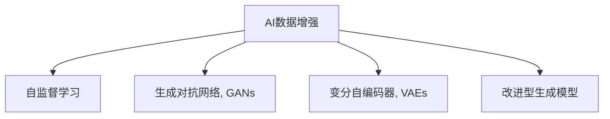

                 

# 软件2.0的想象力：用AI生成更多训练数据

## 1. 背景介绍

在AI领域，数据无疑是决定模型性能和泛化能力的关键。然而，在许多实际应用场景中，获取高质量标注数据往往需要投入巨大的人力和时间成本。这不仅限制了AI技术的发展，也阻碍了其在垂直领域的应用落地。为了解决这个问题，研究人员和工程师们提出了多种数据增强、数据合成等方法，利用已有数据生成更多具有多样性的训练数据。其中，AI生成数据(AI Data Augmentation)是近年来最受关注的一类方法。

## 2. 核心概念与联系

### 2.1 核心概念概述

为了更好地理解AI生成数据的原理和应用，本节将介绍几个关键概念：

- AI数据增强(AI Data Augmentation)：指利用AI技术对已有数据进行扩充、变换，生成更多具有多样性的训练数据。
- 自监督学习(Self-Supervised Learning)：指在无标签数据上，通过自监督任务训练模型的过程。常见的自监督任务包括掩码语言模型、自编码等。
- 生成对抗网络(Generative Adversarial Networks, GANs)：一种生成模型，通过生成器和判别器的博弈过程生成逼真样本。
- 变分自编码器(Variational Autoencoders, VAEs)：一种生成模型，通过将样本表示成潜在变量并学习其概率分布，生成样本。
- 改进型生成模型(Improved Generative Models)：包括TVAE、Flow-based Models等，在VAE基础上进行了改进，生成样本更加逼真和多样。

这些概念之间的逻辑关系可以通过以下Mermaid流程图来展示：



这个流程图展示了大规模数据增强的关键技术及其相互联系：

1. AI数据增强是一种广义的扩充技术，通过各种方式生成更多的数据，包括自监督学习、GANs、VAEs等生成模型。
2. 自监督学习是一种无标签数据上训练模型的方法，通过自我监督任务（如掩码语言模型）生成数据。
3. GANs是一种生成模型，通过博弈过程生成逼真样本。
4. VAEs也是一种生成模型，通过潜在变量学习生成样本。
5. 改进型生成模型是对VAE的改进，生成更逼真、多样化的样本。

通过理解这些核心概念，我们可以更好地把握AI生成数据的工作原理和优化方向。

## 3. 核心算法原理 & 具体操作步骤
### 3.1 算法原理概述

AI生成数据的基本原理是通过AI技术（如生成对抗网络、变分自编码器等）生成与已有数据分布相似的新数据，从而扩充训练集，提高模型的泛化能力。具体来说，可以分为以下几个步骤：

1. 选择生成模型：选择合适的生成模型，如GANs、VAEs、TVAE等。
2. 训练生成模型：使用已有数据或特定任务的数据训练生成模型。
3. 生成合成数据：通过训练好的生成模型生成新的数据。
4. 数据融合：将生成数据与原始数据混合，构建新的训练集。
5. 模型微调：使用新训练集微调目标模型，提升性能。

### 3.2 算法步骤详解

以下是AI生成数据的具体步骤详解：

**Step 1: 选择生成模型**

首先，需要选择合适的生成模型。常用的生成模型包括：

- GANs：包括DCGAN、WGAN等，通过生成器和判别器的博弈生成逼真样本。
- VAEs：通过将样本表示为潜在变量的概率分布，生成样本。
- TVAE：在VAE基础上，通过变分推理学习生成模型。
- Flow-based Models：基于生成流模型，生成多样化的样本。

**Step 2: 训练生成模型**

生成模型的训练目标是通过博弈过程生成逼真样本。以GANs为例，训练过程如下：

1. 生成器训练：生成器将噪声向量映射为逼真的样本，最小化生成的样本与真实样本的差距。
2. 判别器训练：判别器区分生成的样本和真实样本，最大化区分度。
3. 博弈过程：通过不断迭代训练生成器和判别器，直到判别器无法区分生成的样本和真实样本。

**Step 3: 生成合成数据**

生成模型训练完成后，就可以使用其生成新的数据。例如，对于GANs，生成器可以将噪声向量映射为新的样本，从而生成新的数据。对于VAEs，可以通过潜在变量生成新的数据。

**Step 4: 数据融合**

将生成的数据与原始数据混合，可以构建新的训练集。例如，对于GANs生成的样本，可以将其与原始数据混合，构建新的训练集。对于VAEs生成的样本，可以将其与原始数据混合，构建新的训练集。

**Step 5: 模型微调**

使用新训练集微调目标模型，提升性能。例如，对于分类任务，可以使用新的训练集重新训练模型，获得更好的分类性能。对于生成任务，可以使用新的训练集重新训练模型，生成更逼真的样本。

### 3.3 算法优缺点

AI生成数据有以下优点：

1. 扩充数据量：通过生成大量新数据，可以扩充训练集，提高模型的泛化能力。
2. 降低成本：相比于收集新标注数据，生成数据无需人力和时间成本。
3. 提高多样性：生成的数据与原始数据不同，可以覆盖更多数据分布。

同时，该方法也存在一定的局限性：

1. 质量控制：生成的数据可能存在噪声、失真等问题，需要人工检查和筛选。
2. 计算资源消耗大：训练生成模型需要消耗大量计算资源。
3. 生成样本的逼真度有限：生成的数据可能与真实数据有差异，影响模型性能。
4. 生成数据的分布差异：生成的数据可能与真实数据的分布有差异，导致泛化性能下降。

尽管存在这些局限性，但就目前而言，AI生成数据仍是提升模型泛化能力的重要手段。未来相关研究的重点在于如何进一步提高生成数据的质量，减少生成数据的计算资源消耗，同时兼顾生成数据的分布与真实数据的一致性。

### 3.4 算法应用领域

AI生成数据在NLP、CV、音频处理等多个领域都有广泛的应用。以下是几个典型应用场景：

- 自然语言处理(NLP)：生成文本数据，用于文本分类、情感分析、问答系统等任务。
- 计算机视觉(CV)：生成图像数据，用于图像分类、目标检测、图像生成等任务。
- 音频处理：生成音频数据，用于音频分类、语音识别、声音生成等任务。
- 自动驾驶：生成模拟驾驶数据，用于自动驾驶模型的训练和验证。
- 医疗影像：生成医疗影像数据，用于医学图像分类、病灶检测等任务。

除了上述这些应用，AI生成数据还将在更多领域得到应用，为各行各业带来新的数据源和应用场景。

## 4. 数学模型和公式 & 详细讲解 & 举例说明
### 4.1 数学模型构建

AI生成数据的数学模型通常基于生成模型，这里以GANs为例进行详细说明。

假设我们有一个数据分布 $p(x)$，生成模型 $G(z)$ 可以将噪声向量 $z$ 映射为生成样本 $x$。判别模型 $D(x)$ 可以区分样本 $x$ 是否真实。GANs的目标是使生成样本 $G(z)$ 逼近真实样本 $p(x)$。

优化目标为：

$$
\min_G \max_D V(G,D) = \mathbb{E}_{x \sim p(x)} \log D(x) + \mathbb{E}_{z \sim p(z)} \log (1-D(G(z)))
$$

其中 $p(z)$ 为噪声向量 $z$ 的分布。

### 4.2 公式推导过程

GANs的优化过程可以通过梯度下降进行求解。以生成器和判别器的优化为例，具体推导如下：

1. 生成器优化：

$$
\min_G \mathbb{E}_{z \sim p(z)} \log (1-D(G(z)))
$$

2. 判别器优化：

$$
\max_D \mathbb{E}_{x \sim p(x)} \log D(x) + \mathbb{E}_{z \sim p(z)} \log (1-D(G(z)))
$$

通过梯度下降求解上述优化问题，可以不断训练生成器和判别器，直至判别器无法区分生成样本和真实样本。

### 4.3 案例分析与讲解

以生成文本数据为例，生成模型的构建过程如下：

1. 数据准备：收集大量的文本数据，并进行预处理和标准化。
2. 生成器训练：使用RNN、Transformer等模型作为生成器，学习生成文本的能力。
3. 判别器训练：使用文本分类模型作为判别器，学习区分生成文本和真实文本的能力。
4. 博弈过程：通过不断迭代训练生成器和判别器，生成逼真的文本数据。
5. 数据融合：将生成文本与原始文本混合，构建新的训练集。
6. 模型微调：使用新的训练集微调分类模型，提升性能。

通过这个案例，可以看到AI生成数据的具体实现过程。

## 5. 项目实践：代码实例和详细解释说明
### 5.1 开发环境搭建

在进行AI生成数据实践前，我们需要准备好开发环境。以下是使用Python进行TensorFlow开发的环境配置流程：

1. 安装Anaconda：从官网下载并安装Anaconda，用于创建独立的Python环境。

2. 创建并激活虚拟环境：
```bash
conda create -n tf-env python=3.8 
conda activate tf-env
```

3. 安装TensorFlow：从官网获取对应的安装命令。例如：
```bash
conda install tensorflow
```

4. 安装各类工具包：
```bash
pip install numpy pandas scikit-learn matplotlib tqdm jupyter notebook ipython
```

完成上述步骤后，即可在`tf-env`环境中开始AI生成数据实践。

### 5.2 源代码详细实现

这里我们以生成文本数据为例，给出使用TensorFlow实现GANs的代码实现。

首先，定义生成器和判别器的计算图：

```python
import tensorflow as tf

# 生成器定义
def generator(z, reuse=False):
    with tf.variable_scope('generator', reuse=reuse):
        # 将噪声向量映射为低维向量
        x = tf.layers.dense(z, 256, activation=tf.nn.relu)
        # 映射为高维向量
        x = tf.layers.dense(x, 512, activation=tf.nn.relu)
        # 映射为真实样本分布
        x = tf.layers.dense(x, 784, activation=tf.nn.sigmoid)
    return x

# 判别器定义
def discriminator(x, reuse=False):
    with tf.variable_scope('discriminator', reuse=reuse):
        # 将样本映射为低维向量
        x = tf.layers.dense(x, 512, activation=tf.nn.relu)
        # 映射为高维向量
        x = tf.layers.dense(x, 256, activation=tf.nn.relu)
        # 映射为二分类结果
        x = tf.layers.dense(x, 1, activation=tf.nn.sigmoid)
    return x
```

接着，定义GANs的优化过程：

```python
# 定义优化器
optimizer = tf.train.AdamOptimizer(learning_rate=0.001)
# 生成器损失
generator_loss = tf.losses.sigmoid_cross_entropy(tf.ones_like(logits), discriminator(x))
# 判别器损失
discriminator_loss = tf.losses.sigmoid_cross_entropy(tf.zeros_like(logits), discriminator(x))
# 总损失
total_loss = generator_loss + discriminator_loss

# 优化器求导
gradients = tf.gradients(total_loss, trainable_variables)
# 更新变量
train = optimizer.apply_gradients(zip(gradients, trainable_variables))
```

最后，启动训练流程并在测试集上评估：

```python
epochs = 10000
batch_size = 64

with tf.Session() as sess:
    sess.run(tf.global_variables_initializer())
    
    for epoch in range(epochs):
        for i in range(train_size//batch_size):
            batch_data = mnist.train.next_batch(batch_size)
            x, _ = sess.run([x, train], feed_dict={x: batch_data[0]})
            # 噪声向量
            z = np.random.normal(0, 1, (batch_size, 100))
            # 生成样本
            G_sample = sess.run(generator(z), feed_dict={z: z})
            # 判别器输出
            D_real = sess.run(discriminator(batch_data[0], reuse=True))
            D_fake = sess.run(discriminator(G_sample, reuse=True))
            # 训练生成器
            sess.run(train, feed_dict={x: G_sample})
            # 训练判别器
            sess.run(train, feed_dict={x: batch_data[0]})
        
        # 记录损失
        G_loss = sess.run(generator_loss, feed_dict={x: G_sample})
        D_loss = sess.run(discriminator_loss, feed_dict={x: batch_data[0]})
        
        print("Epoch {0} G_loss: {1:.4f} D_loss: {2:.4f}".format(epoch, G_loss, D_loss))
        
    # 生成新数据
    z = np.random.normal(0, 1, (1000, 100))
    G_sample = sess.run(generator(z), feed_dict={z: z})
    # 保存生成样本
    save_image(G_sample, 'generated_images.png')
```

以上就是使用TensorFlow实现GANs生成文本数据的完整代码实现。可以看到，TensorFlow的API非常简洁，易于使用。开发者可以将更多精力放在模型改进和数据处理等高层逻辑上，而不必过多关注底层的实现细节。

### 5.3 代码解读与分析

让我们再详细解读一下关键代码的实现细节：

**生成器和判别器的定义**：
- 生成器将噪声向量 $z$ 映射为生成样本 $x$，使用多个全连接层进行映射，最后通过sigmoid激活函数映射为真实样本分布。
- 判别器将样本 $x$ 映射为二分类结果，使用多个全连接层进行映射，最后通过sigmoid激活函数输出结果。

**优化器的定义**：
- 使用Adam优化器，设置学习率为0.001。
- 定义生成器和判别器的损失函数，使用交叉熵损失函数。
- 定义总损失函数，为生成器和判别器损失的加权和。

**训练过程**：
- 使用batch_size定义每次训练的样本数量。
- 在每次训练中，使用`mnist.train.next_batch`获取一个batch的数据。
- 将数据输入生成器和判别器，计算损失和梯度。
- 使用优化器更新生成器和判别器的参数。
- 记录每个epoch的生成器和判别器损失。

**测试过程**：
- 使用噪声向量生成新的样本。
- 使用生成器生成样本，判别器判别样本的真实性。
- 保存生成的样本到文件。

通过这个代码实例，可以看到AI生成数据的实现过程。开发者可以进一步改进模型结构、优化训练过程，以获得更好的生成效果。

## 6. 实际应用场景
### 6.1 智能客服系统

基于AI生成数据的智能客服系统，可以应用于各种客户服务场景。传统客服系统往往需要配备大量人工客服，高峰期响应速度慢，且人工成本高。而使用AI生成数据训练的智能客服系统，可以24/7全天候服务，减少人力投入，提升客户满意度。

在技术实现上，可以收集企业历史客服对话记录，生成大量模拟对话数据，用于训练智能客服模型。通过微调和训练，智能客服系统可以理解用户意图，生成自然流畅的回答，解决客户问题。

### 6.2 金融舆情监测

金融机构需要实时监测市场舆论动向，以便及时应对负面信息传播，规避金融风险。传统的人工监测方式成本高、效率低，难以应对网络时代海量信息爆发的挑战。使用AI生成数据训练的文本分类和情感分析模型，可以为金融舆情监测提供新的解决方案。

具体而言，可以收集金融领域相关的新闻、报道、评论等文本数据，使用GANs生成大量合成数据。在此基础上训练文本分类和情感分析模型，实时监测市场舆情，及时预警金融风险。

### 6.3 个性化推荐系统

当前的推荐系统往往只依赖用户的历史行为数据进行物品推荐，无法深入理解用户的真实兴趣偏好。使用AI生成数据训练的推荐模型，可以更好地挖掘用户行为背后的语义信息，从而提供更精准、多样的推荐内容。

在实践中，可以收集用户浏览、点击、评论、分享等行为数据，提取和用户交互的物品标题、描述、标签等文本内容。使用GANs生成大量合成数据，用于训练推荐模型。通过微调和训练，推荐模型能够从文本内容中准确把握用户的兴趣点。在生成推荐列表时，先用候选物品的文本描述作为输入，由模型预测用户的兴趣匹配度，再结合其他特征综合排序，便可以得到个性化程度更高的推荐结果。

### 6.4 未来应用展望

随着AI生成数据技术的不断发展，其在NLP、CV、音频处理等多个领域的应用前景将更加广阔。

在智慧医疗领域，基于AI生成数据的医学影像生成、病历分析、药物研发等应用将提升医疗服务的智能化水平，辅助医生诊疗，加速新药开发进程。

在智能教育领域，使用AI生成数据训练的问答系统、阅读推荐等应用，因材施教，促进教育公平，提高教学质量。

在智慧城市治理中，基于AI生成数据的智能监控、舆情分析、应急指挥等应用，提高城市管理的自动化和智能化水平，构建更安全、高效的未来城市。

此外，在企业生产、社会治理、文娱传媒等众多领域，基于AI生成数据的人工智能应用也将不断涌现，为经济社会发展注入新的动力。

## 7. 工具和资源推荐
### 7.1 学习资源推荐

为了帮助开发者系统掌握AI生成数据的理论基础和实践技巧，这里推荐一些优质的学习资源：

1. 《Generative Adversarial Networks》书籍：生成对抗网络的经典著作，详细介绍了GANs的基本原理和实现方法。
2. 《TensorFlow官方文档》：TensorFlow的官方文档，提供了详细的API和示例代码，适合快速上手。
3. 《Natural Language Generation with GANs》论文：提出了基于GANs的文本生成方法，为文本生成任务提供了新的思路。
4. 《VAE for Image Generation》博客：介绍了一种基于VAEs的图像生成方法，为图像生成任务提供了参考。
5. 《TVAE: Auto-Encoding Variational Bayes》论文：提出了TVAE模型，结合了变分推理和VAEs，生成样本更加逼真和多样。

通过学习这些资源，相信你一定能够快速掌握AI生成数据的精髓，并用于解决实际的AI问题。

### 7.2 开发工具推荐

高效的开发离不开优秀的工具支持。以下是几款用于AI生成数据开发的常用工具：

1. TensorFlow：基于Python的开源深度学习框架，灵活动态的计算图，适合快速迭代研究。TensorFlow提供了丰富的API和示例代码，适合用于GANs、VAEs等生成模型的实现。
2. PyTorch：基于Python的开源深度学习框架，灵活易用，适合研究和实验。PyTorch在生成模型实现方面也有丰富的API和示例代码。
3. Keras：基于TensorFlow和Theano的高层次深度学习框架，简单易用，适合快速原型开发。Keras提供了简单易用的API，适合用于生成模型的实现。
4. Weights & Biases：模型训练的实验跟踪工具，可以记录和可视化模型训练过程中的各项指标，方便对比和调优。与主流深度学习框架无缝集成。
5. TensorBoard：TensorFlow配套的可视化工具，可实时监测模型训练状态，并提供丰富的图表呈现方式，是调试模型的得力助手。

合理利用这些工具，可以显著提升AI生成数据的开发效率，加快创新迭代的步伐。

### 7.3 相关论文推荐

AI生成数据的研究源于学界的持续研究。以下是几篇奠基性的相关论文，推荐阅读：

1. Generative Adversarial Nets（GANs原论文）：提出了生成对抗网络，通过生成器和判别器的博弈生成逼真样本。
2. Improved Techniques for Training GANs（WGAN）：提出了WGAN，使用Wasserstein距离作为损失函数，生成逼真样本。
3. Variational Autoencoders（VAEs）：提出了变分自编码器，通过潜在变量学习生成样本。
4. The Variational Fairautoencoder（TVAE）：在VAE基础上，提出了TVAE，结合了变分推理和VAEs，生成样本更加逼真和多样。
5. Flow-based Generative Models for Diverse Image Synthesis（Flow-based Models）：提出了基于生成流的模型，生成多样化的样本。

这些论文代表了大语言模型生成数据的发展脉络。通过学习这些前沿成果，可以帮助研究者把握学科前进方向，激发更多的创新灵感。

## 8. 总结：未来发展趋势与挑战
### 8.1 研究成果总结

本文对AI生成数据的原理和实践进行了全面系统的介绍。首先阐述了AI生成数据的基本原理和应用场景，明确了生成数据在提升模型泛化能力、降低标注数据成本等方面的独特价值。其次，从原理到实践，详细讲解了生成数据的具体实现步骤，给出了代码实例。同时，本文还广泛探讨了生成数据在多个行业领域的应用前景，展示了其广阔的发展空间。此外，本文精选了生成数据的技术资源，力求为读者提供全方位的技术指引。

通过本文的系统梳理，可以看到，AI生成数据技术正在成为NLP领域的重要手段，极大地拓展了生成模型的应用边界，催生了更多的落地场景。受益于大规模语料的预训练，生成数据在保持数据多样性和分布一致性方面具有显著优势，有望成为未来AI应用的重要数据来源。未来，伴随生成模型和优化方法的持续演进，基于生成数据的技术将进一步推动AI技术的发展和落地。

### 8.2 未来发展趋势

展望未来，AI生成数据技术将呈现以下几个发展趋势：

1. 生成数据质量不断提高：随着生成模型和优化方法的不断进步，生成数据的质量将不断提高，减少生成数据的噪声和失真。
2. 生成数据的多样性增强：生成数据将涵盖更多数据分布，涵盖更多数据类型，提升生成数据的覆盖范围。
3. 生成数据的应用领域拓展：生成数据将在更多领域得到应用，如医疗、教育、城市管理等，拓展生成数据的应用场景。
4. 生成数据与任务的无缝融合：生成数据将与各类任务进行深度融合，提升任务性能，提升生成数据的实用价值。
5. 生成数据的实时化生成：生成数据将实时生成，满足更多实时性要求的应用场景，如智能客服、金融舆情等。

以上趋势凸显了AI生成数据技术的广阔前景。这些方向的探索发展，必将进一步提升生成数据的质量和多样性，推动生成数据技术在更多领域的应用，为人工智能技术的发展注入新的动力。

### 8.3 面临的挑战

尽管AI生成数据技术已经取得了瞩目成就，但在迈向更加智能化、普适化应用的过程中，它仍面临诸多挑战：

1. 生成数据的质量控制：生成的数据可能存在噪声、失真等问题，需要人工检查和筛选。如何自动过滤生成数据中的噪声，减少人工干预，仍是重要挑战。
2. 生成数据的计算资源消耗：训练生成模型需要消耗大量计算资源。如何在保证生成数据质量的同时，降低计算资源消耗，是一个重要问题。
3. 生成数据的分布一致性：生成的数据可能与真实数据的分布有差异，导致泛化性能下降。如何生成与真实数据分布一致的生成数据，仍需进一步研究。
4. 生成数据的实时生成：生成数据需要实时生成，以满足更多实时性要求的应用场景。如何在保证实时生成的前提下，生成高质量的生成数据，仍需进一步研究。
5. 生成数据的伦理和安全问题：生成数据可能包含有害信息或偏见，引发伦理和安全问题。如何在生成数据中避免有害信息，确保生成的数据安全，仍需进一步研究。

正视生成数据面临的这些挑战，积极应对并寻求突破，将是大语言模型生成数据技术走向成熟的必由之路。相信随着学界和产业界的共同努力，这些挑战终将一一被克服，AI生成数据必将在构建人机协同的智能时代中扮演越来越重要的角色。

### 8.4 研究展望

面对AI生成数据所面临的挑战，未来的研究需要在以下几个方面寻求新的突破：

1. 探索无监督和半监督生成数据方法：摆脱对大量标注数据的依赖，利用自监督学习、主动学习等无监督和半监督方法，最大化利用非结构化数据。
2. 研究生成数据的高效训练方法：开发高效的训练算法，减少计算资源消耗，提高生成数据质量。
3. 引入更多的先验知识：将符号化的先验知识，如知识图谱、逻辑规则等，与生成模型进行融合，提高生成数据的可解释性和实用性。
4. 结合因果分析和博弈论工具：将因果分析方法引入生成模型，提高生成数据的因果性和逻辑性，降低生成数据的噪音。
5. 纳入伦理道德约束：在生成数据的目标中引入伦理导向的评估指标，过滤和惩罚有害信息，确保生成数据的伦理安全性。

这些研究方向的探索，必将引领AI生成数据技术迈向更高的台阶，为构建安全、可靠、可解释、可控的智能系统铺平道路。面向未来，AI生成数据技术还需要与其他AI技术进行更深入的融合，如知识表示、因果推理、强化学习等，多路径协同发力，共同推动人工智能技术的发展。只有勇于创新、敢于突破，才能不断拓展生成数据的边界，让智能技术更好地造福人类社会。

## 9. 附录：常见问题与解答

**Q1：什么是AI生成数据？**

A: AI生成数据是一种利用AI技术生成与已有数据分布相似的新数据的方法。通过生成大量新数据，可以扩充训练集，提高模型的泛化能力。

**Q2：如何提高AI生成数据的质量？**

A: 提高AI生成数据的质量需要多方面的努力，包括选择合适的生成模型、优化生成过程、引入先验知识等。具体措施包括：
1. 选择合适的生成模型，如GANs、VAEs等。
2. 优化生成过程，引入更多的先验知识，如知识图谱、逻辑规则等。
3. 引入因果分析方法，提高生成数据的因果性和逻辑性。

**Q3：AI生成数据的应用场景有哪些？**

A: AI生成数据在NLP、CV、音频处理等多个领域都有广泛的应用。具体应用场景包括：
1. 自然语言处理：生成文本数据，用于文本分类、情感分析、问答系统等任务。
2. 计算机视觉：生成图像数据，用于图像分类、目标检测、图像生成等任务。
3. 音频处理：生成音频数据，用于音频分类、语音识别、声音生成等任务。
4. 自动驾驶：生成模拟驾驶数据，用于自动驾驶模型的训练和验证。
5. 医疗影像：生成医疗影像数据，用于医学图像分类、病灶检测等任务。

**Q4：AI生成数据是否适用于所有应用场景？**

A: AI生成数据在很多应用场景中都有广泛的应用，如自然语言处理、计算机视觉、音频处理等。但对于一些特定领域的任务，如医学、法律等，AI生成数据可能难以满足要求。此时需要在特定领域语料上进一步预训练，再进行生成，才能获得理想效果。

**Q5：AI生成数据是否需要标注数据？**

A: AI生成数据不需要标注数据。生成数据的过程主要是通过生成模型对已有数据进行扩充、变换，生成更多具有多样性的训练数据。这种无监督的学习方式可以大大降低标注数据的成本，提高数据的多样性和泛化能力。

通过以上问题的回答，可以帮助读者更好地理解AI生成数据的基本原理和应用场景，从而更深入地探索该技术的发展前景。

