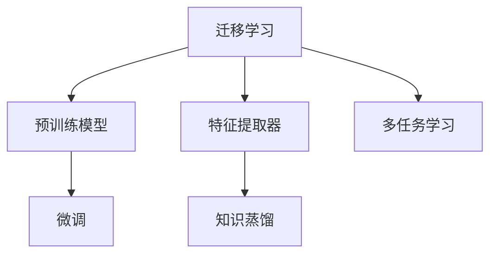

                 

# 迁移学习：利用预训练模型提高AI效率

> 关键词：迁移学习,预训练模型,迁移学习范式,迁移学习算法,参数共享,微调,特征提取器,深度学习,神经网络

## 1. 背景介绍

### 1.1 问题由来
迁移学习（Transfer Learning）是深度学习领域的一个热点研究方向，它指的是在某一特定任务上学习到的知识，可以迁移到其他相关但不同的任务上。迁移学习的主要优势在于能够大幅减少模型训练时间，提升模型泛化能力，降低数据标注成本。在实际应用中，迁移学习被广泛应用于计算机视觉、自然语言处理（NLP）、语音识别等多个领域。

近年来，随着预训练语言模型（Pre-trained Language Models, PLMs）的兴起，迁移学习的范畴进一步扩大。大模型如BERT、GPT-3、T5等，通过在庞大的无标签数据集上进行预训练，学习到了丰富的语言知识和常识，成为了迁移学习的强大工具。这些预训练模型在各种NLP任务上取得了突破性的表现，极大地推动了AI技术的发展。

### 1.2 问题核心关键点
迁移学习的主要目标是在新任务上快速取得良好的效果，而无需从头开始训练。这主要通过两种方式实现：
1. **参数共享**：在预训练模型上增加一些新的层，并将部分预训练参数作为初始化。
2. **微调**：在预训练模型的基础上，利用少量标注数据进一步优化模型，适应特定任务。

预训练模型在迁移学习中起到了两个关键作用：
1. 作为强大的特征提取器，利用其学习到的通用特征，减少新任务的学习负担。
2. 提供大量预训练数据，为特定任务提供更多的训练信号。

本文将详细介绍迁移学习的核心概念、算法原理及具体操作步骤，同时结合实际项目进行代码实现和实例分析。

## 2. 核心概念与联系

### 2.1 核心概念概述

为更好地理解迁移学习，本节将介绍几个密切相关的核心概念：

- **迁移学习**：将某一任务上学习到的知识迁移到另一任务上的学习范式。
- **预训练模型**：在大量无标签数据上进行预训练，学习到通用表示的模型。
- **特征提取器**：能够提取数据特征的模块，如卷积层、循环层、注意力机制等。
- **微调**：在预训练模型的基础上，利用有标签数据进一步优化模型。
- **知识蒸馏**：将预训练模型中的一些知识蒸馏到新模型中，以提升新模型的泛化能力。
- **多任务学习**：在一个模型上同时学习多个任务，以提高模型的迁移能力和泛化能力。

这些概念之间的逻辑关系可以通过以下Mermaid流程图来展示：



这个流程图展示了大模型迁移学习的过程：

1. 通过预训练模型获取通用特征。
2. 利用特征提取器，在特定任务上进行微调。
3. 通过知识蒸馏和多任务学习，进一步提升模型泛化能力。

这些核心概念共同构成了迁移学习的基础框架，使得深度学习模型能够在不同的应用场景中实现快速高效的迁移。

## 3. 核心算法原理 & 具体操作步骤
### 3.1 算法原理概述

迁移学习的核心思想是利用预训练模型在大量数据上学习到的通用特征，在特定任务上进一步优化。其主要流程包括特征提取、微调、知识蒸馏和多任务学习等步骤。

形式化地，设预训练模型为 $M_{\theta}$，其中 $\theta$ 为预训练得到的模型参数。给定特定任务 $T$ 的标注数据集 $D=\{(x_i, y_i)\}_{i=1}^N$，迁移学习的目标是在新任务上获得优异的性能，即：

$$
\hat{\theta}=\mathop{\arg\min}_{\theta} \mathcal{L}(M_{\theta},D)
$$

其中 $\mathcal{L}$ 为针对任务 $T$ 设计的损失函数，用于衡量模型预测输出与真实标签之间的差异。常见的损失函数包括交叉熵损失、均方误差损失等。

### 3.2 算法步骤详解

迁移学习的实施一般包括以下几个关键步骤：

**Step 1: 准备预训练模型和数据集**
- 选择合适的预训练语言模型 $M_{\theta}$ 作为初始化参数，如 BERT、GPT 等。
- 准备特定任务 $T$ 的标注数据集 $D$，划分为训练集、验证集和测试集。一般要求标注数据与预训练数据的分布不要差异过大。

**Step 2: 特征提取**
- 利用预训练模型 $M_{\theta}$ 的特征提取能力，对输入数据 $x$ 进行编码，得到特征向量 $f(x)=M_{\theta}(x)$。
- 对特征向量 $f(x)$ 进行线性变换和激活函数，得到最终输出 $y$。
- 为防止过拟合，可以使用正则化技术，如L2正则、Dropout、Early Stopping等。

**Step 3: 微调**
- 在特征提取器的基础上，增加新任务的相关层。
- 利用标注数据集 $D$ 对新任务层进行微调，更新模型参数，最小化损失函数。
- 设置适当的学习率、批大小、迭代轮数等超参数，以获得更好的微调效果。

**Step 4: 知识蒸馏**
- 将预训练模型中的一些知识蒸馏到新模型中，以提高新模型的泛化能力。
- 通常使用教师-学生模型，将预训练模型的输出作为教师模型的预测，新模型的预测作为学生模型的预测。
- 设计适当的蒸馏损失函数，如KL散度、生成式蒸馏等，将教师模型与学生模型的输出进行对比，优化学生模型的参数。

**Step 5: 多任务学习**
- 在一个模型上同时学习多个任务，以提高模型的迁移能力和泛化能力。
- 通常使用多任务损失函数，如任务损失和蒸馏损失的加权和。
- 可以采用共享层和任务专用层结合的方式，或者完全共享模型的结构。

**Step 6: 模型集成**
- 将多个模型进行集成，以进一步提升性能。
- 常用的集成方法包括Bagging、Boosting、Stacking等。

以上是迁移学习的一般流程。在实际应用中，还需要根据具体任务和数据特点，对各个步骤进行优化设计，如改进损失函数、搜索最优的超参数组合等，以进一步提升模型性能。

### 3.3 算法优缺点

迁移学习的主要优点包括：
1. 快速高效：利用预训练模型的通用特征，减少新任务的学习负担，快速获得优异的性能。
2. 泛化能力强：通过知识蒸馏和多任务学习，提升了模型对新数据的适应能力。
3. 降低成本：减少了标注数据的需求，节省了数据标注的人力和时间成本。

同时，该方法也存在一定的局限性：
1. 对预训练数据依赖较大：预训练数据的代表性直接影响迁移学习的效果。
2. 预训练模型不完美：预训练模型可能存在一些固有的偏见或错误，需要额外处理。
3. 超参数敏感：微调和知识蒸馏过程中，超参数的选择对模型性能影响较大，需要谨慎调整。
4. 模型可解释性不足：复杂模型往往难以解释，难以调试和优化。

尽管存在这些局限性，但就目前而言，迁移学习仍是深度学习模型应用的最主流范式。未来相关研究的重点在于如何进一步降低迁移学习对预训练数据的依赖，提高模型的少样本学习和跨领域迁移能力，同时兼顾可解释性和伦理安全性等因素。

### 3.4 算法应用领域

迁移学习已经在计算机视觉、自然语言处理（NLP）、语音识别等多个领域得到了广泛应用，以下是几个典型的应用场景：

- **计算机视觉**：如目标检测、图像分类、人脸识别等任务。利用预训练的卷积神经网络（CNN）模型作为特征提取器，在特定数据集上进行微调。
- **自然语言处理**：如命名实体识别、情感分析、机器翻译等任务。利用预训练的语言模型作为特征提取器，在特定数据集上进行微调。
- **语音识别**：如语音情感分析、语音识别等任务。利用预训练的卷积神经网络（CNN）或循环神经网络（RNN）模型作为特征提取器，在特定数据集上进行微调。
- **推荐系统**：如商品推荐、新闻推荐等任务。利用预训练的深度神经网络模型作为特征提取器，在用户行为数据上进行微调。
- **医疗诊断**：如医学影像诊断、病历分析等任务。利用预训练的深度神经网络模型作为特征提取器，在医疗数据上进行微调。

除了上述这些经典任务外，迁移学习还被创新性地应用到更多场景中，如可控文本生成、跨模态学习、协同过滤等，为深度学习技术带来了新的突破。随着预训练模型和迁移方法的不断进步，相信迁移学习将在更广阔的应用领域大放异彩。

## 4. 数学模型和公式 & 详细讲解 & 举例说明

### 4.1 数学模型构建

本节将使用数学语言对迁移学习的数学原理进行更加严格的刻画。

设预训练模型为 $M_{\theta}$，其中 $\theta$ 为预训练得到的模型参数。设特定任务 $T$ 的标注数据集为 $D=\{(x_i,y_i)\}_{i=1}^N$，其中 $x_i$ 为输入，$y_i$ 为标签。

定义模型 $M_{\theta}$ 在输入 $x$ 上的输出为 $y=M_{\theta}(x)$。设模型在任务 $T$ 上的损失函数为 $\ell(y,y_i)$，则任务 $T$ 的经验风险为：

$$
\mathcal{L}(\theta) = \frac{1}{N}\sum_{i=1}^N \ell(y,y_i)
$$

迁移学习的优化目标是最小化经验风险，即找到最优参数：

$$
\theta^* = \mathop{\arg\min}_{\theta} \mathcal{L}(\theta)
$$

在实践中，我们通常使用基于梯度的优化算法（如SGD、Adam等）来近似求解上述最优化问题。设 $\eta$ 为学习率，$\lambda$ 为正则化系数，则参数的更新公式为：

$$
\theta \leftarrow \theta - \eta \nabla_{\theta}\mathcal{L}(\theta) - \eta\lambda\theta
$$

其中 $\nabla_{\theta}\mathcal{L}(\theta)$ 为损失函数对参数 $\theta$ 的梯度，可通过反向传播算法高效计算。

### 4.2 公式推导过程

以下我们以目标检测任务为例，推导迁移学习的数学模型和损失函数。

设输入图像为 $I$，目标检测任务的目标为 $b$，定义模型 $M_{\theta}$ 在输入图像 $I$ 上的输出为 $o=M_{\theta}(I)$，输出大小为 $n\times n\times d$。将 $o$ 中每个位置 $p$ 的向量表示为 $o_p$，其中 $p=(i,j)$，$0\leq i,j<n$。

设模型 $M_{\theta}$ 在位置 $p$ 的预测边界框为 $\hat{b}_p=(\hat{x}_p,\hat{y}_p,\hat{w}_p,\hat{h}_p)$，其中 $\hat{x}_p$ 和 $\hat{y}_p$ 为边界框的中心点坐标，$\hat{w}_p$ 和 $\hat{h}_p$ 为边界框的宽度和高度。

定义损失函数 $\ell(b,\hat{b}_p)$ 为边界框的回归损失函数，通常为均方误差损失函数：

$$
\ell(b,\hat{b}_p) = \frac{1}{4}(\text{loc loss} + \text{cls loss})
$$

其中 $\text{loc loss} = \sum_{p=1}^{n^2} \frac{1}{2}\|b_p - \hat{b}_p\|^2$，$\text{cls loss} = \sum_{p=1}^{n^2} \ell(y_p,b_p)$，$y_p$ 为模型对位置 $p$ 的预测类别标签，$b_p$ 为真实类别标签。

将损失函数 $\ell(b,\hat{b}_p)$ 推广到整个图像 $I$ 上的所有位置，得：

$$
\mathcal{L}(\theta) = \frac{1}{N}\sum_{i=1}^N \sum_{p=1}^{n^2} \frac{1}{2}\|b_p - \hat{b}_p\|^2 + \sum_{i=1}^N \sum_{p=1}^{n^2} \ell(y_p,b_p)
$$

利用正则化技术，如L2正则、Dropout、Early Stopping等，可以进一步提升模型泛化能力。

### 4.3 案例分析与讲解

以下我们将通过一个具体的迁移学习案例，分析如何利用预训练模型进行目标检测任务的微调。

假设我们已经有了一个在大规模无标签图像上预训练的卷积神经网络（CNN）模型，如ResNet、Inception等。接下来，我们将在目标检测数据集上对该模型进行微调。

1. **数据准备**：准备一个目标检测数据集，包括图像 $I$ 和边界框 $b$。将 $I$ 分成训练集、验证集和测试集，确保标注数据的代表性。

2. **模型初始化**：加载预训练的CNN模型，将其作为特征提取器。

3. **添加任务层**：在特征提取器的输出 $o$ 上添加两个全连接层，用于回归边界框和预测类别标签。

4. **定义损失函数**：将回归损失和类别损失进行加权和，得到总损失函数。

5. **模型训练**：使用标注数据集 $D$ 进行梯度下降，更新模型参数。

6. **验证和测试**：在验证集和测试集上评估模型性能，选择最优超参数组合。

通过以上步骤，我们可以在预训练模型的基础上，利用目标检测数据集进行微调，提升模型在特定任务上的性能。需要注意的是，在微调过程中，为了减少过拟合，可以使用正则化技术，如L2正则、Dropout、Early Stopping等。

## 5. 项目实践：代码实例和详细解释说明
### 5.1 开发环境搭建

在进行迁移学习实践前，我们需要准备好开发环境。以下是使用Python进行TensorFlow开发的环境配置流程：

1. 安装Anaconda：从官网下载并安装Anaconda，用于创建独立的Python环境。

2. 创建并激活虚拟环境：
```bash
conda create -n tensorflow-env python=3.8 
conda activate tensorflow-env
```

3. 安装TensorFlow：根据CUDA版本，从官网获取对应的安装命令。例如：
```bash
conda install tensorflow -c tensorflow
```

4. 安装TensorFlow Addons：
```bash
conda install tensorflow-addons
```

5. 安装TensorFlow Hub：
```bash
pip install tensorflow-hub
```

6. 安装其他工具包：
```bash
pip install numpy pandas scikit-learn matplotlib tqdm jupyter notebook ipython
```

完成上述步骤后，即可在`tensorflow-env`环境中开始迁移学习实践。

### 5.2 源代码详细实现

下面我们以目标检测任务为例，给出使用TensorFlow对预训练模型进行微调的Python代码实现。

首先，定义目标检测数据集：

```python
import tensorflow as tf
import tensorflow_hub as hub
from tensorflow.keras import layers, models, losses

class ImageDetectionDataset(tf.data.Dataset):
    def __init__(self, images, boxes, classes, tokenizer):
        self.images = images
        self.boxes = boxes
        self.classes = classes
        self.tokenizer = tokenizer

    def __len__(self):
        return len(self.images)

    def __getitem__(self, index):
        image = self.images[index]
        box = self.boxes[index]
        class_id = self.classes[index]

        image = tf.image.decode_jpeg(image)
        image = tf.image.resize(image, (224, 224))
        image = tf.keras.applications.resnet50.preprocess_input(image)

        box = tf.constant(box, dtype=tf.float32)
        box[:, 2:] -= box[:, :2]

        class_id = tf.constant(class_id, dtype=tf.int64)

        return {'images': image, 
                'boxes': box,
                'classes': class_id}
```

然后，定义目标检测模型：

```python
def image_detection_model(input_shape):
    inputs = layers.Input(shape=input_shape)

    x = models.ResNet50(input_shape=(224,224,3), include_top=False)(inputs)
    x = layers.Flatten()(x)

    # 添加回归和分类层
    x = layers.Dense(256, activation='relu')(x)
    x = layers.Dropout(0.5)(x)
    x = layers.Dense(4)(x)

    model = models.Model(inputs, x)
    return model
```

接着，定义优化器和损失函数：

```python
model = image_detection_model(input_shape=(224,224,3))

optimizer = tf.keras.optimizers.Adam()

loss_obj = tf.keras.losses.SparseCategoricalCrossentropy(from_logits=True)

# 定义训练函数
@tf.function
def train_step(inputs):
    with tf.GradientTape() as tape:
        predictions = model(inputs['images'])
        loss = loss_obj(target=inputs['classes'], logits=predictions)

    grads = tape.gradient(loss, model.trainable_variables)
    optimizer.apply_gradients(zip(grads, model.trainable_variables))

    return loss
```

最后，启动训练流程并在测试集上评估：

```python
epochs = 10
batch_size = 32

for epoch in range(epochs):
    loss = train_loss = 0
    for batch in tqdm(train_dataset):
        batch_loss = train_step(batch)
        loss += batch_loss
    train_loss /= len(train_dataset)

    print(f"Epoch {epoch+1}, train loss: {train_loss:.4f}")

    # 评估模型
    test_loss = 0
    for batch in tqdm(test_dataset):
        batch_loss = model.test_loss(batch)
        test_loss += batch_loss
    test_loss /= len(test_dataset)

    print(f"Epoch {epoch+1}, test loss: {test_loss:.4f}")
```

以上就是使用TensorFlow对目标检测任务进行迁移学习的完整代码实现。可以看到，得益于TensorFlow的强大封装，我们可以用相对简洁的代码完成迁移学习任务的开发。

### 5.3 代码解读与分析

让我们再详细解读一下关键代码的实现细节：

**ImageDetectionDataset类**：
- `__init__`方法：初始化图像、边界框、类别等关键组件。
- `__len__`方法：返回数据集的样本数量。
- `__getitem__`方法：对单个样本进行处理，将图像输入进行预处理，同时对边界框进行编码，最终返回模型所需的输入。

**image_detection_model函数**：
- `inputs`：模型输入。
- `x`：特征提取器的输出，通过预训练模型 ResNet50 进行特征提取。
- `x`：添加回归和分类层，其中回归层用于预测边界框，分类层用于预测类别标签。
- `model`：构建目标检测模型。

**optimizer和loss_obj定义**：
- `optimizer`：设置Adam优化器。
- `loss_obj`：设置分类交叉熵损失函数，将输出结果视为logits，以避免softmax层带来的额外计算开销。

**train_step函数**：
- 在训练过程中，对每个批次进行前向传播计算损失，并使用梯度下降更新模型参数。
- 使用`tf.GradientTape`计算梯度。

**训练流程**：
- 定义总的epoch数和batch size，开始循环迭代
- 每个epoch内，在训练集上训练，输出平均loss
- 在测试集上评估，输出模型测试结果

可以看到，TensorFlow配合TensorFlow Hub使得迁移学习的代码实现变得简洁高效。开发者可以将更多精力放在数据处理、模型改进等高层逻辑上，而不必过多关注底层的实现细节。

当然，工业级的系统实现还需考虑更多因素，如模型的保存和部署、超参数的自动搜索、更灵活的任务适配层等。但核心的迁移学习范式基本与此类似。

## 6. 实际应用场景
### 6.1 智能客服系统

利用迁移学习技术，智能客服系统可以实现快速上线，而无需从头开始训练模型。传统客服往往需要配备大量人力，高峰期响应缓慢，且一致性和专业性难以保证。

在实际应用中，可以使用预训练的对话模型作为特征提取器，在特定对话数据集上进行微调。微调后的模型能够自动理解用户意图，匹配最合适的答案模板进行回复。对于客户提出的新问题，还可以接入检索系统实时搜索相关内容，动态组织生成回答。如此构建的智能客服系统，能大幅提升客户咨询体验和问题解决效率。

### 6.2 金融舆情监测

金融机构需要实时监测市场舆论动向，以便及时应对负面信息传播，规避金融风险。传统的人工监测方式成本高、效率低，难以应对网络时代海量信息爆发的挑战。

利用迁移学习技术，可以使用预训练的情感分析模型作为特征提取器，在金融舆情数据集上进行微调。微调后的模型能够自动判断文本情感，分析舆情变化趋势，一旦发现负面信息激增等异常情况，系统便会自动预警，帮助金融机构快速应对潜在风险。

### 6.3 个性化推荐系统

当前的推荐系统往往只依赖用户的历史行为数据进行物品推荐，无法深入理解用户的真实兴趣偏好。利用迁移学习技术，可以使用预训练的深度神经网络模型作为特征提取器，在用户行为数据上进行微调。微调后的模型能够从文本内容中准确把握用户的兴趣点。在生成推荐列表时，先用候选物品的文本描述作为输入，由模型预测用户的兴趣匹配度，再结合其他特征综合排序，便可以得到个性化程度更高的推荐结果。

### 6.4 未来应用展望

随着迁移学习技术的不断发展，未来将在更多领域得到应用，为传统行业带来变革性影响。

在智慧医疗领域，利用迁移学习技术，基于预训练医学图像识别模型进行病理图像诊断，能够提升诊断的准确性和效率。在智能教育领域，利用迁移学习技术，构建个性化学习推荐系统，能够因材施教，促进教育公平，提高教学质量。在智慧城市治理中，利用迁移学习技术，构建智能交通系统，能够提高城市交通管理水平，提升市民出行体验。

此外，在企业生产、社会治理、文娱传媒等众多领域，迁移学习技术也将不断涌现，为人工智能技术带来新的突破。相信随着技术的日益成熟，迁移学习技术将成为AI落地应用的重要范式，推动人工智能技术在各行业的广泛应用。

## 7. 工具和资源推荐
### 7.1 学习资源推荐

为了帮助开发者系统掌握迁移学习技术，这里推荐一些优质的学习资源：

1. **《深度学习入门》书籍**：吴恩达、李宏毅等专家所著，系统讲解深度学习的基本概念和常用技术，适合初学者入门。

2. **DeepLearning.AI课程**：吴恩达和Jeff Dean等专家主讲的深度学习课程，涵盖深度学习的各个方面，从入门到进阶，值得一学。

3. **PyTorch官方文档**：PyTorch官方提供的详细文档，包括各种模型和算法的实现，是深度学习开发的基础。

4. **TensorFlow官方文档**：TensorFlow官方提供的详细文档，包括各种模型和算法的实现，是深度学习开发的基础。

5. **TensorFlow Hub官方文档**：TensorFlow Hub官方提供的详细文档，包括各种预训练模型的实现，是迁移学习的强大工具。

6. **Keras官方文档**：Keras官方提供的详细文档，包括各种模型和算法的实现，是深度学习开发的便捷工具。

通过对这些资源的学习实践，相信你一定能够快速掌握迁移学习技术的精髓，并用于解决实际的深度学习问题。

### 7.2 开发工具推荐

高效的开发离不开优秀的工具支持。以下是几款用于迁移学习开发的常用工具：

1. **PyTorch**：基于Python的开源深度学习框架，灵活动态的计算图，适合快速迭代研究。

2. **TensorFlow**：由Google主导开发的开源深度学习框架，生产部署方便，适合大规模工程应用。

3. **TensorFlow Hub**：TensorFlow的模型共享平台，提供各种预训练模型，方便迁移学习任务的开发。

4. **TensorFlow Addons**：TensorFlow的扩展库，提供各种高级特性，如数据增强、模型压缩、分布式训练等。

5. **Keras**：基于Python的高层深度学习框架，易于使用，适合快速原型开发和模型原型测试。

6. **PyTorch Hub**：PyTorch的模型共享平台，提供各种预训练模型，方便迁移学习任务的开发。

合理利用这些工具，可以显著提升迁移学习任务的开发效率，加快创新迭代的步伐。

### 7.3 相关论文推荐

迁移学习技术的发展源于学界的持续研究。以下是几篇奠基性的相关论文，推荐阅读：

1. **ImageNet Classification with Deep Convolutional Neural Networks**：AlexNet论文，提出了卷积神经网络（CNN），奠定了计算机视觉迁移学习的基础。

2. **Rethinking the Inception Architecture for Computer Vision**：Inception论文，提出Inception模块，提升了深度神经网络的计算效率和泛化能力。

3. **Fine-tuning Word Vectors for Sequence Labeling Tasks**：用预训练的词向量模型进行序列标注任务的迁移学习，提升了模型泛化能力。

4. **Distillation**：将预训练模型中的知识蒸馏到新模型中，提升了新模型的泛化能力。

5. **A Survey on Transfer Learning**：综述了迁移学习的各种技术和应用，适合初学者入门。

这些论文代表了大模型迁移学习的发展脉络。通过学习这些前沿成果，可以帮助研究者把握学科前进方向，激发更多的创新灵感。

## 8. 总结：未来发展趋势与挑战
### 8.1 总结

本文对迁移学习技术进行了全面系统的介绍。首先阐述了迁移学习的背景和意义，明确了迁移学习在提升模型泛化能力和降低数据标注成本方面的独特价值。其次，从原理到实践，详细讲解了迁移学习的数学原理和关键步骤，给出了迁移学习任务开发的完整代码实例。同时，本文还广泛探讨了迁移学习技术在智能客服、金融舆情、个性化推荐等多个行业领域的应用前景，展示了迁移学习技术的巨大潜力。

通过本文的系统梳理，可以看到，迁移学习技术在深度学习模型应用中发挥着重要的作用，通过利用预训练模型的通用特征，快速提升模型在特定任务上的性能，大大减少了模型训练的时间和成本。未来，随着迁移学习技术的不断进步，相信其在深度学习中的应用将更加广泛，进一步推动人工智能技术的产业化进程。

### 8.2 未来发展趋势

展望未来，迁移学习技术将呈现以下几个发展趋势：

1. **模型规模持续增大**：随着算力成本的下降和数据规模的扩张，预训练模型的参数量还将持续增长。超大规模模型蕴含的丰富语言知识，有望支撑更加复杂多变的下游任务迁移。

2. **迁移能力增强**：未来的迁移学习技术将更加注重迁移能力，通过跨模态学习和多任务学习，提升模型在多领域、多任务上的泛化能力。

3. **参数共享和微调范式优化**：未来的迁移学习将更加注重参数共享和微调范式的优化，减少对标注数据的依赖，提升迁移学习的效率和精度。

4. **模型可解释性和伦理性增强**：未来的迁移学习模型将更加注重可解释性和伦理性，通过引入因果分析和博弈论等工具，提升模型的透明性和安全性。

5. **模型轻量化和优化**：未来的迁移学习模型将更加注重轻量化和优化，通过模型压缩、稀疏化存储等技术，提升模型的计算效率和资源利用率。

6. **多模态融合**：未来的迁移学习将更加注重多模态融合，通过融合视觉、语音、文本等多种模态信息，提升模型的感知能力和理解能力。

以上趋势凸显了迁移学习技术的广阔前景。这些方向的探索发展，必将进一步提升迁移学习模型的性能和应用范围，为人工智能技术的广泛应用提供新的动力。

### 8.3 面临的挑战

尽管迁移学习技术已经取得了瞩目成就，但在迈向更加智能化、普适化应用的过程中，它仍面临着诸多挑战：

1. **数据标注成本**：尽管迁移学习可以大幅减少标注数据的需求，但对于某些特定领域的应用，仍需要大量的标注数据。如何降低数据标注成本，是一个重要的研究方向。

2. **模型鲁棒性**：迁移学习模型面对域外数据时，泛化性能往往大打折扣。对于测试样本的微小扰动，迁移模型的预测也容易发生波动。如何提高迁移模型的鲁棒性，避免灾难性遗忘，还需要更多理论和实践的积累。

3. **模型可解释性**：复杂的迁移学习模型往往难以解释，难以调试和优化。如何赋予迁移模型更强的可解释性，是迁移学习面临的一大挑战。

4. **模型安全性**：预训练模型可能学习到有偏见、有害的信息，通过迁移学习传递到下游任务，产生误导性、歧视性的输出，给实际应用带来安全隐患。如何从数据和算法层面消除模型偏见，避免恶意用途，确保输出的安全性，也将是重要的研究课题。

5. **模型通用性**：当前迁移学习模型往往局限于特定任务或领域，难以灵活吸收和运用更广泛的先验知识。如何让迁移过程更好地与外部知识库、规则库等专家知识结合，形成更加全面、准确的信息整合能力，还有很大的想象空间。

正视迁移学习面临的这些挑战，积极应对并寻求突破，将使迁移学习技术走向更加成熟和完善。相信随着学界和产业界的共同努力，这些挑战终将一一被克服，迁移学习技术必将在构建人机协同的智能时代中扮演越来越重要的角色。

### 8.4 研究展望

面对迁移学习技术所面临的挑战，未来的研究需要在以下几个方面寻求新的突破：

1. **探索无监督和半监督迁移学习**：摆脱对大规模标注数据的依赖，利用自监督学习、主动学习等无监督和半监督范式，最大限度利用非结构化数据，实现更加灵活高效的迁移学习。

2. **研究参数高效和计算高效的迁移方法**：开发更加参数高效的迁移方法，如 Adapter、Knowledge Distillation 等，在固定大部分预训练参数的同时，只更新极少量的任务相关参数。同时优化迁移模型的计算图，减少前向传播和反向传播的资源消耗，实现更加轻量级、实时性的部署。

3. **引入因果分析和博弈论工具**：将因果分析方法引入迁移模型，识别出模型决策的关键特征，增强输出解释的因果性和逻辑性。借助博弈论工具刻画人机交互过程，主动探索并规避模型的脆弱点，提高系统稳定性。

4. **纳入伦理道德约束**：在模型训练目标中引入伦理导向的评估指标，过滤和惩罚有偏见、有害的输出倾向。同时加强人工干预和审核，建立模型行为的监管机制，确保输出符合人类价值观和伦理道德。

这些研究方向的探索，必将引领迁移学习技术迈向更高的台阶，为人工智能技术在各领域的落地应用提供新的动力。面向未来，迁移学习技术还需要与其他人工智能技术进行更深入的融合，如知识表示、因果推理、强化学习等，多路径协同发力，共同推动人工智能技术的进步。只有勇于创新、敢于突破，才能不断拓展迁移学习模型的边界，让智能技术更好地造福人类社会。

## 9. 附录：常见问题与解答
### Q1：迁移学习是否适用于所有深度学习任务？

A: 迁移学习在大多数深度学习任务上都能取得不错的效果，特别是对于数据量较小的任务。但对于一些特定领域的任务，如医学、法律等，仅仅依靠通用语料预训练的模型可能难以很好地适应。此时需要在特定领域语料上进一步预训练，再进行迁移学习。此外，对于一些需要时效性、个性化很强的任务，如对话、推荐等，迁移学习方法也需要针对性的改进优化。

### Q2：如何选择合适的学习率？

A: 迁移学习的学习率一般要比预训练时小1-2个数量级，如果使用过大的学习率，容易破坏预训练权重，导致过拟合。一般建议从1e-5开始调参，逐步减小学习率，直至收敛。也可以使用warmup策略，在开始阶段使用较小的学习率，再逐渐过渡到预设值。需要注意的是，不同的优化器(如SGD、Adam等)以及不同的学习率调度策略，可能需要设置不同的学习率阈值。

### Q3：迁移学习中如何避免过拟合？

A: 避免过拟合是迁移学习面临的主要挑战之一。常见的缓解策略包括：
1. 数据增强：通过回译、近义替换等方式扩充训练集
2. 正则化：使用L2正则、Dropout、Early Stopping等
3. 对抗训练：引入对抗样本，提高模型鲁棒性
4. 参数高效迁移：只调整少量参数(如 Adapter、Knowledge Distillation 等)，减小过拟合风险
5. 多模型集成：训练多个迁移模型，取平均输出，抑制过拟合

这些策略往往需要根据具体任务和数据特点进行灵活组合。只有在数据、模型、训练、推理等各环节进行全面优化，才能最大限度地发挥迁移学习的威力。

### Q4：迁移学习中如何进行多任务学习？

A: 多任务学习是一种提升模型迁移能力和泛化能力的重要方法。其主要思想是在一个模型上同时学习多个任务，以提高模型的泛化能力。常用的多任务学习模型包括共享层和任务专用层结合的方式，或者完全共享模型的结构。

在多任务学习中，通常需要设计适当的任务损失和蒸馏损失，以同时优化多个任务的性能。可以使用不同的超参数控制不同任务的权重，以达到更好的效果。

通过多任务学习，迁移模型可以同时学习多个任务的特征表示，提升模型的泛化能力和鲁棒性，使其在多个相关任务上都能取得良好的性能。

### Q5：迁移学习中如何进行知识蒸馏？

A: 知识蒸馏是一种将预训练模型中的一些知识蒸馏到新模型中，以提升新模型泛化能力的方法。常用的知识蒸馏方法包括蒸馏学习、蒸馏损失和蒸馏算法等。

在知识蒸馏中，通常使用教师-学生模型，将预训练模型的输出作为教师模型的预测，新模型的预测作为学生模型的预测。然后设计适当的蒸馏损失函数，如KL散度、生成式蒸馏等，将教师模型与学生模型的输出进行对比，优化学生模型的参数。

通过知识蒸馏，迁移模型可以从预训练模型中学习到更多的知识和经验，提升其在特定任务上的泛化能力。知识蒸馏还可以用于跨领域迁移学习，使模型能够更好地适应新的任务和领域。

### Q6：迁移学习中如何进行参数共享？

A: 参数共享是迁移学习中的重要策略之一。其主要思想是在迁移模型中，部分预训练参数可以作为初始化，以提升模型的泛化能力和迁移性能。

在参数共享中，通常需要选择合适的参数进行共享，避免共享过多参数导致模型过拟合。常用的参数共享方法包括固定层、冻结层和微调层等。

固定层指的是在迁移模型中，部分预训练层的参数保持不变，只更新新添加的层。冻结层指的是在迁移模型中，部分预训练层的参数冻结，不参与训练。微调层指的是在迁移模型中，部分预训练层的参数微调，以适应特定任务的需求。

通过参数共享，迁移模型可以充分利用预训练模型中的通用特征，减少新任务的训练时间，提升模型的泛化能力和迁移性能。参数共享还可以用于跨领域迁移学习，使模型能够更好地适应新的任务和领域。

