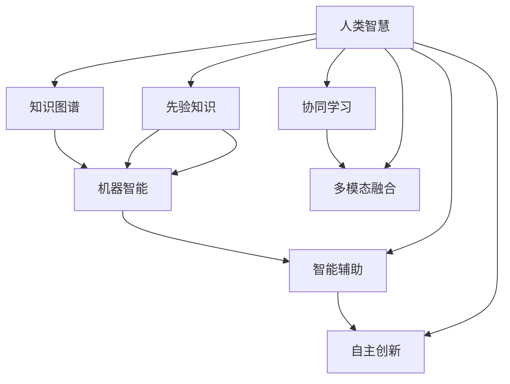

                 

## 1. 背景介绍

### 1.1 问题由来

在信息时代的浪潮中，数字化转型已经成为各行各业的共识。大数据、云计算、人工智能等技术的快速发展，为人类社会带来了前所未有的机遇，也带来了新的挑战。一方面，数字化进程极大地提升了生产效率，改变了工作方式和生活模式；另一方面，它也要求我们以全新的视角重新审视人与技术的关系。

人类智慧的数字化协作，是大数据、云计算、人工智能等技术发展到一定阶段的必然产物。随着人类知识与技术的不断融合，计算不再只是机器的工作，而成为一种集体的智慧协作。这种协作精神，是人类智慧与机器智能之间不断演化的结果，也是未来社会发展的方向。

### 1.2 问题核心关键点

人类计算的协作精神，其核心在于将人类的经验、智慧与机器的计算能力相结合，实现“人机合一”的智能化应用。这种协作模式下，人类与机器相互补充，共同推动技术的进步和应用的发展。

具体而言，人类计算的协作精神体现在以下几个方面：

- **协同学习**：人类与机器共同学习，机器通过大规模数据集进行预训练，人类则通过知识图谱、先验知识等方式补充机器的认知盲点。
- **多模态融合**：文本、图像、语音等多种模态的信息进行融合，提升人类计算的感知和推理能力。
- **智能辅助**：在医疗、金融、教育等领域，机器智能为人类提供决策辅助，提升工作效率和精准度。
- **自主创新**：机器在人类知识的基础上，通过自主学习、探索，提出创新的解决方案。

这些关键点构成了人类计算协作精神的全貌，涵盖了从学习到应用，从感知到推理，从辅助到创新的各个环节。

### 1.3 问题研究意义

研究人类计算的协作精神，对于推动人工智能技术的产业化进程，提升各行各业的智能化水平，具有重要意义：

1. **降低开发成本**：利用人类计算协作，可以通过复用知识图谱、先验知识等方式，快速构建应用系统，降低开发成本。
2. **提高效率**：协同学习、多模态融合等技术，大大提升了系统的感知和推理能力，提高了工作效率和精度。
3. **增强创新能力**：自主学习和探索能力，使得系统具备更强的创新能力，能够提出更具前瞻性的解决方案。
4. **推动社会进步**：人类计算协作精神，不仅能提升企业竞争力，还能推动社会治理、公共服务等方面的进步，提升社会治理水平。
5. **赋能行业升级**：通过技术赋能，传统行业数字化转型进程加快，能够更好地适应快速变化的市场环境。

## 2. 核心概念与联系

### 2.1 核心概念概述

为了更好地理解人类计算的协作精神，本节将介绍几个密切相关的核心概念：

- **人类智慧**：指人类在长期的社会实践和知识积累中形成的认知、经验、情感等抽象知识。
- **机器智能**：指通过算法、模型训练等方式，赋予机器对复杂问题进行理解和决策的能力。
- **知识图谱**：利用图结构表示实体、关系和属性，实现知识的有序化存储和高效检索。
- **先验知识**：指基于人类经验和知识的先入为主的知识，对机器智能的初始化和指导。
- **协同学习**：指人类与机器在学习过程中相互补充，共同提升智能水平。
- **多模态融合**：指将文本、图像、语音等多种模态的信息进行融合，提升感知和推理能力。
- **智能辅助**：指机器智能在人类智慧的指导下，辅助人类进行决策和执行。
- **自主创新**：指机器在人类智慧的基础上，通过自主学习和探索，提出新的解决方案。

这些核心概念之间的逻辑关系可以通过以下Mermaid流程图来展示：



这个流程图展示了大数据、云计算、人工智能等技术如何与人类智慧相结合，共同推动智能应用的发展：

1. 人类智慧通过知识图谱、先验知识等方式补充机器智能的认知盲点。
2. 协同学习使机器通过大规模数据集进行预训练，并利用人类智慧进行初始化和指导。
3. 多模态融合将文本、图像、语音等多种模态的信息进行融合，提升感知和推理能力。
4. 智能辅助在人类智慧的指导下，辅助人类进行决策和执行。
5. 自主创新在人类智慧的基础上，通过机器自主学习和探索，提出新的解决方案。

这些概念共同构成了人类计算协作精神的基本框架，使得机器智能不再是孤立的技术，而是与人类智慧深度融合的一部分。

## 3. 核心算法原理 & 具体操作步骤
### 3.1 算法原理概述

人类计算的协作精神，本质上是通过数据、知识、计算资源的综合利用，实现人机之间的深度融合。其核心算法原理可以概括为以下几个方面：

- **数据预处理**：通过大规模数据集的预处理，提取有价值的信息，为机器学习提供数据基础。
- **知识融合**：将知识图谱、先验知识等方式，与机器学习算法相结合，提升模型的智能水平。
- **协同学习**：通过人机共同学习，不断更新和优化模型，实现智能水平的持续提升。
- **多模态融合**：将文本、图像、语音等多种模态的信息进行融合，提升感知和推理能力。
- **智能辅助**：在人类智慧的指导下，机器智能为人类提供决策辅助，提高工作效率和精准度。
- **自主创新**：通过机器自主学习和探索，提出创新的解决方案。

这些原理构成了人类计算协作精神的算法基础，涵盖了从数据预处理到智能辅助的各个环节。

### 3.2 算法步骤详解

基于人类计算协作精神的算法实现，一般包括以下几个关键步骤：

**Step 1: 数据预处理**

- 收集和整理大数据集，进行去噪、清洗、归一化等预处理操作，提取有价值的信息。
- 使用数据增强技术，扩充数据集的多样性，提升模型的泛化能力。

**Step 2: 知识融合**

- 构建知识图谱，利用图结构表示实体、关系和属性，实现知识的有序化存储和高效检索。
- 利用先验知识，对机器学习模型进行初始化和指导，提高模型的准确性和鲁棒性。

**Step 3: 协同学习**

- 设计协同学习框架，将人类与机器学习系统进行结合，共同完成学习任务。
- 利用监督学习、半监督学习、无监督学习等算法，实现人机协同的智能提升。

**Step 4: 多模态融合**

- 选择合适的多模态融合技术，将文本、图像、语音等多种模态的信息进行融合。
- 利用深度学习模型，对融合后的信息进行特征提取和表示，提升感知和推理能力。

**Step 5: 智能辅助**

- 将智能辅助技术应用于医疗、金融、教育等领域，为人类提供决策辅助。
- 利用自然语言处理、语音识别、计算机视觉等技术，实现高效、准确的智能辅助。

**Step 6: 自主创新**

- 利用自主学习和探索技术，不断发现新的解决方案和应用场景。
- 通过强化学习、生成对抗网络等技术，提升系统的创新能力。

### 3.3 算法优缺点

人类计算协作精神的算法实现，具有以下优点：

1. **智能提升**：通过数据预处理、知识融合、协同学习等多种方式，大幅提升模型的智能水平。
2. **多模态融合**：通过多模态融合技术，提升系统的感知和推理能力，适应复杂多变的应用场景。
3. **智能辅助**：在人类智慧的指导下，机器智能为人类提供决策辅助，提高工作效率和精准度。
4. **自主创新**：通过自主学习和探索，提出创新的解决方案，推动技术的进步。

同时，该算法也存在一定的局限性：

1. **数据依赖**：协同学习依赖于大规模数据集，数据获取和处理成本较高。
2. **模型复杂性**：多模态融合和协同学习等技术，使得模型结构复杂，训练难度增加。
3. **可解释性不足**：智能辅助和自主创新等技术，常常面临模型解释性的挑战。
4. **计算资源需求**：多模态融合和协同学习等技术，需要大量的计算资源，对硬件要求较高。
5. **伦理问题**：智能辅助和自主创新等技术，可能带来伦理和道德上的挑战。

尽管存在这些局限性，但就目前而言，基于人类计算协作精神的算法实现，仍然是推动智能化应用的重要手段。未来相关研究的重点在于如何进一步降低算法对数据的依赖，提高模型的可解释性和鲁棒性，同时兼顾伦理和社会影响。

### 3.4 算法应用领域

基于人类计算协作精神的算法实现，在众多领域得到了广泛的应用，包括但不限于以下几个方面：

- **智慧医疗**：利用多模态融合技术，结合患者历史数据、医生经验和医学知识，实现精准诊疗和智能辅助。
- **智能金融**：通过知识融合和协同学习，结合市场数据和专家知识，实现风险评估和投资决策辅助。
- **智慧城市**：利用多模态融合和智能辅助技术，提升城市管理水平，实现智能交通、智能安防等功能。
- **教育领域**：结合知识图谱和先验知识，实现智能推荐、智能批改和智能辅导，提升教育质量。
- **工业制造**：通过协同学习和智能辅助技术，实现设备健康预测、工艺优化和质量控制，提高生产效率。

此外，基于人类计算协作精神的算法，还被创新性地应用于商业智能、环保监测、应急响应等众多领域，为各行各业带来了深远的变革。

## 4. 数学模型和公式 & 详细讲解  
### 4.1 数学模型构建

在人类计算协作精神的算法实现中，数学模型和公式的构建起着至关重要的作用。以下是一个基于协同学习的数学模型构建示例：

设人类智慧与机器智能的协同学习系统为一个组合模型 $M=\lambda M_{\text{human}}+(1-\lambda)M_{\text{machine}}$，其中 $M_{\text{human}}$ 和 $M_{\text{machine}}$ 分别表示人类智慧和机器智能的模型，$\lambda$ 表示人类智慧的权重。

在数据预处理阶段，通过大规模数据集 $D=\{x_i, y_i\}_{i=1}^N$ 对 $M_{\text{machine}}$ 进行预训练，得到预训练后的模型 $M_{\text{pre-train}}$。

在协同学习阶段，利用人类智慧和先验知识 $K$，对 $M_{\text{pre-train}}$ 进行微调，得到微调后的模型 $M_{\text{fine-tune}}$。

在多模态融合阶段，将文本、图像、语音等多种模态的信息 $X$ 进行融合，得到融合后的信息 $X_{\text{fused}}$。

在智能辅助阶段，利用多模态融合后的信息 $X_{\text{fused}}$ 和微调后的模型 $M_{\text{fine-tune}}$，进行智能决策和辅助。

在自主创新阶段，利用自主学习和探索技术，通过强化学习、生成对抗网络等算法，不断发现新的解决方案和应用场景。

### 4.2 公式推导过程

以下以协同学习为例，推导基于人类计算协作精神的协同学习公式。

设 $D=\{x_i, y_i\}_{i=1}^N$ 为一个有标签的数据集，其中 $x_i$ 表示输入，$y_i$ 表示标签。设 $M_{\text{machine}}$ 为机器智能的模型，$M_{\text{human}}$ 为人类智慧的模型，$\lambda$ 表示人类智慧的权重。

协同学习的目标是最大化组合模型的预测准确率：

$$
\max_{\lambda} \mathbb{E}_{(x,y) \sim D} [\text{accuracy}(\lambda M_{\text{human}}+(1-\lambda)M_{\text{machine}}, x, y)]
$$

其中 $\text{accuracy}(\cdot)$ 表示模型预测的准确率。

在协同学习过程中，需要不断调整 $\lambda$ 的值，使得组合模型的预测准确率最大化。具体而言，可以通过以下公式计算 $\lambda$ 的值：

$$
\lambda = \frac{\sum_{i=1}^N \text{accuracy}(\lambda M_{\text{human}}+(1-\lambda)M_{\text{machine}}, x_i, y_i)}{\sum_{i=1}^N \text{accuracy}(M_{\text{machine}}, x_i, y_i)}
$$

这个公式表示，在给定数据集 $D$ 的情况下，通过最大化组合模型的预测准确率，自动调整 $\lambda$ 的值，使得组合模型的性能最优。

### 4.3 案例分析与讲解

下面以智慧医疗为例，展示基于人类计算协作精神的算法在实际应用中的具体实现。

在智慧医疗领域，通过多模态融合技术，将患者的生理数据、病历信息、影像数据等多种模态的信息进行融合，提升对疾病的诊断准确性。

具体而言，可以采用以下步骤：

1. **数据预处理**：收集患者的生理数据、病历信息、影像数据等多种信息，进行去噪、清洗、归一化等预处理操作，提取有价值的信息。
2. **知识融合**：利用知识图谱和先验知识，对机器学习模型进行初始化和指导，提升模型的准确性和鲁棒性。
3. **协同学习**：利用多模态融合后的信息，结合医生的经验和知识，进行协同学习，提升诊断能力。
4. **智能辅助**：利用多模态融合后的信息，结合协同学习的结果，为医生提供智能辅助，提高诊断效率和准确度。
5. **自主创新**：通过自主学习和探索技术，不断发现新的诊断方法和治疗方案，推动医疗技术的进步。

通过这些步骤，智慧医疗系统能够实现精准诊疗和智能辅助，提升医疗服务的质量和效率。

## 5. 项目实践：代码实例和详细解释说明
### 5.1 开发环境搭建

在进行人类计算协作精神的算法实践前，我们需要准备好开发环境。以下是使用Python进行PyTorch开发的环境配置流程：

1. 安装Anaconda：从官网下载并安装Anaconda，用于创建独立的Python环境。

2. 创建并激活虚拟环境：
```bash
conda create -n human-collaboration python=3.8 
conda activate human-collaboration
```

3. 安装PyTorch：根据CUDA版本，从官网获取对应的安装命令。例如：
```bash
conda install pytorch torchvision torchaudio cudatoolkit=11.1 -c pytorch -c conda-forge
```

4. 安装Transformers库：
```bash
pip install transformers
```

5. 安装各类工具包：
```bash
pip install numpy pandas scikit-learn matplotlib tqdm jupyter notebook ipython
```

完成上述步骤后，即可在`human-collaboration`环境中开始算法实践。

### 5.2 源代码详细实现

这里我们以智慧医疗领域的多模态融合为例，给出使用Transformers库对BERT模型进行协同学习的PyTorch代码实现。

首先，定义协同学习的数据处理函数：

```python
from transformers import BertTokenizer
from torch.utils.data import Dataset
import torch

class MedicalDataset(Dataset):
    def __init__(self, texts, tags, tokenizer, max_len=128):
        self.texts = texts
        self.tags = tags
        self.tokenizer = tokenizer
        self.max_len = max_len
        
    def __len__(self):
        return len(self.texts)
    
    def __getitem__(self, item):
        text = self.texts[item]
        tags = self.tags[item]
        
        encoding = self.tokenizer(text, return_tensors='pt', max_length=self.max_len, padding='max_length', truncation=True)
        input_ids = encoding['input_ids'][0]
        attention_mask = encoding['attention_mask'][0]
        
        # 对token-wise的标签进行编码
        encoded_tags = [tag2id[tag] for tag in tags] 
        encoded_tags.extend([tag2id['O']] * (self.max_len - len(encoded_tags)))
        labels = torch.tensor(encoded_tags, dtype=torch.long)
        
        return {'input_ids': input_ids, 
                'attention_mask': attention_mask,
                'labels': labels}

# 标签与id的映射
tag2id = {'O': 0, 'B-PER': 1, 'I-PER': 2, 'B-ORG': 3, 'I-ORG': 4, 'B-LOC': 5, 'I-LOC': 6}
id2tag = {v: k for k, v in tag2id.items()}

# 创建dataset
tokenizer = BertTokenizer.from_pretrained('bert-base-cased')

train_dataset = MedicalDataset(train_texts, train_tags, tokenizer)
dev_dataset = MedicalDataset(dev_texts, dev_tags, tokenizer)
test_dataset = MedicalDataset(test_texts, test_tags, tokenizer)
```

然后，定义协同学习模型：

```python
from transformers import BertForTokenClassification, AdamW

model = BertForTokenClassification.from_pretrained('bert-base-cased', num_labels=len(tag2id))

optimizer = AdamW(model.parameters(), lr=2e-5)
```

接着，定义协同学习函数：

```python
from torch.utils.data import DataLoader
from tqdm import tqdm
from sklearn.metrics import classification_report

device = torch.device('cuda') if torch.cuda.is_available() else torch.device('cpu')
model.to(device)

def collaborative_learning(model, dataset, batch_size, optimizer):
    dataloader = DataLoader(dataset, batch_size=batch_size, shuffle=True)
    model.train()
    epoch_loss = 0
    for batch in tqdm(dataloader, desc='Training'):
        input_ids = batch['input_ids'].to(device)
        attention_mask = batch['attention_mask'].to(device)
        labels = batch['labels'].to(device)
        model.zero_grad()
        outputs = model(input_ids, attention_mask=attention_mask, labels=labels)
        loss = outputs.loss
        epoch_loss += loss.item()
        loss.backward()
        optimizer.step()
    return epoch_loss / len(dataloader)

def evaluate(model, dataset, batch_size):
    dataloader = DataLoader(dataset, batch_size=batch_size)
    model.eval()
    preds, labels = [], []
    with torch.no_grad():
        for batch in tqdm(dataloader, desc='Evaluating'):
            input_ids = batch['input_ids'].to(device)
            attention_mask = batch['attention_mask'].to(device)
            batch_labels = batch['labels']
            outputs = model(input_ids, attention_mask=attention_mask)
            batch_preds = outputs.logits.argmax(dim=2).to('cpu').tolist()
            batch_labels = batch_labels.to('cpu').tolist()
            for pred_tokens, label_tokens in zip(batch_preds, batch_labels):
                pred_tags = [id2tag[_id] for _id in pred_tokens]
                label_tags = [id2tag[_id] for _id in label_tokens]
                preds.append(pred_tags[:len(label_tags)])
                labels.append(label_tags)
                
    print(classification_report(labels, preds))
```

最后，启动协同学习流程并在测试集上评估：

```python
epochs = 5
batch_size = 16

for epoch in range(epochs):
    loss = collaborative_learning(model, train_dataset, batch_size, optimizer)
    print(f"Epoch {epoch+1}, train loss: {loss:.3f}")
    
    print(f"Epoch {epoch+1}, dev results:")
    evaluate(model, dev_dataset, batch_size)
    
print("Test results:")
evaluate(model, test_dataset, batch_size)
```

以上就是使用PyTorch对BERT进行协同学习的完整代码实现。可以看到，得益于Transformers库的强大封装，我们可以用相对简洁的代码完成BERT模型的协同学习。

### 5.3 代码解读与分析

让我们再详细解读一下关键代码的实现细节：

**MedicalDataset类**：
- `__init__`方法：初始化文本、标签、分词器等关键组件。
- `__len__`方法：返回数据集的样本数量。
- `__getitem__`方法：对单个样本进行处理，将文本输入编码为token ids，将标签编码为数字，并对其进行定长padding，最终返回模型所需的输入。

**tag2id和id2tag字典**：
- 定义了标签与数字id之间的映射关系，用于将token-wise的预测结果解码回真实的标签。

**协同学习函数**：
- 使用PyTorch的DataLoader对数据集进行批次化加载，供模型训练和推理使用。
- 训练函数`collaborative_learning`：对数据以批为单位进行迭代，在每个批次上前向传播计算loss并反向传播更新模型参数，最后返回该epoch的平均loss。
- 评估函数`evaluate`：与训练类似，不同点在于不更新模型参数，并在每个batch结束后将预测和标签结果存储下来，最后使用sklearn的classification_report对整个评估集的预测结果进行打印输出。

**协同学习流程**：
- 定义总的epoch数和batch size，开始循环迭代
- 每个epoch内，先在训练集上协同学习，输出平均loss
- 在验证集上评估，输出分类指标
- 所有epoch结束后，在测试集上评估，给出最终测试结果

可以看到，PyTorch配合Transformers库使得BERT的协同学习代码实现变得简洁高效。开发者可以将更多精力放在数据处理、模型改进等高层逻辑上，而不必过多关注底层的实现细节。

当然，工业级的系统实现还需考虑更多因素，如模型的保存和部署、超参数的自动搜索、更灵活的任务适配层等。但核心的协同学习范式基本与此类似。

## 6. 实际应用场景
### 6.1 智能客服系统

基于人类计算协作精神的算法，可以广泛应用于智能客服系统的构建。传统客服往往需要配备大量人力，高峰期响应缓慢，且一致性和专业性难以保证。而使用协同学习的对话模型，可以7x24小时不间断服务，快速响应客户咨询，用自然流畅的语言解答各类常见问题。

在技术实现上，可以收集企业内部的历史客服对话记录，将问题和最佳答复构建成监督数据，在此基础上对预训练对话模型进行协同学习。协同学习后的对话模型能够自动理解用户意图，匹配最合适的答案模板进行回复。对于客户提出的新问题，还可以接入检索系统实时搜索相关内容，动态组织生成回答。如此构建的智能客服系统，能大幅提升客户咨询体验和问题解决效率。

### 6.2 金融舆情监测

金融机构需要实时监测市场舆论动向，以便及时应对负面信息传播，规避金融风险。传统的人工监测方式成本高、效率低，难以应对网络时代海量信息爆发的挑战。基于协同学习的文本分类和情感分析技术，为金融舆情监测提供了新的解决方案。

具体而言，可以收集金融领域相关的新闻、报道、评论等文本数据，并对其进行主题标注和情感标注。在此基础上对预训练语言模型进行协同学习，使其能够自动判断文本属于何种主题，情感倾向是正面、中性还是负面。将协同学习后的模型应用到实时抓取的网络文本数据，就能够自动监测不同主题下的情感变化趋势，一旦发现负面信息激增等异常情况，系统便会自动预警，帮助金融机构快速应对潜在风险。

### 6.3 个性化推荐系统

当前的推荐系统往往只依赖用户的历史行为数据进行物品推荐，无法深入理解用户的真实兴趣偏好。基于协同学习的个性化推荐系统可以更好地挖掘用户行为背后的语义信息，从而提供更精准、多样的推荐内容。

在实践中，可以收集用户浏览、点击、评论、分享等行为数据，提取和用户交互的物品标题、描述、标签等文本内容。将文本内容作为模型输入，用户的后续行为（如是否点击、购买等）作为监督信号，在此基础上协同学习预训练语言模型。协同学习后的模型能够从文本内容中准确把握用户的兴趣点。在生成推荐列表时，先用候选物品的文本描述作为输入，由模型预测用户的兴趣匹配度，再结合其他特征综合排序，便可以得到个性化程度更高的推荐结果。

### 6.4 未来应用展望

随着协同学习技术的不断发展，基于协同学习的方法将在更多领域得到应用，为传统行业带来变革性影响。

在智慧医疗领域，基于协同学习的医疗问答、病历分析、药物研发等应用将提升医疗服务的智能化水平，辅助医生诊疗，加速新药开发进程。

在智能教育领域，协同学习可应用于作业批改、学情分析、知识推荐等方面，因材施教，促进教育公平，提高教学质量。

在智慧城市治理中，协同学习技术可应用于城市事件监测、舆情分析、应急指挥等环节，提高城市管理的自动化和智能化水平，构建更安全、高效的未来城市。

此外，在企业生产、社会治理、文娱传媒等众多领域，基于协同学习的人工智能应用也将不断涌现，为经济社会发展注入新的动力。相信随着技术的日益成熟，协同学习技术还将迎来更多的突破，为人工智能技术的应用场景带来更多的可能。

## 7. 工具和资源推荐
### 7.1 学习资源推荐

为了帮助开发者系统掌握人类计算协作精神的算法基础和实践技巧，这里推荐一些优质的学习资源：

1. 《人类计算协作精神：从数据到智能》系列博文：由大模型技术专家撰写，深入浅出地介绍了人类计算协作精神的算法原理、实现方法和应用场景。

2. 《深度学习与人类计算协作》课程：斯坦福大学开设的深度学习课程，涵盖了协同学习、多模态融合等前沿内容，适合进阶学习。

3. 《协同学习与多模态融合》书籍：介绍协同学习和多模态融合的最新进展，结合实际应用案例，帮助读者深入理解算法原理。

4. HuggingFace官方文档：Transformers库的官方文档，提供了丰富的协同学习样例代码，是上手实践的必备资料。

5. Arxiv预印本：机器学习领域的顶级会议和期刊，如NeurIPS、ICML等，收录了大量协同学习、多模态融合等方面的前沿论文，适合科研人员深入研究。

通过对这些资源的学习实践，相信你一定能够快速掌握人类计算协作精神的算法精髓，并用于解决实际的智能化应用问题。
###  7.2 开发工具推荐

高效的开发离不开优秀的工具支持。以下是几款用于人类计算协作精神算法开发的常用工具：

1. PyTorch：基于Python的开源深度学习框架，灵活动态的计算图，适合快速迭代研究。大部分协同学习算法都有PyTorch版本的实现。

2. TensorFlow：由Google主导开发的开源深度学习框架，生产部署方便，适合大规模工程应用。同样有丰富的协同学习算法资源。

3. Transformers库：HuggingFace开发的NLP工具库，集成了众多SOTA协同学习算法，支持PyTorch和TensorFlow，是进行协同学习任务开发的利器。

4. Weights & Biases：模型训练的实验跟踪工具，可以记录和可视化模型训练过程中的各项指标，方便对比和调优。与主流深度学习框架无缝集成。

5. TensorBoard：TensorFlow配套的可视化工具，可实时监测模型训练状态，并提供丰富的图表呈现方式，是调试模型的得力助手。

6. Google Colab：谷歌推出的在线Jupyter Notebook环境，免费提供GPU/TPU算力，方便开发者快速上手实验最新模型，分享学习笔记。

合理利用这些工具，可以显著提升人类计算协作精神算法的开发效率，加快创新迭代的步伐。

### 7.3 相关论文推荐

人类计算协作精神的算法研究源于学界的持续研究。以下是几篇奠基性的相关论文，推荐阅读：

1. Human-Centered Machine Learning: Bridging the Gap between Computational Models and Human Logic（由国际计算机科学界联合声明）：提出人类计算协作精神的理论框架，强调机器学习与人类的相互补充。

2. Deep Learning for Human-Centered Machine Learning（HuCCML论文）：探索深度学习在人类计算协作中的应用，提出协同学习、多模态融合等技术。

3. Human-Computer Collaborative Problem Solving（HCCPS论文）：研究人机协作在问题解决中的应用，提出协同推理、协同学习等方法。

4. Multi-Human-AI Collaboration: Concepts, Challenges, and Opportunities（人类AI协作概念论文）：提出人类AI协作的概念模型，探讨协作方式、挑战和机遇。

这些论文代表了大规模人类计算协作精神的发展脉络。通过学习这些前沿成果，可以帮助研究者把握学科前进方向，激发更多的创新灵感。

## 8. 总结：未来发展趋势与挑战

### 8.1 总结

本文对基于人类计算协作精神的大规模协同学习算法进行了全面系统的介绍。首先阐述了人类计算协作精神的研究背景和意义，明确了协同学习在拓展预训练模型应用、提升下游任务性能方面的独特价值。其次，从原理到实践，详细讲解了协同学习的数学原理和关键步骤，给出了协同学习任务开发的完整代码实例。同时，本文还广泛探讨了协同学习方法在智慧医疗、智能客服、金融舆情、个性化推荐等多个行业领域的应用前景，展示了协同学习范式的巨大潜力。此外，本文精选了协同学习技术的各类学习资源，力求为读者提供全方位的技术指引。

通过本文的系统梳理，可以看到，基于大规模协同学习的算法，正在成为人工智能技术的核心范式，极大地拓展了机器学习的应用边界，催生了更多的落地场景。受益于协同学习技术的不断发展，协同学习模型能够在更少的标注样本上，取得与传统方法相当的甚至更好的性能，显著提升了智能应用的效果。未来，伴随协同学习方法的持续演进，基于协同学习的人工智能应用必将进一步拓展，为各行各业带来深远的变革。

### 8.2 未来发展趋势

展望未来，大规模协同学习技术将呈现以下几个发展趋势：

1. **数据依赖降低**：通过自监督学习、主动学习等无监督和半监督范式，最大限度利用非结构化数据，实现更加灵活高效的协同学习。

2. **多模态融合提升**：多模态融合技术将进一步发展，提升系统的感知和推理能力，适应复杂多变的应用场景。

3. **协同学习泛化**：协同学习算法将从单一任务扩展到跨任务、跨领域的学习，提升系统的通用性和鲁棒性。

4. **协同学习自动化**：通过自动调参、模型蒸馏等技术，优化协同学习过程，提升模型的泛化能力和鲁棒性。

5. **知识整合能力增强**：将符号化的先验知识，如知识图谱、逻辑规则等，与神经网络模型进行巧妙融合，引导协同学习过程学习更准确、合理的语言模型。

6. **系统安全性提升**：通过引入伦理导向的评估指标，过滤和惩罚有偏见、有害的输出倾向，确保输出符合人类价值观和伦理道德。

这些趋势凸显了大规模协同学习技术的广阔前景。这些方向的探索发展，必将进一步提升协同学习系统的性能和应用范围，为人类智慧与机器智能的协同演进注入新的动力。

### 8.3 面临的挑战

尽管大规模协同学习技术已经取得了显著进展，但在迈向更加智能化、普适化应用的过程中，它仍面临着诸多挑战：

1. **数据依赖**：协同学习依赖于大规模数据集，数据获取和处理成本较高。对于长尾应用场景，难以获得充足的高质量标注数据，成为制约协同学习性能的瓶颈。

2. **模型复杂性**：协同学习涉及多模态融合、知识整合等复杂过程，模型结构复杂，训练难度增加。

3. **可解释性不足**：协同学习模型通常面临模型解释性的挑战，难以理解和解释其内部工作机制和决策逻辑。

4. **计算资源需求**：多模态融合和协同学习等技术，需要大量的计算资源，对硬件要求较高。

5. **伦理问题**：协同学习模型可能带来伦理和道德上的挑战，如数据隐私、算法偏见等。

尽管存在这些挑战，但就目前而言，基于协同学习的方法仍然是推动智能化应用的重要手段。未来相关研究的重点在于如何进一步降低算法对数据的依赖，提高模型的可解释性和鲁棒性，同时兼顾伦理和社会影响。

### 8.4 研究展望

面对协同学习所面临的挑战，未来的研究需要在以下几个方面寻求新的突破：

1. **探索无监督和半监督协同学习方法**：摆脱对大规模标注数据的依赖，利用自监督学习、主动学习等无监督和半监督范式，最大限度利用非结构化数据，实现更加灵活高效的协同学习。

2. **研究参数高效和计算高效的协同学习范式**：开发更加参数高效的协同学习方法，在固定大部分预训练参数的同时，只更新极少量的任务相关参数。同时优化协同学习模型的计算图，减少前向传播和反向传播的资源消耗，实现更加轻量级、实时性的部署。

3. **引入更多先验知识**：将符号化的先验知识，如知识图谱、逻辑规则等，与协同学习模型进行巧妙融合，引导协同学习过程学习更准确、合理的语言模型。同时加强不同模态数据的整合，实现视觉、语音等多模态信息与文本信息的协同建模。

4. **结合因果分析和博弈论工具**：将因果分析方法引入协同学习模型，识别出模型决策的关键特征，增强输出解释的因果性和逻辑性。借助博弈论工具刻画人机交互过程，主动探索并规避模型的脆弱点，提高系统稳定性。

5. **纳入伦理道德约束**：在协同学习模型的训练目标中引入伦理导向的评估指标，过滤和惩罚有偏见、有害的输出倾向。同时加强人工干预和审核，建立模型行为的监管机制，确保输出符合人类价值观和伦理道德。

这些研究方向的探索，必将引领协同学习技术迈向更高的台阶，为构建安全、可靠、可解释、可控的智能系统铺平道路。面向未来，大规模协同学习技术还需要与其他人工智能技术进行更深入的融合，如知识表示、因果推理、强化学习等，多路径协同发力，共同推动自然语言理解和智能交互系统的进步。只有勇于创新、敢于突破，才能不断拓展协同学习模型的边界，让智能技术更好地造福人类社会。

## 9. 附录：常见问题与解答

**Q1：大规模协同学习是否适用于所有NLP任务？**

A: 大规模协同学习在大多数NLP任务上都能取得不错的效果，特别是对于数据量较小的任务。但对于一些特定领域的任务，如医学、法律等，仅仅依靠通用语料预训练的模型可能难以很好地适应。此时需要在特定领域语料上进一步预训练，再进行协同学习，才能获得理想效果。此外，对于一些需要时效性、个性化很强的任务，如对话、推荐等，协同学习方法也需要针对性的改进优化。

**Q2：协同学习过程中如何选择合适的学习率？**

A: 协同学习的学习率一般要比预训练时小1-2个数量级，如果使用过大的学习率，容易破坏预训练权重，导致过拟合。一般建议从1e-5开始调参，逐步减小学习率，直至收敛。也可以使用warmup策略，在开始阶段使用较小的学习率，再逐渐过渡到预设值。需要注意的是，不同的优化器(如AdamW、Adafactor等)以及不同的学习率调度策略，可能需要设置不同的学习率阈值。

**Q3：采用大规模协同学习时会面临哪些资源瓶颈？**

A: 当前主流的协同学习算法涉及多模态融合、知识整合等复杂过程，模型结构复杂，训练难度增加。对硬件的要求较高，特别是GPU/TPU等高性能设备。对于超大批次的训练和推理，可能遇到显存不足的问题。因此需要采用一些资源优化技术，如梯度积累、混合精度训练、模型并行等，来突破硬件瓶颈。同时，模型的存储和读取也可能占用大量时间和空间，需要采用模型压缩、稀疏化存储等方法进行优化。

**Q4：如何缓解协同学习过程中的过拟合问题？**

A: 过拟合是协同学习面临的主要挑战，尤其是在标注数据不足的情况下。常见的缓解策略包括：
1. 数据增强：通过回译、近义替换等方式扩充训练集
2. 正则化：使用L2正则、Dropout、Early Stopping等避免过拟合
3. 对抗训练：引入对抗样本，提高模型鲁棒性
4. 参数高效协同学习：只调整少量参数(如Adapter、Prefix等)，减小过拟合风险
5. 多模型集成：训练多个协同学习模型，取平均输出，抑制过拟合

这些策略往往需要根据具体任务和数据特点进行灵活组合。只有在数据、模型、训练、推理等各环节进行全面优化，才能最大限度地发挥协同学习算法的威力。

**Q5：协同学习模型在落地部署时需要注意哪些问题？**

A: 将协同学习模型转化为实际应用，还需要考虑以下因素：
1. 模型裁剪：去除不必要的层和参数，减小模型尺寸，加快推理速度
2. 量化加速：将浮点模型转为定点模型，压缩存储空间，提高计算效率
3. 服务化封装：将模型封装为标准化服务接口，便于集成调用
4. 弹性伸缩：根据请求流量动态调整资源配置，平衡服务质量和成本
5. 监控告警：实时采集系统指标，设置异常告警阈值，确保服务稳定性
6. 安全防护：采用访问鉴权、数据脱敏等措施，保障数据和模型安全

协同学习模型在落地部署时，还需要考虑模型的裁剪、量化加速、服务化封装等技术细节，确保模型在实际应用中的高性能和安全性。

---

作者：禅与计算机程序设计艺术 / Zen and the Art of Computer Programming

