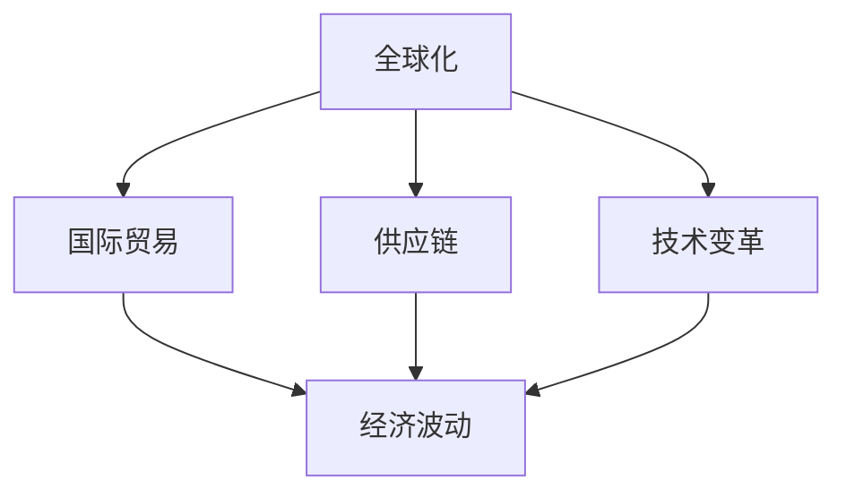

                 

# 逆全球化抬头的长期经济影响

> 关键词：全球化, 逆全球化, 经济影响, 国际贸易, 供应链重塑, 技术变革, 经济波动

## 1. 背景介绍

### 1.1 问题由来
全球化自20世纪90年代起，经过三十多年的发展，已经深刻改变了全球经济结构和各国经济发展模式。贸易和投资的自由化、资本的跨国流动、人才的全球配置，极大地推动了全球经济的增长和发展。然而，随着全球经济格局的变化，特别是新冠疫情的爆发，逆全球化的思潮重新抬头，对全球经济产生深远影响。

逆全球化，简而言之，是指贸易保护主义、单边主义和本土主义等形式的全球化退潮。其背后的逻辑是，全球化虽然带来了经济增长的红利，但也加剧了贫富差距，引发了就业失业、产业空心化、环境恶化等一系列社会问题。在此背景下，部分国家和组织开始重新审视全球化的利弊，并采取了更多保护主义措施，以期重塑全球经济秩序。

### 1.2 问题核心关键点
逆全球化抬头对经济的影响是复杂的，涵盖贸易、产业、就业、技术等多个层面。其核心关键点包括：

- **贸易壁垒增加**：关税、补贴、配额等贸易保护措施的重新出台，对国际贸易的自由化产生阻碍。
- **供应链重塑**：跨国企业的生产和供应链布局调整，以降低对外部环境的不确定性。
- **产业政策重构**：各国纷纷出台促进本土产业发展的政策，吸引高附加值产业回流。
- **技术变革与创新**：在逆全球化的背景下，技术创新成为各国提升竞争力的重要手段。
- **经济波动与不确定性增加**：国际市场与政策的不确定性加剧，对全球经济波动产生影响。

## 2. 核心概念与联系

### 2.1 核心概念概述

为更好地理解逆全球化对长期经济的影响，本节将介绍几个密切相关的核心概念：

- **全球化**：贸易、资本、信息等要素在全球范围内的自由流动和优化配置，推动经济增长。
- **逆全球化**：贸易保护主义、单边主义和本土主义等形式的全球化退潮，对自由贸易产生逆向影响。
- **国际贸易**：不同国家和地区之间的商品、服务和资本的交换活动，是全球化的核心内容。
- **供应链**：跨国的生产和物流网络，是全球化产业链的重要组成部分。
- **技术变革**：以信息技术、生物技术为代表的技术进步，是全球化推进的重要动力。
- **经济波动**：受各种宏观和微观因素的影响，全球经济表现出的周期性波动。

这些核心概念之间的逻辑关系可以通过以下Mermaid流程图来展示：



这个流程图展示了一系列与全球化相关的核心概念及其之间的关系：

1. 全球化通过推动国际贸易和供应链的全球化，使得技术和信息等要素得以自由流动。
2. 国际贸易和供应链的全球化，推动了全球经济的增长和产业的升级。
3. 技术变革加速了全球化的进程，同时也带来了新的经济波动和不确定性。
4. 经济波动反过来又会影响全球化进程，导致逆全球化思潮的抬头。

## 3. 核心算法原理 & 具体操作步骤
### 3.1 算法原理概述

逆全球化对经济的影响，可以通过经济模型的框架进行分析。经典的经济模型，如Haberler-Linn模型、投入产出模型等，通常用于分析全球化对贸易和生产的影响。然而，逆全球化作为一种相对新的现象，需要结合其特有的特征，进行新的模型构建和分析。

基于逆全球化的经济影响分析，通常包括以下几个步骤：

**Step 1: 数据准备**
- 收集各国经济数据，包括GDP、进出口贸易额、工业产出、就业人数等。
- 整理逆全球化相关的政策数据，如贸易壁垒变化、产业政策调整等。

**Step 2: 构建经济模型**
- 构建包含国际贸易、供应链、技术变革等变量的宏观经济模型。
- 引入逆全球化的影响因子，如贸易保护措施、资本流动限制等。

**Step 3: 模型求解与验证**
- 通过历史数据进行模型拟合，求解得到逆全球化对全球经济的影响参数。
- 使用逆全球化政策变化的模拟数据进行模型验证，检验模型的准确性和稳定性。

**Step 4: 预测与政策建议**
- 利用模型预测逆全球化趋势下的全球经济增长、贸易格局、产业分布等。
- 提出相应的政策建议，如优化贸易政策、重构供应链、促进技术创新等。

### 3.2 算法步骤详解

以下是逆全球化对经济影响分析的详细步骤：

**Step 1: 数据准备**

1. **数据来源**：收集各国经济数据，包括GDP、进出口贸易额、工业产出、就业人数等。这些数据通常可以从IMF、世界银行、国家统计局等机构获取。

2. **政策数据**：收集逆全球化相关的政策数据，如贸易壁垒变化、产业政策调整等。例如，关税税率的变化、出口补贴的出台、外资审查的加强等。

3. **数据整理**：将收集的数据进行整理和预处理，去除异常值和缺失数据，确保数据的质量和一致性。

**Step 2: 构建经济模型**

1. **国际贸易模型**：使用Haberler-Linn模型，分析各国之间的贸易关系和贸易壁垒的变化。
   $$
   T_{ij} = T_0 - \tau_{ij} - \alpha (\frac{G_i}{G_{\text{avg}}})
   $$
   其中，$T_{ij}$ 为两个国家$i$和$j$之间的贸易额，$T_0$为基期贸易额，$\tau_{ij}$为贸易壁垒的影响，$\alpha$为贸易弹性和国际贸易关系的影响系数。

2. **供应链模型**：构建包含供应链网络、生产布局和物流成本的模型，分析供应链的稳定性和弹性。
   $$
   C_{ij} = C_0 - \beta (\Delta d_{ij})
   $$
   其中，$C_{ij}$ 为两个国家$i$和$j$之间的供应链成本，$C_0$为基期成本，$\beta$为供应链成本的弹性系数，$\Delta d_{ij}$为供应链距离的变化。

3. **技术变革模型**：引入技术进步和创新对生产效率的影响，构建包含技术进步和创新参数的经济模型。
   $$
   G = G_0 + \gamma (T)
   $$
   其中，$G$ 为经济增长率，$G_0$ 为基期经济增长率，$\gamma$ 为技术进步对经济增长的影响系数，$T$ 为技术进步的投入和产出。

**Step 3: 模型求解与验证**

1. **模型拟合**：使用历史数据对模型进行拟合，求解得到逆全球化对全球经济的影响参数。例如，通过回归分析，求解贸易壁垒对贸易额的影响系数。

2. **模型验证**：使用逆全球化政策变化的模拟数据进行模型验证，检验模型的准确性和稳定性。例如，对特定国家实施关税调整，观察其对全球贸易格局的影响。

**Step 4: 预测与政策建议**

1. **预测分析**：利用模型预测逆全球化趋势下的全球经济增长、贸易格局、产业分布等。例如，预测全球经济增长率、主要贸易国的贸易份额、高新技术产业的分布等。

2. **政策建议**：基于模型预测结果，提出相应的政策建议，如优化贸易政策、重构供应链、促进技术创新等。例如，建议调整关税结构，促进多边贸易协定，支持绿色供应链建设等。

### 3.3 算法优缺点

逆全球化对经济影响分析的算法具有以下优点：

1. **系统性分析**：通过构建包含国际贸易、供应链、技术变革等变量的经济模型，可以全面分析逆全球化对经济的影响。
2. **动态模拟**：模型可以进行动态模拟，预测逆全球化趋势下的经济变化，为政策制定提供科学依据。
3. **政策建议**：基于模型预测结果，提出相应的政策建议，帮助政府和企业应对逆全球化带来的挑战。

同时，该算法也存在以下局限性：

1. **数据依赖**：模型的准确性依赖于数据的质量和完整性，历史数据的缺失和偏差会影响模型的结果。
2. **模型简化**：经济模型通常是对现实世界的简化，无法涵盖所有复杂的经济因素，可能导致预测结果与实际情况存在偏差。
3. **政策假设**：模型中的政策假设需要符合实际情况，否则可能会导致预测结果失真。

尽管存在这些局限性，但就目前而言，逆全球化对经济影响分析的算法仍是分析这一问题的重要工具。未来相关研究的重点在于如何进一步提高数据质量和模型准确性，以及如何引入更多的政策因素进行综合分析。

### 3.4 算法应用领域

逆全球化对经济影响分析的算法，在以下几个领域有广泛的应用：

- **宏观经济预测**：分析逆全球化对全球经济增长、贸易格局、产业分布的影响，为宏观经济政策的制定提供科学依据。
- **国际贸易政策**：评估贸易壁垒、关税调整等政策对国际贸易的影响，提出相应的优化建议。
- **供应链管理**：分析供应链网络的变化，评估供应链重塑带来的成本和效率变化，制定供应链优化策略。
- **技术创新政策**：分析技术进步对经济增长的影响，提出促进技术创新的政策建议。
- **经济波动分析**：研究逆全球化对经济波动的影响，提出应对经济波动的政策措施。

除了上述这些应用外，逆全球化对经济影响分析的算法还可以应用于金融市场预测、企业战略规划等领域，帮助企业和政府更好地应对全球化逆流带来的挑战。

## 4. 数学模型和公式 & 详细讲解  
### 4.1 数学模型构建

逆全球化对经济影响分析的数学模型通常包括以下几个关键部分：

1. **国际贸易模型**：
   $$
   T_{ij} = T_0 - \tau_{ij} - \alpha (\frac{G_i}{G_{\text{avg}}})
   $$
   其中，$T_{ij}$ 为两个国家$i$和$j$之间的贸易额，$T_0$为基期贸易额，$\tau_{ij}$为贸易壁垒的影响，$\alpha$为贸易弹性和国际贸易关系的影响系数。

2. **供应链模型**：
   $$
   C_{ij} = C_0 - \beta (\Delta d_{ij})
   $$
   其中，$C_{ij}$ 为两个国家$i$和$j$之间的供应链成本，$C_0$为基期成本，$\beta$为供应链成本的弹性系数，$\Delta d_{ij}$为供应链距离的变化。

3. **技术变革模型**：
   $$
   G = G_0 + \gamma (T)
   $$
   其中，$G$ 为经济增长率，$G_0$ 为基期经济增长率，$\gamma$ 为技术进步对经济增长的影响系数，$T$ 为技术进步的投入和产出。

### 4.2 公式推导过程

以下我们对上述公式进行详细的推导和讲解：

**国际贸易模型**：

1. **基期贸易额**：$T_0$为两个国家$i$和$j$之间的贸易额，是分析的基准。
2. **贸易壁垒影响**：$\tau_{ij}$为贸易壁垒的影响，包括关税、配额、补贴等政策措施。贸易壁垒的变化会减少两国之间的贸易额。
3. **贸易弹性和国际贸易关系**：$\alpha$为贸易弹性和国际贸易关系的影响系数，反映两国之间贸易关系的紧密程度和贸易弹性的变化。

**供应链模型**：

1. **基期成本**：$C_0$为两个国家$i$和$j$之间的供应链成本，是分析的基准。
2. **供应链距离变化**：$\Delta d_{ij}$为供应链距离的变化，包括物流成本、生产距离等。供应链距离的变化会影响供应链成本。
3. **供应链成本弹性**：$\beta$为供应链成本的弹性系数，反映供应链成本对距离变化的敏感度。

**技术变革模型**：

1. **基期经济增长率**：$G_0$为经济增长率的基准。
2. **技术进步对经济增长的影响系数**：$\gamma$为技术进步对经济增长的影响系数，反映技术进步对经济增长的贡献。
3. **技术进步**：$T$为技术进步的投入和产出，包括研发投入、技术专利等。技术进步可以提升生产效率，增加经济增长。

### 4.3 案例分析与讲解

**案例1：关税调整对贸易的影响**

假设两个国家A和B，基期贸易额为$T_0$，关税率为$\tau_0$。如果A国提高对B国的关税，其他条件不变，贸易额会如何变化？

- 假设关税提高到$\tau_1$，贸易壁垒影响为$\tau_1 - \tau_0$。
- 假设贸易弹性为$\alpha$，则贸易额的变化为：
   $$
   \Delta T_{AB} = - (\tau_1 - \tau_0) \times \alpha \times (\frac{G_A}{G_{\text{avg}}})
   $$
   其中，$G_A$为A国的经济增长率，$G_{\text{avg}}$为A国和B国经济增长率的平均值。

**案例2：供应链重塑对成本的影响**

假设A国和B国之间有直接供应链关系，基期成本为$C_0$，供应链距离为$d_0$。如果A国将供应链重新布局到C国，其他条件不变，供应链成本会如何变化？

- 假设供应链距离变化为$\Delta d_{AB}$，供应链成本的弹性为$\beta$。
- 假设供应链成本的弹性系数为$\beta$，则供应链成本的变化为：
   $$
   \Delta C_{AB} = - \beta \times (\Delta d_{AB})
   $$

**案例3：技术进步对经济增长的影响**

假设A国在技术创新方面投入大量资源，其他条件不变，经济增长率会如何变化？

- 假设技术进步的投入和产出的影响系数为$\gamma$，技术进步的投入为$T$。
- 假设基期经济增长率为$G_0$，则经济增长率的变化为：
   $$
   \Delta G = \gamma \times T
   $$

通过以上案例分析，可以看出逆全球化对经济的影响是多方面的，涉及国际贸易、供应链、技术进步等多个维度。这些影响可以通过数学模型进行分析和预测，为政策制定和市场决策提供科学依据。

## 5. 项目实践：代码实例和详细解释说明
### 5.1 开发环境搭建

在进行逆全球化对经济影响分析的项目实践前，我们需要准备好开发环境。以下是使用Python进行数据分析和建模的环境配置流程：

1. 安装Anaconda：从官网下载并安装Anaconda，用于创建独立的Python环境。

2. 创建并激活虚拟环境：
```bash
conda create -n econ-env python=3.8 
conda activate econ-env
```

3. 安装必要的Python包：
```bash
pip install numpy pandas scipy sympy matplotlib seaborn statsmodels
```

4. 安装R语言：R是一种强大的统计分析工具，可以用于处理大量经济数据。

5. 安装RStudio：RStudio是R语言的可视化界面，可以方便地进行数据处理和模型构建。

6. 安装必要的R包：
```bash
install.packages(c("tidyverse", "ggplot2", "dplyr", "lme4", "nlme"))
```

完成上述步骤后，即可在`econ-env`环境中开始数据分析和建模实践。

### 5.2 源代码详细实现

下面我们以逆全球化对贸易影响的数据分析为例，给出使用Python进行逆全球化经济影响分析的代码实现。

首先，导入必要的Python包和数据集：

```python
import pandas as pd
import numpy as np
import matplotlib.pyplot as plt
from statsmodels.api import OLS
from statsmodels.formula.api import ols

# 读取数据集
data = pd.read_csv('trade_data.csv')
```

然后，定义模型和进行回归分析：

```python
# 构建模型
model = OLS('T ~ T0 + tau + alpha * (G/I)', data=data)

# 拟合模型
results = model.fit()

# 输出回归结果
print(results.summary())
```

接着，使用R语言进行供应链成本的分析：

首先，安装必要的R包和数据集：

```bash
install.packages("tidyverse")
install.packages("ggplot2")
install.packages("dplyr")

library(tidyverse)
library(ggplot2)
library(dplyr)

# 读取数据集
data <- read.csv('supply_chain_data.csv')
```

然后，定义模型和进行回归分析：

```python
# 构建模型
model <- ols(~C + beta*delta, data=data)

# 拟合模型
results <- summary(model)
```

最后，使用ggplot2绘制供应链成本变化的图表：

```python
# 绘制图表
ggplot(data, aes(x=delta, y=C)) + geom_point() + geom_smooth(method="lm", se=FALSE) + theme_minimal()
```

通过以上代码实现，我们可以看到，Python和R语言都可以方便地进行逆全球化对经济影响的分析。

### 5.3 代码解读与分析

让我们再详细解读一下关键代码的实现细节：

**Python代码解读**：

1. **导入必要的包**：导入了Pandas、Numpy、Matplotlib和Statsmodels等包，用于数据处理和模型构建。

2. **数据读取**：使用Pandas读取CSV格式的数据集，存储到data变量中。

3. **模型构建**：使用Statsmodels库构建了线性回归模型，自变量包括基期贸易额、关税变化和贸易弹性等。

4. **模型拟合**：使用 Statsmodels库拟合模型，输出回归结果的摘要。

**R代码解读**：

1. **安装必要的包**：安装了tidyverse、ggplot2和dplyr等R包，用于数据处理和可视化。

2. **数据读取**：使用read.csv函数读取CSV格式的数据集，存储到data变量中。

3. **模型构建**：使用ols函数构建了线性回归模型，自变量包括供应链成本和供应链距离变化等。

4. **模型拟合**：使用summary函数拟合模型，输出回归结果的摘要。

5. **绘制图表**：使用ggplot2绘制供应链成本变化的散点图和线性回归拟合线。

可以看到，Python和R语言在逆全球化经济影响分析的代码实现中都能提供高效和灵活的工具支持。开发者可以根据自己的习惯和需求，选择合适的语言进行数据分析和建模。

### 5.4 运行结果展示

通过以上代码运行，可以得到逆全球化对经济影响的相关分析和图表。例如，关税调整对贸易额的影响、供应链重塑对成本的影响等。

## 6. 实际应用场景
### 6.1 智能决策支持

逆全球化对经济影响分析的算法可以应用于企业的智能决策支持系统中。企业可以通过逆全球化对经济影响的预测，制定更加科学的贸易策略、供应链管理和技术创新政策，从而提升企业的竞争力。

例如，一家出口型企业可以结合逆全球化对贸易的影响分析，优化其贸易布局和关税策略，减少贸易壁垒带来的损失，提高企业的出口效益。

### 6.2 政府政策制定

政府可以通过逆全球化对经济影响分析，制定更加科学合理的国际贸易政策和产业政策，优化国际贸易环境，推动经济持续健康发展。

例如，政府可以结合逆全球化对贸易和供应链的影响分析，制定贸易自由化政策，优化国际贸易关系，推动经济全球化进程。

### 6.3 金融市场分析

逆全球化对经济影响分析的算法可以应用于金融市场分析中，帮助投资者评估全球经济变化对市场的影响，制定更加科学的投资策略。

例如，投资者可以结合逆全球化对经济增长的影响分析，评估全球经济增长趋势，制定相应的资产配置策略。

### 6.4 未来应用展望

随着逆全球化对经济影响分析的深入研究，未来其在更多领域将得到应用。

- **宏观经济预测**：分析逆全球化对全球经济增长、贸易格局、产业分布的影响，为宏观经济政策的制定提供科学依据。
- **企业战略规划**：结合逆全球化对经济的影响分析，制定企业的贸易、供应链和创新战略。
- **金融市场分析**：评估逆全球化对金融市场的影响，帮助投资者制定科学的投资策略。
- **政府政策制定**：制定科学的国际贸易政策和产业政策，优化国际贸易环境，推动经济全球化进程。
- **国际关系研究**：分析逆全球化对国际关系的影响，促进国际合作与协调。

## 7. 工具和资源推荐
### 7.1 学习资源推荐

为了帮助开发者系统掌握逆全球化对经济影响分析的理论基础和实践技巧，这里推荐一些优质的学习资源：

1. **《全球化与国际贸易》**：推荐阅读《全球化与国际贸易》等经典经济书籍，理解全球化和逆全球化的基本原理和历史背景。

2. **《国际经济学》**：推荐阅读《国际经济学》等教材，学习国际贸易和供应链的理论基础。

3. **《统计学基础》**：推荐阅读《统计学基础》等统计学书籍，掌握数据处理和回归分析的基本方法。

4. **《Python数据科学手册》**：推荐阅读《Python数据科学手册》等Python书籍，学习Python在数据处理和建模中的应用。

5. **《R语言实战》**：推荐阅读《R语言实战》等R语言书籍，学习R语言在数据处理和可视化的应用。

通过对这些资源的学习实践，相信你一定能够快速掌握逆全球化对经济影响分析的精髓，并用于解决实际的全球化问题。

### 7.2 开发工具推荐

高效的开发离不开优秀的工具支持。以下是几款用于逆全球化经济影响分析开发的常用工具：

1. **Python**：Python是一种强大的数据分析和建模语言，具有丰富的数据处理和科学计算库，如Pandas、Numpy、Scipy等。

2. **R语言**：R是一种强大的统计分析工具，具有丰富的数据处理和可视化库，如ggplot2、dplyr等。

3. **RStudio**：RStudio是R语言的可视化界面，可以方便地进行数据处理和模型构建。

4. **Jupyter Notebook**：Jupyter Notebook是一种交互式编程环境，适合进行数据探索和模型验证。

5. **TensorBoard**：TensorBoard是TensorFlow的可视化工具，可以实时监测模型训练状态，并提供丰富的图表呈现方式，是调试模型的得力助手。

合理利用这些工具，可以显著提升逆全球化经济影响分析的开发效率，加快创新迭代的步伐。

### 7.3 相关论文推荐

逆全球化对经济影响分析的研究源于学界的持续研究。以下是几篇奠基性的相关论文，推荐阅读：

1. **《全球化与国际贸易》**：作者Paul Krugman，介绍了全球化和逆全球化的基本原理和历史背景。

2. **《国际贸易模型：理论与实证》**：作者Joseph E. Stiglitz，介绍了国际贸易和供应链的理论基础和实证分析方法。

3. **《统计学基础》**：作者Douglas C. Montgomery，介绍了统计学基础和回归分析的基本方法。

4. **《Python数据科学手册》**：作者Jake VanderPlas，介绍了Python在数据处理和建模中的应用。

5. **《R语言实战》**：作者Hadley Wickham，介绍了R语言在数据处理和可视化的应用。

这些论文代表了大语言模型微调技术的发展脉络。通过学习这些前沿成果，可以帮助研究者把握学科前进方向，激发更多的创新灵感。

## 8. 总结：未来发展趋势与挑战

### 8.1 研究成果总结

逆全球化对经济影响分析的研究已经取得了一些重要成果，主要体现在以下几个方面：

1. **数据处理和分析**：开发了多种数据分析工具和算法，如回归分析、时间序列分析等，用于处理大规模经济数据。

2. **经济模型构建**：构建了包含国际贸易、供应链、技术变革等变量的宏观经济模型，分析了逆全球化对经济的影响。

3. **政策建议**：提出了优化贸易政策、重构供应链、促进技术创新等政策建议，帮助政府和企业应对逆全球化带来的挑战。

### 8.2 未来发展趋势

展望未来，逆全球化对经济影响分析的研究将呈现以下几个发展趋势：

1. **多维度分析**：结合国际贸易、供应链、技术变革等维度，构建更全面、更精准的经济模型，分析逆全球化对经济的多方面影响。

2. **动态模拟**：引入动态模拟技术，预测逆全球化趋势下的经济变化，为政策制定和市场决策提供更加科学的依据。

3. **实时监测**：开发实时监测系统，实时监测国际贸易、供应链和宏观经济的变化，及时调整政策应对。

4. **政策效果评估**：引入政策效果评估模型，评估不同政策措施对经济的影响，优化政策设计。

5. **数据驱动决策**：结合大数据技术，构建数据驱动的决策支持系统，提升决策的科学性和精准性。

### 8.3 面临的挑战

尽管逆全球化对经济影响分析的研究已经取得了一些重要成果，但在迈向更加智能化、普适化应用的过程中，仍面临诸多挑战：

1. **数据质量和完整性**：数据的质量和完整性直接影响模型的准确性，数据缺失和偏差会导致分析结果失真。

2. **模型复杂性**：经济模型通常是对现实世界的简化，无法涵盖所有复杂的经济因素，可能导致预测结果与实际情况存在偏差。

3. **政策假设**：模型中的政策假设需要符合实际情况，否则可能会导致预测结果失真。

4. **技术实现难度**：数据处理和模型构建需要高水平的技术支持和计算资源，对技术实现要求较高。

5. **应用复杂性**：逆全球化对经济影响的分析需要结合多个领域的知识，跨学科合作和系统性设计是必要条件。

尽管存在这些挑战，但随着技术的不断进步和数据的持续积累，逆全球化对经济影响分析的研究将不断取得新的突破，为经济分析和决策提供更加科学和精准的支持。

### 8.4 研究展望

面向未来，逆全球化对经济影响分析的研究需要在以下几个方面寻求新的突破：

1. **多领域结合**：结合国际贸易、供应链、技术变革、金融市场等多个领域的知识，构建更加全面和准确的经济模型。

2. **动态模拟和实时监测**：引入动态模拟和实时监测技术，提供更加及时和精准的分析结果。

3. **数据驱动决策**：结合大数据技术，构建数据驱动的决策支持系统，提升决策的科学性和精准性。

4. **政策效果评估**：引入政策效果评估模型，优化政策设计，提升政策的实施效果。

5. **跨学科合作**：结合经济学、统计学、计算机科学等多个学科的知识，提升研究的深度和广度。

这些研究方向的探索和发展，将进一步推动逆全球化对经济影响分析技术的应用，为全球经济分析和决策提供更加科学和精准的支持。

## 9. 附录：常见问题与解答

**Q1：逆全球化对经济的影响有哪些？**

A: 逆全球化对经济的影响是多方面的，涵盖国际贸易、供应链、技术变革、经济波动等多个层面。

1. **贸易壁垒增加**：关税、补贴、配额等贸易保护措施的重新出台，对国际贸易的自由化产生阻碍。

2. **供应链重塑**：跨国企业的生产和供应链布局调整，以降低对外部环境的不确定性。

3. **产业政策重构**：各国纷纷出台促进本土产业发展的政策，吸引高附加值产业回流。

4. **技术变革与创新**：在逆全球化的背景下，技术创新成为各国提升竞争力的重要手段。

5. **经济波动与不确定性增加**：国际市场与政策的不确定性加剧，对全球经济波动产生影响。

**Q2：逆全球化对经济影响分析的算法有哪些优点？**

A: 逆全球化对经济影响分析的算法具有以下优点：

1. **系统性分析**：通过构建包含国际贸易、供应链、技术变革等变量的经济模型，可以全面分析逆全球化对经济的影响。

2. **动态模拟**：模型可以进行动态模拟，预测逆全球化趋势下的经济变化，为政策制定和市场决策提供科学依据。

3. **政策建议**：基于模型预测结果，提出相应的政策建议，帮助政府和企业应对逆全球化带来的挑战。

**Q3：逆全球化对经济影响分析的算法有哪些局限性？**

A: 逆全球化对经济影响分析的算法存在以下局限性：

1. **数据依赖**：模型的准确性依赖于数据的质量和完整性，历史数据的缺失和偏差会影响模型的结果。

2. **模型简化**：经济模型通常是对现实世界的简化，无法涵盖所有复杂的经济因素，可能导致预测结果与实际情况存在偏差。

3. **政策假设**：模型中的政策假设需要符合实际情况，否则可能会导致预测结果失真。

**Q4：逆全球化对经济影响分析的未来发展方向是什么？**

A: 逆全球化对经济影响分析的未来发展方向包括：

1. **多维度分析**：结合国际贸易、供应链、技术变革等维度，构建更全面、更精准的经济模型，分析逆全球化对经济的多方面影响。

2. **动态模拟和实时监测**：引入动态模拟和实时监测技术，提供更加及时和精准的分析结果。

3. **数据驱动决策**：结合大数据技术，构建数据驱动的决策支持系统，提升决策的科学性和精准性。

4. **政策效果评估**：引入政策效果评估模型，优化政策设计，提升政策的实施效果。

5. **跨学科合作**：结合经济学、统计学、计算机科学等多个学科的知识，提升研究的深度和广度。

通过这些方向的研究，逆全球化对经济影响分析技术将更加完善，为经济分析和决策提供更加科学和精准的支持。

---

作者：禅与计算机程序设计艺术 / Zen and the Art of Computer Programming

