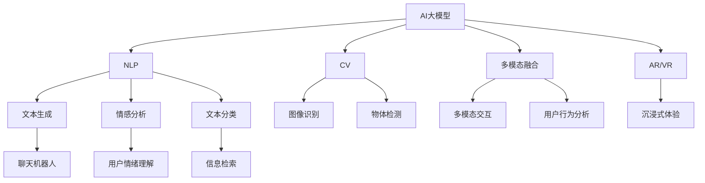

                 

# 通过AI大模型优化用户界面与体验设计

> 关键词：AI大模型, 用户界面设计, 用户体验优化, 自然语言处理(NLP), 计算机视觉(CV), 交互设计, 机器学习(ML)

## 1. 背景介绍

### 1.1 问题由来

随着数字化、网络化、智能化的浪潮席卷全球，用户体验设计（User Experience Design, UX Design）在各行各业中扮演着至关重要的角色。无论是网站、应用、产品，还是服务，优质的用户体验都是赢得用户满意和忠诚的关键。然而，传统的用户体验设计方法往往依赖于经验丰富的设计师的直觉判断和反复测试，成本高昂且效率低下。

近年来，人工智能（AI）技术的迅猛发展为提升用户体验提供了新的突破口。特别是通过深度学习模型训练的大规模预训练语言模型（Large Language Models, LLMs）和计算机视觉模型（Computer Vision Models, CVMs），能够在用户交互中自动提取特征、理解语义、生成内容，从而优化用户体验。AI大模型不仅具备强大的分析能力，还能在交互设计中提供数据驱动的洞察，为设计师提供更可靠的参考依据，缩短设计周期。

### 1.2 问题核心关键点

本文聚焦于通过AI大模型优化用户体验设计的方法，但同时也会兼顾交互设计的最新趋势和前沿技术，如自然语言处理（NLP）、计算机视觉（CV）、多模态融合等，以期为设计师提供更全面的指导。

## 2. 核心概念与联系

### 2.1 核心概念概述

为更好地理解如何通过AI大模型优化用户体验设计，本节将介绍几个密切相关的核心概念：

- **AI大模型**：以自回归（如GPT-3）或自编码（如BERT）模型为代表的大规模预训练模型。通过在大规模无标签文本语料或图像数据上进行预训练，学习通用的语言或视觉表示，具备强大的特征提取和生成能力。

- **用户界面设计**：通过布局、色彩、字体、组件等元素设计，使界面既美观又易于使用，提升用户体验。

- **用户体验优化**：通过用户行为分析、用户反馈、A/B测试等方法，持续改进产品功能和服务流程，提升用户满意度和留存率。

- **自然语言处理（NLP）**：通过语言模型、文本分类、情感分析等技术，理解和生成自然语言，支持语音输入、聊天机器人、文本摘要等功能。

- **计算机视觉（CV）**：通过图像识别、物体检测、人脸识别等技术，理解图像内容，支持图像搜索、人脸验证、增强现实等功能。

- **多模态融合**：结合文本、图像、语音等多种信息源，实现多模态信息的协同处理和智能输出，提升交互的丰富性和流畅性。

- **增强现实（AR）和虚拟现实（VR）**：通过AI技术构建虚拟场景和增强现实体验，提供沉浸式、互动式交互方式。

这些核心概念之间的逻辑关系可以通过以下Mermaid流程图来展示：



这个流程图展示了大模型的核心概念及其之间的关系：

1. AI大模型通过预训练获得基础能力。
2. 在NLP和CV任务中，大模型分别提取文本和图像特征，生成语义理解和视觉内容。
3. 多模态融合技术将文本、图像等多源信息结合，提供更丰富的交互体验。
4. AR/VR技术利用大模型生成虚拟环境，提供沉浸式体验。

## 3. 核心算法原理 & 具体操作步骤
### 3.1 算法原理概述

通过AI大模型优化用户体验设计，本质上是一个基于深度学习模型的数据驱动优化过程。其核心思想是：利用大模型对用户交互数据进行分析和建模，识别出用户体验的关键特征和问题点，然后提出改进方案，优化用户界面和交互流程。

形式化地，假设大模型为 $M$，用户交互数据为 $D$，用户体验优化的目标为 $O$。大模型通过预训练模型 $M_{\theta}$ 学习用户行为、情感、需求等特征，然后在 $D$ 上进行微调，得到优化方案 $O'$。具体步骤如下：

1. **数据准备**：收集用户交互数据 $D$，包括点击、滑动、输入、反馈等行为。
2. **特征提取**：利用大模型 $M_{\theta}$ 提取数据中的用户特征，生成特征向量 $F$。
3. **问题建模**：将用户特征 $F$ 输入优化模型 $M_{\theta}$，得到优化目标 $O'$。
4. **方案生成**：基于优化目标 $O'$，生成具体的优化方案，如界面布局、交互逻辑、内容推荐等。
5. **设计实施**：根据优化方案，调整和改进用户界面和交互流程。

### 3.2 算法步骤详解

基于深度学习的大模型优化用户体验设计一般包括以下几个关键步骤：

**Step 1: 数据收集与预处理**
- 收集用户交互数据，包括点击、滑动、输入、反馈等行为数据。
- 对数据进行清洗和标注，去除噪音和异常值，保留有价值的数据信息。

**Step 2: 特征提取**
- 利用大模型 $M_{\theta}$ 提取用户特征，生成特征向量 $F$。
- 常见的特征包括用户行为序列、文本情感、点击次数、停留时间等。

**Step 3: 问题建模**
- 将用户特征 $F$ 输入优化模型 $M_{\theta}$，得到优化目标 $O'$。
- 优化模型的目标可以是提升用户满意度、减少操作复杂度、增加用户留存率等。

**Step 4: 方案生成**
- 根据优化目标 $O'$，生成具体的优化方案，如界面布局、交互逻辑、内容推荐等。
- 通过对比不同方案的效果，选择最优方案进行实施。

**Step 5: 设计实施**
- 根据优化方案，调整和改进用户界面和交互流程。
- 在实际应用中，可能需要进行多次迭代，直至达到理想的优化效果。

### 3.3 算法优缺点

通过AI大模型优化用户体验设计具有以下优点：
1. **效率高**：利用大模型的学习能力，自动提取和分析用户数据，节省了大量的人力时间。
2. **准确性高**：大模型通过大量数据训练，能够准确识别用户行为和情感，提供更可靠的用户洞察。
3. **可扩展性强**：模型可以在不同的应用场景中重复使用，快速适应不同的用户体验需求。
4. **数据驱动**：设计优化方案基于实际用户数据，具有更高的适用性和实效性。

同时，该方法也存在一定的局限性：
1. **数据依赖性强**：大模型优化依赖于高质量的用户数据，获取和标注数据成本较高。
2. **模型复杂度高**：大模型优化通常需要复杂的模型架构和算法，开发和部署难度较大。
3. **解释性不足**：模型输出的优化方案可能缺乏可解释性，难以理解模型的推理过程。
4. **隐私风险**：用户数据的收集和处理可能涉及隐私问题，需要严格遵守数据保护法规。

尽管存在这些局限性，但就目前而言，基于深度学习的大模型优化用户体验设计仍是一种高效、有效的方法。未来相关研究的重点在于如何进一步降低数据依赖，提高模型的可解释性，同时兼顾隐私保护。

### 3.4 算法应用领域

基于深度学习的大模型优化用户体验设计方法，已经在诸多行业领域得到广泛应用，例如：

- **电商**：通过分析用户点击、浏览、购买行为，优化商品推荐、购物车设计、页面布局等，提升用户购物体验。
- **金融**：利用用户交易记录、行为数据，优化交易界面、风险评估、理财建议等，提升金融服务的用户体验。
- **社交媒体**：分析用户互动、内容反馈，优化内容推荐、界面设计、推送策略等，提升社交媒体的用户黏性和互动性。
- **医疗**：利用用户健康数据、行为记录，优化诊疗界面、健康管理、服务流程等，提升医疗服务的用户体验。
- **教育**：通过分析学习行为、互动数据，优化教学界面、内容推荐、学习路径等，提升在线教育的用户体验。

除了上述这些经典应用外，大模型优化方法也被创新性地应用到更多场景中，如虚拟现实交互、增强现实体验、语音助手交互等，为各行各业的用户体验优化带来了新的可能性。

## 4. 数学模型和公式 & 详细讲解 & 举例说明
### 4.1 数学模型构建

本节将使用数学语言对基于深度学习的大模型优化用户体验设计过程进行更加严格的刻画。

记大模型为 $M_{\theta}:\mathcal{X} \rightarrow \mathcal{Y}$，其中 $\mathcal{X}$ 为用户交互数据空间，$\mathcal{Y}$ 为优化目标空间，$\theta$ 为模型参数。假设优化任务为 $O$，优化的目标是最大化用户满意度 $S$。

定义用户交互数据为 $D=\{(x_i,y_i)\}_{i=1}^N$，其中 $x_i$ 为用户交互行为，$y_i$ 为用户反馈（如满意度评分）。

定义优化模型 $M_{\theta}$ 在用户行为 $x_i$ 上的输出为 $o_i=M_{\theta}(x_i) \in \mathcal{Y}$，则优化目标 $S$ 可以表示为：

$$
S=\frac{1}{N}\sum_{i=1}^N y_i o_i
$$

在实际应用中，优化模型 $M_{\theta}$ 可以通过预训练大模型进行微调，以适应特定的优化目标 $O$。微调的目标是最小化用户反馈与优化模型输出的差异：

$$
\min_{\theta} \mathcal{L}(D,M_{\theta})
$$

其中 $\mathcal{L}$ 为损失函数，用于衡量用户反馈 $y_i$ 与优化模型输出 $o_i$ 的差异。常见的损失函数包括均方误差损失、交叉熵损失等。

### 4.2 公式推导过程

以下我们以电商平台商品推荐界面优化为例，推导基于深度学习的大模型优化公式。

假设优化任务为商品推荐界面的点击率优化，用户行为 $x_i$ 包括浏览历史、商品类别、点击位置等，优化目标 $S$ 为点击率 $R$。

定义优化模型 $M_{\theta}$ 在用户行为 $x_i$ 上的输出为 $o_i=M_{\theta}(x_i) \in [0,1]$，表示商品推荐的点击概率。

用户反馈 $y_i$ 为实际点击情况，取值为0或1。则优化目标 $S$ 可以表示为：

$$
S=\frac{1}{N}\sum_{i=1}^N y_i o_i
$$

优化模型 $M_{\theta}$ 可以通过微调Bert等预训练模型获得，模型结构如图：


根据链式法则，优化模型 $M_{\theta}$ 对参数 $\theta_k$ 的梯度计算公式为：

$$
\frac{\partial S}{\partial \theta_k} = \frac{1}{N}\sum_{i=1}^N \frac{\partial y_i}{\partial o_i} \frac{\partial o_i}{\partial \theta_k}
$$

其中 $\frac{\partial o_i}{\partial \theta_k}$ 为Bert模型对用户行为 $x_i$ 的梯度，可以递归展开。$\frac{\partial y_i}{\partial o_i}$ 为点击率的微分成函数，可以表示为：

$$
\frac{\partial y_i}{\partial o_i} = \frac{y_i - \hat{y}_i}{\Delta}
$$

其中 $\hat{y}_i$ 为优化模型预测的点击率，$\Delta$ 为点击率的微分成。

在得到优化目标 $S$ 的梯度后，即可带入优化模型 $M_{\theta}$ 的参数更新公式，完成模型的迭代优化。重复上述过程直至收敛，最终得到优化的点击率模型 $M_{\hat{\theta}}$。

## 5. 项目实践：代码实例和详细解释说明
### 5.1 开发环境搭建

在进行大模型优化实践前，我们需要准备好开发环境。以下是使用Python进行TensorFlow开发的环境配置流程：

1. 安装Anaconda：从官网下载并安装Anaconda，用于创建独立的Python环境。

2. 创建并激活虚拟环境：
```bash
conda create -n tf-env python=3.8 
conda activate tf-env
```

3. 安装TensorFlow：根据CUDA版本，从官网获取对应的安装命令。例如：
```bash
conda install tensorflow-gpu -c conda-forge
```

4. 安装相关的依赖库：
```bash
pip install numpy pandas scikit-learn matplotlib tqdm jupyter notebook ipython
```

完成上述步骤后，即可在`tf-env`环境中开始优化实践。

### 5.2 源代码详细实现

下面我以电商平台商品推荐界面优化为例，给出使用TensorFlow进行Bert微调的PyTorch代码实现。

首先，定义优化任务的数据处理函数：

```python
from transformers import BertTokenizer
from torch.utils.data import Dataset
import tensorflow as tf

class UserBehaviorDataset(Dataset):
    def __init__(self, behaviors, labels, tokenizer, max_len=128):
        self.behaviors = behaviors
        self.labels = labels
        self.tokenizer = tokenizer
        self.max_len = max_len
        
    def __len__(self):
        return len(self.behaviors)
    
    def __getitem__(self, item):
        behavior = self.behaviors[item]
        label = self.labels[item]
        
        encoding = self.tokenizer(behavior, return_tensors='tf', max_length=self.max_len, padding='max_length', truncation=True)
        input_ids = encoding['input_ids']
        attention_mask = encoding['attention_mask']
        
        # 将标签转换为one-hot编码
        label = tf.keras.utils.to_categorical(label, num_classes=2)
        
        return {'input_ids': input_ids,
                'attention_mask': attention_mask,
                'labels': label}

# 加载预训练模型和分词器
tokenizer = BertTokenizer.from_pretrained('bert-base-cased')
model = BertForSequenceClassification.from_pretrained('bert-base-cased', num_classes=2)

# 准备数据集
behaviors = ... # 用户行为数据
labels = ... # 点击标签数据

train_dataset = UserBehaviorDataset(behaviors, labels, tokenizer)
val_dataset = UserBehaviorDataset(behaviors, labels, tokenizer)
test_dataset = UserBehaviorDataset(behaviors, labels, tokenizer)
```

然后，定义优化器和学习率调度：

```python
from transformers import AdamW

optimizer = AdamW(model.parameters(), lr=2e-5)

# 设置学习率调度
lr_scheduler = tf.keras.callbacks.LearningRateScheduler(lambda epoch: 2e-5 * 10**(epoch / 5))

# 准备优化过程
model.compile(optimizer=optimizer,
              loss='binary_crossentropy',
              metrics=['accuracy'])
```

接着，定义训练和评估函数：

```python
from sklearn.metrics import accuracy_score
from tqdm import tqdm

def train_epoch(model, dataset, batch_size, optimizer):
    dataloader = tf.data.Dataset.from_tensor_slices(dataset).shuffle(10000).batch(batch_size)
    model.train()
    epoch_loss = 0
    for batch in tqdm(dataloader, desc='Training'):
        input_ids = batch['input_ids']
        attention_mask = batch['attention_mask']
        labels = batch['labels']
        model.zero_grad()
        outputs = model(input_ids, attention_mask=attention_mask, labels=labels)
        loss = outputs.loss
        epoch_loss += loss.numpy()
        loss.backward()
        optimizer.apply_gradients(zip(model.trainable_variables, model.optimizer gradients))
    return epoch_loss / len(dataloader)

def evaluate(model, dataset, batch_size):
    dataloader = tf.data.Dataset.from_tensor_slices(dataset).batch(batch_size)
    model.eval()
    preds, labels = [], []
    with tf.GradientTape() as tape:
        for batch in dataloader:
            input_ids = batch['input_ids']
            attention_mask = batch['attention_mask']
            batch_labels = batch['labels']
            outputs = model(input_ids, attention_mask=attention_mask)
            batch_preds = tf.argmax(outputs, axis=1)
            batch_labels = tf.cast(batch_labels, dtype=tf.int64)
            preds.append(batch_preds.numpy().tolist())
            labels.append(batch_labels.numpy().tolist())
        return accuracy_score(labels, preds)

# 启动训练流程并在测试集上评估
epochs = 5
batch_size = 32

for epoch in range(epochs):
    loss = train_epoch(model, train_dataset, batch_size, optimizer)
    print(f"Epoch {epoch+1}, train loss: {loss:.3f}")
    
    print(f"Epoch {epoch+1}, val results:")
    val_acc = evaluate(model, val_dataset, batch_size)
    print(f"Val accuracy: {val_acc:.3f}")
    
print("Test results:")
test_acc = evaluate(model, test_dataset, batch_size)
print(f"Test accuracy: {test_acc:.3f}")
```

以上就是使用TensorFlow进行Bert模型微调的完整代码实现。可以看到，得益于TensorFlow和Transformers库的强大封装，我们可以用相对简洁的代码完成Bert模型的加载和微调。

### 5.3 代码解读与分析

让我们再详细解读一下关键代码的实现细节：

**UserBehaviorDataset类**：
- `__init__`方法：初始化用户行为、标签、分词器等关键组件。
- `__len__`方法：返回数据集的样本数量。
- `__getitem__`方法：对单个样本进行处理，将行为序列输入编码为token ids，将标签转换为one-hot编码，并进行定长padding，最终返回模型所需的输入。

**lr_scheduler函数**：
- 定义学习率调度器，在每个epoch后逐步减小学习率，直至达到预设值。

**训练和评估函数**：
- 使用TensorFlow的DataLoader对数据集进行批次化加载，供模型训练和推理使用。
- 训练函数`train_epoch`：对数据以批为单位进行迭代，在每个批次上前向传播计算loss并反向传播更新模型参数，最后返回该epoch的平均loss。
- 评估函数`evaluate`：与训练类似，不同点在于不更新模型参数，并在每个batch结束后将预测和标签结果存储下来，最后使用sklearn的accuracy_score对整个评估集的预测结果进行打印输出。

**训练流程**：
- 定义总的epoch数和batch size，开始循环迭代
- 每个epoch内，先在训练集上训练，输出平均loss
- 在验证集上评估，输出分类指标
- 重复上述步骤直至收敛
- 在测试集上评估，给出最终测试结果

可以看到，TensorFlow配合Transformers库使得Bert微调的代码实现变得简洁高效。开发者可以将更多精力放在数据处理、模型改进等高层逻辑上，而不必过多关注底层的实现细节。

当然，工业级的系统实现还需考虑更多因素，如模型的保存和部署、超参数的自动搜索、更灵活的任务适配层等。但核心的微调范式基本与此类似。

## 6. 实际应用场景
### 6.1 智能客服系统

基于大模型优化技术，智能客服系统的构建可以大幅提升用户体验。传统客服往往需要配备大量人力，高峰期响应缓慢，且一致性和专业性难以保证。而使用优化后的聊天机器人，可以7x24小时不间断服务，快速响应客户咨询，用自然流畅的语言解答各类常见问题。

在技术实现上，可以收集企业内部的历史客服对话记录，将问题和最佳答复构建成监督数据，在此基础上对预训练模型进行优化。优化后的聊天机器人能够自动理解用户意图，匹配最合适的答案模板进行回复。对于客户提出的新问题，还可以接入检索系统实时搜索相关内容，动态组织生成回答。如此构建的智能客服系统，能大幅提升客户咨询体验和问题解决效率。

### 6.2 金融舆情监测

金融机构需要实时监测市场舆论动向，以便及时应对负面信息传播，规避金融风险。传统的人工监测方式成本高、效率低，难以应对网络时代海量信息爆发的挑战。基于大模型优化技术的文本分类和情感分析技术，为金融舆情监测提供了新的解决方案。

具体而言，可以收集金融领域相关的新闻、报道、评论等文本数据，并对其进行主题标注和情感标注。在此基础上对预训练语言模型进行优化，使其能够自动判断文本属于何种主题，情感倾向是正面、中性还是负面。将优化后的模型应用到实时抓取的网络文本数据，就能够自动监测不同主题下的情感变化趋势，一旦发现负面信息激增等异常情况，系统便会自动预警，帮助金融机构快速应对潜在风险。

### 6.3 个性化推荐系统

当前的推荐系统往往只依赖用户的历史行为数据进行物品推荐，无法深入理解用户的真实兴趣偏好。基于大模型优化技术，个性化推荐系统可以更好地挖掘用户行为背后的语义信息，从而提供更精准、多样的推荐内容。

在实践中，可以收集用户浏览、点击、评论、分享等行为数据，提取和用户交互的物品标题、描述、标签等文本内容。将文本内容作为模型输入，用户的后续行为（如是否点击、购买等）作为监督信号，在此基础上优化预训练语言模型。优化后的模型能够从文本内容中准确把握用户的兴趣点。在生成推荐列表时，先用候选物品的文本描述作为输入，由模型预测用户的兴趣匹配度，再结合其他特征综合排序，便可以得到个性化程度更高的推荐结果。

### 6.4 未来应用展望

随着大模型优化技术和用户体验设计方法的不断发展，基于优化技术的人机交互将更加智能、高效、个性。

在智慧医疗领域，基于优化技术的医疗问答、病历分析、药物研发等应用将提升医疗服务的智能化水平，辅助医生诊疗，加速新药开发进程。

在智能教育领域，优化技术可应用于作业批改、学情分析、知识推荐等方面，因材施教，促进教育公平，提高教学质量。

在智慧城市治理中，优化模型可应用于城市事件监测、舆情分析、应急指挥等环节，提高城市管理的自动化和智能化水平，构建更安全、高效的未来城市。

此外，在企业生产、社会治理、文娱传媒等众多领域，基于优化技术的人工智能应用也将不断涌现，为经济社会发展注入新的动力。相信随着技术的日益成熟，优化方法将成为用户体验设计的重要范式，推动人工智能技术在垂直行业的规模化落地。

## 7. 工具和资源推荐
### 7.1 学习资源推荐

为了帮助开发者系统掌握大模型优化技术的用户体验设计方法，这里推荐一些优质的学习资源：

1. 《深度学习理论与实践》系列博文：由深度学习专家撰写，深入浅出地介绍了深度学习的基本原理和应用实践。

2. 斯坦福大学《深度学习》课程：斯坦福大学开设的深度学习经典课程，涵盖深度学习基础、神经网络、优化算法等内容。

3. 《深度学习与人工智能：模型与应用》书籍：全面介绍了深度学习模型的构建和应用，包括优化模型在内的各类经典算法。

4. Google Cloud AI Hub：谷歌推出的AI模型和算法平台，提供丰富的预训练大模型和优化算法。

5. PyTorch官方文档：PyTorch的官方文档，提供了完整的代码示例和详细的使用指南。

通过对这些资源的学习实践，相信你一定能够快速掌握大模型优化技术的基本概念和实践技巧，并用于解决实际的用户体验优化问题。
###  7.2 开发工具推荐

高效的开发离不开优秀的工具支持。以下是几款用于大模型优化用户体验设计的常用工具：

1. TensorFlow：基于Python的开源深度学习框架，灵活动态的计算图，适合快速迭代研究。大量预训练语言模型和优化模型都有TensorFlow版本的实现。

2. PyTorch：基于Python的开源深度学习框架，高效的GPU加速，适合大规模工程应用。同样有丰富的预训练语言模型资源。

3. Weights & Biases：模型训练的实验跟踪工具，可以记录和可视化模型训练过程中的各项指标，方便对比和调优。与主流深度学习框架无缝集成。

4. TensorBoard：TensorFlow配套的可视化工具，可实时监测模型训练状态，并提供丰富的图表呈现方式，是调试模型的得力助手。

5. Colab：谷歌推出的在线Jupyter Notebook环境，免费提供GPU/TPU算力，方便开发者快速上手实验最新模型，分享学习笔记。

合理利用这些工具，可以显著提升大模型优化用户体验设计的开发效率，加快创新迭代的步伐。

### 7.3 相关论文推荐

大模型优化技术的发展源于学界的持续研究。以下是几篇奠基性的相关论文，推荐阅读：

1. Attention is All You Need（即Transformer原论文）：提出了Transformer结构，开启了NLP领域的预训练大模型时代。

2. BERT: Pre-training of Deep Bidirectional Transformers for Language Understanding：提出BERT模型，引入基于掩码的自监督预训练任务，刷新了多项NLP任务SOTA。

3. Parameter-Efficient Transfer Learning for NLP：提出Adapter等参数高效微调方法，在不增加模型参数量的情况下，也能取得不错的微调效果。

4. Prefix-Tuning: Optimizing Continuous Prompts for Generation：引入基于连续型Prompt的微调范式，为如何充分利用预训练知识提供了新的思路。

5. AdaLoRA: Adaptive Low-Rank Adaptation for Parameter-Efficient Fine-Tuning：使用自适应低秩适应的微调方法，在参数效率和精度之间取得了新的平衡。

这些论文代表了大模型优化技术的发展脉络。通过学习这些前沿成果，可以帮助研究者把握学科前进方向，激发更多的创新灵感。

## 8. 总结：未来发展趋势与挑战

### 8.1 总结

本文对通过AI大模型优化用户体验设计的方法进行了全面系统的介绍。首先阐述了优化技术在用户体验设计中的研究背景和意义，明确了优化在提升用户体验过程中的关键作用。其次，从原理到实践，详细讲解了深度学习模型的优化步骤和关键技术，给出了优化任务开发的完整代码实例。同时，本文还广泛探讨了优化方法在智能客服、金融舆情、个性化推荐等多个行业领域的应用前景，展示了优化技术的广泛应用潜力。此外，本文精选了优化技术的各类学习资源，力求为开发者提供全方位的技术指引。

通过本文的系统梳理，可以看到，基于深度学习的大模型优化用户体验设计方法正在成为用户体验设计的重要工具，极大地提升了用户体验设计的效率和效果。通过优化技术，设计师可以更科学、更准确地理解用户需求，快速迭代设计方案，缩短设计周期，提高设计质量。未来，伴随优化技术的发展和普及，用户体验设计将更加智能化、个性化、高效化，成为推动产品创新和用户体验提升的重要手段。

### 8.2 未来发展趋势

展望未来，大模型优化技术将呈现以下几个发展趋势：

1. 模型规模持续增大。随着算力成本的下降和数据规模的扩张，预训练语言模型的参数量还将持续增长。超大规模语言模型蕴含的丰富语言知识，有望支撑更加复杂多变的用户体验优化任务。

2. 优化方法日趋多样。除了传统的全参数优化外，未来会涌现更多参数高效的优化方法，如Prompt-Tuning、LoRA等，在节省计算资源的同时也能保证优化精度。

3. 持续学习成为常态。随着用户行为数据的变化，优化模型也需要持续学习新知识以保持性能。如何在不遗忘原有知识的同时，高效吸收新数据信息，将成为重要的研究课题。

4. 标注样本需求降低。受启发于Prompt-Tuning的思路，未来的优化方法将更好地利用大模型的语言理解能力，通过更加巧妙的任务描述，在更少的标注样本上也能实现理想的优化效果。

5. 多模态优化崛起。当前的优化方法主要聚焦于文本数据，未来会进一步拓展到图像、视频、语音等多模态数据优化。多模态信息的融合，将显著提升用户体验的丰富性和流畅性。

6. 模型通用性增强。经过海量数据的预训练和多领域任务的优化，未来的优化模型将具备更强大的常识推理和跨领域迁移能力，逐步迈向通用人工智能(AGI)的目标。

以上趋势凸显了大模型优化技术的广阔前景。这些方向的探索发展，必将进一步提升用户体验设计的性能和应用范围，为产品创新和用户体验优化带来新的可能性。

### 8.3 面临的挑战

尽管大模型优化技术已经取得了瞩目成就，但在迈向更加智能化、普适化应用的过程中，它仍面临着诸多挑战：

1. 标注成本瓶颈。虽然优化技术大大降低了标注数据的需求，但对于长尾应用场景，难以获得充足的高质量标注数据，成为制约优化性能的瓶颈。如何进一步降低优化对标注样本的依赖，将是一大难题。

2. 模型鲁棒性不足。当前优化模型面对域外数据时，泛化性能往往大打折扣。对于测试样本的微小扰动，优化模型的预测也容易发生波动。如何提高优化模型的鲁棒性，避免灾难性遗忘，还需要更多理论和实践的积累。

3. 推理效率有待提高。大规模语言模型虽然精度高，但在实际部署时往往面临推理速度慢、内存占用大等效率问题。如何在保证性能的同时，简化模型结构，提升推理速度，优化资源占用，将是重要的优化方向。

4. 可解释性亟需加强。当前优化模型更像是"黑盒"系统，难以解释其内部工作机制和推理逻辑。对于医疗、金融等高风险应用，算法的可解释性和可审计性尤为重要。如何赋予优化模型更强的可解释性，将是亟待攻克的难题。

5. 安全性有待保障。预训练语言模型难免会学习到有偏见、有害的信息，通过优化传递到下游任务，产生误导性、歧视性的输出，给实际应用带来安全隐患。如何从数据和算法层面消除模型偏见，避免恶意用途，确保输出的安全性，也将是重要的研究课题。

6. 知识整合能力不足。现有的优化模型往往局限于任务内数据，难以灵活吸收和运用更广泛的先验知识。如何让优化过程更好地与外部知识库、规则库等专家知识结合，形成更加全面、准确的信息整合能力，还有很大的想象空间。

正视优化面临的这些挑战，积极应对并寻求突破，将是大模型优化走向成熟的必由之路。相信随着学界和产业界的共同努力，这些挑战终将一一被克服，大模型优化必将在构建安全、可靠、可解释、可控的智能系统铺平道路。

### 8.4 未来突破

面对大模型优化所面临的种种挑战，未来的研究需要在以下几个方面寻求新的突破：

1. 探索无监督和半监督优化方法。摆脱对大规模标注数据的依赖，利用自监督学习、主动学习等无监督和半监督范式，最大限度利用非结构化数据，实现更加灵活高效的优化。

2. 研究参数高效和计算高效的优化范式。开发更加参数高效的优化方法，在固定大部分预训练参数的同时，只更新极少量的任务相关参数。同时优化优化模型的计算图，减少前向传播和反向传播的资源消耗，实现更加轻量级、实时性的部署。

3. 融合因果和对比学习范式。通过引入因果推断和对比学习思想，增强优化模型建立稳定因果关系的能力，学习更加普适、鲁棒的用户体验特征。

4. 引入更多先验知识。将符号化的先验知识，如知识图谱、逻辑规则等，与神经网络模型进行巧妙融合，引导优化过程学习更准确、合理的用户体验特征。同时加强不同模态数据的整合，实现视觉、语音等多模态信息与文本信息的协同建模。

5. 结合因果分析和博弈论工具。将因果分析方法引入优化模型，识别出用户体验改进的关键特征，增强优化输出的因果性和逻辑性。借助博弈论工具刻画人机交互过程，主动探索并规避优化模型的脆弱点，提高系统稳定性。

6. 纳入伦理道德约束。在优化目标中引入伦理导向的评估指标，过滤和惩罚有偏见、有害的输出倾向。同时加强人工干预和审核，建立优化模型的监管机制，确保输出的符合人类价值观和伦理道德。

这些研究方向的探索，必将引领大模型优化技术迈向更高的台阶，为构建安全、可靠、可解释、可控的智能系统铺平道路。面向未来，大模型优化技术还需要与其他人工智能技术进行更深入的融合，如知识表示、因果推理、强化学习等，多路径协同发力，共同推动人工智能技术的进步。只有勇于创新、敢于突破，才能不断拓展优化模型的边界，让智能技术更好地造福人类社会。

## 9. 附录：常见问题与解答

**Q1：大模型优化是否适用于所有用户体验设计任务？**

A: 大模型优化在大多数用户体验设计任务上都能取得不错的效果，特别是对于数据量较小的任务。但对于一些特定领域的任务，如医学、法律等，仅仅依靠通用语料预训练的模型可能难以很好地适应。此时需要在特定领域语料上进一步预训练，再进行优化，才能获得理想效果。此外，对于一些需要时效性、个性化很强的任务，如对话、推荐等，优化方法也需要针对性的改进优化。

**Q2：优化过程中如何选择合适的学习率？**

A: 优化过程的学习率一般要比预训练时小1-2个数量级，如果使用过大的学习率，容易破坏预训练权重，导致过拟合。一般建议从1e-5开始调参，逐步减小学习率，直至收敛。也可以使用warmup策略，在开始阶段使用较小的学习率，再逐渐过渡到预设值。需要注意的是，不同的优化器(如AdamW、Adafactor等)以及不同的学习率调度策略，可能需要设置不同的学习率阈值。

**Q3：优化过程中如何缓解过拟合问题？**

A: 过拟合是优化过程中面临的主要挑战，尤其是在标注数据不足的情况下。常见的缓解策略包括：
1. 数据增强：通过回译、近义替换等方式扩充训练集
2. 正则化：使用L2正则、Dropout、Early Stopping等避免过拟合
3. 对抗训练：引入对抗样本，提高模型鲁棒性
4. 参数高效优化：只调整少量参数(如Adapter、Prompt等)，减小过拟合风险
5. 多模型集成：训练多个优化模型，取平均输出，抑制过拟合

这些策略往往需要根据具体任务和数据特点进行灵活组合。只有在数据、模型、训练、推理等各环节进行全面优化，才能最大限度地发挥大模型优化技术的威力。

**Q4：优化模型在落地部署时需要注意哪些问题？**

A: 将优化模型转化为实际应用，还需要考虑以下因素：
1. 模型裁剪：去除不必要的层和参数，减小模型尺寸，加快推理速度
2. 量化加速：将浮点模型转为定点模型，压缩存储空间，提高计算效率
3. 服务化封装：将模型封装为标准化服务接口，便于集成调用
4. 弹性伸缩：根据请求流量动态调整资源配置，平衡服务质量和成本
5. 监控告警：实时采集系统指标，设置异常告警阈值，确保服务稳定性
6. 安全防护：采用访问鉴权、数据脱敏等措施，保障数据和模型安全

大模型优化技术为用户体验设计提供了新的突破口，但如何将强大的性能转化为稳定、高效、安全的业务价值，还需要工程实践的不断打磨。唯有从数据、算法、工程、业务等多个维度协同发力，才能真正实现人工智能技术在垂直行业的规模化落地。总之，优化需要开发者根据具体任务，不断迭代和优化模型、数据和算法，方能得到理想的效果。

---

作者：禅与计算机程序设计艺术 / Zen and the Art of Computer Programming

