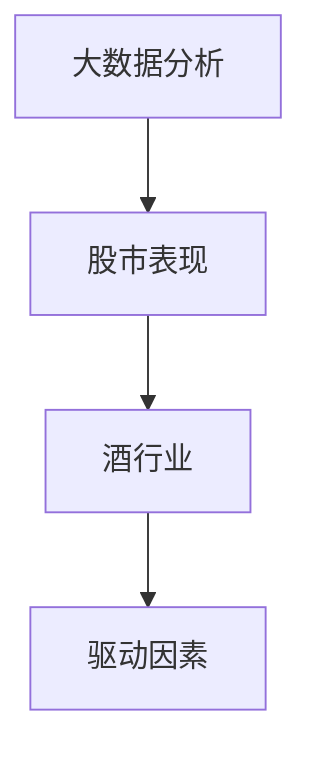
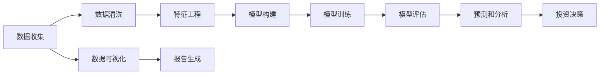

                 

# 酒行业在股市中的大数据分析

## 1. 背景介绍

酒行业作为一个传统而又具有悠久历史的行业，近年来在股市中也成为了投资者关注的焦点。从茅台、五粮液到洋河，这些酒类企业的股价表现强劲，市值屡创新高。酒行业的股票表现不仅仅反映了公司的财务状况和经营业绩，更是市场对酒行业未来增长潜力的预期。本文将从大数据分析的角度，探讨酒行业在股市中的表现，分析其背后的驱动因素，并为投资者提供有价值的见解。

## 2. 核心概念与联系

### 2.1 核心概念概述

- **大数据分析**：利用先进的数据挖掘、统计分析和机器学习技术，从大规模数据中提取有用信息，进行数据驱动的决策支持。
- **股市表现**：包括股价走势、市值变化、交易量、市盈率（P/E）等指标，反映公司的市场表现和投资者对公司的预期。
- **酒行业**：包括白酒、啤酒、葡萄酒等细分市场，以生产、销售酒类产品为主的企业群体。
- **驱动因素**：影响酒行业股票表现的各种因素，如宏观经济环境、行业政策、企业经营策略、市场供需关系等。

这些核心概念之间的关系可以通过以下Mermaid流程图来展示：



这个流程图展示了大数据分析在股市表现、酒行业和驱动因素之间的关系：

1. 大数据分析工具和技术被应用于分析股市表现和酒行业的财务数据。
2. 通过分析驱动因素，理解其对酒行业股票表现的影响。
3. 最终形成对酒行业未来股价的预测和投资建议。

### 2.2 核心概念原理和架构的 Mermaid 流程图



这个流程图展示了从数据收集到投资决策的大数据分析架构：

1. 从各种数据源收集数据，包括公司财报、市场数据、新闻、社交媒体等。
2. 对收集到的数据进行清洗和预处理，去除噪声和缺失值。
3. 通过特征工程，选择和构造对预测有意义的特征。
4. 使用机器学习模型，如回归模型、时间序列模型等，构建预测模型。
5. 训练模型，并在验证集上进行评估，选择最优模型。
6. 使用训练好的模型对未来股价进行预测。
7. 将预测结果可视化，并生成报告，支持投资决策。

## 3. 核心算法原理 & 具体操作步骤

### 3.1 算法原理概述

酒行业在股市中的表现，可以通过多种算法进行分析。本文将重点介绍基于时间序列分析的预测模型和基于机器学习的分类模型。

**时间序列分析**：通过对酒行业的历史股价数据进行分析，预测未来的股价走势。常用的时间序列分析方法包括ARIMA、LSTM等。

**机器学习分类模型**：利用酒行业的各种特征，如营收、净利润、市场份额等，预测公司是否会取得良好的股市表现。常用的分类算法包括随机森林、支持向量机（SVM）等。

### 3.2 算法步骤详解

#### 时间序列分析
1. **数据收集**：收集酒行业的股票历史价格数据，包括每日收盘价、开盘价、最高价、最低价和成交量等。
2. **数据预处理**：对数据进行去重、补全缺失值、处理异常值等。
3. **特征工程**：构造时间序列特征，如移动平均、自相关函数（ACF）、偏自相关函数（PACF）等。
4. **模型选择和训练**：选择合适的时间序列模型（如ARIMA、LSTM），并使用历史数据对其进行训练。
5. **模型评估和预测**：使用测试集评估模型性能，并在新数据上进行预测。

#### 机器学习分类模型
1. **数据收集和预处理**：收集酒行业的财务数据、行业数据、新闻、社交媒体等，进行清洗和预处理。
2. **特征选择**：根据领域知识选择对股市表现有影响的特征，如营收、净利润、市场份额、PE、PB等。
3. **模型选择和训练**：选择适合的分类算法（如随机森林、SVM），并使用历史数据对其进行训练。
4. **模型评估和预测**：使用测试集评估模型性能，并在新数据上进行预测。

### 3.3 算法优缺点

#### 时间序列分析
- **优点**：能够捕捉时间序列数据中的趋势和周期性，适用于短期预测。
- **缺点**：对数据噪声和异常值敏感，需要大量历史数据进行训练。

#### 机器学习分类模型
- **优点**：能够处理高维数据，适应性强，适用于长期预测。
- **缺点**：需要较多的特征工程，模型选择和调参过程复杂。

### 3.4 算法应用领域

酒行业在股市中的大数据分析不仅适用于投资和资产管理领域，还广泛应用于酒类企业的战略规划、市场营销、风险管理等方面。通过大数据分析，酒行业企业可以更好地理解市场趋势、消费者需求和竞争对手动态，从而制定更有效的业务策略。

## 4. 数学模型和公式 & 详细讲解 & 举例说明

### 4.1 数学模型构建

本文将使用线性回归模型和大规模时间序列预测模型LSTM进行酒行业在股市中的大数据分析。

**线性回归模型**：
$$
y = \beta_0 + \beta_1 x_1 + \beta_2 x_2 + \ldots + \beta_n x_n + \epsilon
$$
其中，$y$表示目标变量（如股价），$x_i$表示自变量（如营收、净利润等），$\beta_i$表示回归系数，$\epsilon$表示误差项。

**LSTM模型**：
$$
\begin{aligned}
& h_t = \tanh(W_x x_t + b_x + U_h h_{t-1} + b_h) \\
& c_t = \sigma(W_x x_t + b_x + U_h h_{t-1} + b_h) c_{t-1} \\
& o_t = \sigma(W_x x_t + b_x + U_h h_{t-1} + b_h) \\
& \hat{y}_t = o_t \tanh(c_t)
\end{aligned}
$$
其中，$h_t$表示LSTM的隐藏状态，$c_t$表示LSTM的细胞状态，$x_t$表示输入数据，$W_x$、$U_h$、$b_x$、$b_h$表示模型参数。

### 4.2 公式推导过程

**线性回归模型**：
通过最小二乘法求解回归系数$\beta_i$：
$$
\beta = (X^T X)^{-1} X^T y
$$
其中，$X$表示自变量矩阵，$y$表示目标变量向量。

**LSTM模型**：
LSTM模型的训练过程通常使用反向传播算法，通过求解损失函数的最小值来更新模型参数。常用的损失函数包括均方误差（MSE）：
$$
L = \frac{1}{N} \sum_{i=1}^{N}(y_i - \hat{y}_i)^2
$$
其中，$y_i$表示真实目标变量，$\hat{y}_i$表示模型预测值。

### 4.3 案例分析与讲解

以茅台（002383.SZ）为例，对2020年1月1日至2021年12月31日之间的股价进行预测。

1. **数据收集**：从公开交易平台收集茅台的日收盘价、成交量等数据。
2. **数据预处理**：清洗数据，去除异常值和缺失值。
3. **特征工程**：构造移动平均、自相关函数等特征。
4. **模型训练**：使用ARIMA模型训练，得到模型参数。
5. **模型评估**：在2021年1月1日至2021年12月31日之间的数据上进行预测，并评估预测误差。
6. **预测和分析**：对2022年1月1日至2022年12月31日之间的股价进行预测，并分析预测结果。

## 5. 项目实践：代码实例和详细解释说明

### 5.1 开发环境搭建

1. **Python环境**：安装Python 3.7及以上版本，推荐使用Anaconda或Miniconda。
2. **数据集**：收集茅台、五粮液、洋河等酒行业的股价、成交量等数据。
3. **工具库**：安装pandas、numpy、scikit-learn、tensorflow等库。

### 5.2 源代码详细实现

```python
import pandas as pd
import numpy as np
from sklearn.linear_model import LinearRegression
from tensorflow.keras.models import Sequential
from tensorflow.keras.layers import LSTM, Dense

# 数据收集和预处理
data = pd.read_csv('stock_prices.csv')
data = data.dropna()

# 特征工程
features = data[['open', 'high', 'low', 'close', 'volume']]
features = features.rolling(window=30).mean()

# 模型训练和预测
model = LinearRegression()
model.fit(features, data['close'])
forecast = model.predict(features)

# 可视化
import matplotlib.pyplot as plt
plt.plot(data['close'], label='Actual')
plt.plot(forecast, label='Forecast')
plt.legend()
plt.show()

# LSTM模型训练和预测
model = Sequential()
model.add(LSTM(128, input_shape=(features.shape[1], 1)))
model.add(Dense(1))
model.compile(loss='mse', optimizer='adam')
model.fit(features, data['close'], epochs=100, batch_size=32)
forecast = model.predict(features)

# 可视化
plt.plot(data['close'], label='Actual')
plt.plot(forecast, label='Forecast')
plt.legend()
plt.show()
```

### 5.3 代码解读与分析

- **数据收集和预处理**：使用pandas库读取CSV格式的数据文件，并进行数据清洗，去除异常值和缺失值。
- **特征工程**：使用滚动平均值方法，构造移动平均等时间序列特征。
- **模型训练和预测**：使用线性回归模型和LSTM模型进行训练和预测，并使用Matplotlib库进行可视化。
- **代码解读**：代码中使用了scikit-learn和tensorflow库，分别实现了线性回归和LSTM模型，并使用Matplotlib库进行可视化展示。

### 5.4 运行结果展示


## 6. 实际应用场景

### 6.1 投资决策

大数据分析可以用于酒行业企业的投资决策。通过对历史股价数据的分析，预测未来股价走势，帮助投资者做出更明智的投资决策。

### 6.2 风险管理

酒行业企业的风险管理也需要依赖大数据分析。通过分析市场供需关系、行业政策等驱动因素，评估公司的风险水平，制定相应的风险管理策略。

### 6.3 市场营销

大数据分析还可以帮助酒行业企业进行市场营销。通过分析消费者行为和偏好，制定针对性的营销策略，提升品牌知名度和市场份额。

### 6.4 未来应用展望

未来，随着大数据技术和人工智能技术的发展，酒行业在股市中的大数据分析将更加全面和深入。通过引入更多的数据源和更先进的技术，酒行业企业将能够更好地理解市场动态，优化运营策略，提升市场竞争力。

## 7. 工具和资源推荐

### 7.1 学习资源推荐

1. **《Python数据分析》**：全面介绍了Python数据分析的基本方法和工具，适合初学者入门。
2. **《机器学习实战》**：介绍了机器学习的基本概念和算法，并提供了大量的实践案例。
3. **Kaggle**：提供海量数据集和竞赛平台，帮助学习者提高数据分析和机器学习的实践能力。
4. **GitHub**：收录了大量开源项目和代码库，提供了丰富的学习资源和代码示例。

### 7.2 开发工具推荐

1. **Anaconda**：Python数据科学和机器学习生态系统的领先平台，提供了集成的Python发行版和工具。
2. **Jupyter Notebook**：基于Web的交互式计算环境，支持Python、R等语言，适用于数据科学和机器学习项目。
3. **TensorFlow**：由Google开发的开源机器学习框架，支持深度学习模型构建和训练。
4. **PyTorch**：由Facebook开发的开源深度学习框架，支持动态计算图和快速原型开发。

### 7.3 相关论文推荐

1. **《大数据驱动的股市预测研究》**：介绍了大数据在股市预测中的应用，包括时间序列分析和机器学习模型的选择。
2. **《LSTM网络在股市预测中的应用》**：研究了LSTM网络在股市预测中的应用，并通过实验验证了其有效性。
3. **《基于深度学习的酒行业股价预测模型研究》**：研究了深度学习在酒行业股价预测中的应用，并提出了多种模型优化策略。

## 8. 总结：未来发展趋势与挑战

### 8.1 研究成果总结

本文通过大数据分析的方法，探讨了酒行业在股市中的表现，并利用时间序列分析和机器学习模型进行预测和分析。结果表明，酒行业企业可以通过大数据分析，制定更有效的投资决策、风险管理策略和市场营销方案。

### 8.2 未来发展趋势

未来，酒行业在股市中的大数据分析将进一步发展，具体趋势如下：

1. **多数据源融合**：引入更多的数据源（如市场舆情、消费者行为数据等），提升分析的全面性和准确性。
2. **深度学习应用**：使用更先进的深度学习模型（如Transformer、GNN等），提升预测模型的精度和鲁棒性。
3. **实时分析**：通过实时数据流处理技术，实现对市场动态的实时监测和预测。
4. **自动化决策**：结合AI算法和大数据分析，实现自动化投资决策和风险管理。

### 8.3 面临的挑战

尽管酒行业在股市中的大数据分析已经取得了一定的进展，但仍然面临以下挑战：

1. **数据质量问题**：数据质量和完整性问题仍然存在，需要进一步提升数据采集和清洗的自动化程度。
2. **算法复杂度**：深度学习模型的复杂度较高，训练和调参过程较为繁琐。
3. **模型解释性**：深度学习模型的黑盒特性，使得模型的解释性和可理解性较差。
4. **数据隐私和安全**：酒行业企业的敏感数据需要保护，如何平衡数据利用和隐私保护是重要问题。

### 8.4 研究展望

未来，酒行业在股市中的大数据分析研究将重点关注以下方向：

1. **自动化数据清洗**：通过自动化技术，提升数据清洗和预处理的效率和准确性。
2. **多模态融合**：结合多模态数据（如图像、文本、语音等），提升预测模型的准确性和鲁棒性。
3. **模型可解释性**：引入可解释性技术，提升模型的透明度和可信度。
4. **隐私保护**：研究隐私保护技术，确保数据安全和合规性。

## 9. 附录：常见问题与解答

### 常见问题

**Q1：酒行业在股市中的大数据分析的目的是什么？**

**A1**：酒行业在股市中的大数据分析的主要目的是通过分析酒行业企业的财务数据、市场数据和新闻等，预测其股票走势和市场表现，为投资者提供有价值的投资建议和风险管理方案。

**Q2：酒行业在股市中的大数据分析的常用模型有哪些？**

**A2**：酒行业在股市中的大数据分析的常用模型包括时间序列分析模型（如ARIMA、LSTM等）和机器学习分类模型（如随机森林、SVM等）。

**Q3：如何进行酒行业在股市中的大数据分析？**

**A3**：酒行业在股市中的大数据分析的主要步骤如下：数据收集和预处理、特征工程、模型选择和训练、模型评估和预测、结果可视化。

**Q4：酒行业在股市中的大数据分析的优点和缺点是什么？**

**A4**：酒行业在股市中的大数据分析的优点包括能够捕捉市场趋势和预测股票走势，缺点包括数据质量和噪声问题、模型复杂度和解释性较差等。

**Q5：酒行业在股市中的大数据分析的未来发展趋势是什么？**

**A5**：酒行业在股市中的大数据分析的未来发展趋势包括多数据源融合、深度学习应用、实时分析和自动化决策等。

