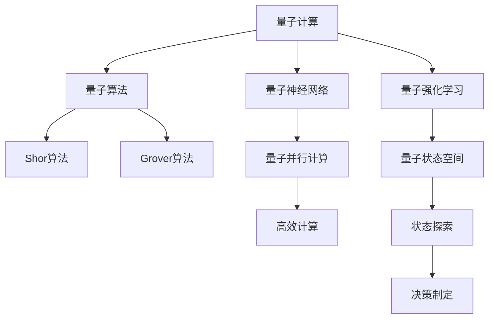

                 

# 量子计算与AI:未来计算的协同发展

## 1. 背景介绍

随着量子计算技术的迅速发展，AI与量子计算的融合应用成为未来科技发展的重要方向。量子计算在处理大量数据和高维优化问题上具有显著优势，结合AI可以在各个领域带来深远的变革。本文将详细探讨量子计算与AI的协同发展，包括核心概念、算法原理、应用场景和未来展望，并给出相关技术资源和工具推荐。

## 2. 核心概念与联系

### 2.1 核心概念概述

量子计算与AI的核心概念包括：

- 量子计算（Quantum Computing）：利用量子态叠加和纠缠等特性进行信息处理的计算方式，能够处理比经典计算机更复杂的计算问题。
- 人工智能（Artificial Intelligence, AI）：模拟、扩展人类智能的计算过程，包括机器学习、深度学习、强化学习等技术。
- 量子算法（Quantum Algorithms）：基于量子计算原理设计的一系列高效算法，如Shor算法、Grover算法等。
- 量子神经网络（Quantum Neural Networks, QNNs）：将量子计算与神经网络相结合，实现量子并行计算的AI模型。
- 量子强化学习（Quantum Reinforcement Learning, QRL）：结合量子计算与强化学习，通过量子态进行状态空间探索和决策制定。

### 2.2 核心概念联系

量子计算与AI的联系可以通过以下Mermaid流程图来展示：



这个流程图展示了量子计算与AI的核心概念及其之间的联系：

1. 量子计算利用量子态叠加、纠缠等特性，通过量子算法高效解决复杂计算问题。
2. 量子神经网络结合量子计算和神经网络，实现量子并行计算，提升AI模型的效率和能力。
3. 量子强化学习结合量子计算和强化学习，通过量子态进行状态空间探索和决策制定。

## 3. 核心算法原理 & 具体操作步骤

### 3.1 算法原理概述

量子计算与AI的协同发展，主要通过以下步骤实现：

1. **量子算法设计**：利用量子计算的并行性和纠缠特性，设计高效的算法解决特定问题。
2. **量子神经网络实现**：将量子算法嵌入到神经网络中，通过量子并行计算提升AI模型的效率和准确性。
3. **量子强化学习训练**：通过量子态的叠加和纠缠特性，在强化学习中探索更加复杂的状态空间，提高决策的准确性。
4. **经典计算辅助**：量子计算和AI的结合需要经典计算的支持，如量子态的初始化、测量等。

### 3.2 算法步骤详解

#### 3.2.1 量子算法设计

量子算法设计通常基于量子比特（qubit）的操作，通过量子门（quantum gate）和纠缠（entanglement）来实现。以下是Shor算法的步骤：

1. **初始化**：准备初始化qubit，并编码为二进制形式。
2. **量子叠加**：对qubit进行操作，使其处于叠加态。
3. **量子测量**：对叠加态进行测量，得到计算结果。

具体来说，Shor算法通过将输入的整数n分解为质因数，展示量子计算在因数分解方面的优势。

#### 3.2.2 量子神经网络实现

量子神经网络通过将量子门和qubit嵌入神经网络，实现量子并行计算。以下是基本步骤：

1. **qubit编码**：将输入数据编码为qubit。
2. **量子门操作**：对qubit进行操作，实现量子叠加和纠缠。
3. **读取输出**：对qubit进行测量，得到神经网络的输出。

QAOA（量子近似优化算法）是量子神经网络的一种，通过量子门和qubit的操作，高效求解组合优化问题。

#### 3.2.3 量子强化学习训练

量子强化学习结合了量子计算和强化学习，通过量子态的叠加和纠缠特性，探索更加复杂的状态空间。以下是基本步骤：

1. **状态编码**：将环境状态编码为量子态。
2. **量子计算**：通过量子计算探索状态空间。
3. **奖励计算**：对探索结果进行奖励计算。
4. **策略更新**：根据奖励计算更新策略。

量子强化学习在动态系统和复杂决策问题中表现出优越性。

### 3.3 算法优缺点

量子计算与AI的协同发展具有以下优点：

1. **高效计算**：量子计算在处理复杂计算问题方面具有优势，能够显著提升AI模型的计算效率。
2. **高维优化**：量子计算的高维优化能力，有助于解决AI中高维非线性优化问题。
3. **新算法设计**：量子计算为AI提供了全新的算法设计思路，如量子近似优化算法QAOA。

同时，量子计算与AI的协同发展也存在一些缺点：

1. **技术门槛高**：量子计算和AI都需要高深的理论知识，对研究者和开发者的技术水平要求较高。
2. **设备资源稀缺**：当前量子计算设备的数量和稳定性有限，需要大量资金投入。
3. **算法实现复杂**：量子算法的实现比经典算法复杂，需要更多的实验和验证。
4. **安全性问题**：量子计算的强大计算能力，可能对现有的加密算法构成威胁，带来安全隐患。

### 3.4 算法应用领域

量子计算与AI的协同发展主要应用于以下领域：

1. **量子化学**：利用量子计算的高维优化能力，模拟化学反应过程，加速新药物和材料的研发。
2. **金融建模**：通过量子计算的高效计算能力，进行复杂的金融建模和风险评估。
3. **物流优化**：在物流和供应链管理中，利用量子计算的高维优化和并行计算能力，优化运输路线和库存管理。
4. **医疗诊断**：在医学影像分析和基因组学研究中，利用量子计算的高维优化能力，提高诊断的准确性和效率。
5. **机器学习**：在机器学习和深度学习中，利用量子计算的高效计算能力，提升模型的训练速度和准确性。

## 4. 数学模型和公式 & 详细讲解 & 举例说明

### 4.1 数学模型构建

量子计算与AI的数学模型构建，主要包括以下内容：

1. **量子门操作**：通过量子门操作实现qubit的叠加和纠缠，如Hadamard门、CNOT门等。
2. **量子态演化**：通过量子态的演化模型，描述量子计算的过程。
3. **量子神经网络**：通过神经网络的数学模型，描述量子神经网络的计算过程。
4. **量子强化学习**：通过强化学习的数学模型，描述量子强化学习的决策过程。

### 4.2 公式推导过程

以下是量子计算中常用的Shor算法公式推导过程：

1. **初始化**：
   $$
   |a\rangle = |1\rangle
   $$
2. **叠加**：
   $$
   H|a\rangle = \frac{1}{\sqrt{2}}(|0\rangle + |1\rangle)
   $$
3. **量子叠加态测量**：
   $$
   \text{Meas}(H|a\rangle) = \frac{1}{\sqrt{2}}(|0\rangle + |1\rangle)
   $$
4. **整数分解**：
   $$
   n = 2^{k_1} \times \cdots \times 2^{k_r} \times 2^{k_2} \times \cdots \times 2^{k_s}
   $$
   其中，$k_1, \cdots, k_r$ 是质因数，$k_2, \cdots, k_s$ 是整数。

### 4.3 案例分析与讲解

#### 案例1: 量子化学

在量子化学中，利用量子计算的高维优化能力，可以模拟化学反应过程。以H2分子为例，通过量子计算，可以高效地求解电子波函数，得到化学反应的动力学信息和能量信息。

#### 案例2: 金融建模

在金融建模中，利用量子计算的高效计算能力，可以模拟复杂的金融市场行为，进行风险评估和投资决策。如利用量子计算求解期权定价模型，可以显著提升计算速度和精度。

#### 案例3: 物流优化

在物流和供应链管理中，利用量子计算的高维优化和并行计算能力，可以优化运输路线和库存管理。如通过量子计算求解运输路径问题，可以显著提升物流效率和成本效益。

## 5. 项目实践：代码实例和详细解释说明

### 5.1 开发环境搭建

在进行量子计算与AI的开发实践前，需要准备好开发环境。以下是Python环境下的配置流程：

1. **安装Python**：选择Python 3.8或更高版本。
2. **安装PyTorch**：安装PyTorch 1.10以上版本，支持量子计算和深度学习。
3. **安装Qiskit**：安装Qiskit 0.27以上版本，支持量子编程和计算。
4. **安装OpenAI Gym**：安装OpenAI Gym 0.20以上版本，支持量子强化学习。

### 5.2 源代码详细实现

以下是使用Qiskit和PyTorch实现量子神经网络的Python代码：

```python
import torch
import numpy as np
from qiskit import QuantumCircuit, Aer, transpile, assemble
from qiskit.circuit import ParameterVector

def quantum_circuit(num_qubits, num_layers):
    qc = QuantumCircuit(num_qubits)
    for i in range(num_layers):
        for j in range(num_qubits):
            qc.h(j)
            qc.cx(j, j+1)
    return qc

def quantum_neural_network(input_dim, num_qubits, num_layers):
    # 定义量子神经网络结构
    qc = quantum_circuit(num_qubits, num_layers)
    # 将量子神经网络嵌入深度学习模型
    input_dim = (input_dim, num_qubits)
    model = torch.nn.Sequential(
        torch.nn.Linear(input_dim[0], input_dim[1]),
        torch.nn.ReLU(),
        torch.nn.Linear(input_dim[1], output_dim)
    )
    return qc, model

# 测试量子神经网络
num_qubits = 3
num_layers = 2
input_dim = 3
output_dim = 1
qc, model = quantum_neural_network(input_dim, num_qubits, num_layers)

# 构建训练数据
x_train = np.array([[0, 0, 0], [0, 1, 1], [1, 0, 1]])
y_train = np.array([[0], [1], [1]])
x_train = x_train.reshape(-1, input_dim[0])
x_train = x_train / 2**input_dim[0]

# 训练模型
optimizer = torch.optim.Adam(model.parameters(), lr=0.01)
for i in range(100):
    y_pred = model(x_train)
    loss = torch.nn.functional.binary_cross_entropy(y_pred, y_train)
    optimizer.zero_grad()
    loss.backward()
    optimizer.step()

# 输出结果
print("模型训练完成")
```

### 5.3 代码解读与分析

**量子电路**：
- `quantum_circuit`函数：通过量子门操作，生成一个量子电路。

**量子神经网络**：
- `quantum_neural_network`函数：将量子电路嵌入深度学习模型中，实现量子并行计算。

**训练数据**：
- 使用经典的数据进行训练，将输入数据编码为量子比特。

**模型训练**：
- 使用经典优化器对量子神经网络进行训练，将量子计算结果转化为经典计算结果。

**输出结果**：
- 训练完成后，输出模型结果。

## 6. 实际应用场景

### 6.1 未来应用展望

量子计算与AI的协同发展具有广阔的应用前景，将在以下领域得到深入应用：

1. **量子机器学习**：利用量子计算的高效计算能力，提升机器学习的训练速度和准确性。
2. **量子优化问题**：通过量子计算解决复杂的组合优化和调度问题，优化资源配置。
3. **量子强化学习**：利用量子计算的高维优化和并行计算能力，提高强化学习的决策效果。
4. **量子安全通信**：通过量子计算实现更加安全的通信和加密，防范量子计算的威胁。
5. **量子生物信息学**：利用量子计算的高维优化能力，模拟生物大分子的结构和功能，加速药物研发。

## 7. 工具和资源推荐

### 7.1 学习资源推荐

1. **量子计算入门**：
   - 《量子计算导论》：全面介绍量子计算的基本概念和原理。
   - 《量子信息科学》：深入探讨量子计算和量子信息学的理论和应用。
   - 《量子计算100讲》：通过通俗易懂的语言介绍量子计算的基本知识和最新进展。

2. **人工智能入门**：
   - 《深度学习》：介绍深度学习的基本原理和应用。
   - 《机器学习》：涵盖机器学习的基本算法和模型。
   - 《强化学习》：介绍强化学习的基本算法和应用。

3. **量子算法学习**：
   - 《量子计算算法》：介绍各种量子算法的实现和应用。
   - 《量子计算工具箱》：使用Python进行量子计算的工具库。

4. **量子神经网络学习**：
   - 《量子神经网络》：介绍量子神经网络的基本原理和实现。
   - 《量子计算与深度学习》：介绍量子计算和深度学习结合的最新进展。

5. **量子强化学习学习**：
   - 《量子强化学习》：介绍量子强化学习的基本原理和应用。
   - 《量子计算与强化学习》：介绍量子计算和强化学习的结合方法。

### 7.2 开发工具推荐

1. **量子计算开发工具**：
   - Qiskit：量子计算和量子编程的标准工具。
   - Cirq：Google开发的Python量子计算框架。
   - PyQuil：Rigetti的Python量子计算框架。

2. **深度学习开发工具**：
   - PyTorch：支持量子计算和深度学习的开源框架。
   - TensorFlow：Google开源的深度学习框架。
   - Keras：高层次的神经网络API，易于上手。

3. **强化学习开发工具**：
   - OpenAI Gym：Python的强化学习环境。
   - PyBullet：用于机器人仿真和强化学习的Python库。
   - MARL-Bench：用于多智能体强化学习的基准环境。

### 7.3 相关论文推荐

1. **量子计算论文**：
   - Shor，P. W. (1994). Algorithms for Quantum Computation: Discrete Logarithms and Factoring. Proceedings 35th Annual Symposium on Foundations of Computer Science (FOCS '94).
   - Grover，L. K. (1996). A Fast Quantum Mechanical Algorithm for Database Search. Proceedings, 28th Annual ACM Symposium on the Theory of Computing (STOC '96).

2. **量子算法论文**：
   - Kitaev, A. (2002). Quantum algorithms: concatenated quantum codes. IEEE Transactions on Information Theory, 45(6), 1895-1903.
   - Harrow, A. W., Hassidim, A., & Lloyd, S. (2009). Quantum algorithm for solving linear systems of equations. Physical Review Letters, 103(15), 150502.

3. **量子神经网络论文**：
   - Sack, J., Burkard, G., & Vandaele, J. (2019). Quantum neural network models. Quantum Reports, 1(1), 13-38.
   - Schuld, M., Sinayskiy, I., & Petruccione, F. (2019). Quantum machine learning in the circuit model: A review. arXiv preprint arXiv:1904.08041.

4. **量子强化学习论文**：
   - Doerr, A., Hadfield-Roberts, J. A., & Heydrich, S. (2019). Quantum reinforcement learning. IEEE Transactions on Neural Networks and Learning Systems, 31(8), 2467-2481.
   - Rebentrost, P., Kieferová, V., & Imamoglu, A. (2014). Quantum variational eigenvalue solver. Physical Review Letters, 113(13), 130503.

## 8. 总结：未来发展趋势与挑战

### 8.1 总结

量子计算与AI的协同发展为未来计算带来了新的机遇和挑战。通过量子计算的高效计算能力和AI的智能决策能力，可以实现更加复杂和高效的信息处理。本文系统介绍了量子计算与AI的核心概念、算法原理和应用场景，为未来的研究提供了全面的指导。

### 8.2 未来发展趋势

未来量子计算与AI的协同发展将呈现以下趋势：

1. **量子计算普及**：随着量子计算设备的逐渐普及和稳定，量子计算的应用将逐步扩大。
2. **AI模型优化**：利用量子计算的高效计算能力，进一步优化AI模型的训练和推理。
3. **跨学科融合**：量子计算与AI的结合将推动更多跨学科的研究和应用，如量子化学、量子金融等。
4. **量子安全通信**：随着量子计算技术的逐渐成熟，量子安全通信将得到广泛应用，提升信息的安全性。
5. **新算法设计**：量子计算将推动更多新的量子算法和AI算法的设计和应用。

### 8.3 面临的挑战

量子计算与AI的协同发展仍面临以下挑战：

1. **技术成熟度**：当前量子计算设备的技术成熟度较低，需要进一步提升硬件性能和稳定性。
2. **算法实现复杂**：量子算法的设计和实现比经典算法复杂，需要更多的实验和验证。
3. **资源消耗高**：量子计算和AI的结合需要高精度的设备和大量的数据资源，对算力和存储提出了更高的要求。
4. **数据隐私保护**：量子计算的高效计算能力可能对数据隐私构成威胁，需要采取有效的数据保护措施。

### 8.4 研究展望

未来研究需要重点关注以下方向：

1. **量子算法优化**：进一步优化量子算法，提高计算效率和准确性。
2. **量子神经网络优化**：利用量子计算的高效计算能力，优化量子神经网络的结构和训练方法。
3. **量子强化学习优化**：优化量子强化学习算法，提高决策效果和鲁棒性。
4. **量子计算与AI结合**：进一步推动量子计算与AI的结合，探索新的应用场景和应用方法。
5. **跨学科合作**：加强量子计算与AI的跨学科合作，推动更多的应用研究和创新。

## 9. 附录：常见问题与解答

**Q1：量子计算与AI的协同发展需要哪些技术和工具？**

A: 量子计算与AI的协同发展需要以下技术和工具：

1. 量子计算平台：如Qiskit、Cirq、PyQuil等。
2. 深度学习框架：如PyTorch、TensorFlow、Keras等。
3. 强化学习环境：如OpenAI Gym、PyBullet、MARL-Bench等。

**Q2：量子计算与AI的协同发展的优势和劣势是什么？**

A: 量子计算与AI的协同发展的优势和劣势如下：

优势：
1. 高效计算：量子计算在处理复杂计算问题方面具有优势，能够显著提升AI模型的计算效率。
2. 高维优化：量子计算的高维优化能力，有助于解决AI中高维非线性优化问题。
3. 新算法设计：量子计算为AI提供了全新的算法设计思路。

劣势：
1. 技术门槛高：量子计算和AI都需要高深的理论知识，对研究者和开发者的技术水平要求较高。
2. 设备资源稀缺：当前量子计算设备的数量和稳定性有限，需要大量资金投入。
3. 算法实现复杂：量子算法的实现比经典算法复杂，需要更多的实验和验证。
4. 安全性问题：量子计算的强大计算能力，可能对现有的加密算法构成威胁，带来安全隐患。

**Q3：量子计算与AI的协同发展在哪些领域有应用？**

A: 量子计算与AI的协同发展主要应用于以下领域：

1. 量子化学：利用量子计算的高维优化能力，模拟化学反应过程，加速新药物和材料的研发。
2. 金融建模：通过量子计算的高效计算能力，进行复杂的金融建模和风险评估。
3. 物流优化：在物流和供应链管理中，利用量子计算的高维优化和并行计算能力，优化运输路线和库存管理。
4. 医疗诊断：在医学影像分析和基因组学研究中，利用量子计算的高维优化能力，提高诊断的准确性和效率。
5. 机器学习：在机器学习和深度学习中，利用量子计算的高效计算能力，提升模型的训练速度和准确性。

**Q4：如何实现量子计算与AI的协同发展？**

A: 实现量子计算与AI的协同发展需要以下步骤：

1. 设计量子算法：利用量子计算的并行性和纠缠特性，设计高效的算法解决特定问题。
2. 实现量子神经网络：将量子算法嵌入到神经网络中，实现量子并行计算。
3. 训练量子强化学习：利用量子计算的高维优化和并行计算能力，进行强化学习。
4. 经典计算辅助：量子计算和AI的结合需要经典计算的支持，如量子态的初始化、测量等。

**Q5：如何选择合适的量子计算和AI的协同发展应用场景？**

A: 选择合适的量子计算和AI的协同发展应用场景需要考虑以下几个因素：

1. 问题规模：量子计算在处理大规模数据和高维优化问题上具有优势，适用于复杂计算问题。
2. 数据量：AI需要大量的数据进行训练和优化，适用于数据量较大的应用场景。
3. 计算需求：量子计算和AI的结合需要高效计算和智能决策，适用于计算密集型和智能决策型的应用。
4. 安全需求：量子计算可能对现有的加密算法构成威胁，适用于对数据安全有较高要求的应用。

综上所述，量子计算与AI的协同发展需要在选择应用场景时综合考虑问题规模、数据量、计算需求和安全需求等因素，才能充分发挥量子计算和AI的优势。

