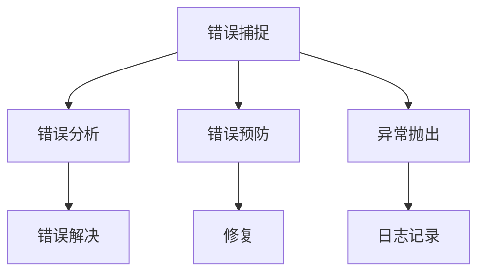

                 

# 错误处理机制的设计原则

在软件开发中，错误处理机制的设计是一个关键环节，直接影响到系统的稳定性和用户体验。本文将深入探讨错误处理机制的设计原则，通过核心概念、核心算法、项目实践、实际应用场景、工具和资源推荐、总结及未来展望等环节，全面介绍这一重要技术。

## 1. 背景介绍

### 1.1 问题由来

在软件开发过程中，不可避免地会遇到各种错误。错误的处理方式直接影响到系统的健壮性和用户体验。错误处理机制设计不当，轻则导致系统崩溃，重则影响业务运营，甚至造成严重的经济损失。因此，如何设计一个有效的错误处理机制，是每一个软件开发人员需要重点关注的问题。

### 1.2 问题核心关键点

错误处理机制的核心关键点在于如何有效地捕捉、分析和解决错误，以最小的代价保证系统的正常运行。主要包括以下几个方面：

- 错误捕捉：通过日志、异常抛出等方式，及时发现系统错误。
- 错误分析：对错误进行分类、过滤、统计等分析，以定位问题根源。
- 错误解决：通过修复、重试、回滚等手段，快速恢复系统正常运行。
- 错误预防：通过代码审查、性能监控、异常测试等手段，预防错误发生。

### 1.3 问题研究意义

设计一个完善的错误处理机制，具有以下重要意义：

- 保障系统稳定：及时发现并解决错误，防止系统崩溃。
- 提升用户体验：减少错误带来的用户困扰，提高用户满意度。
- 促进业务运营：避免错误导致的业务损失，保障业务连续性。
- 提升开发效率：通过预防和解决错误，提高开发人员的工作效率。

## 2. 核心概念与联系

### 2.1 核心概念概述

为了更好地理解错误处理机制的设计原则，本文将介绍几个核心概念：

- 错误捕捉：通过日志记录、异常抛出等方式，及时发现系统错误。
- 错误分析：对错误进行分类、过滤、统计等分析，以定位问题根源。
- 错误解决：通过修复、重试、回滚等手段，快速恢复系统正常运行。
- 错误预防：通过代码审查、性能监控、异常测试等手段，预防错误发生。

这些核心概念之间的逻辑关系可以通过以下Mermaid流程图来展示：



这个流程图展示了这个错误处理机制的核心流程：

1. 错误捕捉：通过日志记录和异常抛出等方式，及时发现系统错误。
2. 错误分析：对错误进行分类、过滤、统计等分析，以定位问题根源。
3. 错误解决：通过修复、重试、回滚等手段，快速恢复系统正常运行。
4. 错误预防：通过代码审查、性能监控、异常测试等手段，预防错误发生。

## 3. 核心算法原理 & 具体操作步骤

### 3.1 算法原理概述

错误处理机制的原理可以归纳为以下几个步骤：

1. 错误捕捉：通过日志记录和异常抛出等方式，及时发现系统错误。
2. 错误分析：对错误进行分类、过滤、统计等分析，以定位问题根源。
3. 错误解决：通过修复、重试、回滚等手段，快速恢复系统正常运行。
4. 错误预防：通过代码审查、性能监控、异常测试等手段，预防错误发生。

### 3.2 算法步骤详解

错误处理机制的核心步骤包括错误捕捉、错误分析、错误解决和错误预防。以下将详细介绍每个步骤的具体操作：

#### 3.2.1 错误捕捉

错误捕捉是错误处理机制的第一步，也是最关键的一步。通过日志记录和异常抛出等方式，及时发现系统错误。

- **日志记录**：通过日志记录系统运行过程中的关键事件，包括正常事件和错误事件。常用的日志工具包括Log4j、logback、ELK Stack等。
- **异常抛出**：当系统出现异常时，通过抛出异常，将错误信息传递到上层，方便进一步处理。

**示例代码**：

```java
try {
    // 执行可能会出错的代码
} catch (Exception e) {
    // 记录日志
    log.error("发生异常：{}", e.getMessage());
    // 抛出异常
    throw e;
}
```

#### 3.2.2 错误分析

错误分析是定位问题根源的关键步骤。通过分类、过滤、统计等手段，分析错误的性质和原因。

- **错误分类**：将错误分为系统错误、业务错误、接口错误等不同类型，方便快速定位问题。
- **错误过滤**：过滤掉无关的错误信息，只保留关键错误信息。
- **错误统计**：统计错误出现的频率和趋势，找出高频错误和系统瓶颈。

**示例代码**：

```java
// 错误分类
public enum ErrorType {
    SYSTEM_ERROR,
    BUSINESS_ERROR,
    INTERFACE_ERROR
}

// 错误过滤
public List<ErrorType> filterErrors(List<Error> errors) {
    // 实现具体过滤逻辑
}

// 错误统计
public Map<String, Integer> statisticErrors(List<Error> errors) {
    // 实现具体统计逻辑
}
```

#### 3.2.3 错误解决

错误解决是恢复系统正常运行的核心步骤。通过修复、重试、回滚等手段，快速恢复系统正常运行。

- **修复错误**：定位错误后，修改代码或配置，修复错误。
- **重试机制**：在错误发生后，重新尝试执行操作，防止因一次性失败导致系统不可用。
- **回滚操作**：在系统出现严重错误时，回滚到之前的状态，防止问题扩散。

**示例代码**：

```java
// 修复错误
public void fixError() {
    // 修改代码或配置
}

// 重试机制
public void retryOperation() {
    // 实现具体重试逻辑
}

// 回滚操作
public void rollbackOperation() {
    // 实现具体回滚逻辑
}
```

#### 3.2.4 错误预防

错误预防是通过代码审查、性能监控、异常测试等手段，预防错误发生。

- **代码审查**：通过代码审查工具，找出代码中的潜在错误。
- **性能监控**：通过监控系统性能指标，及时发现系统瓶颈。
- **异常测试**：通过模拟异常情况，测试系统的鲁棒性。

**示例代码**：

```java
// 代码审查
public void reviewCode() {
    // 实现具体审查逻辑
}

// 性能监控
public void monitorPerformance() {
    // 实现具体监控逻辑
}

// 异常测试
public void testException() {
    // 实现具体测试逻辑
}
```

### 3.3 算法优缺点

错误处理机制的优点在于能够及时发现和解决系统错误，保障系统稳定性和用户体验。

**优点**：
- 保障系统稳定：及时发现并解决错误，防止系统崩溃。
- 提升用户体验：减少错误带来的用户困扰，提高用户满意度。
- 促进业务运营：避免错误导致的业务损失，保障业务连续性。
- 提升开发效率：通过预防和解决错误，提高开发人员的工作效率。

**缺点**：
- 资源消耗：日志记录和异常抛出等操作，会消耗一定系统资源。
- 系统复杂度：错误处理机制的实现会引入一定的系统复杂度。
- 误报率高：错误分类和过滤的准确性，直接影响误报率。

### 3.4 算法应用领域

错误处理机制在软件开发中的应用非常广泛，涵盖了各个领域。以下是一些主要应用领域：

- **Web应用**：通过日志记录和异常抛出等方式，及时发现Web应用的错误，保障Web应用的稳定性。
- **移动应用**：通过日志记录和异常抛出等方式，及时发现移动应用的错误，保障移动应用的稳定性。
- **微服务架构**：通过日志记录和异常抛出等方式，及时发现微服务架构中的错误，保障微服务架构的稳定性。
- **大数据处理**：通过日志记录和异常抛出等方式，及时发现大数据处理的错误，保障大数据处理的稳定性。
- **人工智能应用**：通过日志记录和异常抛出等方式，及时发现人工智能应用的错误，保障人工智能应用的稳定性。

## 4. 数学模型和公式 & 详细讲解 & 举例说明

### 4.1 数学模型构建

错误处理机制的数学模型可以抽象为以下几个部分：

- **错误捕捉模型**：通过日志记录和异常抛出等方式，及时发现系统错误。
- **错误分析模型**：对错误进行分类、过滤、统计等分析，以定位问题根源。
- **错误解决模型**：通过修复、重试、回滚等手段，快速恢复系统正常运行。
- **错误预防模型**：通过代码审查、性能监控、异常测试等手段，预防错误发生。

### 4.2 公式推导过程

#### 4.2.1 错误捕捉模型

错误捕捉模型可以表示为：

$$
E_{capture} = F_{log} + F_{exception}
$$

其中，$E_{capture}$表示错误捕捉模型，$F_{log}$表示日志记录，$F_{exception}$表示异常抛出。

#### 4.2.2 错误分析模型

错误分析模型可以表示为：

$$
E_{analysis} = F_{classify} + F_{filter} + F_{statistic}
$$

其中，$E_{analysis}$表示错误分析模型，$F_{classify}$表示错误分类，$F_{filter}$表示错误过滤，$F_{statistic}$表示错误统计。

#### 4.2.3 错误解决模型

错误解决模型可以表示为：

$$
E_{resolve} = F_{repair} + F_{retry} + F_{rollback}
$$

其中，$E_{resolve}$表示错误解决模型，$F_{repair}$表示修复错误，$F_{retry}$表示重试机制，$F_{rollback}$表示回滚操作。

#### 4.2.4 错误预防模型

错误预防模型可以表示为：

$$
E_{prevent} = F_{review} + F_{monitor} + F_{test}
$$

其中，$E_{prevent}$表示错误预防模型，$F_{review}$表示代码审查，$F_{monitor}$表示性能监控，$F_{test}$表示异常测试。

### 4.3 案例分析与讲解

以下是一个错误处理机制的实际案例分析：

#### 案例背景

某电商平台开发了新的订单系统，上线后不久，发现订单生成过程中频繁出现超时错误。

#### 问题分析

- **错误捕捉**：通过日志记录和异常抛出等方式，发现订单生成过程中，出现大量超时错误。
- **错误分析**：对超时错误进行分类、过滤、统计等分析，确定错误原因。
- **错误解决**：定位到数据库连接池配置不合理，修改数据库连接池配置，恢复系统正常运行。
- **错误预防**：通过代码审查、性能监控、异常测试等手段，预防类似错误再次发生。

## 5. 项目实践：代码实例和详细解释说明

### 5.1 开发环境搭建

在进行错误处理机制的开发实践前，我们需要准备好开发环境。以下是使用Java进行开发的环境配置流程：

1. 安装Java开发环境：从官网下载并安装JDK，配置环境变量，安装IDE如IntelliJ IDEA。
2. 安装依赖管理工具：安装Maven或Gradle，用于依赖管理。
3. 安装日志工具：安装Log4j或logback，用于日志记录。
4. 安装异常处理框架：安装Spring Boot或Spring Cloud，用于异常处理。

完成上述步骤后，即可在开发环境中开始错误处理机制的开发实践。

### 5.2 源代码详细实现

以下是一个基于Spring Boot的错误处理机制的实现示例：

#### 示例代码

**application.properties**

```properties
logging.level=info
```

**application.java**

```java
@SpringBootApplication
public class Application {
    public static void main(String[] args) {
        SpringApplication.run(Application.class, args);
    }
}
```

**ErrorController.java**

```java
@RestController
@RequestMapping("/error")
public class ErrorController {
    @GetMapping
    public String error() {
        throw new RuntimeException("系统错误");
    }
}
```

**GlobalExceptionHandler.java**

```java
@ControllerAdvice
public class GlobalExceptionHandler {
    @ExceptionHandler(Exception.class)
    public ResponseEntity<String> handleException(Exception e) {
        // 记录日志
        log.error("发生异常：{}", e.getMessage());
        // 抛出异常
        throw e;
    }
}
```

**log4j2.xml**

```xml
<Configuration>
    <Appenders>
        <Console name="console" target="SYSTEM_OUT">
            <PatternLayout pattern="%d{yyyy-MM-dd HH:mm:ss.SSS} [%t] %-5level %logger{36} - %msg%n"/>
        </Console>
    </Appenders>
    <Loggers>
        <Logger name="org.springframework" level="debug"/>
        <Logger name="org.springframework.web" level="debug"/>
        <Logger name="org.springframework.security" level="debug"/>
        <Root level="info">
            <AppenderRef ref="console"/>
        </Root>
    </Loggers>
</Configuration>
```

### 5.3 代码解读与分析

让我们再详细解读一下关键代码的实现细节：

**GlobalExceptionHandler.java**

- **@ControllerAdvice**：注解用于全局异常处理。
- **@ExceptionHandler**：注解用于处理特定异常。
- **handleException**方法：定义异常处理逻辑，记录日志并抛出异常。

**log4j2.xml**

- **Configuration**：定义日志配置。
- **Appenders**：定义日志输出方式，这里使用控制台输出。
- **Loggers**：定义日志级别，这里设置为info级别，并输出时间、线程、日志级别、日志名称和日志内容。

### 5.4 运行结果展示

在启动应用后，通过访问`http://localhost:8080/error`，即可触发异常，并输出日志信息。

## 6. 实际应用场景

### 6.1 Web应用

在Web应用开发中，错误处理机制尤为重要。Web应用面临着网络请求的并发性、安全性等问题，一旦出现错误，就可能导致系统不可用。

**示例场景**：

- **错误捕捉**：通过日志记录和异常抛出等方式，及时发现Web应用的错误，如访问异常、SQL注入等。
- **错误分析**：对错误进行分类、过滤、统计等分析，确定错误原因。
- **错误解决**：定位到具体错误，修改代码或配置，恢复系统正常运行。
- **错误预防**：通过代码审查、性能监控、异常测试等手段，预防错误发生。

### 6.2 移动应用

在移动应用开发中，错误处理机制同样重要。移动应用面临着设备多样性、网络波动等问题，一旦出现错误，就可能导致用户流失。

**示例场景**：

- **错误捕捉**：通过日志记录和异常抛出等方式，及时发现移动应用的错误，如网络异常、权限错误等。
- **错误分析**：对错误进行分类、过滤、统计等分析，确定错误原因。
- **错误解决**：定位到具体错误，修改代码或配置，恢复系统正常运行。
- **错误预防**：通过代码审查、性能监控、异常测试等手段，预防错误发生。

### 6.3 微服务架构

在微服务架构开发中，错误处理机制尤为重要。微服务架构面临着组件间的调用链路复杂、依赖关系复杂等问题，一旦出现错误，就可能导致系统不可用。

**示例场景**：

- **错误捕捉**：通过日志记录和异常抛出等方式，及时发现微服务架构中的错误，如调用超时、依赖失败等。
- **错误分析**：对错误进行分类、过滤、统计等分析，确定错误原因。
- **错误解决**：定位到具体错误，修改代码或配置，恢复系统正常运行。
- **错误预防**：通过代码审查、性能监控、异常测试等手段，预防错误发生。

### 6.4 大数据处理

在大数据处理开发中，错误处理机制同样重要。大数据处理面临着数据量庞大、计算复杂等问题，一旦出现错误，就可能导致系统不可用。

**示例场景**：

- **错误捕捉**：通过日志记录和异常抛出等方式，及时发现大数据处理的错误，如数据异常、任务失败等。
- **错误分析**：对错误进行分类、过滤、统计等分析，确定错误原因。
- **错误解决**：定位到具体错误，修改代码或配置，恢复系统正常运行。
- **错误预防**：通过代码审查、性能监控、异常测试等手段，预防错误发生。

## 7. 工具和资源推荐

### 7.1 学习资源推荐

为了帮助开发者系统掌握错误处理机制的理论基础和实践技巧，这里推荐一些优质的学习资源：

1. **《Java核心技术》系列书籍**：Java开发必备书籍，涵盖Java基础、面向对象、网络编程等多个方面，深入浅出地讲解了Java错误处理机制的实现和应用。
2. **《Spring Boot实战》书籍**：Spring Boot开发必备书籍，详细讲解了Spring Boot的错误处理机制的实现和应用。
3. **《Spring Cloud实战》书籍**：Spring Cloud开发必备书籍，详细讲解了Spring Cloud的错误处理机制的实现和应用。
4. **《日志管理最佳实践》文章**：讲解日志管理的最佳实践，包括日志格式、日志级别、日志存储等方面，帮助开发者写出高质量的日志。
5. **《异常处理最佳实践》文章**：讲解异常处理的最佳实践，包括异常分类、异常处理、异常监控等方面，帮助开发者写出健壮的异常处理代码。

通过对这些资源的学习实践，相信你一定能够快速掌握错误处理机制的精髓，并用于解决实际的开发问题。

### 7.2 开发工具推荐

高效的开发离不开优秀的工具支持。以下是几款用于错误处理机制开发的常用工具：

1. **IntelliJ IDEA**：Java开发必备IDE，支持代码自动完成、错误提示、版本控制等功能，助力开发者高效开发。
2. **Maven或Gradle**：依赖管理工具，用于依赖管理、构建管理，确保依赖的正确性和项目的可维护性。
3. **Log4j或logback**：日志记录工具，用于记录系统运行过程中的关键事件，包括正常事件和错误事件。
4. **Spring Boot或Spring Cloud**：异常处理框架，用于处理系统异常，提供统一的异常处理机制和异常信息展示。
5. **ELK Stack**：日志管理工具，用于集中收集、分析和存储日志，提供强大的日志查询和管理功能。

合理利用这些工具，可以显著提升错误处理机制的开发效率，加快创新迭代的步伐。

### 7.3 相关论文推荐

错误处理机制的研究源于学界的持续研究。以下是几篇奠基性的相关论文，推荐阅读：

1. **《Java并发编程实战》**：讲解Java并发编程的最佳实践，包括线程管理、锁机制、错误处理等方面，帮助开发者写出高性能、健壮的并发代码。
2. **《Spring Cloud微服务架构》**：讲解Spring Cloud微服务架构的实现和应用，包括服务注册、服务发现、异常处理等方面，帮助开发者构建可靠、可扩展的微服务系统。
3. **《日志管理技术综述》**：讲解日志管理技术的现状和发展，包括日志格式、日志级别、日志存储等方面，帮助开发者选择适合的日志管理工具。
4. **《异常处理技术综述》**：讲解异常处理技术的现状和发展，包括异常分类、异常处理、异常监控等方面，帮助开发者选择适合的异常处理框架。

这些论文代表了大错误处理机制的研究方向，通过学习这些前沿成果，可以帮助研究者把握学科前进方向，激发更多的创新灵感。

## 8. 总结：未来发展趋势与挑战

### 8.1 总结

本文对错误处理机制的设计原则进行了全面系统的介绍。首先阐述了错误处理机制的研究背景和意义，明确了错误处理机制在保障系统稳定性和用户体验方面的独特价值。其次，从原理到实践，详细讲解了错误处理机制的数学模型和关键步骤，给出了错误处理机制开发的完整代码实例。同时，本文还广泛探讨了错误处理机制在Web应用、移动应用、微服务架构、大数据处理等多个领域的应用前景，展示了错误处理机制的广泛应用。

通过本文的系统梳理，可以看到，错误处理机制在软件开发中的应用非常广泛，是保障系统稳定性和用户体验的关键环节。未来的研究需要在错误捕捉、错误分析、错误解决和错误预防等方面寻求新的突破，以进一步提升系统的健壮性和可靠性。

### 8.2 未来发展趋势

展望未来，错误处理机制的发展趋势如下：

1. **自动化错误处理**：通过机器学习、AI等技术，实现自动化的错误捕捉、错误分析和错误解决，提升错误处理效率和效果。
2. **多维度错误捕捉**：通过多维度、多层次的错误捕捉手段，全面覆盖系统各个环节，提升错误处理能力。
3. **实时错误监控**：通过实时监控系统性能指标和错误日志，及时发现系统瓶颈和错误，提升错误处理的时效性。
4. **跨平台错误处理**：通过统一的错误处理机制和错误信息展示，实现跨平台、跨环境的错误处理，提升错误处理的通用性和可扩展性。
5. **上下文感知的错误处理**：通过上下文感知的错误处理技术，结合系统上下文信息，提供更加准确、合理的错误处理方案。

以上趋势凸显了错误处理机制的广泛前景。这些方向的探索发展，必将进一步提升系统的健壮性和可靠性，为软件开发提供更加全面的保障。

### 8.3 面临的挑战

尽管错误处理机制已经取得了瞩目成就，但在迈向更加智能化、普适化应用的过程中，它仍面临着诸多挑战：

1. **资源消耗**：日志记录和异常抛出等操作，会消耗一定系统资源。如何优化资源消耗，提高系统效率，是未来的重要研究方向。
2. **系统复杂度**：错误处理机制的实现会引入一定的系统复杂度。如何简化错误处理机制的实现，提升系统的可维护性，是未来的重要研究方向。
3. **误报率高**：错误分类和过滤的准确性，直接影响误报率。如何提高错误分类的准确性，减少误报，是未来的重要研究方向。
4. **交叉错误处理**：不同系统、不同环境下的错误处理机制需要相互兼容。如何实现跨平台、跨环境的错误处理，是未来的重要研究方向。

### 8.4 研究展望

面对错误处理机制所面临的挑战，未来的研究需要在以下几个方面寻求新的突破：

1. **自动化错误处理**：通过机器学习、AI等技术，实现自动化的错误捕捉、错误分析和错误解决，提升错误处理效率和效果。
2. **多维度错误捕捉**：通过多维度、多层次的错误捕捉手段，全面覆盖系统各个环节，提升错误处理能力。
3. **实时错误监控**：通过实时监控系统性能指标和错误日志，及时发现系统瓶颈和错误，提升错误处理的时效性。
4. **跨平台错误处理**：通过统一的错误处理机制和错误信息展示，实现跨平台、跨环境的错误处理，提升错误处理的通用性和可扩展性。
5. **上下文感知的错误处理**：通过上下文感知的错误处理技术，结合系统上下文信息，提供更加准确、合理的错误处理方案。

这些研究方向的探索，必将引领错误处理机制技术迈向更高的台阶，为软件开发提供更加全面的保障。面向未来，错误处理机制的研究还需要与其他人工智能技术进行更深入的融合，如机器学习、自然语言处理等，多路径协同发力，共同推动软件开发技术的进步。

## 9. 附录：常见问题与解答

**Q1：错误处理机制是否适用于所有软件开发场景？**

A: 错误处理机制在软件开发中具有广泛的适用性，覆盖了各个领域。无论是Web应用、移动应用、微服务架构，还是大数据处理、人工智能应用，错误处理机制都是不可或缺的。

**Q2：如何选择合适的错误处理机制？**

A: 选择合适的错误处理机制需要综合考虑系统的需求和特点。一般来说，可以通过以下步骤进行选择：

1. **需求分析**：分析系统的需求和特点，确定需要覆盖的错误类型和处理方式。
2. **方案比选**：对比不同的错误处理机制，选择最适合的方案。
3. **试点实施**：在试点环境中实施错误处理机制，验证其效果和可行性。
4. **推广应用**：在推广应用前，进行全面的测试和评估，确保系统的稳定性和可靠性。

**Q3：如何优化错误处理机制的资源消耗？**

A: 优化错误处理机制的资源消耗，可以从以下几个方面入手：

1. **日志压缩**：使用日志压缩技术，减少日志存储和传输的资源消耗。
2. **异常缓存**：缓存常见异常信息，减少异常抛出的次数和开销。
3. **异步处理**：使用异步处理技术，避免阻塞系统线程，提升系统性能。
4. **日志过滤**：使用日志过滤技术，只记录关键错误信息，减少日志输出量。

**Q4：如何提高错误分类的准确性？**

A: 提高错误分类的准确性，可以从以下几个方面入手：

1. **规则匹配**：使用正则表达式等规则匹配技术，提高错误分类的准确性。
2. **机器学习**：使用机器学习算法，通过训练模型提高错误分类的准确性。
3. **上下文分析**：结合系统上下文信息，进行更加准确的错误分类。
4. **用户反馈**：结合用户反馈信息，进行更加准确的错误分类。

**Q5：如何实现跨平台、跨环境的错误处理？**

A: 实现跨平台、跨环境的错误处理，可以从以下几个方面入手：

1. **统一错误格式**：使用统一的错误格式，确保错误信息的可读性和可处理性。
2. **接口规范**：制定统一的错误处理接口规范，确保不同系统之间的错误处理兼容。
3. **中间件支持**：使用中间件技术，实现跨平台、跨环境的错误处理。
4. **日志集中管理**：使用日志集中管理工具，实现跨平台、跨环境的错误监控和分析。

---

作者：禅与计算机程序设计艺术 / Zen and the Art of Computer Programming

