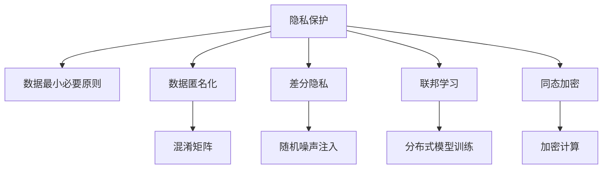

                 

# 隐私保护：保障人类计算中的数据安全

## 1. 背景介绍

### 1.1 问题由来
在信息技术快速发展的今天，数据已经成为了企业、政府乃至社会的最宝贵的资产之一。然而，在数据收集、存储、处理和分析等各个环节，数据隐私保护问题日益凸显。一方面，由于隐私泄露、数据滥用等事件频发，给个人和社会带来了严重损失。另一方面，数据隐私保护的复杂性、技术难度和法律框架限制，也成为企业数字化转型中的重大障碍。如何在大数据时代，在保障数据安全的前提下，充分发挥数据的价值，已成为全球关注的焦点。

### 1.2 问题核心关键点
隐私保护的核心在于如何在数据利用和隐私保护之间取得平衡。数据越精准、全面，其潜在价值越高，但同时也意味着隐私风险越大。隐私保护的重点在于限制数据的使用范围和访问权限，确保数据仅在授权主体下进行合法操作。同时，隐私保护也需要遵循“隐私保护原则”，即：最小化数据收集、使用和公开原则，以及数据最小必要原则。

本论文将全面探讨隐私保护的方法和机制，涵盖隐私保护的理论基础、技术手段、应用场景和未来趋势，致力于为数据安全提供可靠保障，为人类计算带来更好体验。

## 2. 核心概念与联系

### 2.1 核心概念概述

为更好地理解隐私保护技术，本节将介绍几个密切相关的核心概念：

- 隐私保护（Privacy Protection）：旨在保护个人、组织和机构的数据隐私，防止数据被未授权访问、泄露或滥用。
- 数据最小必要原则（Data Minimization）：在数据收集和处理中，只收集和使用必要的数据，避免数据过度收集和滥用。
- 数据匿名化（Data Anonymization）：通过数据变换，使得数据无法识别个人身份或特定组织，从而保护数据隐私。
- 差分隐私（Differential Privacy）：通过添加随机噪声，使个体数据对总体统计特性不产生显著影响，从而保护个体隐私。
- 联邦学习（Federated Learning）：在不共享原始数据的前提下，通过分布式协同训练，使得多个独立节点共享模型的优化结果。
- 同态加密（Homomorphic Encryption）：在不解密数据的情况下，对数据进行计算，保护数据隐私。

这些核心概念之间的逻辑关系可以通过以下Mermaid流程图来展示：



这个流程图展示出隐私保护技术的多样性和复杂性，每个技术手段都有其独特的应用场景和优势，但也面临各自的挑战和局限性。通过理解这些核心概念，我们可以更好地把握隐私保护的全貌和细节。

## 3. 核心算法原理 & 具体操作步骤
### 3.1 算法原理概述

隐私保护的核心算法原理主要包括以下几个方面：

- 数据最小必要原则：确保在数据收集、存储和传输中，只收集和使用必要的数据，避免数据过度收集和滥用。
- 数据匿名化：通过数据变换、混淆、分割等手段，使得数据无法识别个人身份或特定组织，从而保护数据隐私。
- 差分隐私：通过在数据中引入随机噪声，使得个体数据对总体统计特性不产生显著影响，从而保护个体隐私。
- 联邦学习：在不共享原始数据的前提下，通过分布式协同训练，使得多个独立节点共享模型的优化结果，同时保护数据隐私。
- 同态加密：通过加密计算，使得数据在不解密的情况下进行计算，从而保护数据隐私。

这些算法原理共同构成了隐私保护的技术框架，旨在通过多层次的技术手段，从数据处理的全流程中保护数据隐私。

### 3.2 算法步骤详解

隐私保护的具体实施步骤包括：

1. **需求分析与数据分类**：根据业务需求，分析数据使用场景，确定数据分类标准，划分不同隐私等级的数据。

2. **数据最小必要原则**：制定数据最小必要原则，明确数据的收集、存储和传输范围，避免过度收集和滥用。

3. **数据匿名化**：根据数据匿名化需求，选择合适的匿名化方法，如混淆矩阵、泛化、分割等，对数据进行处理。

4. **差分隐私**：引入随机噪声，使得个体数据对总体统计特性不产生显著影响，从而保护个体隐私。

5. **联邦学习**：制定联邦学习协议，选择合适的模型和算法，在分布式节点上协同训练，共享模型的优化结果。

6. **同态加密**：选择合适的同态加密算法，对数据进行加密计算，保护数据隐私。

7. **安全审计与监控**：定期进行安全审计和监控，检测隐私保护的实施情况，及时发现和纠正隐私漏洞。

8. **合规与法律保障**：遵守相关法律法规，确保隐私保护措施符合法律要求，保障数据安全。

### 3.3 算法优缺点

隐私保护技术的主要优点包括：

- 保护数据隐私：通过数据最小必要原则、数据匿名化、差分隐私等手段，有效保护个人和组织的隐私数据。
- 提高数据安全：通过联邦学习和同态加密等技术，在不共享数据的情况下，确保数据在处理过程中的安全性。
- 支持数据协作：联邦学习使得多个独立节点可以协同训练模型，共享优化结果，同时保护数据隐私。

隐私保护技术的主要缺点包括：

- 技术复杂度高：隐私保护技术涉及多个层次，包括数据匿名化、差分隐私、同态加密等，实现复杂度较高。
- 性能开销大：隐私保护技术如差分隐私、同态加密等，在计算和通信开销上较大，可能影响系统性能。
- 安全性依赖技术：隐私保护的效果依赖于技术手段的有效性，一旦技术出现漏洞，可能导致数据泄露。

尽管存在这些缺点，但隐私保护技术在保护数据隐私方面具有不可替代的作用，特别是在大数据时代，如何在大数据利用和隐私保护之间找到平衡，成为隐私保护技术的重要课题。

### 3.4 算法应用领域

隐私保护技术在多个领域得到了广泛应用，包括但不限于：

- 金融领域：金融机构使用差分隐私和联邦学习技术，保护客户数据，同时进行风险评估和金融分析。
- 医疗领域：医疗机构使用同态加密和匿名化技术，保护患者隐私，同时进行疾病研究和数据分析。
- 政府部门：政府机构使用隐私保护技术，保护公民数据，同时进行公共安全和社会治理。
- 互联网企业：互联网公司使用隐私保护技术，保护用户数据，同时进行广告推荐和数据分析。
- 科研机构：科研机构使用隐私保护技术，保护实验数据，同时进行科学研究和技术创新。

这些领域的应用展示了隐私保护技术的广泛性和重要性，隐私保护已经成为数据安全的基本要求。

## 4. 数学模型和公式 & 详细讲解 & 举例说明

### 4.1 数学模型构建

隐私保护涉及多个数学模型，包括差分隐私模型、同态加密模型等。这里以差分隐私为例，构建数学模型。

记原始数据集为 $D=\{x_1, x_2, ..., x_n\}$，其中 $x_i \in X$。差分隐私的目标是在 $D$ 上执行某函数 $f$，使得任意两个相邻数据集 $D$ 和 $D'$ 在添加噪声后的输出差异极小，即：

$$
|P[f(D)] - P[f(D')]| < \epsilon
$$

其中 $P[f(D)]$ 表示函数 $f$ 在数据集 $D$ 上的输出概率，$\epsilon$ 为隐私保护参数，控制隐私保护强度。

### 4.2 公式推导过程

差分隐私的核心在于引入随机噪声，使得单个数据对整体统计特性的影响微乎其微。以下是差分隐私的核心公式推导：

$$
f(D) = f(D) + N
$$

其中 $N$ 为随机噪声，满足 $P(N) = N(\mu, \sigma^2)$，$\mu$ 为噪声均值，$\sigma^2$ 为噪声方差。为了保证隐私保护，需要满足：

$$
|P[f(D)] - P[f(D')]| < \epsilon
$$

即：

$$
|P[f(D) + N] - P[f(D') + N]| < \epsilon
$$

将 $f(D)$ 和 $f(D')$ 的输出概率代入，得：

$$
|P[f(D)] + P(N) - P[f(D')] - P(N)| < \epsilon
$$

进一步化简，得：

$$
|P[f(D)] - P[f(D')]| < \epsilon + 2P(N)
$$

因此，通过控制噪声方差 $\sigma^2$，可以调整隐私保护参数 $\epsilon$，从而在隐私保护和数据实用性之间找到平衡。

### 4.3 案例分析与讲解

以下通过一个简单的例子，说明差分隐私的实际应用。

假设某公司收集了 $n=100$ 个用户的年龄数据，原始数据集为 $D=\{18, 25, ..., 50\}$。公司希望发布年龄数据的统计信息，但同时要保护用户的隐私。

1. **数据集划分**：将数据集划分为 $D_1 = \{18, 25, ..., 35\}$ 和 $D_2 = \{40, 45, ..., 50\}$，两个相邻数据集。

2. **引入噪声**：在每个数据集上引入噪声 $N = \mathcal{N}(0, \sigma^2)$，使得噪声的期望为0。

3. **发布统计信息**：将处理后的数据集发布到公共平台上，公开函数 $f(D) = \frac{1}{n}\sum_{x_i \in D} x_i + N$ 的输出。

4. **隐私保护效果**：即使某个用户年龄为18岁，由于随机噪声的存在，对整体统计信息的影响极小，从而保护了用户的隐私。

这个例子展示了差分隐私的核心思想，即通过引入随机噪声，保护个体数据对整体统计信息的影响，从而实现隐私保护。

## 5. 项目实践：代码实例和详细解释说明

### 5.1 开发环境搭建

在进行隐私保护实践前，我们需要准备好开发环境。以下是使用Python进行差分隐私实践的环境配置流程：

1. 安装Anaconda：从官网下载并安装Anaconda，用于创建独立的Python环境。

2. 创建并激活虚拟环境：
```bash
conda create -n dp-env python=3.8 
conda activate dp-env
```

3. 安装差分隐私库：
```bash
pip install differential_privacy
```

4. 安装各类工具包：
```bash
pip install numpy pandas scikit-learn matplotlib tqdm jupyter notebook ipython
```

完成上述步骤后，即可在`dp-env`环境中开始隐私保护实践。

### 5.2 源代码详细实现

这里我们以差分隐私的应用为例，给出使用Differential Privacy库进行数据隐私保护的PyTorch代码实现。

首先，定义差分隐私参数：

```python
from differential_privacy import PrivacyEngine
from differential_privacy.dp_sampler import GaussianMechanism

epsilon = 0.1
delta = 0.01

# 构建隐私保护引擎
engine = PrivacyEngine(precision=1e-5, epsilon=epsilon, delta=delta)
```

然后，定义数据集和差分隐私机制：

```python
import numpy as np

# 生成样本数据
X = np.random.randint(0, 100, size=(100, 1))
y = np.random.randint(0, 2, size=(100, 1))

# 构建差分隐私机制
dp_sampler = GaussianMechanism(sensitivity=1, epsilon=epsilon, delta=delta)
```

接着，定义差分隐私计算函数：

```python
def dp_train(X, y, dp_sampler, model):
    with engine:
        X_dp = dp_sampler.sample(X)
        y_dp = dp_sampler.sample(y)
        # 在差分隐私保护下训练模型
        model.fit(X_dp, y_dp)
    return model
```

最后，启动训练流程：

```python
from sklearn.linear_model import LogisticRegression

# 训练模型
model = LogisticRegression()
dp_model = dp_train(X, y, dp_sampler, model)
```

以上就是使用PyTorch对差分隐私进行数据隐私保护的完整代码实现。可以看到，使用差分隐私库，可以轻松实现差分隐私计算，并在隐私保护的前提下训练模型。

### 5.3 代码解读与分析

让我们再详细解读一下关键代码的实现细节：

**差分隐私库（Differential Privacy）**：
- `PrivacyEngine`类：用于构建隐私保护引擎，控制隐私保护参数。
- `GaussianMechanism`类：用于引入Gaussian噪声，实现差分隐私。

**差分隐私计算函数（dp_train）**：
- 使用隐私保护引擎 `engine` 控制隐私保护参数，引入Gaussian噪声 `dp_sampler`。
- 在差分隐私保护下训练模型，通过 `with engine` 控制隐私保护过程。

**模型训练**：
- 在差分隐私保护下，使用 `dp_train` 函数训练模型，确保隐私保护的同时获得模型性能。

这个例子展示了差分隐私的实际应用，通过引入Gaussian噪声，在隐私保护的前提下进行模型训练，实现了隐私保护和数据利用的平衡。

## 6. 实际应用场景

### 6.1 数据共享平台

在大数据时代，数据共享平台扮演着越来越重要的角色。然而，由于数据共享涉及多个独立主体，如何在保护各方隐私的同时，实现数据共享和分析，成为数据共享平台的主要挑战。差分隐私和联邦学习等隐私保护技术，为数据共享平台提供了解决方案。

具体而言，可以在数据共享平台上构建差分隐私和联邦学习机制，使得各方在不共享原始数据的前提下，协同训练模型，共享模型的优化结果。这样既保护了各方的数据隐私，又能充分利用数据进行协同分析，实现数据价值的最大化。

### 6.2 智慧城市治理

智慧城市治理涉及大量敏感数据，如交通流量、环境监测数据等。如何在保障城市数据安全的同时，进行数据分析和决策，是智慧城市治理的重要课题。差分隐私和同态加密等隐私保护技术，为智慧城市治理提供了技术支持。

具体而言，可以通过差分隐私技术保护城市数据隐私，同时进行数据分析和决策，提升城市治理的智能化水平。使用同态加密技术，可以在保护数据隐私的同时，对数据进行计算，提升城市治理的效率和精度。

### 6.3 医疗数据分析

医疗数据分析涉及大量敏感数据，如病历记录、基因数据等。如何在保护患者隐私的同时，进行疾病研究和数据分析，是医疗数据分析的主要挑战。差分隐私和同态加密等隐私保护技术，为医疗数据分析提供了技术支持。

具体而言，可以通过差分隐私技术保护患者隐私，同时进行疾病研究和数据分析，提升医疗研究的智能化水平。使用同态加密技术，可以在保护数据隐私的同时，对数据进行计算，提升医疗研究的效率和精度。

### 6.4 未来应用展望

随着隐私保护技术的不断发展，未来的隐私保护技术将在更多领域得到应用，为数据安全提供可靠保障，为人类计算带来更好体验。

在智慧城市治理、智慧医疗、金融服务、社交媒体等领域，隐私保护技术将成为重要支撑。未来，隐私保护技术还将进一步拓展到更多新兴领域，如自动驾驶、物联网等，为这些领域的智能化应用提供技术保障。

## 7. 工具和资源推荐

### 7.1 学习资源推荐

为了帮助开发者系统掌握隐私保护的理论基础和实践技巧，这里推荐一些优质的学习资源：

1. 《隐私保护技术导论》书籍：全面介绍隐私保护的基本概念、技术手段和应用场景，是隐私保护技术的入门必读。

2. 《差分隐私理论与实践》书籍：详细讲解差分隐私的原理和实现方法，适合深入学习差分隐私技术。

3. 《同态加密技术详解》书籍：全面介绍同态加密的原理和实现方法，适合深入学习同态加密技术。

4. 《数据隐私保护与法律》课程：由各大高校和机构开设的隐私保护课程，涵盖隐私保护的基本概念、法律框架和实际案例。

5. 《隐私保护技术博客》：由隐私保护专家撰写的博客，涵盖隐私保护技术的最新进展和应用实践。

通过对这些资源的学习实践，相信你一定能够快速掌握隐私保护技术的精髓，并用于解决实际的隐私保护问题。

### 7.2 开发工具推荐

高效的开发离不开优秀的工具支持。以下是几款用于隐私保护开发的常用工具：

1. Differential Privacy：由谷歌开发的差分隐私库，支持多种隐私保护算法，如Gaussian Mechanism、Laplace Mechanism等。

2. PySyft：由微软开发的联邦学习库，支持分布式协同训练，同时保护数据隐私。

3. SEAL：由微软开发的同态加密库，支持多种同态加密算法，如BFV、CKKS等。

4. WEKA：开源的数据挖掘和统计分析工具，支持多种隐私保护算法，如DP-SVM、DP-Decision Tree等。

5. Apache Spark：大数据处理框架，支持差分隐私和同态加密等隐私保护技术，适用于大数据处理和分析场景。

合理利用这些工具，可以显著提升隐私保护任务的开发效率，加快创新迭代的步伐。

### 7.3 相关论文推荐

隐私保护技术的发展源于学界的持续研究。以下是几篇奠基性的相关论文，推荐阅读：

1. Differential Privacy：由Cynthia Dwork等人在2006年提出，奠定了差分隐私的理论基础。

2. Secure Multi-Party Computation（SMPC）：由Jung秘密协商协议，展示了如何通过加密计算保护数据隐私。

3. Homomorphic Encryption：由Gentry在2009年提出，展示了同态加密的原理和实现方法。

4. Federated Learning：由McMahan等人在2016年提出，展示了如何通过分布式协同训练保护数据隐私。

5. Differential Privacy and Multi-Party Statistics：由Dwork等人在2009年提出，展示了如何在统计分析中保护隐私。

这些论文代表了大数据时代隐私保护技术的发展脉络。通过学习这些前沿成果，可以帮助研究者把握学科前进方向，激发更多的创新灵感。

## 8. 总结：未来发展趋势与挑战

### 8.1 总结

本文对隐私保护的方法和机制进行了全面系统的介绍。首先阐述了隐私保护的重要性和核心概念，明确了隐私保护在数据利用和隐私保护之间的平衡关系。其次，从原理到实践，详细讲解了隐私保护的核心技术手段，包括差分隐私、同态加密、联邦学习等，给出了隐私保护任务开发的完整代码实例。同时，本文还广泛探讨了隐私保护技术在多个行业领域的应用前景，展示了隐私保护技术的广阔前景。

通过本文的系统梳理，可以看到，隐私保护技术在大数据时代具有不可替代的作用，是数据安全的基本要求。隐私保护已经成为数据安全的基本要求。

### 8.2 未来发展趋势

展望未来，隐私保护技术将呈现以下几个发展趋势：

1. 技术手段日益丰富。隐私保护技术将不断引入新的技术手段，如匿名化、差分隐私、同态加密等，形成更加全面的隐私保护体系。

2. 应用场景日益广泛。隐私保护技术将进一步拓展到更多新兴领域，如自动驾驶、物联网等，为这些领域的智能化应用提供技术保障。

3. 法律框架日益完善。隐私保护技术的发展离不开法律框架的支持，未来隐私保护法律将更加完善，为隐私保护提供更好的保障。

4. 人工智能与隐私保护深度融合。隐私保护技术将与人工智能深度融合，形成更加智能化、个性化的隐私保护方案。

5. 跨领域协作日益频繁。隐私保护技术将跨领域、跨行业协同发展，形成更加全面、高效、安全的隐私保护体系。

以上趋势展示了隐私保护技术的广阔前景，隐私保护技术将在大数据时代发挥更加重要的作用。

### 8.3 面临的挑战

尽管隐私保护技术已经取得了一定的进展，但在迈向更加智能化、普适化应用的过程中，它仍面临诸多挑战：

1. 技术复杂度高。隐私保护技术涉及多个层次，包括数据匿名化、差分隐私、同态加密等，实现复杂度较高。

2. 性能开销大。隐私保护技术如差分隐私、同态加密等，在计算和通信开销上较大，可能影响系统性能。

3. 安全性依赖技术。隐私保护的效果依赖于技术手段的有效性，一旦技术出现漏洞，可能导致数据泄露。

4. 法律框架不完善。隐私保护技术的发展依赖于法律框架的支持，但现有的法律框架还存在不完善的地方，可能影响隐私保护的实施效果。

5. 用户隐私意识不足。用户对隐私保护技术的认知不足，可能影响隐私保护的推广和应用。

6. 隐私保护与数据利用的平衡。如何在隐私保护和数据利用之间找到平衡，是隐私保护技术的核心挑战。

这些挑战展示了隐私保护技术的复杂性和多样性，隐私保护技术还需要在技术、法律、用户教育等多个维度不断探索和突破。

### 8.4 研究展望

面对隐私保护面临的诸多挑战，未来的研究需要在以下几个方面寻求新的突破：

1. 探索新的隐私保护算法。引入新的隐私保护算法和技术，如差分隐私的变体、同态加密的优化等，提高隐私保护的效率和安全性。

2. 开发更加智能的隐私保护工具。开发更加智能化、自动化的隐私保护工具，如自动化隐私保护平台、隐私保护插件等，提升隐私保护的效果和应用效率。

3. 加强跨领域协作。加强隐私保护技术的跨领域、跨行业协作，形成更加全面、高效、安全的隐私保护体系。

4. 提升用户隐私意识。加强用户隐私保护意识的宣传和教育，提升用户对隐私保护的认知和信任。

5. 完善隐私保护法律框架。加强隐私保护法律的研究和制定，形成更加完善的隐私保护法律体系，为隐私保护提供更好的保障。

这些研究方向展示了隐私保护技术的广阔前景，隐私保护技术需要从多个维度不断探索和突破，才能在大数据时代实现更好的隐私保护效果。

## 9. 附录：常见问题与解答

**Q1：差分隐私和同态加密有何区别？**

A: 差分隐私和同态加密都是隐私保护技术，但它们的工作机制有所不同。

- 差分隐私：通过在数据中添加噪声，使得个体数据对总体统计特性不产生显著影响，从而保护个体隐私。差分隐私主要关注隐私保护强度，通过控制噪声大小来调整隐私保护参数。
- 同态加密：通过加密计算，使得数据在不解密的情况下进行计算，从而保护数据隐私。同态加密主要关注计算效率，通过优化加密算法和解密算法，提升计算效率。

因此，差分隐私和同态加密适用于不同的场景。差分隐私适用于需要对数据进行统计分析的场景，同态加密适用于需要对数据进行加密计算的场景。

**Q2：联邦学习如何实现隐私保护？**

A: 联邦学习通过分布式协同训练，在不共享原始数据的情况下，使得多个独立节点共享模型的优化结果，从而实现隐私保护。

具体而言，联邦学习的隐私保护机制包括：

1. 数据加密：在传输过程中对数据进行加密，防止数据泄露。

2. 参数聚合：在模型聚合阶段，通过差分隐私等技术对参数进行聚合，防止模型泄露。

3. 安全聚合：在模型聚合阶段，通过多轮安全聚合算法，如Secure Multi-Party Computation（SMPC）等，防止模型泄露。

通过以上机制，联邦学习可以在不共享原始数据的情况下，实现隐私保护。

**Q3：如何评估隐私保护的效果？**

A: 隐私保护的效果可以通过以下几个指标进行评估：

1. 隐私保护参数：如差分隐私中的 $\epsilon$ 和 $\delta$，同态加密中的计算误差等，控制隐私保护强度。

2. 隐私泄露概率：通过模拟攻击等手段，评估隐私泄露的概率和影响。

3. 数据实用性：评估隐私保护后的数据在统计分析和计算中的应用效果。

4. 模型精度：评估隐私保护后的模型在特定任务上的精度和性能。

5. 计算开销：评估隐私保护技术在计算和通信开销上的影响，确保隐私保护的效果不会过度影响系统性能。

通过以上指标，可以全面评估隐私保护的效果，确保隐私保护措施的有效性和可行性。

**Q4：隐私保护和数据利用如何平衡？**

A: 隐私保护和数据利用之间的平衡是一个核心挑战，需要从多个方面进行综合考虑：

1. 最小必要原则：在数据收集和处理中，只收集和使用必要的数据，避免数据过度收集和滥用。

2. 差分隐私：通过引入随机噪声，使得个体数据对总体统计特性不产生显著影响，从而保护个体隐私。

3. 同态加密：通过加密计算，使得数据在不解密的情况下进行计算，从而保护数据隐私。

4. 数据共享协议：通过制定数据共享协议，明确数据使用的范围和权限，确保数据利用的合法性和合规性。

5. 法律保障：遵守相关法律法规，确保隐私保护措施符合法律要求，保障数据安全。

通过以上方法，可以在隐私保护和数据利用之间找到平衡，确保数据安全的同时，最大化数据利用的价值。

---

作者：禅与计算机程序设计艺术 / Zen and the Art of Computer Programming

