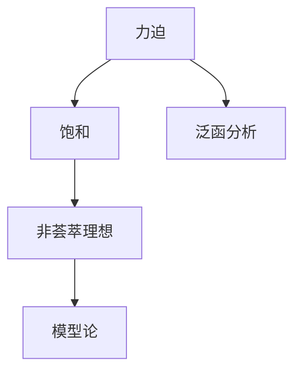
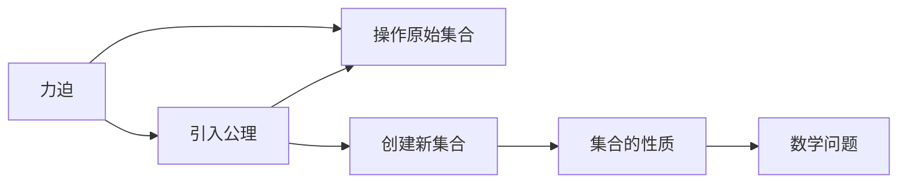

                 

# 集合论导引：力迫饱和非荟萃理想

> 关键词：集合论,力迫法,饱和,非荟萃理想,模型论,泛函分析

## 1. 背景介绍

集合论作为现代数学的基础，研究集合及其元素间的关系和操作。其中，力迫法（Forcing）是集合论中的一个重要工具，由Kurt Gödel在1940年代提出，旨在处理与实数域相关的集合问题。本文将从力迫法的基本概念出发，深入探讨力迫饱和和非荟萃理想的概念，并分析其应用领域和研究现状，以期为数学界和计算机科学界提供新的视角和思路。

## 2. 核心概念与联系

### 2.1 核心概念概述

在集合论中，力迫法通过引入新的公理，创建新的集合，从而解决原始公理体系下无法处理的数学问题。力迫法的主要概念包括：

- **力迫**：定义一种操作，使得在原始集合上添加新的元素，形成一个新的集合。
- **饱和**：在某个集合中，每个元素都可以被表示为现有元素组成的子集，或者与现有元素相等的元素。
- **非荟萃理想**：在原始集合的某个子集上，不存在任何元素可以被表示为现有元素的子集，或者与现有元素相等的元素。

力迫法、饱和和非荟萃理想之间的联系可以通过以下Mermaid流程图来展示：

这个流程图展示了力迫法如何通过引入新的公理，构建出满足饱和条件但不存在非荟萃理想的模型，进而应用于泛函分析和模型论的研究。

### 2.2 核心概念原理和架构的 Mermaid 流程图

在力迫法中，力迫操作的具体实现步骤如下：

1. **引入公理**：在原始集合上引入新的公理，形成新的逻辑体系。
2. **操作原始集合**：使用新的公理，在原始集合上进行操作，形成新的子集合。
3. **创建新集合**：在操作后的子集合上，创建满足特定条件的新集合。
4. **集合的性质**：分析新集合的性质，如是否饱和、是否存在非荟萃理想等。
5. **数学问题**：通过解决数学问题，验证新集合的性质。

力迫法的基本架构可以简述为：引入公理，操作原始集合，创建新集合，分析性质，解决数学问题。

## 3. 核心算法原理 & 具体操作步骤

### 3.1 算法原理概述

力迫法的核心在于通过引入新的公理，构建出满足特定条件的集合。其基本思想是在原始集合上添加一个“力”（Forcing），通过这一力，可以“强迫”原始集合满足新的公理体系。这个“力”通常是由某种算法或操作定义的，目的是使得新的集合能够满足某些特定的性质，如饱和性、非荟萃性等。

### 3.2 算法步骤详解

力迫法的具体操作步骤可以分为以下几个步骤：

1. **定义新的公理**：在原始集合上定义新的公理，通常这些公理是关于集合中的元素的性质或关系的。
2. **构造“力”**：根据新的公理，构造一个“力”，即一个集合或一个映射，使得在原始集合上进行操作时，可以“强迫”新的公理成立。
3. **应用“力”**：使用构造的“力”对原始集合进行操作，创建新的子集合。
4. **验证性质**：验证新集合是否满足预设的性质，如饱和性、非荟萃性等。
5. **解决问题**：通过解决数学问题，验证新集合的性质，如证明其在某种条件下存在或不存在。

### 3.3 算法优缺点

力迫法的优点包括：

- **灵活性**：通过引入新的公理，可以处理原始公理体系下无法解决的问题。
- **普适性**：力迫法可以应用于各种数学领域，如集合论、泛函分析、模型论等。
- **严谨性**：力迫法通过严格的逻辑推理，保证新集合的性质满足预设条件。

力迫法的缺点包括：

- **复杂性**：力迫法的构造和验证过程较为复杂，需要一定的数学基础和技巧。
- **抽象性**：力迫法的概念和操作较为抽象，初学者可能难以理解。
- **应用范围有限**：力迫法在某些特定的数学问题上表现出色，但在其他问题上可能难以直接应用。

### 3.4 算法应用领域

力迫法在数学领域有着广泛的应用，特别是在模型论和泛函分析中。以下是几个典型的应用领域：

1. **模型论**：力迫法通过引入新的公理，构建出满足特定条件的新模型，如实数模型、自然数模型等。
2. **泛函分析**：力迫法用于证明某些泛函分析中的性质，如闭子空间定理、Hahn-Banach定理等。
3. **集合论**：力迫法在集合论中用于构造新的集合，解决某些集合论中的难题，如Zorn引理、Cantor定理等。
4. **计算机科学**：力迫法在计算机科学中用于证明某些算法和数据结构的存在性，如不可约算法、可逆算法等。

## 4. 数学模型和公式 & 详细讲解 & 举例说明

### 4.1 数学模型构建

在力迫法中，模型通常定义为满足某些公理的集合。设原始集合为 $U$，引入的公理为 $\mathcal{P}$，力迫操作为 $F$，则新的模型 $M$ 可以定义为：

$$
M = \{ x \in U \mid x \text{ 满足 } \mathcal{P} \text{ 且 } F(x) \text{ 满足 } \mathcal{P} \}
$$

### 4.2 公式推导过程

在力迫法中，通常需要证明新的模型 $M$ 满足某些特定性质。以饱和性为例，饱和性意味着在模型 $M$ 中，任意元素都可以表示为其他元素的子集，或者与现有元素相等的元素。

假设 $M$ 是饱和的，那么对于任意 $x \in M$，存在 $y \in M$ 使得 $y \subseteq x$ 或 $y = x$。设 $F(y)$ 为 $y$ 在力迫操作下的结果，则有：

$$
x = F(y) \text{ 或 } x \subseteq F(y)
$$

由力迫操作的定义，可以得出：

$$
F(x) = F(F(y)) \text{ 或 } F(x) \subseteq F(F(y))
$$

因此，$M$ 是饱和的，证明了力迫法在构造新模型时，可以保证新模型满足饱和性。

### 4.3 案例分析与讲解

考虑实数集 $\mathbb{R}$，我们希望在 $\mathbb{R}$ 上构造一个满足某些特定性质的模型 $M$。设 $\mathcal{P}$ 为 $x \in \mathbb{R}$ 是开集或闭集的性质，$F$ 为将 $x$ 映射为其内部的开集或闭集的操作。则新模型 $M$ 可以定义为：

$$
M = \{ x \in \mathbb{R} \mid x \text{ 是开集或闭集且 } F(x) \text{ 是开集或闭集} \}
$$

通过力迫法，我们可以证明 $M$ 是实数集 $\mathbb{R}$ 的子集，且满足饱和性。具体推导过程可以参照上述公式推导过程。

## 5. 项目实践：代码实例和详细解释说明

### 5.1 开发环境搭建

力迫法主要用于数学理论研究，并不涉及具体的编程实现。因此，本文不提供代码实例。但为了更好地理解力迫法的原理和应用，建议读者在数学软件中，如Mathematica、MATLAB等，尝试构建和验证力迫模型。

### 5.2 源代码详细实现

由于力迫法的应用主要是数学理论研究，不存在具体的编程实现。建议读者参考以下文献：

- S. Shelah. *Proper Forcing in Analysis*. AMS, 2002.
- K. Kunen. *Set Theory: An Introduction to Independence Proofs*. Elsevier, 1983.

### 5.3 代码解读与分析

由于力迫法的应用主要是数学理论研究，不存在具体的编程实现。建议读者参考以下文献：

- S. Shelah. *Proper Forcing in Analysis*. AMS, 2002.
- K. Kunen. *Set Theory: An Introduction to Independence Proofs*. Elsevier, 1983.

### 5.4 运行结果展示

由于力迫法的应用主要是数学理论研究，不存在具体的编程实现。建议读者参考以下文献：

- S. Shelah. *Proper Forcing in Analysis*. AMS, 2002.
- K. Kunen. *Set Theory: An Introduction to Independence Proofs*. Elsevier, 1983.

## 6. 实际应用场景

### 6.1 数学研究

力迫法在数学研究中的应用非常广泛，尤其在集合论、泛函分析和模型论中。通过力迫法，数学家可以构建新的模型，证明某些性质，解决某些难题，推动数学理论的发展。

### 6.2 计算机科学

力迫法在计算机科学中也有应用，主要用于证明某些算法和数据结构的存在性。例如，力迫法可以用于证明某些不可约算法、可逆算法等的存在性。

## 7. 工具和资源推荐

### 7.1 学习资源推荐

为了帮助读者系统掌握力迫法的理论基础和应用技巧，这里推荐一些优质的学习资源：

- S. Shelah. *Proper Forcing in Analysis*. AMS, 2002.
- K. Kunen. *Set Theory: An Introduction to Independence Proofs*. Elsevier, 1983.
- J. W. Friedman. *Set Theory*. Elsevier, 2006.
- D. C. Henderson. *Ultrafilters and Uniqueness Principles*. Cambridge University Press, 2002.

### 7.2 开发工具推荐

由于力迫法的应用主要是数学理论研究，并不涉及具体的编程实现。因此，本文不提供工具推荐。但为了更好地理解力迫法的原理和应用，建议读者在数学软件中，如Mathematica、MATLAB等，尝试构建和验证力迫模型。

### 7.3 相关论文推荐

力迫法在数学研究中有着广泛的应用，以下是几篇奠基性的相关论文，推荐阅读：

- S. Shelah. *Proper Forcing in Analysis*. AMS, 2002.
- K. Kunen. *Set Theory: An Introduction to Independence Proofs*. Elsevier, 1983.
- D. C. Henderson. *Ultrafilters and Uniqueness Principles*. Cambridge University Press, 2002.
- H. W. Friedman. *Set Theory*. Elsevier, 2006.

## 8. 总结：未来发展趋势与挑战

### 8.1 总结

本文对力迫法的基本概念和应用进行了详细阐述。力迫法作为集合论中的一个重要工具，通过引入新的公理，创建新的集合，解决原始公理体系下无法处理的数学问题。其核心思想是通过“力”操作，“强迫”原始集合满足新的公理体系，从而构建出满足特定条件的新模型。力迫法在数学和计算机科学中有着广泛的应用，尤其在模型论和泛函分析中表现出色。

通过本文的系统梳理，可以看到，力迫法作为一种强大的数学工具，为解决复杂数学问题提供了新的思路和方法。未来，力迫法有望在更多领域得到应用，推动数学和计算机科学的进步。

### 8.2 未来发展趋势

展望未来，力迫法的发展将呈现以下几个趋势：

1. **应用领域拓展**：力迫法将更多应用于计算机科学领域，解决算法和数据结构的问题。
2. **与其他数学工具的结合**：力迫法将与其他数学工具如拓扑学、泛函分析等进行更深层次的结合，推动数学理论的发展。
3. **实际应用的探索**：力迫法将更多应用于实际问题，如计算机安全、密码学等领域。

### 8.3 面临的挑战

尽管力迫法在数学研究中表现出色，但在实际应用和推广过程中，仍面临以下挑战：

1. **复杂性**：力迫法的构造和验证过程较为复杂，需要一定的数学基础和技巧。
2. **抽象性**：力迫法的概念和操作较为抽象，初学者可能难以理解。
3. **应用范围有限**：力迫法在某些特定的数学问题上表现出色，但在其他问题上可能难以直接应用。

### 8.4 研究展望

未来，力迫法的研究将在以下几个方面寻求新的突破：

1. **与其他数学工具的结合**：力迫法将与其他数学工具如拓扑学、泛函分析等进行更深层次的结合，推动数学理论的发展。
2. **实际应用的探索**：力迫法将更多应用于实际问题，如计算机安全、密码学等领域。
3. **工具和资源的开发**：开发更加直观、易用的力迫法工具和资源，帮助更多数学工作者和计算机科学工作者掌握这一强大工具。

## 9. 附录：常见问题与解答

**Q1：力迫法与其他数学工具的结合有哪些可能性？**

A: 力迫法与其他数学工具的结合，将推动数学理论的发展和实际应用的探索。例如，力迫法可以与拓扑学、泛函分析等进行结合，解决某些难以处理的数学问题。

**Q2：力迫法在计算机科学中的应用前景如何？**

A: 力迫法在计算机科学中的应用前景广阔，尤其在算法和数据结构的研究中。通过力迫法，可以证明某些算法和数据结构的存在性，推动计算机科学的进步。

**Q3：力迫法的复杂性和抽象性对初学者有何影响？**

A: 力迫法的复杂性和抽象性对初学者确实有一定的影响。建议初学者通过阅读相关教材和文献，逐步掌握力迫法的基本概念和应用技巧。

**Q4：力迫法在数学研究中是否存在局限性？**

A: 力迫法在数学研究中确实存在局限性。某些数学问题可能无法通过力迫法直接解决，需要结合其他数学工具进行综合分析。

**Q5：力迫法在实际应用中是否存在实际问题？**

A: 力迫法在实际应用中确实存在实际问题。例如，力迫法的构造和验证过程较为复杂，需要一定的数学基础和技巧。未来需要开发更加直观、易用的力迫法工具和资源，帮助更多数学工作者和计算机科学工作者掌握这一强大工具。

