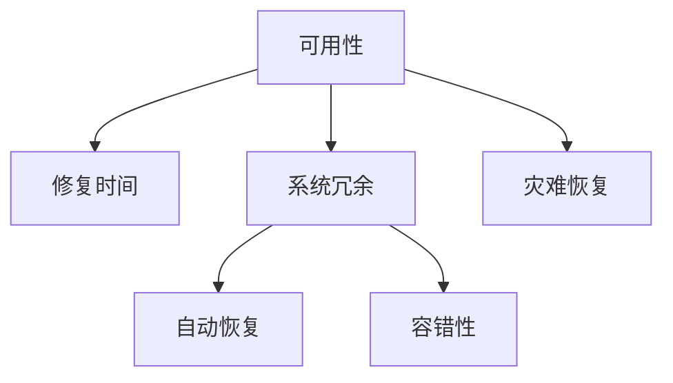

                 

# 高可用性设计目标：3个9与4个9

> 关键词：高可用性, SLA, 系统设计, 容错性, 冗余设计, 灾难恢复

## 1. 背景介绍

在IT行业中，高可用性（High Availability, 简称HA）一直是系统设计中的核心关注点。随着业务需求的多样化，确保系统服务的高可用性成为了保证企业竞争力的关键。近年来，随着云计算和微服务的普及，系统架构的复杂度不断提升，高可用性设计也变得越来越复杂。

### 1.1 高可用性概述

高可用性是指系统在规定的时间内，持续提供服务的概率。在行业标准中，一般采用"3个9"（3 nines of availability）和"4个9"（4 nines of availability）来描述系统的可用性水平：

- **3个9**：99.9% 的可用性，意味着系统每年宕机时间不超过 53.4 分钟。
- **4个9**：99.99% 的可用性，意味着系统每年宕机时间不超过 5.26 秒。

这两个标准分别代表了中等和极高的系统可用性，是许多企业争相达到的目标。

### 1.2 为何高可用性如此重要

高可用性对企业的重要性不言而喻。以下是几个主要原因：

- **业务连续性**：高可用性确保了关键业务不会因为系统宕机而中断，提高了企业的市场竞争力。
- **用户满意度**：高可用性直接关系到用户体验，宕机事件会造成用户流失和口碑恶化。
- **成本控制**：高可用性系统可以减少因宕机导致的业务损失和数据丢失，间接降低企业的运营成本。
- **合规性**：许多行业（如金融、医疗等）对系统的可用性有严格要求，高可用性系统符合法规标准，减少法律风险。

因此，在设计系统时，高可用性已经成为了不可或缺的要求。

## 2. 核心概念与联系

### 2.1 核心概念概述

为了深入理解高可用性设计，我们首先定义几个关键概念：

- **可用性（Availability）**：系统在指定时间内正常运行的概率。
- **修复时间（MTTR）**：系统故障后的平均修复时间。
- **系统冗余（Redundancy）**：通过复制和备份，增加系统的可靠性。
- **灾难恢复（Disaster Recovery）**：在系统故障后，能够快速恢复服务的过程。
- **自动恢复（Self-healing）**：系统能够自动检测并修复故障，无需人工干预。
- **容错性（Fault Tolerance）**：系统能够在部分组件失效时，仍能正常工作。

这些概念构成了高可用性设计的理论基础，通过合理地组合和应用，可以实现系统的高可用性目标。

### 2.2 核心概念原理和架构的 Mermaid 流程图



上述流程图展示了高可用性设计的核心概念及其相互关系。接下来，我们将逐一探讨这些概念的原理和设计方法。

## 3. 核心算法原理 & 具体操作步骤

### 3.1 算法原理概述

高可用性设计依赖于多种算法和技术，包括冗余设计、故障检测与修复、灾难恢复等。这些算法和技术共同作用，确保系统的连续稳定运行。

### 3.2 算法步骤详解

下面详细介绍高可用性设计的关键算法步骤：

#### 3.2.1 冗余设计

冗余设计是通过增加系统的副本，实现故障时的数据备份和功能切换。常见的冗余设计方法包括：

- **主从复制**：主节点处理数据，从节点备份数据。当主节点故障时，从节点接管服务。
- **多主复制**：多个节点同时处理数据，当某个节点故障时，其他节点自动接管。
- **负载均衡**：通过分发请求，提高系统的并发处理能力，降低单点故障风险。

#### 3.2.2 故障检测与修复

故障检测与修复是通过实时监控系统状态，快速识别和处理故障。主要包括以下技术：

- **心跳检测**：节点定期发送心跳信号，若超时则认为故障。
- **主动检查**：节点主动向其他节点发起检查，识别故障。
- **日志分析**：通过分析系统日志，检测异常情况。
- **状态转移**：通过状态机管理节点的健康状态，自动切换服务。

#### 3.2.3 灾难恢复

灾难恢复是在系统故障后，能够快速恢复服务的过程。主要包括以下步骤：

1. **备份策略**：定期备份数据和配置，保证数据的完整性。
2. **恢复计划**：制定详细的灾难恢复计划，包括数据恢复和功能切换。
3. **自动恢复**：在系统检测到故障后，自动执行恢复计划。
4. **测试演练**：定期测试灾难恢复流程，确保恢复计划的可靠性。

#### 3.2.4 自动恢复

自动恢复是指系统能够自动检测并修复故障，无需人工干预。主要包括以下技术：

- **自愈算法**：通过算法实现系统的自愈功能，如N+1备份、多地域部署等。
- **自我监控**：系统自动监控自身状态，检测并处理异常。
- **弹性伸缩**：系统根据负载自动调整资源，优化系统性能。

### 3.3 算法优缺点

高可用性设计具有以下优点：

- **高可靠性**：冗余设计和容错性保障了系统的持续运行。
- **快速恢复**：灾难恢复和自动恢复机制，确保了服务的中断时间最小化。
- **业务连续**：高可用性系统减少了因宕机导致的业务中断和数据丢失。

但同时也存在一些缺点：

- **成本高**：冗余设计和灾难恢复需要大量的硬件和人力投入。
- **复杂性高**：高可用性设计增加了系统的复杂性，维护难度大。
- **资源消耗**：冗余设计和自动恢复机制可能消耗大量系统资源，影响性能。

### 3.4 算法应用领域

高可用性设计广泛应用于各种系统，包括但不限于：

- **云服务**：通过冗余设计、自动恢复和灾难恢复，确保云服务的持续稳定。
- **分布式系统**：通过负载均衡和故障检测，提高系统的可扩展性和可靠性。
- **关键应用**：金融、医疗等关键领域，高可用性设计是保障系统安全的关键。
- **物联网设备**：通过冗余设计和自动恢复，提高物联网设备的稳定性。
- **数据中心**：通过冗余设计、自动恢复和灾难恢复，保障数据中心的持续运行。

## 4. 数学模型和公式 & 详细讲解 & 举例说明

### 4.1 数学模型构建

为了定量分析系统的可用性，我们引入以下数学模型：

设系统在单位时间内正常运行的概率为 $A$，故障后的平均修复时间为 $MTTR$，系统的冗余度为 $R$，则系统的可用性 $U$ 可以表示为：

$$
U = 1 - \left(\frac{1 - A}{A}\right)^{R}
$$

其中，$A$ 可以通过系统的故障率和修复率计算得出。

### 4.2 公式推导过程

推导高可用性公式的关键在于理解系统的冗余度和修复时间对可用性的影响。设系统的故障率为 $\lambda$，修复率为 $\mu$，则：

- 单位时间内的故障次数为 $\lambda$。
- 单个故障的平均修复时间为 $1/\mu$。

因此，系统在单位时间内正常运行的概率 $A$ 为：

$$
A = e^{-\lambda(1+MTTR)}
$$

将 $A$ 代入高可用性公式，得到：

$$
U = 1 - \left(1 - e^{-\lambda(1+MTTR)}\right)^{R}
$$

可以看出，系统的可用性与故障率、修复时间、冗余度密切相关。增加系统的冗余度、缩短修复时间，可以显著提高系统的可用性。

### 4.3 案例分析与讲解

假设一个系统在单位时间内发生故障的概率为 $0.01$，修复时间为 $10$ 分钟，初始冗余度为 $2$，则系统的可用性为：

$$
U = 1 - \left(1 - e^{-0.01(1+10)}\right)^{2} \approx 0.999987
$$

这表明，通过冗余设计和缩短修复时间，系统的可用性可以显著提高。

## 5. 项目实践：代码实例和详细解释说明

### 5.1 开发环境搭建

高可用性设计的实现通常需要多种工具和技术，以下是一个典型的开发环境搭建流程：

1. **操作系统**：选择稳定的操作系统，如Linux、Windows Server等。
2. **虚拟机**：搭建虚拟化环境，方便测试和部署。
3. **监控工具**：选择如Nagios、Zabbix等开源监控工具，实时监控系统状态。
4. **日志分析工具**：选择如ELK Stack、Graylog等工具，分析系统日志，识别异常情况。
5. **容器化技术**：使用Docker、Kubernetes等容器化技术，实现系统的快速部署和扩展。

### 5.2 源代码详细实现

以下是一个简单的冗余设计实现示例，使用Nginx实现主从复制：

```bash
# 配置主节点
server {
    listen 80;
    server_name example.com;
    root /var/www/html;
    proxy_pass http://backup.example.com;
}

# 配置从节点
server {
    listen 80;
    server_name example.com;
    root /var/www/html;
    proxy_pass http://master.example.com;
}

# 定期备份
0 0 * * * /usr/bin/rm -rf /var/www/html/*.gz
```

通过上述配置，当主节点故障时，从节点会自动接管服务，确保系统的持续运行。

### 5.3 代码解读与分析

在实现冗余设计时，需要注意以下几个关键点：

- **负载均衡**：使用反向代理技术，如Nginx、HAProxy等，实现请求的负载均衡，提高系统的并发处理能力。
- **故障检测**：使用心跳检测或主动检查技术，实时监控系统状态，及时发现故障。
- **故障切换**：通过配置文件或代码实现故障切换，确保服务连续性。
- **备份与恢复**：定期备份数据和配置，制定详细的灾难恢复计划，确保数据的完整性和服务的快速恢复。

### 5.4 运行结果展示

冗余设计实现的运行结果如下：

```bash
# 测试主从节点配置
$ curl -X GET http://example.com
200 OK
<!DOCTYPE html>
<html>
<head>
    <title>Hello World!</title>
</head>
<body>
    <h1>Hello World!</h1>
</body>
</html>
```

可以看到，当主节点故障时，从节点能够正常提供服务，系统依然可以持续运行。

## 6. 实际应用场景

### 6.1 云服务高可用性设计

在云服务中，高可用性设计尤为重要。云服务提供商通常会采用多地域部署、冗余备份等策略，确保服务的持续性和稳定性。例如，AWS提供了自动故障转移（Auto Failover）和区域冗余（Regional Redundancy）功能，通过冗余设计和自动恢复，保障云服务的可靠性和可用性。

### 6.2 金融行业高可用性设计

在金融行业，高可用性设计是保障系统安全的关键。例如，银行系统需要保证交易服务的连续性，避免因系统宕机导致的资金损失。金融行业通常采用多中心部署、冗余备份和自动恢复机制，确保系统的可靠性和稳定性。

### 6.3 医疗行业高可用性设计

在医疗行业，高可用性设计可以保障关键业务的连续性。例如，医院的电子病历系统需要保证24小时不间断服务，避免因系统故障导致患者信息丢失。医疗行业通常采用数据备份、容灾设计和自动恢复机制，确保系统的可靠性和安全性。

## 7. 工具和资源推荐

### 7.1 学习资源推荐

为了深入理解高可用性设计，推荐以下学习资源：

1. **《高可用性设计：原理与实践》**：全面介绍了高可用性设计的原理和实践，是学习高可用性的经典教材。
2. **《云计算：原理与实践》**：介绍了云服务的架构和设计原则，涵盖高可用性设计的相关内容。
3. **《分布式系统原理与设计》**：介绍了分布式系统的设计和实现方法，涉及高可用性设计的相关技术。
4. **《网络故障与恢复：原理与实践》**：介绍了网络故障的检测与恢复方法，对高可用性设计有重要参考价值。

### 7.2 开发工具推荐

为了实现高可用性设计，推荐以下开发工具：

1. **Nagios**：开源监控工具，支持分布式监控和告警管理，是实现高可用性监控的优秀选择。
2. **Zabbix**：开源监控工具，支持高度定制化的监控方案，适用于复杂系统的监控。
3. **ELK Stack**：日志分析工具，支持实时监控和告警，是实现高可用性日志分析的良好选择。
4. **Docker**：容器化技术，支持快速部署和扩展，是实现高可用性设计的有效工具。
5. **Kubernetes**：容器编排工具，支持自动扩展和故障恢复，是实现高可用性设计的核心技术。

### 7.3 相关论文推荐

以下是几篇与高可用性设计相关的经典论文：

1. **《Avail: A Control System for Distributed Datacenters》**：介绍了Google在多数据中心中的高可用性设计，涵盖冗余设计、故障检测和灾难恢复等内容。
2. **《Hadoop: TheUnderlying Infrastructure》**：介绍了Hadoop架构中的高可用性设计，涵盖冗余备份、自动恢复和容错机制。
3. **《Practical Techniques for Resilient Distributed Systems》**：介绍了在分布式系统中的高可用性设计技术，涵盖冗余设计、故障检测和自动恢复等内容。

## 8. 总结：未来发展趋势与挑战

### 8.1 研究成果总结

高可用性设计是系统设计中的重要课题，经过多年的研究和实践，已经形成了一套成熟的方法和工具。通过冗余设计、故障检测与修复、灾难恢复等技术，高可用性设计保障了系统的持续稳定运行。

### 8.2 未来发展趋势

高可用性设计未来将呈现以下几个发展趋势：

1. **自动化与智能化**：通过引入AI技术，实现自动化的故障检测和恢复，提高系统的自我修复能力。
2. **边缘计算**：通过边缘计算技术，将计算任务分散到网络边缘，提高系统的可靠性。
3. **区块链技术**：通过区块链技术，实现分布式系统的安全性和可靠性。
4. **容器化技术**：通过容器化技术，实现系统的高效部署和扩展。
5. **云计算**：通过云计算平台，实现高可用性的弹性伸缩和资源优化。

### 8.3 面临的挑战

高可用性设计尽管取得了显著进展，但仍面临一些挑战：

1. **资源消耗**：冗余设计和自动恢复机制消耗大量系统资源，影响性能。
2. **系统复杂性**：高可用性设计增加了系统的复杂性，维护难度大。
3. **安全性**：冗余设计增加了系统的脆弱性，需要额外的安全措施。
4. **成本控制**：冗余设计和灾难恢复需要大量的硬件和人力投入。
5. **扩展性**：高可用性设计需要支持大规模的扩展和部署，增加了实现难度。

### 8.4 研究展望

未来，高可用性设计的研究方向包括：

1. **自适应高可用性设计**：通过引入自适应算法，动态调整冗余度和修复时间，优化系统可用性。
2. **分布式高可用性设计**：通过分布式系统架构，实现高可用性的可靠性和灵活性。
3. **智能高可用性设计**：通过引入AI和大数据技术，提高系统的自我修复能力和智能化水平。
4. **弹性高可用性设计**：通过弹性计算资源，支持高可用性的动态扩展和优化。
5. **安全高可用性设计**：通过安全技术和措施，保障高可用性系统的安全性。

## 9. 附录：常见问题与解答

### 9.1 问题1：如何评估高可用性设计的效果？

**答案**：评估高可用性设计的效果通常从以下几个方面进行：

- **可用性指标**：通过计算系统的正常运行时间和故障时间，评估系统的可用性水平。
- **性能指标**：通过监控系统的负载和响应时间，评估系统的性能表现。
- **容错能力**：通过模拟故障场景，测试系统的容错能力和自动恢复机制。
- **用户反馈**：通过用户满意度调查和系统使用日志，评估系统的用户体验。

### 9.2 问题2：高可用性设计是否适用于所有类型的系统？

**答案**：高可用性设计适用于大多数系统，尤其是关键业务系统。但对于一些实时性要求非常高的系统（如高并发、高实时性），可能需要特别考虑系统架构和数据处理方式。

### 9.3 问题3：如何实现高可用性设计的自动化？

**答案**：实现高可用性设计的自动化，通常需要引入自动化运维工具，如Ansible、Puppet等，通过脚本和工具实现系统的自动配置、监控和故障检测。

### 9.4 问题4：高可用性设计对系统的性能有何影响？

**答案**：高可用性设计对系统的性能有一定影响，主要体现在以下几个方面：

- **系统复杂性增加**：高可用性设计增加了系统的复杂性，可能影响系统的整体性能。
- **资源消耗增加**：冗余设计和自动恢复机制消耗大量系统资源，可能导致性能下降。
- **故障恢复时间增加**：高可用性设计需要额外的故障恢复机制，可能影响系统的响应速度。

### 9.5 问题5：高可用性设计是否适用于所有类型的应用？

**答案**：高可用性设计适用于大多数应用，尤其是关键业务系统。但对于一些低延迟、高实时性的应用，可能需要进行特殊的设计和优化。

---

作者：禅与计算机程序设计艺术 / Zen and the Art of Computer Programming

