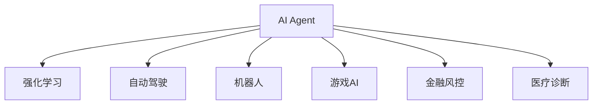

                 

# AI Agent: AI的下一个风口 典型案例和商业应用

## 1. 背景介绍

随着人工智能（AI）技术的快速发展，AI Agent（智能体）正成为AI的新风口，其应用前景广阔。AI Agent是一种通过模拟人类智能行为的算法，可以在复杂环境中做出自主决策，应用于各种自动驾驶、机器人、游戏等领域。本文将探讨AI Agent的典型案例和商业应用，为读者提供深入了解这一新兴领域的视角。

### 1.1 问题由来

AI Agent的概念最早由人工智能领域的先驱Alan Turing在1950年提出，旨在探索机器如何像人类一样具备感知、学习、决策等智能行为。随着深度学习、强化学习等技术的发展，AI Agent已经从理论研究走向实际应用。AI Agent不仅能处理复杂任务，还能在特定领域表现出超越人类的能力，如AlphaGo在围棋领域的卓越表现，标志着AI Agent技术的成熟和实用。

### 1.2 问题核心关键点

AI Agent的核心在于其自主学习、自主决策的能力。通过在特定环境中不断学习和调整策略，AI Agent能够在没有任何人工干预的情况下，完成复杂的任务。AI Agent的典型特征包括：
- 自主学习：无需人类干预，通过观察环境、执行动作、接收反馈等过程不断优化策略。
- 自主决策：能够在不确定环境中做出最优决策，适应多种场景变化。
- 跨领域应用：可以应用于自动驾驶、机器人、游戏、金融、医疗等多个领域，解决实际问题。

本文将重点探讨AI Agent在不同场景下的应用，并分析其在商业领域的发展潜力。

## 2. 核心概念与联系

### 2.1 核心概念概述

为帮助读者理解AI Agent的基本原理和应用场景，本节将介绍几个关键概念：

- AI Agent：一种通过模拟人类智能行为，在特定环境中做出自主决策的算法。
- 强化学习（Reinforcement Learning, RL）：一种学习范式，通过试错和奖励机制不断优化策略，使AI Agent在特定环境中选择最优行动。
- 自动驾驶（Autonomous Driving）：利用AI Agent技术实现汽车、无人机等自主导航和决策。
- 机器人（Robotics）：通过AI Agent实现工业、服务机器人等智能操作。
- 游戏（Game AI）：利用AI Agent优化游戏AI策略，提升游戏体验。
- 金融风控（Financial Risk Control）：通过AI Agent预测市场趋势，进行风险管理和投资决策。
- 医疗诊断（Medical Diagnosis）：利用AI Agent分析医疗影像、病历，辅助医生进行诊断。

这些概念之间的逻辑关系可以通过以下Mermaid流程图来展示：



这个流程图展示出AI Agent与强化学习及其他关键概念之间的联系：

- AI Agent通过强化学习不断优化决策策略。
- AI Agent技术可以应用于自动驾驶、机器人、游戏、金融、医疗等多个领域。

## 3. 核心算法原理 & 具体操作步骤
### 3.1 算法原理概述

AI Agent的核心算法是强化学习，其目标是通过不断与环境互动，最大化累积奖励。具体而言，强化学习由以下几个关键组件构成：

- 环境（Environment）：AI Agent与环境交互的平台，提供了状态、动作、奖励等信息。
- 策略（Policy）：AI Agent决策的行为策略，通过不断调整策略，使AI Agent在特定环境中选择最优行动。
- 奖励函数（Reward Function）：根据AI Agent的行为选择给予奖励或惩罚，以指导策略的优化。

AI Agent通过观察环境、执行动作、接收反馈的过程，不断调整策略，直到最大化累积奖励。该过程可以用以下公式表示：

$$
\max_{\theta} \mathbb{E}_{s\sim\pi} \left[ \sum_{t=0}^{\infty} \gamma^t r_t(s_t,\theta) \right]
$$

其中 $\theta$ 表示策略参数，$\pi$ 表示当前策略，$\gamma$ 表示折扣因子，$r_t$ 表示当前时间步的奖励。

### 3.2 算法步骤详解

基于强化学习的AI Agent实现过程一般包括以下几个关键步骤：

**Step 1: 环境建模**

- 定义环境模型：根据应用场景设计环境模型，包括状态空间、动作空间、奖励函数等。例如，在自动驾驶中，状态空间可能包括车辆位置、速度、周围车辆位置等信息。
- 选择状态表示方式：将状态空间映射为计算机可以处理的数据格式。例如，使用稀疏编码或向量表示法。

**Step 2: 策略定义**

- 选择策略模型：根据任务复杂度和数据规模选择合适的策略模型，如Q-learning、Deep Q-Networks等。
- 初始化策略参数：根据经验初始化策略参数，通常使用随机初始化或预设参数。
- 确定探索策略：在初期选择探索策略，如$\epsilon$-greedy策略，以平衡探索和利用。

**Step 3: 交互学习**

- 执行动作：根据当前状态，选择动作并执行，接收环境反馈。
- 更新策略参数：根据奖励信号和状态变化，更新策略参数，优化策略性能。
- 周期性评估：定期评估策略性能，如果策略表现不佳，则重新调整策略。

**Step 4: 部署与优化**

- 部署模型：将训练好的AI Agent模型部署到实际应用场景中。
- 持续优化：根据实际环境反馈，不断调整策略参数，提升AI Agent的性能。
- 模型监测：监控AI Agent的运行状态，确保其在实际应用中稳定运行。

### 3.3 算法优缺点

强化学习在优化策略方面具有以下优点：
- 无需大量标注数据：强化学习通过与环境交互，自然获取数据，无需标注。
- 适应性强：AI Agent可以在复杂、动态环境中做出最优决策。
- 鲁棒性好：AI Agent能够在未知环境中表现出稳定的性能。

但强化学习也存在一些缺点：
- 策略优化难度高：需要设计合适的奖励函数和策略模型，才能最大化累积奖励。
- 计算复杂度高：强化学习需要大量的计算资源，特别是在高维状态空间中。
- 探索与利用平衡：初期探索策略可能导致策略优化效率低下。

尽管存在这些局限性，但强化学习作为AI Agent的核心算法，在许多复杂任务中已经表现出显著的优势，成为AI Agent技术的核心。

### 3.4 算法应用领域

AI Agent技术在多个领域中已经得到了广泛应用，如：

- 自动驾驶：AI Agent通过环境感知、路径规划、决策执行等过程，实现自主导航和避障。
- 机器人：AI Agent在工业、服务机器人中实现自主操作和任务执行，提升生产效率。
- 游戏AI：AI Agent在游戏中实现自适应决策，提升游戏AI水平，增强玩家体验。
- 金融风控：AI Agent通过市场分析、风险评估，进行投资决策和风险管理。
- 医疗诊断：AI Agent通过医学影像分析、病历分析，辅助医生进行诊断和治疗。
- 智能客服：AI Agent通过自然语言处理和决策，实现智能客服系统，提升服务效率和质量。

## 4. 数学模型和公式 & 详细讲解 & 举例说明
### 4.1 数学模型构建

AI Agent的数学模型主要基于强化学习的框架。假设AI Agent在一个连续状态空间 $s \in \mathcal{S}$ 中进行操作，每个状态 $s_t$ 对应一个动作 $a_t \in \mathcal{A}$，并在每个时间步 $t$ 获得一个奖励 $r_t$。AI Agent的目标是通过观察状态 $s_t$，选择动作 $a_t$，最大化累积奖励 $R_{\theta} = \sum_{t=0}^{\infty} \gamma^t r_t(s_t,\theta)$。其中，$\gamma$ 为折扣因子。

### 4.2 公式推导过程

以下是AI Agent的强化学习公式推导过程：

设 $\pi$ 为策略函数，$\theta$ 为策略参数，则期望累积奖励 $R_{\theta}$ 可以表示为：

$$
R_{\theta} = \mathbb{E}_{s\sim\pi} \left[ \sum_{t=0}^{\infty} \gamma^t r_t(s_t,\theta) \right]
$$

其中 $s_t$ 为状态，$r_t$ 为奖励，$\gamma$ 为折扣因子。

根据强化学习的原理，最大化累积奖励的目标可以转化为最大化期望的即时奖励，即：

$$
\max_{\theta} \mathbb{E}_{s\sim\pi} \left[ \sum_{t=0}^{\infty} \gamma^t r_t(s_t,\theta) \right] = \max_{\theta} \mathbb{E}_{s\sim\pi} \left[ r_t(s_t,\theta) \right]
$$

在实际应用中，AI Agent通常使用Q-Learning、SARSA、Deep Q-Networks等算法来实现这一目标。例如，Q-Learning算法的基本公式为：

$$
Q(s_t,a_t) \leftarrow (1-\epsilon)Q(s_t,a_t) + \epsilon r_t + \gamma \max_{a'} Q(s_{t+1},a')
$$

其中 $Q(s_t,a_t)$ 表示在状态 $s_t$ 下执行动作 $a_t$ 的即时奖励，$\epsilon$ 表示探索策略的参数，$\gamma$ 表示折扣因子。

### 4.3 案例分析与讲解

以自动驾驶为例，AI Agent通过摄像头、雷达等传感器感知周围环境，在每个时间步选择适当的动作（如加速、减速、转向），并通过与环境的互动获得奖励。通过不断优化策略，AI Agent能够在复杂的城市道路中做出安全、高效的决策。

## 5. 项目实践：代码实例和详细解释说明
### 5.1 开发环境搭建

在进行AI Agent开发前，需要准备好开发环境。以下是使用Python进行OpenAI Gym环境搭建的步骤：

1. 安装OpenAI Gym：从官网下载并安装OpenAI Gym，用于模拟环境。
```bash
pip install gym
```

2. 创建和运行环境：
```bash
gym.make('CartPole-v1')
env = gym.make('CartPole-v1')
env.reset()
```

3. 安装PyTorch、TensorFlow等深度学习框架：
```bash
pip install torch tensorflow
```

4. 安装深度学习模型库，如TensorFlow、PyTorch等。
```bash
pip install tensorflow-hub tensorflow-addons torchvision pytorch-lightning
```

完成上述步骤后，即可在Python环境中开始AI Agent开发。

### 5.2 源代码详细实现

以下是使用TensorFlow实现Q-Learning算法的代码实现：

```python
import tensorflow as tf
import numpy as np
import gym

env = gym.make('CartPole-v1')
env.reset()

# 定义策略函数
def policy(s):
    return np.random.randint(2)

# 定义动作选择函数
def choose_action(s, epsilon=0.1):
    if np.random.rand() < epsilon:
        return np.random.randint(2)
    else:
        return policy(s)

# 定义奖励函数
def reward(env, a):
    r = 0
    d = False
    while not d:
        next_s, r_, d, _ = env.step(a)
        r += r_
    return r

# 定义Q-Learning算法
def q_learning(env, num_episodes=1000, epsilon=0.1):
    Q = np.zeros([env.observation_space.n, env.action_space.n])
    for i in range(num_episodes):
        s = env.reset()
        a = choose_action(s, epsilon)
        r = reward(env, a)
        for j in range(10):
            s_next, r_, d, _ = env.step(a)
            r += r_
            Q[s, a] += (r_ + gamma * np.max(Q[s_next, :]) - Q[s, a])
            s = s_next
            if d:
                break
        if i % 100 == 0:
            print(f"Episode: {i}, Total reward: {r}")
    return Q

# 设置参数
gamma = 0.9
num_episodes = 1000
epsilon = 0.1

# 运行Q-Learning算法
Q = q_learning(env, num_episodes=num_episodes, epsilon=epsilon)
```

### 5.3 代码解读与分析

上述代码中，我们使用了TensorFlow实现了一个简单的Q-Learning算法，用于训练AI Agent在CartPole环境中学习最优策略。

- 首先，我们导入了TensorFlow、NumPy等库，并创建了CartPole环境。
- 接着，我们定义了策略函数、动作选择函数和奖励函数，用于计算AI Agent的即时奖励。
- 然后，我们定义了Q-Learning算法，通过不断与环境互动，更新Q值，优化策略。
- 最后，我们设置参数并运行算法，输出每100次迭代的总奖励。

可以看到，通过TensorFlow实现Q-Learning算法，代码实现非常简单，易于理解和调试。在实际应用中，我们还可以根据任务需求，修改策略函数、动作选择函数和奖励函数，灵活应对不同场景。

## 6. 实际应用场景
### 6.1 智能客服系统

AI Agent技术在智能客服系统中的应用已经相当成熟。传统的客服系统需要大量人工客服，高峰期响应速度慢，且容易出现错误。通过AI Agent，智能客服系统可以24小时不间断工作，快速响应客户咨询，提升客户体验。

在技术实现上，智能客服系统通常包括自然语言处理（NLP）、对话管理、知识库检索等功能。AI Agent通过学习和理解客户的意图，自动匹配相应的答案模板，并从知识库中检索答案。对于新问题，AI Agent还可以动态生成答案，提供更个性化的服务。

### 6.2 金融风控

AI Agent在金融风控领域的应用也十分广泛。金融市场风险高，波动大，传统风控方法难以应对复杂环境。AI Agent通过学习历史市场数据和交易行为，预测市场趋势，进行风险管理和投资决策。

具体而言，AI Agent可以分析历史价格、交易量、经济指标等数据，构建风险模型，预测市场走势。在实际应用中，AI Agent还可以实时监控市场变化，及时调整投资策略，降低风险损失。

### 6.3 医疗诊断

AI Agent在医疗诊断领域也有重要应用。传统医疗诊断依赖医生的经验和知识，效率低、误差大。通过AI Agent，医生可以借助AI的力量，提高诊断的准确性和效率。

在实际应用中，AI Agent可以分析医学影像、病历等数据，辅助医生进行疾病诊断。例如，AI Agent可以通过分析X光片、CT扫描等影像数据，识别病变区域，给出诊断建议。同时，AI Agent还可以分析病历信息，提供诊断报告，减少医生的工作负担。

## 7. 工具和资源推荐
### 7.1 学习资源推荐

为了帮助开发者系统掌握AI Agent的原理和实践技巧，这里推荐一些优质的学习资源：

1. 《强化学习：行动空间》系列博文：由AI专家撰写，深入浅出地介绍了强化学习的基本概念和核心算法，包括Q-Learning、Deep Q-Networks等。

2. 斯坦福大学《CS229: 机器学习》课程：斯坦福大学开设的机器学习明星课程，包含强化学习、深度学习等多个主题，适合进阶学习。

3. 《Hands-On Reinforcement Learning with Python》书籍：讲解如何使用Python实现强化学习算法，包含大量实际案例和代码实现。

4. OpenAI Gym官方文档：OpenAI Gym是强化学习的重要工具库，提供了丰富的环境和模型实现，适合快速上手实验。

5. TensorFlow官方文档：TensorFlow是目前最流行的深度学习框架之一，提供了丰富的AI Agent实现和训练工具。

通过对这些资源的学习实践，相信你一定能够快速掌握AI Agent的精髓，并用于解决实际的AI问题。

### 7.2 开发工具推荐

高效的开发离不开优秀的工具支持。以下是几款用于AI Agent开发的常用工具：

1. OpenAI Gym：提供多种模拟环境和模型，适合快速实验和验证算法。

2. TensorFlow：基于深度学习的AI Agent实现，支持分布式计算和GPU加速。

3. PyTorch：灵活的深度学习框架，支持动态图和静态图，易于实现和调试。

4. Weights & Biases：模型训练的实验跟踪工具，可以记录和可视化模型训练过程中的各项指标。

5. TensorBoard：TensorFlow配套的可视化工具，可实时监测模型训练状态，提供丰富的图表呈现方式。

合理利用这些工具，可以显著提升AI Agent的开发效率，加快创新迭代的步伐。

### 7.3 相关论文推荐

AI Agent技术的发展离不开学界的持续研究。以下是几篇奠基性的相关论文，推荐阅读：

1. Q-Learning: A method for controlling robots by trial and error. （Q-Learning算法）

2. Playing Atari with deep reinforcement learning. （利用深度强化学习玩Atari游戏）

3. AlphaGo Zero: Mastering the game of Go without human knowledge. （AlphaGo Zero学习下围棋）

4. Multi-Agent Deep Reinforcement Learning in A Mapless World. （多Agent强化学习）

5. DeepMind AlphaFold: An algorithmic framework for predicting protein structures. （AI Agent在蛋白质结构预测中的应用）

这些论文代表了大模型微调技术的发展脉络。通过学习这些前沿成果，可以帮助研究者把握学科前进方向，激发更多的创新灵感。

## 8. 总结：未来发展趋势与挑战
### 8.1 总结

本文对AI Agent的典型案例和商业应用进行了全面系统的介绍。首先阐述了AI Agent的基本原理和应用场景，明确了AI Agent在智能客服、金融风控、医疗诊断等领域的重要作用。其次，从原理到实践，详细讲解了AI Agent的强化学习算法和关键步骤，给出了AI Agent任务开发的完整代码实现。同时，本文还探讨了AI Agent技术在实际应用中的挑战和未来发展趋势。

通过本文的系统梳理，可以看到，AI Agent作为AI的新风口，其应用前景广阔，对各行各业的智能化转型具有重要意义。AI Agent技术在提升生产效率、改善用户体验、降低运营成本等方面具有巨大潜力。未来，伴随AI Agent技术的持续进步，相信将有更多创新应用涌现，推动人工智能技术的全面普及。

### 8.2 未来发展趋势

展望未来，AI Agent技术将呈现以下几个发展趋势：

1. 多智能体学习：未来AI Agent将不再孤立工作，而是通过多智能体协作，实现更加复杂的任务。例如，多个AI Agent可以共同工作，协调行动，解决更加复杂的现实问题。

2. 深度学习与强化学习结合：未来AI Agent将更多地融合深度学习技术，提升决策能力和泛化能力。例如，使用卷积神经网络提取视觉信息，使用RNN处理时序数据。

3. 自适应学习：AI Agent将具备更强的自适应能力，能够在不同环境中不断学习、调整策略，适应多种场景变化。

4. 跨领域应用：AI Agent将不仅应用于自动驾驶、机器人等传统领域，还将拓展到教育、娱乐、艺术等更多领域。

5. 伦理与安全性：AI Agent的应用需要考虑伦理与安全性问题，避免恶意用途，确保算法的公正、透明、可信。

以上趋势凸显了AI Agent技术的广阔前景。这些方向的探索发展，必将进一步提升AI Agent的性能和应用范围，为人工智能技术的落地应用提供新的动力。

### 8.3 面临的挑战

尽管AI Agent技术已经取得了显著成就，但在迈向更加智能化、普适化应用的过程中，仍面临诸多挑战：

1. 计算资源需求高：AI Agent需要大量的计算资源，特别是高维状态空间和复杂任务中，计算复杂度非常高。

2. 探索与利用平衡：AI Agent需要在大规模探索与利用之间找到平衡，避免陷入局部最优解。

3. 环境模型构建：环境模型设计复杂，需要根据实际应用场景设计合适的状态空间和动作空间。

4. 模型泛化能力不足：AI Agent在复杂环境中的泛化能力不足，难以应对多种未知情况。

5. 多智能体协作困难：多智能体协作需要考虑任务分配、通信、同步等问题，实现难度较大。

6. 伦理与安全问题：AI Agent需要考虑伦理与安全问题，避免有害行为，确保系统的安全性。

以上挑战是AI Agent技术进一步发展的瓶颈，需要在算法、硬件、应用等多个方面进行协同优化，才能使AI Agent技术真正落地应用。

### 8.4 研究展望

面对AI Agent面临的挑战，未来的研究需要在以下几个方面寻求新的突破：

1. 改进强化学习算法：开发更加高效、稳定的强化学习算法，提升AI Agent的决策能力和泛化能力。

2. 优化模型结构：研究高效的模型结构，如稀疏编码、混合精度训练等，提升AI Agent的计算效率。

3. 引入更多先验知识：将符号化的先验知识，如知识图谱、逻辑规则等，与神经网络模型进行巧妙融合，提升AI Agent的智能水平。

4. 开发多智能体协作算法：研究多智能体协作方法，解决任务分配、通信、同步等问题，提高协作效率。

5. 引入因果分析工具：使用因果分析方法，识别AI Agent决策的关键特征，增强输出的可解释性和逻辑性。

6. 引入博弈论工具：利用博弈论工具，刻画人机交互过程，主动探索并规避AI Agent的脆弱点，提高系统稳定性。

7. 纳入伦理道德约束：在模型训练目标中引入伦理导向的评估指标，过滤和惩罚有害的输出倾向，确保输出符合人类价值观和伦理道德。

这些研究方向将推动AI Agent技术向更加智能、普适、可信的方向发展，为人工智能技术在各个领域的应用提供新的思路和方法。

## 9. 附录：常见问题与解答

**Q1：AI Agent如何学习新任务？**

A: AI Agent通过与环境互动，不断学习新任务。在每个时间步，AI Agent观察环境状态，选择动作，接收反馈，更新策略参数，最终达到最优策略。对于新任务，AI Agent可以通过数据增强、迁移学习等方法，快速学习任务相关知识，提升性能。

**Q2：AI Agent在实际应用中需要注意哪些问题？**

A: AI Agent在实际应用中需要注意以下几个问题：
1. 数据质量：AI Agent需要高质量的数据进行训练，数据偏差可能导致模型失效。
2. 模型泛化能力：AI Agent需要在不同环境中表现稳定，泛化能力不足可能导致模型失效。
3. 计算资源：AI Agent需要大量的计算资源，特别是高维状态空间和复杂任务中，计算复杂度非常高。
4. 环境模型：环境模型设计复杂，需要根据实际应用场景设计合适的状态空间和动作空间。
5. 多智能体协作：多智能体协作需要考虑任务分配、通信、同步等问题，实现难度较大。
6. 伦理与安全：AI Agent需要考虑伦理与安全问题，避免有害行为，确保系统的安全性。

通过以上常见问题的解答，可以更好地理解AI Agent在实际应用中的挑战和注意事项，确保其稳定可靠地运行。

