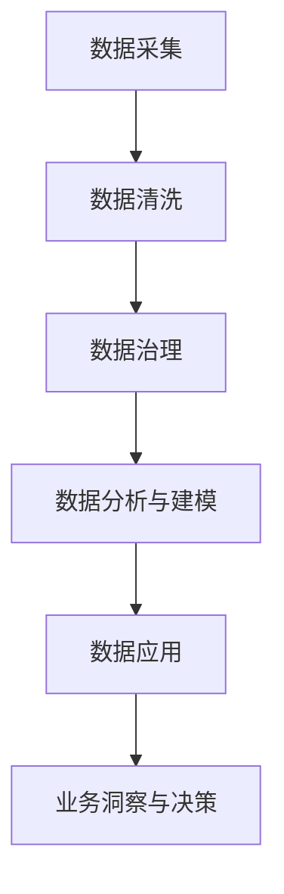

                 

## 1. 背景介绍

在现代数字经济时代，数据资产成为了企业的核心竞争要素。如何将这些海量数据转化为可操作的资产，以支撑精细化的市场营销、客户运营、产品研发等业务决策，成为了众多企业数字化转型的首要任务。AI DMP（人工智能驱动的数据管理系统）应运而生，通过先进的数据基建技术，实现数据的智能采集、管理和应用，为企业提供高价值的商业洞察和决策支持。本文将从背景、原理、实现、应用等多个维度，对AI DMP数据基建技术进行全面解析，旨在为行业从业者提供深度的思考和参考。

## 2. 核心概念与联系

### 2.1 核心概念概述

AI DMP 基于人工智能和大数据技术，实现对用户数据的智能管理与分析。其核心组件包括数据采集、数据清洗、数据治理、数据分析与建模、数据应用等环节。AI DMP 的构建与运行涉及到多个技术领域，如机器学习、深度学习、自然语言处理、大数据工程、数据安全与隐私保护等。

### 2.2 核心概念原理和架构的 Mermaid 流程图



### 2.3 核心概念之间的联系

- **数据采集**：从多源数据采集平台收集用户数据，包括网页浏览、社交媒体互动、交易行为等。
- **数据清洗**：去除噪声数据，修正错误信息，确保数据的准确性和完整性。
- **数据治理**：对数据进行标准化、分类、分片处理，建立数据标签体系，提升数据质量。
- **数据分析与建模**：利用机器学习与深度学习算法，对数据进行建模与分析，提取用户行为特征。
- **数据应用**：将分析结果应用于市场营销、客户运营、产品研发等业务场景，提供决策支持。
- **业务洞察与决策**：基于数据分析结果，生成商业洞察报告，辅助企业制定精准的业务策略。

## 3. 核心算法原理 & 具体操作步骤

### 3.1 算法原理概述

AI DMP 的数据基建过程，本质上是通过一系列先进的数据处理和分析算法，实现数据的智能化管理与应用。其核心算法原理包括但不限于以下几类：

- **机器学习与深度学习**：利用监督学习、非监督学习、强化学习等算法，对用户数据进行分类、聚类、预测等操作。
- **自然语言处理**：通过文本分析、情感分析、意图识别等技术，从社交媒体、评论等文本数据中提取用户情感和行为模式。
- **大数据工程**：采用分布式计算、流处理、批处理等技术，处理大规模数据集，提升数据处理的效率和可靠性。
- **数据安全和隐私保护**：采用数据加密、访问控制、匿名化处理等技术，确保数据的安全性和用户隐私的保护。

### 3.2 算法步骤详解

AI DMP 的数据基建过程，可以分为以下关键步骤：

**Step 1: 数据采集与集成**

- **数据源选择**：根据业务需求，选择合适的数据源，如网页、社交媒体、CRM系统等。
- **数据采集工具**：采用爬虫、API接口、日志提取等技术手段，获取所需数据。
- **数据集成与同步**：将采集的数据整合到统一的数据湖或数据仓库中，确保数据的完整性和一致性。

**Step 2: 数据清洗与预处理**

- **数据去重与去噪**：去除重复数据和噪声数据，提升数据质量。
- **数据格式化与转换**：将数据格式转换为标准化的格式，便于后续处理。
- **数据增强与扩展**：通过数据增强技术，增加训练样本的多样性，提升模型性能。

**Step 3: 数据治理与标准化**

- **数据分类与标注**：根据业务需求，对数据进行分类和标注，建立标签体系。
- **数据标准化与一致性**：对数据进行标准化处理，确保不同来源数据的统一性。
- **数据分片与分割**：根据业务需求，对数据进行分片或分割，提高数据处理的效率。

**Step 4: 数据分析与建模**

- **特征工程**：从数据中提取有意义的特征，提升模型的泛化能力。
- **模型选择与训练**：选择合适的机器学习或深度学习模型，进行模型训练。
- **模型评估与优化**：通过交叉验证、超参数调优等技术手段，评估模型性能并优化模型。

**Step 5: 数据应用与业务洞察**

- **数据可视化**：将分析结果通过图表、报告等方式展示，辅助业务决策。
- **业务应用集成**：将分析结果与业务系统集成，如CRM、ERP、广告平台等，提供决策支持。
- **实时数据处理**：采用流处理技术，实现数据的实时分析和应用，提升响应速度。

### 3.3 算法优缺点

AI DMP 数据基建算法具有以下优点：

- **高效性**：通过自动化处理，大幅提升数据处理效率，缩短从数据采集到应用的时间。
- **高准确性**：采用先进的数据分析和建模算法，确保分析结果的准确性和可靠性。
- **可扩展性**：支持大规模数据处理，具有较强的扩展能力，能够处理海量数据。

同时，这些算法也存在一些缺点：

- **复杂性**：需要多种算法协同工作，技术难度较高。
- **成本高**：数据采集、存储、处理等环节需要较高的成本投入。
- **隐私风险**：涉及大量用户隐私数据，需要严格的数据安全保护措施。

### 3.4 算法应用领域

AI DMP 数据基建算法在多个领域得到了广泛应用，包括但不限于：

- **市场营销**：通过分析用户行为数据，制定精准的广告投放策略，提升广告效果。
- **客户运营**：利用用户画像和行为分析，提供个性化的客户服务，提升客户满意度。
- **产品研发**：通过分析用户需求和反馈数据，指导产品创新和改进，提升产品竞争力。
- **风险管理**：利用用户行为和信用数据，评估用户风险，进行风险控制。
- **内容推荐**：基于用户兴趣和行为数据，推荐个性化内容，提升用户体验。

## 4. 数学模型和公式 & 详细讲解

### 4.1 数学模型构建

AI DMP 数据基建过程涉及多个数学模型，包括但不限于分类模型、聚类模型、回归模型等。以下以分类模型为例，展示其数学模型构建过程。

假设数据集为 $D=\{(x_i,y_i)\}_{i=1}^N$，其中 $x_i$ 为输入特征向量，$y_i \in \{0,1\}$ 为标签。分类模型的目标是找到最优的决策边界 $f(x)$，使得在训练集上的误差最小化。

### 4.2 公式推导过程

以逻辑回归模型为例，其目标函数为：

$$
\mathcal{L}(\theta) = -\frac{1}{N}\sum_{i=1}^N [y_i\log \sigma(x_i\theta) + (1-y_i)\log (1-\sigma(x_i\theta))]
$$

其中 $\sigma(z) = \frac{1}{1+e^{-z}}$ 为sigmoid函数，$z = x_i\theta$。优化目标为最小化损失函数，即：

$$
\theta^* = \mathop{\arg\min}_{\theta} \mathcal{L}(\theta)
$$

通过梯度下降等优化算法，可以求解出最优参数 $\theta^*$。

### 4.3 案例分析与讲解

以电商平台用户行为分析为例，通过机器学习模型对用户行为数据进行分类，可以分为高价值用户和低价值用户。高价值用户具有高购买率和忠诚度，低价值用户则反之。该模型的构建可以提升电商平台的个性化营销和客户管理策略，提高用户转化率和客户满意度。

## 5. 项目实践：代码实例和详细解释说明

### 5.1 开发环境搭建

以下是在Python中使用scikit-learn库构建分类模型的环境配置流程：

1. 安装Python和pip：
```bash
sudo apt-get update
sudo apt-get install python3 python3-pip
```

2. 安装scikit-learn库：
```bash
pip install scikit-learn
```

3. 准备数据集：

假设我们有以下数据集：

```python
import pandas as pd
from sklearn.model_selection import train_test_split

data = pd.read_csv('user_behavior.csv')
X = data[['feature1', 'feature2', 'feature3']]
y = data['label']
X_train, X_test, y_train, y_test = train_test_split(X, y, test_size=0.2, random_state=42)
```

### 5.2 源代码详细实现

以下是使用逻辑回归模型进行用户行为分类的Python代码实现：

```python
from sklearn.linear_model import LogisticRegression
from sklearn.metrics import accuracy_score

model = LogisticRegression()
model.fit(X_train, y_train)

y_pred = model.predict(X_test)
accuracy = accuracy_score(y_test, y_pred)
print(f'Accuracy: {accuracy:.2f}')
```

### 5.3 代码解读与分析

代码中，我们首先导入了逻辑回归模型和准确率评估函数。然后，从数据集中提取了输入特征和标签，并对数据进行了切分。接着，我们实例化逻辑回归模型并拟合训练数据，最后预测测试数据并计算准确率。

## 6. 实际应用场景

### 6.1 市场营销

AI DMP 在市场营销中的应用，主要体现在以下几个方面：

- **用户画像**：通过分析用户行为数据，建立详细的用户画像，了解用户兴趣、偏好和需求。
- **广告投放**：根据用户画像和行为数据，制定精准的广告投放策略，提升广告效果和用户转化率。
- **效果评估**：通过数据分析，评估广告投放效果，优化广告策略。

### 6.2 客户运营

AI DMP 在客户运营中的应用，主要体现在以下几个方面：

- **客户细分**：通过用户行为数据分析，将客户进行细分，了解不同客户群体的特征。
- **个性化推荐**：根据客户画像和行为数据，推荐个性化的产品和服务，提升客户满意度和忠诚度。
- **客户流失预测**：利用用户行为数据，预测客户流失风险，及时采取措施挽回流失客户。

### 6.3 产品研发

AI DMP 在产品研发中的应用，主要体现在以下几个方面：

- **需求分析**：通过分析用户行为和反馈数据，了解用户需求和痛点，指导产品设计和改进。
- **竞品分析**：利用用户数据，分析竞争对手的产品和市场表现，制定产品竞争策略。
- **用户体验优化**：通过数据分析，优化产品界面和功能，提升用户体验。

### 6.4 未来应用展望

未来，AI DMP 将会在更多领域得到应用，其应用场景包括但不限于：

- **医疗健康**：通过分析用户健康数据，提供个性化的健康管理和医疗建议。
- **金融保险**：利用用户财务数据，进行风险评估和客户管理。
- **物流运输**：通过分析用户行为数据，优化物流运输路线和服务，提升用户体验。
- **教育培训**：利用用户学习数据，提供个性化的学习方案和内容推荐。

## 7. 工具和资源推荐

### 7.1 学习资源推荐

1. **《Python数据科学手册》**：该书系统介绍了Python在数据科学领域的应用，包括数据采集、清洗、分析、建模等环节。
2. **《机器学习实战》**：该书通过实际案例，详细讲解了机器学习模型的构建和应用，适合实战型学习者。
3. **《深度学习》（Ian Goodfellow 著）**：该书深入浅出地介绍了深度学习的基础理论和应用，是深度学习领域的经典教材。
4. **Coursera上的机器学习课程**：由斯坦福大学教授Andrew Ng讲授，系统讲解了机器学习的基本概念和算法。
5. **Kaggle平台**：通过参与数据竞赛，实战练习数据科学技能，提升数据分析和模型构建能力。

### 7.2 开发工具推荐

1. **Python**：Python是数据科学和机器学习领域的主流编程语言，具有强大的数据处理和分析能力。
2. **Jupyter Notebook**：Jupyter Notebook是Python开发常用的IDE，支持代码编写、数据可视化等。
3. **Scikit-learn**：Scikit-learn是Python中最流行的机器学习库，提供了多种机器学习算法和工具。
4. **TensorFlow**：TensorFlow是Google开发的深度学习框架，支持大规模深度学习模型的构建和训练。
5. **PySpark**：PySpark是Spark的Python API，支持大规模数据处理和分布式计算。

### 7.3 相关论文推荐

1. **《数据驱动的智能营销策略》（A. Pazzani 和 R. Kendall）**：该论文系统介绍了数据驱动的智能营销策略，讨论了数据采集、分析和应用的全流程。
2. **《深度学习在自然语言处理中的应用》（I. Goodfellow 等）**：该论文详细介绍了深度学习在自然语言处理中的应用，包括文本分类、情感分析、意图识别等。
3. **《大数据时代的数据治理与隐私保护》（G. Tsoukalas 等）**：该论文讨论了大数据时代的数据治理和隐私保护问题，强调了数据标准化和数据安全的重要性。
4. **《面向商业洞察的数据可视化》（J. Shneiderman 等）**：该论文介绍了数据可视化的基本原则和方法，提供了丰富的可视化工具和案例。

## 8. 总结：未来发展趋势与挑战

### 8.1 研究成果总结

AI DMP 数据基建技术在过去几年中取得了显著进展，主要体现在以下几个方面：

1. **数据采集和处理**：通过先进的数据采集和处理技术，能够高效、准确地收集和处理海量数据。
2. **数据治理和标准化**：建立了标准化的数据治理体系，提升了数据质量和一致性。
3. **数据分析与建模**：通过机器学习和深度学习算法，实现了数据的智能化分析和建模。
4. **数据应用与业务洞察**：将数据分析结果应用于多个业务场景，提供精准的商业洞察和决策支持。

### 8.2 未来发展趋势

AI DMP 数据基建技术未来将呈现以下发展趋势：

1. **智能化程度提升**：通过引入更多的智能算法和工具，提升数据处理的自动化和智能化水平。
2. **跨领域应用拓展**：AI DMP 将更多应用于非传统领域，如医疗、金融、物流等。
3. **实时数据处理能力增强**：通过流处理和分布式计算技术，实现数据的实时分析和应用。
4. **数据安全与隐私保护**：采用更加严格的数据安全措施，确保用户隐私和数据安全。
5. **多模态数据融合**：将文本、图像、音频等多种模态数据进行融合，提升数据分析和应用的全面性和深度。

### 8.3 面临的挑战

AI DMP 数据基建技术在发展过程中，仍面临以下挑战：

1. **数据质量问题**：数据的采集和处理过程中，可能会遇到数据缺失、数据噪声等问题，影响数据分析结果的准确性。
2. **算法复杂性**：数据处理的算法复杂度高，需要高水平的技术人员进行维护和优化。
3. **成本投入高**：数据采集、存储、处理等环节需要较高的成本投入。
4. **数据隐私保护**：用户数据涉及隐私问题，需要严格的数据安全措施。
5. **技术迭代快**：技术快速迭代，需要持续学习和更新知识，保持技术领先。

### 8.4 研究展望

未来的AI DMP 数据基建研究将聚焦于以下几个方向：

1. **大数据与人工智能的深度融合**：探索大数据技术与AI算法的结合，提升数据处理的智能化水平。
2. **数据隐私保护技术**：开发更加先进的数据隐私保护技术，确保用户数据的安全性。
3. **多模态数据融合技术**：研究多种数据模态的融合方法，提升数据分析的全面性和深度。
4. **实时数据分析与处理**：探索流处理和分布式计算技术，实现数据的实时分析和应用。
5. **跨领域数据应用**：研究AI DMP 在更多领域的应用，提升其业务价值和社会影响力。

## 9. 附录：常见问题与解答

### Q1: AI DMP 数据基建的关键技术点有哪些？

A: AI DMP 数据基建的关键技术点包括数据采集、数据清洗、数据治理、数据分析与建模、数据应用等环节。其中，数据治理和数据分析与建模是核心技术点，对数据基建的效果和价值起到了决定性作用。

### Q2: 如何评估AI DMP 数据基建的效果？

A: AI DMP 数据基建的效果可以通过以下几个指标进行评估：

1. **数据质量**：通过数据完整性、准确性、一致性等指标，评估数据处理的效果。
2. **模型性能**：通过模型准确率、召回率、F1值等指标，评估数据建模的效果。
3. **业务洞察**：通过商业洞察报告、决策支持等，评估数据应用的效果。
4. **用户满意度**：通过用户反馈和行为数据，评估用户对数据分析结果的满意度。

### Q3: 如何提升AI DMP 数据基建的安全性？

A: 提升AI DMP 数据基建的安全性，可以从以下几个方面进行：

1. **数据加密**：对用户数据进行加密处理，确保数据传输和存储的安全性。
2. **访问控制**：通过身份认证、权限管理等技术手段，限制数据访问范围，防止非法访问。
3. **匿名化处理**：对敏感数据进行匿名化处理，减少隐私泄露风险。
4. **安全审计**：定期进行安全审计，发现和修复安全漏洞。

### Q4: AI DMP 数据基建在实际应用中需要注意哪些问题？

A: AI DMP 数据基建在实际应用中需要注意以下几个问题：

1. **数据采集的全面性和代表性**：确保数据采集的全面性和代表性，避免数据偏差和样本不均衡。
2. **数据处理的自动化和智能化**：采用自动化和智能化的数据处理技术，提高处理效率和质量。
3. **数据应用的及时性和准确性**：确保数据应用的及时性和准确性，避免决策偏差和误导。
4. **用户隐私保护**：严格遵守数据隐私保护法规，确保用户隐私安全。

### Q5: AI DMP 数据基建的未来发展方向有哪些？

A: AI DMP 数据基建的未来发展方向包括但不限于：

1. **智能化数据处理**：通过引入更多的智能算法和工具，提升数据处理的自动化和智能化水平。
2. **跨领域数据应用**：研究AI DMP 在更多领域的应用，提升其业务价值和社会影响力。
3. **实时数据分析与处理**：探索流处理和分布式计算技术，实现数据的实时分析和应用。
4. **多模态数据融合技术**：研究多种数据模态的融合方法，提升数据分析的全面性和深度。
5. **数据隐私保护技术**：开发更加先进的数据隐私保护技术，确保用户数据的安全性。

---

作者：禅与计算机程序设计艺术 / Zen and the Art of Computer Programming

