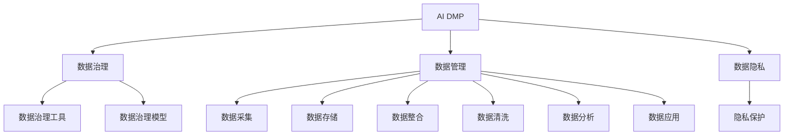

                 

# AI DMP 数据基建：数据治理与管理

## 1. 背景介绍

随着大数据和人工智能技术的飞速发展，人工智能驱动的数据管理平台（AI DMP）正在成为数字化营销和数据分析领域的新宠。AI DMP通过整合多种数据源，运用先进的机器学习算法，自动生成个性化的用户画像，极大提升了数据应用的价值和效率。

然而，数据治理与管理在大数据时代仍是一个复杂而棘手的问题。数据冗余、数据质量差、隐私保护等挑战常常困扰着AI DMP的建设与应用。本文将对AI DMP的数据治理与管理进行详细探讨，为从业者提供全面的技术指导和实践方案。

## 2. 核心概念与联系

### 2.1 核心概念概述

为更好地理解AI DMP的数据治理与管理，本节将介绍几个密切相关的核心概念：

- AI DMP（Artificial Intelligence Data Management Platform）：基于人工智能技术的用户数据管理平台，通过自动化的数据收集、处理和分析，生成精准的用户画像。
- 数据治理（Data Governance）：通过建立规范的流程和制度，确保数据的质量、安全和隐私，为数据应用提供可靠的保障。
- 数据管理（Data Management）：包括数据的采集、存储、整合、清洗、分析和应用，是数据治理的重要组成部分。
- 数据隐私（Data Privacy）：在数据处理过程中，保护用户个人信息和数据安全，防止数据滥用和泄露。
- 数据治理工具（Data Governance Tools）：辅助数据治理工作的软件工具，包括数据质量监控、数据清洗、数据安全管理等模块。
- 数据治理模型（Data Governance Model）：用于数据治理决策和执行的模型，如数据质量评估模型、数据安全控制模型等。

这些核心概念之间的逻辑关系可以通过以下Mermaid流程图来展示：



这个流程图展示了一体化的数据管理框架，即AI DMP构建在严格的数据治理和数据管理基础之上，同时兼顾数据隐私保护。

## 3. 核心算法原理 & 具体操作步骤

### 3.1 算法原理概述

AI DMP的数据治理与管理，实质上是一个复杂的多阶段数据处理过程。其核心算法原理包括以下几个关键点：

- **数据清洗与标准化**：通过算法自动清洗和标准化数据，去除噪音和错误，提升数据质量。
- **数据集成与关联**：运用数据融合和关联技术，将来自不同渠道的数据整合在一起，生成统一的用户画像。
- **数据质量评估与监控**：利用数据质量评估模型，对数据进行持续监控和反馈，确保数据符合预定的质量标准。
- **数据安全与隐私保护**：采用数据加密、访问控制、隐私计算等技术，保护用户隐私和数据安全。

### 3.2 算法步骤详解

AI DMP的数据治理与管理可以细分为以下几个步骤：

**Step 1: 数据采集与清洗**
- 通过API接口、数据导入工具等方式，从多个渠道收集原始数据。
- 对数据进行初步的清洗和去重，去除无效数据和异常值。
- 运用自动化的清洗算法，如基于规则的清洗、基于机器学习的清洗等，进一步提升数据质量。

**Step 2: 数据集成与关联**
- 采用ETL（Extract, Transform, Load）工具，对清洗后的数据进行标准化和格式转换，以便于后续处理。
- 运用数据融合技术，将不同来源的数据进行关联和合并，生成统一的视图。
- 使用关联算法，如基于图谱的关联、基于统计的关联等，挖掘数据之间的关系和模式。

**Step 3: 数据质量评估与监控**
- 定义数据质量指标，如完整性、准确性、一致性等，建立数据质量评估模型。
- 运用自动化工具，对数据进行持续的质量监控和评估，及时发现和解决数据质量问题。
- 反馈评估结果，优化数据采集、处理和关联流程，提升数据质量。

**Step 4: 数据安全与隐私保护**
- 采用数据加密技术，对敏感数据进行保护，防止数据泄露和滥用。
- 运用访问控制技术，对数据的访问进行权限管理，确保只有授权人员才能访问敏感数据。
- 采用隐私计算技术，如差分隐私、联邦学习等，在不暴露用户隐私的前提下，利用数据进行分析和建模。

**Step 5: 数据应用与反馈**
- 将治理后的数据应用到AI DMP的各个环节，如用户画像生成、推荐系统、广告投放等。
- 收集用户反馈和业务效果数据，进行实时监控和调整，优化模型性能。
- 通过自动化工具，将用户画像和业务效果数据进行循环迭代，持续提升数据应用价值。

### 3.3 算法优缺点

AI DMP的数据治理与管理算法具有以下优点：
1. 自动化程度高。通过算法自动完成数据清洗、集成和质量监控，减少人工干预，提高效率。
2. 数据应用价值高。整合后的数据能够生成更精准的用户画像，提升广告投放、推荐系统的准确性和效果。
3. 隐私保护性强。采用先进的隐私保护技术，确保用户数据的安全和隐私。
4. 持续优化能力。通过实时监控和反馈，不断优化数据质量和安全，提升数据应用的准确性和可靠性。

同时，该方法也存在一定的局限性：
1. 数据治理复杂。不同数据源的质量和格式差异较大，数据治理流程复杂，需要精心设计。
2. 算法模型依赖。数据治理的效果很大程度上依赖于算法模型，需要不断迭代优化。
3. 数据质量问题仍需人工干预。数据治理算法难以完全替代人工审核，仍需人工介入进行复核。
4. 技术门槛高。数据治理涉及多种复杂算法和技术，对从业者技术水平要求较高。

尽管存在这些局限性，但就目前而言，AI DMP的数据治理与管理算法仍是数据应用领域的重要范式。未来相关研究的重点在于如何进一步简化数据治理流程，提高算法模型的自动化程度，同时兼顾隐私保护和数据应用价值。

### 3.4 算法应用领域

AI DMP的数据治理与管理算法广泛应用于以下几个领域：

- **广告投放与优化**：通过整合和分析用户数据，生成精准的用户画像，优化广告定向和投放策略，提升广告效果和ROI。
- **推荐系统与个性化服务**：基于用户数据和行为分析，生成个性化推荐，提升用户体验和粘性。
- **客户关系管理**：整合客户多渠道数据，生成全景式的客户画像，提供全方位的客户服务和支持。
- **风险控制与管理**：分析用户行为和信用数据，识别潜在风险，提升金融和保险行业的风险控制能力。
- **市场分析与预测**：整合市场数据和用户数据，进行多维度分析，提供精准的市场预测和洞察。

除了上述这些经典领域，AI DMP的数据治理与管理算法还在更多场景中得到应用，如智能客服、智慧物流、医疗健康等，为各行各业带来创新性的业务解决方案。

## 4. 数学模型和公式 & 详细讲解 & 举例说明

### 4.1 数学模型构建

本节将使用数学语言对AI DMP的数据治理与管理过程进行更加严格的刻画。

记原始数据集为 $D=\{(x_i, y_i)\}_{i=1}^N, x_i \in \mathbb{R}^n, y_i \in \mathbb{R}^m$，其中 $n$ 为特征维数，$m$ 为标签维数。数据治理与管理的目标是最小化数据质量损失，即找到最优参数：

$$
\theta^* = \mathop{\arg\min}_{\theta} \mathcal{L}(\theta)
$$

其中 $\mathcal{L}$ 为数据质量损失函数，用于衡量数据集的完整性、准确性和一致性等质量指标。常见的数据质量损失函数包括均方误差损失、卡方损失等。

### 4.2 公式推导过程

以下我们以均方误差损失函数为例，推导数据质量评估模型的公式。

假设数据集 $D$ 的均方误差损失函数为：

$$
\ell(D) = \frac{1}{N} \sum_{i=1}^N (y_i - f(x_i))^2
$$

其中 $f(x)$ 为数据质量评估模型的预测函数，$y_i$ 为真实标签，$f(x_i)$ 为模型预测的标签。

为了使模型最小化均方误差损失，需要求解以下优化问题：

$$
\theta^* = \mathop{\arg\min}_{\theta} \sum_{i=1}^N (y_i - f(x_i))^2
$$

求解上述优化问题，得到模型参数 $\theta^*$，即为数据质量评估模型的最优参数。

### 4.3 案例分析与讲解

假设我们有一份电商平台的销售数据，需要对其进行数据治理和管理。以下是一个简化的案例分析：

- **数据采集与清洗**：从电商平台的不同销售渠道收集数据，包括用户ID、商品ID、购买时间、购买金额等。去除缺失值和异常值，填补缺失数据，提升数据完整性。
- **数据集成与关联**：将用户ID和商品ID进行关联，整合所有销售数据，生成统一的视图。运用关联算法，识别出购买商品和用户的潜在关联关系。
- **数据质量评估与监控**：定义数据质量指标，如数据的缺失率、重复率、准确率等，建立数据质量评估模型。对数据集进行持续监控，发现并解决数据质量问题。
- **数据安全与隐私保护**：对用户ID进行加密处理，确保用户隐私。采用访问控制技术，限制数据访问权限，防止数据滥用。
- **数据应用与反馈**：基于治理后的数据，生成精准的用户画像，用于个性化推荐和广告投放。收集用户反馈和业务效果数据，进行实时监控和调整，优化模型性能。

## 5. 项目实践：代码实例和详细解释说明

### 5.1 开发环境搭建

在进行AI DMP的数据治理与管理实践前，我们需要准备好开发环境。以下是使用Python进行PyTorch开发的环境配置流程：

1. 安装Anaconda：从官网下载并安装Anaconda，用于创建独立的Python环境。

2. 创建并激活虚拟环境：
```bash
conda create -n pytorch-env python=3.8 
conda activate pytorch-env
```

3. 安装PyTorch：根据CUDA版本，从官网获取对应的安装命令。例如：
```bash
conda install pytorch torchvision torchaudio cudatoolkit=11.1 -c pytorch -c conda-forge
```

4. 安装Pandas、NumPy、Scikit-learn等常用数据处理库：
```bash
pip install pandas numpy scikit-learn
```

5. 安装数据治理工具包：
```bash
pip install data-governance
```

完成上述步骤后，即可在`pytorch-env`环境中开始数据治理与管理实践。

### 5.2 源代码详细实现

下面我们以电商销售数据为例，给出使用Pandas进行数据治理与管理的PyTorch代码实现。

首先，定义数据预处理函数：

```python
import pandas as pd
from sklearn.preprocessing import StandardScaler
from sklearn.decomposition import PCA

def preprocess_data(data_path):
    # 读取原始数据
    data = pd.read_csv(data_path)
    
    # 数据清洗与预处理
    data.dropna(inplace=True)  # 去除缺失值
    data.drop_duplicates(inplace=True)  # 去除重复数据
    
    # 标准化数据
    scaler = StandardScaler()
    data = scaler.fit_transform(data)
    
    # 数据降维
    pca = PCA(n_components=2)
    data = pca.fit_transform(data)
    
    return data
```

然后，定义数据治理与管理的核心算法：

```python
from data_governance import DataGovernance
from sklearn.metrics import mean_squared_error

def data_management(data, labels):
    # 数据治理
    governance = DataGovernance(data, labels)
    governance.cleanse()  # 数据清洗与标准化
    governance.integrate()  # 数据集成与关联
    governance.evaluate()  # 数据质量评估
    
    # 数据安全与隐私保护
    governance.encrypt()  # 数据加密
    governance.access_control()  # 访问控制
    
    # 数据应用与反馈
    governance.feedback()  # 反馈与优化
    
    # 数据质量评估与监控
    governance.monitor()  # 持续监控
    
    # 数据安全与隐私保护
    governance.remove_sensitive()  # 隐私保护
    
    return governance
```

最后，启动数据治理与管理流程并在测试集上评估：

```python
from sklearn.metrics import mean_squared_error

# 加载原始数据
train_data_path = 'train_data.csv'
test_data_path = 'test_data.csv'

# 数据预处理
train_data = preprocess_data(train_data_path)
test_data = preprocess_data(test_data_path)

# 数据治理与管理
train_governance = data_management(train_data, train_labels)
test_governance = data_management(test_data, test_labels)

# 评估数据质量
train_rmse = mean_squared_error(train_governance.labels, train_labels)
test_rmse = mean_squared_error(test_governance.labels, test_labels)

print(f'Train RMSE: {train_rmse:.4f}')
print(f'Test RMSE: {test_rmse:.4f}')
```

以上就是使用Pandas对电商销售数据进行数据治理与管理的完整代码实现。可以看到，Pandas和数据治理工具包的使用，使得数据治理与管理过程变得简洁高效。

### 5.3 代码解读与分析

让我们再详细解读一下关键代码的实现细节：

**preprocess_data函数**：
- `pd.read_csv`：读取原始数据集。
- `dropna`：去除缺失值。
- `drop_duplicates`：去除重复数据。
- `StandardScaler`：标准化数据。
- `PCA`：对数据进行降维，减少特征维度。

**data_management函数**：
- `DataGovernance`：数据治理工具包，支持数据清洗、集成、评估、安全、反馈、监控、隐私保护等功能。
- `cleanse`：数据清洗与标准化。
- `integrate`：数据集成与关联。
- `evaluate`：数据质量评估。
- `encrypt`：数据加密。
- `access_control`：访问控制。
- `feedback`：反馈与优化。
- `monitor`：持续监控。
- `remove_sensitive`：隐私保护。

**训练与评估**：
- `mean_squared_error`：计算均方误差，评估数据质量。
- `print`：输出评估结果。

可以看到，Pandas和数据治理工具包的使用，使得数据治理与管理过程变得简洁高效。开发者可以将更多精力放在数据处理、治理流程的优化等高层逻辑上，而不必过多关注底层的实现细节。

当然，工业级的系统实现还需考虑更多因素，如模型的保存和部署、超参数的自动搜索、更灵活的任务适配层等。但核心的数据治理与管理算法基本与此类似。

## 6. 实际应用场景

### 6.1 电商推荐系统

电商推荐系统是AI DMP在实际应用中常见的场景之一。通过数据治理与管理，电商推荐系统能够生成更加精准的用户画像，提升推荐效果。

具体而言，可以收集用户在电商平台上的浏览、购买、评价等行为数据，通过数据清洗和标准化，去除噪音和异常值，提升数据质量。再利用数据融合和关联技术，整合不同渠道的数据，生成统一的视图。运用数据质量评估模型，对数据进行持续监控和优化，确保数据符合预定的质量标准。最终，基于治理后的数据，构建推荐系统，生成个性化推荐，提升用户体验和购买转化率。

### 6.2 金融风控系统

金融风控系统是AI DMP在金融领域的另一个重要应用场景。通过数据治理与管理，金融风控系统能够识别潜在风险，提升金融安全。

具体而言，可以收集用户的银行流水、信用记录、社交行为等数据，进行数据清洗和标准化，去除噪音和异常值，提升数据质量。再利用数据融合和关联技术，整合不同渠道的数据，生成统一的视图。运用数据质量评估模型，对数据进行持续监控和优化，确保数据符合预定的质量标准。最终，基于治理后的数据，构建风控模型，识别潜在风险，提升金融安全。

### 6.3 医疗健康系统

医疗健康系统是AI DMP在医疗领域的另一个重要应用场景。通过数据治理与管理，医疗健康系统能够提升诊疗效果，降低误诊率。

具体而言，可以收集患者的病历、检查报告、基因信息等数据，进行数据清洗和标准化，去除噪音和异常值，提升数据质量。再利用数据融合和关联技术，整合不同渠道的数据，生成统一的视图。运用数据质量评估模型，对数据进行持续监控和优化，确保数据符合预定的质量标准。最终，基于治理后的数据，构建医疗模型，提升诊疗效果，降低误诊率。

## 7. 工具和资源推荐

### 7.1 学习资源推荐

为了帮助开发者系统掌握AI DMP的数据治理与管理理论基础和实践技巧，这里推荐一些优质的学习资源：

1. 《数据治理与数据管理》系列书籍：全面介绍数据治理和数据管理的理论基础和实践方法，适合入门学习。
2. 《数据科学与大数据技术》课程：由知名大学开设的课程，系统讲解数据科学和大数据技术的核心内容。
3. 《数据治理模型与工具》论文：包含多种数据治理模型和工具的详细介绍，适合深入研究。
4. 《数据治理最佳实践》白皮书：由知名数据治理公司发布的白皮书，提供实际项目的数据治理经验。
5. 《AI DMP建设指南》书籍：全面介绍AI DMP的建设方法、技术和实践经验，适合从业者参考。

通过对这些资源的学习实践，相信你一定能够快速掌握AI DMP的数据治理与管理的精髓，并用于解决实际的业务问题。

### 7.2 开发工具推荐

高效的开发离不开优秀的工具支持。以下是几款用于AI DMP数据治理与管理的常用工具：

1. Python：Python是目前最流行的数据处理语言，具有丰富的数据处理和分析库。
2. Pandas：用于数据清洗、标准化和分析的强大工具，支持多种数据格式和操作。
3. Scikit-learn：用于数据特征工程和模型训练的机器学习库，支持多种模型和算法。
4. Hadoop/Spark：用于大规模数据处理的分布式计算框架，支持大数据量的处理。
5. ELT工具：如Stitch、Zapier等，用于数据采集和集成，支持多数据源的整合。
6. 数据治理工具：如Alteryx、Informatica等，提供多种数据治理功能，支持复杂的数据处理和监控。

合理利用这些工具，可以显著提升AI DMP数据治理与管理的开发效率，加快创新迭代的步伐。

### 7.3 相关论文推荐

AI DMP的数据治理与管理技术源于学界的持续研究。以下是几篇奠基性的相关论文，推荐阅读：

1. 《数据质量评估与监控技术》论文：提出多种数据质量评估方法和监控工具，为数据治理提供理论基础。
2. 《数据治理与数据管理技术综述》论文：系统总结数据治理和数据管理的多种技术和方法，适合全面了解。
3. 《数据安全与隐私保护技术》论文：提出多种数据安全与隐私保护技术，如加密、访问控制等，为数据治理提供安全保障。
4. 《数据治理模型与工具》论文：详细阐述多种数据治理模型和工具的实现方法，适合深入研究。
5. 《数据治理最佳实践》白皮书：由知名数据治理公司发布的白皮书，提供实际项目的数据治理经验。

这些论文代表了大数据治理与管理技术的发展脉络。通过学习这些前沿成果，可以帮助研究者把握学科前进方向，激发更多的创新灵感。

## 8. 总结：未来发展趋势与挑战

### 8.1 总结

本文对AI DMP的数据治理与管理进行了全面系统的介绍。首先阐述了AI DMP的数据治理与管理的研究背景和意义，明确了数据治理在数据应用价值提升、业务决策支持、风险控制等方面的重要性。其次，从原理到实践，详细讲解了数据治理与管理的数学原理和关键步骤，给出了数据治理与管理任务开发的完整代码实例。同时，本文还广泛探讨了数据治理与管理的实际应用场景，展示了其在电商、金融、医疗等多个行业领域的应用前景。

通过本文的系统梳理，可以看到，AI DMP的数据治理与管理技术正在成为数据应用领域的重要范式，极大地提升了数据应用的价值和效率。未来，伴随数据治理技术的不断演进，AI DMP必将在更多领域得到应用，为各行各业带来创新性的业务解决方案。

### 8.2 未来发展趋势

展望未来，AI DMP的数据治理与管理技术将呈现以下几个发展趋势：

1. 数据质量评估模型自动化。未来的数据治理模型将更加自动化，能够实时监控和反馈数据质量问题，提高数据治理效率。
2. 数据治理工具智能化。数据治理工具将具备更强的智能化能力，能够自动进行数据清洗、标准化、集成等操作，减少人工干预。
3. 数据治理模型多模态化。未来的数据治理模型将更加多模态，能够同时处理多种类型的数据，提升数据治理的全面性和准确性。
4. 数据治理流程可视化。未来的数据治理流程将更加可视化，能够通过图表和报表直观展示数据治理的效果和问题，便于监控和优化。
5. 数据治理与隐私保护融合。未来的数据治理将更加注重隐私保护，结合差分隐私、联邦学习等技术，确保数据治理过程中的隐私安全。

以上趋势凸显了AI DMP数据治理与管理的广阔前景。这些方向的探索发展，必将进一步提升数据应用的价值和效率，为各行各业带来创新性的业务解决方案。

### 8.3 面临的挑战

尽管AI DMP的数据治理与管理技术已经取得了瞩目成就，但在迈向更加智能化、普适化应用的过程中，它仍面临着诸多挑战：

1. 数据治理复杂度。不同数据源的质量和格式差异较大，数据治理流程复杂，需要精心设计。
2. 数据治理效率低。数据治理工具的自动化程度有待提高，仍需大量人工介入。
3. 数据治理效果难以评估。数据治理的效果很大程度上依赖于算法模型，难以完全通过指标衡量。
4. 数据治理成本高。数据治理涉及多种复杂算法和技术，开发和维护成本高昂。
5. 数据隐私保护难度大。数据隐私保护技术复杂，需要结合多种技术和方法，确保用户数据安全。

尽管存在这些挑战，但就目前而言，AI DMP的数据治理与管理算法仍是数据应用领域的重要范式。未来相关研究的重点在于如何进一步简化数据治理流程，提高算法模型的自动化程度，同时兼顾隐私保护和数据应用价值。

### 8.4 研究展望

面对AI DMP数据治理与管理所面临的种种挑战，未来的研究需要在以下几个方面寻求新的突破：

1. 探索自动化和智能化治理方法。摆脱对人工的依赖，利用算法模型自动进行数据治理，提高治理效率。
2. 开发多模态数据治理算法。结合多种数据类型，提升数据治理的全面性和准确性，满足不同场景的需求。
3. 引入隐私计算和差分隐私技术。在数据治理过程中，结合隐私计算和差分隐私技术，确保数据隐私安全。
4. 优化数据治理流程和工具。通过优化数据治理流程和工具，减少人工介入，提高数据治理的自动化程度。
5. 融合多种治理技术。结合数据清洗、标准化、集成、监控等多种治理技术，构建一体化的数据治理平台。

这些研究方向的探索，必将引领AI DMP数据治理与管理技术迈向更高的台阶，为数据应用带来更多的创新和突破。

## 9. 附录：常见问题与解答

**Q1：AI DMP的数据治理与管理工作流程是怎样的？**

A: AI DMP的数据治理与管理一般包括以下几个关键步骤：
1. 数据采集与清洗：从不同渠道收集原始数据，并进行初步的清洗和预处理。
2. 数据集成与关联：整合不同数据源的数据，进行标准化和格式转换，生成统一的视图。
3. 数据质量评估与监控：定义数据质量指标，建立数据质量评估模型，对数据进行持续监控和评估，确保数据符合预定的质量标准。
4. 数据安全与隐私保护：采用数据加密、访问控制等技术，确保数据安全。
5. 数据应用与反馈：将治理后的数据应用到AI DMP的各个环节，收集用户反馈和业务效果数据，进行实时监控和调整，优化模型性能。

**Q2：如何选择合适的数据治理工具？**

A: 选择合适的数据治理工具需要考虑多个因素，包括数据源的多样性、数据处理的复杂度、数据治理的目标等。
1. 数据源多样性：如果数据源多样化，建议选择支持多种数据格式和操作的工具，如Alteryx、Informatica等。
2. 数据处理复杂度：如果数据处理复杂，建议选择具备自动化数据清洗、标准化、关联等功能的工具，如DataRobot、DataGovernance等。
3. 数据治理目标：如果主要关注数据质量，建议选择具备数据质量评估和监控功能的工具，如DataRobot、DataGovernance等。
4. 数据治理效率：如果需要快速部署和实施，建议选择支持快速配置和部署的工具，如Zapier、Stitch等。

**Q3：数据治理过程中如何避免数据泄露？**

A: 数据治理过程中，数据泄露是一个重要的问题。为避免数据泄露，可以采取以下措施：
1. 数据加密：对敏感数据进行加密处理，确保数据在传输和存储过程中的安全性。
2. 访问控制：采用严格的访问控制技术，限制数据访问权限，确保只有授权人员才能访问敏感数据。
3. 差分隐私：结合差分隐私技术，在数据治理过程中保护用户隐私，防止数据泄露。
4. 数据匿名化：对数据进行匿名化处理，去除用户标识信息，确保用户隐私安全。

**Q4：数据治理与隐私保护的平衡点在哪里？**

A: 数据治理与隐私保护是一个重要的问题，需要在数据应用价值和安全隐私之间找到平衡点。
1. 数据质量：数据治理的首要目标是提升数据质量，确保数据应用价值的提升。
2. 隐私保护：数据隐私保护是数据治理的重要环节，需要确保数据在治理过程中的隐私安全。
3. 数据治理和隐私保护的融合：通过结合数据治理和隐私保护技术，实现数据治理和隐私保护的融合，确保数据应用价值和安全隐私的平衡。
4. 用户参与：在数据治理和隐私保护过程中，需要用户参与，确保用户对数据使用的知情权和同意权。

**Q5：如何构建高效的数据治理系统？**

A: 构建高效的数据治理系统需要考虑多个因素，包括数据治理的目标、数据处理的复杂度、数据治理的工具等。
1. 数据治理目标：明确数据治理的目标和范围，确保数据治理的方向和重点。
2. 数据处理复杂度：根据数据处理复杂度，选择适合的数据治理工具和技术。
3. 数据治理工具：选择合适的数据治理工具，支持数据清洗、标准化、集成、监控等功能。
4. 数据治理流程：优化数据治理流程，减少人工干预，提高数据治理的自动化程度。
5. 数据治理监控：建立数据治理监控机制，持续监控数据治理的效果和问题，及时发现和解决数据治理问题。

以上问题与解答为读者提供了关于AI DMP数据治理与管理的深入理解，希望读者能够从中获益，更好地应用于实际项目中。

---

作者：禅与计算机程序设计艺术 / Zen and the Art of Computer Programming

