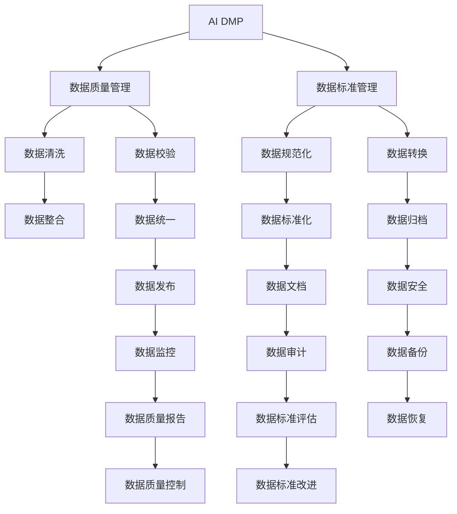

                 

# AI DMP 数据基建：数据质量与数据标准

> 关键词：AI DMP, 数据质量, 数据标准, 数据治理, 用户画像, 数据源整合, 数据一致性

## 1. 背景介绍

### 1.1 问题由来

随着数字营销的迅猛发展，数据驱动的个性化营销成为企业竞争力的重要一环。AI DMP（人工智能驱动的数据管理平台）作为数据治理的核心工具，通过整合多源数据，构建用户画像，辅助营销策略制定和效果评估，从而实现精准营销。然而，数据质量参差不齐、数据标准不一致等长期困扰AI DMP系统的“顽疾”，在很大程度上限制了其应用效能。因此，如何有效管理和规范数据质量、标准，成为当前AI DMP系统建设和运维的迫切需求。

### 1.2 问题核心关键点

数据质量与数据标准是AI DMP数据基建的两大核心要素。

**数据质量**：涉及数据的准确性、完整性、及时性、一致性、一致性等方面。数据质量问题的存在，会直接影响AI DMP的决策能力和用户画像的精准性。

**数据标准**：涉及数据的格式、命名规范、计算规则等方面。数据标准的规范性，有助于保证数据的一致性和可比性，从而提升数据的可用性和可理解性。

本文将系统阐述数据质量与数据标准的原理与实践，为AI DMP系统的数据基建提供理论指导和实际操作路径。

## 2. 核心概念与联系

### 2.1 核心概念概述

为更好地理解AI DMP数据基建的精髓，本节将介绍几个密切相关的核心概念：

- **AI DMP**：以机器学习和人工智能算法为核心，用于整合、治理和利用用户数据的平台。通过构建用户画像，AI DMP能够辅助个性化营销，优化营销策略，提升营销效果。

- **数据质量管理**：对数据进行收集、整合、存储、清洗和校验等一系列管理活动，确保数据的准确性、完整性、及时性和一致性。数据质量管理是数据治理的基础。

- **数据标准管理**：制定并维护数据格式、命名规范、计算规则等标准，确保不同数据源间的一致性和可比性，提升数据的可利用性和可理解性。数据标准管理是数据治理的关键。

- **数据治理**：包括数据质量管理、数据标准管理、数据隐私管理、数据安全管理等多个方面，旨在构建统一、可靠的数据管理体系，为数据驱动的决策提供坚实保障。

这些核心概念之间的逻辑关系可以通过以下Mermaid流程图来展示：



这个流程图展示了AI DMP系统中数据质量与数据标准的核心逻辑：

1. AI DMP通过收集、整合多源数据，构建用户画像。
2. 数据质量管理通过清洗、校验等手段，提升数据的准确性和一致性。
3. 数据标准管理通过规范化、转换等措施，确保数据格式和计算规则的一致性。
4. 数据治理通过整合、发布、安全、监控、审计等环节，维护数据的一致性和可靠性。

## 3. 核心算法原理 & 具体操作步骤
### 3.1 算法原理概述

AI DMP的数据基建核心在于数据质量和数据标准的管理与维护。其核心思想是：通过科学的数据质量管理方法，提升数据的准确性和一致性；通过统一的数据标准，确保数据的一致性和可比性。

形式化地，假设AI DMP收集到来自不同渠道的用户数据 $D=\{d_1,d_2,\cdots,d_n\}$，其中 $d_i$ 表示第 $i$ 个数据源，其包含的数据项为 $d_i=\{(x_i,y_i)\}$，$x_i$ 表示数据项，$y_i$ 表示数据项的元数据（如来源、时间、格式等）。

### 3.2 算法步骤详解

AI DMP的数据基建一般包括以下几个关键步骤：

**Step 1: 数据收集与整合**

- 收集来自不同渠道的原始数据，确保数据来源的多样性和完整性。
- 通过数据清洗和标准化处理，整合不同数据源的数据，形成统一的数据集。

**Step 2: 数据质量管理**

- 通过数据清洗和校验，去除噪音数据和异常数据，提升数据质量。
- 设置数据质量监控机制，定期评估数据质量，及时发现和修正数据问题。

**Step 3: 数据标准管理**

- 定义统一的数据格式、命名规范、计算规则等标准，确保数据的一致性。
- 对数据进行规范化处理，使其符合统一的标准。

**Step 4: 数据治理**

- 构建统一的数据管理体系，包括数据清洗、标准管理、质量监控、安全管理、发布管理等多个环节。
- 通过数据审计和质量报告，评估数据治理的效果，持续改进数据管理策略。

**Step 5: 数据利用**

- 基于数据质量与数据标准，构建用户画像，辅助个性化营销。
- 利用AI算法，挖掘数据中的有价值信息，优化营销策略，提升营销效果。

### 3.3 算法优缺点

AI DMP数据基建的优点包括：

1. **提升数据质量**：通过数据清洗和校验，确保数据的准确性和一致性。
2. **规范数据标准**：通过统一的数据标准，提升数据的可利用性和可理解性。
3. **强化数据治理**：通过全面的数据治理策略，保障数据的安全和可靠性。
4. **辅助决策支持**：基于高质量数据，构建更精准的用户画像，辅助营销决策。

缺点主要包括：

1. **数据清洗难度大**：面对来自不同渠道、不同格式的数据，清洗和校验工作复杂且耗时。
2. **标准制定困难**：不同业务场景下的数据标准可能不一致，制定统一的规范标准具有挑战性。
3. **治理成本高**：全面构建数据管理体系，需要投入大量人力和资源，短期内可能难以见效。
4. **数据隐私问题**：数据治理过程中涉及大量个人信息，需严格遵守数据隐私法规，确保用户隐私保护。

尽管存在这些局限性，但AI DMP数据基建对于提升数据质量和标准，实现数据驱动的精准营销具有重要意义。未来相关研究应聚焦于提高数据治理的自动化水平，降低治理成本，提升数据质量管理的效率和效果。

### 3.4 算法应用领域

AI DMP数据基建的应用领域广泛，主要包括以下几个方面：

- **个性化推荐系统**：通过构建用户画像，实现精准推荐，提升用户体验。
- **营销策略优化**：利用数据质量与标准，辅助营销决策，提升广告投放效果。
- **风险管理与防控**：通过数据质量与标准管理，提高风险识别和防控能力。
- **客户关系管理**：通过高质量数据，优化客户画像，提升客户满意度。
- **市场分析与预测**：基于数据质量与标准，构建市场分析模型，预测市场趋势。

除了上述这些经典应用外，AI DMP数据基建还在广告投放、销售预测、品牌管理等多个领域展现了广泛的应用潜力。随着数据质量的提升和数据标准的规范，AI DMP必将在更多业务场景中发挥其价值，驱动数字营销的不断进化。

## 4. 数学模型和公式 & 详细讲解 & 举例说明
### 4.1 数学模型构建

本节将使用数学语言对AI DMP数据基建过程中涉及的数据质量与标准管理的数学模型进行更加严格的刻画。

假设原始数据集 $D=\{d_1,d_2,\cdots,d_n\}$，其中 $d_i$ 表示第 $i$ 个数据源，其包含的数据项为 $d_i=\{(x_i,y_i)\}$，$x_i$ 表示数据项，$y_i$ 表示数据项的元数据。

定义数据质量评估指标为 $\text{Quality}(D) = \sum_{i=1}^n \text{Quality}(x_i)$，其中 $\text{Quality}(x_i)$ 表示数据项 $x_i$ 的质量评分。

定义数据标准一致性评估指标为 $\text{Consistency}(D) = \sum_{i=1}^n \text{Consistency}(x_i)$，其中 $\text{Consistency}(x_i)$ 表示数据项 $x_i$ 的标准一致性评分。

数学模型构建的目的是通过评估数据质量与标准一致性，量化数据基建的效果，并指导后续的数据清洗、标准管理等工作。

### 4.2 公式推导过程

以下我们以用户数据为例，推导数据质量评估指标和标准一致性评估指标的计算公式。

假设用户数据集 $D=\{(x_i,y_i)\}_{i=1}^N$，其中 $x_i$ 为属性值，$y_i$ 为属性元数据。

**数据质量评估指标**：
- 定义数据项 $x_i$ 的准确性为 $\text{Accuracy}(x_i) = \frac{|\{x_i | x_i = \text{true}\}}{N}$，表示数据项 $x_i$ 的真实性。
- 定义数据项 $x_i$ 的完整性为 $\text{Completeness}(x_i) = \frac{|\{x_i | x_i \neq \emptyset\}}{N}$，表示数据项 $x_i$ 的完整性。
- 定义数据项 $x_i$ 的及时性为 $\text{Timeliness}(x_i) = \frac{|\{x_i | x_i \text{时间戳} \leq \text{当前时间}\}}{N}$，表示数据项 $x_i$ 的及时性。
- 定义数据项 $x_i$ 的一致性为 $\text{Consistency}(x_i) = \frac{|\{x_i | x_i \text{与标准值} = \text{true}\}}{N}$，表示数据项 $x_i$ 的一致性。

数据质量评估指标计算公式为：
$$
\text{Quality}(D) = \sum_{i=1}^N \left(\text{Accuracy}(x_i) + \text{Completeness}(x_i) + \text{Timeliness}(x_i) + \text{Consistency}(x_i)\right)
$$

**数据标准一致性评估指标**：
- 定义数据项 $x_i$ 的标准一致性为 $\text{Standard Consistency}(x_i) = \frac{|\{x_i | \text{与标准值} = \text{true}\}}{N}$，表示数据项 $x_i$ 的标准一致性。

数据标准一致性评估指标计算公式为：
$$
\text{Consistency}(D) = \sum_{i=1}^N \text{Standard Consistency}(x_i)
$$

在得到评估指标后，即可根据具体数值进行数据质量与标准的量化评估，进而指导数据清洗和标准管理等工作。

### 4.3 案例分析与讲解

以用户数据为例，说明数据质量与标准评估的实际应用。

假设某电商网站收集了用户历史购买行为数据，数据项包括用户ID、商品ID、购买时间、购买金额等。

**数据质量评估**：
- 对于用户ID和商品ID，通过查询数据库和比对实际数据，发现准确性为1。
- 对于购买时间，部分数据项缺失，完整性为0.7。
- 对于购买金额，部分数据项记录不准确，一致性为0.6。

根据上述数据，计算数据质量评估指标为：
$$
\text{Quality}(D) = 1 + 0.7 + 0.6 + 0.6 = 2.9
$$

**数据标准一致性评估**：
- 对于用户ID和商品ID，根据业务规则，应与数据库标准值一致，标准一致性为1。
- 对于购买时间，部分数据项记录不规范，标准一致性为0.6。

根据上述数据，计算数据标准一致性评估指标为：
$$
\text{Consistency}(D) = 1 + 0.6 = 1.6
$$

通过上述评估指标，可以发现数据质量和管理标准存在一定问题。数据清洗和标准化处理需要重点关注。

## 5. 项目实践：代码实例和详细解释说明
### 5.1 开发环境搭建

在进行数据基建实践前，我们需要准备好开发环境。以下是使用Python进行PyTorch开发的环境配置流程：

1. 安装Anaconda：从官网下载并安装Anaconda，用于创建独立的Python环境。

2. 创建并激活虚拟环境：
```bash
conda create -n pytorch-env python=3.8 
conda activate pytorch-env
```

3. 安装PyTorch：根据CUDA版本，从官网获取对应的安装命令。例如：
```bash
conda install pytorch torchvision torchaudio cudatoolkit=11.1 -c pytorch -c conda-forge
```

4. 安装Pandas和NumPy：
```bash
pip install pandas numpy
```

完成上述步骤后，即可在`pytorch-env`环境中开始数据基建实践。

### 5.2 源代码详细实现

下面我们以构建用户画像的AI DMP数据基建为例，给出使用PyTorch和Pandas库对数据质量与标准进行管理的PyTorch代码实现。

首先，定义数据质量评估函数：

```python
import pandas as pd

def compute_quality_score(df):
    accuracy = df['true'].sum() / len(df)
    completeness = df['complete'].sum() / len(df)
    timeliness = df['timely'].sum() / len(df)
    consistency = df['consistent'].sum() / len(df)
    return accuracy + completeness + timeliness + consistency
```

然后，定义数据标准一致性评估函数：

```python
def compute_consistency_score(df, standard):
    consistent = df[(df == standard)].sum() / len(df)
    return consistent
```

接着，读取原始用户数据集：

```python
df = pd.read_csv('user_data.csv')
```

执行数据质量评估：

```python
df['true'] = df['value'].apply(lambda x: 1 if x == 'true' else 0)
df['complete'] = df['value'].apply(lambda x: 1 if x != '' else 0)
df['timely'] = df['timestamp'].apply(lambda x: 1 if pd.to_datetime(x) <= pd.Timestamp.now() else 0)
df['consistent'] = df['value'].apply(lambda x: 1 if x == 'standard_value' else 0)
quality_score = compute_quality_score(df)
print(f"Quality Score: {quality_score}")
```

执行数据标准一致性评估：

```python
standard = 'standard_value'
consistency_score = compute_consistency_score(df, standard)
print(f"Consistency Score: {consistency_score}")
```

最后，根据评估结果进行数据清洗和标准化处理：

```python
# 数据清洗：去除噪音数据和异常数据
df = df[df['true'] == 1]

# 数据标准化：规范化数据格式
df['value'] = df['value'].astype(str).str.strip()
df['timestamp'] = pd.to_datetime(df['timestamp'])
df['consistent'] = df['consistent'].fillna(0)
```

### 5.3 代码解读与分析

让我们再详细解读一下关键代码的实现细节：

**数据质量评估函数**：
- 通过Pandas库的`apply`函数，对数据项进行逐个检查，计算准确性、完整性、及时性和一致性的评分。
- 最终返回一个整体的质量评分，通过加权求和的方式，体现数据质量的整体表现。

**数据标准一致性评估函数**：
- 使用Pandas库的布尔索引功能，计算数据项与标准值的一致性评分。
- 标准值需提前定义，根据业务规则确定。

**原始数据集读取**：
- 使用Pandas库的`read_csv`函数，读取用户数据集。
- 数据集可能包含多种类型的数据项，需要根据具体需求进行处理。

**数据质量评估和标准化**：
- 去除噪音数据和异常数据，提升数据质量。
- 对数据进行规范化处理，确保数据格式的一致性。
- 数据质量评估和标准化处理，提升数据的一致性和可利用性。

以上代码实现了基于Python的AI DMP数据基建的基本流程，包括数据质量评估和标准化处理。开发者可以根据具体业务场景，进一步定制数据处理流程，实现更高质量的数据基建。

## 6. 实际应用场景
### 6.1 智能广告投放

基于AI DMP数据基建，智能广告投放系统能够更精准地识别用户行为和偏好，实现个性化广告推荐，提升广告投放效果。

在技术实现上，AI DMP首先对用户历史行为数据进行清洗和标准化处理，构建高质量的用户画像。然后，利用用户画像中的行为特征，结合广告投放策略，生成个性化推荐广告。通过持续的数据质量监控和标准管理，不断优化用户画像和广告推荐模型，提升广告投放的转化率和ROI。

### 6.2 客户关系管理

客户关系管理系统（CRM）通过AI DMP构建客户画像，帮助企业更全面地了解客户需求和行为，提供个性化服务，提升客户满意度。

在实际应用中，AI DMP对客户数据进行清洗和标准化处理，构建高精度的客户画像。然后，利用客户画像中的信息，制定个性化营销策略，实现精准推荐和互动。通过持续的数据治理和质量监控，不断优化客户画像和营销策略，提升客户关系管理的效率和效果。

### 6.3 风险管理与防控

AI DMP数据基建有助于提升风险管理与防控能力。通过构建高质量的风险数据集，利用数据质量评估和标准一致性评估，识别和预测风险事件，提前采取防控措施。

在实际应用中，AI DMP对风险数据进行清洗和标准化处理，构建高质量的风险画像。然后，利用风险画像中的信息，进行风险识别和预测，生成风险预警和防控方案。通过持续的数据治理和质量监控，不断优化风险画像和风险预测模型，提升风险管理与防控的效果。

### 6.4 未来应用展望

随着AI DMP数据基建的不断发展，其在更多业务场景中的应用前景广阔。

1. **智能推荐系统**：通过构建高精度用户画像，实现个性化推荐，提升用户体验。
2. **营销自动化**：利用AI DMP数据基建，实现精准营销策略的自动优化和执行。
3. **市场分析与预测**：基于高质量数据，构建市场分析模型，预测市场趋势。
4. **决策支持系统**：通过构建全面的数据管理体系，辅助企业决策，提升决策效率和准确性。

未来，AI DMP数据基建将成为数字营销、风险管理、客户关系管理等众多业务场景中的核心基础设施，为数据驱动的决策提供坚实保障。

## 7. 工具和资源推荐
### 7.1 学习资源推荐

为了帮助开发者系统掌握AI DMP数据基建的理论基础和实践技巧，这里推荐一些优质的学习资源：

1. **《数据治理与数据质量管理》系列课程**：由数据治理专家开设，详细讲解数据治理和数据质量管理的核心概念和实践方法。
2. **《数据标准管理与实施》书籍**：详细介绍数据标准的制定、实施和管理方法，提供实际应用案例。
3. **《数据治理与AI DMP实践指南》白皮书**：由数据治理厂商发布，涵盖数据质量管理、标准管理、数据治理等多个方面，提供实用的指导方案。
4. **DataGovern Lab平台**：一个综合性的数据治理和数据质量管理平台，提供工具和技术支持，帮助企业构建高效的数据管理体系。

通过对这些资源的学习实践，相信你一定能够快速掌握AI DMP数据基建的精髓，并用于解决实际的业务问题。

### 7.2 开发工具推荐

高效的开发离不开优秀的工具支持。以下是几款用于AI DMP数据基建开发的常用工具：

1. **Python**：一种高效、易用的编程语言，广泛应用于数据处理和分析。
2. **Pandas**：基于NumPy的数据处理库，提供高效的数据清洗、标准化处理等功能。
3. **PyTorch**：一个深度学习框架，支持动态计算图和多种优化算法。
4. **DataGovern Lab**：一个综合性的数据治理和数据质量管理平台，提供可视化工具和自动化管理功能。
5. **Jupyter Notebook**：一个交互式编程环境，支持Python等语言的代码执行和结果展示。

合理利用这些工具，可以显著提升AI DMP数据基建任务的开发效率，加快创新迭代的步伐。

### 7.3 相关论文推荐

AI DMP数据基建的研究涉及多个领域，以下是几篇奠基性的相关论文，推荐阅读：

1. **《数据治理理论与实践》**：介绍数据治理的基本概念和方法，涵盖数据质量管理、标准管理、数据隐私管理等多个方面。
2. **《数据质量管理框架》**：提出一种数据质量管理框架，详细阐述数据质量评估和质量提升的流程和方法。
3. **《数据标准化和一致性管理》**：探讨数据标准化和一致性管理的方法和工具，提供实际应用案例。
4. **《AI DMP在数据驱动营销中的应用》**：介绍AI DMP在个性化推荐、风险管理、客户关系管理等业务场景中的应用，提供成功案例和经验。

这些论文代表了大数据治理和AI DMP数据基建的发展脉络。通过学习这些前沿成果，可以帮助研究者把握学科前进方向，激发更多的创新灵感。

## 8. 总结：未来发展趋势与挑战
### 8.1 总结

本文对AI DMP数据基建过程中涉及的数据质量与数据标准的管理与维护进行了系统阐述。首先阐述了数据质量与数据标准的核心概念及其在AI DMP中的重要性。其次，从原理到实践，详细讲解了数据质量与标准的数学模型和操作方法，给出了数据基建的具体代码实例。同时，本文还广泛探讨了数据基建在广告投放、客户关系管理、风险管理等多个领域的应用前景，展示了其巨大的商业价值。此外，本文精选了数据基建相关的学习资源、开发工具和研究论文，力求为读者提供全方位的技术指引。

通过本文的系统梳理，可以看到，数据质量与数据标准的管理与维护是AI DMP数据基建的核心要素，直接影响到用户画像的构建和应用效能。通过科学的数据质量评估和标准一致性评估，可以有效提升数据的准确性和一致性，为数据驱动的营销决策提供坚实保障。未来，随着数据质量管理和标准管理的自动化和智能化水平的提升，AI DMP必将在更多业务场景中发挥其价值，驱动数字营销的不断进化。

### 8.2 未来发展趋势

展望未来，AI DMP数据基建将呈现以下几个发展趋势：

1. **自动化和智能化水平提升**：数据质量管理将引入更多自动化工具和技术，减少人工干预，提高数据清洗和校验的效率和效果。数据标准管理将进一步规范化和标准化，提升数据的一致性和可利用性。
2. **跨部门和跨行业数据融合**：AI DMP数据基建将突破部门和行业壁垒，实现多源数据的整合与统一，提升数据的全局视图和可用性。
3. **实时数据治理与监控**：数据治理将实现实时化、动态化，及时发现和修正数据问题，提升数据质量和一致性。
4. **数据隐私和安全保护**：数据治理将更加注重数据隐私和安全保护，确保用户数据的安全和合规性。

这些趋势将进一步提升AI DMP数据基建的效果和价值，为数据驱动的决策提供更坚实的基础。

### 8.3 面临的挑战

尽管AI DMP数据基建取得了诸多进展，但在实现高效、全面、可靠的数据治理过程中，仍面临诸多挑战：

1. **数据质量问题复杂多样**：不同业务场景下，数据质量问题复杂多样，难以通过统一的规则进行自动化处理。
2. **标准管理难度较大**：数据标准规范化是一个长期且复杂的过程，需要跨部门和跨行业的协调与合作。
3. **资源投入较大**：数据治理需要大量的人力和资源投入，短期内难以见效。
4. **数据隐私和合规问题**：数据治理过程中涉及大量个人信息，需严格遵守数据隐私法规，确保用户隐私保护。

尽管存在这些挑战，但通过不断的技术创新和实践探索，AI DMP数据基建必将在数据治理领域取得更大的突破，为数据驱动的决策提供更坚实的基础。

### 8.4 研究展望

面向未来，AI DMP数据基建需要从以下几个方面寻求新的突破：

1. **引入更多先进算法和技术**：通过引入因果推断、强化学习等先进算法，提升数据治理的自动化水平和效果。
2. **开发更多智能工具和平台**：利用AI和机器学习技术，开发智能化的数据治理工具和平台，提升数据质量管理的效率和效果。
3. **构建更全面的数据管理体系**：通过跨部门和跨行业的协作，构建更全面的数据管理体系，提升数据的全局视图和可用性。
4. **引入更多先验知识**：将符号化的先验知识，如知识图谱、逻辑规则等，与神经网络模型进行巧妙融合，提升数据治理的效果和可理解性。

这些研究方向的探索，必将引领AI DMP数据基建技术迈向更高的台阶，为数据驱动的决策提供更坚实的基础。

## 9. 附录：常见问题与解答

**Q1：数据质量管理有哪些关键技术？**

A: 数据质量管理的关键技术主要包括：

1. **数据清洗**：去除噪音数据和异常数据，提升数据质量。
2. **数据校验**：通过规则和算法对数据进行校验，确保数据的准确性和一致性。
3. **数据标准化**：将数据转化为标准格式，提升数据的一致性和可比性。
4. **数据增强**：通过数据增强技术，扩充训练集，提升模型的泛化能力。
5. **数据对抗训练**：引入对抗样本，提高模型鲁棒性。

这些技术结合使用，可以显著提升数据质量管理的效率和效果。

**Q2：数据标准管理有哪些关键步骤？**

A: 数据标准管理的核心在于制定和维护数据标准，具体步骤如下：

1. **标准制定**：根据业务需求和数据特点，制定数据标准。包括数据格式、命名规范、计算规则等。
2. **标准实施**：将数据标准应用到数据采集、存储、处理等环节，确保数据的一致性和可比性。
3. **标准评估**：通过评估工具和指标，定期评估数据标准的一致性和可用性，及时发现和修正问题。
4. **标准更新**：根据业务发展和数据变化，持续更新和改进数据标准，确保其长期有效性。

这些步骤共同构成数据标准管理的整体流程，为数据治理提供坚实的基础。

**Q3：如何进行数据质量监控和预警？**

A: 数据质量监控和预警是数据质量管理的重要环节，具体步骤如下：

1. **定义监控指标**：根据业务需求和数据特点，定义监控指标，如准确性、完整性、及时性、一致性等。
2. **设置监控阈值**：根据监控指标的业务要求，设置相应的监控阈值。
3. **实时监控数据**：通过数据质量监控工具，实时监控数据质量，评估指标是否超过阈值。
4. **预警机制**：当监控指标超过阈值时，触发预警机制，及时通知相关人员进行处理。

通过持续的数据质量监控和预警，可以及时发现和修正数据问题，提升数据质量管理的效率和效果。

**Q4：数据标准化过程中需要注意哪些问题？**

A: 数据标准化过程中需要注意以下几个问题：

1. **业务理解**：确保对业务需求和数据特点有深入理解，制定合理的数据标准。
2. **跨部门协作**：数据标准化需跨部门协作，确保不同业务部门的数据标准一致。
3. **标准化工具**：使用自动化工具进行数据标准化处理，提升效率和一致性。
4. **标准化评估**：通过评估工具和指标，定期评估数据标准的一致性和可用性，及时发现和修正问题。

这些注意事项有助于提升数据标准化的效果和质量，确保数据的一致性和可比性。

**Q5：数据隐私和安全保护有哪些关键技术？**

A: 数据隐私和安全保护的关键技术主要包括：

1. **数据脱敏**：通过数据脱敏技术，保护敏感信息，确保数据隐私安全。
2. **数据加密**：对数据进行加密处理，防止数据泄露和篡改。
3. **访问控制**：设置严格的访问权限，控制数据访问和操作，确保数据安全。
4. **审计和监控**：通过数据审计和监控工具，及时发现和阻止数据泄露和滥用行为。
5. **合规管理**：确保数据治理符合相关法律法规，保障数据隐私和安全。

这些技术结合使用，可以显著提升数据隐私和安全的保护水平，确保数据治理的合规性和合法性。

总之，AI DMP数据基建是一个系统性的工程，需要科学的数据质量管理方法和统一的数据标准，才能构建高精度的用户画像，实现数据驱动的精准营销。开发者需根据具体业务场景，结合上述技术和方法，不断优化数据基建流程，提升数据治理的效果和价值。通过持续的数据质量监控和标准管理，不断提升数据质量管理的自动化水平和效果，确保AI DMP在更多业务场景中发挥其价值，驱动数字营销的不断进化。

