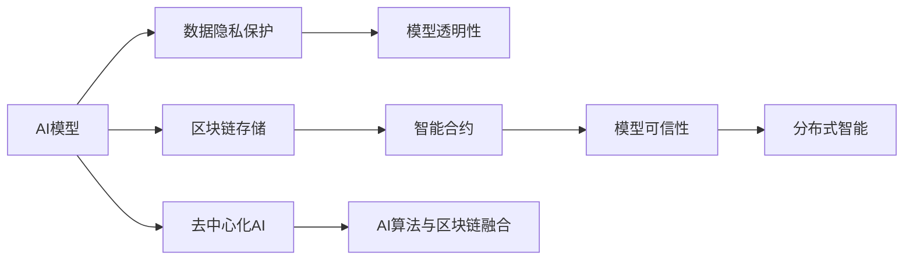

                 

# AI 与区块链的协同：构建可信的 AI 生态

> 关键词：区块链,人工智能,可信赖AI,分布式智能,智能合约

## 1. 背景介绍

### 1.1 问题由来
随着人工智能(AI)技术的迅速发展，其在医疗、金融、制造、农业等诸多领域的应用正日益广泛。然而，AI技术也面临着数据隐私、模型透明度、模型滥用等挑战，特别是在大规模应用场景下，这些问题显得尤为突出。与此同时，区块链技术的诞生，为这些问题的解决提供了新的思路和工具。区块链以其去中心化、不可篡改、可追溯等特性，为构建安全、透明、可信的AI生态提供了可能性。

### 1.2 问题核心关键点
AI与区块链的协同应用主要围绕以下几个核心问题展开：
- 数据隐私保护：如何在AI模型训练和应用中保护数据隐私，防止数据滥用和泄露。
- 模型透明度与可解释性：如何让AI模型的决策过程可解释、可追溯，增强模型的透明性。
- 模型可信性：如何保证AI模型在应用中的输出可信，避免模型被恶意篡改或滥用。
- 去中心化智能：如何在区块链的去中心化框架下构建智能合约和AI模型，提升系统的稳定性和鲁棒性。
- 经济激励机制：如何通过区块链的经济激励机制，激励AI模型的高效运行和协同合作。

这些问题的解决，需要AI和区块链技术的深度融合与协同创新。本文将从技术原理、具体应用和未来趋势等多个角度，深入探讨AI与区块链的协同应用。

## 2. 核心概念与联系

### 2.1 核心概念概述

为更好地理解AI与区块链的协同应用，我们首先需要清晰地定义以下几个关键概念：

- **区块链（Blockchain）**：一种去中心化分布式数据库技术，通过时间戳、共识算法等方式确保数据不可篡改、可追溯，为数据和模型提供可信的存储和传输环境。

- **智能合约（Smart Contracts）**：一种自动执行、不可篡改、去中心化的合约，可以在区块链上运行，用于自动化执行、验证和记录合约条款。

- **可信赖AI（Trustworthy AI）**：一种具有高透明度、高可信性和高可解释性的AI模型，能够确保其输出结果的真实、可靠和公正。

- **分布式智能（Distributed Intelligence）**：通过区块链将AI模型的计算、训练和推理分布到不同的节点上，形成去中心化的AI系统，提升系统的稳定性和鲁棒性。

- **去中心化AI（Decentralized AI）**：通过区块链技术实现AI模型的分布式存储和协同计算，确保模型和数据的分布式控制和安全性。

- **AI算法与区块链技术融合**：将AI算法与区块链共识算法、智能合约等技术融合，构建具有高安全性和高效能的AI应用系统。

### 2.2 核心概念原理和架构的 Mermaid 流程图



这个图展示了AI模型、数据隐私、模型透明性、模型可信性、分布式智能和去中心化AI之间的联系。各个概念之间相互依赖，共同构成了AI与区块链协同应用的框架。

## 3. 核心算法原理 & 具体操作步骤
### 3.1 算法原理概述

AI与区块链的协同应用，本质上是将AI算法的计算和数据存储过程与区块链的分布式、去中心化特性相结合。其核心算法包括数据隐私保护算法、模型透明性算法、模型可信性算法和去中心化智能算法。

### 3.2 算法步骤详解

#### 3.2.1 数据隐私保护

**算法步骤**：
1. **数据加密**：使用公钥加密技术，将数据加密并存储在区块链上。只有拥有私钥的授权用户才能解密和使用数据。
2. **差分隐私**：在数据收集和处理过程中，添加噪声扰动，防止数据泄露个人隐私。
3. **多方安全计算**：多个节点共同参与计算，并共享计算结果，确保数据的安全性和隐私性。

**技术实现**：
1. **同态加密**：在加密数据上执行计算，计算结果解密后与直接计算结果一致。
2. **多方安全计算**：多个参与方在不共享原始数据的情况下，通过加密算法计算共同结果。

#### 3.2.2 模型透明性

**算法步骤**：
1. **模型审计**：记录和验证AI模型的训练和推理过程，确保其透明性和可追溯性。
2. **可解释AI**：使用可解释AI算法，生成模型的解释和可视化，增强模型的透明性。
3. **透明合约**：将AI模型的训练、推理和输出过程嵌入智能合约，使其具有可追溯性。

**技术实现**：
1. **LIME（局部可解释模型-不可知解释方法）**：生成局部可解释模型，展示模型在不同输入下的行为。
2. **SHAP（SHapley Additive exPlanations）**：通过Shapley值分配，解释模型输出中各特征的贡献。
3. **透明合约平台**：使用Ethereum等区块链平台，将AI模型嵌入智能合约，记录其训练和推理过程。

#### 3.2.3 模型可信性

**算法步骤**：
1. **模型验证**：通过区块链共识算法验证AI模型的输出，确保其可信性。
2. **跨链可信**：通过跨链技术，将不同区块链上的AI模型输出进行验证和比对，提升模型可信性。
3. **审计记录**：记录AI模型的验证记录，增强模型的可信性。

**技术实现**：
1. **PoS（证明权益）**：通过权益证明算法，确保区块链上AI模型的可信性。
2. **跨链桥接**：通过跨链技术，实现不同区块链上的数据和模型互操作。
3. **区块链审计**：记录AI模型的验证记录，确保其透明性和可信性。

#### 3.2.4 去中心化智能

**算法步骤**：
1. **分布式存储**：将AI模型和数据分布在不同的区块链节点上，提升系统的稳定性和鲁棒性。
2. **分布式训练**：通过分布式训练算法，将AI模型的训练过程分布在多个节点上，提高训练效率。
3. **分布式推理**：通过分布式推理算法，将AI模型的推理过程分布在多个节点上，提升推理效率。

**技术实现**：
1. **P2P（点对点）**：通过点对点网络，实现AI模型的分布式存储和计算。
2. **Federated Learning**：通过联邦学习算法，实现AI模型的分布式训练和推理。
3. **模型迁移学习**：通过模型迁移学习算法，在不同节点之间传输和共享AI模型。

### 3.3 算法优缺点

AI与区块链的协同应用具有以下优点：
- **数据隐私保护**：区块链的分布式存储和加密技术，确保数据隐私和安全。
- **模型透明性**：通过区块链的透明性，确保AI模型的训练和推理过程可追溯、可审计。
- **模型可信性**：通过区块链的共识算法和跨链技术，确保AI模型的输出可信。
- **去中心化智能**：区块链的去中心化特性，提升AI模型的稳定性和鲁棒性。
- **经济激励机制**：通过区块链的经济激励机制，激励AI模型的协同合作和高效运行。

然而，AI与区块链的协同应用也面临一些挑战：
- **技术复杂性**：将AI与区块链融合，需要跨学科的知识和技能。
- **性能瓶颈**：区块链的去中心化特性可能导致性能瓶颈，影响AI模型的实时性和响应速度。
- **标准和规范**：缺乏统一的AI与区块链融合标准和规范，导致系统复杂性增加。
- **隐私和安全问题**：尽管区块链提供了数据隐私保护，但仍需面对潜在的隐私泄露和安全漏洞问题。

### 3.4 算法应用领域

AI与区块链的协同应用在多个领域展示了其巨大的潜力和应用前景，包括：

- **医疗健康**：通过区块链和智能合约，保护患者隐私，确保医疗数据的透明性和可信性。
- **金融服务**：通过区块链和智能合约，提升金融服务的透明度和可信性，防范金融风险。
- **供应链管理**：通过区块链和智能合约，实现供应链的可追溯性和透明性，提高供应链的效率和安全性。
- **物联网（IoT）**：通过区块链和智能合约，实现物联网设备和数据的透明性和可信性，提升系统的安全性和可靠性。
- **政府服务**：通过区块链和智能合约，提高政府服务的透明度和可信性，提升公共服务的效率和质量。

## 4. 数学模型和公式 & 详细讲解 & 举例说明

### 4.1 数学模型构建

在AI与区块链的协同应用中，数学模型的构建至关重要。这里我们以智能合约为例，介绍如何构建一个简单的智能合约模型。

智能合约的基本数学模型包括以下几个部分：
- **条件语句**：判断合约条款是否满足。
- **逻辑运算**：对条件语句的结果进行逻辑运算。
- **函数调用**：调用其他智能合约或外部API。
- **状态更新**：更新智能合约的状态，记录执行过程。

### 4.2 公式推导过程

**智能合约的基本公式**：

$$
\begin{aligned}
&\text{IF} \, P(\text{Contract}) \, \text{THEN} \, Q(\text{Contract}) \, \text{ELSE} \, R(\text{Contract}) \\
&\text{WHERE} \, P(\text{Contract}) = \text{(Condition 1, Condition 2, ..., Condition n)} \\
&\text{AND} \, Q(\text{Contract}) = \text{(Action 1, Action 2, ..., Action m)} \\
&\text{AND} \, R(\text{Contract}) = \text{(Inaction 1, Inaction 2, ..., Inaction n)}
\end{aligned}
$$

其中，$P(\text{Contract})$为合约条款，$Q(\text{Contract})$为合约执行动作，$R(\text{Contract})$为合约不执行动作。

### 4.3 案例分析与讲解

**案例：智能合约的租金支付与验证**

假设某智能合约用于管理房屋租赁，智能合约的基本逻辑如下：
- 条件1：承租人按时支付租金。
- 条件2：房屋无损坏。
- 动作：解锁房屋门锁，释放房屋使用权。
- 不执行动作：保持房屋门锁锁定，房屋使用权被保留。

智能合约的数学模型可以表示为：

$$
\begin{aligned}
&\text{IF} \, (P1 \, \text{AND} \, P2) \, \text{THEN} \, Q \, \text{ELSE} \, R \\
&\text{WHERE} \, P1 = \text{承租人按时支付租金} \\
&\text{AND} \, P2 = \text{房屋无损坏} \\
&\text{AND} \, Q = \text{解锁房屋门锁，释放房屋使用权} \\
&\text{AND} \, R = \text{保持房屋门锁锁定，房屋使用权被保留}
\end{aligned}
$$

## 5. 项目实践：代码实例和详细解释说明

### 5.1 开发环境搭建

#### 5.1.1 区块链平台选择

选择适合自己应用的区块链平台，是开发智能合约的第一步。当前主流的区块链平台包括Ethereum、Hyperledger Fabric等。

#### 5.1.2 智能合约开发工具

使用Solidity等智能合约编程语言，开发智能合约。智能合约开发工具包括Remix、Truffle等。

### 5.2 源代码详细实现

以下是一个简单的智能合约示例，用于管理房屋租赁：

```solidity
// SPDX-License-Identifier: MIT
pragma solidity ^0.8.0;

contract RentContract {
    address public owner;
    uint256 public rent;
    uint256 public rentDue;
    uint256 public rentPaid;
    uint256 public deposit;
    uint256 public depositReturned;
    uint256 public leaseTime;
    uint256 public rentFrequency;
    uint256 public rentInterval;
    uint256 public rentPrice;
    uint256 public lockCode;

    bool public isLocked;
    bool public isRented;
    bool public isOverdue;

    event DepositMade();
    event RentPaid();
    event RentReturned();
    event ContractEnded();

    constructor() {
        owner = msg.sender;
        rent = 1000 * 10 ** 18;
        rentDue = rent * leaseTime / 30;
        rentPaid = 0;
        deposit = 100 * 10 ** 18;
        depositReturned = 0;
        leaseTime = 6 * 30;
        rentFrequency = 1;
        rentInterval = 1;
        rentPrice = 100 * 10 ** 18;
        lockCode = 12345678;
        isLocked = true;
        isRented = false;
        isOverdue = false;
    }

    function lockHouse() public {
        require(!isLocked);
        lockCode = msg.sender;
        isLocked = true;
    }

    function unlockHouse() public {
        require(isLocked);
        require(msg.sender == lockCode);
        isLocked = false;
    }

    function rentHouse() public payable {
        require(!isRented);
        require(msg.value == rentPrice * leaseTime / leaseTime);
        rentPaid += msg.value;
        isRented = true;
        emit RentPaid();
    }

    function returnDeposit() public {
        require(isRented);
        require(msg.sender == owner);
        depositReturned += deposit;
        isRented = false;
        emit DepositReturned();
    }

    function endContract() public {
        require(owner == msg.sender);
        emit ContractEnded();
    }
}
```

### 5.3 代码解读与分析

**代码解析**：
- **构造函数**：初始化智能合约的基本参数，如租金、押金、租赁期限等。
- **lockHouse函数**：锁定房屋，仅承租人可以解锁。
- **unlockHouse函数**：解锁房屋，要求锁定代码与承租人匹配。
- **rentHouse函数**：承租人支付租金，解锁房屋使用权。
- **returnDeposit函数**：承租人支付押金后，解锁房屋使用权。
- **endContract函数**：房屋租赁结束，释放房屋使用权。

## 6. 实际应用场景

### 6.1 智能合约在金融领域的运用

#### 6.1.1 金融交易验证

智能合约可以用于验证金融交易的真实性和合法性。例如，银行可以使用智能合约验证交易双方的身份和交易金额，确保交易的安全性和透明性。

**示例**：
- 一个智能合约可以记录一笔交易的金额、时间、双方信息等，确保交易的真实性。智能合约还可以根据预设条件触发特定的金融操作，如转账、结算等。

#### 6.1.2 智能投顾

智能合约可以用于自动执行金融策略，构建智能投顾系统。例如，智能合约可以根据市场数据自动买卖股票、基金等资产。

**示例**：
- 一个智能合约可以实时监测股票价格和市场趋势，根据预设的策略自动买卖股票。智能合约还可以记录交易记录，供审计和追踪使用。

#### 6.1.3 数字货币

智能合约可以用于数字货币的交易和监管。例如，智能合约可以记录货币的发行和流通情况，确保货币的安全性和透明性。

**示例**：
- 一个智能合约可以记录数字货币的发行数量和分配情况，确保货币的公平性和透明性。智能合约还可以根据预设规则自动调整货币供应量，稳定货币市场。

### 6.2 智能合约在医疗健康领域的运用

#### 6.2.1 医疗记录管理

智能合约可以用于管理医疗记录，确保医疗数据的安全性和隐私性。例如，智能合约可以记录病人的医疗记录，保护病人的隐私和数据安全。

**示例**：
- 一个智能合约可以记录病人的医疗记录和医生信息，确保数据的安全性和隐私性。智能合约还可以根据预设条件触发特定的医疗操作，如病历更新、药物管理等。

#### 6.2.2 医疗费用结算

智能合约可以用于自动结算医疗费用，确保医疗费用的透明性和公正性。例如，智能合约可以根据医生的诊断和治疗方案，自动结算医疗费用，减少纠纷。

**示例**：
- 一个智能合约可以记录医生的诊断和治疗方案，自动计算医疗费用。智能合约还可以记录费用结算情况，确保费用的透明性和公正性。

#### 6.2.3 医疗研究

智能合约可以用于管理医疗研究数据，确保数据的安全性和透明性。例如，智能合约可以记录研究数据和实验结果，保护研究数据的安全性和隐私性。

**示例**：
- 一个智能合约可以记录研究数据和实验结果，确保数据的安全性和隐私性。智能合约还可以根据预设条件触发特定的研究操作，如数据共享、实验通知等。

### 6.3 智能合约在供应链管理的运用

#### 6.3.1 供应链溯源

智能合约可以用于管理供应链溯源信息，确保供应链的透明性和安全性。例如，智能合约可以记录产品的生产和流通过程，确保供应链的透明度。

**示例**：
- 一个智能合约可以记录产品的生产和流通过程，确保供应链的透明性和安全性。智能合约还可以根据预设条件触发特定的供应链操作，如产品追踪、库存管理等。

#### 6.3.2 供应链融资

智能合约可以用于自动化供应链融资，确保融资过程的透明性和公正性。例如，智能合约可以记录供应链的融资需求和审批情况，确保融资过程的透明性和公正性。

**示例**：
- 一个智能合约可以记录供应链的融资需求和审批情况，确保融资过程的透明性和公正性。智能合约还可以根据预设条件触发特定的融资操作，如审批通过、资金划转等。

#### 6.3.3 供应链管理

智能合约可以用于自动化供应链管理，确保供应链的高效性和安全性。例如，智能合约可以记录供应链的合同信息和执行情况，确保供应链的高效性和安全性。

**示例**：
- 一个智能合约可以记录供应链的合同信息和执行情况，确保供应链的高效性和安全性。智能合约还可以根据预设条件触发特定的供应链操作，如合同签署、合同执行等。

## 7. 工具和资源推荐

### 7.1 学习资源推荐

#### 7.1.1 区块链相关资源

1. **《区块链原理与应用》**：详细介绍区块链的基本原理、共识算法、智能合约等关键技术。
2. **Blockchain Council**：区块链技术权威机构，提供丰富的学习资源和认证课程。
3. **Ethereum Developer Portal**：Ethereum官方开发者平台，提供丰富的智能合约开发工具和文档。

#### 7.1.2 AI相关资源

1. **《深度学习》**：深度学习领域权威教材，涵盖深度学习的基本原理和算法。
2. **DeepLearning.AI**：深度学习领域权威机构，提供丰富的深度学习课程和资源。
3. **TensorFlow & PyTorch官方文档**：深度学习框架官方文档，提供详细的API和代码示例。

#### 7.1.3 AI与区块链融合资源

1. **《区块链与人工智能：融合与创新》**：详细介绍AI与区块链融合的基本原理和应用场景。
2. **Blockchain AI Consortium**：AI与区块链融合领域权威机构，提供丰富的学习资源和研究论文。
3. **AI & Blockchain Meetup**：全球性的AI与区块链交流平台，提供丰富的学习资源和活动。

### 7.2 开发工具推荐

#### 7.2.1 区块链开发工具

1. **Remix IDE**：智能合约开发工具，提供丰富的智能合约开发环境。
2. **Truffle Framework**：智能合约开发工具，提供丰富的智能合约开发和测试环境。
3. **Etherscan**：Ethereum官方交易查询工具，提供丰富的智能合约部署和交易记录查询。

#### 7.2.2 AI开发工具

1. **TensorFlow & PyTorch**：深度学习框架，提供丰富的AI模型开发环境。
2. **Keras**：深度学习框架，提供简单易用的API和工具。
3. **Scikit-learn**：机器学习库，提供丰富的机器学习算法和工具。

#### 7.2.3 AI与区块链融合开发工具

1. **Blockchain & AI Framework**：AI与区块链融合开发工具，提供丰富的智能合约和AI模型开发环境。
2. **Ethereum & TensorFlow**：将AI与区块链融合，提供丰富的智能合约和AI模型开发环境。
3. **Hyperledger & TensorFlow**：将AI与区块链融合，提供丰富的智能合约和AI模型开发环境。

### 7.3 相关论文推荐

#### 7.3.1 区块链相关论文

1. **《Blockchain Technology: State of the Art and Future Trends》**：区块链技术综述论文，介绍区块链的基本原理和未来趋势。
2. **《Blockchain-based Smart Contracts: Opportunities and Challenges》**：智能合约综述论文，介绍智能合约的基本原理和应用场景。
3. **《Blockchain and Artificial Intelligence: A Comprehensive Survey》**：AI与区块链融合综述论文，介绍AI与区块链融合的基本原理和应用场景。

#### 7.3.2 AI相关论文

1. **《Deep Learning》**：深度学习领域综述论文，介绍深度学习的基本原理和应用场景。
2. **《Trustworthy AI: Principles and Practices》**：可信赖AI综述论文，介绍可信赖AI的基本原理和实践方法。
3. **《Distributed AI: Principles and Practices》**：分布式AI综述论文，介绍分布式AI的基本原理和实践方法。

#### 7.3.3 AI与区块链融合相关论文

1. **《Blockchain-based AI: A Survey》**：AI与区块链融合综述论文，介绍AI与区块链融合的基本原理和应用场景。
2. **《Blockchain-based AI for Supply Chain Management》**：AI与区块链融合应用论文，介绍AI与区块链在供应链管理中的应用。
3. **《Blockchain-based AI for Financial Services》**：AI与区块链融合应用论文，介绍AI与区块链在金融服务中的应用。

## 8. 总结：未来发展趋势与挑战

### 8.1 研究成果总结

本文从技术原理、具体应用和未来趋势等多个角度，深入探讨了AI与区块链的协同应用。具体包括以下几个方面：
- **数据隐私保护**：通过区块链的加密和差分隐私技术，确保数据隐私和安全。
- **模型透明性**：通过区块链的透明性和智能合约，确保AI模型的透明性和可追溯性。
- **模型可信性**：通过区块链的共识算法和智能合约，确保AI模型的可信性。
- **去中心化智能**：通过区块链的去中心化特性，提升AI模型的稳定性和鲁棒性。

### 8.2 未来发展趋势

未来，AI与区块链的协同应用将呈现以下几个发展趋势：
- **AI与区块链的深度融合**：AI与区块链的协同应用将更加深入，形成跨领域的智能生态系统。
- **AI与区块链的商业化应用**：AI与区块链的协同应用将逐步从科研领域走向商业化，为各行各业提供智能解决方案。
- **AI与区块链的标准化**：AI与区块链的协同应用将逐步标准化，形成统一的AI与区块链融合标准和规范。
- **AI与区块链的可解释性**：AI与区块链的协同应用将更加注重模型的可解释性和透明性，增强用户信任和接受度。
- **AI与区块链的可持续发展**：AI与区块链的协同应用将更加注重环境友好和可持续发展，减少能源消耗和环境影响。

### 8.3 面临的挑战

尽管AI与区块链的协同应用具有广阔前景，但也面临以下几个挑战：
- **技术复杂性**：AI与区块链的协同应用需要跨学科的知识和技能，技术实现难度较大。
- **性能瓶颈**：区块链的去中心化特性可能导致性能瓶颈，影响AI模型的实时性和响应速度。
- **隐私和安全问题**：尽管区块链提供了数据隐私保护，但仍需面对潜在的隐私泄露和安全漏洞问题。
- **标准和规范缺失**：缺乏统一的AI与区块链融合标准和规范，导致系统复杂性增加。
- **经济激励机制问题**：如何设计合理的经济激励机制，激励AI模型的协同合作和高效运行，仍然是一个重要问题。

### 8.4 研究展望

未来，AI与区块链的协同应用需要在以下几个方面进行深入研究：
- **跨学科知识整合**：AI与区块链的协同应用需要跨学科的知识整合，形成协同创新机制。
- **技术性能优化**：优化AI与区块链的协同应用，提升系统的实时性和响应速度。
- **隐私和安全保障**：进一步保障数据隐私和安全，确保AI与区块链的协同应用安全可靠。
- **标准和规范制定**：制定统一的AI与区块链融合标准和规范，推动AI与区块链的协同应用标准化。
- **经济激励机制设计**：设计合理的经济激励机制，激励AI模型的协同合作和高效运行。

## 9. 附录：常见问题与解答

### 9.1 问题1：AI与区块链的协同应用是否适用于所有行业？

**答案**：AI与区块链的协同应用在金融、医疗、供应链等诸多领域已经展示了其巨大的潜力和应用前景。未来，AI与区块链的协同应用将逐步推广到更多行业，为各行各业提供智能解决方案。

### 9.2 问题2：AI与区块链的协同应用有哪些优点？

**答案**：AI与区块链的协同应用具有以下优点：
- **数据隐私保护**：区块链的加密和差分隐私技术，确保数据隐私和安全。
- **模型透明性**：通过区块链的透明性和智能合约，确保AI模型的透明性和可追溯性。
- **模型可信性**：通过区块链的共识算法和智能合约，确保AI模型的可信性。
- **去中心化智能**：区块链的去中心化特性，提升AI模型的稳定性和鲁棒性。

### 9.3 问题3：AI与区块链的协同应用面临哪些挑战？

**答案**：AI与区块链的协同应用面临以下挑战：
- **技术复杂性**：AI与区块链的协同应用需要跨学科的知识和技能，技术实现难度较大。
- **性能瓶颈**：区块链的去中心化特性可能导致性能瓶颈，影响AI模型的实时性和响应速度。
- **隐私和安全问题**：尽管区块链提供了数据隐私保护，但仍需面对潜在的隐私泄露和安全漏洞问题。
- **标准和规范缺失**：缺乏统一的AI与区块链融合标准和规范，导致系统复杂性增加。
- **经济激励机制问题**：如何设计合理的经济激励机制，激励AI模型的协同合作和高效运行，仍然是一个重要问题。

### 9.4 问题4：AI与区块链的协同应用未来有哪些发展趋势？

**答案**：AI与区块链的协同应用未来将呈现以下几个发展趋势：
- **AI与区块链的深度融合**：AI与区块链的协同应用将更加深入，形成跨领域的智能生态系统。
- **AI与区块链的商业化应用**：AI与区块链的协同应用将逐步从科研领域走向商业化，为各行各业提供智能解决方案。
- **AI与区块链的标准化**：AI与区块链的协同应用将逐步标准化，形成统一的AI与区块链融合标准和规范。
- **AI与区块链的可解释性**：AI与区块链的协同应用将更加注重模型的可解释性和透明性，增强用户信任和接受度。
- **AI与区块链的可持续发展**：AI与区块链的协同应用将更加注重环境友好和可持续发展，减少能源消耗和环境影响。

### 9.5 问题5：AI与区块链的协同应用在医疗健康领域有哪些应用场景？

**答案**：AI与区块链的协同应用在医疗健康领域有以下应用场景：
- **医疗记录管理**：智能合约可以记录病人的医疗记录，保护病人的隐私和数据安全。
- **医疗费用结算**：智能合约可以自动结算医疗费用，确保医疗费用的透明性和公正性。
- **医疗研究**：智能合约可以管理医疗研究数据，保护研究数据的安全性和隐私性。

### 9.6 问题6：AI与区块链的协同应用在金融服务领域有哪些应用场景？

**答案**：AI与区块链的协同应用在金融服务领域有以下应用场景：
- **金融交易验证**：智能合约可以验证金融交易的真实性和合法性，确保交易的安全性和透明性。
- **智能投顾**：智能合约可以自动执行金融策略，构建智能投顾系统。
- **数字货币**：智能合约可以记录货币的发行和流通情况，确保货币的安全性和透明性。

### 9.7 问题7：AI与区块链的协同应用在供应链管理领域有哪些应用场景？

**答案**：AI与区块链的协同应用在供应链管理领域有以下应用场景：
- **供应链溯源**：智能合约可以记录产品的生产和流通过程，确保供应链的透明性和安全性。
- **供应链融资**：智能合约可以自动化供应链融资，确保融资过程的透明性和公正性。
- **供应链管理**：智能合约可以自动化供应链管理，确保供应链的高效性和安全性。

---

作者：禅与计算机程序设计艺术 / Zen and the Art of Computer Programming

