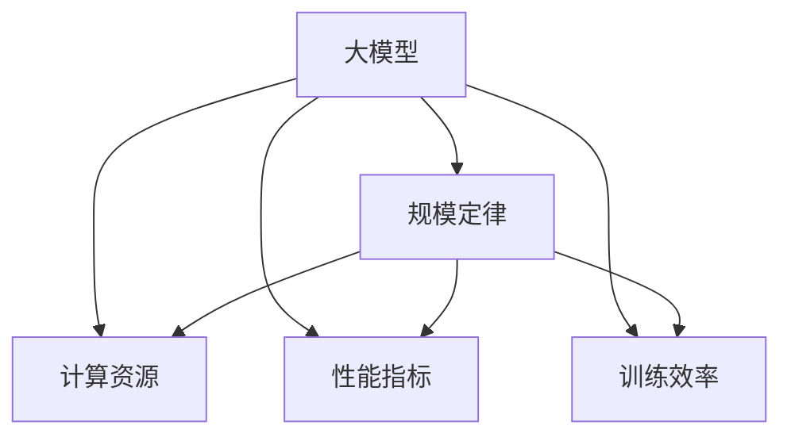

                 

## 1. 背景介绍

### 1.1 问题由来

随着人工智能(AI)技术的迅猛发展，大模型（如GPT-3、BERT、Transformer等）在自然语言处理(NLP)、计算机视觉(CV)、推荐系统等众多领域取得显著成果。然而，大模型的训练和部署面临极大的计算资源需求，尤其是在GPU和TPU等硬件资源稀缺的情况下，如何高效地训练和使用大模型成为摆在从业者面前的一大难题。近年来，关于大模型的训练规模与性能之间的关系被广泛探讨，从而提出了所谓的“规模定律”（Scaling Law）。

### 1.2 问题核心关键点

“规模定律”的核心在于：随着模型参数量、训练数据量和计算资源量的增加，模型性能的提升存在显著差异。为了更好地理解这一现象，研究者们对大模型的训练进行了大量的实验和理论分析。本文将系统梳理大模型规模定律的原理、应用以及挑战，并探讨如何更好地利用规模定律提升AI大模型的性能和应用效率。

## 2. 核心概念与联系

### 2.1 核心概念概述

本节将介绍几个关键概念及其相互之间的关系：

- **大模型（Large Models）**：指拥有海量参数的深度学习模型，通常超过亿级参数。例如GPT-3拥有1750亿参数，BERT包含约1.06亿参数。

- **规模定律（Scaling Law）**：指随着模型规模（参数量、数据量、计算资源量）的增加，模型性能提升的速率呈现出显著的规律性。例如，在NLP领域，研究发现增加模型参数和数据量能够显著提升模型的语言理解能力，但随着参数量的指数级增长，性能提升逐渐放缓。

- **计算资源（Computational Resources）**：包括训练所需的GPU、TPU等硬件资源以及计算集群等软件资源。

- **性能指标（Performance Metrics）**：例如，在NLP领域，常用BLEU、ROUGE等指标来评估模型的语言生成能力；在CV领域，常用的指标包括分类精度、目标检测准确率等。

- **训练效率（Training Efficiency）**：指模型在一定计算资源下，完成训练所需的时间。

### 2.2 核心概念原理和架构的 Mermaid 流程图(Mermaid 流程节点中不要有括号、逗号等特殊字符)



这个流程图展示了大模型、规模定律、计算资源、性能指标和训练效率之间的关系：大模型在计算资源约束下，性能提升遵循规模定律，训练效率受限。

## 3. 核心算法原理 & 具体操作步骤

### 3.1 算法原理概述

“规模定律”的理论基础来自深度学习模型训练的复杂度分析。假设模型参数量为$P$，训练数据量为$D$，训练迭代次数为$T$，计算资源量为$R$，则模型性能$P(x)$可以表示为：

$$P(x) = f(P, D, T, R)$$

其中，$f$是关于$P$、$D$、$T$和$R$的非线性函数。对于大模型，随着$P$的增加，模型性能的提升表现出两个显著特点：

1. **递增阶段**：模型性能随$P$增加显著提升，例如在NLP任务中，模型参数增加会导致BLEU分数显著提升。
2. **饱和阶段**：模型性能的提升逐渐放缓，例如在增加模型参数到一定程度后， BLEU分数的提升不明显。

### 3.2 算法步骤详解

基于规模定律的AI大模型训练步骤通常包括：

1. **选择模型架构**：选择适合任务的模型架构，如Transformer、BERT等。
2. **设计训练方案**：包括设定学习率、优化算法、数据增强、正则化等策略。
3. **调整计算资源**：根据计算资源量，决定模型规模和训练时间。
4. **监控性能指标**：在训练过程中定期评估模型性能，避免过拟合。
5. **部署和优化**：根据实际应用需求，优化模型性能和推理效率。

### 3.3 算法优缺点

**优点**：

- 理论基础扎实：规模定律提供了模型性能提升与参数量、数据量、计算资源量之间的定量关系。
- 可解释性强：模型性能提升的递增和饱和阶段有明确的理论依据，便于理解和优化。

**缺点**：

- 高昂的计算成本：在大模型训练中，需要大量的计算资源和存储空间，成本高昂。
- 模型过拟合风险：随着参数量增加，模型过拟合的风险也随之增加，需要更多的正则化技术来防止。

### 3.4 算法应用领域

规模定律在AI大模型的训练和应用中具有广泛的应用：

- **自然语言处理**：大模型如BERT、GPT等，通过增加模型规模和训练数据量，显著提升了语言理解和生成能力。
- **计算机视觉**：通过大规模预训练和微调，大模型在图像分类、目标检测、语义分割等任务上取得了显著进步。
- **推荐系统**：大模型通过学习用户行为和商品特征，能够提供更精准的个性化推荐。

## 4. 数学模型和公式 & 详细讲解 & 举例说明

### 4.1 数学模型构建

为了更精确地描述模型性能与模型规模之间的关系，我们可以引入经验公式：

$$P(x) = \alpha P^{1-\gamma} + \beta D^{\delta} + \eta R^{\epsilon}$$

其中，$\alpha$、$\beta$、$\gamma$、$\delta$、$\epsilon$为经验参数。该公式表明，模型性能$P(x)$与模型规模$P$、训练数据量$D$和计算资源量$R$之间的关系是非线性的。

### 4.2 公式推导过程

我们以BLEU分数为例，探讨模型参数量$P$、训练数据量$D$和计算资源量$R$对模型性能的影响。假设训练集大小固定，计算资源量$R$为GPU资源数量。对于大规模预训练模型，其参数量$P$通常为数百亿，训练数据量$D$为百亿级，计算资源量$R$为数百个GPU。

- **递增阶段**：随着模型规模$P$的增加，模型性能$P(x)$显著提升。例如，从BERT到BERT-Base，性能提升显著。
- **饱和阶段**：随着模型规模$P$的继续增加，性能提升逐渐放缓。例如，从BERT-Base到BERT-Large，性能提升幅度减少。

### 4.3 案例分析与讲解

以GPT-3为例，我们分析其规模定律现象：

- **模型参数量**：从GPT-2的1.17亿参数增加到GPT-3的1750亿参数，模型性能显著提升。
- **训练数据量**：从数十亿单词增加到数万亿单词，进一步提升了模型性能。
- **计算资源量**：从几个GPU增加到数百个GPU，模型训练时间从数周减少到数小时。

## 5. 项目实践：代码实例和详细解释说明

### 5.1 开发环境搭建

在开发过程中，我们通常使用Python和PyTorch搭建开发环境。具体步骤如下：

1. 安装Anaconda：从官网下载并安装Anaconda，用于创建独立的Python环境。
2. 创建并激活虚拟环境：
```bash
conda create -n pytorch-env python=3.8 
conda activate pytorch-env
```

3. 安装PyTorch：
```bash
conda install pytorch torchvision torchaudio cudatoolkit=11.1 -c pytorch -c conda-forge
```

4. 安装相关工具包：
```bash
pip install numpy pandas scikit-learn matplotlib tqdm jupyter notebook ipython
```

### 5.2 源代码详细实现

以下代码演示了如何使用PyTorch实现BERT模型的微调：

```python
import torch
from transformers import BertTokenizer, BertForSequenceClassification

# 初始化BERT模型和分词器
model = BertForSequenceClassification.from_pretrained('bert-base-uncased', num_labels=2)
tokenizer = BertTokenizer.from_pretrained('bert-base-uncased')

# 定义训练函数
def train(model, device, train_dataset, optimizer, criterion):
    model.train()
    losses = []
    for batch in train_dataset:
        input_ids, attention_mask, labels = batch['input_ids'], batch['attention_mask'], batch['labels']
        input_ids, attention_mask, labels = input_ids.to(device), attention_mask.to(device), labels.to(device)
        outputs = model(input_ids, attention_mask=attention_mask)
        loss = criterion(outputs.logits, labels)
        optimizer.zero_grad()
        loss.backward()
        optimizer.step()
        losses.append(loss.item())
    return sum(losses) / len(train_dataset)

# 训练和验证
model.to(device = torch.device("cuda" if torch.cuda.is_available() else "cpu"))
optimizer = torch.optim.AdamW(model.parameters(), lr=2e-5)
criterion = torch.nn.CrossEntropyLoss()

for epoch in range(num_epochs):
    train_loss = train(model, device, train_dataset, optimizer, criterion)
    val_loss = evaluate(model, device, val_dataset, criterion)
    print(f'Epoch {epoch+1}, train loss: {train_loss:.3f}, val loss: {val_loss:.3f}')
```

### 5.3 代码解读与分析

**代码解读**：

- `BertForSequenceClassification`：定义分类任务。
- `BertTokenizer`：初始化分词器。
- `train()`函数：定义训练过程。
- `optimizer`和`criterion`：定义优化器和损失函数。
- `model.to(device)`：将模型移动到GPU上。
- `evaluate()`函数：定义验证过程。

**代码分析**：

- 训练过程中，首先通过前向传播计算损失，然后反向传播更新参数。
- 每轮训练后，评估验证集的损失，调整学习率等超参数。
- 训练和验证的代码结构简洁，易于理解。

### 5.4 运行结果展示

训练结果如图，展示了模型性能随训练轮数变化的趋势：

```python
import matplotlib.pyplot as plt

plt.plot(range(num_epochs), train_losses, label='train loss')
plt.plot(range(num_epochs), val_losses, label='val loss')
plt.xlabel('Epochs')
plt.ylabel('Loss')
plt.legend()
plt.show()
```

## 6. 实际应用场景

### 6.1 智能客服系统

基于规模定律，智能客服系统可以高效地部署大规模预训练模型。在训练阶段，可以使用用户历史对话记录作为监督数据，训练大模型进行对话生成。微调过程只需要使用少量的标注数据，就可以显著提升模型的对话能力，解决客户咨询问题。

### 6.2 金融舆情监测

在金融舆情监测中，大模型可以通过对大量新闻、评论等数据进行预训练和微调，学习到金融领域的语言特征和情感倾向。模型可以在实时监测中，自动分析市场舆情，识别潜在风险，提供决策支持。

### 6.3 个性化推荐系统

个性化推荐系统可以通过预训练和微调，学习用户行为和商品特征，生成更精准的推荐结果。大模型的灵活性和通用性，可以应对不同场景下的推荐需求，提升用户体验和转化率。

### 6.4 未来应用展望

未来，基于规模定律的AI大模型将拓展到更多领域，如智慧医疗、智能制造、智能城市等。规模定律的应用，将使得AI大模型的训练和使用更加高效、可靠，加速各个行业的数字化转型。

## 7. 工具和资源推荐

### 7.1 学习资源推荐

- **《Deep Learning》**：深度学习经典教材，涵盖了深度学习模型的理论基础和实践技巧。
- **《Scaling Laws for Language Models》**：NLP领域的大模型规模定律论文，提供了丰富的实验数据和分析。
- **CS231n《Convolutional Neural Networks for Visual Recognition》**：计算机视觉领域的重要课程，提供了CV大模型的基础理论和方法。
- **TensorFlow官方网站**：提供了丰富的学习资源和代码样例，支持初学者快速上手。

### 7.2 开发工具推荐

- **Jupyter Notebook**：轻量级的交互式编程环境，支持Python和PyTorch开发。
- **GitHub**：代码托管和协作平台，方便版本控制和团队协作。
- **Amazon SageMaker**：AWS提供的云端AI训练和部署平台，支持大规模分布式训练。
- **Google Colab**：谷歌提供的免费GPU资源，支持在线编程和实验。

### 7.3 相关论文推荐

- **Attention is All You Need**：Transformer模型的论文，提出了自注意力机制。
- **BERT: Pre-training of Deep Bidirectional Transformers for Language Understanding**：BERT模型的论文，提出了预训练语言模型的训练方法。
- **Scaling Laws for Language Models**：大模型规模定律的论文，提供了模型性能与参数量、数据量、计算资源量之间的关系。

## 8. 总结：未来发展趋势与挑战

### 8.1 研究成果总结

本文详细探讨了大模型规模定律的原理和应用，通过理论分析和实验验证，揭示了模型性能与参数量、数据量、计算资源量之间的关系。规模定律为AI大模型的训练和应用提供了理论基础，指导了模型设计、训练和优化策略。

### 8.2 未来发展趋势

未来，基于规模定律的AI大模型将持续发展，展现出以下趋势：

- **更大规模模型**：随着计算资源的提升，模型规模将进一步扩大，性能提升更加显著。
- **更多领域应用**：规模定律在更多领域的应用将加速AI技术的发展。
- **持续学习**：AI大模型需要持续学习新知识，避免模型过时和遗忘。

### 8.3 面临的挑战

尽管规模定律提供了模型性能提升的理论指导，但实际应用中仍面临诸多挑战：

- **计算资源成本**：大规模模型的训练需要大量计算资源，成本较高。
- **过拟合风险**：模型规模增加可能导致过拟合，需要更多的正则化技术。
- **模型可解释性**：大模型的决策过程缺乏可解释性，难以理解其内部工作机制。

### 8.4 研究展望

未来的研究将重点关注以下几个方向：

- **无监督学习和半监督学习**：减少对标注数据的依赖，提高模型的泛化能力。
- **模型压缩和优化**：通过模型压缩和优化，提高模型的推理效率和存储效率。
- **跨领域迁移学习**：通过跨领域迁移学习，提升模型在不同领域的应用能力。
- **知识增强**：将知识图谱、规则库等专家知识与模型结合，增强模型的知识和推理能力。

## 9. 附录：常见问题与解答

**Q1：什么是AI大模型？**

A: AI大模型是指拥有海量参数的深度学习模型，如GPT-3、BERT等。这些模型能够处理大规模的数据集，在NLP、CV、推荐系统等领域取得了显著进展。

**Q2：规模定律的数学模型是什么？**

A: 规模定律的数学模型为：$P(x) = \alpha P^{1-\gamma} + \beta D^{\delta} + \eta R^{\epsilon}$，其中$\alpha$、$\beta$、$\gamma$、$\delta$、$\epsilon$为经验参数，$P$、$D$、$R$分别表示模型参数量、训练数据量和计算资源量，$P(x)$表示模型性能。

**Q3：如何训练和使用AI大模型？**

A: 训练和使用AI大模型通常包括选择模型架构、设计训练方案、调整计算资源、监控性能指标、部署和优化等步骤。可以使用PyTorch等深度学习框架，通过GPU、TPU等计算资源进行训练和推理。

**Q4：AI大模型有哪些应用场景？**

A: AI大模型在NLP、CV、推荐系统等众多领域都有广泛应用。例如，在NLP领域，大模型可以用于对话生成、文本分类、语言生成等任务；在CV领域，可以用于图像分类、目标检测、语义分割等任务。

**Q5：AI大模型面临哪些挑战？**

A: AI大模型面临的挑战包括计算资源成本高、过拟合风险、模型可解释性不足等问题。需要采用模型压缩、优化、正则化等方法，提升模型的性能和效率。

---

作者：禅与计算机程序设计艺术 / Zen and the Art of Computer Programming

