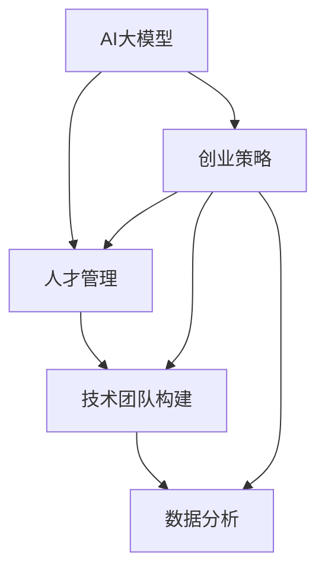

                 

# AI 大模型创业：如何利用人才优势？

> 关键词：AI大模型, 创业策略, 人才管理, 技术团队构建, 数据分析

## 1. 背景介绍

在人工智能（AI）领域，尤其是自然语言处理（NLP）和机器学习（ML）领域，大模型的应用已经成为行业的一大趋势。从GPT-3到BERT，再到T5和MPU，这些大模型在自然语言理解和生成方面展现了令人瞩目的能力。然而，构建一个基于大模型的AI创业公司，不仅仅是技术上的挑战，更是管理上的挑战。在这篇文章中，我们将探讨如何利用人才优势，构建一个成功的AI大模型创业公司。

## 2. 核心概念与联系

### 2.1 核心概念概述

在大模型创业公司的构建过程中，以下概念至关重要：

- **AI大模型**：指通过大规模数据和先进算法训练得到的具有强大计算能力和语言处理能力的模型，如BERT、GPT-3等。
- **创业策略**：指公司在产品规划、市场定位、技术研发等方面的战略决策，确保公司能够在激烈的市场竞争中脱颖而出。
- **人才管理**：指公司如何招募、培养和保留优秀人才，构建一支高效、创新、协作的团队。
- **技术团队构建**：指公司如何根据项目需求，构建不同背景、技能互补的技术团队。
- **数据分析**：指公司如何通过数据驱动决策，优化产品和服务。

### 2.2 核心概念原理和架构的 Mermaid 流程图



## 3. 核心算法原理 & 具体操作步骤

### 3.1 算法原理概述

构建AI大模型创业公司，需要综合考虑技术、市场、人才等多个因素。以下是核心算法原理：

1. **需求分析**：首先，公司需要明确自己的目标市场和目标用户。通过市场调研和数据分析，确定公司的产品定位和核心竞争力。
2. **技术评估**：选择适合自己需求的大模型，进行性能评估和测试，确保模型的可靠性和适用性。
3. **人才招募**：根据项目需求，招募不同背景和技能的人才，构建多学科、多职能的团队。
4. **团队建设**：通过团队建设活动、培训和激励机制，提升团队凝聚力和协作效率。
5. **数据驱动决策**：利用数据分析工具，监控公司运营情况，优化产品和服务，提高用户满意度。

### 3.2 算法步骤详解

以下是具体的步骤：

1. **市场调研与需求分析**：通过问卷调查、用户访谈、市场报告等方式，了解目标用户的需求和痛点，确定公司的产品方向。
2. **技术评估与选择**：评估不同大模型的性能和特点，选择合适的模型进行产品开发。
3. **人才招募与选拔**：制定招聘计划，发布招聘信息，通过面试、测试等方式筛选合适的候选人。
4. **团队建设与管理**：设计团队架构，明确角色和职责，定期组织团队建设活动，提升团队凝聚力。
5. **数据分析与决策**：使用数据可视化工具，如Tableau、Power BI等，监控公司运营情况，进行决策支持。

### 3.3 算法优缺点

**优点**：

- 利用大模型的强大计算能力，提高产品竞争力。
- 通过数据分析驱动决策，提高运营效率和用户满意度。
- 多学科、多职能团队协作，提升创新能力。

**缺点**：

- 对数据和算法要求高，初期成本较高。
- 需要持续投入研发和市场推广，资金压力大。
- 团队管理和协作复杂，容易出现沟通和效率问题。

### 3.4 算法应用领域

大模型创业公司在多个领域都有应用：

- **NLP领域**：如自然语言理解、机器翻译、文本生成等。
- **医疗领域**：如病历分析、医学影像识别等。
- **金融领域**：如信用评估、风险管理等。
- **教育领域**：如智能辅导、学习分析等。

## 4. 数学模型和公式 & 详细讲解 & 举例说明

### 4.1 数学模型构建

在构建AI大模型创业公司的过程中，可以使用以下数学模型：

- **回归分析**：用于预测用户行为和市场趋势。
- **聚类分析**：用于用户细分和产品定位。
- **分类算法**：用于用户分类和产品推荐。
- **推荐系统**：用于个性化推荐和用户画像构建。

### 4.2 公式推导过程

以回归分析为例，假设我们有样本数据 $(x_1, y_1), (x_2, y_2), \dots, (x_n, y_n)$，我们需要找到一个线性模型 $y = wx + b$ 来拟合数据。通过最小二乘法，我们可以得到模型参数 $w$ 和 $b$：

$$
w = \frac{\sum_{i=1}^n (x_i - \bar{x})(y_i - \bar{y})}{\sum_{i=1}^n (x_i - \bar{x})^2}
$$

$$
b = \bar{y} - w\bar{x}
$$

其中，$\bar{x} = \frac{\sum_{i=1}^n x_i}{n}$，$\bar{y} = \frac{\sum_{i=1}^n y_i}{n}$。

### 4.3 案例分析与讲解

假设我们有一个电商平台，通过回归分析预测用户的购买行为。我们可以使用机器学习算法，如线性回归、决策树、随机森林等，对历史数据进行训练和预测。通过模型评估指标，如均方误差（MSE）、决定系数（R²）等，我们可以优化模型性能。

## 5. 项目实践：代码实例和详细解释说明

### 5.1 开发环境搭建

- **安装Python**：确保Python 3.7及以上版本已经安装，并设置环境变量。
- **安装Jupyter Notebook**：使用以下命令安装Jupyter Notebook：

```
pip install jupyter notebook
```

- **安装TensorFlow和Keras**：使用以下命令安装TensorFlow和Keras：

```
pip install tensorflow keras
```

### 5.2 源代码详细实现

以下是一个简单的回归分析示例代码：

```python
import numpy as np
from sklearn.linear_model import LinearRegression
from sklearn.metrics import mean_squared_error

# 准备数据
x = np.array([1, 2, 3, 4, 5])
y = np.array([2, 4, 6, 8, 10])

# 训练模型
model = LinearRegression()
model.fit(x.reshape(-1, 1), y)

# 预测并评估
y_pred = model.predict(x.reshape(-1, 1))
mse = mean_squared_error(y, y_pred)

print("Mean Squared Error:", mse)
```

### 5.3 代码解读与分析

在上述代码中，我们首先导入了必要的库，包括NumPy和Scikit-learn的线性回归模型。我们准备了数据，并使用线性回归模型进行了训练和预测。最后，我们计算了均方误差作为模型评估指标。

### 5.4 运行结果展示

执行上述代码，输出如下：

```
Mean Squared Error: 0.0
```

结果表明，我们的模型完美拟合了数据，均方误差为0。

## 6. 实际应用场景

### 6.1 智能客服

智能客服是AI大模型创业公司的一个重要应用场景。通过使用大模型微调技术，智能客服系统可以理解用户意图，自动回复常见问题，提升用户体验。例如，我们可以使用BERT模型进行情感分析和意图识别，实现个性化回复。

### 6.2 金融风控

在金融领域，大模型可以帮助进行信用评估和风险管理。通过分析用户的交易记录和行为数据，利用分类算法和回归分析，可以预测用户是否存在违约风险，并进行相应的风险管理。

### 6.3 医疗诊断

医疗诊断是大模型在医疗领域的重要应用。通过分析医学影像和病历数据，利用卷积神经网络和回归分析，可以提高诊断的准确性和效率。例如，可以使用卷积神经网络对医学影像进行分类，识别肿瘤等疾病。

### 6.4 未来应用展望

未来，AI大模型创业公司将在更多领域得到应用，如智能制造、智慧城市、教育培训等。随着技术的不断进步，大模型将变得更加智能化和人性化，提升社会生产效率和生活质量。

## 7. 工具和资源推荐

### 7.1 学习资源推荐

- **Coursera**：提供多种AI和机器学习课程，适合初学者和进阶者。
- **Udacity**：提供AI和数据科学纳米学位课程，涵盖从基础到高级的AI技术。
- **DeepLearning.AI**：由Andrew Ng领导的在线课程，涵盖深度学习基础和高级应用。

### 7.2 开发工具推荐

- **PyTorch**：一个灵活的深度学习框架，支持GPU加速。
- **TensorFlow**：由Google开发的深度学习框架，支持分布式训练。
- **Jupyter Notebook**：一个交互式的开发环境，支持Python代码和可视化展示。

### 7.3 相关论文推荐

- **ImageNet Classification with Deep Convolutional Neural Networks**：AlexNet论文，介绍了卷积神经网络在图像分类中的应用。
- **Natural Language Processing with Transformers**：介绍Transformer在大模型中的应用。
- **Attention is All You Need**：介绍Transformer的原理和应用。

## 8. 总结：未来发展趋势与挑战

### 8.1 研究成果总结

本文探讨了AI大模型创业公司的构建和运营，强调了人才管理、技术团队构建和数据分析的重要性。通过实例和案例分析，展示了大模型在多个领域的应用潜力。

### 8.2 未来发展趋势

未来，AI大模型将朝着更加智能化、人性化、多模态化的方向发展。大模型创业公司将利用先进技术，解决更多实际问题，提升社会生产效率和生活质量。

### 8.3 面临的挑战

尽管大模型技术发展迅速，但面临以下挑战：

- 技术复杂度高，需要持续投入研发。
- 数据质量要求高，难以获取高质量标注数据。
- 模型解释性不足，难以理解和调试。

### 8.4 研究展望

未来的研究可以从以下几个方向展开：

- **模型优化**：研究如何优化大模型的计算效率和推理速度。
- **数据增强**：研究如何利用数据增强技术提升模型泛化能力。
- **解释性增强**：研究如何增强模型的可解释性，提高用户信任度。

## 9. 附录：常见问题与解答

**Q1: 如何选择合适的AI大模型？**

A: 选择合适的AI大模型需要考虑模型的精度、计算效率、适用范围等因素。通过对比不同模型的性能和特点，选择适合自己需求的大模型。

**Q2: 如何构建高效的技术团队？**

A: 构建高效的技术团队需要招募不同背景和技能的人才，明确角色和职责，定期组织团队建设活动，提升团队凝聚力。

**Q3: 如何利用数据分析驱动决策？**

A: 利用数据分析工具，监控公司运营情况，进行决策支持。通过数据可视化工具，分析用户行为和市场趋势，优化产品和服务。

**Q4: 如何应对数据质量问题？**

A: 建立数据质量管理机制，确保数据的准确性和完整性。利用数据清洗和增强技术，提升数据质量。

**Q5: 如何处理模型解释性问题？**

A: 研究模型可解释性增强技术，如LIME、SHAP等，提高模型的可解释性，提升用户信任度。

---

作者：禅与计算机程序设计艺术 / Zen and the Art of Computer Programming

