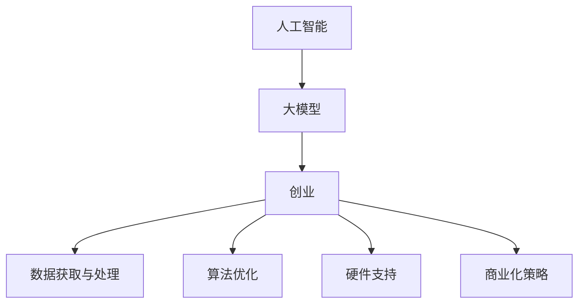

                 

# AI 大模型创业：如何利用创新优势？

> 关键词：人工智能，大模型创业，创新优势，深度学习，自然语言处理

## 1. 背景介绍

### 1.1 问题由来

近年来，人工智能（AI）大模型在各行各业的应用日益广泛，推动了AI技术的发展和落地。然而，在快速发展的浪潮中，如何利用AI大模型的创新优势，实现创业成功，是众多AI创业者面临的挑战。

大模型通常是指基于大规模数据训练得到的深度神经网络模型，如BERT、GPT-3等。这些模型在自然语言处理（NLP）、计算机视觉、语音识别等领域展现了卓越的性能。但大模型也面临着数据、算法、硬件等方面的挑战，以及如何将其商业化、实现商业价值的问题。

### 1.2 问题核心关键点

大模型创业的核心在于如何利用其强大的能力和创新的优势，构建具有市场竞争力的产品和服务。以下是几个关键点：

- **数据获取与处理**：大模型需要大量的高质量数据进行训练，数据的获取和处理是创业初期的一大挑战。
- **算法优化**：在大模型上实现高效的算法和模型优化，提升模型的性能和推理速度。
- **硬件支持**：大模型通常需要高性能计算资源，如何获取和利用硬件资源是实现商业化的关键。
- **商业化策略**：如何将大模型的技术优势转化为具有市场竞争力的产品和服务。

## 2. 核心概念与联系

### 2.1 核心概念概述

- **人工智能**：利用计算机模拟人类智能活动的科学和技术，涵盖机器学习、深度学习、自然语言处理等多个领域。
- **大模型**：基于大规模数据训练的深度神经网络模型，如BERT、GPT-3等，具有强大的语言理解、生成、推理能力。
- **创业**：通过创新和商业化的方式，将技术产品或服务推向市场，实现商业价值。
- **创新优势**：利用大模型的技术优势，开发具有独特竞争力的产品和服务。

这些核心概念之间的逻辑关系可以通过以下Mermaid流程图来展示：



## 3. 核心算法原理 & 具体操作步骤

### 3.1 算法原理概述

大模型创业的算法原理基于深度学习和迁移学习的思想。通过在大规模数据上进行预训练，学习通用的语言、视觉、声音等知识，然后通过微调（fine-tuning）等方式适应特定任务，从而提升模型的性能。

预训练过程通常使用自监督学习任务，如语言模型、掩码语言模型等，学习输入和输出之间的映射关系。微调过程则是在特定任务上，利用小规模标注数据对预训练模型进行微调，使其能够更好地解决特定问题。

### 3.2 算法步骤详解

#### 3.2.1 数据准备

- **数据收集**：根据应用场景，收集并清洗数据集，确保数据质量。例如，在NLP任务中，收集标注好的文本数据。
- **数据预处理**：对数据进行分词、编码、归一化等处理，使其适应模型的输入格式。

#### 3.2.2 模型选择与初始化

- **模型选择**：选择合适的预训练模型，如BERT、GPT-3等，作为初始化参数。
- **模型加载**：使用深度学习框架（如PyTorch、TensorFlow）加载预训练模型。

#### 3.2.3 微调

- **任务适配层设计**：根据任务类型，设计适当的输出层和损失函数。例如，在分类任务中，添加全连接层和交叉熵损失函数。
- **训练**：使用梯度下降等优化算法，对模型进行微调。
- **验证与测试**：在验证集上评估模型性能，调整超参数，确保模型泛化能力。

#### 3.2.4 商业化

- **产品开发**：将微调后的模型封装为API、SDK等形式，提供给第三方开发者使用。
- **用户反馈**：收集用户反馈，不断改进模型和服务。

### 3.3 算法优缺点

#### 3.3.1 优点

- **高效利用数据**：通过大规模数据预训练，模型能够高效利用数据，提升性能。
- **迁移学习能力**：预训练模型具有广泛的迁移学习能力，可以适应多种任务。
- **算法优化空间大**：深度学习和迁移学习提供了广泛的算法优化空间，可以根据具体任务进行优化。

#### 3.3.2 缺点

- **数据依赖**：需要大量的高质量数据进行预训练，数据获取和处理成本高。
- **计算资源需求大**：大模型需要高性能计算资源，硬件支持成本高。
- **模型复杂度高**：大模型结构复杂，调试和优化难度大。

### 3.4 算法应用领域

大模型创业在多个领域具有广泛的应用前景：

- **自然语言处理（NLP）**：文本分类、情感分析、机器翻译、对话系统等。
- **计算机视觉（CV）**：图像分类、目标检测、图像生成等。
- **语音识别**：语音识别、语音合成、语音翻译等。
- **医疗健康**：医学影像分析、病历处理、智能问诊等。
- **金融科技**：信用评估、交易分析、风险控制等。

## 4. 数学模型和公式 & 详细讲解 & 举例说明

### 4.1 数学模型构建

大模型的训练通常使用自监督学习任务，如语言模型、掩码语言模型等。以BERT为例，其训练目标函数为：

$$
\mathcal{L} = -\sum_{i=1}^N \log p(y_i|x_i)
$$

其中，$x_i$ 表示输入的文本，$y_i$ 表示文本对应的标签。训练过程通过最大化似然函数，使得模型输出概率接近真实标签。

### 4.2 公式推导过程

以BERT为例，其模型结构包括Transformer编码器和全连接输出层。在自监督学习任务中，使用掩码语言模型（MLM）进行训练。MLM任务的目标是预测被遮盖的单词，例如：

$$
\hat{y}_i = M_{\theta}(x_i)
$$

其中，$M_{\theta}$ 表示BERT模型，$\theta$ 表示模型参数。

在微调过程中，我们使用有监督学习任务进行训练。例如，在分类任务中，使用交叉熵损失函数：

$$
\mathcal{L} = -\frac{1}{N}\sum_{i=1}^N \sum_{j=1}^C y_j \log p(y_j|x_i)
$$

其中，$y_j$ 表示真实标签，$C$ 表示类别数。

### 4.3 案例分析与讲解

以GPT-3为例，其模型结构和训练过程如下：

- **模型结构**：GPT-3采用Transformer结构，包括编码器和解码器。
- **预训练任务**：使用语言模型任务，训练模型生成连贯的文本。
- **微调过程**：在特定任务上，使用少量标注数据进行微调，例如在情感分析任务上，训练模型预测文本情感。

## 5. 项目实践：代码实例和详细解释说明

### 5.1 开发环境搭建

- **环境安装**：安装Python、PyTorch、TensorFlow等深度学习框架。
- **库安装**：安装BERT、GPT等预训练模型库。
- **数据准备**：准备训练数据和验证数据，进行数据预处理。

### 5.2 源代码详细实现

#### 5.2.1 数据准备

```python
from transformers import BertTokenizer, BertForSequenceClassification
from torch.utils.data import Dataset, DataLoader
import torch
import numpy as np

class MyDataset(Dataset):
    def __init__(self, texts, labels):
        self.texts = texts
        self.labels = labels
        self.tokenizer = BertTokenizer.from_pretrained('bert-base-uncased')
        
    def __len__(self):
        return len(self.texts)
    
    def __getitem__(self, idx):
        text = self.texts[idx]
        label = self.labels[idx]
        
        encoding = self.tokenizer(text, truncation=True, padding='max_length')
        input_ids = encoding['input_ids']
        attention_mask = encoding['attention_mask']
        label = torch.tensor(label, dtype=torch.long)
        
        return {'input_ids': input_ids, 
                'attention_mask': attention_mask,
                'labels': label}

# 加载数据集
train_dataset = MyDataset(train_texts, train_labels)
dev_dataset = MyDataset(dev_texts, dev_labels)

# 分割数据集
train_loader = DataLoader(train_dataset, batch_size=32, shuffle=True)
dev_loader = DataLoader(dev_dataset, batch_size=32)
```

#### 5.2.2 模型加载与微调

```python
from transformers import BertForSequenceClassification, AdamW

model = BertForSequenceClassification.from_pretrained('bert-base-uncased', num_labels=2)
model.to(device)

# 设置超参数
learning_rate = 2e-5
epochs = 3
batch_size = 32
warmup_steps = 1000

# 加载优化器
optimizer = AdamW(model.parameters(), lr=learning_rate, eps=1e-8)

# 训练循环
for epoch in range(epochs):
    for batch in train_loader:
        input_ids = batch['input_ids'].to(device)
        attention_mask = batch['attention_mask'].to(device)
        labels = batch['labels'].to(device)
        
        # 前向传播
        outputs = model(input_ids, attention_mask=attention_mask, labels=labels)
        loss = outputs.loss
        
        # 反向传播和优化
        optimizer.zero_grad()
        loss.backward()
        optimizer.step()
        
    # 验证集评估
    with torch.no_grad():
        correct = 0
        total = 0
        for batch in dev_loader:
            input_ids = batch['input_ids'].to(device)
            attention_mask = batch['attention_mask'].to(device)
            labels = batch['labels'].to(device)
            
            outputs = model(input_ids, attention_mask=attention_mask)
            _, preds = torch.max(outputs, dim=1)
            total += labels.size(0)
            correct += (preds == labels).sum().item()
            
        print(f'Epoch {epoch+1}, accuracy: {correct/total:.3f}')
```

### 5.3 代码解读与分析

#### 5.3.1 数据准备

- **数据加载**：使用`BertTokenizer`对文本进行分词和编码，生成模型的输入格式。
- **数据预处理**：将输入和标签封装成PyTorch的Tensor对象，并进行GPU/TPU的传输。

#### 5.3.2 模型加载与微调

- **模型选择**：使用`BertForSequenceClassification`加载预训练的BERT模型，并进行分类任务的适配。
- **优化器选择**：使用`AdamW`优化器，设置学习率和warmup steps等超参数。
- **训练循环**：在每个epoch内，对训练集进行前向传播、反向传播和优化，并在验证集上评估模型性能。

## 6. 实际应用场景

### 6.1 自然语言处理（NLP）

- **情感分析**：在电商评论中，预测用户的情感倾向，用于产品质量评估和客户满意度分析。
- **机器翻译**：将不同语言的文本进行翻译，促进全球化交流。
- **对话系统**：构建智能客服、虚拟助手等对话系统，提升用户体验。

### 6.2 计算机视觉（CV）

- **图像分类**：对医学影像进行分类，辅助医生诊断。
- **目标检测**：在安防视频中检测异常行为，提升安全防范能力。
- **图像生成**：生成高质量的图像，应用于艺术、设计等领域。

### 6.3 语音识别

- **语音识别**：将语音转换成文本，用于智能家居、智能助理等领域。
- **语音合成**：将文本转换成语音，用于语音导航、电话客服等场景。

### 6.4 未来应用展望

未来，AI大模型创业将在更多领域展现其创新优势：

- **医疗健康**：通过图像、文本等多种数据，提升医疗诊断的准确性和效率。
- **金融科技**：利用自然语言处理和图像处理技术，提升金融风控和交易分析能力。
- **智能制造**：通过图像识别和语音识别技术，提升智能制造的自动化和智能化水平。

## 7. 工具和资源推荐

### 7.1 学习资源推荐

- **《深度学习》书籍**：Ian Goodfellow等著，全面介绍深度学习的基本理论和算法。
- **《TensorFlow实战》书籍**：何明科著，介绍TensorFlow的使用和深度学习实践。
- **《Transformers》论文**：Google团队发表的BERT论文，详细介绍了BERT模型的结构和训练方法。
- **HuggingFace官方文档**：提供丰富的预训练模型和微调样例，方便开发者使用。

### 7.2 开发工具推荐

- **PyTorch**：灵活的深度学习框架，支持动态图和静态图。
- **TensorFlow**：流行的深度学习框架，支持分布式计算和优化。
- **Transformers**：HuggingFace开发的NLP工具库，提供预训练模型和微调API。

### 7.3 相关论文推荐

- **《BERT: Pre-training of Deep Bidirectional Transformers for Language Understanding》**：Google团队发表的BERT论文，提出了预训练语言模型。
- **《GPT-3: Language Models are Unsupervised Multitask Learners》**：OpenAI团队发表的GPT-3论文，展示了大模型的强大零样本学习能力。
- **《Attention is All You Need》**：Google团队发表的Transformer论文，提出了自注意力机制，推动了NLP的发展。

## 8. 总结：未来发展趋势与挑战

### 8.1 总结

本文详细介绍了AI大模型创业的技术原理和操作步骤，通过具体的代码实例和案例分析，帮助读者全面了解大模型创业的核心要点。大模型在NLP、CV、语音识别等领域展现出卓越的性能，具有广阔的应用前景。

### 8.2 未来发展趋势

未来，AI大模型创业将继续在多个领域发挥其创新优势，推动技术进步和产业升级：

- **模型规模和性能**：大模型的规模和性能将持续提升，适应更多复杂的任务和应用场景。
- **算法优化**：新算法和新模型结构的出现，将进一步提升大模型的效率和效果。
- **多模态融合**：结合视觉、语音、文本等多种数据，实现更全面的理解和推理。

### 8.3 面临的挑战

尽管大模型创业前景广阔，但仍面临一些挑战：

- **数据获取**：如何获取高质量的数据，是大模型创业的瓶颈之一。
- **计算资源**：高性能计算资源的获取和维护成本较高，需合理规划。
- **模型复杂度**：大模型的结构复杂，调试和优化难度大，需持续改进。

### 8.4 研究展望

未来，AI大模型创业的研究方向包括：

- **无监督学习和半监督学习**：探索不依赖大量标注数据的微调方法。
- **多模态融合**：结合视觉、语音、文本等多种数据，实现更全面的理解和推理。
- **因果推断和因果学习**：增强模型对因果关系的理解和推理能力。

## 9. 附录：常见问题与解答

### 9.1 数据获取和处理

**Q1: 如何获取高质量的数据？**

A: 通过公开数据集、数据爬虫等方式获取数据，并进行数据清洗、标注和预处理。

### 9.2 模型选择与初始化

**Q2: 如何选择预训练模型？**

A: 根据任务类型和需求，选择适合的任务模型，如BERT、GPT等。

### 9.3 算法优化

**Q3: 如何进行算法优化？**

A: 使用不同的优化器、学习率调度策略、正则化等方法，提升模型性能。

### 9.4 商业化策略

**Q4: 如何实现商业化？**

A: 将模型封装成API、SDK等形式，提供给第三方开发者使用，并通过定价策略实现商业价值。

---

作者：禅与计算机程序设计艺术 / Zen and the Art of Computer Programming

