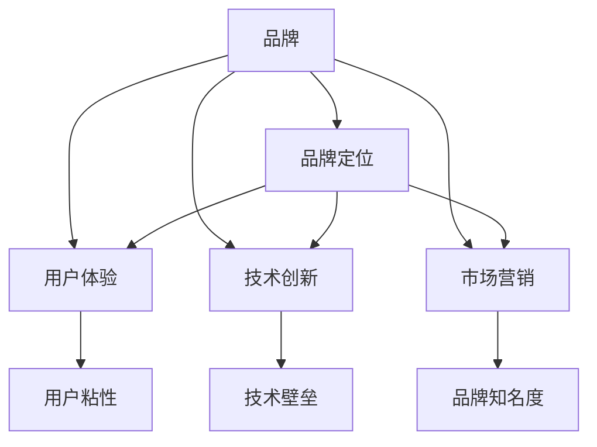

                 

# AI 大模型创业：如何利用品牌优势？

## 1. 背景介绍

### 1.1 问题由来
近年来，随着AI技术的迅猛发展，尤其是大模型的涌现，越来越多的企业看到了AI带来的巨大商业价值。然而，在AI创业的道路上，如何利用品牌优势，打造具有竞争力的AI品牌，成为企业需要深入思考的问题。

### 1.2 问题核心关键点
品牌作为企业的重要资产，是影响用户决策的重要因素。在AI大模型创业中，如何有效地利用品牌优势，塑造企业形象，构建品牌信任，成为关键。这不仅仅是一个市场推广问题，更涉及到品牌定位、用户体验、技术创新等多方面因素。

## 2. 核心概念与联系

### 2.1 核心概念概述

为更好地理解如何利用品牌优势进行AI大模型创业，本节将介绍几个密切相关的核心概念：

- **品牌(Brand)**：品牌是指企业的整体形象和市场声誉，通过产品、服务、技术等多种方式构建。在AI大模型创业中，品牌形象不仅包括技术实力，还包括企业文化、用户口碑等。

- **品牌定位(Brand Positioning)**：品牌定位是指企业确定自身在市场中的位置和竞争策略。对于AI大模型企业，品牌定位应聚焦于技术优势、应用场景、创新能力等方面。

- **用户体验(User Experience, UX)**：用户体验是指用户与产品或服务互动的过程和感受。在AI大模型创业中，良好的用户体验能够提升用户粘性，增加品牌价值。

- **技术创新(Technological Innovation)**：技术创新是指企业在技术研发上的投入和创新能力。在AI大模型创业中，技术创新是提升品牌竞争力的重要手段。

- **市场营销(Market Marketing)**：市场营销是指企业通过各种方式推广产品和服务，提升品牌知名度和市场份额。在AI大模型创业中，市场营销是品牌建设的重要环节。

这些核心概念之间的逻辑关系可以通过以下Mermaid流程图来展示：



这个流程图展示了几大核心概念及其之间的关系：

1. 品牌是企业综合形象的体现。
2. 品牌定位决定了企业在市场中的竞争策略。
3. 用户体验直接影响用户粘性。
4. 技术创新构建技术壁垒。
5. 市场营销提升品牌知名度。
6. 良好的品牌定位、用户体验、技术创新和市场营销互相促进，共同提升品牌价值。

## 3. 核心算法原理 & 具体操作步骤
### 3.1 算法原理概述

在AI大模型创业中，利用品牌优势的关键在于构建一个完整、可持续的策略框架，涵盖品牌定位、用户体验、技术创新和市场营销等多个方面。

### 3.2 算法步骤详解

**Step 1: 明确品牌定位**
- 确定企业的核心竞争力：在AI大模型领域，技术实力、数据优势、算法创新等是核心竞争力。
- 确定目标市场：AI大模型应用广泛，确定企业要服务的具体行业和应用场景。
- 确定差异化策略：通过技术创新和独特应用，形成与竞争对手的差异化。

**Step 2: 提升用户体验**
- 打造易用性：设计简洁直观的用户界面，降低使用门槛。
- 提供个性化服务：通过AI技术实现个性化推荐、搜索等，提升用户体验。
- 加强用户支持：提供及时、专业的技术支持和客户服务，增加用户满意度。

**Step 3: 进行技术创新**
- 投入研发：加大在AI大模型技术上的研发投入，持续推出创新技术。
- 合作共赢：与高校、研究机构合作，共享研究成果，提升技术竞争力。
- 开放生态：开源技术、算法、数据等，建立合作伙伴关系，构建开放生态。

**Step 4: 实施市场营销**
- 内容营销：通过技术博客、白皮书、案例分享等方式，展示技术实力和应用案例。
- 社区建设：建立线上线下社区，聚集用户和技术专家，提升品牌影响力。
- 媒体合作：与知名媒体、行业协会合作，提升品牌知名度。

### 3.3 算法优缺点

**优点：**
1. 提升品牌知名度：通过技术创新和市场营销，可以迅速提升品牌知名度，吸引用户关注。
2. 增强用户粘性：良好的用户体验和技术创新可以增强用户粘性，提高用户忠诚度。
3. 建立技术壁垒：技术创新和差异化策略可以有效构建技术壁垒，提升竞争力。

**缺点：**
1. 高投入风险：技术研发和市场营销需要大量投入，风险较高。
2. 用户期望管理：品牌一旦建立，用户期望值会提升，对产品的要求也会更高。
3. 市场竞争激烈：AI大模型领域竞争激烈，品牌建设需要不断创新和优化。

### 3.4 算法应用领域

AI大模型在各个行业都有广泛的应用，如金融、医疗、教育、智能制造等。品牌优势在这些领域可以发挥重要作用：

- **金融领域**：AI大模型可以用于风险控制、智能投顾、反欺诈等，品牌优势可以提升用户信任，增加市场份额。
- **医疗领域**：AI大模型可以用于疾病诊断、药物研发、患者管理等，品牌优势可以提升医疗机构的科技形象，吸引更多合作。
- **教育领域**：AI大模型可以用于个性化教育、智能辅导、作业批改等，品牌优势可以提升教育机构的教学质量，增加家长和学生的认可度。
- **智能制造领域**：AI大模型可以用于生产优化、设备维护、质量控制等，品牌优势可以提升企业的智能化水平，提高市场竞争力。

## 4. 数学模型和公式 & 详细讲解 & 举例说明

### 4.1 数学模型构建

在AI大模型创业中，品牌优势的构建需要综合考虑多个因素，可以通过构建多目标优化模型来系统化评估和提升。

设品牌价值函数为 $V(B)$，用户体验函数为 $U(X)$，技术创新函数为 $T(I)$，市场营销函数为 $M(M)$，则多目标优化模型为：

$$
\max_{B,X,I,M} V(B) + \alpha U(X) + \beta T(I) + \gamma M(M)
$$

其中，$V(B)$、$U(X)$、$T(I)$、$M(M)$ 分别代表品牌价值、用户体验、技术创新和市场营销的优化目标，$\alpha$、$\beta$、$\gamma$ 为权重系数，用于平衡各目标的重要性。

### 4.2 公式推导过程

设品牌价值函数 $V(B)$ 为：

$$
V(B) = V_0 + V_1\cdot B_1 + V_2\cdot B_2 + ... + V_n\cdot B_n
$$

其中，$B_1$、$B_2$、...、$B_n$ 代表品牌定位、用户口碑、技术成果等各个维度的表现，$V_1$、$V_2$、...、$V_n$ 为对应的权重系数。

用户体验函数 $U(X)$ 为：

$$
U(X) = U_0 + U_1\cdot X_1 + U_2\cdot X_2 + ... + U_m\cdot X_m
$$

其中，$X_1$、$X_2$、...、$X_m$ 代表易用性、个性化服务、用户支持等用户体验维度的表现，$U_1$、$U_2$、...、$U_m$ 为对应的权重系数。

技术创新函数 $T(I)$ 为：

$$
T(I) = T_0 + T_1\cdot I_1 + T_2\cdot I_2 + ... + T_k\cdot I_k
$$

其中，$I_1$、$I_2$、...、$I_k$ 代表技术创新、合作共赢、开放生态等技术创新的维度的表现，$T_1$、$T_2$、...、$T_k$ 为对应的权重系数。

市场营销函数 $M(M)$ 为：

$$
M(M) = M_0 + M_1\cdot M_1 + M_2\cdot M_2 + ... + M_l\cdot M_l
$$

其中，$M_1$、$M_2$、...、$M_l$ 代表内容营销、社区建设、媒体合作等市场营销维度的表现，$M_1$、$M_2$、...、$M_l$ 为对应的权重系数。

### 4.3 案例分析与讲解

以某智能医疗企业为例，其品牌价值函数 $V(B)$ 可以表示为：

$$
V(B) = V_0 + V_1\cdot B_1 + V_2\cdot B_2 + V_3\cdot B_3
$$

其中，$B_1$ 代表品牌在医疗领域的定位，$B_2$ 代表品牌的患者口碑，$B_3$ 代表品牌的医疗研究成果。假设权重系数为 $V_1=0.4$、$V_2=0.3$、$V_3=0.3$。

用户体验函数 $U(X)$ 可以表示为：

$$
U(X) = U_0 + U_1\cdot X_1 + U_2\cdot X_2 + U_3\cdot X_3
$$

其中，$X_1$ 代表智能诊断系统的易用性，$X_2$ 代表个性化医疗服务的质量，$X_3$ 代表用户技术支持的响应速度。假设权重系数为 $U_1=0.2$、$U_2=0.5$、$U_3=0.3$。

技术创新函数 $T(I)$ 可以表示为：

$$
T(I) = T_0 + T_1\cdot I_1 + T_2\cdot I_2 + T_3\cdot I_3
$$

其中，$I_1$ 代表在AI大模型技术上的研发投入，$I_2$ 代表与知名医疗机构合作的成果，$I_3$ 代表开源技术的贡献。假设权重系数为 $T_1=0.3$、$T_2=0.4$、$T_3=0.3$。

市场营销函数 $M(M)$ 可以表示为：

$$
M(M) = M_0 + M_1\cdot M_1 + M_2\cdot M_2 + M_3\cdot M_3
$$

其中，$M_1$ 代表技术博客的浏览量，$M_2$ 代表线上社区的活跃度，$M_3$ 代表媒体报道的频次。假设权重系数为 $M_1=0.3$、$M_2=0.4$、$M_3=0.3$。

## 5. 项目实践：代码实例和详细解释说明

### 5.1 开发环境搭建

在进行AI大模型创业实践前，我们需要准备好开发环境。以下是使用Python进行PyTorch开发的环境配置流程：

1. 安装Anaconda：从官网下载并安装Anaconda，用于创建独立的Python环境。

2. 创建并激活虚拟环境：
```bash
conda create -n pytorch-env python=3.8 
conda activate pytorch-env
```

3. 安装PyTorch：根据CUDA版本，从官网获取对应的安装命令。例如：
```bash
conda install pytorch torchvision torchaudio cudatoolkit=11.1 -c pytorch -c conda-forge
```

4. 安装Transformers库：
```bash
pip install transformers
```

5. 安装各类工具包：
```bash
pip install numpy pandas scikit-learn matplotlib tqdm jupyter notebook ipython
```

完成上述步骤后，即可在`pytorch-env`环境中开始AI大模型创业实践。

### 5.2 源代码详细实现

这里我们以一个智能医疗诊断系统的开发为例，给出使用Transformers库对BERT模型进行微调的PyTorch代码实现。

首先，定义医疗诊断任务的数据处理函数：

```python
from transformers import BertTokenizer
from torch.utils.data import Dataset
import torch

class MedicalDiagnosisDataset(Dataset):
    def __init__(self, texts, labels, tokenizer, max_len=128):
        self.texts = texts
        self.labels = labels
        self.tokenizer = tokenizer
        self.max_len = max_len
        
    def __len__(self):
        return len(self.texts)
    
    def __getitem__(self, item):
        text = self.texts[item]
        label = self.labels[item]
        
        encoding = self.tokenizer(text, return_tensors='pt', max_length=self.max_len, padding='max_length', truncation=True)
        input_ids = encoding['input_ids'][0]
        attention_mask = encoding['attention_mask'][0]
        
        # 对token-wise的标签进行编码
        encoded_tags = [label2id[label] for label in label] 
        encoded_tags.extend([label2id['O']] * (self.max_len - len(encoded_tags)))
        labels = torch.tensor(encoded_tags, dtype=torch.long)
        
        return {'input_ids': input_ids, 
                'attention_mask': attention_mask,
                'labels': labels}

# 标签与id的映射
label2id = {'O': 0, 'Disease1': 1, 'Disease2': 2, 'Disease3': 3}
id2label = {v: k for k, v in label2id.items()}

# 创建dataset
tokenizer = BertTokenizer.from_pretrained('bert-base-cased')

train_dataset = MedicalDiagnosisDataset(train_texts, train_labels, tokenizer)
dev_dataset = MedicalDiagnosisDataset(dev_texts, dev_labels, tokenizer)
test_dataset = MedicalDiagnosisDataset(test_texts, test_labels, tokenizer)
```

然后，定义模型和优化器：

```python
from transformers import BertForTokenClassification, AdamW

model = BertForTokenClassification.from_pretrained('bert-base-cased', num_labels=len(label2id))

optimizer = AdamW(model.parameters(), lr=2e-5)
```

接着，定义训练和评估函数：

```python
from torch.utils.data import DataLoader
from tqdm import tqdm
from sklearn.metrics import classification_report

device = torch.device('cuda') if torch.cuda.is_available() else torch.device('cpu')
model.to(device)

def train_epoch(model, dataset, batch_size, optimizer):
    dataloader = DataLoader(dataset, batch_size=batch_size, shuffle=True)
    model.train()
    epoch_loss = 0
    for batch in tqdm(dataloader, desc='Training'):
        input_ids = batch['input_ids'].to(device)
        attention_mask = batch['attention_mask'].to(device)
        labels = batch['labels'].to(device)
        model.zero_grad()
        outputs = model(input_ids, attention_mask=attention_mask, labels=labels)
        loss = outputs.loss
        epoch_loss += loss.item()
        loss.backward()
        optimizer.step()
    return epoch_loss / len(dataloader)

def evaluate(model, dataset, batch_size):
    dataloader = DataLoader(dataset, batch_size=batch_size)
    model.eval()
    preds, labels = [], []
    with torch.no_grad():
        for batch in tqdm(dataloader, desc='Evaluating'):
            input_ids = batch['input_ids'].to(device)
            attention_mask = batch['attention_mask'].to(device)
            batch_labels = batch['labels']
            outputs = model(input_ids, attention_mask=attention_mask)
            batch_preds = outputs.logits.argmax(dim=2).to('cpu').tolist()
            batch_labels = batch_labels.to('cpu').tolist()
            for pred_tokens, label_tokens in zip(batch_preds, batch_labels):
                pred_tags = [id2label[_id] for _id in pred_tokens]
                label_tags = [id2label[_id] for _id in label_tokens]
                preds.append(pred_tags[:len(label_tokens)])
                labels.append(label_tags)
                
    print(classification_report(labels, preds))
```

最后，启动训练流程并在测试集上评估：

```python
epochs = 5
batch_size = 16

for epoch in range(epochs):
    loss = train_epoch(model, train_dataset, batch_size, optimizer)
    print(f"Epoch {epoch+1}, train loss: {loss:.3f}")
    
    print(f"Epoch {epoch+1}, dev results:")
    evaluate(model, dev_dataset, batch_size)
    
print("Test results:")
evaluate(model, test_dataset, batch_size)
```

以上就是使用PyTorch对BERT进行医疗诊断任务微调的完整代码实现。可以看到，得益于Transformers库的强大封装，我们可以用相对简洁的代码完成BERT模型的加载和微调。

### 5.3 代码解读与分析

让我们再详细解读一下关键代码的实现细节：

**MedicalDiagnosisDataset类**：
- `__init__`方法：初始化文本、标签、分词器等关键组件。
- `__len__`方法：返回数据集的样本数量。
- `__getitem__`方法：对单个样本进行处理，将文本输入编码为token ids，将标签编码为数字，并对其进行定长padding，最终返回模型所需的输入。

**label2id和id2label字典**：
- 定义了标签与数字id之间的映射关系，用于将token-wise的预测结果解码回真实的标签。

**训练和评估函数**：
- 使用PyTorch的DataLoader对数据集进行批次化加载，供模型训练和推理使用。
- 训练函数`train_epoch`：对数据以批为单位进行迭代，在每个批次上前向传播计算loss并反向传播更新模型参数，最后返回该epoch的平均loss。
- 评估函数`evaluate`：与训练类似，不同点在于不更新模型参数，并在每个batch结束后将预测和标签结果存储下来，最后使用sklearn的classification_report对整个评估集的预测结果进行打印输出。

**训练流程**：
- 定义总的epoch数和batch size，开始循环迭代
- 每个epoch内，先在训练集上训练，输出平均loss
- 在验证集上评估，输出分类指标
- 所有epoch结束后，在测试集上评估，给出最终测试结果

可以看到，PyTorch配合Transformers库使得BERT微调的代码实现变得简洁高效。开发者可以将更多精力放在数据处理、模型改进等高层逻辑上，而不必过多关注底层的实现细节。

当然，工业级的系统实现还需考虑更多因素，如模型的保存和部署、超参数的自动搜索、更灵活的任务适配层等。但核心的微调范式基本与此类似。

## 6. 实际应用场景
### 6.1 智能客服系统

基于AI大模型微调技术，智能客服系统可以自动化处理大量客户咨询，提供24/7不间断服务。在技术实现上，可以收集企业内部的历史客服对话记录，将问题和最佳答复构建成监督数据，在此基础上对预训练对话模型进行微调。微调后的对话模型能够自动理解用户意图，匹配最合适的答案模板进行回复。对于客户提出的新问题，还可以接入检索系统实时搜索相关内容，动态组织生成回答。如此构建的智能客服系统，能大幅提升客户咨询体验和问题解决效率。

### 6.2 金融舆情监测

金融机构需要实时监测市场舆论动向，以便及时应对负面信息传播，规避金融风险。传统的人工监测方式成本高、效率低，难以应对网络时代海量信息爆发的挑战。基于AI大模型微调技术的文本分类和情感分析技术，为金融舆情监测提供了新的解决方案。

具体而言，可以收集金融领域相关的新闻、报道、评论等文本数据，并对其进行主题标注和情感标注。在此基础上对预训练语言模型进行微调，使其能够自动判断文本属于何种主题，情感倾向是正面、中性还是负面。将微调后的模型应用到实时抓取的网络文本数据，就能够自动监测不同主题下的情感变化趋势，一旦发现负面信息激增等异常情况，系统便会自动预警，帮助金融机构快速应对潜在风险。

### 6.3 个性化推荐系统

当前的推荐系统往往只依赖用户的历史行为数据进行物品推荐，无法深入理解用户的真实兴趣偏好。基于AI大模型微调技术，个性化推荐系统可以更好地挖掘用户行为背后的语义信息，从而提供更精准、多样的推荐内容。

在实践中，可以收集用户浏览、点击、评论、分享等行为数据，提取和用户交互的物品标题、描述、标签等文本内容。将文本内容作为模型输入，用户的后续行为（如是否点击、购买等）作为监督信号，在此基础上微调预训练语言模型。微调后的模型能够从文本内容中准确把握用户的兴趣点。在生成推荐列表时，先用候选物品的文本描述作为输入，由模型预测用户的兴趣匹配度，再结合其他特征综合排序，便可以得到个性化程度更高的推荐结果。

### 6.4 未来应用展望

随着AI大模型微调技术的发展，其在各个领域的应用前景将更加广阔。未来，AI大模型将能够在更多领域中发挥重要作用，如智慧医疗、智能教育、智慧城市等，为各行各业带来新的变革和突破。

在智慧医疗领域，基于微调的诊断、治疗、健康管理等应用将提升医疗服务的智能化水平，辅助医生诊疗，加速新药开发进程。

在智能教育领域，微调技术可应用于作业批改、学情分析、知识推荐等方面，因材施教，促进教育公平，提高教学质量。

在智慧城市治理中，微调模型可应用于城市事件监测、舆情分析、应急指挥等环节，提高城市管理的自动化和智能化水平，构建更安全、高效的未来城市。

此外，在企业生产、社会治理、文娱传媒等众多领域，基于AI大模型微调的人工智能应用也将不断涌现，为经济社会发展注入新的动力。相信随着技术的日益成熟，AI大模型微调技术将成为各行业的重要工具，推动人工智能技术的进一步普及和应用。

## 7. 工具和资源推荐
### 7.1 学习资源推荐

为了帮助开发者系统掌握AI大模型微调的理论基础和实践技巧，这里推荐一些优质的学习资源：

1. 《深度学习框架PyTorch实战》系列博文：由PyTorch官方维护的博客，介绍了PyTorch的全面使用，包括模型构建、训练、评估等。

2. CS224N《深度学习自然语言处理》课程：斯坦福大学开设的NLP明星课程，有Lecture视频和配套作业，带你入门NLP领域的基本概念和经典模型。

3. 《自然语言处理综论》书籍：经典的自然语言处理教材，涵盖NLP的各个方面，包括基础概念、模型算法等。

4. Kaggle竞赛平台：Kaggle提供大量开源数据集和竞赛，通过参加竞赛，可以实践NLP技术，学习最新的研究进展。

5. 《Transformers从原理到实践》书籍：介绍Transformer的原理和应用，涵盖NLP任务的微调等前沿技术。

通过对这些资源的学习实践，相信你一定能够快速掌握AI大模型微调的精髓，并用于解决实际的NLP问题。
###  7.2 开发工具推荐

高效的开发离不开优秀的工具支持。以下是几款用于AI大模型微调开发的常用工具：

1. PyTorch：基于Python的开源深度学习框架，灵活动态的计算图，适合快速迭代研究。大部分预训练语言模型都有PyTorch版本的实现。

2. TensorFlow：由Google主导开发的开源深度学习框架，生产部署方便，适合大规模工程应用。同样有丰富的预训练语言模型资源。

3. Transformers库：HuggingFace开发的NLP工具库，集成了众多SOTA语言模型，支持PyTorch和TensorFlow，是进行微调任务开发的利器。

4. Weights & Biases：模型训练的实验跟踪工具，可以记录和可视化模型训练过程中的各项指标，方便对比和调优。与主流深度学习框架无缝集成。

5. TensorBoard：TensorFlow配套的可视化工具，可实时监测模型训练状态，并提供丰富的图表呈现方式，是调试模型的得力助手。

6. Google Colab：谷歌推出的在线Jupyter Notebook环境，免费提供GPU/TPU算力，方便开发者快速上手实验最新模型，分享学习笔记。

合理利用这些工具，可以显著提升AI大模型微调的开发效率，加快创新迭代的步伐。

### 7.3 相关论文推荐

AI大模型和微调技术的发展源于学界的持续研究。以下是几篇奠基性的相关论文，推荐阅读：

1. Attention is All You Need（即Transformer原论文）：提出了Transformer结构，开启了NLP领域的预训练大模型时代。

2. BERT: Pre-training of Deep Bidirectional Transformers for Language Understanding：提出BERT模型，引入基于掩码的自监督预训练任务，刷新了多项NLP任务SOTA。

3. Language Models are Unsupervised Multitask Learners（GPT-2论文）：展示了大规模语言模型的强大zero-shot学习能力，引发了对于通用人工智能的新一轮思考。

4. Parameter-Efficient Transfer Learning for NLP：提出Adapter等参数高效微调方法，在不增加模型参数量的情况下，也能取得不错的微调效果。

5. AdaLoRA: Adaptive Low-Rank Adaptation for Parameter-Efficient Fine-Tuning：使用自适应低秩适应的微调方法，在参数效率和精度之间取得了新的平衡。

6. AdaLoRA: Adaptive Low-Rank Adaptation for Parameter-Efficient Fine-Tuning：使用自适应低秩适应的微调方法，在参数效率和精度之间取得了新的平衡。

这些论文代表了大模型微调技术的发展脉络。通过学习这些前沿成果，可以帮助研究者把握学科前进方向，激发更多的创新灵感。

## 8. 总结：未来发展趋势与挑战

### 8.1 总结

本文对如何利用品牌优势进行AI大模型创业进行了全面系统的介绍。首先阐述了AI大模型创业的关键在于构建品牌优势，通过技术实力、用户体验、技术创新和市场营销等多方面协同，打造具有竞争力的AI品牌。其次，从原理到实践，详细讲解了如何构建品牌优势的具体策略和方法，并给出了实际的代码实现和案例分析。

通过本文的系统梳理，可以看到，AI大模型微调技术在各个行业都有广泛的应用前景，未来的发展潜力巨大。在品牌建设的过程中，企业需要综合考虑多个因素，制定全面的策略，持续投入资源，方能在激烈的市场竞争中脱颖而出。

### 8.2 未来发展趋势

展望未来，AI大模型创业将在以下几个方面取得突破：

1. 技术实力不断提升。伴随计算资源的不断丰富，AI大模型的参数量和规模将继续扩大，其理解和生成能力将进一步提升。

2. 用户体验持续优化。智能客服、个性化推荐等应用将不断优化，用户体验将显著提升。

3. 技术创新层出不穷。AI大模型在技术上的创新将更加活跃，推动NLP技术的不断进步。

4. 市场营销更加精准。基于数据分析和用户行为挖掘，市场营销将更加个性化和精准。

5. 应用场景日益丰富。AI大模型将在更多领域中发挥作用，推动各行业的智能化转型。

以上趋势凸显了AI大模型微调技术的广阔前景。这些方向的探索发展，必将进一步提升AI系统的性能和应用范围，为各行各业带来新的变革和突破。

### 8.3 面临的挑战

尽管AI大模型微调技术在各个行业都有广泛的应用，但在品牌建设的过程中，也面临着诸多挑战：

1. 高投入风险。AI大模型研发和市场营销需要大量投入，企业需要谨慎评估风险。

2. 用户期望管理。品牌一旦建立，用户期望值会提升，对产品的要求也会更高。

3. 技术创新压力。市场竞争激烈，企业需要持续投入技术研发，保持技术领先。

4. 市场营销难度。在激烈的市场环境中，如何精准投放广告，提升品牌知名度，仍是重要问题。

5. 用户体验挑战。尽管AI大模型提供了多种智能应用，但如何提升用户体验，让其真正获得用户的认可，仍需不断优化。

6. 数据安全和隐私保护。AI大模型涉及大量用户数据，如何保障数据安全和隐私保护，仍是重要问题。

正视AI大模型微调品牌建设所面临的这些挑战，积极应对并寻求突破，将是大模型微调走向成熟的必由之路。相信随着学界和产业界的共同努力，这些挑战终将一一被克服，AI大模型微调技术必将取得更大的突破。

### 8.4 研究展望

未来，AI大模型微调技术将在以下几个方面进行深入研究：

1. 模型压缩与优化。大模型参数量巨大，如何进行模型压缩和优化，提高推理效率，是重要研究方向。

2. 多模态融合。AI大模型如何与视觉、语音等模态信息融合，提升综合应用能力，是研究热点。

3. 知识图谱与多源数据融合。如何与知识图谱、多源数据等结合，提升模型泛化性和知识整合能力，是重要研究方向。

4. 自适应学习。如何使模型具备自适应能力，能够根据用户行为和数据分布变化进行动态调整，是前沿研究课题。

5. 伦理与社会责任。如何构建公平、透明、安全的AI大模型，避免偏见和歧视，是重要的伦理问题。

6. 跨领域应用。如何拓展AI大模型的应用场景，推动AI技术在更多行业中的落地应用，是研究的重要方向。

这些研究方向的探索，将进一步推动AI大模型微调技术的进步，为各行各业带来新的突破和变革。

## 9. 附录：常见问题与解答

**Q1：如何构建AI大模型的品牌优势？**

A: 构建AI大模型的品牌优势需要从多个方面入手：
1. 技术实力：不断投入研发，提升模型的性能和精度。
2. 用户体验：优化产品界面，提供个性化服务，提升用户体验。
3. 技术创新：通过技术突破和创新，构建技术壁垒。
4. 市场营销：通过内容营销、社区建设、媒体合作等手段，提升品牌知名度。

**Q2：AI大模型在落地应用时需要注意哪些问题？**

A: AI大模型在落地应用时需要注意以下问题：
1. 数据隐私：保障用户数据隐私，避免数据泄露和滥用。
2. 性能优化：提升模型推理效率，确保用户体验。
3. 技术透明：提高模型的可解释性，增强用户信任。
4. 安全防护：建立模型的安全机制，防止恶意攻击和滥用。

**Q3：AI大模型在医疗领域有哪些应用？**

A: AI大模型在医疗领域的应用包括：
1. 疾病诊断：利用深度学习模型进行疾病诊断，提升诊断准确率。
2. 个性化治疗：通过分析患者数据，提供个性化治疗方案。
3. 医疗管理：优化医疗资源配置，提升医疗管理效率。
4. 智能影像：利用图像识别技术，辅助医疗影像诊断。

**Q4：AI大模型在智能客服领域如何应用？**

A: AI大模型在智能客服领域的应用包括：
1. 自然语言理解：利用NLP技术，理解用户意图。
2. 自动回复：根据用户问题，生成自然流畅的回答。
3. 对话管理：管理对话流程，确保交互顺畅。
4. 知识库：构建知识库，提供即时查询。

**Q5：如何评估AI大模型的性能？**

A: 评估AI大模型的性能需要综合考虑多个指标：
1. 精度和召回率：用于分类任务的评估。
2. F1分数：用于文本生成和命名实体识别等任务的评估。
3. BLEU分数：用于机器翻译等任务的评估。
4. 运行效率：衡量模型推理速度和资源占用情况。

**Q6：AI大模型在金融领域的应用有哪些？**

A: AI大模型在金融领域的应用包括：
1. 风险控制：利用模型评估金融风险。
2. 智能投顾：提供个性化投资建议。
3. 反欺诈：利用模型检测金融欺诈行为。
4. 信用评估：基于用户数据，评估信用风险。

**Q7：AI大模型在智能制造领域的应用有哪些？**

A: AI大模型在智能制造领域的应用包括：
1. 生产优化：优化生产流程，提高生产效率。
2. 设备维护：通过预测性维护，减少设备故障率。
3. 质量控制：利用图像识别技术，检测产品质量。
4. 供应链管理：优化供应链，提升物流效率。

**Q8：AI大模型在教育领域的应用有哪些？**

A: AI大模型在教育领域的应用包括：
1. 作业批改：自动批改学生作业，减轻教师负担。
2. 智能辅导：提供个性化学习建议。
3. 学习推荐：根据学生学习情况，推荐学习资源。
4. 智能评估：评估学生学习效果，提供学习反馈。

**Q9：AI大模型在智慧城市治理中的应用有哪些？**

A: AI大模型在智慧城市治理中的应用包括：
1. 事件监测：实时监测城市事件，提高应急响应效率。
2. 舆情分析：分析市民舆情，提升城市管理水平。
3. 智能交通：优化交通管理，减少交通拥堵。
4. 环境监测：实时监测环境数据，提升城市环境质量。

通过这些问题的解答，可以帮助你更好地理解AI大模型微调技术的应用和品牌建设方法，为你的创业之路提供参考和指导。

---

作者：禅与计算机程序设计艺术 / Zen and the Art of Computer Programming

