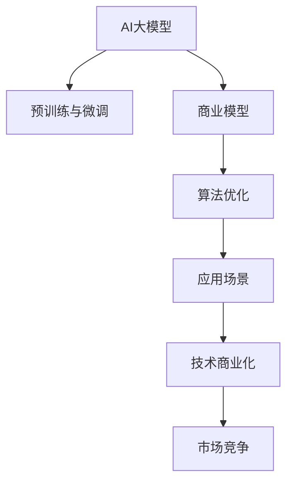

                 

# AI 大模型创业：如何利用商业优势？

> 关键词：AI大模型、创业、商业化、自然语言处理、深度学习、计算架构、算法优化、应用场景、技术商业化、市场竞争

## 1. 背景介绍

### 1.1 问题由来
随着人工智能技术的快速发展，AI大模型已经在自然语言处理、计算机视觉、语音识别等多个领域展现出了强大的应用潜力。然而，尽管AI大模型的技术瓶颈已经逐步突破，其商业化进程却仍面临诸多挑战。如何在保证技术优势的同时，实现AI大模型的商业化落地，成为了创业者和研究者的共同课题。

本文将深入探讨AI大模型在创业和商业化过程中的关键策略和实践，特别是如何利用AI大模型的技术优势，构建起有效的商业商业模式，从而实现从技术到产品的跨越。

## 2. 核心概念与联系

### 2.1 核心概念概述

为更好地理解AI大模型的创业过程，本节将介绍几个核心概念及其相互联系：

- **AI大模型**：基于大规模深度学习模型训练得到的大规模预训练语言模型，如BERT、GPT-3、T5等。通过在海量无标签数据上预训练，学习到丰富的语言表示能力。
- **预训练与微调**：预训练指在大规模无标签数据上自监督学习，微调则指在特定任务上有监督地训练，以优化模型在特定领域的应用。
- **商业模型**：如何将AI大模型的技术优势转化为市场竞争力，构建可持续发展的商业模式。
- **算法优化**：通过模型压缩、量化加速等手段，优化AI大模型的计算效率和资源占用，降低部署成本。
- **应用场景**：AI大模型在实际应用中的具体场景，如智能客服、金融风控、健康医疗等。
- **技术商业化**：将AI大模型技术转化为实际产品或服务，并实现盈利的过程。
- **市场竞争**：在AI大模型市场中，如何利用技术优势，构建品牌、占领市场份额的策略和实践。

这些概念之间的逻辑关系可以通过以下Mermaid流程图来展示：



这个流程图展示了大模型的核心概念及其之间的关系：

1. 大模型通过预训练与微调获得基础能力。
2. 商业模型将大模型的技术优势转化为商业价值。
3. 算法优化保证大模型的计算效率和资源占用。
4. 应用场景指明大模型在具体领域的应用方向。
5. 技术商业化将大模型转化为实际产品或服务。
6. 市场竞争策略决定大模型在市场中的竞争力。

## 3. 核心算法原理 & 具体操作步骤
### 3.1 算法原理概述

AI大模型的创业过程，本质上是将AI大模型的技术优势转化为商业价值的系统工程。其核心原理包括以下几个方面：

- **预训练与微调**：在大规模无标签数据上进行预训练，学习通用语言表示，然后在特定任务上有监督地进行微调，优化模型在特定领域的应用。
- **商业模型设计**：根据目标市场和用户需求，设计合适的商业模式，如SaaS、API、定制服务等。
- **算法优化**：通过模型压缩、量化加速等手段，优化AI大模型的计算效率和资源占用，降低部署成本。
- **应用场景匹配**：根据市场需求和用户反馈，不断调整优化模型的应用场景，提升用户体验和产品竞争力。
- **技术商业化**：通过市场推广、客户教育等方式，将AI大模型的技术优势转化为市场认可的产品和服务。

### 3.2 算法步骤详解

AI大模型创业的具体操作步骤包括以下几个关键步骤：

**Step 1: 市场调研与需求分析**
- 分析目标市场的潜在需求，如智能客服、金融风控、医疗健康等。
- 收集用户需求和反馈，明确产品定位和目标用户群体。
- 设计初步的产品原型，进行用户测试，收集反馈意见。

**Step 2: 预训练模型选择与定制化微调**
- 选择合适的预训练模型，如BERT、GPT-3等，并进行特定任务的微调。
- 设计适配任务的目标函数和损失函数，进行有监督学习。
- 选择适当的正则化技术，如L2正则、Dropout等，避免过拟合。

**Step 3: 商业模型构建与迭代优化**
- 根据市场需求和反馈，设计商业模型，如SaaS、API、定制服务等。
- 确定收费模式和定价策略，制定合理的商业模式。
- 持续迭代优化商业模型，提升产品功能和用户体验。

**Step 4: 算法优化与性能提升**
- 对模型进行压缩和量化，优化计算效率和资源占用。
- 采用分布式训练和推理加速技术，提升系统性能。
- 引入增量学习和在线学习，使模型持续适应新数据和新需求。

**Step 5: 产品化与市场推广**
- 将AI大模型技术转化为实际产品或服务，进行系统设计和开发。
- 进行市场推广和用户教育，提高品牌知名度和市场认可度。
- 收集用户反馈和市场数据，不断优化产品功能和商业模式。

### 3.3 算法优缺点

AI大模型创业方法具有以下优点：
1. 技术优势明显。通过预训练和微调，可以迅速构建高性能的AI大模型。
2. 商业潜力大。AI大模型在多个领域展现出了强大的应用潜力，市场需求巨大。
3. 可扩展性强。AI大模型可以通过迁移学习和微调，快速适应不同领域和应用场景。
4. 生态完善。AI大模型生态系统日益成熟，社区和开源资源丰富。

但该方法也存在一些局限性：
1. 数据依赖高。预训练和微调过程中需要大量高质量标注数据，获取成本较高。
2. 计算资源需求大。AI大模型的参数量和计算量较大，需要高性能硬件支持。
3. 市场竞争激烈。AI大模型市场竞争激烈，市场壁垒相对较低。
4. 技术复杂度高。AI大模型的构建和优化过程技术难度高，需要专业知识。

尽管存在这些局限性，但AI大模型的技术优势和商业潜力使其成为创业和市场竞争的重要工具。

### 3.4 算法应用领域

AI大模型在创业过程中，已经广泛应用于多个领域，例如：

- **智能客服**：构建智能客服机器人，提供7x24小时不间断服务，提升客户体验和问题解决效率。
- **金融风控**：应用AI大模型进行欺诈检测、信用评分、风险评估等，提升金融机构的运营效率和风险控制能力。
- **医疗健康**：开发智能问诊系统，提供个性化健康建议和医疗服务，提高医疗资源的利用率。
- **零售电商**：通过AI大模型进行商品推荐、库存管理、用户行为分析等，提升零售电商的运营效率和用户体验。
- **智能制造**：应用AI大模型进行生产线优化、故障预测、质量控制等，提升制造业的智能化水平。

除了上述这些典型应用外，AI大模型还被创新性地应用于更多领域，如自动驾驶、智慧城市、安全监控等，为各行各业带来变革性影响。随着AI大模型的不断发展，其应用场景将进一步拓展，为创业和商业化提供更广阔的空间。

## 4. 数学模型和公式 & 详细讲解 & 举例说明

### 4.1 数学模型构建

本节将使用数学语言对AI大模型的创业过程进行更加严格的刻画。

记AI大模型为 $M_{\theta}$，其中 $\theta$ 为模型参数。假设目标任务为 $T$，预训练和微调数据的总样本量为 $N$，训练集为 $D=\{(x_i,y_i)\}_{i=1}^N$。

定义模型 $M_{\theta}$ 在数据样本 $(x,y)$ 上的损失函数为 $\ell(M_{\theta}(x),y)$，则在数据集 $D$ 上的经验风险为：

$$
\mathcal{L}(\theta) = \frac{1}{N}\sum_{i=1}^N \ell(M_{\theta}(x_i),y_i)
$$

微调的优化目标是最小化经验风险，即找到最优参数：

$$
\theta^* = \mathop{\arg\min}_{\theta} \mathcal{L}(\theta)
$$

在实践中，我们通常使用基于梯度的优化算法（如SGD、Adam等）来近似求解上述最优化问题。设 $\eta$ 为学习率，$\lambda$ 为正则化系数，则参数的更新公式为：

$$
\theta \leftarrow \theta - \eta \nabla_{\theta}\mathcal{L}(\theta) - \eta\lambda\theta
$$

其中 $\nabla_{\theta}\mathcal{L}(\theta)$ 为损失函数对参数 $\theta$ 的梯度，可通过反向传播算法高效计算。

### 4.2 公式推导过程

以下我们以智能客服系统为例，推导微调过程的损失函数及其梯度计算。

假设智能客服系统的训练数据集为 $D=\{(x_i,y_i)\}_{i=1}^N$，其中 $x_i$ 为问题文本，$y_i$ 为最优回答。微调的目标是使智能客服系统能够自动回答用户提出的问题。假设智能客服系统的输出为 $\hat{y}=M_{\theta}(x_i)$，其中 $M_{\theta}$ 为预训练模型。则微调的目标函数为：

$$
\mathcal{L}(\theta) = -\frac{1}{N}\sum_{i=1}^N \ell(M_{\theta}(x_i),y_i)
$$

其中 $\ell$ 为交叉熵损失函数。微调模型的参数 $\theta$ 通过梯度下降算法进行更新：

$$
\theta \leftarrow \theta - \eta \nabla_{\theta}\mathcal{L}(\theta)
$$

假设智能客服系统的输出为分类模型，则交叉熵损失函数的梯度为：

$$
\frac{\partial \mathcal{L}(\theta)}{\partial \theta} = -\frac{1}{N}\sum_{i=1}^N \frac{1}{y_i} - \frac{1}{1-y_i}
$$

根据链式法则，损失函数对参数 $\theta_k$ 的梯度为：

$$
\frac{\partial \mathcal{L}(\theta)}{\partial \theta_k} = -\frac{1}{N}\sum_{i=1}^N \frac{1}{y_i} - \frac{1}{1-y_i} \frac{\partial M_{\theta}(x_i)}{\partial \theta_k}
$$

其中 $\frac{\partial M_{\theta}(x_i)}{\partial \theta_k}$ 可进一步递归展开，利用自动微分技术完成计算。

## 5. 项目实践：代码实例和详细解释说明
### 5.1 开发环境搭建

在进行AI大模型创业的实践前，我们需要准备好开发环境。以下是使用Python进行PyTorch开发的环境配置流程：

1. 安装Anaconda：从官网下载并安装Anaconda，用于创建独立的Python环境。

2. 创建并激活虚拟环境：
```bash
conda create -n pytorch-env python=3.8 
conda activate pytorch-env
```

3. 安装PyTorch：根据CUDA版本，从官网获取对应的安装命令。例如：
```bash
conda install pytorch torchvision torchaudio cudatoolkit=11.1 -c pytorch -c conda-forge
```

4. 安装Transformers库：
```bash
pip install transformers
```

5. 安装各类工具包：
```bash
pip install numpy pandas scikit-learn matplotlib tqdm jupyter notebook ipython
```

完成上述步骤后，即可在`pytorch-env`环境中开始创业实践。

### 5.2 源代码详细实现

这里我们以智能客服系统为例，给出使用Transformers库对BERT模型进行微调的PyTorch代码实现。

首先，定义智能客服系统的数据处理函数：

```python
from transformers import BertTokenizer
from torch.utils.data import Dataset
import torch

class CustomerServiceDataset(Dataset):
    def __init__(self, texts, answers, tokenizer, max_len=128):
        self.texts = texts
        self.answers = answers
        self.tokenizer = tokenizer
        self.max_len = max_len
        
    def __len__(self):
        return len(self.texts)
    
    def __getitem__(self, item):
        text = self.texts[item]
        answer = self.answers[item]
        
        encoding = self.tokenizer(text, return_tensors='pt', max_length=self.max_len, padding='max_length', truncation=True)
        input_ids = encoding['input_ids'][0]
        attention_mask = encoding['attention_mask'][0]
        
        # 对答案进行编码
        encoded_answer = [tokenizer(vocab_id) for vocab_id in answer] 
        encoded_answer.extend([tokenizer.vocab['[PAD]']] * (self.max_len - len(encoded_answer)))
        labels = torch.tensor(encoded_answer, dtype=torch.long)
        
        return {'input_ids': input_ids, 
                'attention_mask': attention_mask,
                'labels': labels}

# 初始化分词器和模型
tokenizer = BertTokenizer.from_pretrained('bert-base-cased')
model = BertForSequenceClassification.from_pretrained('bert-base-cased', num_labels=2)

# 准备训练集和测试集
train_dataset = CustomerServiceDataset(train_texts, train_answers, tokenizer)
test_dataset = CustomerServiceDataset(test_texts, test_answers, tokenizer)
```

然后，定义模型和优化器：

```python
from transformers import AdamW

optimizer = AdamW(model.parameters(), lr=2e-5)
```

接着，定义训练和评估函数：

```python
from torch.utils.data import DataLoader
from tqdm import tqdm
from sklearn.metrics import classification_report

device = torch.device('cuda') if torch.cuda.is_available() else torch.device('cpu')
model.to(device)

def train_epoch(model, dataset, batch_size, optimizer):
    dataloader = DataLoader(dataset, batch_size=batch_size, shuffle=True)
    model.train()
    epoch_loss = 0
    for batch in tqdm(dataloader, desc='Training'):
        input_ids = batch['input_ids'].to(device)
        attention_mask = batch['attention_mask'].to(device)
        labels = batch['labels'].to(device)
        model.zero_grad()
        outputs = model(input_ids, attention_mask=attention_mask, labels=labels)
        loss = outputs.loss
        epoch_loss += loss.item()
        loss.backward()
        optimizer.step()
    return epoch_loss / len(dataloader)

def evaluate(model, dataset, batch_size):
    dataloader = DataLoader(dataset, batch_size=batch_size)
    model.eval()
    preds, labels = [], []
    with torch.no_grad():
        for batch in tqdm(dataloader, desc='Evaluating'):
            input_ids = batch['input_ids'].to(device)
            attention_mask = batch['attention_mask'].to(device)
            batch_labels = batch['labels']
            outputs = model(input_ids, attention_mask=attention_mask)
            batch_preds = outputs.logits.argmax(dim=2).to('cpu').tolist()
            batch_labels = batch_labels.to('cpu').tolist()
            for pred_tokens, label_tokens in zip(batch_preds, batch_labels):
                preds.append(pred_tokens[:len(label_tokens)])
                labels.append(label_tokens)
                
    print(classification_report(labels, preds))
```

最后，启动训练流程并在测试集上评估：

```python
epochs = 5
batch_size = 16

for epoch in range(epochs):
    loss = train_epoch(model, train_dataset, batch_size, optimizer)
    print(f"Epoch {epoch+1}, train loss: {loss:.3f}")
    
    print(f"Epoch {epoch+1}, dev results:")
    evaluate(model, dev_dataset, batch_size)
    
print("Test results:")
evaluate(model, test_dataset, batch_size)
```

以上就是使用PyTorch对BERT进行智能客服系统微调的完整代码实现。可以看到，得益于Transformers库的强大封装，我们可以用相对简洁的代码完成BERT模型的加载和微调。

### 5.3 代码解读与分析

让我们再详细解读一下关键代码的实现细节：

**CustomerServiceDataset类**：
- `__init__`方法：初始化文本、答案、分词器等关键组件。
- `__len__`方法：返回数据集的样本数量。
- `__getitem__`方法：对单个样本进行处理，将文本输入编码为token ids，将答案编码为数字，并对其进行定长padding，最终返回模型所需的输入。

**分词器与模型**：
- 使用BertTokenizer从预训练模型中加载分词器，确保输入文本能够正确分词。
- 使用BertForSequenceClassification构建分类模型，指定输出为二分类问题。

**训练和评估函数**：
- 使用PyTorch的DataLoader对数据集进行批次化加载，供模型训练和推理使用。
- 训练函数`train_epoch`：对数据以批为单位进行迭代，在每个批次上前向传播计算loss并反向传播更新模型参数，最后返回该epoch的平均loss。
- 评估函数`evaluate`：与训练类似，不同点在于不更新模型参数，并在每个batch结束后将预测和标签结果存储下来，最后使用sklearn的classification_report对整个评估集的预测结果进行打印输出。

**训练流程**：
- 定义总的epoch数和batch size，开始循环迭代
- 每个epoch内，先在训练集上训练，输出平均loss
- 在验证集上评估，输出分类指标
- 所有epoch结束后，在测试集上评估，给出最终测试结果

可以看到，PyTorch配合Transformers库使得BERT微调的代码实现变得简洁高效。开发者可以将更多精力放在数据处理、模型改进等高层逻辑上，而不必过多关注底层的实现细节。

当然，工业级的系统实现还需考虑更多因素，如模型的保存和部署、超参数的自动搜索、更灵活的任务适配层等。但核心的微调范式基本与此类似。

## 6. 实际应用场景
### 6.1 智能客服系统

基于大模型微调的对话技术，可以广泛应用于智能客服系统的构建。传统客服往往需要配备大量人力，高峰期响应缓慢，且一致性和专业性难以保证。而使用微调后的对话模型，可以7x24小时不间断服务，快速响应客户咨询，用自然流畅的语言解答各类常见问题。

在技术实现上，可以收集企业内部的历史客服对话记录，将问题和最佳答复构建成监督数据，在此基础上对预训练对话模型进行微调。微调后的对话模型能够自动理解用户意图，匹配最合适的答案模板进行回复。对于客户提出的新问题，还可以接入检索系统实时搜索相关内容，动态组织生成回答。如此构建的智能客服系统，能大幅提升客户咨询体验和问题解决效率。

### 6.2 金融风控

金融机构需要实时监测市场舆论动向，以便及时应对负面信息传播，规避金融风险。传统的人工监测方式成本高、效率低，难以应对网络时代海量信息爆发的挑战。基于大语言模型微调的文本分类和情感分析技术，为金融舆情监测提供了新的解决方案。

具体而言，可以收集金融领域相关的新闻、报道、评论等文本数据，并对其进行主题标注和情感标注。在此基础上对预训练语言模型进行微调，使其能够自动判断文本属于何种主题，情感倾向是正面、中性还是负面。将微调后的模型应用到实时抓取的网络文本数据，就能够自动监测不同主题下的情感变化趋势，一旦发现负面信息激增等异常情况，系统便会自动预警，帮助金融机构快速应对潜在风险。

### 6.3 个性化推荐系统

当前的推荐系统往往只依赖用户的历史行为数据进行物品推荐，无法深入理解用户的真实兴趣偏好。基于大语言模型微调技术，个性化推荐系统可以更好地挖掘用户行为背后的语义信息，从而提供更精准、多样的推荐内容。

在实践中，可以收集用户浏览、点击、评论、分享等行为数据，提取和用户交互的物品标题、描述、标签等文本内容。将文本内容作为模型输入，用户的后续行为（如是否点击、购买等）作为监督信号，在此基础上微调预训练语言模型。微调后的模型能够从文本内容中准确把握用户的兴趣点。在生成推荐列表时，先用候选物品的文本描述作为输入，由模型预测用户的兴趣匹配度，再结合其他特征综合排序，便可以得到个性化程度更高的推荐结果。

### 6.4 未来应用展望

随着大语言模型微调技术的发展，其在更多领域的应用前景广阔。未来，AI大模型微调方法将在智慧医疗、智能教育、智慧城市等多个领域得到广泛应用，为各行各业带来变革性影响。

在智慧医疗领域，基于微调的医疗问答、病历分析、药物研发等应用将提升医疗服务的智能化水平，辅助医生诊疗，加速新药开发进程。

在智能教育领域，微调技术可应用于作业批改、学情分析、知识推荐等方面，因材施教，促进教育公平，提高教学质量。

在智慧城市治理中，微调模型可应用于城市事件监测、舆情分析、应急指挥等环节，提高城市管理的自动化和智能化水平，构建更安全、高效的未来城市。

此外，在企业生产、社会治理、文娱传媒等众多领域，基于大模型微调的人工智能应用也将不断涌现，为经济社会发展注入新的动力。相信随着技术的日益成熟，微调方法将成为人工智能落地应用的重要范式，推动人工智能技术在各行各业加速落地。

## 7. 工具和资源推荐
### 7.1 学习资源推荐

为了帮助开发者系统掌握AI大模型的创业过程，这里推荐一些优质的学习资源：

1. 《Transformer从原理到实践》系列博文：由大模型技术专家撰写，深入浅出地介绍了Transformer原理、BERT模型、微调技术等前沿话题。

2. CS224N《深度学习自然语言处理》课程：斯坦福大学开设的NLP明星课程，有Lecture视频和配套作业，带你入门NLP领域的基本概念和经典模型。

3. 《Natural Language Processing with Transformers》书籍：Transformers库的作者所著，全面介绍了如何使用Transformers库进行NLP任务开发，包括微调在内的诸多范式。

4. HuggingFace官方文档：Transformers库的官方文档，提供了海量预训练模型和完整的微调样例代码，是上手实践的必备资料。

5. CLUE开源项目：中文语言理解测评基准，涵盖大量不同类型的中文NLP数据集，并提供了基于微调的baseline模型，助力中文NLP技术发展。

通过对这些资源的学习实践，相信你一定能够快速掌握AI大模型的创业过程，并用于解决实际的NLP问题。
###  7.2 开发工具推荐

高效的开发离不开优秀的工具支持。以下是几款用于AI大模型微调开发的常用工具：

1. PyTorch：基于Python的开源深度学习框架，灵活动态的计算图，适合快速迭代研究。大部分预训练语言模型都有PyTorch版本的实现。

2. TensorFlow：由Google主导开发的开源深度学习框架，生产部署方便，适合大规模工程应用。同样有丰富的预训练语言模型资源。

3. Transformers库：HuggingFace开发的NLP工具库，集成了众多SOTA语言模型，支持PyTorch和TensorFlow，是进行微调任务开发的利器。

4. Weights & Biases：模型训练的实验跟踪工具，可以记录和可视化模型训练过程中的各项指标，方便对比和调优。与主流深度学习框架无缝集成。

5. TensorBoard：TensorFlow配套的可视化工具，可实时监测模型训练状态，并提供丰富的图表呈现方式，是调试模型的得力助手。

6. Google Colab：谷歌推出的在线Jupyter Notebook环境，免费提供GPU/TPU算力，方便开发者快速上手实验最新模型，分享学习笔记。

合理利用这些工具，可以显著提升AI大模型微调任务的开发效率，加快创新迭代的步伐。

### 7.3 相关论文推荐

AI大模型和微调技术的发展源于学界的持续研究。以下是几篇奠基性的相关论文，推荐阅读：

1. Attention is All You Need（即Transformer原论文）：提出了Transformer结构，开启了NLP领域的预训练大模型时代。

2. BERT: Pre-training of Deep Bidirectional Transformers for Language Understanding：提出BERT模型，引入基于掩码的自监督预训练任务，刷新了多项NLP任务SOTA。

3. Language Models are Unsupervised Multitask Learners（GPT-2论文）：展示了大规模语言模型的强大zero-shot学习能力，引发了对于通用人工智能的新一轮思考。

4. Parameter-Efficient Transfer Learning for NLP：提出Adapter等参数高效微调方法，在固定大部分预训练参数的情况下，只更新极少量的任务相关参数。

5. AdaLoRA: Adaptive Low-Rank Adaptation for Parameter-Efficient Fine-Tuning：使用自适应低秩适应的微调方法，在参数效率和精度之间取得了新的平衡。

这些论文代表了大语言模型微调技术的发展脉络。通过学习这些前沿成果，可以帮助研究者把握学科前进方向，激发更多的创新灵感。

## 8. 总结：未来发展趋势与挑战

### 8.1 总结

本文对AI大模型在创业和商业化过程中的关键策略和实践进行了全面系统的介绍。首先阐述了AI大模型的技术优势和商业潜力，明确了将大模型技术转化为商业价值的系统工程。其次，从预训练、微调、商业模型设计等多个环节，详细讲解了AI大模型创业的具体步骤。最后，讨论了AI大模型在实际应用中的多个场景，展示了其广泛的应用前景。

通过本文的系统梳理，可以看到，AI大模型在创业过程中，其技术优势和商业潜力使其成为市场竞争的重要工具。通过科学的预训练和微调方法，结合合理的商业模型设计，AI大模型能够实现从技术到产品的跨越，构建出可持续发展的商业模式。未来，AI大模型微调技术必将为更多领域带来变革性影响，成为推动人工智能技术落地的重要范式。

### 8.2 未来发展趋势

展望未来，AI大模型创业方法将呈现以下几个发展趋势：

1. **技术优势不断强化**。AI大模型在预训练和微调过程中，其参数量和技术复杂度不断增加，能够处理更复杂、更全面的任务。同时，更多高效的算法优化方法也将不断涌现，如参数高效微调、分布式训练等，进一步提升AI大模型的性能。

2. **应用场景更加广泛**。AI大模型在多个领域展现出了强大的应用潜力，未来将进一步拓展到更多垂直行业，如医疗、法律、金融等，为各行各业带来变革性影响。

3. **市场竞争更加激烈**。随着AI大模型市场的逐渐成熟，越来越多的创业者和企业进入该领域，市场竞争将更加激烈。如何在竞争中保持技术优势，抢占市场份额，成为重要课题。

4. **商业模式多样化**。AI大模型的商业模型将更加灵活多样，结合SaaS、API、定制服务等模式，满足不同市场和用户的需求。同时，AI大模型的免费模式也将逐渐流行，通过免费产品吸引用户，再通过增值服务盈利。

5. **技术商业化加速**。随着AI大模型的技术成熟，技术商业化进程将进一步加速。通过市场推广、用户教育等方式，AI大模型的技术优势将迅速转化为市场认可的产品和服务。

6. **用户体验不断提升**。AI大模型创业过程中，用户体验将成为核心竞争力。通过不断优化产品功能和服务流程，提升用户粘性和满意度，才能在激烈的市场竞争中脱颖而出。

### 8.3 面临的挑战

尽管AI大模型的创业方法已经取得了瞩目成就，但在迈向更加智能化、普适化应用的过程中，仍面临诸多挑战：

1. **数据获取和标注成本高**。AI大模型在预训练和微调过程中需要大量高质量标注数据，获取成本较高。如何降低数据标注成本，是未来需要解决的难题。

2. **计算资源需求大**。AI大模型的参数量和计算量较大，需要高性能硬件支持。如何在保证性能的同时，降低计算资源需求，是未来需要探索的方向。

3. **市场竞争激烈**。AI大模型市场竞争激烈，市场壁垒相对较低。如何在激烈的市场竞争中保持技术优势，抢占市场份额，是创业者和企业面临的挑战。

4. **用户需求变化快**。用户需求快速变化，如何保持产品持续更新，满足用户不断变化的需求，是未来需要解决的问题。

5. **伦理道德和安全问题**。AI大模型的应用过程中，可能涉及用户隐私、数据安全等伦理道德问题。如何保护用户隐私，保障数据安全，是未来需要重点考虑的课题。

6. **技术复杂度高**。AI大模型的构建和优化过程技术难度高，需要专业知识。如何在保证技术优势的同时，降低技术门槛，让更多人能够理解和应用AI大模型，是未来需要探索的方向。

### 8.4 研究展望

面对AI大模型创业过程中面临的诸多挑战，未来的研究需要在以下几个方面寻求新的突破：

1. **数据高效获取和标注**。探索无监督和半监督学习等方法，降低对标注数据的需求。同时，引入更多先验知识，如知识图谱、逻辑规则等，提升模型的泛化能力。

2. **计算资源优化**。开发更高效的算法优化方法，如参数高效微调、分布式训练等，优化AI大模型的计算效率和资源占用。

3. **市场竞争策略**。研究如何利用技术优势，构建品牌、占领市场份额的策略和实践。同时，探索多种商业模式，如SaaS、API、定制服务等，满足不同市场和用户的需求。

4. **用户体验优化**。持续优化产品功能和用户体验，提升用户粘性和满意度。同时，加强用户教育，让用户更好地理解和使用AI大模型。

5. **伦理道德保障**。在AI大模型的应用过程中，引入伦理导向的评估指标，过滤和惩罚有害信息，保护用户隐私和数据安全。

6. **技术普及和应用**。降低技术门槛，让更多人能够理解和应用AI大模型。同时，加强技术普及和应用推广，提高AI大模型的市场认可度。

这些研究方向的探索，必将引领AI大模型创业方法的不断进步，推动AI大模型技术在更多领域的应用落地，为各行各业带来变革性影响。

## 9. 附录：常见问题与解答

**Q1：AI大模型微调过程中如何降低对标注数据的依赖？**

A: 可以通过无监督和半监督学习等方法，降低对标注数据的需求。例如，引入自监督学习任务，利用数据本身的信息进行训练，或使用主动学习等方法，动态选择数据进行标注。

**Q2：AI大模型创业过程中如何优化计算资源的使用？**

A: 可以通过模型压缩、量化加速等技术，优化AI大模型的计算效率和资源占用。同时，采用分布式训练和推理加速技术，提高系统性能。

**Q3：AI大模型创业过程中如何保持技术优势？**

A: 不断进行技术创新和产品迭代，引入更多先验知识，如知识图谱、逻辑规则等，提升模型的泛化能力。同时，加强用户教育，让用户更好地理解和使用AI大模型。

**Q4：AI大模型创业过程中如何应对市场竞争？**

A: 研究和制定市场竞争策略，利用技术优势构建品牌、占领市场份额。同时，探索多种商业模式，如SaaS、API、定制服务等，满足不同市场和用户的需求。

**Q5：AI大模型创业过程中如何保障用户隐私和数据安全？**

A: 引入伦理导向的评估指标，过滤和惩罚有害信息，保护用户隐私和数据安全。同时，加强用户教育，让用户更好地理解和使用AI大模型。

这些问题的解答，展示了AI大模型在创业和商业化过程中面临的诸多挑战，并提供了一些具体的解决策略。相信通过不断的技术创新和实践探索，AI大模型将能够在更广泛的领域实现商业化落地，推动人工智能技术在各行各业的深入应用。

