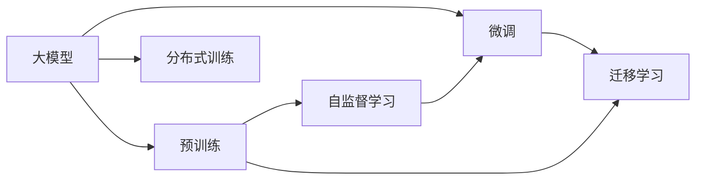

                 

## 1. 背景介绍

### 1.1 问题由来

近年来，随着人工智能技术的迅猛发展，AI大模型在自然语言处理、计算机视觉、推荐系统等领域展现出前所未有的潜力，成为了推动技术进步和经济增长的重要引擎。全球范围内，各大科技公司、初创企业纷纷投身于大模型的研发和商业化，希望通过智能技术的突破实现商业模式的创新和优化。然而，由于人工智能的复杂性和高度技术壁垒，大规模语言模型（如BERT、GPT-3等）的构建需要大量的数据、计算资源和专业知识，这一过程往往需要巨额的资金投入和长时间的技术积累。

大模型的国际优势成为众多创业者和企业关注的焦点。合理利用国际资源，尤其是算法、数据、技术人才等方面的优势，不仅能够显著降低创业成本，还能够提升技术创新速度和市场竞争力。那么，创业公司如何利用国际优势，在大模型领域取得突破？

### 1.2 问题核心关键点

为解答上述问题，本文将从多个角度探讨如何利用国际优势构建大模型，包括国际数据集获取、国际算法和工具的使用、国际技术人才的引进等。通过深入分析这些关键因素，揭示其对大模型创业的重要性和实施路径。

## 2. 核心概念与联系

### 2.1 核心概念概述

在探讨如何利用国际优势构建大模型的过程中，我们需要理解以下核心概念：

- **大模型（Large Models）**：指由数十亿甚至上百亿参数组成的深度学习模型，如BERT、GPT系列等，具有极高的复杂性和计算需求。
- **预训练（Pre-training）**：在大规模无标签数据上，通过自监督学习任务训练通用模型，形成高质量的初始化参数。
- **微调（Fine-tuning）**：在大规模预训练模型的基础上，使用小规模标注数据进行特定任务的优化，提升模型在目标任务上的性能。
- **迁移学习（Transfer Learning）**：将一个领域学到的知识迁移到另一个相关领域，实现跨任务和跨领域的知识共享。
- **自监督学习（Self-supervised Learning）**：在无标签数据上通过设计预训练任务，自动生成监督信号，学习通用的特征表示。
- **分布式训练（Distributed Training）**：通过多台计算机协同工作，加速大规模模型的训练，提高训练效率和资源利用率。

### 2.2 核心概念原理和架构的 Mermaid 流程图



上述流程图展示了大模型构建的核心步骤及其相互关系：

- 大模型 **A** 通过 **B** 预训练和 **E** 自监督学习获取基础特征表示。
- 在特定任务上，大模型通过 **C** 微调进行任务适配，提升模型性能。
- **D** 迁移学习和大模型的 **B** 预训练相辅相成，增强模型的跨领域泛化能力。
- **F** 分布式训练通过并行计算加速模型的训练过程。

这些概念相互配合，共同构建了高质量大模型的训练流程。

## 3. 核心算法原理 & 具体操作步骤

### 3.1 算法原理概述

大模型的构建和优化基于深度学习框架和算法，其核心思想是通过大规模无标签数据的预训练，学习通用的特征表示，再通过特定任务的微调，提升模型在该任务上的性能。这种范式在大模型创业中尤为重要，可以帮助企业快速构建高性能的智能系统，并在有限的时间内实现技术突破。

### 3.2 算法步骤详解

1. **数据获取与准备**：
   - 收集和清洗大规模无标签数据，如文本、图像等，用于预训练。
   - 确定目标任务，准备小规模标注数据，用于微调。

2. **模型选择与搭建**：
   - 选择合适的预训练模型作为初始化参数，如BERT、GPT等。
   - 在模型上搭建任务适配层，如分类器、解码器等，用于特定任务的处理。

3. **预训练与微调**：
   - 在分布式计算集群上进行预训练，学习通用的特征表示。
   - 使用小规模标注数据对模型进行微调，提升模型在特定任务上的性能。

4. **评估与优化**：
   - 在验证集上评估模型性能，根据指标调整微调参数。
   - 重复微调过程，直到达到预期性能。

5. **部署与维护**：
   - 将训练好的模型部署到实际应用中，进行性能监控和优化。
   - 根据新数据和新任务，定期重新微调模型，保持模型性能。

### 3.3 算法优缺点

**优点**：
- 利用大规模数据和计算资源，可以大幅提升模型的性能。
- 基于预训练-微调流程，可以快速适应新任务，提升模型泛化能力。
- 可以集成多领域的知识，提升模型的跨领域迁移能力。

**缺点**：
- 对计算资源和存储空间要求高，创业初期可能面临成本压力。
- 模型构建和优化复杂，需要专业知识和技术积累。
- 对标注数据的依赖性强，标注成本高。

### 3.4 算法应用领域

大模型的应用领域广泛，包括但不限于：

- **自然语言处理（NLP）**：机器翻译、文本分类、情感分析、问答系统等。
- **计算机视觉（CV）**：图像识别、目标检测、图像生成等。
- **推荐系统**：个性化推荐、广告投放优化等。
- **语音识别**：语音合成、语音识别、语音情感分析等。
- **医疗健康**：疾病诊断、医疗影像分析等。
- **金融科技**：风险评估、市场分析、客户服务自动化等。

## 4. 数学模型和公式 & 详细讲解 & 举例说明

### 4.1 数学模型构建

大模型的构建和优化过程涉及复杂的数学模型。以自然语言处理中的BERT模型为例，其核心数学模型包括：

- **自监督预训练目标**：如掩码语言模型（Masked Language Model, MLM）、下一句预测（Next Sentence Prediction, NSP）等。
- **任务适配层**：如线性分类器、解码器等。
- **损失函数**：如交叉熵损失、均方误差损失等。

### 4.2 公式推导过程

**掩码语言模型（MLM）**：

在BERT的预训练阶段，MLM目标定义如下：

$$
\text{MLM}_{i,j} = -\log p(x_j|x_i)
$$

其中，$x_i$ 和 $x_j$ 分别表示输入序列中的两个位置，$p(x_j|x_i)$ 表示在位置 $i$ 处，$x_i$ 预测 $x_j$ 的条件概率。该目标旨在通过掩码语言模型任务，学习输入序列中的隐含信息。

**交叉熵损失函数**：

在微调阶段，通常使用交叉熵损失函数进行模型训练：

$$
\text{CE}(y, \hat{y}) = -\sum_{i=1}^{N} y_i \log \hat{y}_i
$$

其中，$y$ 为真实标签，$\hat{y}$ 为模型预测的标签概率分布。该损失函数用于衡量模型预测输出与真实标签之间的差异。

### 4.3 案例分析与讲解

以BERT为例，其预训练和微调流程大致如下：

1. **预训练**：
   - 收集大规模无标签文本数据，如维基百科、新闻、书籍等。
   - 使用MLM和NSP目标进行预训练，学习通用的语言表示。
   - 通过多轮预训练，模型逐渐学习到丰富的语言知识，形成高质量的初始化参数。

2. **微调**：
   - 准备小规模标注数据，如情感分析的评论数据集。
   - 在BERT模型上搭建情感分析的任务适配层，如全连接层和线性分类器。
   - 使用标注数据进行微调，调整任务适配层的权重，提升模型在情感分析任务上的性能。

### 5. 项目实践：代码实例和详细解释说明

### 5.1 开发环境搭建

在大模型创业中，选择合适的开发环境至关重要。以下是一个基本的环境配置示例：

1. **安装Python**：
   - 在Ubuntu或Windows系统下，安装Python 3.7以上版本。

2. **安装PyTorch**：
   - 使用pip安装PyTorch，命令如下：
     ```
     pip install torch torchvision torchaudio
     ```

3. **安装HuggingFace Transformers库**：
   - 使用pip安装Transformers库，命令如下：
     ```
     pip install transformers
     ```

4. **安装其他依赖库**：
   - 安装必要的依赖库，如numpy、pandas、scikit-learn等。

### 5.2 源代码详细实现

以BERT模型为例，以下是微调情感分析任务的示例代码：

```python
from transformers import BertForSequenceClassification, BertTokenizer, AdamW
from transformers import Trainer, TrainingArguments
from sklearn.model_selection import train_test_split

# 加载数据
train_data, test_data = train_test_split(data, test_size=0.2, random_state=42)

# 初始化BERT模型和分词器
model = BertForSequenceClassification.from_pretrained('bert-base-uncased')
tokenizer = BertTokenizer.from_pretrained('bert-base-uncased')

# 定义训练参数
training_args = TrainingArguments(
    output_dir="./results",
    num_train_epochs=3,
    per_device_train_batch_size=16,
    per_device_eval_batch_size=64,
    warmup_steps=500,
    weight_decay=0.01,
    learning_rate=2e-5,
    evaluation_strategy='epoch',
)

# 训练模型
trainer = Trainer(
    model=model,
    args=training_args,
    train_dataset=train_data,
    eval_dataset=test_data,
)

trainer.train()
```

### 5.3 代码解读与分析

**预处理数据**：
- 使用sklearn的train_test_split函数，将数据集划分为训练集和测试集。
- 初始化BERT模型和分词器，准备进行微调。

**定义训练参数**：
- 设置训练目录、训练轮数、批次大小、学习率等参数。
- 使用AdamW优化器，并设置权重衰减和梯度累积策略。

**训练模型**：
- 创建Trainer对象，指定模型、参数、训练和测试数据集。
- 调用trainer.train()方法进行模型训练。

### 5.4 运行结果展示

训练完成后，可以使用测试集评估模型性能。以下是一个简单的评估示例：

```python
trainer.evaluate(test_data)
```

## 6. 实际应用场景

### 6.1 智慧医疗

智慧医疗是大模型创业的重要应用场景之一。通过结合医疗数据和大模型，可以实现智能诊断、药物研发和健康管理等。以下是一个具体的例子：

1. **智能诊断**：
   - 收集和清洗大量的医疗影像和病历数据，进行预训练。
   - 使用大模型进行图像识别和文本分析，识别出潜在的疾病风险。
   - 结合医生的专业知识和经验，进行辅助诊断。

2. **药物研发**：
   - 收集和整合药物研发相关的数据，如基因数据、化合物数据等。
   - 使用大模型进行药物分子结构和生物活性的预测，加速新药开发过程。
   - 通过机器学习算法，优化药物筛选和评估过程，提升研发效率。

3. **健康管理**：
   - 收集用户的健康数据，如运动量、饮食、睡眠等。
   - 使用大模型分析健康数据，生成个性化的健康建议和干预方案。
   - 结合智能设备和传感器，实现精准健康管理。

### 6.2 智能制造

智能制造是大模型创业的另一个重要应用场景。通过结合制造数据和大模型，可以实现生产优化、质量控制和设备维护等。以下是一个具体的例子：

1. **生产优化**：
   - 收集和清洗生产设备的数据，如传感器数据、生产参数等。
   - 使用大模型进行数据分析和模式识别，预测生产过程中的异常情况。
   - 结合机器学习算法，优化生产流程，提高生产效率和质量。

2. **质量控制**：
   - 收集和整合产品的质量数据，如检测结果、生产工艺等。
   - 使用大模型进行数据分析和质量预测，及时发现和处理产品质量问题。
   - 结合专家知识和经验，进行质量管理和改进。

3. **设备维护**：
   - 收集和整合设备的运行数据，如温度、振动、电流等。
   - 使用大模型进行数据分析和设备状态预测，提前发现和处理设备故障。
   - 结合维护计划和专家经验，进行设备维护和优化。

### 6.3 智慧城市

智慧城市是大模型创业的另一个重要应用场景。通过结合城市数据和大模型，可以实现智能交通、环境监测和公共服务优化等。以下是一个具体的例子：

1. **智能交通**：
   - 收集和整合交通数据，如车辆位置、交通流量、交通信号等。
   - 使用大模型进行交通预测和分析，优化交通流量和路线规划。
   - 结合智能设备和传感器，实现交通管理和智能导航。

2. **环境监测**：
   - 收集和整合环境数据，如空气质量、水质、噪声等。
   - 使用大模型进行环境监测和分析，识别出环境污染和异常情况。
   - 结合环保措施和政策，进行环境治理和优化。

3. **公共服务优化**：
   - 收集和整合公共服务数据，如市民服务热线、公共设施等。
   - 使用大模型进行数据分析和预测，优化公共服务流程和资源分配。
   - 结合智能设备和传感器，实现公共服务的智能化管理。

## 7. 工具和资源推荐

### 7.1 学习资源推荐

为了帮助创业者系统掌握大模型创业的技术，以下是一些优质的学习资源：

1. **在线课程**：
   - Coursera的《Deep Learning Specialization》课程，由Andrew Ng主讲，涵盖深度学习的基础和进阶知识。
   - Udacity的《Deep Learning Nanodegree》课程，由多位业内专家主讲，深入浅出地介绍深度学习技术。
   - edX的《Machine Learning with PyTorch》课程，由Facebook AI Research团队主讲，专注于PyTorch的深度学习实践。

2. **书籍**：
   - Ian Goodfellow的《Deep Learning》书籍，系统介绍深度学习的基本理论和实践。
   - Christopher Olah的《Understanding Deep Learning》博客系列，通俗易懂地介绍深度学习技术。
   - Denny Britz的《TensorFlow for Deep Learning》书籍，专注于TensorFlow深度学习框架的实践。

3. **社区和论坛**：
   - Kaggle竞赛平台，提供大量数据集和竞赛任务，促进学习和交流。
   - GitHub开源社区，提供丰富的代码库和开源项目，加速学习和开发。
   - Stack Overflow问答平台，提供技术问题的解答和讨论，解决学习中的疑难问题。

### 7.2 开发工具推荐

为了提高大模型创业的效率，以下是一些常用的开发工具：

1. **Jupyter Notebook**：
   - 一款交互式的编程环境，支持Python代码的编写和执行，方便数据探索和模型调试。
   - 支持Markdown和LaTeX语法，方便文档的编写和展示。

2. **TensorBoard**：
   - 一个可视化工具，用于监控和调试深度学习模型的训练过程。
   - 支持绘制图表和日志记录，方便数据分析和调试。

3. **Weights & Biases**：
   - 一个实验跟踪工具，用于记录和可视化模型训练和评估过程。
   - 支持多种深度学习框架的集成，方便实验管理和调优。

4. **PyTorch Lightning**：
   - 一个轻量级的深度学习框架，支持快速构建和训练深度学习模型。
   - 支持分布式训练和自动化的超参数搜索，提高模型训练效率。

5. **AWS SageMaker**：
   - 亚马逊推出的深度学习平台，支持模型的训练、部署和监控。
   - 提供丰富的计算资源和算法库，方便快速构建和大规模部署。

### 7.3 相关论文推荐

大模型创业涉及的技术和理论非常广泛，以下是一些代表性的研究论文：

1. **BERT: Pre-training of Deep Bidirectional Transformers for Language Understanding**：介绍BERT模型的预训练和微调方法，为自然语言处理领域提供了重要的理论基础。
2. **GPT-3: Language Models are Unsupervised Multitask Learners**：提出GPT-3模型，展示了无监督预训练和微调技术的强大效果，推动了大模型技术的发展。
3. **ALBERT: A Lite BERT for Self-supervised Learning of Language Representations**：介绍ALBERT模型，通过参数共享和层内归一化等优化，提高了模型训练效率和性能。
4. **BigBird: Incorporating Fine-grained Attention into Transformer Models**：介绍BigBird模型，通过改进注意力机制，提升了模型的表示能力和泛化能力。
5. **XLNet: Generalized Autoregressive Pretraining for Language Understanding**：提出XLNet模型，通过改进自回归和掩码预测目标，提升了模型的泛化能力和表现。

这些论文代表了深度学习和大模型领域的最新进展，对大模型创业具有重要的参考价值。

## 8. 总结：未来发展趋势与挑战

### 8.1 研究成果总结

本文对大模型创业的国际优势进行了全面系统的介绍，涵盖了数据获取、算法选择、工具使用等方面的内容。通过系统的梳理和分析，揭示了大模型创业的关键要素和实施路径。

### 8.2 未来发展趋势

未来，大模型创业将呈现以下几个发展趋势：

1. **跨领域知识的融合**：
   - 大模型将融合更多跨领域的知识，提升模型的泛化能力和应用范围。例如，结合医疗、金融、制造等领域的数据，构建多领域的通用大模型。

2. **分布式训练的普及**：
   - 随着计算资源的增加，分布式训练将成为大模型构建和优化的标配。通过多机协同训练，提高模型训练效率和性能。

3. **自监督学习的应用**：
   - 自监督学习将成为大模型预训练的重要手段，利用无标签数据进行预训练，提升模型的通用性和鲁棒性。例如，使用掩码语言模型、文本分类等自监督目标进行预训练。

4. **参数高效的微调方法**：
   - 参数高效的微调方法将进一步发展，通过仅调整任务相关的参数，减少模型训练和调优的复杂度。例如，使用Adapter、LoRA等方法进行参数高效的微调。

5. **无监督和半监督学习**：
   - 无监督和半监督学习将在大模型构建中发挥重要作用，利用小规模标注数据和无标签数据进行模型训练和优化，减少标注成本。

### 8.3 面临的挑战

尽管大模型创业前景广阔，但仍然面临诸多挑战：

1. **数据获取和标注成本**：
   - 高质量的数据和标注资源往往难以获得，标注成本高昂，成为大模型创业的重要瓶颈。

2. **计算资源需求高**：
   - 大模型的训练和优化需要高性能的计算资源，创业初期可能面临成本压力。

3. **技术壁垒高**：
   - 大模型的构建和优化需要深厚的技术积累和专业知识，创业团队需要不断学习和积累。

4. **模型泛化能力不足**：
   - 大模型在不同的应用场景和数据集上，泛化能力可能存在差异，需要进行针对性的优化和改进。

5. **算法和模型的复杂性**：
   - 大模型的算法和模型结构复杂，调试和优化难度大，需要精细化的工程实践和经验积累。

### 8.4 研究展望

未来，大模型创业的研究将从以下几个方面进行：

1. **国际数据共享和合作**：
   - 推动国际数据共享和合作，构建大规模、多领域的数据集，促进大模型的构建和优化。

2. **自监督学习的普及**：
   - 推广自监督学习在大模型预训练中的应用，提高模型的泛化能力和鲁棒性。

3. **参数高效微调方法的开发**：
   - 开发更多参数高效的微调方法，减少模型训练和调优的复杂度，提高模型的可扩展性。

4. **模型压缩和优化**：
   - 通过模型压缩和优化，减少模型的存储空间和计算资源需求，提高模型在大规模分布式系统中的部署效率。

5. **智能算法和模型的开发**：
   - 开发更加智能和自适应的算法和模型，提升模型在不同数据集和应用场景中的表现。

通过不断探索和创新，大模型创业将迎来新的突破，为社会和经济带来更加深远的影响。

