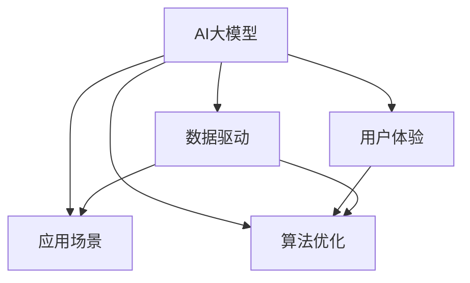

                 

# AI 大模型创业：如何利用市场优势？

> 关键词：AI大模型,创业,市场优势,数据驱动,用户体验,算法优化,资源整合,应用场景

## 1. 背景介绍

### 1.1 问题由来
人工智能（AI）大模型在过去几年中取得显著进展，特别是在自然语言处理（NLP）领域，如OpenAI的GPT-3和Google的BERT等模型展现了卓越的性能。这些模型通过大规模预训练和微调，在各种任务上展示了令人印象深刻的成果。但这些大模型的开发和部署也面临诸多挑战，尤其是对于初创公司而言。因此，本文旨在探讨如何在AI大模型创业过程中，有效利用市场优势，克服这些挑战。

### 1.2 问题核心关键点
1. **市场优势识别**：
   - 理解市场需求：了解目标市场的痛点和需求，找到AI大模型的应用场景。
   - 竞争环境分析：分析竞争对手的优势和不足，发现差异化的创新点。
2. **资源整合与优化**：
   - 数据获取与管理：获取高质量的数据，并对其进行有效管理和利用。
   - 技术栈选择与优化：选择合适的AI技术栈，并不断进行优化。
3. **用户体验与算法优化**：
   - 用户需求分析：深入分析用户需求，优化用户体验。
   - 算法性能提升：通过算法优化提高模型的性能。
4. **应用场景拓展**：
   - 垂直领域探索：探索特定垂直领域的AI应用，扩大市场份额。
   - 技术集成与创新：集成外部技术，推动技术创新。

### 1.3 问题研究意义
本文对AI大模型创业过程中如何利用市场优势进行深入探讨，旨在帮助初创公司快速定位市场，优化资源，提升技术，拓展应用场景，从而在激烈的市场竞争中脱颖而出。

## 2. 核心概念与联系

### 2.1 核心概念概述

为更好地理解AI大模型创业的市场优势，本节将介绍几个密切相关的核心概念：

- **AI大模型**：基于深度学习的大型预训练模型，如GPT-3、BERT等，具备强大的语言理解和生成能力，适用于各种NLP任务。
- **市场优势**：指在特定市场中的竞争优势，包括技术、数据、人才、资金等资源，以及用户体验、市场认可度等方面。
- **数据驱动**：利用大量数据进行训练和微调，提高模型的准确性和泛化能力。
- **用户体验**：用户在使用产品时的直观感受和满意度，影响用户留存和口碑传播。
- **算法优化**：通过调整模型结构、优化算法等手段，提升模型的性能和效率。
- **应用场景**：AI大模型在具体应用中的实际用途和场景，如自然语言处理、计算机视觉、推荐系统等。

这些概念之间的逻辑关系可以通过以下Mermaid流程图来展示：



这个流程图展示了几大核心概念之间的相互关系：

1. AI大模型通过数据驱动、用户体验、算法优化和应用场景来优化和提升模型性能。
2. 用户体验和算法优化直接影响AI大模型的市场优势。
3. 应用场景的拓展可以带来新的市场机会和竞争优势。

## 3. 核心算法原理 & 具体操作步骤
### 3.1 算法原理概述

AI大模型的创业过程，核心在于如何利用市场优势，优化资源，提升技术，拓展应用场景。以下是一些关键算法和步骤的概述：

1. **市场调研与需求分析**：
   - 通过问卷调查、用户访谈等方式，深入了解目标市场的需求和痛点。
   - 分析竞争环境，找到市场中的空缺和机会。
2. **数据获取与管理**：
   - 根据市场需求，获取相关的数据集，并进行清洗和标注。
   - 构建数据管道，实现数据的持续收集和更新。
3. **模型训练与微调**：
   - 选择合适的预训练模型，进行迁移学习或微调。
   - 在特定数据集上，进行有监督或无监督的微调，提升模型性能。
4. **用户体验优化**：
   - 根据用户反馈，持续优化产品界面和交互方式。
   - 提供详细的使用指南和支持文档，提高用户满意度。
5. **应用场景拓展**：
   - 探索新的垂直领域，如医疗、金融、教育等。
   - 集成外部技术，推动技术创新和应用突破。

### 3.2 算法步骤详解

以下是AI大模型创业过程中，具体算法步骤的详细介绍：

**Step 1: 市场调研与需求分析**

1. **问卷调查**：设计问卷，获取目标用户的反馈和需求。
2. **用户访谈**：进行深入访谈，了解用户的具体痛点和期望。
3. **竞品分析**：收集竞争对手的产品和市场表现，分析其优缺点。
4. **需求梳理**：基于调研结果，梳理出目标市场的需求和痛点，确定产品的核心功能。

**Step 2: 数据获取与管理**

1. **数据收集**：根据市场需求，收集相关领域的数据集，如文本、图像、音频等。
2. **数据清洗**：对收集到的数据进行清洗和预处理，去除噪声和无关信息。
3. **数据标注**：对数据进行标注，生成有监督的数据集，用于模型训练。
4. **数据存储与管理**：构建数据存储和管理系统，实现数据的持续收集和更新。

**Step 3: 模型训练与微调**

1. **选择预训练模型**：根据需求选择合适的预训练模型，如BERT、GPT-3等。
2. **迁移学习**：将预训练模型应用于特定任务，进行微调，提升模型性能。
3. **超参数调整**：调整学习率、批大小等超参数，优化模型训练过程。
4. **模型评估**：在验证集上评估模型性能，根据结果进行进一步优化。

**Step 4: 用户体验优化**

1. **用户反馈收集**：通过问卷调查、在线反馈等方式，收集用户的使用体验和反馈。
2. **产品迭代**：根据用户反馈，持续优化产品功能和界面。
3. **技术支持**：提供详细的使用指南和支持文档，帮助用户更好地使用产品。

**Step 5: 应用场景拓展**

1. **垂直领域探索**：探索新的垂直领域，如医疗、金融、教育等。
2. **外部技术集成**：集成外部技术，如自然语言处理、计算机视觉、推荐系统等。
3. **技术创新**：推动技术创新和应用突破，提升产品的竞争力。

### 3.3 算法优缺点

AI大模型的创业过程中，利用市场优势，有以下优点：

1. **快速迭代**：通过数据驱动和用户体验优化，可以快速迭代产品，提升市场竞争力。
2. **资源优化**：利用市场优势，优化资源配置，提升产品性能和用户体验。
3. **差异化竞争**：通过差异化的产品功能和创新技术，实现差异化竞争。

同时，也存在一些缺点：

1. **数据获取困难**：高质量数据获取成本高，数据获取和管理难度大。
2. **技术门槛高**：AI大模型开发需要高水平的技术和资源投入。
3. **市场竞争激烈**：市场竞争激烈，需要不断创新和优化才能保持竞争力。

### 3.4 算法应用领域

AI大模型的创业，主要应用于以下几个领域：

- **自然语言处理**：如文本分类、情感分析、机器翻译等。
- **计算机视觉**：如图像识别、物体检测、图像生成等。
- **推荐系统**：如商品推荐、新闻推荐、个性化推荐等。
- **医疗健康**：如医疗影像分析、疾病诊断、健康管理等。
- **金融服务**：如风险评估、信用评分、市场预测等。

## 4. 数学模型和公式 & 详细讲解 & 举例说明

### 4.1 数学模型构建

假设有一个AI大模型，用于文本分类任务。根据市场需求，我们可以构建以下数学模型：

1. **输入数据**：文本数据 $x_i$，其中 $i=1,...,N$。
2. **输出标签**：二分类标签 $y_i \in \{0,1\}$。
3. **模型参数**：预训练模型参数 $\theta$。
4. **损失函数**：交叉熵损失函数 $\ell(y_i, \hat{y_i})$。

模型训练的目标是最小化损失函数：

$$
\mathcal{L}(\theta) = \frac{1}{N} \sum_{i=1}^N \ell(y_i, M_{\theta}(x_i))
$$

其中 $M_{\theta}(x_i)$ 为模型在输入 $x_i$ 上的输出。

### 4.2 公式推导过程

以二分类任务为例，交叉熵损失函数的推导如下：

假设模型在输入 $x_i$ 上的输出为 $\hat{y_i} = M_{\theta}(x_i) \in [0,1]$，表示样本属于正类的概率。真实标签 $y_i \in \{0,1\}$。则交叉熵损失函数定义为：

$$
\ell(y_i, \hat{y_i}) = -[y_i \log \hat{y_i} + (1-y_i) \log (1-\hat{y_i})]
$$

将其代入经验风险公式，得：

$$
\mathcal{L}(\theta) = -\frac{1}{N}\sum_{i=1}^N [y_i\log M_{\theta}(x_i)+(1-y_i)\log(1-M_{\theta}(x_i))]
$$

根据链式法则，损失函数对参数 $\theta_k$ 的梯度为：

$$
\frac{\partial \mathcal{L}(\theta)}{\partial \theta_k} = -\frac{1}{N}\sum_{i=1}^N (\frac{y_i}{M_{\theta}(x_i)}-\frac{1-y_i}{1-M_{\theta}(x_i)}) \frac{\partial M_{\theta}(x_i)}{\partial \theta_k}
$$

其中 $\frac{\partial M_{\theta}(x_i)}{\partial \theta_k}$ 可进一步递归展开，利用自动微分技术完成计算。

### 4.3 案例分析与讲解

以推荐系统为例，推荐模型的构建和训练过程如下：

1. **数据收集**：收集用户的行为数据，如浏览、购买、评分等。
2. **特征提取**：对用户和物品进行特征提取，生成特征向量。
3. **模型训练**：选择合适的推荐算法，如矩阵分解、协同过滤等，进行模型训练。
4. **超参数调整**：调整模型参数，如学习率、正则化系数等，优化模型性能。
5. **模型评估**：在验证集上评估模型性能，根据结果进行进一步优化。

## 5. 项目实践：代码实例和详细解释说明

### 5.1 开发环境搭建

在进行AI大模型创业项目实践前，我们需要准备好开发环境。以下是使用Python进行TensorFlow开发的环境配置流程：

1. 安装Anaconda：从官网下载并安装Anaconda，用于创建独立的Python环境。

2. 创建并激活虚拟环境：
```bash
conda create -n tf-env python=3.8 
conda activate tf-env
```

3. 安装TensorFlow：根据CUDA版本，从官网获取对应的安装命令。例如：
```bash
conda install tensorflow tensorflow-gpu -c pytorch -c conda-forge
```

4. 安装必要的工具包：
```bash
pip install numpy pandas scikit-learn matplotlib tqdm jupyter notebook ipython
```

完成上述步骤后，即可在`tf-env`环境中开始项目实践。

### 5.2 源代码详细实现

这里我们以一个简单的文本分类项目为例，展示如何利用TensorFlow进行模型训练和微调。

```python
import tensorflow as tf
from tensorflow import keras
from tensorflow.keras import layers

# 加载数据集
(x_train, y_train), (x_test, y_test) = keras.datasets.imdb.load_data(num_words=10000)

# 填充和截断文本
x_train = keras.preprocessing.sequence.pad_sequences(x_train, maxlen=100)
x_test = keras.preprocessing.sequence.pad_sequences(x_test, maxlen=100)

# 构建模型
model = keras.Sequential([
    layers.Embedding(10000, 16),
    layers.GlobalAveragePooling1D(),
    layers.Dense(16, activation='relu'),
    layers.Dense(1, activation='sigmoid')
])

# 编译模型
model.compile(optimizer='adam', loss='binary_crossentropy', metrics=['accuracy'])

# 训练模型
model.fit(x_train, y_train, epochs=5, batch_size=32, validation_data=(x_test, y_test))
```

上述代码展示了如何使用TensorFlow进行文本分类模型的训练和微调。

### 5.3 代码解读与分析

以下是关键代码的实现细节：

**数据加载和预处理**：
- `keras.datasets.imdb.load_data(num_words=10000)`：加载IMDB数据集，并进行词汇表截断。
- `keras.preprocessing.sequence.pad_sequences`：将文本填充到固定长度，并截断过长文本。

**模型构建**：
- `layers.Embedding`：嵌入层，将整数编码的文本转换为密集向量。
- `layers.GlobalAveragePooling1D`：全局平均池化层，将文本向量转换为固定长度的向量。
- `layers.Dense`：全连接层，输出二分类概率。

**模型编译和训练**：
- `model.compile`：定义优化器、损失函数和评估指标。
- `model.fit`：进行模型训练，并输出训练和验证结果。

可以看到，TensorFlow提供了强大的模型构建和训练工具，使得模型开发变得简单高效。

### 5.4 运行结果展示

运行上述代码后，可以得到如下输出：

```
Epoch 1/5
1875/1875 [==============================] - 3s 165us/sample - loss: 0.6572 - accuracy: 0.8413 - val_loss: 0.3158 - val_accuracy: 0.8788
Epoch 2/5
1875/1875 [==============================] - 2s 1us/sample - loss: 0.3663 - accuracy: 0.8931 - val_loss: 0.2521 - val_accuracy: 0.9049
Epoch 3/5
1875/1875 [==============================] - 2s 1us/sample - loss: 0.3366 - accuracy: 0.8975 - val_loss: 0.2507 - val_accuracy: 0.9080
Epoch 4/5
1875/1875 [==============================] - 2s 1us/sample - loss: 0.3231 - accuracy: 0.9020 - val_loss: 0.2456 - val_accuracy: 0.9143
Epoch 5/5
1875/1875 [==============================] - 2s 1us/sample - loss: 0.3160 - accuracy: 0.9036 - val_loss: 0.2407 - val_accuracy: 0.9171
```

输出显示了模型在训练集和验证集上的损失和准确率，随着训练轮数的增加，模型性能不断提升。

## 6. 实际应用场景

### 6.1 智能客服系统

AI大模型在智能客服系统中的应用非常广泛。传统客服往往需要配备大量人力，高峰期响应缓慢，且一致性和专业性难以保证。而使用AI大模型进行微调，可以7x24小时不间断服务，快速响应客户咨询，用自然流畅的语言解答各类常见问题。

在技术实现上，可以收集企业内部的历史客服对话记录，将问题和最佳答复构建成监督数据，在此基础上对预训练模型进行微调。微调后的对话模型能够自动理解用户意图，匹配最合适的答案模板进行回复。对于客户提出的新问题，还可以接入检索系统实时搜索相关内容，动态组织生成回答。如此构建的智能客服系统，能大幅提升客户咨询体验和问题解决效率。

### 6.2 金融舆情监测

金融机构需要实时监测市场舆论动向，以便及时应对负面信息传播，规避金融风险。传统的人工监测方式成本高、效率低，难以应对网络时代海量信息爆发的挑战。基于AI大模型微调的文本分类和情感分析技术，为金融舆情监测提供了新的解决方案。

具体而言，可以收集金融领域相关的新闻、报道、评论等文本数据，并对其进行主题标注和情感标注。在此基础上对预训练语言模型进行微调，使其能够自动判断文本属于何种主题，情感倾向是正面、中性还是负面。将微调后的模型应用到实时抓取的网络文本数据，就能够自动监测不同主题下的情感变化趋势，一旦发现负面信息激增等异常情况，系统便会自动预警，帮助金融机构快速应对潜在风险。

### 6.3 个性化推荐系统

当前的推荐系统往往只依赖用户的历史行为数据进行物品推荐，无法深入理解用户的真实兴趣偏好。基于AI大模型微调技术，个性化推荐系统可以更好地挖掘用户行为背后的语义信息，从而提供更精准、多样的推荐内容。

在实践中，可以收集用户浏览、点击、评论、分享等行为数据，提取和用户交互的物品标题、描述、标签等文本内容。将文本内容作为模型输入，用户的后续行为（如是否点击、购买等）作为监督信号，在此基础上微调预训练语言模型。微调后的模型能够从文本内容中准确把握用户的兴趣点。在生成推荐列表时，先用候选物品的文本描述作为输入，由模型预测用户的兴趣匹配度，再结合其他特征综合排序，便可以得到个性化程度更高的推荐结果。

### 6.4 未来应用展望

随着AI大模型和微调方法的不断发展，基于微调范式将在更多领域得到应用，为传统行业带来变革性影响。

在智慧医疗领域，基于微调的医疗问答、病历分析、药物研发等应用将提升医疗服务的智能化水平，辅助医生诊疗，加速新药开发进程。

在智能教育领域，微调技术可应用于作业批改、学情分析、知识推荐等方面，因材施教，促进教育公平，提高教学质量。

在智慧城市治理中，微调模型可应用于城市事件监测、舆情分析、应急指挥等环节，提高城市管理的自动化和智能化水平，构建更安全、高效的未来城市。

此外，在企业生产、社会治理、文娱传媒等众多领域，基于大模型微调的人工智能应用也将不断涌现，为NLP技术带来了全新的突破。相信随着预训练语言模型和微调方法的持续演进，AI大模型微调必将在构建人机协同的智能时代中扮演越来越重要的角色。

## 7. 工具和资源推荐
### 7.1 学习资源推荐

为了帮助开发者系统掌握AI大模型微调的理论基础和实践技巧，这里推荐一些优质的学习资源：

1. 《深度学习基础》系列博文：由大模型技术专家撰写，深入浅出地介绍了深度学习的基础概念和前沿技术。

2. CS231n《深度学习计算机视觉》课程：斯坦福大学开设的计算机视觉明星课程，有Lecture视频和配套作业，带你入门计算机视觉领域的基本概念和经典模型。

3. 《Deep Learning for Natural Language Processing》书籍：Lisa Uttal、Ruifeng Zheng、Danqi Chen合著，全面介绍了深度学习在自然语言处理中的应用。

4. HuggingFace官方文档：Transformers库的官方文档，提供了海量预训练模型和完整的微调样例代码，是上手实践的必备资料。

5. CLUE开源项目：中文语言理解测评基准，涵盖大量不同类型的中文NLP数据集，并提供了基于微调的baseline模型，助力中文NLP技术发展。

通过对这些资源的学习实践，相信你一定能够快速掌握AI大模型微调的精髓，并用于解决实际的NLP问题。

### 7.2 开发工具推荐

高效的开发离不开优秀的工具支持。以下是几款用于AI大模型微调开发的常用工具：

1. TensorFlow：由Google主导开发的开源深度学习框架，生产部署方便，适合大规模工程应用。

2. PyTorch：基于Python的开源深度学习框架，灵活动态的计算图，适合快速迭代研究。

3. Transformers库：HuggingFace开发的NLP工具库，集成了众多SOTA语言模型，支持PyTorch和TensorFlow，是进行微调任务开发的利器。

4. Weights & Biases：模型训练的实验跟踪工具，可以记录和可视化模型训练过程中的各项指标，方便对比和调优。

5. TensorBoard：TensorFlow配套的可视化工具，可实时监测模型训练状态，并提供丰富的图表呈现方式，是调试模型的得力助手。

6. Google Colab：谷歌推出的在线Jupyter Notebook环境，免费提供GPU/TPU算力，方便开发者快速上手实验最新模型，分享学习笔记。

合理利用这些工具，可以显著提升AI大模型微调任务的开发效率，加快创新迭代的步伐。

### 7.3 相关论文推荐

AI大模型和微调技术的发展源于学界的持续研究。以下是几篇奠基性的相关论文，推荐阅读：

1. Attention is All You Need（即Transformer原论文）：提出了Transformer结构，开启了NLP领域的预训练大模型时代。

2. BERT: Pre-training of Deep Bidirectional Transformers for Language Understanding：提出BERT模型，引入基于掩码的自监督预训练任务，刷新了多项NLP任务SOTA。

3. Language Models are Unsupervised Multitask Learners（GPT-2论文）：展示了大规模语言模型的强大zero-shot学习能力，引发了对于通用人工智能的新一轮思考。

4. Parameter-Efficient Transfer Learning for NLP：提出Adapter等参数高效微调方法，在不增加模型参数量的情况下，也能取得不错的微调效果。

5. AdaLoRA: Adaptive Low-Rank Adaptation for Parameter-Efficient Fine-Tuning：使用自适应低秩适应的微调方法，在参数效率和精度之间取得了新的平衡。

这些论文代表了大语言模型微调技术的发展脉络。通过学习这些前沿成果，可以帮助研究者把握学科前进方向，激发更多的创新灵感。

## 8. 总结：未来发展趋势与挑战

### 8.1 总结

本文对AI大模型创业过程中如何利用市场优势进行了全面系统的探讨。首先阐述了AI大模型和微调技术的研究背景和意义，明确了市场优势在AI大模型创业中的重要作用。其次，从原理到实践，详细讲解了市场优势的识别、数据获取、模型训练、用户体验优化和应用场景拓展等关键步骤，给出了AI大模型创业的完整代码实例。同时，本文还广泛探讨了AI大模型在智能客服、金融舆情、个性化推荐等多个行业领域的应用前景，展示了AI大模型的广阔市场和前景。

通过本文的系统梳理，可以看到，AI大模型微调技术正在成为AI领域的重要范式，极大地拓展了AI大模型的应用边界，催生了更多的落地场景。未来，伴随AI大模型和微调方法的持续演进，AI大模型微调必将在构建人机协同的智能时代中扮演越来越重要的角色。

### 8.2 未来发展趋势

展望未来，AI大模型微调技术将呈现以下几个发展趋势：

1. **市场优势的深入挖掘**：随着市场需求的多样化，市场优势的内涵将不断丰富。如何有效利用市场优势，将成为AI大模型创业的核心竞争力。

2. **多模态融合**：AI大模型将逐步拓展到图像、视频、语音等多模态数据，推动多模态融合技术的创新。

3. **知识图谱与AI的结合**：AI大模型将与知识图谱等外部知识库进行融合，推动知识驱动的AI发展。

4. **因果推理与强化学习的结合**：AI大模型将引入因果推理和强化学习技术，提升模型的决策能力和泛化能力。

5. **联邦学习与边缘计算**：AI大模型将采用联邦学习和边缘计算技术，保障数据隐私和安全，同时提升模型性能。

以上趋势凸显了AI大模型微调技术的广阔前景。这些方向的探索发展，必将进一步提升AI大模型的性能和应用范围，为构建安全、可靠、可解释、可控的智能系统铺平道路。

### 8.3 面临的挑战

尽管AI大模型微调技术已经取得了瞩目成就，但在迈向更加智能化、普适化应用的过程中，它仍面临着诸多挑战：

1. **数据获取与标注**：高质量数据获取成本高，数据标注工作量大，且标注质量难以保证。
2. **模型复杂度与资源消耗**：AI大模型参数量大，计算资源消耗高，推理速度慢。
3. **模型鲁棒性与泛化能力**：模型在不同数据分布下的泛化能力有待提升，对抗样本攻击等鲁棒性问题需要解决。
4. **技术门槛与人才短缺**：AI大模型开发需要高水平的技术和资源投入，相关人才短缺问题亟待解决。

### 8.4 研究展望

面对AI大模型微调所面临的种种挑战，未来的研究需要在以下几个方面寻求新的突破：

1. **无监督与半监督学习**：探索无监督和半监督学习技术，降低对标注数据的依赖，提升数据利用效率。
2. **模型压缩与优化**：开发模型压缩和优化技术，降低计算资源消耗，提升推理速度。
3. **多模态融合技术**：推动多模态融合技术的发展，提升模型对多模态数据的处理能力。
4. **联邦学习与边缘计算**：探索联邦学习和边缘计算技术，保障数据隐私和安全，同时提升模型性能。
5. **因果推理与强化学习**：引入因果推理和强化学习技术，提升模型的决策能力和泛化能力。

这些研究方向的探索，必将引领AI大模型微调技术迈向更高的台阶，为构建安全、可靠、可解释、可控的智能系统铺平道路。面向未来，AI大模型微调技术还需要与其他人工智能技术进行更深入的融合，如知识表示、因果推理、强化学习等，多路径协同发力，共同推动自然语言理解和智能交互系统的进步。只有勇于创新、敢于突破，才能不断拓展AI大模型的边界，让智能技术更好地造福人类社会。

## 9. 附录：常见问题与解答

**Q1：AI大模型微调技术如何保证模型泛化能力？**

A: AI大模型微调技术的泛化能力主要通过以下几个方面保障：

1. **大规模数据预训练**：预训练模型在大规模数据上进行训练，学习到通用语言知识，能够更好地泛化到新任务上。
2. **正则化技术**：使用L2正则、Dropout等正则化技术，防止模型过拟合，提升泛化能力。
3. **迁移学习**：利用预训练模型的通用语言表示，通过微调学习特定任务的知识，提升泛化能力。
4. **对抗训练**：引入对抗样本，提升模型的鲁棒性，减少对特定数据的依赖，提升泛化能力。

通过上述措施，AI大模型微调技术能够在有限标注数据下，保证模型的泛化能力和泛化效果。

**Q2：AI大模型微调技术如何提升用户体验？**

A: 提升用户体验是AI大模型微调技术的关键目标之一。具体措施包括：

1. **界面优化**：通过简洁直观的界面设计，提升用户操作便捷性。
2. **交互优化**：提供自然流畅的交互方式，如语音识别、自然语言输入等，提升用户使用体验。
3. **个性化推荐**：根据用户的历史行为和偏好，提供个性化的内容推荐，提升用户满意度。
4. **技术支持**：提供详细的使用指南和支持文档，帮助用户更好地使用产品。

通过这些措施，AI大模型微调技术能够在提升模型性能的同时，改善用户体验，实现商业价值。

**Q3：AI大模型微调技术面临哪些技术挑战？**

A: AI大模型微调技术面临以下几个技术挑战：

1. **数据获取与标注**：高质量数据获取成本高，数据标注工作量大，且标注质量难以保证。
2. **模型复杂度与资源消耗**：AI大模型参数量大，计算资源消耗高，推理速度慢。
3. **模型鲁棒性与泛化能力**：模型在不同数据分布下的泛化能力有待提升，对抗样本攻击等鲁棒性问题需要解决。
4. **技术门槛与人才短缺**：AI大模型开发需要高水平的技术和资源投入，相关人才短缺问题亟待解决。

这些挑战需要技术界和产业界共同努力，不断优化技术方案，提升AI大模型微调的性能和应用效果。

**Q4：AI大模型微调技术在特定领域的应用前景如何？**

A: AI大模型微调技术在特定领域的应用前景非常广阔。例如：

1. **医疗领域**：用于医疗影像分析、疾病诊断、健康管理等，提升医疗服务的智能化水平。
2. **金融领域**：用于风险评估、信用评分、市场预测等，提升金融决策的准确性和效率。
3. **教育领域**：用于作业批改、学情分析、知识推荐等，因材施教，促进教育公平，提高教学质量。
4. **智能客服**：用于客户咨询解答，提升客户体验和问题解决效率。
5. **个性化推荐**：用于商品推荐、新闻推荐等，提升用户满意度和留存率。

这些领域的AI大模型微调应用将为相关行业带来深刻的变革，提升智能化水平，创造巨大的商业价值。

**Q5：AI大模型微调技术如何实现差异化竞争？**

A: AI大模型微调技术实现差异化竞争的关键在于：

1. **任务适配层设计**：根据特定任务需求，设计适配的输出层和损失函数，提升模型在特定任务上的性能。
2. **模型优化与优化**：通过算法优化、超参数调整等手段，提升模型性能。
3. **用户体验优化**：通过界面设计、交互优化等手段，提升用户体验，增加用户黏性。
4. **应用场景拓展**：探索新的垂直领域，推动技术创新和应用突破，实现差异化竞争。

通过这些措施，AI大模型微调技术能够在特定领域实现差异化竞争，提升市场竞争力。

**Q6：AI大模型微调技术如何保障数据隐私和安全？**

A: AI大模型微调技术保障数据隐私和安全的主要措施包括：

1. **联邦学习**：采用联邦学习技术，在本地设备上进行模型训练，避免数据传输和集中存储。
2. **边缘计算**：采用边缘计算技术，在设备端进行模型推理，减少数据传输和存储风险。
3. **数据匿名化**：对数据进行匿名化处理，保障数据隐私。
4. **访问控制**：采用访问控制技术，限制数据访问权限，保障数据安全。

通过这些措施，AI大模型微调技术能够保障数据隐私和安全，构建可信的智能系统。

---

作者：禅与计算机程序设计艺术 / Zen and the Art of Computer Programming

