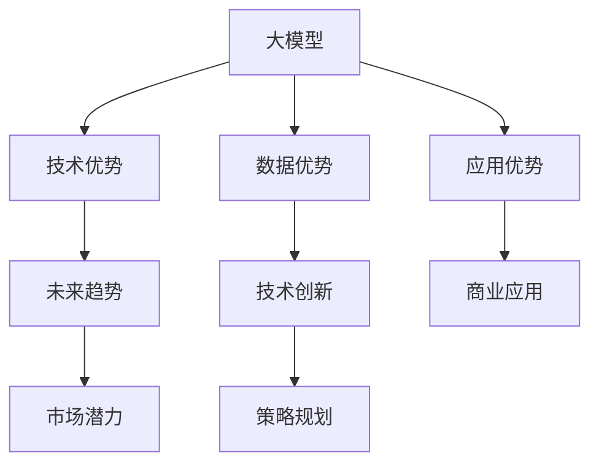

                 

# AI 大模型创业：如何利用未来优势？

> 关键词：AI大模型、创业优势、未来趋势、技术创新、商业应用、策略规划

## 1. 背景介绍

### 1.1 问题由来

近年来，人工智能(AI)技术在全球范围内迅速发展，尤其是在深度学习领域，基于大模型的人工智能应用已经成为推动科技进步和产业升级的重要力量。大模型不仅具备强大的数据处理能力和高效的学习能力，而且能够实现跨领域的知识迁移，极大地扩展了人工智能的应用边界。

然而，尽管大模型在技术和应用上取得了一系列突破，但在创业实践中，如何将这些先进的技术优势转化为商业价值，仍然是一个需要深入探讨的问题。因此，本文旨在探讨如何在大模型创业领域中利用未来优势，以期为创业者提供一些实用的建议和思路。

### 1.2 问题核心关键点

在探讨如何利用大模型创业的优势之前，我们需要明确以下几个核心关键点：

1. **技术优势**：大模型在深度学习、自然语言处理(NLP)、计算机视觉等领域具备显著的技术优势，能够高效处理海量数据，实现高精度的模型训练和预测。
2. **数据优势**：大模型通常基于大规模、高质量的数据集进行预训练，具备更广泛的知识覆盖和更强的泛化能力。
3. **应用优势**：大模型可以应用于诸多垂直行业，如医疗、金融、教育、智能制造等，为各行各业带来深刻的变革。
4. **未来趋势**：随着计算资源的增加和算法技术的进步，大模型将继续向更大规模、更高性能、更广泛应用方向发展。
5. **市场潜力**：AI大模型的市场需求日益增长，尤其在个性化、智能化需求旺盛的今天，大模型将推动更多的行业应用和创新。

## 2. 核心概念与联系

### 2.1 核心概念概述

为更好地理解如何利用大模型创业，我们需要对以下几个核心概念进行介绍：

- **大模型**：指基于大规模数据集预训练的深度神经网络模型，如BERT、GPT-3等。大模型通过自监督学习任务，学习到丰富的语言和视觉知识。
- **创业优势**：指利用大模型在技术和应用上的优势，进行企业创新和市场拓展，快速占领市场，实现商业价值的最大化。
- **未来趋势**：指AI大模型技术的发展方向，包括模型规模的扩大、性能的提升、应用领域的拓展等。
- **技术创新**：指利用最新AI技术，如迁移学习、联邦学习、无监督学习等，提升大模型的应用效果和性能。
- **商业应用**：指将大模型应用于具体行业，解决实际问题，提升业务效率和客户满意度。
- **策略规划**：指制定科学合理的商业策略，充分利用大模型的优势，推动企业发展。

这些核心概念之间有着紧密的联系，通过深入理解和应用这些概念，可以帮助创业者在大模型领域获得成功。

### 2.2 核心概念原理和架构的 Mermaid 流程图

以下是这些核心概念之间的联系的Mermaid流程图：



这个流程图展示了核心概念之间的逻辑关系：

1. 大模型作为基础，提供了强大的技术优势、数据优势和应用优势。
2. 技术优势通过未来趋势和技术创新得以持续提升。
3. 应用优势通过商业应用和市场潜力得以实现。
4. 商业应用和市场潜力通过策略规划得以优化和拓展。

## 3. 核心算法原理 & 具体操作步骤

### 3.1 算法原理概述

大模型创业的核心在于如何利用大模型的优势，结合实际需求，开发出具有市场竞争力的产品和服务。以下是大模型创业的核心算法原理：

1. **数据驱动的模型训练**：利用大模型在处理大规模数据集方面的优势，进行高效的模型训练和优化。
2. **迁移学习**：通过在大模型上微调，将预训练的知识迁移到特定任务中，实现快速部署和应用。
3. **联邦学习**：利用分布式计算技术，在不泄露隐私的前提下，训练多个大模型，提高数据利用率和模型泛化能力。
4. **无监督学习**：通过大规模数据集的预训练，无需人工标注即可获取丰富的语言和视觉知识，提升模型的泛化能力。
5. **个性化推荐**：利用大模型对用户行为和偏好的理解，提供个性化的推荐服务，提升用户体验。

### 3.2 算法步骤详解

以下是基于大模型创业的具体操作步骤：

1. **市场调研**：进行详细的市场调研，了解目标行业的需求和痛点，确定大模型可以解决的具体问题。
2. **技术选型**：选择合适的预训练大模型，并根据实际需求进行微调或适配。
3. **数据准备**：收集、清洗和标注目标领域的数据集，确保数据质量。
4. **模型训练**：在大模型上进行迁移学习，微调或重新训练模型，提升模型的任务相关性。
5. **产品开发**：结合技术优势，开发出具有创新性的产品，如智能客服、智能推荐系统等。
6. **市场推广**：利用市场营销手段，快速推广产品，占领市场份额。
7. **客户反馈**：收集用户反馈，持续优化产品和算法，提高用户满意度。

### 3.3 算法优缺点

大模型创业具有以下优点：

1. **高效性**：大模型具备高效的数据处理能力和学习能力，能够快速开发出具有竞争力的产品。
2. **泛化能力强**：大模型经过大规模数据集预训练，具备更强的泛化能力，可以适应不同领域的应用。
3. **可扩展性好**：大模型可以轻松扩展到不同行业，提升企业的市场竞争力。

同时，大模型创业也存在以下缺点：

1. **高昂成本**：大模型和其训练所需的计算资源成本较高，可能对中小企业构成一定的门槛。
2. **数据隐私问题**：大模型的训练需要大量的数据，数据隐私保护成为一大挑战。
3. **技术门槛高**：大模型的开发和优化需要较高的技术水平，对团队的技术实力要求较高。

### 3.4 算法应用领域

大模型创业可以应用于以下多个领域：

1. **智能客服**：利用大模型进行智能对话和问题解答，提升客户体验和服务效率。
2. **金融科技**：应用于智能投顾、风险评估、信用评分等领域，提升金融服务的智能化水平。
3. **医疗健康**：应用于疾病诊断、医学影像分析、健康管理等领域，提高医疗服务的精准性和效率。
4. **教育培训**：应用于智能辅导、知识图谱构建、个性化推荐等领域，提升教育培训的质量和效果。
5. **智能制造**：应用于设备维护、质量控制、生产调度等领域，提升制造业的智能化水平。

## 4. 数学模型和公式 & 详细讲解

### 4.1 数学模型构建

在AI大模型创业中，数学模型的构建是技术创新的重要基础。以下是一个简单的数学模型构建示例：

假设有一个文本分类任务，输入为文本 $x$，输出为分类标签 $y$，模型的输入为文本向量化表示 $x' = \text{embedding}(x)$，模型的输出为概率分布 $p(y|x')$。

### 4.2 公式推导过程

文本分类任务中，常用的模型为softmax回归模型。其基本思想是将文本表示为向量，然后通过线性变换和softmax函数，计算文本属于各个类别的概率。

具体推导如下：

$$
p(y|x') = \frac{e^{\text{score}(x', y)}}{\sum_{k=1}^K e^{\text{score}(x', y_k)}}
$$

其中，$K$ 为类别数，$\text{score}(x', y)$ 为模型对文本 $x'$ 和类别 $y$ 的打分。

### 4.3 案例分析与讲解

以情感分析任务为例，其模型构建过程如下：

1. **文本预处理**：对输入文本进行分词、去停用词、构建词汇表等预处理。
2. **文本向量表示**：将预处理后的文本转换为向量表示，如word2vec、GloVe等。
3. **模型训练**：利用大模型进行微调或适配，训练情感分类模型。
4. **模型评估**：在测试集上评估模型的性能，如准确率、F1-score等。
5. **模型应用**：将训练好的模型应用于实际场景中，如智能客服、社交媒体情感监测等。

## 5. 项目实践：代码实例和详细解释说明

### 5.1 开发环境搭建

以下是AI大模型创业的开发环境搭建流程：

1. **环境配置**：选择合适的深度学习框架（如TensorFlow、PyTorch）和编程语言（如Python），搭建开发环境。
2. **数据准备**：收集、清洗和标注目标领域的数据集，确保数据质量。
3. **模型训练**：利用大模型进行迁移学习，微调或重新训练模型，提升模型的任务相关性。
4. **产品开发**：结合技术优势，开发出具有创新性的产品，如智能客服、智能推荐系统等。
5. **市场推广**：利用市场营销手段，快速推广产品，占领市场份额。
6. **客户反馈**：收集用户反馈，持续优化产品和算法，提高用户满意度。

### 5.2 源代码详细实现

以下是使用TensorFlow框架构建情感分析模型的代码示例：

```python
import tensorflow as tf
from tensorflow.keras.layers import Embedding, Dense, GlobalAveragePooling1D
from tensorflow.keras.models import Model
from tensorflow.keras.preprocessing.text import Tokenizer
from tensorflow.keras.preprocessing.sequence import pad_sequences

# 构建模型
def build_model(vocab_size, embedding_dim, max_length):
    embedding = Embedding(vocab_size, embedding_dim)
    x = embedding(input)
    x = GlobalAveragePooling1D()(x)
    x = Dense(16, activation='relu')(x)
    output = Dense(1, activation='sigmoid')(x)
    model = Model(inputs=input, outputs=output)
    return model

# 训练模型
def train_model(model, data, epochs, batch_size):
    model.compile(optimizer=tf.keras.optimizers.Adam(), loss='binary_crossentropy', metrics=['accuracy'])
    model.fit(data['x'], data['y'], epochs=epochs, batch_size=batch_size, validation_split=0.2)
    return model

# 数据预处理
def preprocess_data(texts, labels, max_length):
    tokenizer = Tokenizer(num_words=vocab_size)
    tokenizer.fit_on_texts(texts)
    sequences = tokenizer.texts_to_sequences(texts)
    padded_sequences = pad_sequences(sequences, maxlen=max_length, padding='post', truncating='post')
    return padded_sequences, labels
```

### 5.3 代码解读与分析

以上代码示例中，首先定义了一个简单的情感分析模型，包括嵌入层、全局平均池化层、全连接层和输出层。然后，使用预处理过的文本数据和标签数据进行模型训练，并在测试集上评估模型的性能。

在实际应用中，还需要根据具体需求进行模型优化和调整，如增加卷积层、循环层等，提高模型的表达能力。同时，还需要考虑模型的可解释性、鲁棒性和扩展性等问题。

### 5.4 运行结果展示

在训练完成后，可以在测试集上评估模型的性能，如准确率、F1-score等。以下是一些常见的评估指标：

- 准确率（Accuracy）：模型正确预测的比例。
- 精确率（Precision）：模型预测为正样本中实际为正样本的比例。
- 召回率（Recall）：实际为正样本中模型预测为正样本的比例。
- F1-score：精确率和召回率的调和平均数，综合考虑模型分类效果。

## 6. 实际应用场景

### 6.1 智能客服系统

智能客服系统是AI大模型创业的重要应用场景之一。智能客服可以24小时不间断工作，提升客户咨询体验和服务效率，降低人力成本。以下是一个智能客服系统的应用示例：

1. **需求分析**：了解客户咨询的常见问题和场景，确定智能客服需要解决的具体问题。
2. **模型构建**：利用大模型进行智能对话和问题解答，提升客户体验和服务效率。
3. **数据准备**：收集客户咨询记录和问题解答，构建训练集和验证集。
4. **模型训练**：利用大模型进行迁移学习，微调或重新训练模型，提升模型的任务相关性。
5. **产品部署**：将训练好的模型应用于智能客服系统中，快速响应客户咨询。
6. **用户反馈**：收集用户反馈，持续优化产品和算法，提高用户满意度。

### 6.2 金融科技

金融科技是大模型创业的另一重要应用场景。通过AI技术，可以提升金融服务的智能化水平，如智能投顾、风险评估、信用评分等。以下是一个金融科技系统的应用示例：

1. **需求分析**：了解金融服务中的具体需求和痛点，确定AI技术可以解决的问题。
2. **模型构建**：利用大模型进行金融数据分析和风险评估，提升金融服务的智能化水平。
3. **数据准备**：收集金融服务相关的数据集，如交易记录、信用记录、市场数据等。
4. **模型训练**：利用大模型进行迁移学习，微调或重新训练模型，提升模型的任务相关性。
5. **产品开发**：将训练好的模型应用于智能投顾、风险评估、信用评分等领域，提升金融服务的智能化水平。
6. **市场推广**：利用市场营销手段，快速推广产品，占领市场份额。
7. **客户反馈**：收集用户反馈，持续优化产品和算法，提高用户满意度。

### 6.3 医疗健康

医疗健康是大模型创业的又一重要应用场景。通过AI技术，可以提升医疗服务的精准性和效率，如疾病诊断、医学影像分析、健康管理等。以下是一个医疗健康系统的应用示例：

1. **需求分析**：了解医疗服务中的具体需求和痛点，确定AI技术可以解决的问题。
2. **模型构建**：利用大模型进行医学影像分析和疾病诊断，提升医疗服务的精准性和效率。
3. **数据准备**：收集医学影像和疾病诊断相关的数据集，确保数据质量。
4. **模型训练**：利用大模型进行迁移学习，微调或重新训练模型，提升模型的任务相关性。
5. **产品开发**：将训练好的模型应用于医学影像分析和疾病诊断等领域，提升医疗服务的精准性和效率。
6. **市场推广**：利用市场营销手段，快速推广产品，占领市场份额。
7. **客户反馈**：收集用户反馈，持续优化产品和算法，提高用户满意度。

### 6.4 未来应用展望

随着AI大模型的不断发展，未来将涌现更多应用场景，如智能制造、教育培训、智能交通等。AI大模型在提升各行各业智能化水平、优化资源配置、提高效率和降低成本等方面具有巨大潜力。

## 7. 工具和资源推荐

### 7.1 学习资源推荐

为了帮助开发者系统掌握大模型创业的理论基础和实践技巧，这里推荐一些优质的学习资源：

1. **《深度学习》书籍**：由深度学习领域的权威专家撰写，全面介绍了深度学习的基本概念和算法原理。
2. **Coursera《深度学习》课程**：斯坦福大学开设的深度学习课程，有Lecture视频和配套作业，带你深入理解深度学习的基本原理和应用。
3. **HuggingFace官方文档**：提供丰富的预训练大模型资源和微调样例代码，是上手实践的必备资料。
4. **Kaggle竞赛**：Kaggle平台提供了大量数据集和比赛，可以通过实践提升深度学习技能。

### 7.2 开发工具推荐

高效的开发离不开优秀的工具支持。以下是几款用于大模型创业开发的常用工具：

1. **TensorFlow**：由Google主导开发的开源深度学习框架，生产部署方便，适合大规模工程应用。
2. **PyTorch**：基于Python的开源深度学习框架，灵活动态的计算图，适合快速迭代研究。
3. **Transformers库**：HuggingFace开发的NLP工具库，集成了众多预训练大模型，支持TensorFlow和PyTorch，是进行微调任务开发的利器。
4. **Weights & Biases**：模型训练的实验跟踪工具，可以记录和可视化模型训练过程中的各项指标，方便对比和调优。
5. **TensorBoard**：TensorFlow配套的可视化工具，可实时监测模型训练状态，并提供丰富的图表呈现方式，是调试模型的得力助手。

### 7.3 相关论文推荐

大模型创业涉及的学术研究领域广泛，以下是几篇奠基性的相关论文，推荐阅读：

1. **《Attention is All You Need》**：提出Transformer结构，开启了NLP领域的预训练大模型时代。
2. **《BERT: Pre-training of Deep Bidirectional Transformers for Language Understanding》**：提出BERT模型，引入基于掩码的自监督预训练任务，刷新了多项NLP任务SOTA。
3. **《Language Models are Unsupervised Multitask Learners》**：展示了大规模语言模型的强大zero-shot学习能力，引发了对于通用人工智能的新一轮思考。
4. **《Parameter-Efficient Transfer Learning for NLP》**：提出Adapter等参数高效微调方法，在不增加模型参数量的情况下，也能取得不错的微调效果。
5. **《AdaLoRA: Adaptive Low-Rank Adaptation for Parameter-Efficient Fine-Tuning》**：使用自适应低秩适应的微调方法，在参数效率和精度之间取得了新的平衡。

## 8. 总结：未来发展趋势与挑战

### 8.1 研究成果总结

本文从大模型创业的背景、核心概念、算法原理、操作步骤、实际应用等方面，系统地探讨了如何利用大模型在技术和应用上的优势，开发出具有市场竞争力的产品和服务。大模型创业具有良好的技术优势和市场潜力，但同时也面临着数据隐私、技术门槛高等挑战。

### 8.2 未来发展趋势

展望未来，AI大模型创业将呈现以下几个发展趋势：

1. **技术进步**：大模型将继续向更大规模、更高性能、更广泛应用方向发展，推动AI技术不断突破。
2. **应用拓展**：AI大模型将广泛应用于各个垂直行业，带来深刻的变革和创新。
3. **市场竞争**：随着AI技术的普及，市场竞争将愈发激烈，企业需要不断创新，保持竞争优势。
4. **伦理道德**：AI技术的发展需要遵循伦理道德规范，确保技术应用的安全性和公平性。
5. **政策法规**：政府和社会将更加重视AI技术的规范和监管，制定相应的政策和法规，保障AI技术健康发展。

### 8.3 面临的挑战

尽管大模型创业具有广阔的市场前景，但在实际应用中也面临诸多挑战：

1. **数据隐私问题**：AI大模型的训练需要大量的数据，数据隐私保护成为一大挑战。
2. **技术门槛高**：AI大模型的开发和优化需要较高的技术水平，对团队的技术实力要求较高。
3. **市场竞争激烈**：随着AI技术的普及，市场竞争将愈发激烈，企业需要不断创新，保持竞争优势。
4. **伦理道德**：AI技术的发展需要遵循伦理道德规范，确保技术应用的安全性和公平性。
5. **政策法规**：政府和社会将更加重视AI技术的规范和监管，制定相应的政策和法规，保障AI技术健康发展。

### 8.4 研究展望

为了应对未来挑战，未来的研究需要在以下几个方面寻求新的突破：

1. **隐私保护**：开发隐私保护技术，确保数据隐私和安全。
2. **模型压缩**：优化模型结构和参数，提升模型的推理速度和效率。
3. **可解释性**：提高模型的可解释性，确保用户理解和信任。
4. **伦理道德**：引入伦理道德约束，确保AI技术的应用符合人类价值观和伦理道德。
5. **政策法规**：制定AI技术相关的政策法规，推动AI技术的规范和健康发展。

## 9. 附录：常见问题与解答

**Q1：如何选择合适的预训练大模型？**

A: 选择合适的预训练大模型需要考虑以下几个因素：
1. **任务相关性**：选择与目标任务相关的预训练模型，确保模型具备所需的知识和能力。
2. **性能表现**：选择SOTA性能的预训练模型，确保模型具有较高的预测准确率。
3. **资源需求**：考虑计算资源和存储资源的限制，选择适合的预训练模型。
4. **开源社区支持**：选择开源社区广泛使用的预训练模型，便于后续开发和维护。

**Q2：大模型创业需要多少资金投入？**

A: 大模型创业需要较高的资金投入，主要包括以下几个方面：
1. **数据收集和标注**：数据收集和标注需要较高的成本，尤其是高质量的数据集。
2. **模型训练和优化**：大模型的训练和优化需要高性能计算资源，如GPU、TPU等。
3. **产品开发和测试**：产品开发和测试需要投入大量人力和技术资源，进行多次迭代和优化。
4. **市场营销和推广**：市场营销和推广需要投入大量的营销费用和人力，提升品牌知名度和市场占有率。

**Q3：大模型创业中需要注意哪些伦理道德问题？**

A: 大模型创业中需要注意以下几个伦理道德问题：
1. **数据隐私保护**：确保数据隐私和用户隐私的保护，避免数据泄露和滥用。
2. **算法透明度**：确保算法的透明性和可解释性，用户理解和信任模型。
3. **公平性**：确保模型在各个群体中表现公平，避免偏见和歧视。
4. **安全性**：确保模型应用的安全性，避免恶意攻击和误导性输出。
5. **社会责任**：确保模型的应用符合社会责任和伦理道德，避免对社会产生负面影响。

以上是关于AI大模型创业的一些关键问题和解答，希望能对创业者提供一些有价值的参考和建议。

---

作者：禅与计算机程序设计艺术 / Zen and the Art of Computer Programming

