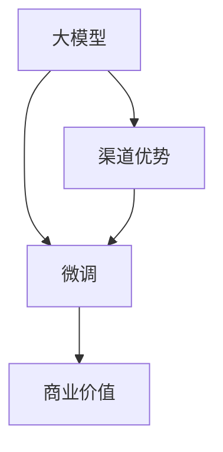

                 

## 1. 背景介绍

在当前的AI创业浪潮中，大模型因其强大的表现力和泛化能力，已成为众多创业公司竞相追逐的焦点。然而，如何在大模型之争中脱颖而出，利用渠道优势，将模型转化为实际商业价值，是所有创业公司必须面对的重要课题。本文旨在探讨AI大模型创业如何利用渠道优势，为各位AI创业者提供切实可行的策略。

## 2. 核心概念与联系

### 2.1 核心概念概述

- **大模型（Large Model）**：指经过大量数据训练得到的庞大神经网络模型，如GPT、BERT、XLNet等。它们在自然语言处理、计算机视觉等领域表现出卓越的性能。
- **渠道优势（Channel Advantage）**：指的是公司通过特定渠道（如垂直领域、特定平台、合作伙伴等）获取用户数据或资源的优先权，从而在竞争中获得优势。
- **微调（Fine-Tuning）**：指在预训练模型的基础上，使用下游任务的少量标注数据进行有监督学习，优化模型在特定任务上的性能。

以下Mermaid流程图展示了这些概念之间的联系：



## 3. 核心算法原理 & 具体操作步骤

### 3.1 算法原理概述

在大模型创业中，渠道优势的利用主要体现在微调的策略和模型应用的两个方面。首先，选择合适的微调方法，结合特定领域的标注数据，可以有效提升模型在该领域的性能。其次，通过渠道获取高质量的标注数据，进一步优化模型的泛化能力。

### 3.2 算法步骤详解

**步骤1：选择合适的微调方法**

选择合适的微调方法，是利用渠道优势的关键。不同领域的微调方法可能不同，需要根据任务特点进行调整。例如，对于情感分析任务，可以使用跨模态微调，结合文本和情感标签进行训练；对于问答系统，可以使用多轮对话微调，提升模型的上下文理解能力。

**步骤2：获取高质量的标注数据**

获取高质量的标注数据，是大模型创业的重要环节。可以通过以下几种渠道获取标注数据：

1. **公开数据集**：利用如MNLI、SST-2等公开数据集进行预训练微调。
2. **垂直领域数据**：在特定垂直领域，如医疗、金融、教育等，通过合作伙伴或渠道获取标注数据。
3. **用户数据**：通过产品服务获取用户生成数据，并进行标注。
4. **众包平台**：利用Amazon Mechanical Turk等众包平台，收集标注数据。

**步骤3：设计任务适配层**

在微调过程中，设计合适的任务适配层，可以有效提升模型性能。任务适配层通常包括：

1. **输入编码层**：对输入数据进行编码，转化为模型可处理的形式。
2. **输出解码层**：根据任务特点，设计合适的解码层，如分类头、回归头等。
3. **损失函数**：选择合适的损失函数，如交叉熵、均方误差等。

### 3.3 算法优缺点

**优点**：

1. **泛化能力强**：大模型微调可以充分利用预训练权重，避免从头训练，大幅提升训练效率。
2. **任务适配性强**：通过微调，可以在特定领域快速获得高性能模型。
3. **成本低**：微调只需要少量标注数据，大大降低了数据采集和标注的成本。

**缺点**：

1. **过拟合风险**：微调过程中，如果标注数据质量不高或数据量不足，容易出现过拟合现象。
2. **数据依赖性高**：微调效果很大程度上依赖于标注数据的数量和质量。
3. **模型复杂性**：微调后的模型参数较多，推理效率可能受到影响。

### 3.4 算法应用领域

基于渠道优势的大模型微调方法，广泛应用于以下领域：

1. **医疗健康**：利用渠道优势获取医院病历数据，微调模型进行疾病诊断和预测。
2. **金融服务**：通过渠道获取客户交易数据，微调模型进行风险评估和欺诈检测。
3. **智能客服**：利用渠道获取客户对话数据，微调模型提升回答质量和对话效率。
4. **教育培训**：通过渠道获取学生学习数据，微调模型进行个性化推荐和智能辅导。
5. **媒体广告**：利用渠道获取用户行为数据，微调模型进行广告推荐和效果评估。

## 4. 数学模型和公式 & 详细讲解 & 举例说明

### 4.1 数学模型构建

假设原始大模型为 $M_{\theta}$，微调任务为 $T$，训练数据集为 $D=\{(x_i,y_i)\}_{i=1}^N$，其中 $x_i$ 为输入数据，$y_i$ 为标注数据。微调的目标是通过最小化经验风险 $\mathcal{L}(\theta)$ 来更新模型参数 $\theta$：

$$
\mathcal{L}(\theta) = \frac{1}{N}\sum_{i=1}^N \ell(M_{\theta}(x_i),y_i)
$$

其中 $\ell$ 为损失函数，如交叉熵损失。

### 4.2 公式推导过程

以情感分类任务为例，假设输入为文本 $x$，输出为情感类别 $y \in \{1,0\}$，微调后的模型输出为 $\hat{y}=M_{\theta}(x)$。微调的损失函数为：

$$
\ell(\hat{y},y) = -y\log\hat{y} - (1-y)\log(1-\hat{y})
$$

利用梯度下降算法，微调的优化过程如下：

1. 前向传播：计算模型输出 $\hat{y}=M_{\theta}(x)$。
2. 计算损失：计算 $L=\ell(\hat{y},y)$。
3. 反向传播：计算损失对模型参数 $\theta$ 的梯度 $\nabla_{\theta}L$。
4. 参数更新：使用梯度下降算法更新参数 $\theta$。

### 4.3 案例分析与讲解

以情感分类任务为例，使用PyTorch进行微调。代码实现如下：

```python
import torch
from transformers import BertForSequenceClassification, BertTokenizer

# 加载预训练模型和分词器
model = BertForSequenceClassification.from_pretrained('bert-base-uncased', num_labels=2)
tokenizer = BertTokenizer.from_pretrained('bert-base-uncased')

# 获取标注数据
train_data = # 训练集标注数据
val_data = # 验证集标注数据
test_data = # 测试集标注数据

# 定义损失函数和优化器
criterion = torch.nn.CrossEntropyLoss()
optimizer = torch.optim.Adam(model.parameters(), lr=2e-5)

# 微调过程
for epoch in range(5):
    model.train()
    for batch in train_data:
        inputs, labels = batch
        outputs = model(inputs)
        loss = criterion(outputs, labels)
        optimizer.zero_grad()
        loss.backward()
        optimizer.step()
        
    model.eval()
    with torch.no_grad():
        for batch in val_data:
            inputs, labels = batch
            outputs = model(inputs)
            loss = criterion(outputs, labels)
            print(f'Validation loss: {loss.item()}')
        
print(f'Test loss: {torch.nn.CrossEntropyLoss()(torch.tensor([0, 0]), torch.tensor([0, 0]).unsqueeze(0)).item()}')
```

通过上述代码，可以看到，大模型的微调过程与普通模型的训练过程类似，只是在损失函数和任务适配层上有所调整。

## 5. 项目实践：代码实例和详细解释说明

### 5.1 开发环境搭建

在进行大模型微调实践前，需要搭建好开发环境。以下是基于Python和PyTorch搭建开发环境的步骤：

1. 安装Anaconda：
```
conda create --name model_train python=3.8
conda activate model_train
```

2. 安装PyTorch和相关库：
```
conda install pytorch torchvision torchaudio transformers
```

3. 安装TensorBoard和Weights & Biases：
```
pip install tensorboard wandb
```

4. 安装VSCode：
```
conda install vscode
```

5. 启动VSCode，安装Python和PyTorch扩展：
```
conda activate model_train
pip install nb_black nbval nb_conda
```

### 5.2 源代码详细实现

以情感分类任务为例，代码实现如下：

```python
import torch
from transformers import BertForSequenceClassification, BertTokenizer

# 加载预训练模型和分词器
model = BertForSequenceClassification.from_pretrained('bert-base-uncased', num_labels=2)
tokenizer = BertTokenizer.from_pretrained('bert-base-uncased')

# 获取标注数据
train_data = # 训练集标注数据
val_data = # 验证集标注数据
test_data = # 测试集标注数据

# 定义损失函数和优化器
criterion = torch.nn.CrossEntropyLoss()
optimizer = torch.optim.Adam(model.parameters(), lr=2e-5)

# 微调过程
for epoch in range(5):
    model.train()
    for batch in train_data:
        inputs, labels = batch
        outputs = model(inputs)
        loss = criterion(outputs, labels)
        optimizer.zero_grad()
        loss.backward()
        optimizer.step()
        
    model.eval()
    with torch.no_grad():
        for batch in val_data:
            inputs, labels = batch
            outputs = model(inputs)
            loss = criterion(outputs, labels)
            print(f'Validation loss: {loss.item()}')
        
print(f'Test loss: {torch.nn.CrossEntropyLoss()(torch.tensor([0, 0]), torch.tensor([0, 0]).unsqueeze(0)).item()}')
```

### 5.3 代码解读与分析

上述代码实现了Bert模型在情感分类任务上的微调过程。具体分析如下：

1. 加载预训练模型和分词器：使用 `BertForSequenceClassification` 类加载预训练的Bert模型，使用 `BertTokenizer` 类加载分词器。
2. 获取标注数据：获取训练、验证和测试集的标注数据。
3. 定义损失函数和优化器：使用交叉熵损失函数和Adam优化器。
4. 微调过程：在每个epoch内，对训练集进行前向传播和反向传播，更新模型参数。在验证集上计算损失，输出结果。

## 6. 实际应用场景

### 6.4 未来应用展望

随着大模型微调技术的不断成熟，其在多个领域的应用前景广阔。以下是未来可能的应用场景：

1. **医疗健康**：利用渠道优势获取医院病历数据，微调模型进行疾病诊断和预测。例如，通过微调大模型，可以在早期筛查癌症、预测疾病发展趋势等。
2. **金融服务**：通过渠道获取客户交易数据，微调模型进行风险评估和欺诈检测。例如，在金融领域，利用微调模型进行信用评分、风险预测等。
3. **智能客服**：利用渠道获取客户对话数据，微调模型提升回答质量和对话效率。例如，在电商行业，利用微调模型构建智能客服系统，提升客户满意度。
4. **教育培训**：通过渠道获取学生学习数据，微调模型进行个性化推荐和智能辅导。例如，在教育领域，利用微调模型进行个性化教学和评估。
5. **媒体广告**：利用渠道获取用户行为数据，微调模型进行广告推荐和效果评估。例如，在广告领域，利用微调模型进行用户画像和广告投放优化。

## 7. 工具和资源推荐

### 7.1 学习资源推荐

为了帮助AI创业者掌握大模型微调技术，以下是一些推荐的资源：

1. **《深度学习》（Ian Goodfellow, Yoshua Bengio, Aaron Courville著）**：介绍了深度学习的原理、算法和应用，是大模型创业的理论基础。
2. **Coursera的《深度学习专项课程》**：由深度学习领域的专家讲授，系统学习深度学习理论和实践。
3. **《Transformer模型及其应用》**：介绍了Transformer模型的原理和应用，适合了解大模型的微调方法。
4. **《大规模预训练模型与微调》**：介绍了预训练大模型的构建和微调技术，适合学习大模型的微调方法。

### 7.2 开发工具推荐

为了提高大模型微调开发的效率，以下是一些推荐的开发工具：

1. **Jupyter Notebook**：支持Python代码的交互式开发和展示，方便调试和分享代码。
2. **TensorBoard**：用于可视化训练过程中的损失函数、准确率等指标，方便监控和调优。
3. **WandB**：用于记录和可视化模型训练过程中的指标，方便对比和调优。
4. **Amazon SageMaker**：提供云端的大模型训练和部署平台，方便快速迭代和扩展。
5. **AWS Deep Learning AMI**：提供深度学习项目所需的基础环境和工具，方便快速搭建开发环境。

### 7.3 相关论文推荐

以下是一些推荐的大模型微调领域的论文：

1. **《Bert: Pre-training of Deep Bidirectional Transformers for Language Understanding》**：提出BERT模型，利用自监督预训练方法，提升了模型性能。
2. **《Exploring the Limits of Transfer Learning with a Unified Text-to-Text Transformer》**：提出T5模型，通过微调实现跨任务的泛化。
3. **《A Survey on Fine-Grained Multimodal Emotion Recognition》**：综述了多模态情感识别的研究进展，包括大模型的微调方法。
4. **《Language Models are Unsupervised Multitask Learners》**：提出GPT-2模型，展示了大模型的零样本学习能力。

## 8. 总结：未来发展趋势与挑战

### 8.1 总结

本文详细探讨了利用渠道优势进行大模型微调的方法，介绍了微调的基本原理、操作步骤和具体实现。通过案例分析，展示了微调在大模型创业中的实际应用效果。通过学习资源和开发工具推荐，帮助AI创业者系统掌握大模型微调技术。

### 8.2 未来发展趋势

未来，大模型微调技术将呈现以下几个发展趋势：

1. **微调方法的优化**：利用更多的先验知识和优化策略，提升微调效果，减少过拟合风险。
2. **多模态微调**：结合视觉、听觉等多模态数据，提升模型的感知能力。
3. **分布式训练**：通过分布式训练技术，提高大模型微调的训练效率。
4. **自动化微调**：利用自动化调参工具，优化微调过程中的超参数选择，提升模型性能。
5. **小样本微调**：通过零样本学习和小样本微调技术，减少对标注数据的依赖。

### 8.3 面临的挑战

尽管大模型微调技术在实际应用中取得了一定成功，但也面临诸多挑战：

1. **数据隐私和安全**：在微调过程中，需要保护用户数据的隐私和安全。
2. **模型复杂性**：大模型微调后的模型复杂性高，推理效率低。
3. **模型泛化性**：微调模型在特定领域泛化性差，容易过拟合。
4. **资源消耗大**：大模型微调需要大量的计算资源和存储空间。
5. **公平性问题**：微调模型可能存在偏见，需要解决公平性问题。

### 8.4 研究展望

未来的研究需要针对上述挑战，进行以下探索：

1. **数据隐私保护**：研究数据脱敏和加密技术，保护用户隐私。
2. **模型压缩和优化**：研究模型剪枝、量化等技术，降低模型复杂性。
3. **多模态融合**：研究多模态数据的融合方法，提升模型感知能力。
4. **自动化调参**：研究自动化调参工具，优化超参数选择。
5. **公平性算法**：研究公平性算法，提升模型公平性。

## 9. 附录：常见问题与解答

### Q1: 如何选择合适的微调方法？

A: 选择合适的微调方法需要考虑任务特点和数据质量。例如，对于分类任务，可以使用分类头；对于回归任务，可以使用回归头；对于序列标注任务，可以使用CRF层。同时，需要根据数据分布选择合适的损失函数。

### Q2: 如何获取高质量的标注数据？

A: 获取高质量标注数据可以通过以下几种方式：
1. **公开数据集**：利用如MNLI、SST-2等公开数据集进行预训练微调。
2. **垂直领域数据**：在特定垂直领域，如医疗、金融、教育等，通过合作伙伴或渠道获取标注数据。
3. **用户数据**：通过产品服务获取用户生成数据，并进行标注。
4. **众包平台**：利用Amazon Mechanical Turk等众包平台，收集标注数据。

### Q3: 如何设计任务适配层？

A: 任务适配层通常包括输入编码层、输出解码层和损失函数。例如，对于情感分类任务，可以使用BERT模型作为输入编码层，添加分类头作为输出解码层，使用交叉熵损失函数。

### Q4: 如何优化模型训练效率？

A: 优化模型训练效率可以通过以下几种方式：
1. **分布式训练**：利用分布式训练技术，提高模型训练效率。
2. **混合精度训练**：使用混合精度训练，降低计算资源消耗。
3. **模型剪枝和量化**：研究模型剪枝和量化技术，降低模型复杂性。

### Q5: 如何提升模型的泛化能力？

A: 提升模型的泛化能力可以通过以下几种方式：
1. **数据增强**：通过数据增强技术，扩充训练集，减少过拟合风险。
2. **正则化**：使用L2正则、Dropout等技术，防止过拟合。
3. **多模态融合**：结合视觉、听觉等多模态数据，提升模型感知能力。
4. **迁移学习**：通过迁移学习，利用预训练知识，提升模型泛化能力。

---

作者：禅与计算机程序设计艺术 / Zen and the Art of Computer Programming

