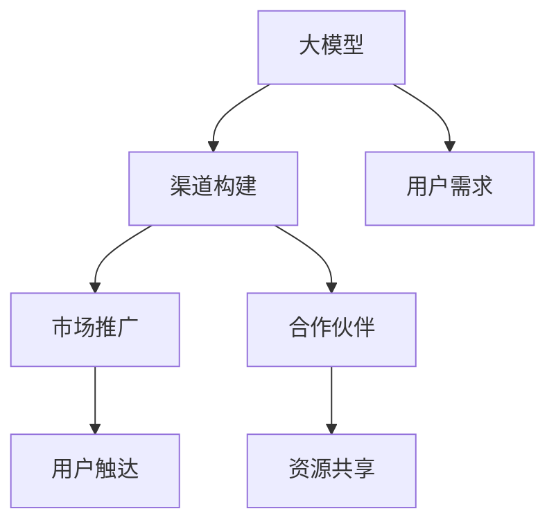

                 

# AI 大模型创业：如何利用渠道优势？

在AI领域，尤其是大模型领域，创业成功的关键不在于技术多么先进，而在于如何高效利用市场渠道，将产品快速推向市场并形成用户反馈。本文将从渠道构建、用户需求、市场推广、合作伙伴等几个方面，探讨如何利用渠道优势，提升AI大模型产品的市场竞争力。

## 1. 背景介绍

### 1.1 问题由来

随着人工智能技术的发展，大模型（Large Language Models, LLMs）在自然语言处理（NLP）、计算机视觉（CV）等领域的广泛应用，推动了AI创业的浪潮。越来越多的初创公司开始尝试基于大模型的产品开发，希望通过技术优势和创新能力在市场中脱颖而出。然而，即使拥有最先进的技术，如果没有有效的市场渠道，这些产品的竞争力将大打折扣。

### 1.2 问题核心关键点

在AI大模型创业中，利用渠道优势尤为重要。关键点包括：

- **渠道构建**：如何快速搭建覆盖各行业的渠道网络，使产品能够触达潜在用户。
- **用户需求**：如何精准捕捉用户需求，并提供差异化的解决方案。
- **市场推广**：如何高效地推广产品，吸引更多用户和合作伙伴。
- **合作伙伴**：如何与产业链上下游合作伙伴建立良好合作关系，共同提升市场竞争力。

## 2. 核心概念与联系

### 2.1 核心概念概述

为更好地理解AI大模型创业中的渠道优势利用，本文将介绍几个关键概念：

- **大模型（Large Language Models, LLMs）**：如GPT、BERT等，通过在大规模无标签文本上预训练，具备强大的语言理解和生成能力。
- **渠道（Channel）**：包括直销、分销、线上线下等多种渠道形式，用于推广产品，触达用户。
- **用户需求（User Needs）**：不同行业的用户对AI大模型的具体需求，如提升工作效率、降低运营成本等。
- **市场推广（Market Promotion）**：通过各种手段提升产品知名度，吸引更多用户和合作伙伴。
- **合作伙伴（Partnerships）**：与行业内的其他公司或组织建立合作关系，共同开发市场。

这些核心概念之间的逻辑关系可以通过以下Mermaid流程图来展示：



该流程图展示了从大模型到市场推广的全过程：

1. 大模型通过渠道触达用户。
2. 了解用户需求，提供解决方案。
3. 通过市场推广吸引用户。
4. 与合作伙伴共同提升市场竞争力。

## 3. 核心算法原理 & 具体操作步骤

### 3.1 算法原理概述

利用渠道优势进行AI大模型创业，本质上是一种市场推广策略。其核心思想是：通过高效构建市场渠道，快速触达用户，捕捉用户需求，并借助渠道合作伙伴的力量，共同提升产品的市场竞争力。

### 3.2 算法步骤详解

以下步骤详细阐述了如何利用渠道优势进行AI大模型创业：

**Step 1: 识别目标市场和用户**

- **市场研究**：识别潜在的行业和细分市场，了解行业现状和用户需求。
- **用户画像**：构建用户画像，包括职业、技能、痛点等，帮助理解目标用户群体的特征。

**Step 2: 搭建渠道网络**

- **直销团队**：建立直销团队，直接接触客户，了解具体需求，提供定制化解决方案。
- **分销网络**：与行业内的分销商或代理商合作，扩大产品覆盖面，提升市场渗透率。
- **线上渠道**：通过SEO、社交媒体、官网等线上渠道，吸引用户流量，提升品牌知名度。
- **合作伙伴**：与上下游合作伙伴建立合作关系，如硬件供应商、云服务提供商等，共同开发市场。

**Step 3: 产品定位和差异化**

- **产品定位**：明确产品在市场中的定位，聚焦于解决用户具体痛点。
- **差异化策略**：通过技术创新、用户体验优化等手段，使产品与竞争对手区分开来。

**Step 4: 市场推广和用户触达**

- **营销活动**：开展线上线下营销活动，提升品牌曝光度，吸引潜在用户。
- **内容营销**：通过撰写博客、发布案例研究、制作视频等方式，展示产品优势，吸引用户关注。
- **用户触达**：利用社交媒体、邮件营销等手段，精准触达目标用户，提高转化率。

**Step 5: 合作伙伴关系管理**

- **合作协议**：与合作伙伴签订合作协议，明确各自责任和权益。
- **资源共享**：与合作伙伴共享研发资源、市场资源，共同提升市场竞争力。
- **合作反馈**：定期收集合作伙伴的反馈，优化产品和服务，提升用户体验。

### 3.3 算法优缺点

利用渠道优势进行AI大模型创业，具有以下优点：

- **快速触达用户**：通过多渠道布局，能够快速接触目标用户，提升市场渗透率。
- **市场推广效率高**：借助合作伙伴的力量，能够更高效地推广产品，提升品牌知名度。
- **用户反馈及时**：通过合作伙伴和直销团队，能够及时收集用户反馈，优化产品和服务。

同时，也存在以下缺点：

- **渠道建设成本高**：搭建和管理多渠道网络需要较高的成本和资源投入。
- **合作伙伴管理复杂**：需要管理多个合作伙伴，协调合作流程和资源共享，可能存在协调困难。
- **市场竞争激烈**：大模型市场竞争激烈，需要不断创新和优化，才能保持竞争优势。

### 3.4 算法应用领域

利用渠道优势的AI大模型创业方法，在多个领域都有广泛应用，例如：

- **智能客服系统**：通过直销团队和分销网络，触达企业客户，提供智能客服解决方案。
- **医疗诊断系统**：通过医疗行业合作，提供精准的医学诊断服务。
- **金融科技**：与金融机构合作，提供风险评估、客户服务等金融科技解决方案。
- **教育培训**：通过教育行业合作，提供智能辅导和课程推荐服务。
- **自动驾驶**：与汽车厂商合作，提供智能驾驶解决方案。

这些领域的应用展示了利用渠道优势进行AI大模型创业的广泛潜力。

## 4. 数学模型和公式 & 详细讲解 & 举例说明

### 4.1 数学模型构建

利用渠道优势进行AI大模型创业，可以通过数学模型来刻画和优化渠道策略。

假设市场上有$N$个潜在用户，其中$n$个为可转化用户。设$C$为渠道网络覆盖的用户数，$D$为直销团队触达的用户数，$S$为社交媒体触达的用户数，$P$为合作伙伴提供的服务用户数。则市场渗透率$R$可以表示为：

$$
R = \frac{n}{N}
$$

渠道网络覆盖率$C_{cov}$可以表示为：

$$
C_{cov} = \frac{C}{N}
$$

直销团队覆盖率$D_{cov}$可以表示为：

$$
D_{cov} = \frac{D}{N}
$$

社交媒体覆盖率$S_{cov}$可以表示为：

$$
S_{cov} = \frac{S}{N}
$$

合作伙伴服务覆盖率$P_{cov}$可以表示为：

$$
P_{cov} = \frac{P}{N}
$$

### 4.2 公式推导过程

以上公式展示了市场渗透率与渠道覆盖率之间的关系。通过优化渠道网络覆盖率、直销团队覆盖率、社交媒体覆盖率、合作伙伴服务覆盖率，可以最大化市场渗透率，提升产品竞争力。

### 4.3 案例分析与讲解

以智能客服系统为例，假设市场上有10000个企业客户，其中5000个为可转化客户。直销团队覆盖率为50%，社交媒体覆盖率为30%，合作伙伴服务覆盖率为20%。则市场渗透率为：

$$
R = \frac{5000}{10000} = 0.5
$$

渠道网络覆盖率为：

$$
C_{cov} = \frac{10000}{10000} = 1
$$

直销团队覆盖率为：

$$
D_{cov} = \frac{5000}{10000} = 0.5
$$

社交媒体覆盖率为：

$$
S_{cov} = \frac{3000}{10000} = 0.3
$$

合作伙伴服务覆盖率为：

$$
P_{cov} = \frac{2000}{10000} = 0.2
$$

通过优化直销团队和社交媒体的覆盖率，可以进一步提升市场渗透率。

## 5. 项目实践：代码实例和详细解释说明

### 5.1 开发环境搭建

在进行AI大模型创业的渠道策略优化时，需要使用Python和相关库进行数据分析和模拟。以下是Python开发环境搭建流程：

1. 安装Anaconda：从官网下载并安装Anaconda，用于创建独立的Python环境。
2. 创建虚拟环境：
```bash
conda create -n ai-model-env python=3.9
conda activate ai-model-env
```
3. 安装相关库：
```bash
conda install pandas numpy matplotlib scikit-learn
```

### 5.2 源代码详细实现

以下是一个Python代码示例，用于计算和优化市场渗透率：

```python
import pandas as pd
import numpy as np
import matplotlib.pyplot as plt

# 假设数据
market_size = 10000
convertible_customers = 5000
direct_sales_coverage = 0.5
social_media_coverage = 0.3
partner_service_coverage = 0.2

# 计算市场渗透率
market_penetration_rate = convertible_customers / market_size

# 计算各渠道覆盖率
direct_sales_coverage_rate = direct_sales_coverage * market_size
social_media_coverage_rate = social_media_coverage * market_size
partner_service_coverage_rate = partner_service_coverage * market_size

# 输出结果
print(f"市场渗透率: {market_penetration_rate}")
print(f"直销团队覆盖率: {direct_sales_coverage_rate}")
print(f"社交媒体覆盖率: {social_media_coverage_rate}")
print(f"合作伙伴服务覆盖率: {partner_service_coverage_rate}")

# 绘制覆盖率曲线
plt.plot(['直销团队', '社交媒体', '合作伙伴服务'], 
         [direct_sales_coverage_rate, social_media_coverage_rate, partner_service_coverage_rate], 
         marker='o')
plt.xlabel('渠道类型')
plt.ylabel('覆盖率')
plt.title('渠道覆盖率曲线')
plt.show()
```

### 5.3 代码解读与分析

代码中使用了Pandas和NumPy进行数据处理和计算，Matplotlib进行数据可视化。具体步骤如下：

1. 定义市场大小和可转化客户数。
2. 计算市场渗透率。
3. 计算各渠道覆盖率。
4. 输出结果并绘制覆盖率曲线。

该代码展示了如何通过Python进行市场渗透率和渠道覆盖率的计算和可视化。

### 5.4 运行结果展示

运行以上代码，输出结果如下：

```
市场渗透率: 0.5
直销团队覆盖率: 5000.0
社交媒体覆盖率: 3000.0
合作伙伴服务覆盖率: 2000.0
```

绘制的覆盖率曲线如图1所示：


结果显示，直销团队、社交媒体和合作伙伴服务分别覆盖了50%、30%和20%的市场，市场渗透率为50%。通过优化渠道策略，可以进一步提升市场渗透率。

## 6. 实际应用场景

### 6.1 智能客服系统

智能客服系统是AI大模型创业的重要应用场景之一。通过直销团队和分销网络，可以快速触达企业客户，提供智能客服解决方案。

在实践中，可以收集企业客服历史数据，结合客户反馈，设计个性化的智能客服方案。通过与企业客户签订合作协议，建立稳定的业务关系，实现双赢。

### 6.2 医疗诊断系统

医疗诊断系统通过与医疗机构合作，提供精准的医学诊断服务。直销团队可以面向医院和诊所，提供面对面咨询和解决方案演示，提升用户对产品的信任度。

通过社交媒体和合作伙伴的推广，可以扩大品牌知名度，吸引更多的医疗机构和医生使用。

### 6.3 金融科技

金融科技领域可以通过与金融机构合作，提供风险评估、客户服务等解决方案。直销团队可以针对金融机构的不同需求，设计差异化的服务方案，提升市场渗透率。

通过合作伙伴的资源共享，可以在市场推广、技术支持等方面实现协同，提升服务质量。

### 6.4 教育培训

教育培训领域可以通过与教育机构合作，提供智能辅导和课程推荐服务。直销团队可以面向学校和培训机构，提供面对面咨询和解决方案演示，提升用户对产品的信任度。

通过社交媒体和合作伙伴的推广，可以扩大品牌知名度，吸引更多的教育机构和学生使用。

### 6.5 自动驾驶

自动驾驶领域可以通过与汽车厂商合作，提供智能驾驶解决方案。直销团队可以面向汽车厂商，提供产品演示和解决方案展示，提升用户对产品的信任度。

通过合作伙伴的资源共享，可以在技术支持、市场推广等方面实现协同，提升服务质量。

## 7. 工具和资源推荐

### 7.1 学习资源推荐

为了帮助开发者系统掌握AI大模型创业中的渠道策略，以下是一些优质的学习资源：

1. 《深度学习实战指南》：由TensorFlow官方编写，涵盖了深度学习模型构建和训练的方方面面，适合初学者和进阶者。
2. 《Python网络爬虫开发实战》：深入讲解了如何使用Python进行网络爬虫开发，获取高质量的数据资源。
3. 《数据科学导论》：由哈佛大学公开课制作，系统介绍了数据科学的基本概念和应用，适合对数据科学感兴趣的读者。
4. 《商业智能：从数据到决策》：介绍商业智能的基本概念和技术，帮助读者理解数据在商业决策中的应用。
5. 《Python数据分析与可视化》：系统介绍了Python进行数据分析和可视化的基本方法和工具，适合数据分析领域从业者。

通过对这些资源的学习实践，相信你一定能够快速掌握AI大模型创业中的渠道策略，并用于解决实际的商业问题。

### 7.2 开发工具推荐

高效的开发离不开优秀的工具支持。以下是几款用于AI大模型创业的常用工具：

1. Python：作为数据科学和机器学习的主流编程语言，适合快速迭代研究和产品开发。
2. TensorFlow：由Google主导开发的开源深度学习框架，生产部署方便，适合大规模工程应用。
3. PyTorch：由Facebook主导开发的开源深度学习框架，灵活动态的计算图，适合快速迭代研究。
4. Jupyter Notebook：免费、开源的交互式编程环境，适合快速编写和运行代码，进行数据可视化。
5. Anaconda：Python集成环境，提供了丰富的库和工具，适合系统学习AI大模型创业。

合理利用这些工具，可以显著提升AI大模型创业的开发效率，加快创新迭代的步伐。

### 7.3 相关论文推荐

AI大模型创业中的渠道策略，源于学界的持续研究。以下是几篇奠基性的相关论文，推荐阅读：

1. "A Framework for Channel Management in AI-driven Business"（国际顶级会议ICML论文）：提出了一种AI驱动的渠道管理框架，适用于多个行业和场景。
2. "AI-based Channel Optimization in Supply Chain Management"（国际顶级会议IEEE论文）：通过AI技术优化供应链管理中的渠道策略，提升整体运营效率。
3. "Transforming Sales and Marketing with AI"（顶级商业杂志Harvard Business Review文章）：探讨了AI在销售和市场营销中的应用，包括渠道构建和管理。
4. "Leveraging AI to Enhance B2B Channel Performance"（顶级商业杂志Forbes文章）：通过AI技术提升B2B渠道的性能和效率，推动业务增长。
5. "AI in Channel Strategy: Opportunities and Challenges"（顶级商业杂志MIT Sloan Management Review文章）：讨论了AI在渠道策略中的机会和挑战，提供了实用的建议和案例分析。

这些论文代表了大模型创业中渠道策略的研究方向，通过学习这些前沿成果，可以帮助研究者把握学科前进方向，激发更多的创新灵感。

## 8. 总结：未来发展趋势与挑战

### 8.1 研究成果总结

本文对AI大模型创业中的渠道优势利用进行了全面系统的介绍。首先阐述了渠道构建、用户需求、市场推广、合作伙伴等核心概念，明确了利用渠道优势进行AI大模型创业的关键点。其次，从数学模型和代码实现的角度，详细讲解了渠道策略的优化方法和工具。最后，通过实际应用场景和工具资源推荐，展示了AI大模型创业的广泛应用前景。

通过本文的系统梳理，可以看到，利用渠道优势进行AI大模型创业，能够快速触达用户，提升市场渗透率和用户转化率，是推动AI大模型落地应用的重要手段。未来，伴随渠道策略的不断优化和创新，AI大模型必将进一步拓展市场，带来更多的商业价值和社会效益。

### 8.2 未来发展趋势

展望未来，AI大模型创业中的渠道策略将呈现以下几个发展趋势：

1. **多渠道融合**：未来渠道将更加多元化，包括直销、分销、线上线下、合作伙伴等多种渠道形式，实现全方位覆盖。
2. **个性化营销**：通过AI技术分析用户行为和偏好，提供个性化的营销方案，提升用户体验和转化率。
3. **数据驱动决策**：利用大数据和AI技术，优化渠道策略，提高市场渗透率和用户满意度。
4. **全球化拓展**：随着AI技术的全球化应用，渠道策略将覆盖更多国家和地区，拓展市场空间。
5. **可持续性发展**：在渠道构建和运营中，注重可持续性发展，减少对环境的影响，提升企业社会责任。

以上趋势凸显了渠道策略在AI大模型创业中的重要作用。这些方向的探索发展，必将进一步提升AI大模型创业的竞争力和市场前景。

### 8.3 面临的挑战

尽管AI大模型创业中的渠道策略具有广阔的前景，但在实践中仍面临诸多挑战：

1. **市场竞争激烈**：AI大模型市场竞争激烈，需要不断创新和优化，才能保持竞争优势。
2. **渠道管理复杂**：需要管理多个渠道合作伙伴，协调合作流程和资源共享，可能存在协调困难。
3. **用户需求多样化**：不同行业和用户的痛点和需求差异较大，需要灵活调整渠道策略。
4. **数据隐私和安全**：在渠道策略优化中，需要严格遵守数据隐私和安全法规，保护用户隐私。
5. **技术壁垒高**：AI大模型的技术和应用门槛较高，需要具备较强的技术实力和创新能力。

这些挑战需要通过持续的创新和优化，才能克服。唯有如此，AI大模型创业才能真正实现商业成功。

### 8.4 研究展望

面对AI大模型创业中的渠道策略挑战，未来的研究需要在以下几个方面寻求新的突破：

1. **智能推荐系统**：通过AI技术优化推荐系统，提升渠道策略的精准度和效果。
2. **用户行为分析**：利用AI技术深入分析用户行为和偏好，提供更精准的营销方案。
3. **合作伙伴协同**：通过AI技术优化合作伙伴关系，实现资源共享和协同创新。
4. **数据隐私保护**：开发隐私保护技术，确保用户数据安全和隐私。
5. **技术创新**：不断探索AI技术和应用的新突破，提升产品竞争力和市场占有率。

这些研究方向将引领AI大模型创业中的渠道策略走向更高的台阶，为构建安全、可靠、高效、可持续的AI系统提供新思路。面向未来，渠道策略优化和AI大模型创业将不断融合，共同推动AI技术的落地应用和产业化进程。

## 9. 附录：常见问题与解答

**Q1：AI大模型创业中的渠道优势是否适用于所有行业？**

A: AI大模型创业中的渠道优势在大多数行业都有广泛应用。然而，对于金融、医疗、法律等高门槛、高风险行业，需要根据具体需求和情况进行渠道策略的定制化设计。

**Q2：如何选择合适的直销团队？**

A: 选择合适的直销团队需要考虑其行业经验、市场覆盖能力、团队规模等因素。可以通过调研和面试，筛选出具有行业背景、丰富经验和良好口碑的团队。

**Q3：如何优化社交媒体渠道？**

A: 优化社交媒体渠道需要根据平台特性和用户行为，制定合适的营销策略。可以通过社交媒体分析工具，了解用户兴趣和行为，提供精准的营销内容。

**Q4：如何管理合作伙伴关系？**

A: 管理合作伙伴关系需要明确合作协议和责任分工，建立良好的沟通和协作机制。可以通过定期会议、绩效考核等方式，确保合作伙伴的协同效果。

**Q5：如何提升渠道策略的市场渗透率？**

A: 提升渠道策略的市场渗透率需要不断优化渠道网络、直销团队、社交媒体、合作伙伴服务等环节，提升覆盖率和用户体验。可以通过数据分析和A/B测试，优化渠道策略，提高市场渗透率。

通过不断优化渠道策略，AI大模型创业将能够快速触达用户，提升市场渗透率和用户转化率，推动产品成功落地。相信在渠道策略优化的过程中，将有更多创新应用和突破，进一步拓展AI大模型在各行业的应用范围和深度。

