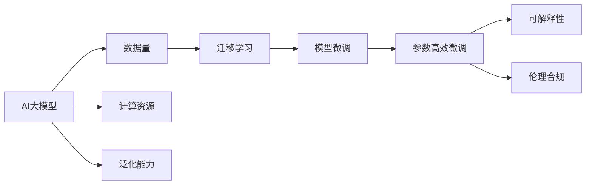

                 

# AI 大模型创业：如何利用竞争优势？

## 1. 背景介绍

在当下激烈的市场竞争中，AI大模型成为众多科技公司争相追逐的战略高地。作为新技术的代表，大模型凭借其强大的数据处理能力和泛化能力，在图像识别、语音识别、自然语言处理等多个领域展现了卓越的性能。然而，仅依靠大模型的技术实力，并不能保证企业在市场中脱颖而出。本文将探讨如何利用AI大模型的竞争优势，结合业务战略和市场环境，打造具有独特竞争力的创业企业。

## 2. 核心概念与联系

### 2.1 核心概念概述

- **AI大模型（AI Large Model）**：指使用深度学习技术，基于大规模数据训练出的具有通用泛化能力的模型，如GPT-3、BERT等。
- **数据量（Data Volume）**：大模型通过大规模数据训练，具备强大的表示学习能力。数据量越大，模型越能捕捉复杂的关系和规律。
- **计算资源（Computing Resource）**：训练大模型需要高性能的计算资源，包括GPU、TPU等。计算资源越丰富，训练速度越快，模型越精确。
- **泛化能力（Generalization）**：大模型在未见过的数据上表现优异，通过泛化学习新知识，提升模型应用范围和效果。
- **迁移学习（Transfer Learning）**：利用预训练模型的能力，在特定任务上进行微调，提高模型效果。
- **模型微调（Model Fine-tuning）**：在特定任务上对预训练模型进行参数更新，优化模型表现。
- **参数高效微调（Parameter-Efficient Fine-tuning）**：仅更新模型中少部分参数，避免大量参数更新导致的过拟合。
- **可解释性（Explainability）**：模型决策过程透明，可解释性强，有助于增强用户信任。
- **伦理合规（Ethics and Compliance）**：确保模型输出符合法律、伦理要求，不涉及隐私泄露、偏见歧视等问题。

### 2.2 核心概念原理和架构的 Mermaid 流程图



## 3. 核心算法原理 & 具体操作步骤

### 3.1 算法原理概述

AI大模型的核心算法原理是通过大规模无监督学习，捕捉数据中的隐含规律，形成强大的数据表示能力。在特定任务上进行微调，通过有监督学习，进一步优化模型在特定任务上的性能。大模型之所以能成为创业企业的竞争优势，主要体现在以下几个方面：

1. **数据泛化能力**：大模型通过大规模数据训练，能够泛化到新数据，提升模型在不同场景下的表现。
2. **高效微调**：通过迁移学习和微调，大模型可以在短时间内适应特定任务，提升模型效率和效果。
3. **广泛应用场景**：大模型在图像识别、语音识别、自然语言处理等多个领域展现出卓越性能，广泛应用于众多业务场景。
4. **强大的计算能力**：大模型需要高性能计算资源进行训练，能够快速处理海量数据。
5. **可解释性强**：随着大模型的不断发展，其决策过程更加透明，有助于增强用户信任。
6. **伦理合规**：大模型在开发和应用过程中需遵守伦理规范，确保模型输出符合法律法规要求。

### 3.2 算法步骤详解

1. **数据准备**：收集并整理相关领域的数据，清洗并标注数据，准备数据集。
2. **模型选择**：选择合适的AI大模型作为初始化模型，如BERT、GPT-3等。
3. **迁移学习**：利用预训练模型的能力，在特定任务上进行微调，提高模型效果。
4. **模型微调**：在特定任务上对预训练模型进行参数更新，优化模型表现。
5. **参数高效微调**：仅更新模型中少部分参数，避免大量参数更新导致的过拟合。
6. **模型评估**：在验证集上评估模型表现，根据评估结果调整模型参数和训练策略。
7. **模型部署**：将优化后的模型部署到实际应用中，集成到产品或服务中。
8. **持续改进**：根据实际应用中的反馈，不断优化和改进模型。

### 3.3 算法优缺点

AI大模型的主要优点包括：

- **泛化能力强**：能够高效处理海量数据，提升模型泛化能力。
- **高效微调**：通过迁移学习和微调，快速适应特定任务，提升模型效率和效果。
- **广泛应用场景**：在多个领域展现出卓越性能，广泛应用于不同业务场景。
- **计算能力强**：需要高性能计算资源进行训练，能够快速处理大规模数据。
- **可解释性强**：随着大模型的不断发展，其决策过程更加透明，有助于增强用户信任。

主要缺点包括：

- **数据依赖性高**：依赖大规模数据进行训练，数据量不足时表现较差。
- **资源消耗大**：需要高性能计算资源进行训练，资源消耗较大。
- **过拟合风险高**：在特定任务上进行微调时，可能出现过拟合的风险。
- **伦理风险高**：模型输出需符合法律、伦理规范，避免偏见歧视等问题。

### 3.4 算法应用领域

AI大模型在多个领域展现出卓越性能，包括：

- **自然语言处理（NLP）**：如情感分析、机器翻译、问答系统等。
- **计算机视觉（CV）**：如图像识别、目标检测、图像生成等。
- **语音识别（ASR）**：如语音转文本、文本转语音等。
- **推荐系统**：如个性化推荐、内容推荐等。
- **医疗健康**：如疾病诊断、基因组分析等。
- **金融服务**：如信用评估、风险管理等。

## 4. 数学模型和公式 & 详细讲解 & 举例说明

### 4.1 数学模型构建

AI大模型的数学模型通常基于深度神经网络，通过大规模数据训练，捕捉数据的隐含规律。在特定任务上进行微调时，通常采用监督学习的方式，将任务作为标签，进行模型训练。

### 4.2 公式推导过程

以图像识别任务为例，假设模型的输入为图像 $x$，输出为类别标签 $y$。常用的模型为卷积神经网络（CNN），其中 $f$ 表示模型映射函数，$\theta$ 表示模型参数。模型训练的损失函数为交叉熵损失函数：

$$
\mathcal{L} = -\frac{1}{N}\sum_{i=1}^{N}\log p(y_i|x_i)
$$

其中 $p(y_i|x_i)$ 表示模型在给定输入 $x_i$ 下预测类别 $y_i$ 的概率，$N$ 表示样本数量。

### 4.3 案例分析与讲解

以BERT模型为例，BERT通过在大规模无监督数据上进行预训练，学习到丰富的语言表示。在特定任务上进行微调时，通常需要构建任务特定的输出层，如分类任务中添加线性分类器，生成任务中添加生成器。微调过程通过反向传播算法，更新模型参数，最小化损失函数。

## 5. 项目实践：代码实例和详细解释说明

### 5.1 开发环境搭建

1. 安装Python环境，建议使用虚拟环境。
2. 安装深度学习框架，如TensorFlow、PyTorch等。
3. 安装相关库，如NumPy、Pandas等。
4. 下载预训练模型，如BERT、GPT-3等。

### 5.2 源代码详细实现

以BERT模型在情感分析任务上进行微调为例，代码实现如下：

```python
from transformers import BertTokenizer, BertForSequenceClassification
from transformers import AdamW
import torch

# 初始化数据集
train_dataset = ...
dev_dataset = ...
test_dataset = ...

# 初始化模型
model = BertForSequenceClassification.from_pretrained('bert-base-cased', num_labels=2)

# 初始化优化器
optimizer = AdamW(model.parameters(), lr=2e-5)

# 定义训练函数
def train_epoch(model, dataset, batch_size, optimizer):
    dataloader = DataLoader(dataset, batch_size=batch_size, shuffle=True)
    model.train()
    for batch in dataloader:
        input_ids = batch['input_ids'].to(device)
        attention_mask = batch['attention_mask'].to(device)
        labels = batch['labels'].to(device)
        model.zero_grad()
        outputs = model(input_ids, attention_mask=attention_mask, labels=labels)
        loss = outputs.loss
        loss.backward()
        optimizer.step()

# 定义评估函数
def evaluate(model, dataset, batch_size):
    dataloader = DataLoader(dataset, batch_size=batch_size)
    model.eval()
    preds, labels = [], []
    with torch.no_grad():
        for batch in dataloader:
            input_ids = batch['input_ids'].to(device)
            attention_mask = batch['attention_mask'].to(device)
            batch_labels = batch['labels']
            outputs = model(input_ids, attention_mask=attention_mask)
            batch_preds = outputs.logits.argmax(dim=2).to('cpu').tolist()
            batch_labels = batch_labels.to('cpu').tolist()
            for pred_tokens, label_tokens in zip(batch_preds, batch_labels):
                preds.append(pred_tokens[:len(label_tokens)])
                labels.append(label_tokens)

    return preds, labels

# 定义微调函数
def fine_tune(model, train_dataset, dev_dataset, test_dataset, epochs=5, batch_size=16):
    device = torch.device('cuda' if torch.cuda.is_available() else 'cpu')
    model.to(device)
    for epoch in range(epochs):
        train_epoch(model, train_dataset, batch_size, optimizer)
        dev_preds, dev_labels = evaluate(model, dev_dataset, batch_size)
        test_preds, test_labels = evaluate(model, test_dataset, batch_size)
        print(f"Epoch {epoch+1}, dev accuracy: {accuracy(dev_preds, dev_labels):.2f}, test accuracy: {accuracy(test_preds, test_labels):.2f}")

# 定义准确率函数
def accuracy(preds, labels):
    return sum(int(pred == label) for pred, label in zip(preds, labels)) / len(labels)

# 开始微调
fine_tune(model, train_dataset, dev_dataset, test_dataset)
```

### 5.3 代码解读与分析

上述代码展示了从数据集准备、模型初始化、训练、评估到微调的全过程。

1. **数据集准备**：数据集应包含输入数据和相应的标签。
2. **模型初始化**：使用预训练模型，如BERT。
3. **训练函数**：通过反向传播算法，更新模型参数，最小化损失函数。
4. **评估函数**：在验证集和测试集上评估模型性能。
5. **微调函数**：在特定任务上进行微调，提升模型效果。

## 6. 实际应用场景

### 6.1 智能客服系统

智能客服系统利用AI大模型进行情感分析，实现自动化客户服务。通过微调，大模型能够快速适应不同领域、不同场景的客户咨询，提供自然流畅的回复。

### 6.2 金融舆情监测

金融舆情监测系统利用AI大模型进行情感分析和文本分类，实时监测市场舆情，及时发现和应对负面信息，避免金融风险。

### 6.3 个性化推荐系统

个性化推荐系统利用AI大模型进行内容推荐，通过微调提升推荐精度，实现更高效的个性化服务。

### 6.4 未来应用展望

未来，AI大模型将在更多领域得到应用，如医疗健康、智慧城市、智能制造等。通过不断优化和改进，AI大模型将具备更强的泛化能力和应用灵活性。

## 7. 工具和资源推荐

### 7.1 学习资源推荐

1. **Deep Learning Specialization**：由Andrew Ng教授主讲，涵盖深度学习基础和高级课程，包括TensorFlow、PyTorch等。
2. **Transformers库官方文档**：提供了大量的预训练模型和微调样例代码，适合快速上手。
3. **Arxiv预印本**：获取最新的AI大模型研究成果和论文。

### 7.2 开发工具推荐

1. **Jupyter Notebook**：交互式数据处理和模型开发工具，支持Python等语言。
2. **TensorBoard**：可视化工具，方便监测模型训练过程。
3. **Weights & Biases**：实验跟踪工具，记录和分析模型训练结果。

### 7.3 相关论文推荐

1. **BERT: Pre-training of Deep Bidirectional Transformers for Language Understanding**：提出BERT模型，引入掩码语言模型任务。
2. **GPT-3: Language Models are Unsupervised Multitask Learners**：展示GPT-3的强大自监督学习能力和零样本生成能力。
3. **Attention is All You Need**：提出Transformer结构，推动预训练大模型的发展。

## 8. 总结：未来发展趋势与挑战

### 8.1 研究成果总结

AI大模型在多个领域展现出卓越性能，成为创业企业的有力工具。大模型的泛化能力、高效微调和广泛应用场景，使其成为行业竞争的重要筹码。

### 8.2 未来发展趋势

1. **模型规模持续增大**：预训练模型参数量不断增加，提升模型泛化能力。
2. **高效微调技术发展**：开发更多参数高效微调方法，优化模型训练过程。
3. **多模态融合**：融合视觉、语音等多模态数据，提升模型表现。
4. **智能决策系统**：构建基于AI大模型的智能决策系统，提升决策自动化水平。
5. **联邦学习**：在分布式环境下进行模型训练和微调，保护数据隐私。

### 8.3 面临的挑战

1. **数据依赖性强**：依赖大规模数据进行训练，数据获取成本高。
2. **计算资源需求大**：训练和推理过程中需要高性能计算资源。
3. **过拟合风险高**：微调过程中可能出现过拟合风险。
4. **伦理合规问题**：模型输出需符合法律法规和伦理规范。
5. **可解释性不足**：大模型决策过程不透明，难以解释。

### 8.4 研究展望

未来AI大模型研究将重点关注以下几个方面：

1. **无监督学习和少样本学习**：探索更多无监督和少样本学习技术，减少对标注数据的依赖。
2. **参数高效微调**：开发更多参数高效微调方法，提升模型训练效率。
3. **跨模态学习**：融合视觉、语音等多模态数据，提升模型泛化能力。
4. **智能决策系统**：构建基于AI大模型的智能决策系统，提升决策自动化水平。
5. **联邦学习**：在分布式环境下进行模型训练和微调，保护数据隐私。

## 9. 附录：常见问题与解答

**Q1：AI大模型训练需要哪些计算资源？**

A: AI大模型训练需要高性能计算资源，如GPU、TPU等。通常需要配备多个GPU或TPU进行分布式训练。

**Q2：AI大模型在特定任务上的微调策略有哪些？**

A: AI大模型在特定任务上的微调策略包括迁移学习、微调、参数高效微调等。常用的微调方法有：
- 迁移学习：利用预训练模型的能力，在特定任务上进行微调。
- 微调：在特定任务上对预训练模型进行参数更新，优化模型表现。
- 参数高效微调：仅更新模型中少部分参数，避免大量参数更新导致的过拟合。

**Q3：AI大模型的可解释性有哪些挑战？**

A: AI大模型的可解释性主要面临以下挑战：
- 模型复杂度高，难以理解模型内部机制。
- 模型黑盒性质，难以解释决策过程。
- 模型输出结果不透明，难以解释推理依据。

**Q4：AI大模型在应用中需要注意哪些伦理问题？**

A: AI大模型在应用中需要注意以下伦理问题：
- 数据隐私保护：确保用户数据隐私，避免数据泄露。
- 模型偏见问题：避免模型输出存在偏见，保障公平公正。
- 伦理合规性：模型输出需符合法律法规和伦理规范。

**Q5：如何提高AI大模型的泛化能力？**

A: 提高AI大模型的泛化能力主要从以下几个方面入手：
- 数据多样性：增加数据多样性，涵盖不同场景和领域。
- 数据质量：确保数据质量，避免噪声数据。
- 模型架构：优化模型架构，提升模型泛化能力。
- 模型训练策略：采用正则化、对抗训练等方法，提升模型鲁棒性。

作者：禅与计算机程序设计艺术 / Zen and the Art of Computer Programming

