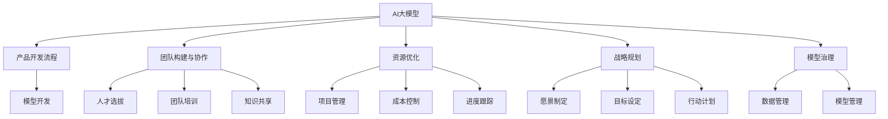

                 

# AI 大模型创业：如何利用管理优势？

> 关键词：AI 大模型, 创业, 管理优势, 领导力, 团队构建, 资源优化, 战略规划

## 1. 背景介绍

### 1.1 问题由来
随着人工智能技术的不断进步，AI大模型成为了科技创业的焦点。然而，开发和部署AI大模型并非易事，它们需要大规模的数据、高性能的计算资源和复杂的算法，对企业资源和管理提出了很高的要求。许多创业公司在这一领域面临挑战：如何有效利用管理优势，将AI大模型落地并实现商业化？本文将探讨如何通过管理层面的优化，提升AI大模型的创业成功率。

### 1.2 问题核心关键点
AI大模型创业的核心关键点包括：
- 如何构建高效的产品开发流程，加速模型开发和迭代？
- 如何组建具备专业技能的团队，并保持团队的协作与创新？
- 如何优化资源配置，平衡技术研发与商业化需求？
- 如何制定明确的战略规划，驱动模型应用落地？
- 如何通过数据和模型治理，确保模型质量和可靠性？

这些问题需要通过系统的管理措施来解决，才能提升AI大模型创业的成功率。

## 2. 核心概念与联系

### 2.1 核心概念概述

为了深入理解如何利用管理优势，首先需要明确几个关键概念：

- **AI大模型**：基于深度学习技术的超大规模模型，如GPT-3、BERT等，具备强大的自然语言处理能力。
- **创业管理**：企业从初创期到成长期的管理实践，涉及战略规划、团队构建、资源配置、风险控制等方面。
- **产品开发流程**：从需求分析、模型开发、测试验证到部署上线的完整流程。
- **团队构建与协作**：选拔、培训和管理一支具备AI和业务技能的团队，促进知识共享与创新。
- **资源优化**：通过合理的资源配置和项目管理，确保项目在时间、成本和质量上的高效执行。
- **战略规划**：明确企业的愿景、目标和行动计划，指导AI大模型的研发与商业化。
- **模型治理**：制定数据与模型的管理制度，确保模型的质量、安全和合规。

这些概念之间的逻辑关系可以通过以下Mermaid流程图来展示：



这个流程图展示出AI大模型创业过程中各个环节之间的依赖关系：

1. AI大模型的开发需要借助高效的产品开发流程。
2. 团队协作是成功开发的前提，需要选拔合适的团队成员，并进行系统培训。
3. 资源优化是项目管理的核心，需要合理配置资源，进行成本控制。
4. 战略规划指导着创业方向，帮助明确发展目标和路径。
5. 模型治理确保了数据和模型的质量与安全。
6. 模型开发、团队协作、资源优化、战略规划和模型治理互相配合，共同推动AI大模型创业的进展。

## 3. 核心算法原理 & 具体操作步骤

### 3.1 算法原理概述

AI大模型创业的管理优势主要体现在以下几个方面：

1. **高效的流程管理**：通过优化产品开发流程，确保模型开发和迭代的高效性。
2. **协同的团队管理**：建立跨学科团队，促进知识交流，推动技术创新。
3. **科学的资源管理**：合理配置项目资源，平衡研发和商业需求。
4. **明确的战略管理**：制定清晰的发展规划，指导模型应用的落地。
5. **严格的模型管理**：确保模型数据的质量与合规，维护模型的可靠性。

### 3.2 算法步骤详解

AI大模型创业的管理流程可以分为以下几个步骤：

**Step 1: 战略规划**
- 明确企业愿景和目标。制定清晰的战略规划，指导AI大模型的研发和商业化。
- 设定优先级和里程碑。根据市场需求和资源情况，制定合理的研发计划。

**Step 2: 团队构建**
- 选拔具备AI和业务技能的人才。通过面试、测试等手段，选拔高潜力人才。
- 设计团队结构。构建跨学科团队，包括数据科学家、算法工程师、产品经理等。
- 促进知识共享。通过团队建设活动、内部培训等方式，促进团队成员间的知识交流。

**Step 3: 资源优化**
- 制定资源分配策略。根据项目优先级和资源可用性，合理分配计算资源、人力资源和技术资源。
- 项目管理与进度跟踪。使用项目管理工具，监控项目进度和质量。
- 成本控制。合理估算项目成本，控制预算超支。

**Step 4: 产品开发流程**
- 需求分析。与业务团队合作，明确用户需求和业务场景。
- 模型开发。基于需求，选择合适的模型和算法，进行模型开发和训练。
- 测试验证。进行全面的模型测试，验证模型效果和可靠性。
- 部署上线。将模型部署到生产环境，进行监控和维护。

**Step 5: 模型治理**
- 数据管理。制定数据采集、存储和清洗的标准流程，确保数据质量。
- 模型管理。建立模型使用和维护的流程，确保模型的合规性和可靠性。
- 风险控制。识别和管理模型开发和应用中的风险，防止模型误用和滥用。

### 3.3 算法优缺点

AI大模型创业管理方法具有以下优点：

1. 系统性：通过系统化的管理流程，确保各项工作有条不紊地进行。
2. 高效性：优化流程、配置资源，提升开发效率和项目成功率。
3. 可控性：通过科学的管理措施，控制项目成本和风险。
4. 灵活性：根据实际情况调整管理策略，适应变化的市场需求。

同时，这些方法也存在一些局限：

1. 依赖专业技能：需要选拔和培养具备AI和业务技能的团队，初期投入较大。
2. 资源需求高：AI大模型的研发需要高性能计算资源，初期投资成本较高。
3. 管理复杂度：大规模项目的管理复杂度较高，需要专业的项目管理团队。

尽管存在这些局限，但通过合理的管理策略，可以最大化利用AI大模型的商业价值，推动企业创新发展。

### 3.4 算法应用领域

AI大模型管理方法在多个领域都有广泛的应用：

- **自然语言处理**：如语音识别、文本分类、情感分析等。
- **计算机视觉**：如图像识别、视频分析、图像生成等。
- **医疗健康**：如疾病预测、病历分析、药物研发等。
- **金融科技**：如风险控制、信用评估、智能投顾等。
- **智能制造**：如生产计划优化、设备维护预测、质量控制等。

通过管理层面的优化，AI大模型在多个垂直行业得到了广泛应用，提升了业务效率和决策质量。

## 4. 数学模型和公式 & 详细讲解 & 举例说明

### 4.1 数学模型构建

AI大模型管理模型的构建基于系统工程和项目管理的基本原则，包括目标设定、任务分解、进度跟踪等。

- **目标设定**：使用SMART原则（Specific, Measurable, Achievable, Relevant, Time-bound）设定清晰的目标。
- **任务分解**：将大任务分解为小任务，明确每个任务的输入、输出和责任人。
- **进度跟踪**：使用甘特图、看板等工具，跟踪任务进展，及时发现和解决问题。

### 4.2 公式推导过程

以目标设定的SMART原则为例，推导目标设定公式：

**Specific (具体的)**：明确目标的具体内容，避免模糊不清。
$$ P = \left\{ \begin{aligned} 
  &\text{任务具体} & \text{if } P \in [A, B] \\
  &\text{任务不具体} & \text{if } P \notin [A, B]
\end{aligned} \right. $$

**Measurable (可测量的)**：设定可量化的指标，评估目标达成情况。
$$ P = \left\{ \begin{aligned} 
  &\text{可测量} & \text{if } P \in [C, D] \\
  &\text{不可测量} & \text{if } P \notin [C, D]
\end{aligned} \right. $$

**Achievable (可实现的)**：确保目标具有可行性，避免过于理想化。
$$ P = \left\{ \begin{aligned} 
  &\text{可实现} & \text{if } P \in [E, F] \\
  &\text{不可实现} & \text{if } P \notin [E, F]
\end{aligned} \right. $$

**Relevant (相关的)**：确保目标与企业愿景和业务战略一致。
$$ P = \left\{ \begin{aligned} 
  &\text{相关} & \text{if } P \in [G, H] \\
  &\text{不相关} & \text{if } P \notin [G, H]
\end{aligned} \right. $$

**Time-bound (有时间限制的)**：设定明确的完成时间，避免无限期拖延。
$$ P = \left\{ \begin{aligned} 
  &\text{有时限} & \text{if } P \in [I, J] \\
  &\text{无时限} & \text{if } P \notin [I, J]
\end{aligned} \right. $$

### 4.3 案例分析与讲解

以医疗领域的疾病预测系统为例，展示如何利用AI大模型管理模型：

1. **目标设定**：预测某疾病的发生率，设定具体的预测时间窗口。
2. **任务分解**：数据采集、数据清洗、模型训练、模型评估、结果发布等任务。
3. **进度跟踪**：使用甘特图跟踪各项任务的进展，确保按时完成。
4. **模型治理**：确保数据来源合法、模型训练合规，定期进行模型更新和验证。

通过科学的目标设定、任务分解和进度跟踪，医疗领域的AI大模型得以高效地预测疾病风险，提升了医疗服务的质量和效率。

## 5. 项目实践：代码实例和详细解释说明

### 5.1 开发环境搭建

进行AI大模型管理实践时，需要搭建合适的开发环境，包括：

1. **Python环境**：安装Python 3.x版本，并配置虚拟环境。
2. **项目管理工具**：如JIRA、Trello等，用于任务管理和进度跟踪。
3. **数据分析工具**：如Pandas、NumPy等，用于数据预处理和分析。
4. **模型框架**：如TensorFlow、PyTorch等，用于模型开发和训练。
5. **可视化工具**：如Matplotlib、Seaborn等，用于结果可视化。

使用以下Python代码搭建开发环境：

```python
import sys
sys.path.append('/path/to/project')
!pip install torch tensorflow pandas numpy matplotlib seaborn jira trello
```

### 5.2 源代码详细实现

以自然语言处理项目为例，展示如何利用管理优势进行AI大模型管理：

1. **需求分析**：与业务团队合作，明确需求和场景。
2. **任务分解**：将大任务分解为小任务，明确每个任务的输入、输出和责任人。
3. **资源配置**：合理分配计算资源、人力资源和技术资源。
4. **项目管理**：使用JIRA进行任务跟踪和进度管理。
5. **数据管理**：使用Pandas进行数据清洗和预处理。
6. **模型开发**：使用TensorFlow进行模型开发和训练。
7. **测试验证**：使用Seaborn进行模型效果的可视化。

以下是具体代码实现：

```python
# 1. 需求分析
def analyze_demand():
    # 与业务团队合作，明确需求和场景
    ...

# 2. 任务分解
def decompose_tasks():
    # 将大任务分解为小任务，明确每个任务的输入、输出和责任人
    ...

# 3. 资源配置
def configure_resources():
    # 合理分配计算资源、人力资源和技术资源
    ...

# 4. 项目管理
def project_management():
    # 使用JIRA进行任务跟踪和进度管理
    ...

# 5. 数据管理
def data_management():
    # 使用Pandas进行数据清洗和预处理
    ...

# 6. 模型开发
def model_development():
    # 使用TensorFlow进行模型开发和训练
    ...

# 7. 测试验证
def test_validation():
    # 使用Seaborn进行模型效果的可视化
    ...
```

### 5.3 代码解读与分析

通过上述代码实现，可以看出AI大模型管理在项目实践中的关键步骤：

1. **需求分析**：明确项目目标和业务场景，是项目管理的第一步。
2. **任务分解**：将大任务细化为小任务，便于团队协作和进度跟踪。
3. **资源配置**：合理分配项目资源，确保资源的高效利用。
4. **项目管理**：使用项目管理工具，跟踪任务进展，确保按时完成。
5. **数据管理**：确保数据的质量和合规性，是模型开发的基础。
6. **模型开发**：选择合适的模型和算法，进行模型开发和训练。
7. **测试验证**：通过测试验证，评估模型效果，确保模型的可靠性和准确性。

## 6. 实际应用场景

### 6.1 智能客服系统

AI大模型管理在智能客服系统中得到了广泛应用。通过优化管理流程，智能客服系统可以更高效地响应客户咨询，提升客户满意度。

**Step 1: 战略规划**：明确企业智能客服的愿景和目标，设定清晰的客户满意度提升计划。
**Step 2: 团队构建**：选拔具备自然语言处理和客户服务经验的人才，构建跨学科团队。
**Step 3: 资源优化**：合理分配计算资源和人力资源，确保系统的高效运行。
**Step 4: 产品开发流程**：与业务团队合作，明确需求和场景，开发和部署智能客服系统。
**Step 5: 模型治理**：确保数据和模型的质量和合规性，防止模型误用和滥用。

通过科学的管理措施，智能客服系统得以高效地响应客户咨询，提升客户满意度。

### 6.2 医疗健康

在医疗领域，AI大模型管理对于疾病预测、病历分析等任务尤为重要。通过科学的管理措施，AI大模型得以高效地辅助医生诊疗，提升医疗服务的质量。

**Step 1: 战略规划**：明确医疗领域的AI大模型愿景和目标，设定具体的疾病预测和病历分析计划。
**Step 2: 团队构建**：选拔具备医学知识和自然语言处理技能的人才，构建跨学科团队。
**Step 3: 资源优化**：合理分配计算资源和人力资源，确保系统的稳定运行。
**Step 4: 产品开发流程**：与医疗团队合作，明确需求和场景，开发和部署疾病预测和病历分析系统。
**Step 5: 模型治理**：确保数据来源合法、模型训练合规，定期进行模型更新和验证。

通过科学的管理措施，AI大模型在医疗领域得以高效地辅助医生诊疗，提升医疗服务的质量和效率。

### 6.3 金融科技

在金融科技领域，AI大模型管理对于风险控制、智能投顾等任务尤为重要。通过科学的管理措施，AI大模型得以高效地预测市场风险和优化投资策略。

**Step 1: 战略规划**：明确金融科技领域的AI大模型愿景和目标，设定具体的市场风险预测和投资策略优化计划。
**Step 2: 团队构建**：选拔具备金融知识和自然语言处理技能的人才，构建跨学科团队。
**Step 3: 资源优化**：合理分配计算资源和人力资源，确保系统的稳定运行。
**Step 4: 产品开发流程**：与金融团队合作，明确需求和场景，开发和部署风险预测和智能投顾系统。
**Step 5: 模型治理**：确保数据来源合法、模型训练合规，定期进行模型更新和验证。

通过科学的管理措施，AI大模型在金融科技领域得以高效地预测市场风险和优化投资策略，提升金融服务的质量和效率。

### 6.4 未来应用展望

随着AI大模型的不断进步，其在更多领域的应用前景将更加广阔。未来AI大模型管理将面临以下挑战：

1. **数据隐私和安全**：AI大模型管理需要严格遵守数据隐私和安全法规，确保数据安全。
2. **模型可解释性**：AI大模型管理需要提升模型的可解释性，增强模型的可信度。
3. **跨领域应用**：AI大模型管理需要应对跨领域应用的需求，提升模型的通用性。
4. **模型更新和维护**：AI大模型管理需要建立持续更新和维护机制，保持模型的时效性。
5. **伦理和合规**：AI大模型管理需要注重伦理和合规问题，确保模型的使用符合社会价值观。

通过不断探索和优化管理措施，AI大模型管理将进一步推动人工智能技术的落地应用，赋能各行各业的发展。

## 7. 工具和资源推荐

### 7.1 学习资源推荐

为了帮助开发者系统掌握AI大模型管理的理论基础和实践技巧，这里推荐一些优质的学习资源：

1. **《深度学习理论与实践》系列课程**：由斯坦福大学、MIT等名校提供，全面覆盖深度学习的基础理论和实践技能。
2. **《机器学习实战》书籍**：详细讲解机器学习算法的应用实例，适合入门学习者。
3. **《人工智能与数据科学》系列论文**：涵盖最新的人工智能研究成果，提供前沿技术和方法。
4. **GitHub代码库**：包含大量开源AI大模型和管理系统，供开发者学习和参考。
5. **Google AI Blog**：提供最新的人工智能研究和应用案例，了解行业动态。

通过这些学习资源，相信你一定能够快速掌握AI大模型管理的精髓，并用于解决实际的AI大模型问题。

### 7.2 开发工具推荐

高效的开发离不开优秀的工具支持。以下是几款用于AI大模型管理开发的常用工具：

1. **Python环境**：如Anaconda、Pyenv等，提供稳定和可扩展的开发环境。
2. **项目管理工具**：如JIRA、Trello等，用于任务管理和进度跟踪。
3. **数据分析工具**：如Pandas、NumPy等，用于数据预处理和分析。
4. **模型框架**：如TensorFlow、PyTorch等，用于模型开发和训练。
5. **可视化工具**：如Matplotlib、Seaborn等，用于结果可视化。
6. **版本控制工具**：如Git、GitHub等，用于代码管理和版本控制。

合理利用这些工具，可以显著提升AI大模型管理任务的开发效率，加快创新迭代的步伐。

### 7.3 相关论文推荐

AI大模型管理的相关研究源于学界的持续探索。以下是几篇奠基性的相关论文，推荐阅读：

1. **《深度学习》（Deep Learning）书籍**：Ian Goodfellow等著，全面介绍深度学习的基础理论和方法。
2. **《机器学习》（Machine Learning）书籍**：Tom Mitchell等著，深入讲解机器学习的基本概念和算法。
3. **《自然语言处理》（Natural Language Processing）书籍**：Christopher Manning等著，系统介绍自然语言处理的技术和应用。
4. **《人工智能与数据科学》系列论文**：涵盖最新的人工智能研究成果，提供前沿技术和方法。
5. **《AI模型管理》系列论文**：探讨AI模型的构建、优化和治理，提供实际应用案例和方法。

这些论文代表了大模型管理的理论发展方向，通过学习这些前沿成果，可以帮助研究者把握学科前进方向，激发更多的创新灵感。

## 8. 总结：未来发展趋势与挑战

### 8.1 研究成果总结

通过本文的系统梳理，可以看到AI大模型管理在AI大模型创业中的重要性和实用性。系统化的管理措施，能够显著提升AI大模型开发的效率和成功率，推动模型应用的落地。通过优化流程、构建团队、配置资源、制定战略、管理模型等方面，AI大模型管理为企业带来显著的商业价值和社会效益。

### 8.2 未来发展趋势

展望未来，AI大模型管理将呈现以下几个发展趋势：

1. **自动化管理**：通过自动化工具和AI技术，进一步优化管理流程，提高效率。
2. **智能决策支持**：引入数据分析和AI算法，辅助管理层进行决策和风险控制。
3. **跨领域应用**：应对不同领域的需求，提升模型的通用性和灵活性。
4. **模型优化与迭代**：持续优化和迭代管理策略，保持模型的时效性和可靠性。
5. **伦理与合规**：注重数据隐私和伦理问题，确保模型使用的合规性。

这些趋势凸显了AI大模型管理技术的广阔前景，推动AI大模型在更多领域得到广泛应用。

### 8.3 面临的挑战

尽管AI大模型管理取得了显著成果，但在迈向更加智能化、普适化应用的过程中，仍面临诸多挑战：

1. **数据隐私和安全**：数据隐私和安全的法律法规不断变化，需要及时调整管理策略。
2. **模型复杂性**：AI大模型的复杂性增加，需要更高水平的管理能力和技术手段。
3. **资源需求高**：AI大模型的研发需要高性能计算资源，初期投资成本较高。
4. **人才短缺**：具备AI和业务技能的人才相对稀缺，需要系统化的教育和培训。
5. **模型治理**：模型的合规性和可靠性需要持续监管和管理。

这些挑战需要通过不断的技术创新和优化管理措施来解决。

### 8.4 研究展望

未来的研究需要在以下几个方面寻求新的突破：

1. **自动化工具开发**：开发更高效、更灵活的管理工具，辅助管理层的决策和执行。
2. **智能决策支持系统**：引入数据分析和AI算法，提升管理决策的准确性和效率。
3. **跨领域模型构建**：开发具备跨领域应用能力的AI大模型，提升模型的通用性。
4. **模型治理框架**：建立系统的模型治理框架，确保模型使用的合规性和可靠性。
5. **伦理与合规研究**：深入研究数据隐私和伦理问题，制定合理的合规策略。

通过这些方向的探索发展，AI大模型管理将进一步推动人工智能技术的落地应用，推动社会和经济的进步。

## 9. 附录：常见问题与解答

**Q1: 如何构建高效的AI大模型开发流程？**

A: 通过系统化的管理措施，可以构建高效的AI大模型开发流程。具体步骤如下：
1. 明确需求和场景，制定清晰的战略规划。
2. 将大任务细化为小任务，明确每个任务的输入、输出和责任人。
3. 合理分配计算资源、人力资源和技术资源，确保资源的高效利用。
4. 使用项目管理工具，跟踪任务进展，确保按时完成。
5. 定期评估和改进流程，不断优化管理措施。

**Q2: 如何选择具备AI和业务技能的人才？**

A: 选拔具备AI和业务技能的人才需要多方面考虑：
1. 面试和测试。通过面试和测试评估候选人的技术能力和业务理解。
2. 项目经验。优先选择有相关项目经验的人才，确保能够快速上手。
3. 团队匹配。选择与团队文化和角色相匹配的人才，促进知识共享和协作。
4. 持续培训。提供系统的培训和持续学习机会，提升团队整体技能。

**Q3: 如何优化AI大模型的资源配置？**

A: 优化AI大模型的资源配置需要多方面考虑：
1. 任务优先级。根据项目优先级和资源可用性，合理分配计算资源、人力资源和技术资源。
2. 项目管理。使用项目管理工具，监控项目进度和质量，及时发现和解决问题。
3. 成本控制。合理估算项目成本，控制预算超支，确保资源的高效利用。
4. 资源优化。引入资源优化技术，如梯度积累、混合精度训练等，提高计算效率。

**Q4: 如何制定明确的战略规划？**

A: 制定明确的战略规划需要系统化的步骤：
1. 明确企业愿景和目标。制定清晰的战略规划，指导AI大模型的研发和商业化。
2. 设定优先级和里程碑。根据市场需求和资源情况，制定合理的研发计划。
3. 定期评估和调整。定期评估战略规划的执行情况，根据实际情况进行调整。

通过这些策略，可以最大化利用AI大模型的商业价值，推动企业创新发展。

**Q5: 如何确保数据和模型的质量与安全？**

A: 确保数据和模型的质量与安全需要系统化的措施：
1. 数据采集。确保数据来源合法、完整、准确，避免数据污染和缺失。
2. 数据清洗。进行数据清洗和预处理，去除噪音和异常值，确保数据质量。
3. 模型训练。选择合理的模型和算法，进行模型训练和验证，确保模型可靠性。
4. 模型评估。使用测试集评估模型效果，确保模型的泛化能力和鲁棒性。
5. 模型治理。建立系统的模型治理框架，确保模型使用的合规性和可靠性。

通过这些措施，可以确保数据和模型的质量与安全，提升模型的应用效果。

总之，AI大模型管理通过系统化的管理措施，能够显著提升AI大模型开发的效率和成功率，推动模型应用的落地。通过优化流程、构建团队、配置资源、制定战略、管理模型等方面，AI大模型管理为企业带来显著的商业价值和社会效益。面向未来，AI大模型管理技术还需不断探索和优化，推动人工智能技术的广泛应用，赋能各行各业的发展。

作者：禅与计算机程序设计艺术 / Zen and the Art of Computer Programming

