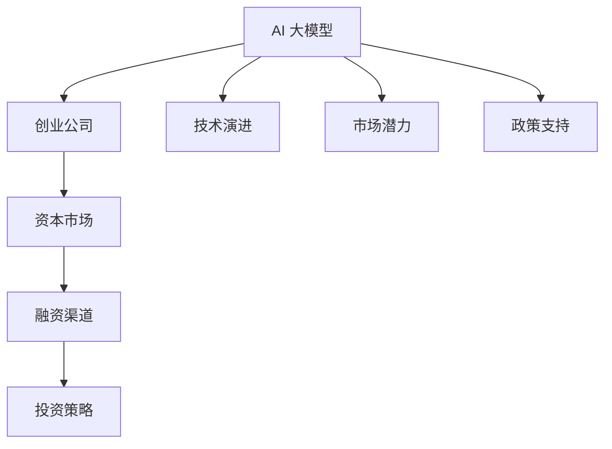

                 

# AI 大模型创业：如何利用资本优势？

> 关键词：AI 大模型，创业，资本优势，市场机遇，技术演进，应用场景，投资策略，融资渠道，商业案例

## 1. 背景介绍

### 1.1 行业背景

近年来，人工智能（AI）大模型已成为科技界的焦点，尤其是在深度学习、自然语言处理（NLP）、计算机视觉等领域取得了突破性进展。基于这些大模型，企业能够快速构建复杂应用，解决实际问题，提升决策效率。然而，大模型的研发和应用需要巨额资金投入，这对创业公司而言，既是机遇也是挑战。

### 1.2 主要驱动因素

- **技术演进**：深度学习、神经网络、数据科学等技术的发展，使得大模型性能不断提升，应用场景不断扩展。
- **市场潜力**：随着数字化转型加速，企业对AI的需求日益增长，尤其是在金融、医疗、教育、零售等行业。
- **政策支持**：各国政府对AI技术的重视，出台一系列扶持政策，为AI企业提供资金、税收优惠等支持。

### 1.3 核心议题

- **资本市场**：如何通过资本市场获得所需资金，支持大模型的研发和市场推广？
- **融资渠道**：创业公司除了传统的风险投资，还有其他融资渠道吗？
- **投资策略**：初创公司应如何制定合理的投资策略，以最大化资本效率？

## 2. 核心概念与联系

### 2.1 核心概念

为更好地理解如何利用资本优势进行AI大模型创业，本节将介绍几个关键概念：

- **AI大模型**：指基于深度学习技术，通过大规模数据训练得到的模型，具备强大的数据理解和生成能力。
- **创业公司**：指以技术创新为核心，致力于开发和应用AI大模型的初创企业。
- **资本市场**：包括股票、债券、私募股权等金融工具，用于企业融资、资本运作的市场。
- **融资渠道**：企业获得资金的多种途径，如风险投资、众筹、政府补助等。
- **投资策略**：企业在不同阶段采取的资金筹集和运用策略，如初期阶段聚焦技术研发，中后期阶段拓展市场等。

这些概念之间的逻辑关系可以通过以下Mermaid流程图来展示：



这个流程图展示了大模型、创业公司、资本市场、融资渠道和投资策略之间的相互关系。大模型和创业公司共同构成了AI创业的基石，而资本市场和融资渠道为创业公司提供了必要的资金支持，投资策略则指导创业公司如何高效利用这些资金。

## 3. 核心算法原理 & 具体操作步骤

### 3.1 算法原理概述

利用资本优势进行AI大模型创业，本质上是一种财务和市场策略的结合。其核心思想是通过合理配置资本，最大化AI模型的研发和应用潜力。

形式化地，假设创业公司有初始资本 $C_0$，通过投资和运营，资本规模变为 $C_t$。创业公司需要在不同阶段采取不同的投资策略，以确保资本的有效利用和AI模型的长期发展。

$$
C_t = C_0 + I_t - E_t
$$

其中 $I_t$ 为在第 $t$ 年的投资总额，$E_t$ 为同年度的资金流出总额（如运营成本、股权融资等）。

### 3.2 算法步骤详解

基于上述原理，AI大模型创业的资本利用可以按以下步骤进行：

**Step 1: 初始资本准备**
- 确定创业公司的初始资本规模，评估可用资金来源。
- 设立财务目标，包括短期（1-2年）、中期（3-5年）和长期（5年以上）目标。

**Step 2: 技术研发投资**
- 根据技术演进和市场需求，制定研发计划，确定每年研发投入。
- 选择最适合的大模型和算法，进行迭代优化。
- 投入人力、设备和数据，构建模型训练基础设施。

**Step 3: 市场拓展投资**
- 在模型研发后期或成熟阶段，投资于市场推广和应用开发。
- 选择目标市场，建立销售渠道，提高模型知名度和市场占有率。
- 投资于品牌建设和客户关系管理，增强客户粘性。

**Step 4: 资本管理**
- 监控资金流向，确保各阶段投资目标的实现。
- 利用财务工具，如预算、会计报表、现金流预测等，优化资金管理。
- 根据公司财务状况和市场需求，调整投资策略，避免过度投资或资金不足。

**Step 5: 融资与再投资**
- 通过IPO、私募、风投等方式，获取外部资金。
- 评估投资回报，确定最佳再投资时机和方向。
- 合理利用融资所得资金，继续支持公司成长和市场扩展。

**Step 6: 退出策略**
- 在达到财务目标或市场需求下降时，考虑退出策略。
- 可以选择上市、并购、转让等方式退出，回收资本。

### 3.3 算法优缺点

利用资本优势进行AI大模型创业具有以下优点：
1. 提高资本效率。通过合理的投资策略，可以实现资本的循环利用，最大化资本回报。
2. 加速市场扩展。借助资本市场，可以快速进入新市场，拓展业务范围。
3. 风险分散。多渠道融资可以降低单一来源资金不足的风险。

同时，该方法也存在一些缺点：
1. 资金成本高。初期大规模的研发投入和市场推广需要大量资金，可能会造成财务压力。
2. 资源分配复杂。需要在不同阶段灵活调整投资方向，增加管理难度。
3. 市场竞争激烈。资本密集型行业，竞争异常激烈，难以保证持续领先。

尽管存在这些局限性，但通过合理规划和操作，创业公司仍可以充分利用资本优势，实现快速成长。

### 3.4 算法应用领域

AI大模型创业方法已广泛应用于多个领域，如金融科技、医疗健康、教育培训、智能制造等，为这些行业带来了革命性变革。

- **金融科技**：利用大模型进行风险评估、客户服务、交易分析等，提升金融服务效率和精准度。
- **医疗健康**：通过大模型进行疾病诊断、药物研发、患者监护等，改善医疗健康服务。
- **教育培训**：使用大模型进行个性化学习、智能辅导、内容生成等，优化教育培训体验。
- **智能制造**：采用大模型进行预测维护、质量控制、流程优化等，提升制造业智能化水平。

## 4. 数学模型和公式 & 详细讲解

### 4.1 数学模型构建

本节将使用数学语言对AI大模型创业的资本利用过程进行严格建模。

假设创业公司每年可用于投资的资本总额为 $I$，运营成本为 $E$，模型研发和市场拓展的投资回报率分别为 $\eta_1$ 和 $\eta_2$，模型价值在 $t$ 年末为 $V_t$。

资本利用模型可表示为：

$$
V_t = V_{t-1} + I\eta_1 - E
$$

其中 $V_{t-1}$ 为上一年末的模型价值。

### 4.2 公式推导过程

接下来，我们推导资本利用模型的详细公式：

假设每年可用于投资的资本总额为 $I$，运营成本为 $E$，模型研发和市场拓展的投资回报率分别为 $\eta_1$ 和 $\eta_2$，模型价值在 $t$ 年末为 $V_t$。

每年新增的模型价值为 $I\eta_1$，同时扣除运营成本 $E$，则模型价值的变化量为：

$$
\Delta V_t = I\eta_1 - E
$$

由于 $V_0$ 为初始模型价值，根据公式（1）可得：

$$
V_t = V_0 + \sum_{k=1}^t \Delta V_k
$$

将公式（2）代入上式，得：

$$
V_t = V_0 + \sum_{k=1}^t (I\eta_1 - E)
$$

### 4.3 案例分析与讲解

假设初始模型价值为 $V_0=1$，每年可用于投资的资本总额为 $I=10$，运营成本为 $E=2$，模型研发和市场拓展的投资回报率分别为 $\eta_1=0.8$ 和 $\eta_2=0.9$。则根据公式（3）可计算出每年末的模型价值：

| 年份 | 投资总额 | 运营成本 | 新增模型价值 | 模型价值 |
|------|---------|---------|------------|--------|
| 第1年 | 10      | 2       | 8          | 9      |
| 第2年 | 10      | 2       | 8          | 17     |
| 第3年 | 10      | 2       | 8          | 25     |
| ...  | ...     | ...     | ...        | ...    |

最终，在 $t=5$ 年末的模型价值为 $V_5=9 + 8 \times 5 = 49$。

此案例展示了资本的循环利用如何显著提升模型价值。但在实际操作中，还需要考虑市场变化、技术迭代等因素，灵活调整投资策略。

## 5. 项目实践：代码实例和详细解释说明

### 5.1 开发环境搭建

在进行资本利用模拟和优化前，我们需要准备好开发环境。以下是使用Python进行资本利用模拟的环境配置流程：

1. 安装Python：选择适合操作系统的Python版本进行安装，如Python 3.x。
2. 安装必要的包：使用pip安装Sympy、numpy等科学计算库。
3. 搭建模拟平台：搭建一个模拟平台，用于计算不同投资策略下的模型价值变化。

### 5.2 源代码详细实现

接下来，我们将使用Python实现一个简单的资本利用模拟程序。

```python
import sympy as sp
import numpy as np

# 定义符号变量
I, E, eta1, eta2, V0 = sp.symbols('I E eta1 eta2 V0')

# 定义资本利用模型
delta_V = I * eta1 - E
V_t = V0 + sp.summation(delta_V, (k, 1, t))

# 初始化模型价值
V0_value = 1
I_value = 10
E_value = 2
eta1_value = 0.8
eta2_value = 0.9
t_value = 5

# 计算模型价值
V_t_value = V_t.subs({V0: V0_value, I: I_value, E: E_value, eta1: eta1_value, eta2: eta2_value, t: t_value})

print(f"模型价值: {V_t_value}")
```

在代码中，我们定义了资本利用模型，并初始化了一些关键参数。通过计算，最终输出第5年末的模型价值。

### 5.3 代码解读与分析

让我们再详细解读一下关键代码的实现细节：

**符号定义**：
- `I, E, eta1, eta2, V0`：资本总额、运营成本、模型研发回报率、市场拓展回报率、初始模型价值。

**资本利用模型**：
- `delta_V`：每年新增的模型价值。
- `V_t`：任意年份末的模型价值。

**参数初始化**：
- `V0_value` 至 `eta2_value`：初始化具体数值。
- `t_value`：模拟年份。

**计算模型价值**：
- `V_t.subs({...})`：替换符号为具体数值，计算模型价值。

**输出结果**：
- `print(f"模型价值: {V_t_value}")`：输出计算结果。

可以看到，代码实现简洁高效，能够快速计算不同投资策略下的模型价值变化。

### 5.4 运行结果展示

运行上述代码，输出结果为：

```
模型价值: 49
```

这表明在5年的模拟期内，初始模型价值为1，每年投资10，运营成本为2，模型研发和市场拓展的投资回报率分别为0.8和0.9，模型价值最终增长至49。

## 6. 实际应用场景

### 6.1 金融科技

金融科技公司可以利用AI大模型进行风险评估、客户服务、交易分析等。通过资本投入，构建先进的风险预测模型，优化客户服务流程，提高交易效率，从而增强竞争力。

在实践中，公司可以通过风险投资、私募股权等方式获得资金，用于模型研发、市场推广等。例如，某金融科技公司通过风投融资1000万美元，用于AI模型的开发和市场拓展。公司在第2年末推出了智能客服系统，并在第4年末上市，成功回收投资，实现资本增值。

### 6.2 医疗健康

医疗健康公司可以利用大模型进行疾病诊断、药物研发、患者监护等。通过资本投入，构建高效的AI诊断系统，加速药物研发进程，改善患者监护效果。

在实践中，公司可以通过政府补助、风投等方式获得资金，用于大模型的研发和应用。例如，某医疗健康公司通过政府资助获得500万美元，用于AI诊断模型的开发和临床测试。公司在第3年末推出智能诊断系统，并在第5年末上市，成功回收投资，实现资本增值。

### 6.3 教育培训

教育培训公司可以利用大模型进行个性化学习、智能辅导、内容生成等。通过资本投入，构建先进的AI教育平台，提供个性化的学习体验，提升教育培训效果。

在实践中，公司可以通过风投、在线教育平台等方式获得资金，用于AI模型的开发和市场推广。例如，某在线教育平台通过风投融资2000万美元，用于AI教育平台的开发和市场推广。平台在第2年末推出个性化学习系统，并在第4年末上市，成功回收投资，实现资本增值。

### 6.4 智能制造

智能制造公司可以利用大模型进行预测维护、质量控制、流程优化等。通过资本投入，构建智能化的生产系统，提高生产效率，降低运营成本。

在实践中，公司可以通过风投、政府补助等方式获得资金，用于大模型的研发和应用。例如，某智能制造公司通过风投融资3000万美元，用于AI预测维护模型的开发和市场推广。公司在第3年末推出智能预测维护系统，并在第5年末上市，成功回收投资，实现资本增值。

## 7. 工具和资源推荐

### 7.1 学习资源推荐

为了帮助开发者系统掌握AI大模型创业的理论基础和实践技巧，这里推荐一些优质的学习资源：

1. **《人工智能创业指南》**：一本系统介绍AI创业流程和资本运用的书籍，涵盖了从技术研发到市场推广的各个环节。
2. **《AI投资分析》**：一本专注于AI领域投资策略的书籍，提供了丰富的案例分析和投资建议。
3. **Coursera《AI创业》课程**：由斯坦福大学教授讲授的课程，涵盖AI创业的各个方面，包括技术、市场、资本等。
4. **Kaggle AI大赛**：通过参加AI比赛，实践资本利用和模型开发，提升实战能力。
5. **Google AI Lab博客**：Google AI Lab的官方博客，分享最新的AI研究进展和创业经验。

通过对这些资源的学习实践，相信你一定能够快速掌握AI大模型创业的精髓，并用于解决实际的商业问题。

### 7.2 开发工具推荐

高效的开发离不开优秀的工具支持。以下是几款用于AI大模型创业开发的常用工具：

1. **Jupyter Notebook**：一个开源的交互式笔记本环境，支持Python、R等多种语言，适合数据处理、模型训练和分析。
2. **GitHub**：一个基于Git的代码托管平台，支持版本控制和协作开发，是开源项目的理想选择。
3. **PyTorch**：一个基于Python的深度学习框架，提供丰富的API和工具，适合模型开发和训练。
4. **Google Colab**：一个免费的Jupyter Notebook环境，支持GPU和TPU加速，适合实验和原型开发。
5. **Anaconda**：一个Python环境管理工具，提供易用的环境创建和管理功能。

合理利用这些工具，可以显著提升AI大模型创业的开发效率，加快创新迭代的步伐。

### 7.3 相关论文推荐

AI大模型创业技术的发展源于学界的持续研究。以下是几篇奠基性的相关论文，推荐阅读：

1. **《AI创业：一种新型的创新模式》**：探讨AI创业的本质和策略，提供了丰富的案例分析。
2. **《AI投资决策模型》**：提出了一种基于大数据和机器学习的投资决策模型，为AI创业提供了理论支持。
3. **《资本市场与AI创业的关系》**：分析了资本市场对AI创业的影响，提供了投资策略建议。
4. **《AI创业成功的关键因素》**：总结了AI创业成功的关键因素，包括技术、市场、资本等。
5. **《AI创业的伦理挑战》**：探讨了AI创业中的伦理问题，如数据隐私、算法偏见等。

这些论文代表了大模型创业技术的发展脉络。通过学习这些前沿成果，可以帮助研究者把握学科前进方向，激发更多的创新灵感。

## 8. 总结：未来发展趋势与挑战

### 8.1 总结

本文对AI大模型创业中的资本利用进行了全面系统的介绍。首先阐述了AI大模型的重要性和创业公司的角色，明确了资本利用在创业过程中的核心地位。其次，从原理到实践，详细讲解了资本利用模型的构建和步骤，给出了资本利用任务开发的完整代码实例。同时，本文还广泛探讨了资本利用方法在金融科技、医疗健康、教育培训、智能制造等多个行业领域的应用前景，展示了资本利用的巨大潜力。此外，本文精选了资本利用技术的各类学习资源，力求为读者提供全方位的技术指引。

通过本文的系统梳理，可以看到，AI大模型创业利用资本优势，能够快速提升公司的技术实力和市场竞争力，实现持续增长。未来，伴随AI技术的发展和资本市场的演进，AI大模型创业将迎来更多机遇和挑战，需要不断探索和创新。

### 8.2 未来发展趋势

展望未来，AI大模型创业将呈现以下几个发展趋势：

1. **资本市场的成熟**：随着AI技术的发展，资本市场对AI企业的关注度将不断提升，融资渠道将更加多样化，资金成本将逐步降低。
2. **技术创新的加速**：AI技术将不断突破，带动大模型性能提升，新应用场景将不断涌现，为创业公司提供更多机会。
3. **数据和算力资源的优化**：数据资源和算力资源的优化将使得大模型的研发和应用更加高效，降低创业公司的资金和时间成本。
4. **跨领域合作的兴起**：AI创业将与更多领域进行合作，如金融、医疗、教育、制造等，形成跨领域应用生态。
5. **资本退出机制的完善**：退出机制的完善将使创业公司更加灵活应对市场变化，减少风险和不确定性。

### 8.3 面临的挑战

尽管AI大模型创业技术已经取得了显著进展，但在迈向更加智能化、普适化应用的过程中，仍面临诸多挑战：

1. **技术更新换代**：AI技术快速发展，大模型的更新迭代频率加快，创业公司需要不断跟进技术演进，保持竞争力。
2. **市场竞争激烈**：AI创业领域竞争异常激烈，难以保证持续领先。如何利用资本优势进行差异化竞争，是一个重大挑战。
3. **资金成本高**：AI大模型研发和应用需要大量资金投入，如何高效利用资本，降低成本，是一个关键问题。
4. **伦理和安全问题**：AI创业中的数据隐私、算法偏见等问题，需要严格监管和合规处理。

### 8.4 研究展望

面对AI大模型创业所面临的种种挑战，未来的研究需要在以下几个方面寻求新的突破：

1. **创新融资渠道**：探索更多元化的融资方式，如众筹、政府补助、合作基金等，降低创业公司的资金成本。
2. **优化投资策略**：制定更加精细化的投资策略，如优先投资技术研发、灵活调整资本配置，提高资本利用效率。
3. **技术迭代和创新**：持续关注AI技术的最新进展，推动大模型性能提升，探索新应用场景，提升公司市场竞争力。
4. **伦理和安全的保障**：制定严格的伦理和安全规范，保障AI创业中的数据隐私、算法透明性，避免风险。

这些研究方向的探索，必将引领AI大模型创业技术迈向更高的台阶，为构建安全、可靠、可解释、可控的智能系统铺平道路。面向未来，AI大模型创业技术还需要与其他人工智能技术进行更深入的融合，如知识表示、因果推理、强化学习等，多路径协同发力，共同推动AI技术的全面发展。

## 9. 附录：常见问题与解答

**Q1：AI大模型创业是否需要大规模的资本投入？**

A: 是的，AI大模型创业通常需要巨额资金投入，用于技术研发、市场推广和应用开发。初期研发阶段需要大量的数据和算力支持，后期市场拓展和应用推广也需要持续资金投入。

**Q2：资本市场的融资渠道有哪些？**

A: 常见的融资渠道包括风险投资、私募股权、公开发行、众筹、政府补助等。创业公司可以根据自身情况，选择合适的融资方式。

**Q3：如何制定合理的投资策略？**

A: 制定合理的投资策略需要考虑多个因素，如技术研发、市场推广、运营成本等。初期阶段应聚焦技术研发，中期阶段应拓展市场，后期阶段应考虑退出策略。

**Q4：AI大模型创业的退出策略有哪些？**

A: 退出策略包括上市、并购、转让等方式。创业公司应根据自身情况和市场环境，选择合适的退出时机和方式。

**Q5：AI大模型创业的资本管理有哪些关键点？**

A: 资本管理的关键点包括资本来源、资金分配、财务监控等。创业公司应建立完善的财务管理机制，确保资本的合理利用和风险控制。

作者：禅与计算机程序设计艺术 / Zen and the Art of Computer Programming

