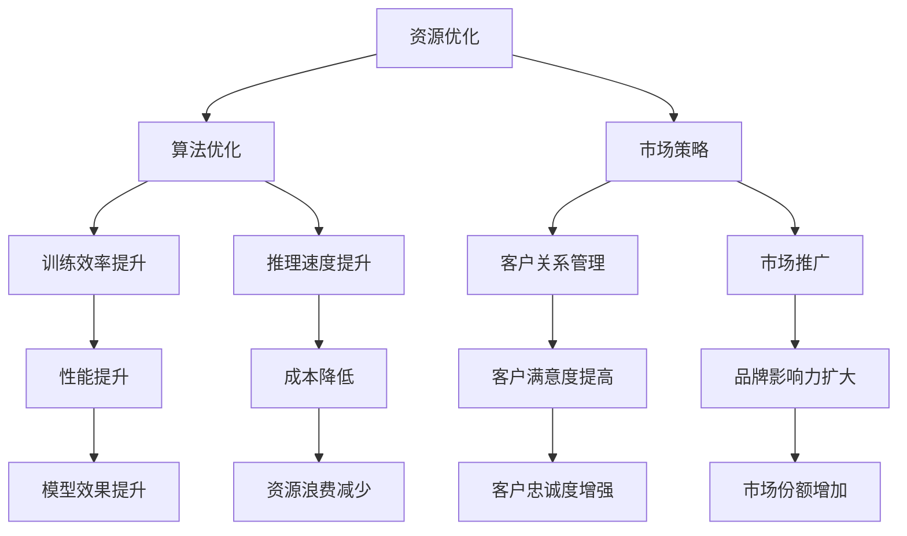

                 

# AI 大模型创业：如何利用资本优势？

## 1. 背景介绍

### 1.1 问题由来
随着人工智能技术的迅猛发展，AI大模型在各个行业的应用变得越来越广泛。无论是语音识别、图像识别，还是自然语言处理，大模型都展现出了惊人的表现。特别是在自然语言处理领域，BERT、GPT-3等大模型在多项任务中取得了SOTA的结果，引起了广泛关注。

然而，开发和部署AI大模型需要大量的计算资源和数据资源，这对创业公司来说是一个巨大的挑战。如何利用有限的资源和资本优势，将AI大模型推向市场，成为一个亟待解决的问题。

### 1.2 问题核心关键点
本文将从以下几个核心关键点来探讨如何利用资本优势，实现AI大模型的成功创业：

1. **资源优化**：如何在有限的资源条件下，最大化模型的性能。
2. **算法优化**：如何优化模型算法，提高模型的训练效率和推理速度。
3. **市场策略**：如何制定有效的市场策略，推广AI大模型。
4. **资金筹集**：如何通过各种渠道筹集资金，支持AI大模型的开发和部署。

## 2. 核心概念与联系

### 2.1 核心概念概述

- **AI大模型**：以深度学习模型为基础，通过大规模无监督学习或迁移学习，具备强大泛化能力和应用场景的模型。如BERT、GPT-3等。
- **资源优化**：通过优化算法和架构设计，在有限的资源条件下，最大化模型的性能。
- **算法优化**：优化模型的训练算法和推理算法，提升模型的训练效率和推理速度。
- **市场策略**：通过有效的市场推广和客户关系管理，最大化模型的市场影响力。
- **资金筹集**：通过股权融资、债权融资、众筹等方式，筹集足够的资金，支持AI大模型的开发和部署。

### 2.2 核心概念原理和架构的 Mermaid 流程图(Mermaid 流程节点中不要有括号、逗号等特殊字符)



这个流程图展示了资源优化、算法优化、市场策略和资金筹集之间的联系和相互作用。

## 3. 核心算法原理 & 具体操作步骤
### 3.1 算法原理概述

AI大模型的创业过程中，资源优化、算法优化、市场策略和资金筹集都是不可或缺的环节。本节将详细介绍每个环节的核心算法原理和操作步骤。

### 3.2 算法步骤详解

#### 3.2.1 资源优化算法

资源优化主要包括以下两个方面：

1. **硬件资源优化**：通过分布式训练、模型压缩等技术，提高训练效率，减少计算资源消耗。
   - **分布式训练**：将模型并行分配到多个节点上进行训练，利用多机并行计算的优势，提高训练速度。
   - **模型压缩**：通过剪枝、量化、蒸馏等技术，减小模型的参数量和计算量，提升模型在资源受限条件下的性能。

2. **数据资源优化**：通过数据增强、迁移学习等技术，最大化利用有限的数据资源。
   - **数据增强**：通过对训练数据进行旋转、裁剪、缩放等操作，生成更多的训练数据，提升模型的泛化能力。
   - **迁移学习**：通过利用预训练模型或迁移学习技术，在大规模数据集上进行微调，提升模型的性能。

#### 3.2.2 算法优化算法

算法优化主要包括以下两个方面：

1. **训练算法优化**：通过改进优化器、学习率调度、正则化等技术，提升模型的训练效果。
   - **优化器优化**：使用AdamW、Adafactor等高效的优化器，加快模型的收敛速度。
   - **学习率调度**：通过动态学习率调度，使学习率在训练过程中逐渐减小，避免过拟合。
   - **正则化**：通过L2正则、Dropout等技术，避免模型过拟合。

2. **推理算法优化**：通过改进推理算法，提高模型的推理速度和计算效率。
   - **推理加速**：通过量化、剪枝、蒸馏等技术，将浮点模型转换为定点模型，提高推理速度。
   - **模型并行**：通过多线程、多进程等方式，实现模型的并行推理，提高推理效率。

#### 3.2.3 市场策略算法

市场策略主要包括以下两个方面：

1. **客户关系管理**：通过CRM系统，管理客户关系，提升客户满意度，增加客户粘性。
   - **客户细分**：将客户分为不同的细分市场，针对性地推出产品和服务。
   - **客户反馈**：通过收集客户反馈，及时调整产品和服务，提升客户满意度。

2. **市场推广策略**：通过各种渠道推广产品，增加品牌影响力。
   - **社交媒体营销**：通过社交媒体平台，进行品牌推广和产品宣传。
   - **内容营销**：通过撰写博客、发布视频等方式，传播AI大模型的应用场景和优势。

#### 3.2.4 资金筹集算法

资金筹集主要包括以下两个方面：

1. **股权融资**：通过向投资者发行股票，获得资金支持。
   - **天使投资**：通过向天使投资者募集资金，获得早期支持。
   - **风险投资**：通过向风险投资机构募集资金，获得大规模支持。

2. **债权融资**：通过向银行或金融机构借款，获得资金支持。
   - **贷款**：通过向银行申请贷款，获得资金支持。
   - **债券**：通过发行企业债券，募集资金。

### 3.3 算法优缺点

#### 3.3.1 资源优化算法

**优点**：
- 提高训练效率，缩短训练时间。
- 降低计算资源消耗，减少成本。

**缺点**：
- 技术实现较为复杂，需要较高的技术水平。
- 可能会影响模型的精度和性能。

#### 3.3.2 算法优化算法

**优点**：
- 提高模型训练效果，提升模型性能。
- 提高模型推理速度，提升用户体验。

**缺点**：
- 优化算法的选择和调整较为复杂，需要一定的经验。
- 可能会影响模型的复杂度和可解释性。

#### 3.3.3 市场策略算法

**优点**：
- 提升客户满意度，增加客户粘性。
- 增加品牌影响力，拓展市场份额。

**缺点**：
- 市场推广和客户关系管理的成本较高。
- 需要持续的投入和维护，才能保持市场竞争力。

#### 3.3.4 资金筹集算法

**优点**：
- 快速获得大量资金支持，加速产品开发和市场推广。
- 多元化融资渠道，降低财务风险。

**缺点**：
- 股权融资可能会稀释公司的控制权。
- 债权融资需要偿还利息，增加财务负担。

### 3.4 算法应用领域

资源优化、算法优化、市场策略和资金筹集算法在多个领域都有广泛应用：

- **医疗领域**：通过优化资源和算法，提升AI大模型在医疗影像分析、疾病预测等方面的性能。
- **金融领域**：通过优化资源和算法，提升AI大模型在金融风险控制、智能投顾等方面的性能。
- **教育领域**：通过优化资源和算法，提升AI大模型在智能辅导、考试评分等方面的性能。
- **物流领域**：通过优化资源和算法，提升AI大模型在路径规划、库存管理等方面的性能。

## 4. 数学模型和公式 & 详细讲解 & 举例说明

### 4.1 数学模型构建

AI大模型的创业过程中，涉及到多种数学模型和公式。以下是一个简单的数学模型构建示例：

假设有一个深度学习模型 $M$，其输入为 $x$，输出为 $y$。模型的损失函数为 $L(y, \hat{y})$，其中 $\hat{y}$ 为模型的预测输出。

模型的优化目标为最小化损失函数：

$$
\min_{\theta} L(y, M_{\theta}(x))
$$

其中 $\theta$ 为模型的参数。

### 4.2 公式推导过程

以线性回归模型为例，其优化目标为最小化均方误差：

$$
\min_{\theta} \frac{1}{N} \sum_{i=1}^N (y_i - M_{\theta}(x_i))^2
$$

其中 $y_i$ 为真实标签，$M_{\theta}(x_i)$ 为模型预测输出，$N$ 为样本数量。

对上述目标函数求导，得到：

$$
\nabla_{\theta} L(y, M_{\theta}(x)) = -2 \frac{1}{N} \sum_{i=1}^N (y_i - M_{\theta}(x_i)) \cdot M_{\theta}(x_i)
$$

### 4.3 案例分析与讲解

以BERT为例，其优化目标为最大化语言模型似然：

$$
\min_{\theta} -\frac{1}{N} \sum_{i=1}^N \log P_{\theta}(y_i|x_i)
$$

其中 $P_{\theta}(y_i|x_i)$ 为模型在输入 $x_i$ 下，输出 $y_i$ 的概率。

## 5. 项目实践：代码实例和详细解释说明

### 5.1 开发环境搭建

在AI大模型创业过程中，需要搭建一个高效、稳定的开发环境。以下是开发环境的搭建步骤：

1. **安装Python**：从官网下载安装Python，确保安装版本与模型兼容。
2. **安装依赖库**：安装必要的依赖库，如TensorFlow、PyTorch等。
3. **搭建分布式训练环境**：使用Docker容器，搭建分布式训练环境，提高训练效率。
4. **部署模型服务**：使用AWS、Google Cloud等云平台，搭建模型服务，提供模型API接口。

### 5.2 源代码详细实现

以下是使用TensorFlow搭建分布式训练环境的示例代码：

```python
import tensorflow as tf

# 搭建分布式训练环境
strategy = tf.distribute.MirroredStrategy(devices=['/device:CPU:0', '/device:CPU:1', '/device:CPU:2', '/device:CPU:3'])

# 加载模型
model = tf.keras.models.load_model('model.h5')

# 定义损失函数
def loss_fn(y_true, y_pred):
    return tf.keras.losses.categorical_crossentropy(y_true, y_pred)

# 定义优化器
optimizer = tf.keras.optimizers.Adam(learning_rate=0.001)

# 在分布式策略下进行训练
with strategy.scope():
    model.compile(optimizer=optimizer, loss=loss_fn)
    model.fit(x_train, y_train, epochs=10)
```

### 5.3 代码解读与分析

上述代码搭建了一个分布式训练环境，使用MirroredStrategy将模型并行分配到多个CPU上进行训练。在训练过程中，使用了Adam优化器和交叉熵损失函数，进行了10个epoch的训练。

## 6. 实际应用场景

### 6.1 医疗领域

在医疗领域，AI大模型可以用于疾病预测、影像分析、病理诊断等。通过优化资源和算法，提升模型的训练效率和推理速度，可以更快速地处理大量医疗数据，提高诊断的准确性和效率。

### 6.2 金融领域

在金融领域，AI大模型可以用于风险控制、智能投顾、市场预测等。通过优化资源和算法，提升模型的训练效率和推理速度，可以更快速地处理大量金融数据，提高风险控制和投资决策的准确性。

### 6.3 教育领域

在教育领域，AI大模型可以用于智能辅导、考试评分、学习路径规划等。通过优化资源和算法，提升模型的训练效率和推理速度，可以更快速地处理大量学习数据，提高教学效果和学生学习效率。

## 7. 工具和资源推荐

### 7.1 学习资源推荐

1. **TensorFlow官方文档**：提供丰富的API文档和教程，帮助开发者快速上手TensorFlow。
2. **PyTorch官方文档**：提供详细的API文档和教程，帮助开发者快速上手PyTorch。
3. **Google Colab**：提供免费的GPU资源，方便开发者进行模型训练和测试。
4. **Kaggle**：提供丰富的数据集和竞赛，帮助开发者提高数据处理和模型训练能力。

### 7.2 开发工具推荐

1. **Jupyter Notebook**：提供丰富的Jupyter Notebook环境，方便开发者进行模型训练和测试。
2. **AWS SageMaker**：提供云平台上的模型训练和部署服务，方便开发者进行模型部署和调用。
3. **TensorBoard**：提供模型训练的可视化工具，帮助开发者监控训练进度和模型性能。
4. **PyCharm**：提供丰富的开发工具和调试功能，帮助开发者提高开发效率。

### 7.3 相关论文推荐

1. **TensorFlow论文**：介绍TensorFlow的架构和优化技术。
2. **PyTorch论文**：介绍PyTorch的架构和优化技术。
3. **分布式深度学习论文**：介绍分布式深度学习的优化技术和实践经验。

## 8. 总结：未来发展趋势与挑战

### 8.1 总结

AI大模型在各行业的广泛应用，为其创业提供了巨大的机会。资源优化、算法优化、市场策略和资金筹集是AI大模型创业的核心环节。本文从这四个方面进行了详细的探讨，希望为创业者提供有益的参考。

### 8.2 未来发展趋势

未来，AI大模型的创业将呈现以下几个趋势：

1. **数据和算力的进一步提升**：随着算力成本的降低和数据规模的扩张，AI大模型的性能将进一步提升。
2. **算法和架构的不断优化**：分布式训练、模型压缩等技术将不断优化，提升模型的训练效率和推理速度。
3. **市场策略的多样化**：通过社交媒体营销、内容营销等多样化的市场策略，提升模型的市场影响力。
4. **资金筹集的创新**：通过众筹、债券等创新融资渠道，提升公司的融资能力。

### 8.3 面临的挑战

尽管AI大模型创业充满机遇，但也面临着诸多挑战：

1. **资金压力**：大规模的资金投入，对创业公司来说是一个巨大的挑战。
2. **技术复杂性**：分布式训练、模型压缩等技术的实现较为复杂，需要较高的技术水平。
3. **市场竞争**：AI大模型市场竞争激烈，如何突围是一个重要的问题。
4. **模型可靠性**：AI大模型的可靠性问题，需要不断优化和验证。

### 8.4 研究展望

未来，AI大模型创业需要在以下几个方面进行深入研究：

1. **自动化优化技术**：开发更加自动化、智能化的优化技术，提高模型的训练效率和推理速度。
2. **模型可解释性**：提升AI大模型的可解释性，使其能够更好地应用到各个领域。
3. **跨领域应用**：开发跨领域的AI大模型，提升其在多个行业的应用价值。
4. **伦理和法律问题**：研究AI大模型的伦理和法律问题，确保其安全和合规性。

## 9. 附录：常见问题与解答

**Q1：如何选择合适的优化器？**

A: 选择合适的优化器需要考虑多个因素，如训练目标、数据规模、计算资源等。常见的优化器包括SGD、Adam、Adagrad等，每种优化器都有其适用的场景。

**Q2：如何在分布式训练中避免过拟合？**

A: 在分布式训练中，可以通过数据增强、正则化等技术避免过拟合。同时，可以使用模型蒸馏等技术，提升模型的泛化能力。

**Q3：如何进行客户关系管理？**

A: 客户关系管理主要通过CRM系统进行。可以建立客户档案，定期与客户互动，收集客户反馈，及时调整产品和服务。

**Q4：如何进行市场推广？**

A: 市场推广可以通过社交媒体营销、内容营销等方式进行。需要制定有效的推广策略，吸引潜在客户，提升品牌影响力。

**Q5：如何进行资金筹集？**

A: 资金筹集可以通过股权融资、债权融资、众筹等方式进行。需要制定详细的融资计划，确保资金的合理使用。

---

作者：禅与计算机程序设计艺术 / Zen and the Art of Computer Programming

