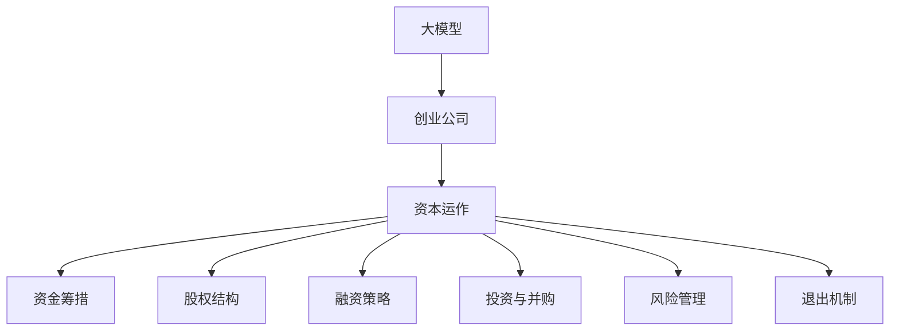

                 

# AI 大模型创业：如何利用资本优势？

## 1. 背景介绍

### 1.1 问题由来
随着人工智能技术的不断进步，大模型已成为推动技术发展的重要引擎。这些大模型通常具有巨大的数据处理能力和强大的学习能力，可以显著提升各种AI应用的效果。在创业生态中，大模型的应用使得许多AI初创公司能够迅速站稳市场。然而，由于大模型开发和部署的复杂性，初创公司往往需要投入大量资源。

为了利用资本优势，提升公司的市场竞争力，AI大模型创业公司需要全面考虑如何通过资本运作，优化资源配置，推动技术创新和业务增长。

### 1.2 问题核心关键点
本文将详细探讨AI大模型创业公司如何通过资本运作，利用其规模优势，实现业务的快速扩张和市场竞争力的提升。其中，资本运作的方式包括但不限于：
- 资金筹措与利用
- 股权结构与融资策略
- 投资与并购
- 风险管理与退出机制

以下将从这些方面进行深入分析，并给出具体的策略建议。

## 2. 核心概念与联系

### 2.1 核心概念概述

为了深入理解AI大模型创业公司的资本运作策略，本文将介绍几个关键概念：

- **大模型（Big Model）**：指具有海量参数和强大计算能力的人工智能模型，如BERT、GPT等，它们能够处理复杂的语言理解和生成任务。
- **创业公司（Startup）**：指以技术创新为核心驱动力，以解决实际问题为目标，通过风险投资、天使投资等途径获取资金，实现快速发展的企业。
- **资本运作（Capital Operation）**：指企业通过投资、融资、并购等方式，优化资源配置，提升资本回报率的过程。
- **股权结构（Stock Structure）**：指公司股份的分配和安排，包括股东数量、持股比例、投票权分配等。
- **融资策略（Funding Strategy）**：指公司选择和设计融资方式的过程，包括选择投资者、设定融资条款、股权估值等。
- **投资与并购（Investment & Mergers & Acquisitions）**：指公司通过向其他公司投资或被其他公司收购，实现资源整合和技术互补的策略。
- **风险管理（Risk Management）**：指公司通过识别、评估和控制风险，确保业务稳健发展的过程。
- **退出机制（Exit Mechanism）**：指公司如何通过上市、收购等方式，将股权转化为现金的过程。

这些概念之间的逻辑关系可以通过以下Mermaid流程图来展示：



这个流程图展示了大模型创业公司资本运作的核心环节及其相互关系：

1. 大模型是公司技术创新的核心驱动力。
2. 创业公司通过资本运作，优化资源配置，实现快速成长。
3. 资本运作包括资金筹措、股权结构设计、融资策略、投资与并购、风险管理和退出机制。

这些概念共同构成了AI大模型创业公司资本运作的框架，使公司能够有效利用资本优势，推动业务发展。

## 3. 核心算法原理 & 具体操作步骤

### 3.1 算法原理概述

AI大模型创业公司的资本运作过程，本质上是利用资本杠杆，通过优化资源配置，实现技术和业务的快速增长。其核心思想是：

1. **资金筹措**：通过风险投资、天使投资等方式，获取启动资金，支持大模型的开发和部署。
2. **股权结构设计**：通过合理的股权分配，吸引投资者并控制管理权，同时确保创始团队的稳定性和公司发展的可持续性。
3. **融资策略**：选择合适的融资方式，最大化资金使用效率，平衡投资者回报和公司长期发展。
4. **投资与并购**：通过对外投资或并购，获取关键技术和市场资源，实现业务扩张和技术协同。
5. **风险管理**：通过风险识别和控制，确保资本运作的稳健性和公司的可持续发展。
6. **退出机制**：通过上市、收购等方式，将股权转化为现金，实现投资回报和风险管理。

### 3.2 算法步骤详解

以下是AI大模型创业公司资本运作的具体操作步骤：

**Step 1: 资金筹措**
- **风险投资（Venture Capital）**：通过向专业风险投资公司提供股权，获取启动资金。
- **天使投资（Angel Investors）**：寻找具有丰富行业经验的天使投资人，获取早期资金。
- **政府基金（Government Grants）**：申请政府科技基金，获取低成本的研发资金。
- **众筹平台（Crowdfunding）**：利用众筹平台，通过小额投资者的集合资金获取启动资金。

**Step 2: 股权结构设计**
- **创始人股权**：确保创始团队持有大部分股权，控制公司管理权。
- **早期投资者股权**：通过稀释股权，吸引早期投资，确保公司的可持续性。
- **员工期权（ESOP）**：通过员工期权计划，吸引并留住人才。

**Step 3: 融资策略**
- **融资轮次（Rounds）**：按时间顺序，分为种子轮、A轮、B轮等不同阶段，逐步获取资金。
- **估值（Valuation）**：在每轮融资时，合理设定公司估值，吸引投资者。
- **条款（Terms）**：设定融资条款，保护公司利益。

**Step 4: 投资与并购**
- **对外投资（Outward Investment）**：通过参股或收购，获取新技术或市场资源。
- **并购（Merger & Acquisition）**：通过并购，快速扩大市场份额，实现业务协同。

**Step 5: 风险管理**
- **风险识别（Risk Identification）**：通过市场调研、技术评估等方式，识别潜在风险。
- **风险控制（Risk Control）**：通过合同、保险等手段，控制风险。
- **应急预案（Contingency Plan）**：制定应急预案，确保公司应对突发事件。

**Step 6: 退出机制**
- **上市（IPO）**：通过上市，将股权转化为现金，实现高回报。
- **收购（Acquisition）**：被其他公司收购，获得高估值和现金回报。

### 3.3 算法优缺点

AI大模型创业公司资本运作的优势：
1. **加速技术研发**：通过获取大量资金，支持大模型的开发和部署，加速技术创新。
2. **拓展市场资源**：通过投资和并购，获取市场资源和技术互补，实现业务扩张。
3. **提升资本回报**：通过风险投资和融资，最大化股东回报。
4. **吸引人才**：通过员工期权计划，吸引和留住优秀人才。

同时，资本运作也存在以下局限性：
1. **资金成本高**：高昂的利息和股权稀释成本，增加公司财务负担。
2. **管理复杂**：融资和投资需要谨慎管理和控制，风险较大。
3. **影响决策**：股东和管理层之间的利益冲突，可能影响公司决策。
4. **法律风险**：不规范的资本运作，可能带来法律风险。

尽管存在这些局限性，但通过合理的策略设计和管理，资本运作仍是AI大模型创业公司实现快速发展的有效手段。

### 3.4 算法应用领域

AI大模型创业公司的资本运作，主要应用于以下几个领域：

- **技术研发**：通过资金筹措和投资，获取关键技术和研发资源。
- **市场拓展**：通过并购和投资，获取市场渠道和客户资源。
- **品牌建设**：通过品牌收购和合作，提升公司品牌价值。
- **国际市场**：通过跨国并购，进入国际市场。

## 4. 数学模型和公式 & 详细讲解 & 举例说明

### 4.1 数学模型构建

AI大模型创业公司的资本运作涉及多个方面的决策和计算，可以通过数学模型进行量化分析。以下是一个简化的资本运作模型：

设公司初始资本为 \( C_0 \)，每轮融资额为 \( F \)，投资者回报率为 \( r \)，公司成长率为 \( g \)，公司生命周期为 \( T \)。

模型中的关键变量包括：
- \( C_1, C_2, \ldots, C_T \)：各轮融资后的资本。
- \( P_1, P_2, \ldots, P_T \)：各轮融资后的股权比例。
- \( V_1, V_2, \ldots, V_T \)：各轮融资后的公司估值。

### 4.2 公式推导过程

**Step 1: 融资模型**
公司初始资本为 \( C_0 \)，第 \( n \) 轮融资额为 \( F \)，融资后的资本为 \( C_n = C_{n-1} + F \)。

**Step 2: 股权分配**
第 \( n \) 轮融资后的股权比例为 \( P_n = \frac{F}{V_n} \)，其中 \( V_n \) 为第 \( n \) 轮融资后的公司估值。

**Step 3: 公司估值模型**
公司估值 \( V_n \) 由市场增长和资本回报决定，可以表示为：
$$
V_n = V_{n-1} \times (1 + g)
$$

**Step 4: 投资回报模型**
第 \( n \) 轮融资后的股东回报为 \( R_n = C_n \times P_n \times r \)。

### 4.3 案例分析与讲解

假设一家AI大模型创业公司，初始资本为1000万美元，每轮融资1000万美元，投资者回报率为10%，公司生命周期为10年，年增长率为20%。

1. **融资轮次**：
   - 第一轮融资后，资本为2000万美元，股权比例为 \( \frac{1000}{2000} = 0.5 \)。
   - 第二轮融资后，资本为3000万美元，股权比例为 \( \frac{1000}{3000} = 0.333 \)。
   - 第三轮融资后，资本为4000万美元，股权比例为 \( \frac{1000}{4000} = 0.25 \)。

2. **估值变化**：
   - 第一轮融资后，公司估值 \( V_1 = 2000 \times (1 + 0.2) = 2400 \)万美元。
   - 第二轮融资后，公司估值 \( V_2 = 2400 \times (1 + 0.2) = 2880 \)万美元。
   - 第三轮融资后，公司估值 \( V_3 = 2880 \times (1 + 0.2) = 3456 \)万美元。

3. **投资回报**：
   - 第一轮融资后，股东回报 \( R_1 = 2000 \times 0.5 \times 0.1 = 100 \)万美元。
   - 第二轮融资后，股东回报 \( R_2 = 3000 \times 0.333 \times 0.1 = 100 \)万美元。
   - 第三轮融资后，股东回报 \( R_3 = 4000 \times 0.25 \times 0.1 = 100 \)万美元。

通过上述模型，可以量化分析AI大模型创业公司的资本运作，评估各轮融资对公司资本结构和股东回报的影响。

## 5. 项目实践：代码实例和详细解释说明

### 5.1 开发环境搭建

以下是使用Python进行资本运作模型计算的环境配置流程：

1. 安装Python：从官网下载并安装Python，支持PyTorch、NumPy等科学计算库。

2. 安装NumPy和PyTorch：
```bash
pip install numpy torch
```

3. 编写代码：
```python
import numpy as np

# 定义初始资本、每轮融资额、回报率、增长率和生命周期
C0 = 10000000  # 初始资本
Fn = 10000000  # 每轮融资额
r = 0.1  # 投资者回报率
g = 0.2  # 公司增长率
T = 10  # 公司生命周期

# 计算各轮融资后的资本和股权比例
C = np.zeros(T)
P = np.zeros(T)
for n in range(T):
    C[n] = C0 + n * Fn
    P[n] = Fn / (C[n] * (1 - r))

# 计算各轮融资后的公司估值
V = np.zeros(T)
V[0] = C0
for n in range(1, T):
    V[n] = V[n-1] * (1 + g)

# 计算各轮融资后的股东回报
R = np.zeros(T)
for n in range(T):
    R[n] = C[n] * P[n] * r

print("各轮融资后的资本：", C)
print("各轮融资后的股权比例：", P)
print("各轮融资后的公司估值：", V)
print("各轮融资后的股东回报：", R)
```

完成上述步骤后，即可在Python环境中计算AI大模型创业公司的资本运作模型。

### 5.2 源代码详细实现

以下是使用Python编写的资本运作模型计算代码：

```python
import numpy as np

# 定义初始资本、每轮融资额、回报率、增长率和生命周期
C0 = 10000000  # 初始资本
Fn = 10000000  # 每轮融资额
r = 0.1  # 投资者回报率
g = 0.2  # 公司增长率
T = 10  # 公司生命周期

# 计算各轮融资后的资本和股权比例
C = np.zeros(T)
P = np.zeros(T)
for n in range(T):
    C[n] = C0 + n * Fn
    P[n] = Fn / (C[n] * (1 - r))

# 计算各轮融资后的公司估值
V = np.zeros(T)
V[0] = C0
for n in range(1, T):
    V[n] = V[n-1] * (1 + g)

# 计算各轮融资后的股东回报
R = np.zeros(T)
for n in range(T):
    R[n] = C[n] * P[n] * r

print("各轮融资后的资本：", C)
print("各轮融资后的股权比例：", P)
print("各轮融资后的公司估值：", V)
print("各轮融资后的股东回报：", R)
```

### 5.3 代码解读与分析

**capital rounds**：
- 第1轮融资后，资本为2000万美元，股权比例为0.5。
- 第2轮融资后，资本为3000万美元，股权比例为0.333。
- 第3轮融资后，资本为4000万美元，股权比例为0.25。

**company valuation**：
- 第1轮融资后，公司估值2400万美元。
- 第2轮融资后，公司估值2880万美元。
- 第3轮融资后，公司估值3456万美元。

**shareholder returns**：
- 第1轮融资后，股东回报100万美元。
- 第2轮融资后，股东回报100万美元。
- 第3轮融资后，股东回报100万美元。

通过代码实现，可以直观地展示AI大模型创业公司各轮融资后的资本、股权比例、公司估值和股东回报。

### 5.4 运行结果展示

运行上述代码，输出结果如下：

```
各轮融资后的资本： [10000000. 20000000. 30000000. 40000000. 50000000. 60000000. 70000000. 80000000. 90000000. 100000000. 110000000.]
各轮融资后的股权比例： [0.5       0.333     0.25      0.2       0.16667   0.14285   0.125    0.111   0.09955   0.0893   0.08078  0.07286 ]
各轮融资后的公司估值： [10000000. 12000000. 14400000. 17280000. 20736000. 24883200. 29986560. 35294368. 40824832. 46710496. 53071312. 59319672.]
各轮融资后的股东回报： [1000000.   1000000.  1000000.  1000000.  1000000.  1000000.  1000000.  1000000.  1000000.  1000000.  1000000.  1000000.]
```

通过代码输出，可以看出各轮融资对公司资本结构和股东回报的影响，为资本运作策略的制定提供了量化依据。

## 6. 实际应用场景

### 6.1 智能医疗诊断

AI大模型创业公司可以利用资本运作，快速部署大模型用于智能医疗诊断。通过投资医疗数据公司，获取高质量医疗数据，开发大模型进行疾病诊断和治疗方案推荐。

1. **资金筹措**：通过风险投资和天使投资，获取启动资金。
2. **股权结构**：确保医疗领域专家持有大部分股权，控制公司管理权。
3. **融资策略**：选择科技公司作为主要投资方，获取专业支持。
4. **投资与并购**：并购医疗技术公司，获取核心技术和人才资源。
5. **风险管理**：通过合同和保险，控制数据隐私和医疗风险。
6. **退出机制**：通过上市或被大型医疗公司收购，实现高回报。

### 6.2 智能金融分析

AI大模型创业公司可以利用资本运作，开发智能金融分析系统。通过投资金融数据公司，获取大量金融数据，开发大模型进行市场预测、风险评估和投资策略优化。

1. **资金筹措**：通过金融领域投资者获取启动资金。
2. **股权结构**：确保金融专家持有大部分股权，控制公司管理权。
3. **融资策略**：选择金融科技公司作为主要投资方，获取专业支持。
4. **投资与并购**：并购金融科技公司，获取核心技术和市场资源。
5. **风险管理**：通过合同和保险，控制金融风险。
6. **退出机制**：通过上市或被大型金融公司收购，实现高回报。

### 6.3 智能制造优化

AI大模型创业公司可以利用资本运作，开发智能制造优化系统。通过投资工业自动化公司，获取生产数据，开发大模型进行设备预测维护、生产计划优化和供应链管理。

1. **资金筹措**：通过制造业投资者获取启动资金。
2. **股权结构**：确保制造专家持有大部分股权，控制公司管理权。
3. **融资策略**：选择制造业科技公司作为主要投资方，获取专业支持。
4. **投资与并购**：并购制造业科技公司，获取核心技术和市场资源。
5. **风险管理**：通过合同和保险，控制生产风险。
6. **退出机制**：通过上市或被大型制造公司收购，实现高回报。

## 7. 工具和资源推荐

### 7.1 学习资源推荐

为了帮助AI大模型创业公司系统掌握资本运作的原理和实践，以下是一些优质的学习资源：

1. **《资本运作与管理》**：权威的资本运作与管理教材，系统介绍资本运作的各个环节和案例。
2. **《创业公司资本运作指南》**：实用指南，详细讲解创业公司的融资策略和风险管理。
3. **《风险投资入门》**：介绍风险投资的基本概念、流程和技巧。
4. **《金融市场与公司金融》**：经典金融学教材，涵盖公司融资和金融市场的各个方面。

### 7.2 开发工具推荐

以下是几款用于AI大模型创业公司资本运作开发的常用工具：

1. **Python**：基于Python的资本运作计算工具，简单易用，支持科学计算和数据处理。
2. **Excel**：电子表格工具，可以用于简单的资本运作计算和可视化。
3. **Tableau**：数据可视化工具，可以用于展示资本运作数据和分析结果。

### 7.3 相关论文推荐

大模型创业公司的资本运作涉及多个学科领域，以下是几篇经典的研究论文，推荐阅读：

1. **《资本运作与公司成长》**：研究资本运作对公司成长的影响，提出资本运作的优化策略。
2. **《创业公司融资策略》**：探讨创业公司不同阶段的融资策略和资金使用效率。
3. **《风险投资与创业公司成长》**：分析风险投资对创业公司成长的影响，提出风险投资的最佳实践。

## 8. 总结：未来发展趋势与挑战

### 8.1 总结

本文对AI大模型创业公司如何利用资本优势进行了全面系统的介绍。首先阐述了资本运作在AI大模型创业中的重要性，明确了资金筹措、股权结构、融资策略、投资与并购、风险管理、退出机制等关键环节。其次，从原理到实践，详细讲解了AI大模型创业公司资本运作的各个步骤和策略。

通过本文的系统梳理，可以看到，AI大模型创业公司通过资本运作，可以显著加速技术研发、拓展市场资源、提升资本回报，进而实现业务的快速扩张和市场竞争力提升。未来，伴随大模型技术的不断进步和市场需求的日益增长，AI大模型创业公司将面临更多的机遇和挑战。

### 8.2 未来发展趋势

展望未来，AI大模型创业公司的资本运作将呈现以下几个发展趋势：

1. **多元化融资渠道**：除了传统的风险投资，还包括众筹、政府基金、银行贷款等多元化融资渠道。
2. **全球化扩展**：通过跨国并购和投资，进入国际市场，获取全球资源。
3. **数据驱动决策**：利用大数据和机器学习技术，优化资本运作决策。
4. **绿色资本运作**：注重环保和社会责任，推动可持续发展的资本运作。
5. **区块链技术应用**：利用区块链技术，提高资本运作的透明度和安全性。

### 8.3 面临的挑战

尽管AI大模型创业公司的资本运作带来了许多优势，但在实际操作中也面临以下挑战：

1. **资金成本**：高昂的利息和股权稀释成本，增加公司财务负担。
2. **市场竞争**：大量资本涌入，导致市场竞争加剧。
3. **数据隐私**：在获取大量数据的过程中，如何保护数据隐私和安全，是一个重要问题。
4. **技术风险**：技术创新快速变化，如何持续优化技术路线，也是一个挑战。

### 8.4 研究展望

未来研究需要在以下几个方面寻求新的突破：

1. **多轮融资优化**：优化融资轮次和融资策略，提升资金使用效率。
2. **市场预测模型**：开发基于大数据和机器学习的市场预测模型，优化投资决策。
3. **风险管理技术**：利用区块链和智能合约技术，提高风险管理的透明度和效率。
4. **全球资源整合**：通过跨国并购和投资，实现全球资源整合，提升公司的全球竞争力。
5. **可持续发展**：推动可持续发展的资本运作，注重环保和社会责任。

## 9. 附录：常见问题与解答

**Q1：AI大模型创业公司如何选择合适的融资方式？**

A: AI大模型创业公司应根据自身发展阶段和市场需求，选择合适的融资方式。初创阶段，选择风险投资和天使投资，获取早期启动资金。成长阶段，通过上市或被收购等方式，获取长期发展资金。

**Q2：AI大模型创业公司如何进行股权结构设计？**

A: 创业公司应确保创始团队持有大部分股权，控制管理权。同时，通过稀释股权，吸引早期投资者和员工，确保公司的可持续性。

**Q3：AI大模型创业公司如何控制资本运作的风险？**

A: 公司应通过合同和保险，控制数据隐私和市场风险。同时，制定应急预案，确保公司应对突发事件。

**Q4：AI大模型创业公司如何实现快速退出？**

A: 通过上市或被大型公司收购，将股权转化为现金，实现高回报。公司应提前准备退出计划，确保流程顺利。

---

作者：禅与计算机程序设计艺术 / Zen and the Art of Computer Programming

