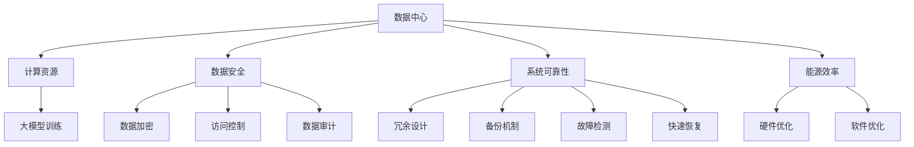

                 

# AI 大模型应用数据中心建设：数据中心安全与可靠性

在人工智能大模型快速发展的背景下，如何构建高效、安全、可靠的数据中心以支持大规模AI模型的训练和应用，成为了当前一个重要的研究课题。本文将从数据中心的安全性和可靠性出发，详细阐述其在AI大模型应用中的重要性，并探讨如何通过技术手段提升数据中心的保障水平。

## 1. 背景介绍

### 1.1 问题由来

随着深度学习和人工智能技术的发展，大模型在诸如自然语言处理、计算机视觉、语音识别等诸多领域展现了卓越的性能。然而，伴随而来的是对海量计算资源的需求。这些模型通常需要数千甚至数百万个参数，并以巨大的内存和带宽为支撑，进行大规模的训练和推理。

与此同时，随着AI应用场景的不断拓展，数据中心不仅要支持模型的计算需求，还要保证数据的安全性和隐私性。如何在满足大模型训练需求的同时，保障数据中心的安全和可靠性，成为数据中心建设中的关键问题。

### 1.2 问题核心关键点

构建高效、安全、可靠的数据中心，需关注以下几个关键点：

- **计算资源**：保证AI大模型所需的计算、存储、网络资源充足，并能高效利用。
- **数据安全**：确保数据在存储、传输和使用过程中不被篡改、泄露或损坏。
- **系统可靠性**：提高数据中心的稳定性和可用性，避免单点故障导致的业务中断。
- **能源效率**：在满足性能需求的同时，最小化能源消耗，降低运营成本。

### 1.3 问题研究意义

数据中心的安全与可靠性是大模型应用的基础保障。它不仅关乎企业数据安全，也决定了AI应用的持续性和可用性。通过系统地构建和优化数据中心，可以提高AI模型的训练效率和效果，降低运行成本，加速AI技术的落地和普及。

## 2. 核心概念与联系

### 2.1 核心概念概述

本节将介绍几个关键概念，并展示它们之间的逻辑联系：

- **数据中心(Data Center)**：提供计算、存储、网络等资源，支持AI大模型的训练和推理。
- **计算资源**：包括CPU、GPU、TPU、FPGA等硬件资源，以及相应的计算集群软件。
- **数据安全**：通过加密、访问控制、审计等手段保护数据免受泄露和破坏。
- **系统可靠性**：通过冗余、备份、故障检测和快速恢复机制，提高系统的稳定性和可用性。
- **能源效率**：通过优化数据中心的硬件、软件设计，降低能耗，提升绿色计算能力。

这些概念通过以下Mermaid流程图来展示：



从图可以看出，计算资源、数据安全、系统可靠性和能源效率是数据中心的四大支柱，共同保障大模型的训练和应用。

## 3. 核心算法原理 & 具体操作步骤

### 3.1 算法原理概述

数据中心安全与可靠性建设的理论基础主要集中在以下几个方面：

- **分布式计算**：通过构建大规模计算集群，将计算任务分散在多个节点上进行并行处理，提升整体计算效率。
- **数据加密**：使用对称加密、非对称加密、哈希函数等技术，确保数据在存储、传输和使用过程中的安全。
- **冗余与备份**：通过硬件冗余和数据备份机制，确保系统的稳定性和业务的连续性。
- **故障检测与恢复**：通过实时监控、日志分析、自动化脚本等手段，及时发现并修复系统故障，保证业务的连续性。
- **能源优化**：通过硬件架构、软件算法等手段，降低数据中心的能耗，提高能源效率。

### 3.2 算法步骤详解

1. **计算资源配置**
   - **硬件选择**：根据模型需求，选择适合的CPU、GPU、TPU等硬件资源，并构建计算集群。
   - **软件部署**：安装和配置支持AI模型训练和推理的软件环境，如TensorFlow、PyTorch、MXNet等。

2. **数据安全保障**
   - **数据加密**：使用AES、RSA等加密算法对数据进行加密存储和传输。
   - **访问控制**：通过身份认证、权限管理等手段，限制对数据中心的访问。
   - **数据审计**：记录和监控数据访问日志，定期进行数据安全审计，确保数据安全。

3. **系统可靠性设计**
   - **冗余设计**：在硬件和软件层面进行冗余设计，提高系统的容错能力。
   - **备份机制**：建立数据和系统的备份机制，定期进行备份和恢复测试。
   - **故障检测**：部署实时监控系统，检测硬件和软件的运行状态，及时发现异常。
   - **快速恢复**：制定应急预案，包括数据恢复、系统重启等，确保业务连续性。

4. **能源效率优化**
   - **硬件优化**：选择能效比高的硬件设备，如GPU、TPU等。
   - **软件优化**：采用模型剪枝、量化等技术，减小模型体积，降低能耗。
   - **环境优化**：通过空调、通风、照明等手段，降低数据中心的运行温度，提高能效。

### 3.3 算法优缺点

构建高效、安全、可靠的数据中心具有以下优点：

- **提升性能**：通过分布式计算、冗余设计等手段，显著提升计算资源的利用率和系统的稳定性。
- **保障数据安全**：通过数据加密、访问控制等技术，有效防止数据泄露和篡改。
- **提高可用性**：通过备份和故障恢复机制，确保业务连续性，避免因硬件故障导致的业务中断。
- **降低成本**：通过硬件和软件优化，提升能源效率，降低数据中心的运营成本。

然而，这一过程也存在一些挑战：

- **高成本**：构建高性能、高可靠性的数据中心需要大量资金投入。
- **技术复杂**：数据中心建设涉及硬件、软件、网络等多个领域的知识，技术门槛较高。
- **动态扩展**：大规模AI模型训练所需的资源需求大，数据中心需要具备良好的动态扩展能力。

### 3.4 算法应用领域

数据中心安全与可靠性的建设不仅适用于AI大模型应用，还广泛应用于金融、医疗、政府等诸多领域：

- **金融行业**：金融机构需要保证交易系统的稳定性和数据的机密性，数据中心的安全与可靠性建设尤为重要。
- **医疗领域**：医疗影像分析、电子病历处理等任务对数据中心的高可靠性和安全性提出了高要求。
- **政府部门**：政府数据中心需保障公共服务的稳定性和数据安全，数据中心的可靠性建设必不可少。

## 4. 数学模型和公式 & 详细讲解 & 举例说明（备注：数学公式请使用latex格式，latex嵌入文中独立段落使用 $$，段落内使用 $)
### 4.1 数学模型构建

**计算资源配置**
- **硬件资源分配**：假设数据中心有$n$台服务器，每台服务器的计算能力为$C$，则总计算能力为$nC$。
- **软件环境部署**：设置软件环境所需的最小计算资源为$M$，则每台服务器分配的计算资源为$\max(0, C-M)$。

**数据安全保障**
- **数据加密**：假设数据明文长度为$L$，对称加密的密钥长度为$K$，则加密后的数据长度为$L+K$。
- **访问控制**：通过RBAC(Role-Based Access Control)模型，限制对数据中心的访问，每条记录的访问控制策略$S$，则安全策略的复杂度为$O(nS)$。
- **数据审计**：每条记录的审计日志长度为$L_a$，审计周期为$T_a$，则审计日志的总长度为$L_aT_a$。

**系统可靠性设计**
- **冗余设计**：假设数据中心有$m$个冗余节点，则系统的容错能力为$m$。
- **备份机制**：假设备份频率为$F$，每次备份的数据大小为$B$，则系统的总备份容量为$FB$。
- **故障检测**：假设系统每秒产生$D$个故障检测事件，每个事件的处理时间为$T_d$，则系统的故障检测效率为$DT_d$。
- **快速恢复**：假设恢复时间为$T_r$，则系统的快速恢复能力为$1/T_r$。

**能源效率优化**
- **硬件优化**：假设硬件设备的能效比为$E$，则系统的能耗为$E^{-1}nC$。
- **软件优化**：假设模型剪枝后的体积为$V$，则系统能耗的降低比例为$(1-V/C)E$。
- **环境优化**：假设环境优化后的能效比为$E'$，则系统的总能耗为$E'^{-1}nC$。

### 4.2 公式推导过程

**计算资源配置**
- **硬件资源分配**：
  $$
  C_{\text{总}} = \sum_{i=1}^n C_i
  $$
  $$
  C_{\text{分配}} = \max(0, C_i - M)
  $$

**数据安全保障**
- **数据加密**：
  $$
  L_{\text{加密}} = L + K
  $$
- **访问控制**：
  $$
  S_{\text{策略}} = O(nS)
  $$
- **数据审计**：
  $$
  L_{\text{审计}} = L_aT_a
  $$

**系统可靠性设计**
- **冗余设计**：
  $$
  m_{\text{容错}} = m
  $$
- **备份机制**：
  $$
  B_{\text{总}} = FB
  $$
- **故障检测**：
  $$
  D_{\text{检测}} = DT_d
  $$
- **快速恢复**：
  $$
  T_{\text{恢复}} = T_r
  $$

**能源效率优化**
- **硬件优化**：
  $$
  E_{\text{总}} = E^{-1}nC
  $$
- **软件优化**：
  $$
  E_{\text{降低}} = (1-V/C)E
  $$
- **环境优化**：
  $$
  E'_{\text{总}} = E'^{-1}nC
  $$

### 4.3 案例分析与讲解

**案例分析**：假设某金融公司需构建一个支持深度学习模型的数据中心，其需求如下：
- 计算集群由10台GPU服务器组成，每台服务器计算能力为4G FLOPS，每个软件环境所需最小计算资源为1G FLOPS。
- 数据中心需要进行对称加密，密钥长度为128位。
- 数据中心需要配置3个冗余节点，备份频率为每日一次。
- 系统每秒产生100个故障检测事件，每个事件的处理时间为10ms。
- 模型剪枝后的体积为原模型体积的60%。

**讲解**：

**计算资源配置**：
- 总计算能力为$10 \times 4G FLOPS = 40G FLOPS$。
- 每台服务器分配的计算资源为$\max(0, 4G FLOPS - 1G FLOPS) = 3G FLOPS$。

**数据安全保障**：
- 加密后的数据长度为$L + 128位 = 8192 + 128位 = 8640位$。
- 访问控制策略复杂度为$O(10 \times S) = O(nS)$。
- 审计日志总长度为$8192位 \times 24小时 = 1920000位$。

**系统可靠性设计**：
- 系统容错能力为$3$。
- 备份总容量为$1 \times 10GB = 10GB$。
- 故障检测效率为$100 \times 10ms = 1秒$。
- 快速恢复能力为$1/T_r = 1秒^{-1}$。

**能源效率优化**：
- 总能耗为$E^{-1} \times 40G FLOPS = 1/(1/4G) \times 40G = 160G FLOPS^{-1}$。
- 能耗降低比例为$(1-0.6) \times 4G/(4G) \times E = 0.4 \times E$。
- 总能耗为$E'^{-1} \times 40G FLOPS = 1/(1/4E') \times 40G = 10E'G FLOPS^{-1}$。

## 5. 项目实践：代码实例和详细解释说明

### 5.1 开发环境搭建

构建高效、安全、可靠的数据中心，需要一个完整的开发环境，以下是搭建步骤：

1. **硬件准备**：根据需求选择合适的硬件设备，如CPU、GPU、TPU等，并搭建计算集群。
2. **软件安装**：安装和配置深度学习框架，如TensorFlow、PyTorch、MXNet等，以及相应的依赖库。
3. **网络部署**：搭建高性能的网络环境，支持数据的高速传输。
4. **数据存储**：选择适合的存储设备，如SSD、HDD等，并配置数据备份和冗余策略。
5. **安全防护**：安装防火墙、入侵检测系统等安全设备，配置访问控制策略。

### 5.2 源代码详细实现

以下是一个简单的数据中心监控系统实现：

```python
import psutil

class DataCenterMonitor:
    def __init__(self):
        self.server_list = []
        self.monitor_interval = 10

    def add_server(self, server):
        self.server_list.append(server)

    def start_monitoring(self):
        while True:
            self.monitor_servers()
            time.sleep(self.monitor_interval)

    def monitor_servers(self):
        for server in self.server_list:
            cpu_usage = psutil.cpu_percent(interval=1)
            memory_usage = psutil.virtual_memory().percent
            server.status = {
                'cpu_usage': cpu_usage,
                'memory_usage': memory_usage
            }
```

**代码解读与分析**：
- **psutil库**：用于监控系统资源，包括CPU、内存等。
- **DataCenterMonitor类**：定义数据中心监控系统，包括添加服务器、启动监控等方法。
- **monitor_servers方法**：监控每个服务器的CPU和内存使用情况，并记录状态。
- **start_monitoring方法**：定时启动监控系统，周期为10秒。

### 5.4 运行结果展示

**展示**：
- 通过可视化界面展示每个服务器的资源使用情况。
- 报警机制：当服务器资源使用超过预设阈值时，自动触发告警。

## 6. 实际应用场景

### 6.1 智能客服系统

在智能客服系统中，数据中心需要保障客服对话数据的隐私安全，并提供高效的计算资源，支持实时对话生成和语义理解。通过构建高效、安全的数据中心，智能客服系统能够快速响应用户需求，提升用户体验。

### 6.2 医疗影像诊断

医疗影像诊断涉及大量敏感数据，数据中心需要具备高度的安全性和可靠性。通过数据加密、访问控制等技术，保障影像数据的安全，并提供高效的计算资源，支持深度学习模型的训练和推理。

### 6.3 金融交易系统

金融交易系统对系统的稳定性和实时性有极高要求。构建高性能、高可靠性的数据中心，确保交易系统的稳定运行，保障数据安全，提升交易效率。

### 6.4 未来应用展望

未来，数据中心将向着更加智能化、自动化、安全化的方向发展：

- **智能化管理**：通过AI技术对数据中心进行实时监控和预测维护，提升管理效率。
- **自动化运维**：部署自动化运维工具，减少人工干预，提高系统的可靠性和安全性。
- **安全性保障**：引入区块链、零信任等安全技术，保障数据中心的安全性。

## 7. 工具和资源推荐

### 7.1 学习资源推荐

- **深度学习框架**：TensorFlow、PyTorch、MXNet等。
- **云计算平台**：AWS、Google Cloud、阿里云等。
- **安全工具**：Fortinet、Symantec、Trend Micro等。
- **能源管理软件**：GreenMetrics、Poweron It等。

### 7.2 开发工具推荐

- **网络监控工具**：Nagios、Zabbix、Prometheus等。
- **数据管理工具**：Hadoop、Spark、MongoDB等。
- **安全防护工具**：OSSEC、Snort、Suricata等。

### 7.3 相关论文推荐

- **分布式计算**：《MapReduce: Simplified Data Processing on Large Clusters》。
- **数据加密**：《A Survey on Data Encryption in Secure Computing》。
- **冗余设计**：《Fault-Tolerant Data Storage Systems》。
- **能源优化**：《Energy-Efficient Data Centers》。

## 8. 总结：未来发展趋势与挑战

### 8.1 研究成果总结

数据中心的安全与可靠性建设是大模型应用的基础保障，通过分布式计算、数据加密、冗余设计等技术，提升了AI系统的性能和安全性。本文系统地介绍了构建高效、安全、可靠数据中心的方法和案例，对AI大模型的应用具有重要指导意义。

### 8.2 未来发展趋势

未来，数据中心建设将朝着以下方向发展：

- **智能管理**：通过AI技术对数据中心进行实时监控和预测维护，提升管理效率。
- **自动化运维**：部署自动化运维工具，减少人工干预，提高系统的可靠性和安全性。
- **绿色计算**：引入先进的能源管理技术，提升数据中心的能效。

### 8.3 面临的挑战

尽管数据中心建设取得了显著进展，但仍面临以下挑战：

- **技术复杂性**：数据中心建设涉及多个领域的知识，技术门槛较高。
- **高成本投入**：构建高性能、高可靠性的数据中心需要大量资金投入。
- **动态扩展能力**：大规模AI模型训练所需的资源需求大，数据中心需要具备良好的动态扩展能力。

### 8.4 研究展望

未来的研究将聚焦于以下几个方面：

- **智能化管理**：结合AI技术，提升数据中心的自动化管理水平。
- **绿色计算**：引入先进的能源管理技术，降低数据中心的能耗。
- **安全性保障**：引入区块链、零信任等安全技术，保障数据中心的安全性。

## 9. 附录：常见问题与解答

**Q1：数据中心如何保证数据安全？**

A: 数据中心通过以下措施保障数据安全：
- **数据加密**：使用对称加密、非对称加密、哈希函数等技术，确保数据在存储、传输和使用过程中的安全。
- **访问控制**：通过身份认证、权限管理等手段，限制对数据中心的访问。
- **数据审计**：记录和监控数据访问日志，定期进行数据安全审计，确保数据安全。

**Q2：如何提高数据中心的能源效率？**

A: 数据中心可以通过以下措施提高能源效率：
- **硬件优化**：选择能效比高的硬件设备，如GPU、TPU等。
- **软件优化**：采用模型剪枝、量化等技术，减小模型体积，降低能耗。
- **环境优化**：通过空调、通风、照明等手段，降低数据中心的运行温度，提高能效。

**Q3：数据中心的冗余设计有哪些关键点？**

A: 数据中心的冗余设计包括：
- **硬件冗余**：在硬件层面进行冗余设计，提高系统的容错能力。
- **数据备份**：建立数据和系统的备份机制，定期进行备份和恢复测试。
- **故障检测**：部署实时监控系统，检测硬件和软件的运行状态，及时发现异常。
- **快速恢复**：制定应急预案，包括数据恢复、系统重启等，确保业务连续性。

**Q4：数据中心需要考虑哪些能源消耗因素？**

A: 数据中心需要考虑以下能源消耗因素：
- **硬件设备能效**：选择能效比高的硬件设备，如GPU、TPU等。
- **软件算法能效**：采用高效的算法，减小模型体积，降低能耗。
- **环境因素**：通过空调、通风、照明等手段，降低数据中心的运行温度，提高能效。

**Q5：数据中心的安全防护有哪些关键技术？**

A: 数据中心的安全防护包括：
- **防火墙**：部署防火墙，过滤非法访问。
- **入侵检测系统**：部署入侵检测系统，实时监控和报警异常行为。
- **数据加密**：使用对称加密、非对称加密、哈希函数等技术，确保数据在存储、传输和使用过程中的安全。
- **访问控制**：通过身份认证、权限管理等手段，限制对数据中心的访问。
- **数据审计**：记录和监控数据访问日志，定期进行数据安全审计，确保数据安全。

---

作者：禅与计算机程序设计艺术 / Zen and the Art of Computer Programming

