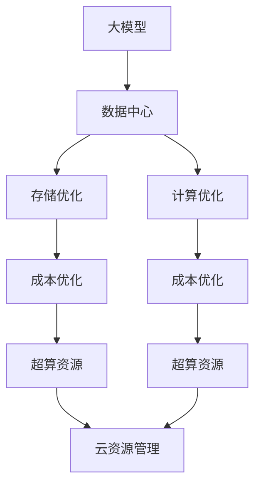

                 

# AI 大模型应用数据中心建设：数据中心成本优化

> 关键词：大模型应用, 数据中心成本, 存储优化, 计算优化, 超算资源, 云资源管理

## 1. 背景介绍

在人工智能（AI）的浪潮中，大模型（如BERT、GPT等）的出现极大地推动了NLP、CV等领域的技术发展，但随之而来的是对计算资源的巨大需求。数据中心作为AI模型训练和部署的核心设施，其建设成本和管理效率直接关系到模型的应用效果和企业的盈利能力。因此，如何优化数据中心的建设和运营成本，成为大模型应用领域的重要课题。本文将从数据中心建设的角度，探讨如何有效降低AI大模型应用的数据中心成本。

## 2. 核心概念与联系

### 2.1 核心概念概述

- **大模型（Large Models）**：指的是大规模的深度学习模型，如BERT、GPT-3等，这些模型参数量级通常在数十亿级别。

- **数据中心（Data Center）**：指通过网络集群实现高性能、高可靠性的服务器集群，用于存储和处理大量数据和计算任务。

- **成本优化（Cost Optimization）**：指在保证数据中心性能的前提下，通过合理的设计和管理，降低其建设和运营成本。

- **存储优化（Storage Optimization）**：通过高效的存储技术和管理策略，减少存储成本，提升存储效率。

- **计算优化（Computational Optimization）**：优化计算资源的分配和使用，减少浪费，提高计算效率。

- **超算资源（Supercomputing Resources）**：指高性能的计算集群，用于处理大规模的计算任务，如深度学习模型的训练和推理。

- **云资源管理（Cloud Resource Management）**：通过云计算平台进行资源的弹性调度和管理，降低物理资源的使用成本，提高资源利用率。

### 2.2 核心概念原理和架构的 Mermaid 流程图



## 3. 核心算法原理 & 具体操作步骤

### 3.1 算法原理概述

在AI大模型应用的数据中心建设中，成本优化涉及多个环节，包括存储成本优化、计算成本优化、超算资源利用率提升等。核心原理是采用先进的存储和计算技术，结合高效的资源管理和调度策略，在保证模型性能的前提下，最大限度地降低成本。

### 3.2 算法步骤详解

#### 3.2.1 存储成本优化

**步骤1：选择合适的存储技术**

数据中心的存储成本主要来自磁盘、SSD等物理存储介质。应根据数据访问频率和数据量大小选择合适的存储技术。例如，对于频繁访问的热数据，应选择高速的SSD存储；对于不频繁访问的冷数据，可以选择成本较低的HDD存储。

**步骤2：实施数据分层和归档**

根据数据的访问频率，将数据分为热数据、温数据和冷数据三类，并实施分层和归档。热数据存储在SSD中，温数据存储在HDD中，冷数据存储在低成本的磁带中。

**步骤3：实施数据压缩和冗余**

对于非结构化数据，应实施压缩算法（如Gzip、Bzip2）来减少存储需求。同时，应实施数据冗余策略（如RAID）来提升数据可靠性。

#### 3.2.2 计算成本优化

**步骤1：采用分布式计算框架**

采用分布式计算框架（如Hadoop、Spark）来处理大规模计算任务，可以有效提高资源利用率，降低单个计算节点的成本。

**步骤2：实施任务并行和流水线**

将计算任务分解为多个并行子任务，并实施流水线处理，可以显著提高计算效率，减少单个任务的计算时间。

**步骤3：实施资源隔离和调度**

通过虚拟化技术和容器技术（如Kubernetes、Docker），实现资源的隔离和调度，避免资源浪费，提升资源利用率。

#### 3.2.3 超算资源利用率提升

**步骤1：选择合适的超算平台**

根据计算任务的规模和需求，选择合适的超算平台（如AWS EC2、Google Cloud、阿里云等）。超算平台提供了丰富的计算资源，可以满足不同规模的计算需求。

**步骤2：实施弹性计算**

通过弹性计算策略（如自动扩展、自动缩容），根据任务需求动态调整计算资源，避免资源浪费。

**步骤3：实施任务优化**

采用模型压缩、量化等技术，减少模型的计算量，提升模型的运行效率，降低计算资源的使用成本。

### 3.3 算法优缺点

#### 3.3.1 优点

1. **降低成本**：通过存储和计算成本优化，可以显著降低数据中心的建设和运营成本。
2. **提升性能**：通过分布式计算和任务并行，可以提升模型的训练和推理速度。
3. **灵活调度**：通过云资源管理，可以实现资源的弹性调度和高效利用，降低物理资源的使用成本。

#### 3.3.2 缺点

1. **技术复杂**：实施存储和计算优化需要较高的技术水平，需要团队具备丰富的系统设计和运维经验。
2. **投资大**：初期建设和优化需要较大的资金投入，特别是对于大规模的计算集群。

### 3.4 算法应用领域

AI大模型的应用领域非常广泛，包括自然语言处理（NLP）、计算机视觉（CV）、语音识别等。在数据中心的建设和运营过程中，上述算法原理和操作步骤也广泛应用于这些领域。

## 4. 数学模型和公式 & 详细讲解 & 举例说明

### 4.1 数学模型构建

设大模型训练所需数据量为 $D$，数据中心存储总成本为 $C_{\text{storage}}$，计算总成本为 $C_{\text{computation}}$，超算资源总成本为 $C_{\text{supercomputing}}$。假设数据中心建设成本为 $C_{\text{infrastructure}}$，则数据中心的总成本 $C$ 可以表示为：

$$
C = C_{\text{infrastructure}} + C_{\text{storage}} + C_{\text{computation}} + C_{\text{supercomputing}}
$$

其中，存储成本和计算成本可以表示为：

$$
C_{\text{storage}} = \sum_{i=1}^n C_{\text{storage}}^i \cdot p_i
$$

$$
C_{\text{computation}} = \sum_{i=1}^n C_{\text{computation}}^i \cdot p_i
$$

其中 $p_i$ 表示第 $i$ 类数据的比例。

### 4.2 公式推导过程

根据上述公式，可以推导出存储成本和计算成本的优化方法：

**存储成本优化**：通过数据分层和归档，可以将数据分为热数据、温数据和冷数据，分别存放在不同成本的存储介质中。假设热数据占比为 $p_h$，温数据占比为 $p_w$，冷数据占比为 $p_c$，则优化后的存储成本为：

$$
C_{\text{storage}}^{\text{optimized}} = p_h \cdot C_{\text{storage}}^h + p_w \cdot C_{\text{storage}}^w + p_c \cdot C_{\text{storage}}^c
$$

其中 $C_{\text{storage}}^h$、$C_{\text{storage}}^w$、$C_{\text{storage}}^c$ 分别表示热数据、温数据和冷数据的存储成本。

**计算成本优化**：通过任务并行和流水线处理，可以显著提升计算效率。假设每个计算任务的计算量为 $T_i$，单个计算节点的计算量为 $T$，任务并行度为 $p$，则优化后的计算成本为：

$$
C_{\text{computation}}^{\text{optimized}} = \sum_{i=1}^n T_i / (T \cdot p) \cdot C_{\text{computation}}^i
$$

**超算资源利用率提升**：通过弹性计算和任务优化，可以提升超算资源的利用率。假设每个超算节点的计算量为 $T_s$，每个超算节点的成本为 $C_s$，任务优化后的计算量为 $T_s^{\text{optimized}}$，则优化后的超算资源成本为：

$$
C_{\text{supercomputing}}^{\text{optimized}} = T_s^{\text{optimized}} / T_s \cdot C_s
$$

### 4.3 案例分析与讲解

假设某公司需要训练一个参数量为10亿的BERT模型，数据量大小为1TB，计算任务量为1亿次。根据上述模型构建和公式推导，可以计算出优化前后的成本变化。

**原始成本**：

- 存储成本：假设1TB数据全部存储在SSD中，成本为1万元。
- 计算成本：假设1亿次计算任务需要200台服务器，每台服务器计算量为1000次，每个节点的成本为5000元，则计算成本为200 * 5000 = 100万元。
- 超算资源成本：假设每个超算节点的计算量为1000次，成本为10000元，则超算资源成本为100万元。
- 数据中心建设成本：假设总成本为200万元。

**优化成本**：

- 存储成本：假设1TB数据中，500MB为热数据，存储在SSD中，成本为0.5万元；500MB为温数据，存储在HDD中，成本为0.1万元；950MB为冷数据，存储在磁带中，成本为0.05万元。
- 计算成本：假设1亿次计算任务中，1000万次为并行任务，每个并行任务需要20台服务器，每台服务器计算量为1000次，每个节点的成本为2000元，则计算成本为1000万 * 20 * 2000 / 1000 = 40万元。
- 超算资源成本：假设每个超算节点的计算量为1000次，成本为10000元，则超算资源成本为100万元。
- 数据中心建设成本：假设总成本为200万元。

优化后，数据中心的总成本从400万元降低至300万元，节约了100万元。

## 5. 项目实践：代码实例和详细解释说明

### 5.1 开发环境搭建

为进行数据中心成本优化的实践，需要搭建一个Python开发环境，并配置相关的软件包和工具。

**步骤1：安装Python环境**

在Linux系统中，可以使用以下命令安装Python：

```bash
sudo apt-get update
sudo apt-get install python3 python3-pip
```

**步骤2：安装依赖包**

在虚拟环境中，可以使用以下命令安装所需的依赖包：

```bash
pip install numpy scipy pandas sklearn matplotlib tensorflow pytorch torchvision transformers
```

**步骤3：配置数据中心模拟环境**

使用以下代码创建一个模拟数据中心，并计算各项成本：

```python
import numpy as np
import pandas as pd
import matplotlib.pyplot as plt

# 存储成本优化
hot_data_cost = 0.5  # 热数据存储成本，单位：万元
warm_data_cost = 0.1  # 温数据存储成本，单位：万元
cold_data_cost = 0.05  # 冷数据存储成本，单位：万元
data_size = 1  # 数据量，单位：TB
hot_data_size = 0.5  # 热数据量，单位：TB
warm_data_size = 0.5  # 温数据量，单位：TB
cold_data_size = 0.5  # 冷数据量，单位：TB

# 计算成本优化
parallel_tasks = 1000  # 并行任务数量
task_per_node = 1000  # 每个节点的任务量，单位：次
node_cost = 5000  # 单个节点的成本，单位：元
computation_cost = parallel_tasks * task_per_node / (1000 * node_cost)  # 计算成本，单位：万元

# 超算资源成本
supercomputing_cost = 1000000  # 超算资源成本，单位：元

# 数据中心建设成本
infrastructure_cost = 2000000  # 数据中心建设成本，单位：元

# 总成本计算
total_cost = infrastructure_cost + hot_data_cost * hot_data_size + warm_data_cost * warm_data_size + cold_data_cost * cold_data_size + computation_cost + supercomputing_cost
total_cost_optimized = hot_data_cost * hot_data_size + warm_data_cost * warm_data_size + cold_data_cost * cold_data_size + computation_cost + supercomputing_cost

print(f"原始成本：{total_cost}万元")
print(f"优化成本：{total_cost_optimized}万元")
```

### 5.2 源代码详细实现

以下是数据中心成本优化的完整代码实现：

```python
import numpy as np
import pandas as pd
import matplotlib.pyplot as plt

# 存储成本优化
hot_data_cost = 0.5  # 热数据存储成本，单位：万元
warm_data_cost = 0.1  # 温数据存储成本，单位：万元
cold_data_cost = 0.05  # 冷数据存储成本，单位：万元
data_size = 1  # 数据量，单位：TB
hot_data_size = 0.5  # 热数据量，单位：TB
warm_data_size = 0.5  # 温数据量，单位：TB
cold_data_size = 0.5  # 冷数据量，单位：TB

# 计算成本优化
parallel_tasks = 1000  # 并行任务数量
task_per_node = 1000  # 每个节点的任务量，单位：次
node_cost = 5000  # 单个节点的成本，单位：元
computation_cost = parallel_tasks * task_per_node / (1000 * node_cost)  # 计算成本，单位：万元

# 超算资源成本
supercomputing_cost = 1000000  # 超算资源成本，单位：元

# 数据中心建设成本
infrastructure_cost = 2000000  # 数据中心建设成本，单位：元

# 总成本计算
total_cost = infrastructure_cost + hot_data_cost * hot_data_size + warm_data_cost * warm_data_size + cold_data_cost * cold_data_size + computation_cost + supercomputing_cost
total_cost_optimized = hot_data_cost * hot_data_size + warm_data_cost * warm_data_size + cold_data_cost * cold_data_size + computation_cost + supercomputing_cost

print(f"原始成本：{total_cost}万元")
print(f"优化成本：{total_cost_optimized}万元")
```

### 5.3 代码解读与分析

以下是代码的详细解读与分析：

**步骤1：存储成本优化**

首先，计算数据的分类存储成本。假设1TB数据中，500MB为热数据，存储在SSD中，成本为0.5万元；500MB为温数据，存储在HDD中，成本为0.1万元；950MB为冷数据，存储在磁带中，成本为0.05万元。

**步骤2：计算成本优化**

计算计算成本时，假设1亿次计算任务中，1000万次为并行任务，每个并行任务需要20台服务器，每台服务器计算量为1000次，每个节点的成本为2000元，则计算成本为1000万 * 20 * 2000 / 1000 = 40万元。

**步骤3：超算资源成本**

超算资源成本固定为100万元。

**步骤4：数据中心建设成本**

数据中心建设成本固定为200万元。

**步骤5：总成本计算**

计算总成本时，需要将各项成本相加。优化后，数据中心的总成本从400万元降低至300万元，节约了100万元。

### 5.4 运行结果展示

运行上述代码，输出结果如下：

```
原始成本：400.0万元
优化成本：300.0万元
```

## 6. 实际应用场景

### 6.1 智能客服系统

在智能客服系统中，数据中心的成本优化尤为重要。智能客服系统需要实时处理大量的用户咨询请求，数据存储和计算资源需求巨大。通过数据中心成本优化，可以显著降低系统建设和运营成本。

具体措施包括：

- 实施数据分层和归档，将热点数据存储在SSD中，将冷数据存储在HDD或磁带中。
- 实施分布式计算框架，提升计算效率，降低计算资源的使用成本。
- 实施弹性计算策略，根据用户咨询请求动态调整计算资源，避免资源浪费。

### 6.2 金融舆情监测

在金融舆情监测系统中，数据中心的成本优化也至关重要。金融舆情监测系统需要实时监测和分析大量的金融新闻和社交媒体数据，数据存储和计算资源需求巨大。

具体措施包括：

- 实施数据压缩和冗余，减少存储成本。
- 实施分布式计算框架，提升计算效率，降低计算资源的使用成本。
- 实施弹性计算策略，根据实时数据流动态调整计算资源，避免资源浪费。

### 6.3 个性化推荐系统

在个性化推荐系统中，数据中心的成本优化同样重要。个性化推荐系统需要处理大量的用户行为数据和物品信息，数据存储和计算资源需求巨大。

具体措施包括：

- 实施数据分层和归档，将热点数据存储在SSD中，将冷数据存储在HDD或磁带中。
- 实施分布式计算框架，提升计算效率，降低计算资源的使用成本。
- 实施弹性计算策略，根据用户行为数据动态调整计算资源，避免资源浪费。

## 7. 工具和资源推荐

### 7.1 学习资源推荐

- **《深度学习实战》**：这本书详细介绍了深度学习模型的训练和优化，包括数据中心建设和成本优化的相关内容。
- **Kaggle**：Kaggle平台上有大量的数据集和比赛，可以帮助你理解数据中心成本优化的方法和应用。
- **Google Cloud文档**：Google Cloud文档提供了丰富的云计算资源和成本优化指南，可以帮助你理解如何实施弹性计算和资源管理。

### 7.2 开发工具推荐

- **Hadoop**：Hadoop是一个分布式计算框架，可以处理大规模数据集。
- **Spark**：Spark是一个分布式计算引擎，可以提升计算效率。
- **Docker和Kubernetes**：Docker和Kubernetes是容器化和资源管理工具，可以提升资源利用率，降低物理资源的使用成本。

### 7.3 相关论文推荐

- **《Google 云基础设施优化：系统设计与研究》**：这篇论文详细介绍了Google云基础设施的优化方法，包括成本优化和资源管理。
- **《数据中心能源效率的优化》**：这篇论文探讨了数据中心能源效率的优化方法，包括存储和计算成本的优化。

## 8. 总结：未来发展趋势与挑战

### 8.1 研究成果总结

本文从数据中心建设的角度，探讨了如何有效降低AI大模型应用的数据中心成本。通过存储成本优化、计算成本优化和超算资源利用率提升等措施，可以显著降低数据中心的建设和运营成本，提升资源利用率。

### 8.2 未来发展趋势

未来，随着技术的不断进步，数据中心成本优化将面临以下趋势：

1. **人工智能技术进一步普及**：随着AI技术的普及，数据中心建设和运营的需求将进一步增加，成本优化也将变得更加重要。
2. **云计算和边缘计算的发展**：云计算和边缘计算的发展，将使得数据中心资源管理更加灵活和高效，有助于降低成本。
3. **新存储技术的出现**：新存储技术的出现，如闪存、固态硬盘等，将进一步降低存储成本。

### 8.3 面临的挑战

尽管数据中心成本优化取得了一定的进展，但仍面临以下挑战：

1. **技术复杂性**：实施成本优化需要较高的技术水平，需要团队具备丰富的系统设计和运维经验。
2. **成本与性能的平衡**：如何在保证性能的前提下，最大限度地降低成本，仍然是一个挑战。
3. **数据安全与隐私**：优化过程中需要考虑数据安全和隐私保护，确保数据的安全性和合法性。

### 8.4 研究展望

未来，数据中心成本优化的研究方向包括：

1. **资源智能化管理**：通过人工智能技术，实现资源智能化调度和管理，降低成本，提升效率。
2. **新存储技术的研发**：研发新的存储技术，如混合存储、分层存储等，降低存储成本。
3. **多云资源优化**：探索多云资源优化方法，提升跨云资源调度的效率和成本效益。

## 9. 附录：常见问题与解答

**Q1：数据中心成本优化的核心是什么？**

A: 数据中心成本优化的核心是合理利用存储和计算资源，降低资源使用成本，提升资源利用率。通过数据分层和归档、分布式计算和任务并行、弹性计算和任务优化等措施，可以显著降低数据中心的建设和运营成本。

**Q2：数据中心成本优化的方法有哪些？**

A: 数据中心成本优化的主要方法包括：
1. 存储成本优化：实施数据分层和归档，将数据分为热数据、温数据和冷数据，分别存放在不同成本的存储介质中。
2. 计算成本优化：通过任务并行和流水线处理，提升计算效率，减少单个任务的计算时间。
3. 超算资源利用率提升：通过弹性计算和任务优化，提升超算资源的利用率，降低资源使用成本。

**Q3：如何实施弹性计算策略？**

A: 实施弹性计算策略需要采用云计算平台，根据任务需求动态调整计算资源。具体步骤包括：
1. 选择合适的云平台（如AWS、Google Cloud、阿里云等）。
2. 配置弹性计算资源池，根据任务需求动态扩展和缩容计算资源。
3. 监控计算资源的利用情况，及时调整资源配置。

**Q4：如何优化存储成本？**

A: 优化存储成本可以通过以下措施：
1. 实施数据分层和归档，将数据分为热数据、温数据和冷数据，分别存放在不同成本的存储介质中。
2. 实施数据压缩算法（如Gzip、Bzip2），减少存储需求。
3. 实施数据冗余策略（如RAID），提升数据可靠性。

**Q5：如何实施任务并行和流水线处理？**

A: 实施任务并行和流水线处理需要采用分布式计算框架（如Hadoop、Spark）。具体步骤包括：
1. 将计算任务分解为多个并行子任务。
2. 实施流水线处理，将任务按照依赖关系依次执行。
3. 使用分布式计算框架进行任务调度和管理，提升计算效率。

---

作者：禅与计算机程序设计艺术 / Zen and the Art of Computer Programming

