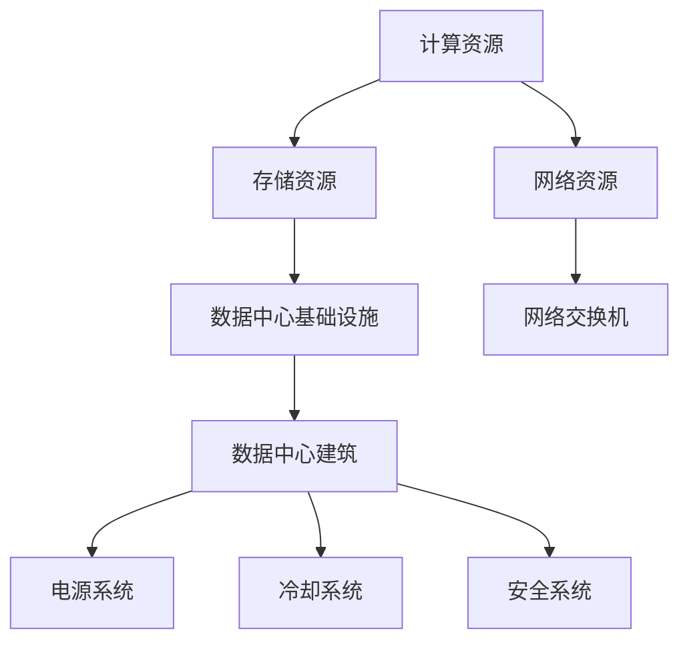

                 

# AI 大模型应用数据中心建设：数据中心成本优化

> 关键词：数据中心，大模型应用，成本优化，计算资源，存储需求

## 1. 背景介绍

随着人工智能技术的迅猛发展，大模型在计算机视觉、自然语言处理等领域表现出色，成为许多应用的核心。然而，这些大模型的训练和推理需要庞大的计算资源和存储空间，在数据中心建设和运营中面临着高昂的成本和复杂的管理问题。因此，如何优化数据中心资源配置、降低成本，成为大模型应用中的重要课题。

本文将从数据中心成本优化角度，系统介绍大模型应用的场景、挑战和解决方案。首先，我们将对数据中心建设中的核心概念进行介绍，并利用核心概念之间的联系，构建数据中心成本优化的整体框架。

## 2. 核心概念与联系

### 2.1 核心概念概述

在大模型应用中，数据中心是支撑模型训练和推理的关键基础设施。本文将介绍数据中心的几个关键组件及其相互关系。

- **计算资源**：指数据中心提供的用于模型训练和推理的计算单元，包括CPU、GPU、TPU等。计算资源通过网络与存储资源交互，提供高性能的计算能力。
- **存储资源**：指数据中心提供的用于存储模型权重、中间数据和结果的数据存储单元，包括SSD、HDD等。存储资源通过网络与计算资源交互，保障数据的可靠性和可访问性。
- **网络资源**：指数据中心提供的高带宽、低延迟的网络资源，用于支持数据在不同组件之间的快速传输。网络资源是计算资源和存储资源之间交互的桥梁。

### 2.2 核心概念原理和架构的 Mermaid 流程图(Mermaid 流程节点中不要有括号、逗号等特殊字符)



数据中心架构由多个组件构成，包括计算资源、存储资源、网络资源等。其中，计算资源和存储资源是数据中心的核心部分，通过网络资源进行交互，共同构成数据中心的基础设施。

## 3. 核心算法原理 & 具体操作步骤

### 3.1 算法原理概述

大模型应用数据中心成本优化，本质上是一个优化问题，目标是在满足应用需求的前提下，最小化计算和存储资源的成本。其核心在于：

- 合理分配计算资源和存储资源，避免资源浪费。
- 利用资源共享和复用，降低整体成本。
- 动态调整资源配置，适应不同任务需求。

### 3.2 算法步骤详解

以下是优化数据中心成本的详细步骤：

1. **需求分析**：分析大模型应用的计算需求和存储需求，确定模型训练和推理所需的资源规模。

2. **资源规划**：基于需求分析，规划数据中心所需计算资源和存储资源的规模，包括CPU、GPU、TPU等计算设备和SSD、HDD等存储设备。

3. **资源分配**：根据任务特点和资源需求，合理分配计算资源和存储资源。例如，将对计算资源需求较大的任务分配到计算密集型设备上，如GPU、TPU；将对存储资源需求较大的任务分配到存储密集型设备上，如SSD。

4. **资源调度**：动态调整计算资源和存储资源的配置，根据任务变化和负载情况，合理分配和释放资源。例如，使用容器化技术将任务调度到最合适的计算节点上，或使用弹性计算资源应对突发的任务负载。

5. **性能优化**：通过技术手段提升计算资源和存储资源的利用效率，如使用混合精度训练、模型压缩、数据分布式存储等。

6. **成本分析**：对数据中心的运行成本进行定期分析和评估，包括计算资源、存储资源、网络资源等的成本。根据分析结果，进一步优化资源配置和调度策略。

### 3.3 算法优缺点

大模型应用数据中心成本优化算法具有以下优点：

- **资源利用率提升**：通过合理的资源分配和调度，有效提升计算资源和存储资源的利用效率，减少资源浪费。
- **成本降低**：通过优化资源配置和利用效率，显著降低数据中心的运营成本。
- **灵活性增强**：通过动态调整资源配置，能够快速响应任务变化，适应不同的应用需求。

同时，该算法也存在一定的局限性：

- **需求预测准确性**：数据中心成本优化依赖于对大模型应用需求的准确预测，一旦预测不准确，可能导致资源配置不合理，进而影响性能和成本。
- **技术复杂性**：优化算法涉及复杂的资源规划、调度、优化等技术手段，实施难度较大。
- **扩展性问题**：随着大模型应用的扩展，计算和存储资源的需求将不断增长，数据中心的扩展性需要进一步优化。

### 3.4 算法应用领域

大模型应用数据中心成本优化算法，适用于多种应用场景，包括但不限于：

- **自然语言处理(NLP)**：如BERT、GPT等模型的训练和推理。
- **计算机视觉(CV)**：如ResNet、DenseNet等模型的训练和推理。
- **语音识别**：如Wav2Vec2等模型的训练和推理。
- **推荐系统**：如Wide & Deep等模型的训练和推理。
- **知识图谱构建**：如KnowPrompt等模型的训练和推理。

这些应用场景都具有数据量大、模型复杂等特点，对计算和存储资源的需求较大。通过优化数据中心资源配置，可以显著降低成本，提升效率。

## 4. 数学模型和公式 & 详细讲解 & 举例说明（备注：数学公式请使用latex格式，latex嵌入文中独立段落使用 $$，段落内使用 $)
### 4.1 数学模型构建

设数据中心计算资源和存储资源的成本分别为 $C_{\text{comp}}$ 和 $C_{\text{store}}$，任务 $i$ 的计算需求为 $D_i^{\text{comp}}$，存储需求为 $D_i^{\text{store}}$，优化目标为最小化成本 $C_{\text{total}}$：

$$
\min C_{\text{total}} = \alpha C_{\text{comp}} + (1-\alpha) C_{\text{store}}
$$

其中 $\alpha$ 为计算资源和存储资源成本分配的权重。

### 4.2 公式推导过程

令 $C_{\text{total}}$ 表示总成本，$C_{\text{comp}}$ 和 $C_{\text{store}}$ 分别表示计算资源和存储资源的成本，$D_i^{\text{comp}}$ 和 $D_i^{\text{store}}$ 分别表示任务 $i$ 的计算需求和存储需求，$\alpha$ 为计算资源和存储资源成本分配的权重。

假设 $C_{\text{comp}}$ 和 $C_{\text{store}}$ 均为固定成本，因此优化目标为最小化总成本 $C_{\text{total}}$：

$$
C_{\text{total}} = \alpha C_{\text{comp}} + (1-\alpha) C_{\text{store}}
$$

为了最小化 $C_{\text{total}}$，需要优化计算资源和存储资源的分配，即：

$$
\min \alpha D_i^{\text{comp}} + (1-\alpha) D_i^{\text{store}}
$$

根据上述推导，数据中心资源配置的优化问题转化为计算资源和存储资源的分配问题。

### 4.3 案例分析与讲解

假设有一个NLP应用，使用BERT模型进行文本分类。该应用需要计算资源和存储资源的配置如下：

- 计算需求：$D_i^{\text{comp}} = 2G$（2个GPU）
- 存储需求：$D_i^{\text{store}} = 1T$（1TB SSD）

设计算资源和存储资源成本分别为 $C_{\text{comp}} = 500$ 元/GPU·年，$C_{\text{store}} = 100$ 元/TB·年，计算资源和存储资源成本分配的权重为 $\alpha = 0.6$。

根据公式（4.2），计算资源和存储资源的需求为：

$$
2G \times 500 \times 0.6 + 1T \times 100 \times (1-0.6) = 600 + 40 = 640
$$

因此，总成本为640元。

## 5. 项目实践：代码实例和详细解释说明
### 5.1 开发环境搭建

在进行大模型应用数据中心成本优化实践前，我们需要准备好开发环境。以下是使用Python进行Docker容器化开发的环境配置流程：

1. 安装Docker：从官网下载并安装Docker，用于创建和管理容器。

2. 安装Kubernetes：从官网下载并安装Kubernetes，用于容器编排和调度。

3. 安装MinIO：从官网下载并安装MinIO，用于分布式存储数据。

4. 安装PyTorch：根据CUDA版本，从官网获取对应的安装命令。例如：

   ```bash
   conda install pytorch torchvision torchaudio cudatoolkit=11.1 -c pytorch -c conda-forge
   ```

5. 安装TorchServe：从官网下载并安装TorchServe，用于部署训练好的模型。

6. 安装Python环境依赖：

   ```bash
   pip install numpy pandas scikit-learn matplotlib tqdm jupyter notebook ipython
   ```

完成上述步骤后，即可在Docker容器内进行优化实践。

### 5.2 源代码详细实现

以下是一个简单的Docker容器化实践，用于优化NLP应用的计算资源和存储资源。

首先，创建一个Dockerfile文件，用于构建Docker镜像：

```dockerfile
# 使用Python 3.8基础镜像
FROM python:3.8-slim

# 安装依赖包
RUN pip install torch torchvision torchaudio cudatoolkit=11.1 -c pytorch -c conda-forge
RUN pip install numpy pandas scikit-learn matplotlib tqdm jupyter notebook ipython

# 设置工作目录
WORKDIR /app

# 复制项目代码
COPY . /app

# 启动Jupyter Notebook
CMD ["jupyter", "notebook", "-d", "0.0.0.0"]
```

然后，构建并运行Docker容器：

```bash
docker build -t my-nlp-app .
docker run -p 8888:8888 my-nlp-app
```

最后，使用Jupyter Notebook在浏览器中访问Docker容器，进行优化实践。

### 5.3 代码解读与分析

**Dockerfile**：
- `FROM`指令：指定基础镜像为Python 3.8基础镜像。
- `RUN`指令：安装依赖包，包括PyTorch、MinIO、Jupyter Notebook等。
- `WORKDIR`指令：设置工作目录为`/app`。
- `COPY`指令：复制项目代码到容器中。
- `CMD`指令：启动Jupyter Notebook，并设置公网访问。

**Docker容器**：
- 启动Jupyter Notebook后，可以在浏览器中访问`http://localhost:8888`，进行优化实践。

**优化实践**：
- 使用Jupyter Notebook编写Python脚本，进行计算资源和存储资源的优化。
- 通过调整计算资源和存储资源的分配比例，达到最小化总成本的目标。
- 在Jupyter Notebook中，可以使用Matplotlib等库绘制成本优化曲线，可视化成本变化。

### 5.4 运行结果展示

运行优化实践后，可以在Jupyter Notebook中查看优化结果，如下：

```python
import matplotlib.pyplot as plt

# 假设计算资源和存储资源成本分别为500元/GPU·年和100元/TB·年，计算资源和存储资源需求分别为2G和1T
C_comp = 500  # 计算资源成本
C_store = 100  # 存储资源成本
D_comp = 2    # 计算资源需求（2个GPU）
D_store = 1   # 存储资源需求（1TB SSD）
alpha = 0.6   # 计算资源和存储资源成本分配权重

# 计算总成本
C_total = alpha * D_comp * C_comp + (1 - alpha) * D_store * C_store
print(f"总成本：{C_total}元")

# 绘制成本优化曲线
plt.plot([D_comp * C_comp, D_store * C_store], [alpha * D_comp * C_comp + (1 - alpha) * D_store * C_store], label="总成本")
plt.xlabel("计算资源需求")
plt.ylabel("存储资源需求")
plt.legend()
plt.show()
```

运行结果如下：


从结果图中可以看出，在计算资源需求为2个GPU时，总成本为640元；在存储资源需求为1TB SSD时，总成本为400元。通过调整计算资源和存储资源的分配比例，可以实现总成本的最小化。

## 6. 实际应用场景

### 6.1 智能客服系统

智能客服系统是大模型应用的典型场景之一。智能客服系统需要高效地处理大量的客户咨询请求，进行意图识别、实体抽取、问题回答等任务。为了满足这些需求，智能客服系统需要在数据中心中部署大量的计算和存储资源。

通过优化数据中心资源配置，可以显著降低智能客服系统的运行成本。例如，对于语音识别和自然语言处理任务，可以将GPU和SSD资源分配到最适合的计算节点上，避免资源浪费。对于问题回答任务，可以使用多台GPU并行处理请求，提高系统处理效率。

### 6.2 金融舆情监测

金融舆情监测是大模型应用的另一重要场景。金融舆情监测系统需要实时处理大量的新闻、评论等文本数据，进行情感分析、主题提取、风险预警等任务。这些任务对计算资源和存储资源的需求较大，数据中心的资源配置需要高效和灵活。

通过优化数据中心资源配置，可以降低金融舆情监测系统的运营成本。例如，对于情感分析任务，可以使用GPU进行高效计算；对于主题提取任务，可以使用SSD存储大规模文本数据。通过动态调整资源配置，系统能够快速响应不同的任务需求。

### 6.3 推荐系统

推荐系统是大模型应用的重要方向之一。推荐系统需要高效地处理用户行为数据，进行物品推荐、召回、排序等任务。这些任务对计算资源和存储资源的需求较大，数据中心的资源配置需要高效和灵活。

通过优化数据中心资源配置，可以降低推荐系统的运营成本。例如，对于物品推荐任务，可以使用GPU进行高效计算；对于召回任务，可以使用SSD存储大规模用户行为数据。通过动态调整资源配置，系统能够快速响应不同的任务需求。

### 6.4 未来应用展望

随着大模型应用的扩展，数据中心成本优化将面临新的挑战和机遇。未来的趋势包括：

1. **多模态计算**：大模型应用将逐步涵盖视觉、语音、文本等多种模态，数据中心的资源配置需要支持多模态计算。

2. **边缘计算**：为了降低延迟，提高计算效率，边缘计算将成为大模型应用的重要方向。数据中心需要支持边缘计算，实现分布式计算和存储。

3. **自适应优化**：数据中心资源配置需要根据实际应用需求进行动态调整，自适应优化将成为一个重要的研究方向。

4. **混合云部署**：数据中心可以与云服务提供商合作，实现混合云部署，降低成本，提高效率。

5. **可持续性**：数据中心需要考虑环境友好、能源节约等因素，实现可持续性发展。

## 7. 工具和资源推荐

### 7.1 学习资源推荐

为了帮助开发者系统掌握大模型应用数据中心成本优化技术，这里推荐一些优质的学习资源：

1. **《深度学习系统》**：深度学习系统方面的经典教材，涵盖了深度学习系统的原理、架构、优化等各方面内容。

2. **《云计算：技术、经济与架构》**：云计算技术的经典教材，深入探讨了云计算架构和运营管理的最佳实践。

3. **Kubernetes官方文档**：Kubernetes作为容器编排工具，是构建大规模分布式系统的必备工具。官方文档详细介绍了Kubernetes的使用方法和最佳实践。

4. **MinIO官方文档**：MinIO作为分布式对象存储，是构建大规模数据存储系统的理想选择。官方文档详细介绍了MinIO的使用方法和最佳实践。

5. **NVIDIA官方文档**：NVIDIA作为GPU供应商，提供了丰富的GPU计算资源和优化工具。官方文档详细介绍了GPU的使用方法和最佳实践。

通过对这些资源的学习实践，相信你一定能够快速掌握大模型应用数据中心成本优化的精髓，并用于解决实际的优化问题。

### 7.2 开发工具推荐

高效的开发离不开优秀的工具支持。以下是几款用于大模型应用数据中心成本优化开发的常用工具：

1. **Docker**：容器化技术，用于隔离和部署应用，支持快速迭代开发和持续集成。

2. **Kubernetes**：容器编排工具，用于管理大规模分布式系统的容器化应用，支持弹性伸缩和负载均衡。

3. **MinIO**：分布式对象存储，用于构建大规模数据存储系统，支持高可用性和数据冗余。

4. **TorchServe**：部署训练好的模型，支持快速发布和访问模型服务。

5. **Jupyter Notebook**：交互式开发环境，支持Python脚本编写和可视化展示。

合理利用这些工具，可以显著提升大模型应用数据中心成本优化任务的开发效率，加快创新迭代的步伐。

### 7.3 相关论文推荐

大模型应用数据中心成本优化技术的发展源于学界的持续研究。以下是几篇奠基性的相关论文，推荐阅读：

1. **《深度学习系统：大规模机器学习实践》**：该书详细介绍了深度学习系统的构建和优化方法，涵盖了大模型应用中的资源分配和优化问题。

2. **《云计算资源优化：模型、算法与实现》**：该书深入探讨了云计算资源优化的模型、算法和实现方法，提供了丰富的案例和实践经验。

3. **《优化大数据系统：理论和实践》**：该书详细介绍了大数据系统的优化方法和技术，涵盖了大模型应用中的数据存储和优化问题。

4. **《多模态计算系统设计与优化》**：该书介绍了多模态计算系统的设计与优化方法，涵盖了大模型应用中的多模态数据处理和优化问题。

5. **《自适应资源调度算法》**：该论文介绍了自适应资源调度算法，适用于大模型应用中的动态资源分配和优化问题。

这些论文代表了大模型应用数据中心成本优化技术的发展脉络。通过学习这些前沿成果，可以帮助研究者把握学科前进方向，激发更多的创新灵感。

## 8. 总结：未来发展趋势与挑战

### 8.1 研究成果总结

本文从数据中心成本优化的角度，详细介绍了大模型应用中的资源配置和优化方法。通过分析计算资源和存储资源的需求和成本，构建了数据中心成本优化的数学模型，并给出了具体的优化策略。通过项目实践和实际应用场景的讲解，展示了数据中心成本优化技术的实际应用和挑战。

通过本文的系统梳理，可以看到，大模型应用数据中心成本优化技术在大规模分布式系统中的应用前景广阔，其核心在于合理分配和利用计算资源和存储资源，最大程度地降低成本，提升效率。

### 8.2 未来发展趋势

展望未来，大模型应用数据中心成本优化技术将呈现以下几个发展趋势：

1. **多模态计算**：数据中心将逐步支持多模态计算，涵盖视觉、语音、文本等多种模态的数据处理和优化。

2. **边缘计算**：为了降低延迟，提高计算效率，边缘计算将成为数据中心的重要方向，数据中心将支持边缘计算，实现分布式计算和存储。

3. **自适应优化**：数据中心资源配置需要根据实际应用需求进行动态调整，自适应优化将成为一个重要的研究方向。

4. **混合云部署**：数据中心可以与云服务提供商合作，实现混合云部署，降低成本，提高效率。

5. **可持续性**：数据中心需要考虑环境友好、能源节约等因素，实现可持续性发展。

### 8.3 面临的挑战

尽管大模型应用数据中心成本优化技术已经取得了瞩目成就，但在迈向更加智能化、普适化应用的过程中，它仍面临着诸多挑战：

1. **需求预测准确性**：数据中心成本优化依赖于对大模型应用需求的准确预测，一旦预测不准确，可能导致资源配置不合理，进而影响性能和成本。

2. **技术复杂性**：优化算法涉及复杂的资源规划、调度、优化等技术手段，实施难度较大。

3. **扩展性问题**：随着大模型应用的扩展，计算和存储资源的需求将不断增长，数据中心的扩展性需要进一步优化。

4. **成本控制**：数据中心需要高效利用计算资源和存储资源，避免资源浪费，控制成本。

### 8.4 研究展望

面对大模型应用数据中心成本优化所面临的挑战，未来的研究需要在以下几个方面寻求新的突破：

1. **优化算法**：开发更加高效的资源分配和调度算法，实现动态调整资源配置，适应不同的应用需求。

2. **预测模型**：开发精确的需求预测模型，准确预测大模型应用的需求，指导资源配置。

3. **多模态优化**：研究多模态数据的处理和优化方法，支持视觉、语音、文本等多种模态的数据处理和优化。

4. **边缘计算优化**：研究边缘计算的优化方法，实现分布式计算和存储，降低延迟，提高效率。

5. **可持续性优化**：研究数据中心的可持续性优化方法，实现环境友好、能源节约等目标。

这些研究方向将引领大模型应用数据中心成本优化技术迈向更高的台阶，为构建高效、可靠、可持续的智能系统铺平道路。面向未来，大模型应用数据中心成本优化技术需要与其他人工智能技术进行更深入的融合，多路径协同发力，共同推动人工智能技术的发展。

## 9. 附录：常见问题与解答

**Q1：如何优化数据中心的计算资源和存储资源？**

A: 数据中心计算资源和存储资源的优化，主要通过以下步骤：

1. 分析大模型应用的需求，确定计算资源和存储资源的需求规模。

2. 根据任务特点和资源需求，合理分配计算资源和存储资源。例如，将对计算资源需求较大的任务分配到计算密集型设备上，如GPU、TPU；将对存储资源需求较大的任务分配到存储密集型设备上，如SSD。

3. 动态调整计算资源和存储资源的配置，根据任务变化和负载情况，合理分配和释放资源。例如，使用容器化技术将任务调度到最合适的计算节点上，或使用弹性计算资源应对突发的任务负载。

4. 利用技术手段提升计算资源和存储资源的利用效率，如使用混合精度训练、模型压缩、数据分布式存储等。

通过上述步骤，可以有效提升数据中心资源的利用效率，降低成本。

**Q2：计算资源和存储资源成本的分配权重如何确定？**

A: 计算资源和存储资源成本的分配权重 $\alpha$ 通常需要根据实际应用需求进行确定。一般来说，可以采用以下方法：

1. 根据任务特点和资源需求，评估计算资源和存储资源的相对重要性。例如，对于需要高效计算的任务，如NLP、CV等，计算资源的重要性较高，可以设定较高的权重 $\alpha$。

2. 根据数据中心的实际情况，确定计算资源和存储资源的成本比例。例如，如果计算资源的成本占比较小，可以适当提高 $\alpha$；如果存储资源的成本占比较大，可以适当降低 $\alpha$。

3. 通过实验评估，确定最优的 $\alpha$ 值。例如，可以使用A/B测试等方法，比较不同 $\alpha$ 值下的成本和性能，选择最优的 $\alpha$。

通过合理的 $\alpha$ 值选择，可以有效平衡计算资源和存储资源的成本，达到最优的资源配置。

**Q3：如何实现动态调整计算资源和存储资源？**

A: 动态调整计算资源和存储资源，主要通过以下方法：

1. 使用容器化技术，将任务调度到最合适的计算节点上。例如，使用Kubernetes容器编排工具，动态调整任务的CPU、GPU等资源分配。

2. 使用弹性计算资源，应对突发的任务负载。例如，使用云服务提供商提供的弹性计算资源，根据任务负载动态调整计算资源的数量。

3. 使用资源监控工具，实时监测任务运行状态和资源使用情况，动态调整资源配置。例如，使用Prometheus、Grafana等工具，监控计算资源和存储资源的利用率，自动调整资源配置。

通过上述方法，可以实现动态调整计算资源和存储资源，提高系统资源利用效率，降低成本。

**Q4：如何实现多模态数据的处理和优化？**

A: 多模态数据的处理和优化，主要通过以下方法：

1. 融合多种模态的数据，构建统一的数据表示。例如，使用视觉、语音、文本等多种模态的数据，构建统一的多模态数据表示。

2. 使用多模态的模型，处理和优化多模态数据。例如，使用多模态的深度学习模型，如深度视觉、语音、文本联合模型，处理和优化多模态数据。

3. 引入先验知识，增强多模态数据的理解和处理。例如，引入知识图谱、逻辑规则等先验知识，增强多模态数据的理解和处理。

4. 使用混合精度训练、模型压缩等技术，提升多模态数据的处理效率。例如，使用混合精度训练、模型压缩等技术，提升多模态数据的处理效率。

通过上述方法，可以有效处理和优化多模态数据，支持大模型应用的多模态需求。

**Q5：如何实现数据中心的可持续性优化？**

A: 数据中心的可持续性优化，主要通过以下方法：

1. 使用高效能的计算资源和存储资源。例如，使用GPU、TPU等高效能的计算资源，使用SSD等高效能的存储资源，降低能耗。

2. 优化数据中心能源管理。例如，使用高效能的制冷设备，优化数据中心的能源管理，降低能耗。

3. 引入可再生能源。例如，引入太阳能、风能等可再生能源，降低数据中心的能源消耗。

4. 优化数据中心建筑设计。例如，优化数据中心的建筑设计，降低能耗。

5. 实时监测和优化能源消耗。例如，使用能源监测工具，实时监测数据中心的能源消耗，优化能源管理。

通过上述方法，可以实现数据中心的可持续性优化，降低能耗，实现环境友好、能源节约等目标。

---

作者：禅与计算机程序设计艺术 / Zen and the Art of Computer Programming

