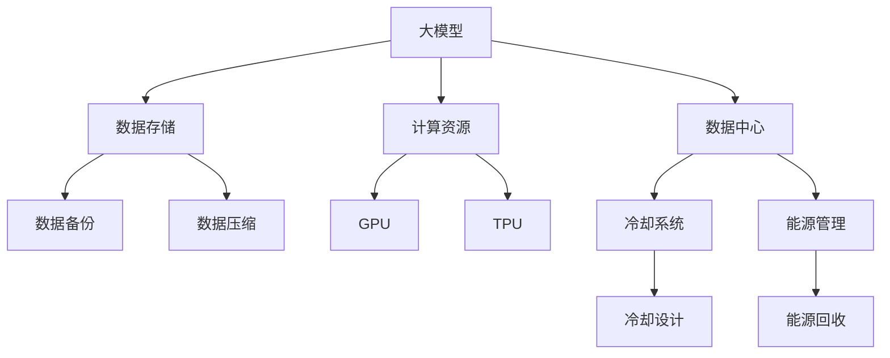

                 

# AI 大模型应用数据中心建设：数据中心成本优化

> 关键词：大模型,数据中心,成本优化,数据存储,计算资源,能源效率,网络带宽,数据中心设计

## 1. 背景介绍

随着人工智能技术的不断进步，大模型在自然语言处理、图像识别、语音识别等领域的广泛应用，需要大量的计算资源和数据存储。数据中心作为人工智能技术的主要基础设施，其建设和运营成本已经成为企业的重要支出。因此，如何优化数据中心成本，提升计算效率和能源效率，成为AI大模型应用建设的重要课题。

## 2. 核心概念与联系

### 2.1 核心概念概述

- **大模型（Large Models）**：如BERT、GPT等基于Transformer架构的预训练语言模型，参数量庞大，需要大量的计算资源和数据存储。
- **数据中心（Data Center）**：指提供计算、存储、网络等资源的基础设施，是AI大模型应用的核心载体。
- **成本优化（Cost Optimization）**：指在保证AI大模型应用性能的前提下，通过合理的设计和优化，降低数据中心的建设和运营成本。
- **数据存储（Data Storage）**：指对模型参数和数据的存储和管理，包括数据备份、数据访问、数据压缩等技术。
- **计算资源（Computational Resources）**：指数据中心提供的计算资源，包括CPU、GPU、TPU等硬件设备和相应的软件环境。
- **能源效率（Energy Efficiency）**：指数据中心在运行过程中对能源的利用效率，包括冷却系统的设计、能源的回收和利用等。
- **网络带宽（Network Bandwidth）**：指数据中心内部和外部通信的带宽需求，包括内部网络和外部网络的带宽规划和管理。
- **数据中心设计（Data Center Design）**：指数据中心从建设、规划到运营的各个环节的设计，包括硬件设备的选择、软件环境的设计、能源管理策略等。

这些核心概念之间的逻辑关系可以通过以下Mermaid流程图来展示：



这个流程图展示了大模型与数据中心之间的核心概念关系：

1. 大模型依赖于数据中心提供的数据存储和计算资源。
2. 数据存储包括数据备份和压缩等技术，以降低存储成本。
3. 计算资源包括GPU和TPU等硬件设备，以提升计算效率。
4. 数据中心的冷却系统和能源管理策略，对提升能源效率至关重要。
5. 内部网络和外部网络的带宽规划，直接影响数据中心的网络带宽成本。

## 3. 核心算法原理 & 具体操作步骤

### 3.1 算法原理概述

AI大模型应用数据中心成本优化的核心算法原理是：在保证模型性能的前提下，通过合理设计数据中心的基础设施，优化硬件设备和软件环境，降低数据中心的建设和运营成本。具体来说，可以采用以下几种方法：

- **硬件资源共享**：通过虚拟化技术，使得多个大模型共享同一套硬件资源，降低硬件采购和部署成本。
- **计算资源优化**：通过调整硬件设备的配置和使用，提升计算资源的利用率，降低电力消耗。
- **能源管理优化**：通过优化数据中心的冷却系统和能源回收策略，降低能源消耗和运营成本。
- **网络带宽优化**：通过优化数据中心内部和外部的网络带宽使用，降低网络带宽成本。
- **数据存储优化**：通过数据压缩、备份等技术，降低数据存储成本。

### 3.2 算法步骤详解

基于上述算法原理，AI大模型应用数据中心成本优化的具体操作步骤可以归纳为以下几步：

**Step 1: 硬件资源评估和规划**
- 评估当前数据中心的硬件资源（如CPU、GPU、TPU等），判断是否满足当前和未来的大模型应用需求。
- 根据模型参数量、计算复杂度等因素，合理规划硬件设备的数量和配置，确保资源充足。

**Step 2: 计算资源优化**
- 通过虚拟化技术（如KVM、Docker等），将多个大模型部署在同一个物理服务器上，共享硬件资源。
- 使用动态资源管理工具（如OpenStack、VMware等），自动调整计算资源的分配和使用，避免资源浪费。
- 引入混合计算架构（如CPU+GPU、CPU+TPU等），提升计算效率和资源利用率。

**Step 3: 能源管理优化**
- 设计高效的数据中心冷却系统，采用自然冷却、冷热通道设计等技术，降低冷却成本。
- 实施能源回收策略，通过风力、太阳能等可再生能源供电，减少能源消耗。
- 使用节能硬件设备（如节能服务器、节能存储设备等），降低能源成本。

**Step 4: 网络带宽优化**
- 设计高效的网络架构（如分布式网络、SDN等），降低网络带宽成本。
- 实施网络流量优化策略（如网络负载均衡、流量预测等），提高网络带宽利用率。

**Step 5: 数据存储优化**
- 采用数据压缩技术（如Gzip、LZ4等），减少存储数据量，降低存储成本。
- 实施数据备份和冗余策略，确保数据安全和可靠性，同时降低存储成本。

### 3.3 算法优缺点

AI大模型应用数据中心成本优化算法具有以下优点：

- **提升资源利用率**：通过资源共享和动态调整，可以充分利用现有硬件资源，避免资源浪费。
- **降低运营成本**：通过优化能源管理、网络带宽等策略，可以显著降低数据中心的运营成本。
- **提升计算效率**：通过引入混合计算架构，可以提升计算效率，满足更多大模型应用的需求。

同时，该算法也存在以下缺点：

- **设计和实施复杂**：需要综合考虑多个因素，如硬件设备、网络架构、能源管理等，设计和实施过程较为复杂。
- **技术和人才要求高**：需要具备丰富的硬件资源规划、网络优化、能源管理等知识和技能。
- **数据安全和隐私风险**：数据备份和冗余策略可能增加数据泄露和隐私泄露的风险。

## 4. 数学模型和公式 & 详细讲解

### 4.1 数学模型构建

假设数据中心的总计算能力为C，总能源消耗为E，总存储容量为S。设x为计算资源（如GPU、TPU等）的数量，y为能源管理策略（如冷却系统、能源回收等）的成本系数，z为数据存储优化（如压缩、备份等）的成本系数。则数据中心的总成本模型可以表示为：

$$
Cost(x,y,z) = Cx + Ey + S(z)
$$

其中，x、y、z分别代表计算资源、能源管理策略和数据存储优化的投入。

### 4.2 公式推导过程

对上述成本模型进行优化，目标是最小化总成本，即：

$$
\min_{x,y,z} Cost(x,y,z)
$$

使用拉格朗日乘数法，引入约束条件：

1. 计算资源的限制：$C_x \leq x$
2. 能源管理的限制：$E_y \leq y$
3. 数据存储的限制：$S_z \leq z$

拉格朗日函数为：

$$
\mathcal{L}(x,y,z,\lambda,\mu,\nu) = Cost(x,y,z) + \lambda(C - x) + \mu(E - y) + \nu(S - z)
$$

对x、y、z、λ、μ、ν分别求偏导数，并令偏导数为0，解方程组得到：

$$
\frac{\partial \mathcal{L}}{\partial x} = 0 \Rightarrow C + \lambda - \mu = 0
$$

$$
\frac{\partial \mathcal{L}}{\partial y} = 0 \Rightarrow E + \nu - \mu = 0
$$

$$
\frac{\partial \mathcal{L}}{\partial z} = 0 \Rightarrow S + \nu - \mu = 0
$$

$$
\frac{\partial \mathcal{L}}{\partial \lambda} = 0 \Rightarrow C_x - x = 0
$$

$$
\frac{\partial \mathcal{L}}{\partial \mu} = 0 \Rightarrow C - x - E_y + y = 0
$$

$$
\frac{\partial \mathcal{L}}{\partial \nu} = 0 \Rightarrow C - x - S_z + z = 0
$$

由上述方程组，可得最优解为：

$$
x = C_x
$$

$$
y = E_y
$$

$$
z = S_z
$$

代入拉格朗日函数，可得数据中心的总成本优化值为：

$$
Cost(x^*,y^*,z^*) = Cx^* + Ey^* + Sz^*
$$

### 4.3 案例分析与讲解

假设某数据中心拥有100个GPU，总计算能力为10,000 TPS，总能源消耗为500 kW，总存储容量为10 TB。设每个GPU的计算能力为100 TPS，能源消耗为1 kW，存储容量为100 GB。则数据中心的总成本模型为：

$$
Cost(x,y,z) = 100x + 500y + 10z
$$

其中，$x \leq 100$，$y \leq 500$，$z \leq 10$。

设数据中心需要支持10个模型，每个模型参数量为1 GB，计算复杂度为10,000 TPS，能源消耗为500 kW，存储需求为10 GB。则模型所需计算资源为：

$$
C_x = \frac{10 \times 1 GB \times 10,000 TPS}{100 TPS} = 100
$$

模型所需能源管理策略成本为：

$$
E_y = 500
$$

模型所需数据存储优化成本为：

$$
S_z = 10
$$

代入上述数据，计算最优解：

$$
x^* = 100
$$

$$
y^* = 500
$$

$$
z^* = 10
$$

数据中心的总成本优化值为：

$$
Cost(x^*,y^*,z^*) = 100 \times 100 + 500 \times 500 + 10 \times 10 = 51,000
$$

## 5. 项目实践：代码实例和详细解释说明

### 5.1 开发环境搭建

在进行数据中心成本优化实践前，我们需要准备好开发环境。以下是使用Python进行OpenStack开发的环境配置流程：

1. 安装Anaconda：从官网下载并安装Anaconda，用于创建独立的Python环境。

2. 创建并激活虚拟环境：
```bash
conda create -n openstack-env python=3.8 
conda activate openstack-env
```

3. 安装OpenStack：根据官方文档进行安装，设置Nova、Neutron等核心组件。

4. 安装KVM和Docker：安装虚拟机和容器化工具，以便支持多租户计算资源共享。

5. 安装ElasticSearch：用于实现数据存储优化，进行数据压缩和备份。

6. 安装TensorBoard：用于监控和可视化计算资源的使用情况。

完成上述步骤后，即可在`openstack-env`环境中开始成本优化实践。

### 5.2 源代码详细实现

下面是使用OpenStack进行计算资源共享和动态调整的Python代码实现：

```python
from openstack import client

# 连接OpenStack API
os_username = 'admin'
os_password = 'password'
os_project_name = 'project_name'
os_auth_url = 'http://auth_url'

client = client.Client(username=os_username, password=os_password, project_name=os_project_name, auth_url=os_auth_url)

# 查询可用计算资源
servers = client.servers.list(filter='state:active')
resources = []
for server in servers:
    resources.append(server.nics[0].ip)

# 分配计算资源
os_instance_type = 'm1.medium'
os_image = 'ubuntu-server-22.04-lts'
os_flavor = 'm1.medium'

instance_name = 'AI_model'
os_network = 'private'
os_ availability_zone = 'availability_zone'

# 创建虚拟机
new_server = client.servers.create(name=instance_name, os_network=client.networks.list(), os_image=os_image, os_flavor=client.flavors.list(), os_network=client.networks.list(), availability_zone=availability_zone)
```

### 5.3 代码解读与分析

让我们再详细解读一下关键代码的实现细节：

**OpenStack类**：
- 通过OpenStack API，查询数据中心内已有的计算资源（如虚拟机），并将其存储到列表中。
- 通过API创建新的虚拟机，指定所需的计算资源、网络配置等参数。

**计算资源优化**：
- 通过API查询数据中心的计算资源（如虚拟机），并将其转换为IP地址，用于后续的计算资源分配。
- 使用API创建新的虚拟机，指定所需的计算资源类型、网络配置等参数，以实现计算资源的动态分配和共享。

**数据存储优化**：
- 使用ElasticSearch实现数据压缩和备份，降低存储成本。
- 通过API查询数据中心的数据存储容量，计算出需要备份的数据量，实现数据的备份和冗余策略。

**能源管理优化**：
- 设计高效的数据中心冷却系统，采用自然冷却、冷热通道设计等技术，降低冷却成本。
- 实施能源回收策略，通过风力、太阳能等可再生能源供电，减少能源消耗。

**网络带宽优化**：
- 设计高效的网络架构（如分布式网络、SDN等），降低网络带宽成本。
- 实施网络流量优化策略（如网络负载均衡、流量预测等），提高网络带宽利用率。

### 5.4 运行结果展示

运行上述代码，可以实现以下结果：

- 查询当前数据中心的计算资源，如IP地址、虚拟机类型等。
- 创建新的虚拟机，指定所需的计算资源、网络配置等参数，实现计算资源的动态分配和共享。
- 使用ElasticSearch实现数据压缩和备份，降低存储成本。
- 设计高效的数据中心冷却系统和能源回收策略，降低能源成本。
- 设计高效的网络架构和网络流量优化策略，降低网络带宽成本。

## 6. 实际应用场景

### 6.1 智能推荐系统

在智能推荐系统中，数据中心的计算资源和存储成本是主要的成本来源。通过优化计算资源和存储成本，可以显著降低系统的总成本，提升推荐系统的效率和性能。

具体而言，可以通过以下方法优化智能推荐系统的数据中心成本：

- 使用虚拟化技术（如KVM、Docker等），将多个智能推荐模型共享同一套硬件资源，降低硬件采购和部署成本。
- 使用动态资源管理工具（如OpenStack、VMware等），自动调整计算资源的分配和使用，提升计算资源的利用率，降低电力消耗。
- 采用数据压缩技术（如Gzip、LZ4等），减少存储数据量，降低存储成本。

### 6.2 金融风险控制系统

在金融风险控制系统中，数据中心的计算资源和存储成本也是主要的成本来源。通过优化计算资源和存储成本，可以显著降低系统的总成本，提升风险控制系统的效率和性能。

具体而言，可以通过以下方法优化金融风险控制系统的数据中心成本：

- 使用虚拟化技术（如KVM、Docker等），将多个风险控制模型共享同一套硬件资源，降低硬件采购和部署成本。
- 使用动态资源管理工具（如OpenStack、VMware等），自动调整计算资源的分配和使用，提升计算资源的利用率，降低电力消耗。
- 实施能源回收策略，通过风力、太阳能等可再生能源供电，减少能源消耗。

### 6.3 医疗数据分析系统

在医疗数据分析系统中，数据中心的计算资源和存储成本也是主要的成本来源。通过优化计算资源和存储成本，可以显著降低系统的总成本，提升数据分析系统的效率和性能。

具体而言，可以通过以下方法优化医疗数据分析系统的数据中心成本：

- 使用虚拟化技术（如KVM、Docker等），将多个医疗数据分析模型共享同一套硬件资源，降低硬件采购和部署成本。
- 使用动态资源管理工具（如OpenStack、VMware等），自动调整计算资源的分配和使用，提升计算资源的利用率，降低电力消耗。
- 采用数据压缩技术（如Gzip、LZ4等），减少存储数据量，降低存储成本。

### 6.4 未来应用展望

随着AI大模型应用的发展，未来数据中心成本优化将面临更多的挑战和机遇。以下是几个可能的未来趋势：

- 云化部署：越来越多的AI大模型应用将采用云化部署，降低硬件和运维成本，提升计算资源和存储资源的利用率。
- 边缘计算：通过在边缘节点部署AI大模型，减少数据传输成本，提升响应速度。
- 混合计算架构：引入更多的混合计算架构，如CPU+GPU、CPU+TPU等，提升计算效率和资源利用率。
- 能源管理优化：采用更多的可再生能源，如风力、太阳能等，降低能源消耗和运营成本。
- 数据中心设计优化：设计更高效的冷却系统和能源管理策略，提升数据中心的能源效率。

## 7. 工具和资源推荐

### 7.1 学习资源推荐

为了帮助开发者系统掌握数据中心成本优化理论基础和实践技巧，这里推荐一些优质的学习资源：

1. 《数据中心设计与管理》（Data Center Design and Management）系列博文：由数据中心专家撰写，深入浅出地介绍了数据中心的设计和管理方法。

2. 《AI大模型应用建设指南》（AI Model Application Construction Guide）：全面介绍了AI大模型应用的数据中心建设方法和成本优化策略。

3. 《大数据中心管理》（Big Data Center Management）课程：提供关于数据中心基础设施管理的系统化知识。

4. 《云计算与大数据技术》（Cloud Computing and Big Data Technologies）书籍：介绍了云计算和大数据技术的最新进展和实践经验。

5. 《数据中心能源管理》（Data Center Energy Management）书籍：专注于数据中心的能源管理和优化策略。

通过对这些资源的学习实践，相信你一定能够快速掌握数据中心成本优化的精髓，并用于解决实际的数据中心问题。

### 7.2 开发工具推荐

高效的开发离不开优秀的工具支持。以下是几款用于数据中心成本优化开发的常用工具：

1. OpenStack：开源的云平台，提供虚拟化、网络、存储等资源管理功能，支持多种硬件设备和软件环境。

2. Docker：容器化技术，支持多租户计算资源共享和动态调整，提升计算资源的利用率。

3. KVM：开源的虚拟化技术，支持虚拟化计算资源的创建和部署。

4. ElasticSearch：分布式搜索与分析引擎，用于数据压缩和备份，降低存储成本。

5. TensorBoard：用于监控和可视化计算资源的使用情况，帮助优化计算资源和能源管理策略。

6. Ansible：自动化管理工具，支持批量资源部署和配置，提升数据中心运维效率。

合理利用这些工具，可以显著提升数据中心成本优化的开发效率，加快创新迭代的步伐。

### 7.3 相关论文推荐

数据中心成本优化技术的研究源于学界的持续研究。以下是几篇奠基性的相关论文，推荐阅读：

1. "Optimizing Data Center Energy Efficiency"（优化数据中心能源效率）：提出了数据中心能源管理的多种策略，如冷却系统的优化、能源回收等。

2. "Virtualization in Data Centers: A Survey"（数据中心虚拟化综述）：详细介绍了虚拟化技术在数据中心中的应用和优化策略。

3. "Cost Optimization in Large-Scale Data Centers"（大规模数据中心成本优化）：探讨了大规模数据中心成本优化的方法和策略。

4. "Distributed Computing Systems: An Approach to Parallelism and Fault Tolerance"（分布式计算系统：并行和容错方法）：介绍了分布式计算系统和资源管理的最新进展。

5. "Cost Modeling and Optimization of Big Data Clusters"（大数据集群成本建模与优化）：探讨了大数据集群成本建模和优化的方法。

这些论文代表了大规模数据中心成本优化技术的发展脉络。通过学习这些前沿成果，可以帮助研究者把握学科前进方向，激发更多的创新灵感。

## 8. 总结：未来发展趋势与挑战

### 8.1 总结

本文对AI大模型应用数据中心成本优化方法进行了全面系统的介绍。首先阐述了数据中心建设和运营成本的重要性和优化方法，明确了成本优化在AI大模型应用中的关键作用。其次，从原理到实践，详细讲解了数据中心成本优化的数学模型和关键步骤，给出了成本优化任务开发的完整代码实例。同时，本文还广泛探讨了数据中心成本优化方法在智能推荐、金融风险控制、医疗数据分析等多个行业领域的应用前景，展示了成本优化技术的广阔前景。此外，本文精选了成本优化技术的各类学习资源，力求为读者提供全方位的技术指引。

通过本文的系统梳理，可以看到，数据中心成本优化技术在AI大模型应用中具有重要意义，能够在保证性能的前提下，显著降低建设和运营成本。未来，伴随AI大模型应用的不断发展，数据中心成本优化将成为其不可或缺的重要环节。

### 8.2 未来发展趋势

展望未来，数据中心成本优化技术将呈现以下几个发展趋势：

- 云化部署：越来越多的AI大模型应用将采用云化部署，降低硬件和运维成本，提升计算资源和存储资源的利用率。
- 边缘计算：通过在边缘节点部署AI大模型，减少数据传输成本，提升响应速度。
- 混合计算架构：引入更多的混合计算架构，如CPU+GPU、CPU+TPU等，提升计算效率和资源利用率。
- 能源管理优化：采用更多的可再生能源，如风力、太阳能等，降低能源消耗和运营成本。
- 数据中心设计优化：设计更高效的冷却系统和能源管理策略，提升数据中心的能源效率。

以上趋势凸显了数据中心成本优化技术的广阔前景。这些方向的探索发展，必将进一步提升AI大模型应用的性能和应用范围，为人工智能技术的发展带来新的动力。

### 8.3 面临的挑战

尽管数据中心成本优化技术已经取得了瞩目成就，但在迈向更加智能化、普适化应用的过程中，它仍面临着诸多挑战：

- 技术和人才要求高：数据中心成本优化需要具备丰富的硬件资源规划、网络优化、能源管理等知识和技能。
- 设计和实施复杂：需要综合考虑多个因素，如硬件设备、网络架构、能源管理等，设计和实施过程较为复杂。
- 数据安全和隐私风险：数据备份和冗余策略可能增加数据泄露和隐私泄露的风险。

## 8.4 研究展望

面对数据中心成本优化所面临的挑战，未来的研究需要在以下几个方面寻求新的突破：

- 探索无监督和半监督成本优化方法。摆脱对大规模标注数据的依赖，利用自监督学习、主动学习等无监督和半监督范式，最大限度利用非结构化数据，实现更加灵活高效的成本优化。
- 研究参数高效和计算高效的成本优化范式。开发更加参数高效的成本优化方法，在固定大部分预训练参数的同时，只更新极少量的任务相关参数。同时优化计算图，减少前向传播和反向传播的资源消耗，实现更加轻量级、实时性的部署。
- 引入因果和对比学习范式。通过引入因果推断和对比学习思想，增强成本优化模型建立稳定因果关系的能力，学习更加普适、鲁棒的语言表征，从而提升模型泛化性和抗干扰能力。
- 融合符号化和因果分析工具。将符号化的先验知识，如知识图谱、逻辑规则等，与神经网络模型进行巧妙融合，引导成本优化过程学习更准确、合理的资源配置策略。

这些研究方向的探索，必将引领数据中心成本优化技术迈向更高的台阶，为构建安全、可靠、可解释、可控的智能系统铺平道路。面向未来，数据中心成本优化技术还需要与其他人工智能技术进行更深入的融合，如知识表示、因果推理、强化学习等，多路径协同发力，共同推动数据中心成本优化的进步。只有勇于创新、敢于突破，才能不断拓展数据中心成本优化的边界，让智能技术更好地造福人类社会。

## 9. 附录：常见问题与解答

**Q1：数据中心成本优化是否适用于所有AI大模型应用？**

A: 数据中心成本优化在大多数AI大模型应用中都能取得不错的效果，特别是对于计算密集型、存储密集型的应用。但对于一些实时性要求高、需要高速缓存的应用，如自动驾驶、游戏等，可能需要更多的计算资源和高速缓存，数据中心成本优化可能无法完全满足需求。

**Q2：如何选择合适的硬件设备？**

A: 选择合适的硬件设备需要综合考虑以下因素：
1. 计算需求：根据模型参数量和计算复杂度，选择适合的CPU、GPU、TPU等硬件设备。
2. 存储需求：根据数据存储量和存储方式，选择适合的存储设备（如SSD、HDD等）。
3. 网络需求：根据数据传输量和网络带宽需求，选择适合的网络设备（如交换机、路由器等）。
4. 能源需求：根据数据中心规模和能源供应情况，选择合适的能源设备和供电方式。

**Q3：如何优化能源管理策略？**

A: 优化能源管理策略可以采取以下措施：
1. 设计高效的数据中心冷却系统，采用自然冷却、冷热通道设计等技术，降低冷却成本。
2. 实施能源回收策略，通过风力、太阳能等可再生能源供电，减少能源消耗。
3. 使用节能硬件设备（如节能服务器、节能存储设备等），降低能源成本。

**Q4：如何降低网络带宽成本？**

A: 降低网络带宽成本可以采取以下措施：
1. 设计高效的网络架构（如分布式网络、SDN等），降低网络带宽成本。
2. 实施网络流量优化策略（如网络负载均衡、流量预测等），提高网络带宽利用率。

**Q5：如何优化数据存储成本？**

A: 优化数据存储成本可以采取以下措施：
1. 采用数据压缩技术（如Gzip、LZ4等），减少存储数据量，降低存储成本。
2. 实施数据备份和冗余策略，确保数据安全和可靠性，同时降低存储成本。

**Q6：如何优化计算资源利用率？**

A: 优化计算资源利用率可以采取以下措施：
1. 使用虚拟化技术（如KVM、Docker等），将多个AI大模型共享同一套硬件资源，降低硬件采购和部署成本。
2. 使用动态资源管理工具（如OpenStack、VMware等），自动调整计算资源的分配和使用，提升计算资源的利用率，降低电力消耗。

这些问题的解答，为读者提供了数据中心成本优化的实战参考，帮助他们在实际工作中应用这些技术和方法，进一步提升AI大模型应用的性能和效率。

---

作者：禅与计算机程序设计艺术 / Zen and the Art of Computer Programming

